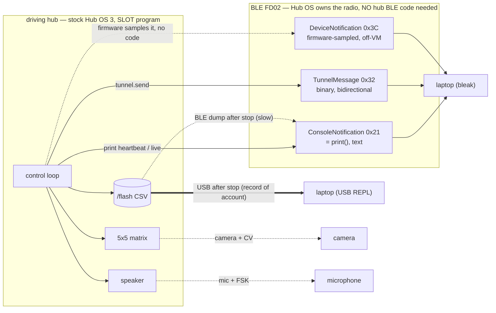

# Research — BLE while the motors run: the EXHAUSTIVE workaround set, and does it change the plan?

**Type:** EXTERNAL research + repo synthesis · **Created:** 2026-09-01 · **Status:** capstone synthesis,
**nothing here was run on our hub.** Every rate is COMPUTED from bracketed, still-`[UNVERIFIED]` link
parameters or quoted from a repo measurement; every protocol id/layout is from LEGO/spike-prime-docs
(primary). Marked `[UNVERIFIED]` wherever unsourced.

**Answers the operator's re-ask, verbatim intent:** *"do as much research as you can especially into the
bluetooth stuff like if there are ways around being able to use bluetooth while motors are in use."* This
is the **capstone** over three deep-dive passes done the same day — it does not re-derive them, it ranks
them against each other and asks the one question they each answered only for their own slice: **given ALL
of it, does the settled log-and-retrieve recommendation still stand, and is there one experiment that would
decide?**

**This EXTENDS, and does not repeat, [telemetry-while-driving.md](./telemetry-while-driving.md)** — the
settled architecture — and it **consolidates** three companion passes, each of which owns its topic in full
depth. Read this for the ranking and the verdict; follow the link for the detail:

| This doc's section | Owned in full by | One-line of what lives there |
|---|---|---|
| §1 ranked enumeration | [telemetry-offload-paths.md](./telemetry-offload-paths.md) | every channel out of the hub, Tier 1–5, per-path catch |
| §2 LEGO-app live mechanism | [device-notification-telemetry.md](./device-notification-telemetry.md) | `DeviceNotification` byte layouts, subscribe message, the three-channels picture |
| §3 shrinking the payload | [compact-telemetry-encoding.md](./compact-telemetry-encoding.md) | the ~9-byte live record, the rate math, BlueZ interval/DLE knobs |

> **Already SETTLED in [telemetry-while-driving.md](./telemetry-while-driving.md), NOT re-argued here:**
> - A **SLOT** program runs *under* the live Hub OS, so one program CAN drive motors AND emit telemetry at
>   once (`print()` → `ConsoleNotification`). The **REPL route cannot** — its `Ctrl-C` kills the Hub OS and
>   its radio. Every BLE path below presupposes a slot program
>   ([program-upload-protocol.md](./program-upload-protocol.md)), itself UNRUN — **prove it over USB first.**
> - **Recommendation of account:** log on hub to a `/flash` CSV, retrieve over **USB after the run**, plus
>   an optional ~3 Hz heartbeat default OFF. Full-rate live streaming of the full record is infeasible at
>   the current link (~5–7 records/s at the pessimistic floor).
> - The reported **"MTU 23" is a bleak/BlueZ reporting default, not a measured wire MTU.** MTU is not the
>   main throughput lever — connection interval, packets-per-connection-event and DLE are.
>
> Ground truth this builds on:
> [../findings/ble-protocol-2026-08-27.md](../findings/ble-protocol-2026-08-27.md) ·
> [../findings/hub-api-surface-2026-09-01.md](../findings/hub-api-surface-2026-09-01.md) ·
> [ble-bring-up.md](./ble-bring-up.md) §3.5/§4 · [../../src/telemetry.py](../../src/telemetry.py).
> Governing rules: [../directives/hardware-safety.md](../directives/hardware-safety.md) ·
> [../decisions/0001-stock-lego-firmware-only.md](../decisions/0001-stock-lego-firmware-only.md).

---

## 0. The answer in one paragraph

**BLE while the motors run works on stock firmware with no workaround at all for the basic case** — a slot
program runs under the Hub OS, commands motors with the non-blocking `motor.run()`, and `print()`s
telemetry in the same cooperative loop. The workarounds enumerated here exist only for the three *hard*
parts that remain: the link is too slow for full-rate live streaming, so the **record of account is an
on-hub log**; `print()` might stall the loop with no listener draining the console (gate **G4b**), so the
live channel is a low-rate heartbeat; and if a denser or non-perturbing live channel is ever wanted,
**two Hub-OS-pushed channels exist without any hub radio code** — `DeviceNotification` (firmware-sampled
hardware, §2) and `TunnelMessage` (binary, bidirectional). Two of them together — the ranked winner (§1)
and the payload shrink (§3) — take the *live* rate from ~7 to ~33 rec/s for free, but **change how much
fits, not whether anything fits**. **Every path that would make user code OWN the radio is ruled OUT on
stock firmware, and every firmware-replacement path (Pybricks `broadcast`/`observe`) is OUT by ADR-0001
before feasibility is even discussed.** The bottom line (§4): **the log-and-retrieve recommendation
stands, unchanged**, and **one bench test — G4 — decides whether any live channel is real.**

---

## 1. RANKED — every path to move data off a driving, untethered hub

Data can only leave the STM32F413 by a physical emitter it controls: the **BLE radio** (a separate TI
CC2564C part the Hub OS owns), the **USB CDC serial line**, the **`/flash` filesystem** (retrieved later
over one of the first two), the **5×5 light matrix**, and the **speaker**. Every path below is one of those
five. Full per-path detail and the "catch" narrative live in
[telemetry-offload-paths.md](./telemetry-offload-paths.md); this is the ranked one-screen table.

| Rank | Path | Works on stock? | Rough throughput | The catch |
|---|---|---|---|---|
| **T1** | **On-hub `/flash` log → USB after stop** | **HIGH** — `/flash` writable proven over REPL (ADR-0007); slot-program write `[UNVERIFIED]` (U-11) | **Highest effective** — USB ≈ 11.5 KB/s, ~16–21 s for a 184 KB log, deterministic | Nothing visible until the run ends; there is **no file-download message** — a *BLE* dump is a `print()` burst, so USB is the only ungated bulk channel |
| **T1** | **`print()` → ConsoleNotification, ~3 Hz heartbeat (default OFF)** | `[UNVERIFIED]` (gate G4) — the known path | ~273 B/s at 3 Hz — fits even the ~667 B/s floor | May **stall the loop** if the console back-pressures with no listener (G4b, the crux unknown); keep OFF until it passes |
| **T2** | **DeviceNotification 0x3C** (host sends `DeviceNotificationRequest 0x28`) | **STOCK** — a LEGO message; `[UNVERIFIED]` our build (§2) | Firmware-set interval; **off-VM, cannot perturb the loop**; ~89 B composite = same floor as a CSV line | Hardware only — carries **no** logic state (`state/lane/count/det_state`), **no** hub timestamp; battery-record parse bug (§2) |
| **T2** | **TunnelMessage 0x32** via `hub.config['module_tunnel']` | STOCK-CAPABLE, `[UNVERIFIED]` our build; working on other SPIKE-3 hubs | Binary, ~2–3× denser than CSV; **same latency floor** as any notification | Undocumented API; known **crash/power-off bug** on older builds — first test only in a throwaway session (U-16) |
| **T3** | **On-hub log → BLE dump after stop** | HIGH (`/flash`) / MED (RAM ring heap ceiling) | ~69–276 s for 184 KB at MTU 23 — slow | No download message → a `print()` burst needing reassembly; RAM ring does not scale a multi-minute sweep |
| **T3** | **A second simultaneous BLE connection** | `[UNVERIFIED]` — LEGO radio spec allows 4 BLE | **No throughput gain** — same stream duplicated per-connection | Buys **failover redundancy** only, which the `/flash` log already covers for free |
| **T4** | **5×5 matrix → camera + CV** | STOCK (no radio) | ~1–10 bit/s `[UNVERIFIED]` | 5+ orders under the BLE floor; real use is the **human status panel**, not a data link |
| **T4** | **Speaker → mic (tone/FSK)** | STOCK (no radio) | ~tens of bit/s `[UNVERIFIED]` | Needs mic + decoder, disruptive in a shared room; better as **human status beeps** |
| **T5 — OUT** | **User code drives its own GATT notify** (`bluetooth.BLE()`) | **OUT on stock** — displaces the Hub-OS radio singleton | Zero gain over T1/T2 (same radio/interval); ~15–25% framing only | `BLE()` is a process-wide singleton; `irq()` one un-chainable slot; `gatts_register_services()` resets the GATT DB → FD02 goes deaf. Never without an ADR |
| **T5 — OUT** | **Connectionless BLE broadcast/observe** | **OUT on stock** — `ble.broadcast`/`observe` is **Pybricks only**; on stock needs `gap_advertise()` = same displacement | ~26 B/msg, lossy | Ruled out on the firmware axis; the clean API requires flashing Pybricks |
| **T5 — OUT** | **Hub as BLE CENTRAL pushing to a device** | **OUT on stock** — precedent (hub2hub) is Hub OS 2 / LWP3; LEGO *removed* hub-to-hub BLE | n/a | Singleton displacement again, plus needs a second LEGO receiver |
| **EXCLUDED** | **Pybricks `broadcast`/`observe`; any reflash** | **OUT by ADR-0001** — requires replacing firmware | n/a | Named, then ruled out — so a future reader who finds the attractive Pybricks docs knows it was seen and rejected on the firmware axis, not missed |
| **EXCLUDED** | **Bluetooth Classic RFCOMM channel** | **OUT on stock Hub OS 3** — Classic RFCOMM + JSON-RPC is the Hub OS 2 stack | n/a | Hub OS 3 is BLE GATT FD02; no stock Classic data channel exists |

**Reading the ranking:** T1 is the recommended pairing (record of account + OFF-by-default heartbeat) and
is unchanged from the settled doc. **T2 is the "if the pairing is not enough" upgrade** — and its two
members need *no hub radio code*, which is what makes them safe to reach for. Everything at T5 or below is
either ruled out or a status channel, not a data channel.

---

## 2. The LEGO-app live-data mechanism — can our client subscribe instead of `print()`?

**Yes.** This is the reverse-engineering prize and it is a documented Hub OS feature, not a hack. Full
treatment: [device-notification-telemetry.md](./device-notification-telemetry.md). The essentials:

The SPIKE App live-monitors sensors and motors while a program runs by subscribing to a second Hub-OS-pushed
notification stream on the same FD02 TX characteristic we already proved works:

| The App shows you… | …over this message | Produced by |
|---|---|---|
| the live console (your `print()`) | **`ConsoleNotification` id 33 / 0x21** | your program |
| the live **sensor/motor monitor panel** | **`DeviceNotification` id 60 / 0x3C** | **the Hub OS — no program code** |

- **Subscribe with one message.** `DeviceNotificationRequest` id **40 / 0x28** = `struct.pack("<BH", 0x28,
  interval_ms)`; `interval_ms = 0` disables. Ack is `DeviceNotificationResponse` id **41 / 0x29**. LEGO's
  reference `app.py` sends `DeviceNotificationRequest(5000)` **before and independently of** starting any
  program.
- **One `DeviceNotification` is a binary snapshot of every attached device:** battery, full 6-axis IMU,
  **every motor's 32-bit cumulative position** (the encoder count odometry wants) + abs position/speed/power,
  the colour sensor's class **and raw R/G/B 0–1023**, distance in mm. Outer header `<BH` = id + `uint16`
  size, then packed per-device sub-messages. For our robot the composite is **~89 B** before framing.
- **It is program-independent** — LEGO issue #9 reports notifications that continue after a program
  completes. So a slot program that does nothing but drive still streams encoders/IMU/colour, because the
  **firmware, not the program, produces them**. `[INFERRED]` for our 1.8.149 build (the report is on
  1.6.62) — gate DN-1.

**Why this is the strongest answer to "BLE while the motors run":** `DeviceNotification` values **never pass
through our Python VM**, so they cannot cost loop time and cannot stall the loop when no client drains the
console — it **sidesteps gate G4b, the most dangerous unknown**, for the hardware channels. And it needs
**no slot upload and no hub code** — only a subscribe — so it is the **safest first thing to try** on the
next BLE session.

**But it does NOT replace `print()` — three channels, not a swap.** `DeviceNotification` is a photograph of
the *hardware*; it cannot carry what the program *believed* (`state/lane/count/det_state`) and carries **no
hub-side timestamp**. The honest picture:

| Channel | Carries | Key property | Its job |
|---|---|---|---|
| `DeviceNotification` 0x3C | hardware: battery, IMU, motor pos/speed/power, colour+raw RGB, distance | off-VM, no loop cost, no `print()` stall, program-independent, **no hub clock** | the live **hardware witness** |
| `ConsoleNotification` 0x21 (`print()`) | anything, incl. **logic state** + a **hub-side `t_ms`** | costs loop time; may stall with no listener (G4b) | the **logic state + clock** DeviceNotification cannot carry |
| on-hub `/flash` log | the full `telemetry.py` record every tick | survives link drops; USB retrieval | **record of account** — dropout-proof, full-rate |

**No throughput win, and two cautions before trusting it:**
- It is a BLE notification on the same characteristic, so it shares the **identical connection-interval
  latency floor** — the ~89 B composite still spans ~5 notifications at MTU 23 (~5–7 records/s floor) or 1
  at MTU ≥ 247. The advantage is **architectural (off-VM, no hub code, no stall), not bandwidth.** The
  interval is a *request*, not a contract — the hub delivers on its own clock (DN-2).
- **Cross-check IMU units before merging traces.** `DeviceImuValues` yaw/pitch/roll are `int16` of unstated
  unit; our [imu-characterisation-2026-08-27.md](../findings/imu-characterisation-2026-08-27.md) measured
  `tilt_angles()` as **decidegrees** and `acceleration()` as **milli-g**. Whether the notification fields
  share that scaling is `[UNVERIFIED]` (DN-5).
- **Parse defensively.** LEGO issue #9 reports an intermittent `struct.error: unpack requires a buffer of
  2 bytes` that recurs after a program completes, provoked by flooding `print()`. The community attribution
  to a `DeviceBattery` **extra byte** is a plausible **`[INFERRED]`** cause, not something the issue states
  outright (verifier correction — the earlier pass over-tagged this "primary-source"). Either way: parse by
  known per-device length, tolerate trailing bytes, **log-unparsed rather than crash the link**, and do not
  enable it on first contact (DN-3). `[UNVERIFIED]` on our build.

**One blocker from the older [bluetooth-control-plane.md](./bluetooth-control-plane.md) is now CLOSED:** its
#1 caveat was *"DeviceNotification is Hub OS 3 only and our generation is unknown."* We measured **SPIKE 3 /
Hub OS 3** on 2026-08-27 (InfoResponse RPC 1.0.47, FD02, COBS validated). The protocol that defines
`DeviceNotification` **is** our hub's protocol; the remaining question shrank from *"does this apply to us"*
to *"does our build honour a fast interval and stream during a driving program."*

---

## 3. Shrinking the payload — does a compact binary format make live streaming viable?

**Partly — it multiplies the live rate ~5× for free, but it does not change the verdict.** Full treatment:
[compact-telemetry-encoding.md](./compact-telemetry-encoding.md). The essentials:

**The constraint that governs everything: the sanctioned live channel is TEXT.** `print()` →
`ConsoleNotification` is `id + string[256]`, **NUL-terminated UTF-8** — so a `0x00` byte truncates it and
non-UTF-8 bytes corrupt the decode. Raw `struct` output cannot traverse it; it must be re-textualised as
**base64** first. base64's codec is not merely present in the hub's MEASURED `help('modules')` (`binascii`)
but **proven executing on-hub** (`hub_programmer/upload.py`'s base64 decode is how ADR-0007 deploys), so a
`struct.pack` + `b2a_base64` packer runs hub-side with no new dependency. *(The only raw-byte escape,
`TunnelMessage` id **0x32**, stays deferred — hub-side tunnel code + the crash bug. Note the id is **0x32 =
decimal 50**, not `0x50`; the earlier pass mis-converted it in one place, corrected here.)*

**A live-essential subset packs into ~9 bytes → one notification; the full CSV needs five.** A supervising
operator needs only *is it alive/progressing, healthy, finding mines* — `seq, state, det_state, lane, count,
yaw_ddeg` plus a health `flags` byte. Layout: `ver u8, seq u16, (state<<4|det_state) u8, lane u8, count u8,
yaw_ddeg i16, flags u8` = **9 bytes → 12 base64 chars → 16 B framed → ONE notification.** The framed-size
relation **`framed = text_chars + 4`** is **HOST-CONFIRMED** by running the record through LEGO's own
XOR-COBS (`probes/_cobs.py`, no hardware) — it is a host computation over LEGO's algorithm, not a value
read from a LEGO doc (verifier precision). The one-notification cliff sits at 16 text chars = 12 raw bytes;
the 9-byte layout is 4 chars under it by design.

**The rate math (all `[UNVERIFIED]`, computed; interval 30 ms, PE ∈ {1,4}, usable 20 B at MTU 23):**

| Encoding | framed | notif/record | **rec/s, PE 1→4** |
|---|---|---|---|
| Full CSV (~89 B) | 94 B | 5 | **6.7 → 26.7** *(matches settled floor)* |
| Decimal-text subset (~18 chars) | 22 B | 2 | 16.7 → 66.7 |
| **base64(9 B) live record** | 16 B | **1** | **33.3 → 133** |

So payload shrink is a **~5×** live-rate gain (5 notifications → 1) **with no change to MTU, connection
interval, DLE, or any radio code** — the single lever fully under our control. On this text channel
**fixed-width binary beats a decimal subset by a full notification**: 9 bytes are *always* 12 chars → 1
notification, whereas an ~18-char decimal line is value-dependent and spills to 2.

**Do the link knobs help? Mostly no — the early MTU/DLE fixation inverts once the record fits one
notification:**

| Lever | Effect on the compact record | Controllable here? |
|---|---|---|
| **Payload shrink** | **~5×** (5 notif → 1) | **Fully — no radio/BlueZ/firmware change.** RECOMMENDED |
| **Connection interval** 30 → 7.5 ms | up to **~4×** more events/s | Root debugfs write (`conn_min/max_interval`, units 1.25 ms); **`[UNVERIFIED]` — BlueZ as central may ignore it** (bluez#847); read back with `btmon`, do not design around it |
| **ATT MTU** 23 → 247 | **~0** — a 1-notification record stays 1 notification | Read-only on BlueZ; **moot once shrunk** |
| **DLE** (27 → 251 B LL PDU) | **0** — a 16 B notification already fits one LL PDU | **Irrelevant to small records** — only helps the full CSV or a BLE bulk dump, which we do over USB anyway |

**MTU-raise and payload-shrink are substitutes** — either collapses the full CSV's 5 notifications to 1;
once shrunk, MTU and DLE are spent. **Crucially, payload shrink does not answer the concurrency question**
(does `print()` reach BLE and not stall the loop) — that is still G4/G4b. A smaller payload changes *how
much fits once `print()` reaches BLE, not whether it does.* Build the compact sibling `telemetry_bin.py`
the day G4 passes, not before.

---

## 4. BOTTOM LINE — does log-and-retrieve still stand? And the one experiment.

**Yes. The settled recommendation is unchanged, and nothing in this exhaustive sweep overturns it.** After
enumerating every channel off the hub (§1), the Hub-OS live-monitor mechanism (§2), and the payload lever
(§3), the picture is:

1. **The record of account stays the on-hub `/flash` log, retrieved over USB after the run.** It is the
   only path with the highest effective throughput, no listener dependency, and dropout-proof completeness —
   and there is **no file-download message** in the protocol, so a BLE bulk dump would be a slow `print()`
   burst anyway. **No workaround beats it for the job it does.**
2. **The workarounds are real and worth knowing, but they upgrade the LIVE half, not the record of
   account.** `DeviceNotification` (§2) is a genuinely better live *hardware* witness — off-VM, no hub code,
   sidesteps G4b — and is the **safest first BLE test**. The compact binary format (§3) makes a **modest
   10–33 Hz live stream plausible** where the full record could not, and makes the ~3 Hz heartbeat trivially
   affordable. Neither changes what is authoritative.
3. **The one thing that WOULD change the recommendation** is unchanged from the settled doc: if reading the
   real negotiated MTU shows the record fits one packet **AND** G4 + G4b pass, promote live to primary —
   but that is a **config value change** (`TELEMETRY_LIVE_ENABLED = True`), **not a redesign**. Every
   workaround here is likewise a value/option, never an architecture.

**So the exhaustive search hardens the existing plan rather than replacing it:** log-primary is correct
under every branch, and the workarounds are a ranked menu of *live upgrades* to reach for **in order** —
DeviceNotification first (no code), then the compact heartbeat, then TunnelMessage — none of them a
prerequisite for a working, untethered, fully-recorded run.

### The one experiment that decides everything: **G4**

**Upload a slot program that spins a motor and `print()`s numbered lines, and watch for
`ConsoleNotification`s on the host while the motor runs.** It is ~5 lines of hub code. It is decisive
because:

- **Passing it (with G4b showing no stall with no listener) converts the central concurrency claim from
  INFERRED to MEASURED** and settles live-vs-store in one sitting.
- **It gates the compact format** — §3 is moot until `print()` provably reaches BLE.
- The **even cheaper companion** needs no upload at all: connect, `DeviceNotificationRequest(1000)`, watch
  for `DeviceNotification`s; then start the motor-spin program and confirm the motor `position` field
  advances (DN-1). That half tests §2 with **zero hub code** and can be run the same session.

Three sittings — G4/G4b, then a `DeviceNotificationRequest` (DN-1), then a `module_tunnel` round-trip
(U-16) — convert Tiers 1–2 from INFERRED to MEASURED. **G4 is the first and the one that matters.**

---

## 5. Verifier corrections reflected here

The three deep-dive passes were adversarially verified (`refuted: false` on all). The load-bearing
corrections carried into this synthesis:

- **`TunnelMessage` id is `0x32` (= decimal 50), not `0x50`.** The compact-encoding pass mis-converted
  decimal 50 to hex `0x50` in one place; [telemetry-offload-paths.md](./telemetry-offload-paths.md) and
  [ble-bring-up.md](./ble-bring-up.md) use it correctly. This doc uses `0x32` throughout (§1 diagram, §3).
  Still SPIKE Prime protocol either way — a hex/decimal slip, not a wrong-protocol error.
- **The `DeviceBattery` extra-byte cause is `[INFERRED]`, not primary-source.** LEGO issue #9 reports the
  intermittent `struct.error` (a 2-byte-buffer unpack failure recurring after a program completes) but does
  **not** explicitly name the battery record as the offender. §2 states the defensive-parse recommendation
  as standing regardless, and downgrades the cause's confidence accordingly.
- **`framed = text_chars + 4` is HOST-CONFIRMED, not primary-source.** It is a host-side computation over
  LEGO's XOR-COBS (reproduced via `probes/_cobs.py`), correct and load-bearing, but a computation — §3 says
  so.
- **Minor, non-load-bearing (noted, not relied on):** the `Device3x3ColorMatrix` sub-message is 11 bytes
  (`<BB9B`), not 12 as one table stated; it is not part of our ~89 B composite, so no downstream number
  changes.

---

## 6. RECOMMENDED changes to OTHER files — NOT applied here (minimalism + collision-safe)

This document is the only new file. Recommended, for the operator/parent to apply:

| File | Recommended change | Why |
|---|---|---|
| `docs/research/INDEX.md` | Add a row for this doc **(done in this task — the only edit besides the new file).** | INDEX-coverage rule enforced by `./scripts/check-docs.py` |
| `docs/plans/known-unknowns.md` | Fold in the sharpened gates when next touched: DN-1 (subscribe test, highest leverage — no upload), the `module_tunnel` probe (U-16), and the second-connection question | Keeps the KU register the single tracker |
| `docs/plans/competition-program-design.md` | §4.6: note "thin by rate, not columns" governs the **CSV log**; the **live** channel may use the compact `telemetry_bin` subset (a separate versioned parser) | Reconciles the subset with the one-parser rule |
| `src/telemetry_bin.py` (**new**) | Add the compact live sibling **only after G4 passes** — pure module, one schema (`telemetry.COLUMNS`) with two encoders, `seq` shared so a heartbeat joins to an exact `/flash` row | No schema fork; no premature build |
| `src/config.py` | When live is built, keep `TELEMETRY_LIVE_ENABLED=False` default; add `TELEMETRY_LIVE_FORMAT` (`"bin"` vs `"csv"`) | Value, not architecture |

**No `src/` change today, and do NOT add `hub_ble.py`** — every Tier-5 path that would need it is ruled
out. This is a host-side receiver concern; `telemetry.py` stays untouched.

---

## 7. Sources

**Primary — LEGO/spike-prime-docs** (`messages.rst`, `enums.rst`, `examples/python/{messages.py,app.py}`,
rendered <https://lego.github.io/spike-prime-docs/messages.html>): `ConsoleNotification` 0x21
(`string[256]`, NUL-terminated UTF-8); `TunnelMessage` **0x32** (bidirectional, `uint16` size + payload);
`DeviceNotificationRequest` 0x28 (`uint16` interval ms, 0 = disable) / `DeviceNotificationResponse` 0x29 /
`DeviceNotification` 0x3C (`uint16` size + per-device sub-messages); the sub-message struct formats (IMU
`<BBBhhhhhhhhh`, Motor `<BBBhhbi` incl. `int32` cumulative position, Color `<BBbHHH` raw RGB 0–1023,
Distance `<BBh`); colour enum (0x07 Yellow, 0xFF Unknown); **no file-download message**. LEGO issue #9
(program-independent notifications; the intermittent battery-record `struct.error`, firmware 1.6.62).

**Secondary — BLE/BlueZ:** Memfault *BLE Throughput Primer* (DLE 27→251 B; MTU-without-DLE ~20–33%);
BlueZ `conn_min_interval`/`conn_max_interval` debugfs (units 1.25 ms) and the central-role caveat
(bluez/bluez#847); bleak has no per-connection interval API (bleak#149). All `[UNVERIFIED]` against **this**
hub+adapter until read back with `btmon`.

**Repo — the three passes this consolidates, and the ground truth they rest on:**
[telemetry-offload-paths.md](./telemetry-offload-paths.md) ·
[device-notification-telemetry.md](./device-notification-telemetry.md) ·
[compact-telemetry-encoding.md](./compact-telemetry-encoding.md) ·
[telemetry-while-driving.md](./telemetry-while-driving.md) (settled architecture, gates G3/G4/G4b/G5) ·
[program-upload-protocol.md](./program-upload-protocol.md) · [ble-bring-up.md](./ble-bring-up.md) §3.5/§4 ·
[../findings/ble-protocol-2026-08-27.md](../findings/ble-protocol-2026-08-27.md) (SPIKE 3, FD02, COBS
validated, InfoResponse 509/5000/4096) ·
[../findings/hub-api-surface-2026-09-01.md](../findings/hub-api-surface-2026-09-01.md) (`struct`,
`binascii` MEASURED-present) ·
[../findings/imu-characterisation-2026-08-27.md](../findings/imu-characterisation-2026-08-27.md)
(decidegrees / milli-g, for the DN-5 unit cross-check) · [../../src/telemetry.py](../../src/telemetry.py).
