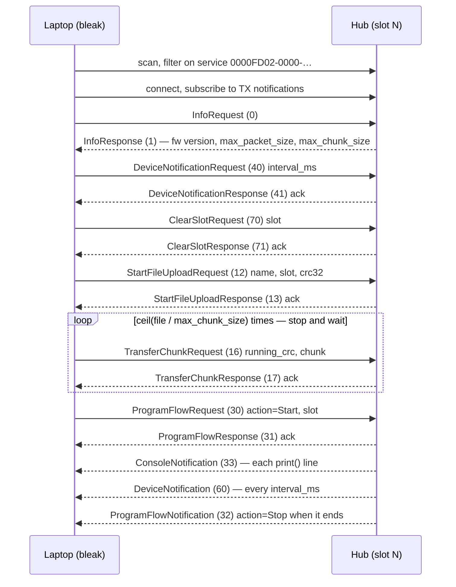
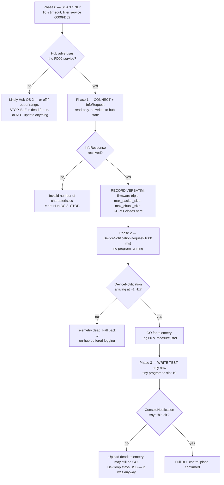

# Bluetooth on the SPIKE Prime — can we upload and manage code over it instead of USB?

**Type:** EXTERNAL research · **Created:** 2026-08-26 · **Status:** open — **no hardware exists; nothing
here was tested.** Every protocol fact is quoted from a file I fetched (LEGO's own repository, the VS Code
extension's source, its issue tracker); every host fact is a command I ran on this machine today;
everything else is `[ASSUMED]` or **UNVERIFIED**.
**Answers:** the operator's question — *"can we stream telemetry so we don't have to depend on the serial
port all the time, since a cable might mess up the accelerometer data?"*
**Extends:** [../plans/telemetry-and-analysis.md](../plans/telemetry-and-analysis.md), whose "Bluetooth"
row reads *"**UNVERIFIED** whether stock firmware exposes a usable BT data channel to a user program, and
at what rate."* This answers the first half and bounds the second. It does not choose the transport —
that is still the plan's call. It also does not edit
[./spike-prime-linux-toolchain.md](./spike-prime-linux-toolchain.md), whose *Bluetooth on Linux* verdict
("Use USB") is right for the **dev loop** and wrong for **telemetry**; § 6 says why.

---

## Summary — the verdict up front

**The radio is real, LEGO documents it themselves, and yes — a file can reach a slot and be started over
BLE with no cable attached.** That is settled by LEGO's published protocol reference and its working
`bleak` example, not by blog reconstruction.

**But upload is not the prize.** The prize is one message we did not know existed:

> **`DeviceNotification` (id 60)** streams hub → laptop over BLE at a host-requested interval: battery
> percent · IMU yaw/pitch/roll **and** raw accelerometer X/Y/Z **and** raw gyro X/Y/Z · every motor's
> port, absolute position, power, speed and 32-bit cumulative position · the colour sensor's colour class
> **and raw R/G/B, 0–1023** · distance in mm. **No cooperation from the program in the slot is required.**

That is almost line-for-line the "what we would want to capture" table in the parked telemetry plan, and
it arrives from a robot with **no cable on it**. The operator's reasoning — cable drag pulls the chassis
and biases exactly the heading and acceleration channels we most want to measure — is not fixed by a
better cable. This is the mechanism that removes it. It also runs entirely in firmware, so it cannot
perturb the Python loop rate it helps us measure.

**Four things temper it:**

1. **Hub OS 3 only.** Hub OS 2 speaks Bluetooth *Classic* RFCOMM with a JSON-RPC message set — a different
   stack entirely. Our generation is unknown (KU-M1). A BLE scan is itself a clean generation test (§ 7).
2. **Nothing off-the-shelf does it.** The VS Code extension implements upload, start/stop and console; no
   released version implements `DeviceNotification` (an unmerged PR would — § 3.3). We write ~200 lines of
   `bleak` ourselves.
3. **The extension's BLE path is currently degraded.** Open PR #81 (2026-08-16): BLE *"only reads the first
   packet of the response message from the hub. This cuts off console responses/print statements."*
4. **`print()` still matters.** `DeviceNotification` reports the *hub's* device state, not *our* program's.
   Detector state and running count reach us only via `print()` → `ConsoleNotification`.

**Recommendation: keep the dev loop on USB; add BLE as a read-only telemetry capture only. Never let a run
depend on the link.** Verdict § 6, bench test § 7.

---

## 1. What the radio is and what it speaks

### 1.1 BLE GATT, on Hub OS 3

LEGO's reference states its scope in its first paragraph: *"This documentation describes the communication
protocol for LEGO® Education SPIKE™ App 3 Prime hubs… to control the SPIKE™ Prime Hub over Bluetooth Low
Energy (BLE)."* ([`index.rst`](https://github.com/LEGO/spike-prime-docs/blob/main/docs/source/index.rst))

*"The LEGO® SPIKE™ Prime Hub exposes a BLE GATT service containing two characteristics: one for receiving
data (RX), and one for transmitting data (TX)."*
([`connect.rst`](https://github.com/LEGO/spike-prime-docs/blob/main/docs/source/connect.rst))

| Item | UUID |
|---|---|
| Service | `0000FD02-0000-1000-8000-00805F9B34FB` |
| RX (hub receives) | `0000FD02-0001-1000-8000-00805F9B34FB` |
| TX (hub transmits) | `0000FD02-0002-1000-8000-00805F9B34FB` |

Verbatim from `connect.rst`, and character-identical (case aside — LEGO's example lowercases,
the extension uppercases) in two implementations I read: LEGO's
[`examples/python/app.py`](https://github.com/LEGO/spike-prime-docs/blob/main/examples/python/app.py) and
the extension's
[`src/clients/ble-client.ts`](https://github.com/PeterStaev/lego-spikeprime-mindstorms-vscode/blob/master/src/clients/ble-client.ts).
**RX/TX are named from the hub's point of view** — LEGO notes it, the extension repeats the warning in a
code comment. Read that twice before writing a client.

Mechanics, all `connect.rst`:

- **Discovery:** *"The hub includes the service UUID in the advertisement data, so that it can be used to
  filter scan results."* LEGO's example filters on nothing else — no name prefix, no manufacturer data.
- **Host → hub:** *"perform a **write-without-response** operation on the hub's RX characteristic."*
- **Hub → host:** *"Any data from the hub will be delivered as a notification on the TX characteristic."*
- **Pairing/bonding:** LEGO's example performs **no pairing or bonding step at all** — scan, connect,
  discover, subscribe, write. That the characteristics are therefore **not encryption-gated is an
  inference from that example, not a statement in `connect.rst`** — LEGO's docs say nothing about
  security requirements at all. **UNVERIFIED** whether Windows' WinRT stack nonetheless demands a
  Settings-level pairing; on BlueZ an unpaired connect is normal.

### 1.2 Framing: COBS-with-escapes, XOR 0x03, delimiter

From [`encoding.rst`](https://github.com/LEGO/spike-prime-docs/blob/main/docs/source/encoding.rst), in order:

1. *"Byte values `0x00`, `0x01`, and `0x02` are escaped using COBS."* **Not** textbook COBS — three escaped
   values, code word `block_size + 2 + delimiter × 84`, maximum block size 84.
2. *"All bytes are XORed with `0x03` to ensure output contains no problematic control characters."*
3. *"A delimiter is added to the end of the message."* `0x02` always suffixed; `0x01` optionally prefixed
   to mark a **high-priority** message. Two receive queues; `encoding.rst` gives the six-row state table.

**Consequence for a receiver, and it is the one everybody gets wrong:** a hub message is *delimited*, not
length-prefixed, and BLE delivers it in MTU-sized notification fragments. You must buffer until `0x02`.
LEGO's own example admits it does not — *"for simplicity, this example does not implement buffering and is
therefore unable to handle fragmented messages"* — and the extension shipped the same bug, which is what
PR #81 fixes (§ 3.4).

**CRC32 is standard, not custom.** LEGO's
[`crc.py`](https://github.com/LEGO/spike-prime-docs/blob/main/examples/python/crc.py) is nine lines
wrapping `binascii.crc32`, zero-padding to a multiple of 4, with an optional seed for running CRCs. The
glossary: *"the CRC must be calculated on a multiple of 4 bytes… append `0x00` until the data is a multiple
of 4."*

### 1.3 Messages

*"All messages start with a uint8 indicating the message type… all message fields are little-endian, and
strings are null-terminated."*
([`messages.rst`](https://github.com/LEGO/spike-prime-docs/blob/main/docs/source/messages.rst))
Complete documented set, ids verbatim:

| id | Message | id | Message |
|---:|---|---:|---|
| 0 | `InfoRequest` | 1 | `InfoResponse` |
| **10** | **`StartFirmwareUploadRequest`** | **11** | **`StartFirmwareUploadResponse`** |
| 12 | `StartFileUploadRequest` | 13 | `StartFileUploadResponse` |
| 16 | `TransferChunkRequest` | 17 | `TransferChunkResponse` |
| **20** | **`BeginFirmwareUpdateRequest`** | **21** | **`BeginFirmwareUpdateResponse`** |
| 22 | `SetHubNameRequest` | 23 | `SetHubNameResponse` |
| 24 | `GetHubNameRequest` | 25 | `GetHubNameResponse` |
| 26 | `DeviceUuidRequest` | 27 | `DeviceUuidResponse` |
| 30 | `ProgramFlowRequest` | 31 | `ProgramFlowResponse` |
| 32 | `ProgramFlowNotification` | 33 | `ConsoleNotification` |
| 40 | `DeviceNotificationRequest` | 41 | `DeviceNotificationResponse` |
| 50 | `TunnelMessage` | 60 | `DeviceNotification` |
| 70 | `ClearSlotRequest` | 71 | `ClearSlotResponse` |

> ⚠ **Ids 10, 11, 20, 21 are firmware upload and firmware update** — same message set, same characteristic,
> one byte from the file-upload ids we *do* want. Any tool we write must be unable to construct them (§ 7.2).
> [ADR-0001](../decisions/0001-stock-lego-firmware-only.md) is not only about what we install; it is about
> what our own code can emit.

`InfoResponse` (1) is the handshake and carries everything else's inputs: RPC major/minor/build,
**firmware major/minor/build**, *"Maximum packet size in bytes"*, *"Maximum message size in bytes"*,
*"Maximum chunk size in bytes"*, product group. `connect.rst`: *"the client should always initiate
communication by sending an InfoRequest."*

`ConsoleNotification` (33) is a single `string[256]` → **255 usable characters per `print()` line**.
Whether a longer line splits or truncates is **UNVERIFIED**.

`DeviceNotification` (60) is `uint16 size` + a sequence of sub-messages, each with its own uint8 id:

| sub-id | Device message | Fields |
|---:|---|---|
| 0 | `DeviceBattery` | `uint8` percent |
| 1 | `DeviceImuValues` | face-up, yaw-face, `int16` yaw/pitch/roll, `int16` accel X/Y/Z, `int16` gyro X/Y/Z |
| 2 | `Device5x5MatrixDisplay` | `uint8[25]` pixels |
| 10 | `DeviceMotor` | port, type, `int16` abs position (−180…179), `int16` power (±10000), `int8` speed (±100), `int32` position |
| 11 | `DeviceForceSensor` | port, value 0–100, pressed flag |
| 12 | `DeviceColorSensor` | port, `int8` colour enum, **`uint16` raw red / green / blue, each 0–1023** |
| 13 | `DeviceDistanceSensor` | port, `int16` mm, range 40–2000 per `messages.rst` — but LEGO's techspec sheet says **50**–2000; use 50, the safe reading ([../course/lego-reference/INDEX.md](../course/lego-reference/INDEX.md)). `−1` if nothing detected |
| 14 | `Device3x3ColorMatrix` | port, `uint8[9]`, brightness high nibble, colour low nibble |

The colour enum ([`enums.rst`](https://github.com/LEGO/spike-prime-docs/blob/main/docs/source/enums.rst))
runs 0x00 Black … 0x07 Yellow … 0x0A White, with **`0xFF` = "Unknown or no color detected"**. That matters
to us: the hub's own classifier has an explicit UNKNOWN, which is the behaviour scope FR-2b demands of
ours. It is **not** evidence that its UNKNOWN is any good on pastel matte paper — that stays the open
separability question in [./color-discrimination.md](./color-discrimination.md) § 8.

`TunnelMessage` (50) is `uint16 size` + arbitrary bytes, with **no documentation of how a hub program
produces or consumes one** and no matching call in the SPIKE 3 Python API (§ 2.2). UNVERIFIED; do not plan
on it.

---

## 2. Does it differ by Hub OS generation? — completely

**Everything in § 1 is Hub OS 3.**

| | Hub OS 2 (SPIKE App 2 / "Legacy") | Hub OS 3 (SPIKE App 3) |
|---|---|---|
| Radio | Bluetooth **Classic**, RFCOMM / SPP | **Bluetooth Low Energy**, GATT |
| Host sees | `rfcomm connect /dev/rfcomm0 <MAC>` → a serial device | GATT service `0000FD02-…` |
| Framing | JSON-RPC lines, `{"i":"…","m":"program_execute","p":{"slotid":1}}` | COBS + XOR 0x03 + delimiter, CRC32 |
| Documented by LEGO | No — community reverse-engineered | **Yes**, `LEGO/spike-prime-docs` |
| List slots / storage | `get_storage_status` exists | **No such message** |
| Python API | `from spike import PrimeHub` | `import motor` / `from hub import port` / `import runloop` |

Evidence for the left column, and note how thin it is — community reverse engineering, not a spec. In
[gpdaniels/spike-prime issue #8](https://github.com/gpdaniels/spike-prime/issues/8), one commenter posts a
packet dump of an **Android Robot Inventor app ↔ hub** session (2021-01-08): *"So far I see it's working via
BT, not BLE since it uses RFCOMM"*, listing `get_hub_info`, `program_modechange`, `program_terminate`,
`reset_program_time` and the `scratch.*` calls. A **second commenter, a month later** (2021-02-09) adds
`program_execute`, `get_storage_status`, `move_project` and `remove_project` — the four rows this table
leans on come from that later comment, not the dump. A third exchange (2021-06-22) supplies *"These commands
work with the default firmware over Bluetooth or USB"* — but the same reply warns *"Most commands should
work for both 51515 and Spike hubs, but there might be a few that are system-specific since the firmware
varies slightly."* **The dump is of a MINDSTORMS 51515 hub, not a SPIKE Prime one**, so treat the left
column as indicative of the Hub OS 2 *stack* (RFCOMM + JSON-RPC) and not as a verified SPIKE command list.
The stack itself is corroborated by the `rfcomm` note already in
[./spike-prime-linux-toolchain.md](./spike-prime-linux-toolchain.md).

### 2.1 The symptom to recognise, and the trap under it

Extension issue [#78](https://github.com/PeterStaev/lego-spikeprime-mindstorms-vscode/issues/78): on hub
firmware `v1.8.149`, BLE gave `Connecting to Hub Failed! Invalid number of characteristics` — exactly what
a Hub OS 3 client sees when it discovers fewer than two characteristics on a hub that is not Hub OS 3.

The advice on that issue is *"Try updating your Hub firmware to HubOS3 via the official SPIKE app."*
**For us that is forbidden.** A Hub OS change is an operator decision recorded as an ADR, never a
troubleshooting step ([../directives/hardware-safety.md](../directives/hardware-safety.md)). If we see
`Invalid number of characteristics`, the correct conclusion is *"this hub is Hub OS 2; BLE is off the
table; use USB"* — full stop.

Issue [#77](https://github.com/PeterStaev/lego-spikeprime-mindstorms-vscode/issues/77) adds a second trap:
a hub *reported* HubOS 3.2.26 while not being Hub OS 3. The maintainer: *"The version you see is
misleading. In order to verify that the hub is running HubOS3 the main button must light green on
startup."* That matches the green/white button test already in the toolchain doc. **Provenance caveat, as
for the 51515 dump above:** that hub is a MINDSTORMS **Robot Inventor** hub, and the same reply says *"the
RI Hub does not officially support HubOS 3"* — so the *misleading version string* is an RI-app symptom we
may never see. The button test itself does not rest on that thread; LEGO's own meaning for green is already
recorded in the toolchain doc, and it is the reason to trust the button over any version string.

The extension's own README draws the same line: *"Starting with version 2.x of the extension it will work
ONLY with HubOS3. If you are running on the legacy HubOS2, please use the 1.x version and disable
auto-updates for the extension."* Its CHANGELOG
shows Hub OS 3 support arrived **BLE-first**: `2.0.0` (2025-05-12) *"Refactor plugin to work with HubOS3
BLE connection"*, `2.1.0` (2025-05-25) *"Add USB connection support for HubOS3"*.

### 2.2 A hub program cannot open its own radio

The SPIKE 3 Python API module list — from a **third-party mirror**, self-described as *"Based on LEGO
Education SPIKE website, Version 3.4.3… Copied from website and reformatted by Ethan Danahy on 30th of
April, 2024"* (<https://tuftsceeo.github.io/SPIKEPythonDocs/SPIKE3.html>); LEGO's live help page is the
authority and should be re-checked once the hub's firmware version is known — is `app`,
`color`, `color_matrix`, `color_sensor`, `device`, `distance_sensor`, `force_sensor`, `hub` (button, light,
light_matrix, motion_sensor, port, sound), `motor`, `motor_pair`, `orientation`, `runloop`. **No BLE
module, no messaging, no broadcast, no VCP, no tunnel.**

So the parked plan's open question — *"whether BT is reachable from a user program"* — resolves to **no,
not directly**, on the strength of an *absence* in that module list rather than a positive statement by
LEGO. An undocumented module could exist; `dir()` at the REPL would settle it once the hub is identified.
Taken at face value, a slot program cannot open a socket. It can `print()`, and the *firmware* turns that into a
`ConsoleNotification` on the TX characteristic. The control plane belongs to the firmware; our program is a
tenant on it. That is a limitation and an advantage at once: telemetry works even when our program does
nothing special.

---

## 3. Upload over BLE — can a file reach a slot?

**Yes.** Documented, and implemented end to end in LEGO's
[`examples/python/app.py`](https://github.com/LEGO/spike-prime-docs/blob/main/examples/python/app.py):
*"Connect to a SPIKE™ Prime hub over BLE · Subscribe to device notifications · Transfer and start a new
program."*



`enums.rst` gives **Program Action** exactly two values — `0x00` Start, `0x01` Stop — and **Response
Status** two — `0x00` Acknowledged, `0x01` Not Acknowledged. Slot is a `uint8`; the glossary: *"One of the
20 program slots on the hub, indexed from 0 to 19."* Filename is `string[32]` → 31 characters.

### 3.1 Throughput — framing does *not* dominate; round trips do

**Every chunk waits for its own acknowledgement before the next is sent.** `TransferChunkRequest` carries
no sequence number and its CRC is *cumulative*, so chunks must arrive in order with none lost, and the
protocol gives a sender no window in which to have more than one outstanding. LEGO's example is accordingly
stop-and-wait. (Strictly, a host *could* pre-compute every running CRC and pipeline the writes — nothing in
`messages.rst` forbids it — but nothing documents that the hub tolerates it, and no implementation we read
tries. **UNVERIFIED**; assume stop-and-wait.) Transfer time is therefore **chunks × round-trip time**, and
BLE RTT is governed by the **connection interval**, not bandwidth.

**Read off this host today** (kernel 6.8.0-138, BlueZ 5.64, Intel AX201):

```
sudo cat /sys/kernel/debug/bluetooth/hci0/conn_min_interval   # 24  → × 1.25 ms = 30 ms
sudo cat /sys/kernel/debug/bluetooth/hci0/conn_max_interval   # 40  → × 1.25 ms = 50 ms
```

⚠ **These are the kernel's *default preferences* for a connection this host initiates — not a measurement
of any link, because no link has ever existed.** A BLE peripheral may request different parameters after
connecting (an L2CAP Connection Parameter Update), and many do, precisely to raise throughput. **What
interval the hub actually negotiates is UNKNOWN** and is a Phase-2 observable (§ 7).

Taking 30–50 ms as the working range: a request occupies one connection event and the reply lands in a
later one, so **RTT is on the order of one to two intervals** — call it **30–100 ms per chunk**. The table
below uses the pessimistic **RTT = 2 × interval**; a hub that answers in the very next connection event
halves every figure, and a negotiated 15 ms interval halves them again.

`src/` is **43,484 bytes** across seven files (`wc -c src/*.py`, 2026-08-26); the extension's preprocessor inlines
`from x import *` into one file, so a realistic single-file program is of that order (`.mpy` compilation
would shrink it — by how much is **UNVERIFIED** for our code). Taking **30 KiB = 30,720 bytes**:

| `max_chunk_size` | chunks | RTT 60 ms (30 ms interval × 2) | RTT 100 ms (50 ms interval × 2) |
|---:|---:|---:|---:|
| 128 B | 240 | 14.4 s | 24.0 s |
| 256 B | 120 | 7.2 s | 12.0 s |
| 512 B | 60 | 3.6 s | 6.0 s |
| 1024 B | 30 | 1.8 s | 3.0 s |

**`max_chunk_size` is UNKNOWN** — it comes from `InfoResponse`, which we have never read. That one number
is the whole answer, which is why § 7 makes reading it the first bench step.

### 3.2 Where MTU comes back in, and which regime we are in

One chunk is COBS-framed then written to RX in `max_packet_size` pieces — `app.py`, verbatim:

```python
packet_size = info_response.max_packet_size if info_response else len(frame)

# send the frame in packets of packet_size
for i in range(0, len(frame), packet_size):
    packet = frame[i : i + packet_size]
    await client.write_gatt_char(rx_char, packet, response=False)
```

`connect.rst` defines max packet size only as *"The largest amount of data that can be written to the RX
characteristic in a single operation."* That it tracks the negotiated ATT MTU is an **inference**, not a
LEGO statement — but it is the only thing that value can physically mean. Punch Through: *"The default MTU is often as low as
23 bytes. It can be negotiated up to 527 bytes"*, and *"The ATT header is 3 bytes for the commonly-used ATT
operations used by the application"* (<https://punchthrough.com/ble-att-mtu-throughput/>). **Our own
subtraction, not a quote from that article:** 23 − 3 = **20 usable payload bytes** at the default MTU.
Two regimes:

- **MTU stays at 23** → 20 bytes per write; the 527-byte framed form of a 512-byte chunk (computed two
  paragraphs below) takes ⌈527 / 20⌉ = **27 writes**. They are write-without-response
  and pipeline, but only as many as fit in a connection event — so several intervals per chunk and **MTU
  dominates**: multiply the table above several-fold.
- **MTU negotiated up** (BlueZ requests a larger MTU on modern kernels) → a chunk fits in one or two writes
  and the **stop-and-wait RTT dominates**: the table stands.

`max_packet_size` in the `InfoResponse` tells us which regime we are in, in one message, before writing a
byte to the hub. Cheapest diagnostic in this document.

COBS overhead is noise either way. Worked for a 512-byte chunk: the `TransferChunkRequest` body is
1 (message id) + 4 (running CRC) + 2 (length) + 512 = **519 bytes**; a COBS block is at most 84 bytes
*including* its code word, so 83 payload bytes per block → ⌈519 / 83⌉ = **7 code words**, plus one `0x02`
delimiter. Framed total **527 bytes** — **8 bytes of framing** (7 code words + delimiter) on top of the
519, i.e. **1.5 %**; the other 7 of the 15 bytes over 512 are the request header, not COBS.
**Count round trips, not bytes.**

**Comparison:** USB CDC-ACM at the 115200 baud the toolchain doc records is ~11.5 kB/s (8N1 → 10 bits per
byte), and it carries the same stop-and-wait cost, but its "interval" is sub-millisecond. On a *virtual*
COM port the baud number is nominal — the real ceiling is USB bulk transfer, which is far higher — so 11.5
kB/s is a floor, not a rate. Either way USB is faster in every regime. **UNVERIFIED by measurement** —
neither transport has been run.

### 3.3 The VS Code extension, `PeterStaev.lego-spikeprime-mindstorms-vscode`

Release **v3.1.3**, Apache-2.0, 82 stars, repo last pushed **2025-08-29**, `open_issues_count` 9 — which in
the GitHub API counts pull requests too, so **6 issues plus the 3 open PRs below** (GitHub API, 2026-08-26).
`package.json` declares `@stoprocent/noble ^2.3.2` for BLE and `serialport ^12.0.0` for USB —
so the toolchain doc's "USB serial **or** BLE" is confirmed from source, not from a marketplace blurb.

`ble-client.ts` (96 lines, read in full) does what LEGO documents: scan filtered on FD02, connect, discover
the two characteristics, subscribe, `InfoRequest`. Notable:

- `const noble = withBindings("default"); // 'hci', 'win', 'mac'` — on Linux this selects the **HCI socket**
  binding, *not* BlueZ D-Bus. Root of every Linux problem in § 5.2.
- `await setTimeoutAsync(() => {}, 250); // HACK: This seems to be needed on Windows to wait for the BLE
  stack to be ready` — the maintainer's own words on Windows timing fragility.
- Scan timeout is a setting, `legoSpikePrimeMindstorms.bleConnectionTimeoutSeconds`, default 5 s.

**Message coverage is the deciding gap.** `src/messages/` contains only info request/response, console
notification, program flow request/response/notification, start file upload request/response, transfer
chunk request/response, status response. **No `DeviceNotificationRequest`, no `DeviceNotification`.** In
everything released, the extension is a *deployment* tool and gives us no telemetry on any transport.

**Somebody else wants the same thing, and it is not merged.** [PR #80](https://github.com/PeterStaev/lego-spikeprime-mindstorms-vscode/pull/80),
*"Live sensor telemetry"* (2026-06-19, **open**, 8 files, +947/−627), adds exactly the two missing messages
behind a `legoSpikePrimeMindstorms.telemetryInterval` setting — its author's words, *"default: 100 ms,
Range: 20–2000 ms"* — rendering *"the pure JSON stream"* in a panel because *"I unfortunately couldn't come
up with a good idea for a visual representation"*. Open issue
[#76](https://github.com/PeterStaev/lego-spikeprime-mindstorms-vscode/issues/76) (2025-08-08) asks for the
same feature. So the gap is not architectural and it may close. **Two things follow, and only the second
decides § 6:** that 20 ms floor is one contributor's choice of `uint16`, **not** evidence about what the hub
honours (open question 2 stands); and a PR that has sat unmerged since June, in a repo whose last push was
2025-08-29, is not something a two-week project schedules around. We still write our own client — and if PR
#80 lands we get a cross-check, not a dependency.

**Open bug, on the feature we care about most.**
[PR #81](https://github.com/PeterStaev/lego-spikeprime-mindstorms-vscode/pull/81) (2026-08-16, **still open
and unmerged**): *"In the current code, BLE only reads the first packet of the response message from the
hub. This cuts off console responses/print statements. There's also a buffer ordering issue where an
immediately terminating program has its stop message lost, so the extension thinks it's still running."*
That is precisely the missing-buffering failure § 1.2 predicts. **So in released v3.1.3, console readback
over BLE is unreliable for anything longer than one notification packet** — at a 23-byte MTU, nearly every
line we would print. [PR #82](https://github.com/PeterStaev/lego-spikeprime-mindstorms-vscode/pull/82)
(2026-08-17, also open) improves BLE discovery and naming. Both await the maintainer.

### 3.4 LEGO's `examples/python`, and everything else

`app.py`, `cobs.py`, `crc.py`, `messages.py`, `_tests/test_cobs.py`. `app.py` is ~230 lines of `bleak`
(`BleakScanner.find_device_by_filter`, `BleakClient`, `start_notify`,
`write_gatt_char(..., response=False)`) demonstrating the full § 3 sequence — including
`DeviceNotificationRequest`, which nothing else we found implements. LEGO is candid: *"The script is
heavily simplified and not suitable for production use."* Repo: main-branch **last commit 2024-03-04**,
`pushed_at` **2025-09-29**, 27 stars, not archived. Two and a half years without a main-branch commit reads
as a *stable spec*, but it does mean nobody is fixing the example.

⚠ **One line of `app.py` violates our directives:** it ends in `await stop_event.wait()`, an **unbounded**
wait. Ours must wrap every wait in `asyncio.wait_for(..., timeout=…)`. Copy the protocol, not the control
flow.

**Other third-party tools:** effectively none. A repository search returned one hit,
`slavasg-lab/lego-spikeprime-ble-boilerplate` (last pushed **2025-06-09**, 1 star, a React/Web-Bluetooth
demo) — not a CLI, not maintained. GitHub *code* search, which would find every repo carrying the FD02
UUID, requires authentication and returned `Requires authentication`, so **this survey is not exhaustive**
and I am not claiming it is. `pybricksdev` and the rest of that family are blacklisted regardless.

---

## 4. Remote management — what works over BLE, what still needs USB

| Capability | BLE? | Mechanism | Notes |
|---|---|---|---|
| Upload a file to a slot | ✅ | 12 → 16×N | § 3 |
| Clear a slot | ✅ | 70 / 71 | LEGO's example tolerates a NAK — an already-empty slot |
| Start / stop a program | ✅ | 30, action `0x00` / `0x01` | |
| Know when a program ended | ✅ | 32 `ProgramFlowNotification` | Unsolicited; extension handling is buggy (PR #81) |
| Read `print()` output | ✅ | 33 `ConsoleNotification` | 255 chars/line. **Needs correct reassembly** |
| **Live sensor / motor / IMU telemetry** | ✅ | 40 / 41 → 60 | **The headline.** No hub-side code needed |
| Read hub name · device UUID | ✅ | 24/25 · 26/27 | Read-only, safe |
| Read firmware version | ✅ | 0 / 1 | **Closes KU-M1 without a cable** |
| Set hub name | ⚠ | 22 / 23 | Writes hub state for no benefit. Don't |
| **List slots / files — see what is on the hub** | ❌ | — | **No such message exists.** Hub OS 2's JSON-RPC had `get_storage_status`; Hub OS 3's BLE protocol dropped it |
| **Download a file off the hub** | ❌ | — | Upload only; there is no read-file message |
| **Interactive MicroPython REPL** | ❌ | — | USB CDC-ACM only. [../runbooks/hub-identification.md](../runbooks/hub-identification.md) stays a USB procedure |
| Firmware upload / update | 🚫 | 10/11, 20/21 | **Blacklisted. Our code must be unable to emit these** |

**The two ❌ rows are why BLE cannot be the only channel.** We cannot see what is in the slots and we cannot
pull a file back — so there is no BLE equivalent of "retrieve the CSV the hub wrote to its own filesystem",
which is the *other* option in [../plans/telemetry-and-analysis.md](../plans/telemetry-and-analysis.md).
**The two are complementary, not competing: BLE streams live and needs no hub-side code; the on-hub file
survives a dropped link but needs USB to retrieve.** Worth carrying into that plan when it is unparked.

### 4.1 What BLE telemetry still cannot tell us

- **No hub timestamps.** `DeviceNotification` carries no tick field; every sample is stamped by the host on
  arrival, so the recorded interval includes BLE queueing and scheduler jitter of unknown size. Fine for
  "did the heading drift over this lane"; **not** adequate to *measure the loop rate* (KU-M5) — that stays a
  tethered or on-hub job.
- **The interval is a request, not a contract.** `DeviceNotificationRequest` is *"Desired notification
  interval in milliseconds. (0 = disable)"*, `uint16`, so 1–65535 ms is expressible. Whether the hub honours
  a small value, and what it does when it cannot, is **UNVERIFIED**.
- **It reports the hub, not our program.** Detector state, event width, running count — the fields the
  parked plan asks for — come back only via `print()` → `ConsoleNotification`.
- **Raw RGB comes free.** The plan lists *"raw RGB, if available"* as a wish; `DeviceColorSensor` supplies
  `uint16` R/G/B at 0–1023 **without our program reading the sensor at all**. For the FR-2b separability
  question that is the ideal instrument: sweep over the real sticky notes with nothing of ours in the
  signal path.

---

## 5. Where this breaks — Linux, Windows, a room full of radios

### 5.1 This host, measured today

| Check | Result | Command |
|---|---|---|
| BlueZ | **5.64** (`bluez 5.64-0ubuntu1.4`) | `bluetoothd --version`, `dpkg -l` |
| Adapter | `hci0`, Intel AX201 (USB `8087:0026`), **UP RUNNING**, HCI/LMP 5.2 | `hciconfig -a`, `lsusb` |
| `bluetooth.service` | **active** | `systemctl is-active bluetooth` |
| rfkill | not soft- or hard-blocked | `rfkill list` |
| Connection interval | **30–50 ms** (24–40 × 1.25 ms) — the kernel's *default preference*, **not** a link measurement (§ 3.1) | `sudo cat /sys/kernel/debug/bluetooth/hci0/conn_{min,max}_interval` |
| Kernel | 6.8.0-138-generic | `uname -r` |
| `bleak` | **not installed** | `python3 -c "import bleak"` → `ModuleNotFoundError` |

**The host is ready.** `bleak` 3.0.2 (PyPI, uploaded 2026-05-02) declares `requires_python >=3.10` — we
have 3.10.12, which satisfies it, though only just: this host is one minor version above the floor, so a
future `bleak` that drops 3.10 would strand us. Pin the version in the venv. On Linux it also pulls
`dbus-fast`. Its README: *"Supports Linux distributions
with BlueZ >= 5.55"*; its changelog records *"Removed support for BlueZ < 5.55"*. **5.64 ≥ 5.55.**
`pip install bleak` into a venv is the only setup, and it needs **no root** — bleak talks to `bluetoothd`
over D-Bus like any desktop app.

**ModemManager is irrelevant here.** That fix
([../findings/host-environment.md](../findings/host-environment.md)) concerns `/dev/ttyACM0` serial ports.
It neither helps nor hinders BLE — and it must still be done before the hub is ever plugged in.

### 5.2 The Linux trap: noble/HCI vs bleak/D-Bus

The extension does **not** use BlueZ D-Bus. `withBindings("default")` on Linux selects the
`bluetooth-hci-socket` binding — a raw `AF_BLUETOOTH` HCI socket. Three real consequences:

1. **It needs a native module that did not ship.** Issue
   [#73](https://github.com/PeterStaev/lego-spikeprime-mindstorms-vscode/issues/73) (Debian 12, VS Code
   1.100.3): *"`Error: Cannot find module '@abandonware/bluetooth-hci-socket'`"*, fixed by the reporter only
   after an `npm install` inside the extension directory plus `electron-rebuild -v 34.5.8` against VS Code's
   exact Electron version. The maintainer's reply sets expectations for the whole Linux path: *"The problem
   is that I'm not a linux user myself… Sadly I'm not entirely sure how to make this so it works on all
   platforms for the time being."*

   **It then took four releases, and BLE was never actually confirmed.** Read in order, the thread says:
   **3.0.1** (2025-06-15, *"platform specific version for linux that includes the HCI package"*) still failed
   — *"compiled against a different Node.js version using NODE_MODULE_VERSION 127. This version of Node.js
   requires NODE_MODULE_VERSION 132"*; **3.1.0** (2025-06-22, *"Migrate to a different BLE package for better
   support"*, the move to `@stoprocent/noble`) still failed — *"Module did not self-register:
   …@stoprocent+noble.glibc.node"*; **3.1.1** (2025-06-24) was the first build to load cleanly — *"no errors
   this time and the expected LEGO Hub bits show up in the UI."* And the reporter's closing comment
   (2025-08-24) is the one that matters most to us:

   > *"I could connect and interact normally with a Spike Prime hub over USB. Unfortunately, I was never able
   > to get the Bluetooth adapter on this laptop working in Linux so cannot test that functionality. The
   > Linux/Bluetooth issue is not specific to this extension -- I couldn't get it working at all in any
   > software."*

   Read the last sentence as carefully as the rest: it is **not** evidence against the extension's BLE path
   either. It is an absence of evidence in both directions.

   So: the extension *loads* on Linux from **3.1.1** onward — not 3.0.1, and not for the first six weeks of
   Hub OS 3 support (2.0.0 shipped 2025-05-12). **Whether its BLE path has ever worked on Linux is
   UNVERIFIED by anyone**: the only Linux reporter could not test it, and the maintainer does not use Linux.
   Nothing in the issue tracker is evidence that it works.
2. **Raw HCI sockets need privilege** — `CAP_NET_RAW` or root. VS Code's extension host has neither by
   default. **UNVERIFIED** whether the 3.0.1+ Linux build sets a capability or expects the user to.
3. **It fights `bluetoothd`.** An HCI-socket library takes the adapter at the controller level; running it
   beside the GNOME Bluetooth stack (active on this machine) is a known source of mutual interference. Two
   stacks, one radio.

**Recommendation for Linux: use `bleak`, not the extension, for anything that matters.** It goes through
`bluetoothd`, coexists with the desktop, needs no root, no native rebuild, no Electron version matching. We
are writing our own telemetry client anyway, so this costs nothing.

Two more: **BlueZ caches GATT services per device** — clear a stale cache with `bluetoothctl` `remove <MAC>`
(bleak's troubleshooting page documents the pattern); and **Chrome Web Bluetooth on Linux is flag-gated**
and unsupported, already recorded in [./spike-prime-linux-toolchain.md](./spike-prime-linux-toolchain.md).

### 5.3 Windows — for teammates

- **The extension is easiest here.** Issue #73's reporter: *"I installed your extension first on a Windows
  laptop and it worked great out of the box."* No native rebuild, no capability, no daemon conflict.
- **`bleak` on Windows:** its README says *"Supports Windows 11, version 22000 and greater."* A teammate on
  **Windows 10** may need to pin an older `bleak`; **UNVERIFIED** which version last supported it — test
  rather than assume, and record the answer.
- **Pairing:** LEGO's example never pairs, but WinRT's GATT stack is stricter than BlueZ about unpaired
  devices. **UNVERIFIED** whether Windows needs the hub in Settings → Bluetooth first. If a Windows connect
  fails where Linux succeeds, try pairing before concluding anything about the hub.
- The 250 ms `// HACK` in `ble-client.ts` hints the Windows stack needs settling time after connect. If our
  own client flakes on Windows only, add the delay before blaming the hub.

### 5.4 A classroom full of radios

BLE shares 2.4 GHz with every access point, hotspot and other team's hub. Adaptive frequency hopping across
37 data channels handles this reasonably — not always. The nearest documented evidence is bleak's
troubleshooting page, and it is narrower than it first looks: its section is *"Occasional 'Not connected'
errors or missing advertisments on Raspberry Pi"*, and it blames *"wifi interference on the chip level"* on
the Pi's combined WiFi/Bluetooth module — a chip-level coexistence problem, not ambient room traffic. It is
suggestive for us only because this host's Intel AX201 is likewise a combined Wi-Fi/Bluetooth part; it is
**not** a measurement of a crowded classroom. Expect slower discovery, occasional connect failures, mid-run
disconnects. **We have no measurement of link
robustness for our hub, our laptop, or that room, and cannot get one until hardware exists.** What we can do
is design so it does not matter:

> **Design rule — the run must never depend on the link.** The program lives in a slot and runs from the
> hub's own buttons. BLE is an *observer*. If the link drops, the robot finishes its sweep and reports on
> the light matrix exactly as it would have; we lose telemetry for that run and nothing else.

Same separation as [ADR-0002](../decisions/0002-split-mission-logic-from-hub-io.md): mission logic must not
know how it is being watched. It also means the Programmer can walk toward the robot mid-run to improve the
link without touching it — which is all the Programmer may do to the robot anyway
([../directives/course-compliance.md](../directives/course-compliance.md)).

---

## 6. The honest verdict

**BLE cannot replace the USB dev loop. It supplements it, in one role, and that role earns its keep.**

**Why not replace:** no REPL, no slot listing, no file download, slower upload, a degraded console path in
the only off-the-shelf client, and a Linux story that broke twice in the six weeks after Hub OS 3 support
shipped and has never since been confirmed working by anyone (§ 5.2). Hub identification (KU-M1)
is a USB procedure and stays one, and USB's failure modes are already covered by our runbooks.

**Why not ignore:** `DeviceNotification` is a better instrument than anything USB offers, *because of what
it removes*. A tethered run is not the run being demonstrated — the cable pulls the chassis and contaminates
precisely the accelerometer and gyro channels we would be measuring. It also needs no hub-side code, so it
cannot perturb what it measures.

**What to adopt for a two-week project — deliberately small:**

1. **Dev loop stays USB.** No change to [../runbooks/upload-to-hub.md](../runbooks/upload-to-hub.md).
2. **One new host-side tool**, read-only, `bleak`-based: connect → `InfoRequest` → log the response verbatim
   → `DeviceNotificationRequest` → append every `DeviceNotification` sub-message and every
   `ConsoleNotification` line to CSV with host timestamps → exit on an explicit timeout. It never uploads,
   never starts or stops anything, and cannot construct ids 10/11/20/21. ~200 lines, most of it LEGO's own
   `cobs.py`/`crc.py`/`messages.py` reused. It belongs in `scripts/` as a **diagnostic**, not in `tests/`
   ([../directives/testing-discipline.md](../directives/testing-discipline.md)), and its output feeds the
   `analyse-run.py` already sketched in the parked plan — which is why this extends that plan rather than
   replacing it.
3. **The extension's BLE mode is a convenience, not a plan.** If it works, fine. Do not schedule around it
   while PR #81 is open.

**Fallback when it fails mid-class, in order:**

| # | Situation | Fall back to |
|---|---|---|
| 1 | Link drops mid-run | **Nothing changes for the demo** — the program is in the slot. Re-run for telemetry if time allows |
| 2 | BLE will not connect today | On-hub buffered logging: accumulate in RAM, write one CSV at end of run, pull it over USB after ([../plans/telemetry-and-analysis.md](../plans/telemetry-and-analysis.md), option 1) |
| 3 | Hub turns out to be Hub OS 2 | BLE is off the table. USB, plus option 2. **Do not "fix" this with an update prompt** |
| 4 | Bench-only measurement, no demo | Tethered USB `print()` — and **state the cable in the report** wherever heading or acceleration data is used |

Rows 2 and 4 are already available and need no new research. So BLE telemetry is worth **one bench session
and one afternoon of scripting** — and if the bench session fails we walk away the same day having lost
nothing. That is the right size of bet.

---

## 7. Bench go/no-go — the smallest test that proves or kills BLE

**Preconditions:** hub charged and **on**, sitting still on a table, **USB cable not connected**, LEGO app
and Chrome web app **closed**, `pip install bleak` in a venv. No motors or sensors needed for phases 0–2.



**Phase 0 — scan only; nothing is sent to the hub.** `BleakScanner.find_device_by_filter(..., timeout=10.0)`
matching `0000fd02-0000-1000-8000-00805f9b34fb` in `adv.service_uuids`, as LEGO's example does.
*Expected:* one device within 10 s, address and local name printed. **This alone is a generation test** — a
Hub OS 2 hub does not advertise this service, because it is not a BLE GATT device at all.

**Phase 1 — connect, `InfoRequest`, print the `InfoResponse` field by field, disconnect.** *Expected:* the
ten fields listed in § 1.3 — RPC major/minor/build, firmware major/minor/build, max packet, max message, max
chunk, product group. **Record them verbatim** into [../plans/known-unknowns.md](../plans/known-unknowns.md) KU-M1 and
into [./spike-prime-linux-toolchain.md](./spike-prime-linux-toolchain.md): the firmware triple settles the
API generation that blocks all hub-side code, and `max_packet_size` settles which throughput regime § 3.2
puts us in. Time the request→response gap while you are there: that is one clean RTT, § 3.1's missing input.
`InfoRequest` has an empty payload and changes nothing.

**Phase 2 — `DeviceNotificationRequest(1000)`, listen 60 s under `asyncio.wait_for`, then
`DeviceNotificationRequest(0)` to disable, disconnect.** *Expected:* ~60 notifications, each with at least a
`DeviceBattery` and a `DeviceImuValues`; with a colour sensor attached, a `DeviceColorSensor` with plausible
raw RGB. Tilt the hub by hand and watch pitch/roll move — that is the proof the data is live and not a
cached frame. Record actual inter-arrival times: the spread between requested and delivered interval decides
whether this is a usable instrument.

**Phase 3 — the only writing step, and only after 0–2 pass.** `ClearSlotRequest` **slot 19** (last slot,
least likely to hold anyone's work), then upload:

```python
import runloop
print("ble ok")
async def main():
    print("ble ok 2")
runloop.run(main())
```

*Expected:* `StartFileUploadResponse`, `TransferChunkResponse` and `ProgramFlowResponse` all status `0x00`
Acknowledged; a `ConsoleNotification` carrying `ble ok`; then `ProgramFlowNotification` action Stop. Time
each request→response pair individually, **not** the whole upload: the `StartFileUploadRequest` window
contains a round trip of its own, so wall-clock across the upload is two or three RTTs, not one. The clean
single-RTT number is free in **Phase 1** — `InfoRequest` → `InfoResponse` with nothing else in flight — and
that is the input to § 3.1's table. *If the acks arrive but the
console line does not,* that is PR #81's fragmentation bug reproduced in our own client — fix the buffering,
do not blame the hub.

### 7.1 Safety rules, non-negotiable

- **The client must refuse to construct ids 10, 11, 20, 21** — a hard assertion in the serializer, not a
  comment. Firmware upload lives one byte from file upload.
- **Do not send `SetHubNameRequest` (22).** It writes hub state for no benefit.
- **Every wait gets an explicit timeout** — `asyncio.wait_for` on every response future, `timeout=` on the
  scan, a bounded overall run. LEGO's example ends in an unbounded `await stop_event.wait()`; ours must not.
  BLE is not exempt from the blacklist rule about blocking reads.
- **Do not open the LEGO app or the Chrome web app** at any point. Phases 0–1 are how we learn the Hub OS
  version *without* risking the update prompt.
- **Builder is the only operator of the robot** ([../directives/course-compliance.md](../directives/course-compliance.md));
  nothing here requires touching the hub except to switch it on.
- **Phases 0–2 are read-only and reversible.** Phase 3 writes a file to a slot — recoverable with
  `ClearSlotRequest`, but still a write. Do not run it if 0–2 raised anything unexpected.

### 7.2 What each outcome means

| Outcome | Meaning | Action |
|---|---|---|
| Phase 0 fails | Hub OS 2, or hub off / out of range | Retry once at 1 m, then **kill BLE**, record it, move on |
| Phase 1 fails after 0 passes | Non-Hub-OS-3 GATT, or a stack fight | `bluetoothctl remove <MAC>`; check nothing else holds the adapter |
| Phase 2 fails after 1 passes | Notifications unsupported or not honoured | **Telemetry no-go.** Fall back to on-hub buffered logging |
| Phase 2 passes, 3 fails | Telemetry works, upload does not | **Adopt telemetry only** — exactly § 6's recommendation |
| All pass | Full BLE control plane | Still keep the dev loop on USB; add telemetry |

**Total cost: one bench session. No purchases, no firmware risk.**

---

## 8. Open questions

1. **`max_chunk_size` and `max_packet_size`** — the whole throughput answer. Unknown until an `InfoResponse`
   is read. Phase 1.
2. **What notification interval the hub actually honours**, and the delivered jitter. Phase 2. This bounds
   telemetry resolution the way KU-M5 bounds traverse speed.
3. **Whether `ConsoleNotification` splits or truncates a line over 255 characters** — decides whether a CSV
   row can be printed as one line.
4. **`TunnelMessage` (50) — how does a hub program produce one?** No documented hub-side API exists. If there
   is one it would beat `print()` as a telemetry channel. Ten minutes of REPL poking once the hub is
   identified; zero minutes of planning before that.
5. **Does WinRT require Settings-level pairing before GATT, and which `bleak` last supported Windows 10?**
   Matters only if a teammate runs the tool. Test, don't assume.
6. **Does the 3.0.1+ Linux extension build need `CAP_NET_RAW` or root?** Moot if we use `bleak`.
7. **Link robustness in the actual classroom** — connect success rate, drop rate over a 3-minute run, at what
   distance. Unknowable without hardware and that room; record as a finding with room and time of day.
8. **Does BLE telemetry perturb the hub's own loop rate?** Firmware does the sending, but it is the same CPU
   ([./hub-compute-limits.md](./hub-compute-limits.md)). Measure the loop rate with notifications on and off.
9. **The extension depends on `@pybricks/mpy-cross-v6`** (`package.json` v3.1.3) for compile-to-`.mpy`. That
   is a host-side **cross-compiler** published by the Pybricks project — it produces a file, it does not
   flash anything, and it is not Pybricks firmware. It carries the name, so: **flagged for an operator
   ruling** rather than assumed acceptable. Compiling is optional; the extension uploads plain `.py` if the
   setting is off.

---

## Sources

Every URL fetched **2026-08-26**, HTTP 200. Repository and issue text came from the GitHub REST API the same
day. Host figures are commands run on this machine, shown with their command in § 5.1 and § 3.1.

**Official LEGO** — authority for §§ 1, 3, 4. Rendered docs <https://lego.github.io/spike-prime-docs/>
(`connect.html`, `messages.html`, `encoding.html`); repository sources
[`connect.rst`](https://github.com/LEGO/spike-prime-docs/blob/main/docs/source/connect.rst) (UUIDs,
write-without-response, handshake) ·
[`messages.rst`](https://github.com/LEGO/spike-prime-docs/blob/main/docs/source/messages.rst) (every id and
field layout) ·
[`encoding.rst`](https://github.com/LEGO/spike-prime-docs/blob/main/docs/source/encoding.rst) (COBS variant,
XOR, delimiters) ·
[`enums.rst`](https://github.com/LEGO/spike-prime-docs/blob/main/docs/source/enums.rst) ·
[`glossary.rst`](https://github.com/LEGO/spike-prime-docs/blob/main/docs/source/glossary.rst) ·
[`examples/python/app.py`](https://github.com/LEGO/spike-prime-docs/blob/main/examples/python/app.py) ·
[`crc.py`](https://github.com/LEGO/spike-prime-docs/blob/main/examples/python/crc.py) · repo
<https://github.com/LEGO/spike-prime-docs>.

**VS Code extension** — §§ 3.3, 5.2, 5.3.
[Marketplace](https://marketplace.visualstudio.com/items?itemName=PeterStaev.lego-spikeprime-mindstorms-vscode) ·
[repo](https://github.com/PeterStaev/lego-spikeprime-mindstorms-vscode) (README, CHANGELOG, `package.json`
v3.1.3) ·
[`ble-client.ts`](https://github.com/PeterStaev/lego-spikeprime-mindstorms-vscode/blob/master/src/clients/ble-client.ts) ·
[PR #80](https://github.com/PeterStaev/lego-spikeprime-mindstorms-vscode/pull/80) (open, live telemetry) ·
[PR #81](https://github.com/PeterStaev/lego-spikeprime-mindstorms-vscode/pull/81) (open) ·
[PR #82](https://github.com/PeterStaev/lego-spikeprime-mindstorms-vscode/pull/82) (open) ·
[#76](https://github.com/PeterStaev/lego-spikeprime-mindstorms-vscode/issues/76) telemetry request ·
[#73](https://github.com/PeterStaev/lego-spikeprime-mindstorms-vscode/issues/73) Linux ·
[#78](https://github.com/PeterStaev/lego-spikeprime-mindstorms-vscode/issues/78) characteristics ·
[#77](https://github.com/PeterStaev/lego-spikeprime-mindstorms-vscode/issues/77) misleading version.

**Hub OS 2 / RFCOMM** — § 2:
[gpdaniels/spike-prime issue #8](https://github.com/gpdaniels/spike-prime/issues/8).

**Host stack** — § 5: [bleak README](https://github.com/hbldh/bleak/blob/develop/README.rst) (BlueZ ≥ 5.55,
Windows 11 22000+) · [changelog](https://github.com/hbldh/bleak/blob/develop/CHANGELOG.rst) ·
[docs](https://bleak.readthedocs.io/en/latest/) · [PyPI 3.0.2](https://pypi.org/project/bleak/) ·
[SPIKE 3 API module list](https://tuftsceeo.github.io/SPIKEPythonDocs/SPIKE3.html) ·
[BLE ATT MTU and payload](https://punchthrough.com/ble-att-mtu-throughput/).

**ResearchHub** was queried for BLE telemetry literature and returned a genuine empty result (preflight
passed, service healthy) — no academic paper informs this document.

**Prior work in this repo, cited not recopied:**
[./spike-prime-linux-toolchain.md](./spike-prime-linux-toolchain.md) ·
[../plans/telemetry-and-analysis.md](../plans/telemetry-and-analysis.md) ·
[../plans/known-unknowns.md](../plans/known-unknowns.md) ·
[../runbooks/upload-to-hub.md](../runbooks/upload-to-hub.md) ·
[../runbooks/hub-identification.md](../runbooks/hub-identification.md) ·
[./hub-compute-limits.md](./hub-compute-limits.md) ·
[./color-discrimination.md](./color-discrimination.md) ·
[../findings/host-environment.md](../findings/host-environment.md) ·
[../directives/hardware-safety.md](../directives/hardware-safety.md) ·
[../directives/testing-discipline.md](../directives/testing-discipline.md) ·
[../directives/course-compliance.md](../directives/course-compliance.md) ·
[../decisions/0001-stock-lego-firmware-only.md](../decisions/0001-stock-lego-firmware-only.md) ·
[../decisions/0002-split-mission-logic-from-hub-io.md](../decisions/0002-split-mission-logic-from-hub-io.md)
