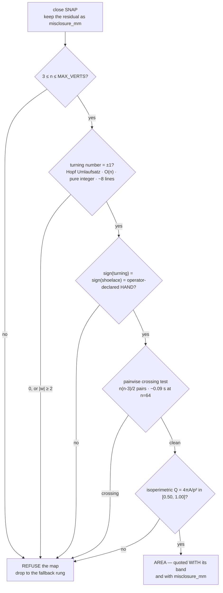

# Research — bounded-memory boundary mapping ("micro-SLAM"), grounded in the literature

**Date:** 2026-09-09 · **Status:** RESEARCH, no hardware touched · **Owner:** Programmer + Designer ·
**Grounds and corrects:** [../plans/border-polygon-and-microslam-2026-09-08.md](../plans/border-polygon-and-microslam-2026-09-08.md)
(that plan STAYS; this note supplies the citations it reasoned without, and corrects it in six places — §8) ·
**Sets the task:** [../plans/2026-09-08-operator-briefing-corner-turns-to-competition.md](../plans/2026-09-08-operator-briefing-corner-turns-to-competition.md) ·
**Consumes:** [../plans/junction-handling-and-boundary-trace-2026-09-08.md](../plans/junction-handling-and-boundary-trace-2026-09-08.md) ·
[../plans/corner-arc-turns-and-recovery-2026-09-08.md](../plans/corner-arc-turns-and-recovery-2026-09-08.md)

The operator's brief: *"Trace out a polygon in memory … then FREE UP ALL THAT MEMORY of the raw trace …
like a micro-SLAM"*, and the hard part: the border *"might be an ARC … it might be a SQUIGGLE."*
Every quoted sentence below was read out of the source PDF **on this host** (`pdftotext` → `grep`), not out
of a search summary. Sources that could not be read are `[UNVERIFIED]` and are cited, never quoted.

---

## 1. TL;DR

**The literature endorses the algorithm and refutes the motive.** The family the operator described is
real, named, and proven O(1) in space; our specific choice inside it is defensible. But the argument
*for* it — memory — does not survive our own numbers, and for the thing the mission actually consumes
(lane count) a four-integer bounding box is not merely competitive, it is **identical by definition**.

| Question | Answer | Confidence |
|---|---|---|
| What is this called? | **one-pass error-bounded line simplification** over a **geometric (feature) map**; the whole pipeline is **online sensor-based coverage** | quoted from primary sources |
| Is it SLAM? | **No** — Thrun's definition excludes it, on the record | quoted |
| Which algorithm? | **Reumann–Witkam strip**, run at `τ = ε/2`, Opheim direction establishment | literature + [COMPUTED] |
| Does a polygon beat a bounding box? | **For lane count and sweep axis: NO, provably identical.** For enclosed AREA: yes, and only there | [COMPUTED] |
| Is the memory case sound? | **NO.** The raw trace in the representation the plan itself mandates is 2.4 kB; the simplifier that saves it costs ~4–6 kB of resident bytecode | [COMPUTED] |
| Should we correct the misclosure? | **No.** Bowditch improves the area and makes the *span* six times worse | [COMPUTED] |
| Is first-traced-edge defensible as the sweep axis? | **Yes, conditionally** — it is exact by construction, and min-altitude buys zero lanes | literature + [COMPUTED] |

**The one-line verdict.** Build the map as a **reporting** artifact and the plan as a **bounding box**;
defend the design as *bounded condensation with a stated error bound*, never as a memory saving.

---

## 2. What this is actually called

"Micro-SLAM" is not a term of art — searching for it as a robotics term returns nothing `[UNVERIFIED
by absence]`. The real minimal-footprint names are **tinySLAM/CoreSLAM** (code), **NanoSLAM** (power),
**MeSLAM** (memory). Keep the operator's coinage as the project nickname, in quotes, once, beside the
real name.

| Our stage | The field's name | Source |
|---|---|---|
| Follow the tape all the way round | boundary / contour following; "wall following" in the coverage literature | Galceran & Carreras 2013 ([on disk](./papers/galceran2013-coverage-path-planning-survey.pdf)) |
| What we end up holding | **geometric / feature map** (a polyline) — not a grid, not topological | Thrun 2002, CMU-CS-02-111 |
| Condense the trace live | **one-pass error-bounded line simplification** (databases) = **line extraction** (robotics) = line simplification / vector generalization (cartography) | Lin et al., TODS 2021 |
| Free the raw trace | **streaming single-pass reduction** — *not* pose-graph sparsification | see below |
| Close the loop | **closed traverse**, **misclosure**, **compass (Bowditch) rule** — a *surveying* import | Deakin, RMIT `[UNVERIFIED]` — not read on this host |
| Area | **shoelace / surveyor's formula**, discrete Green's theorem — the robot is a **planimeter** | Meister 1769; standard |
| The sweep | **boustrophedon cellular decomposition**, generalised by Morse decomposition | Choset & Pignon 1997, via Galceran 2013 |
| The architecture | **online sensor-based coverage of an unknown environment**; closest published system is **CCR** | Butler, Rizzi & Hollis 1999, via Galceran 2013 |

**Is "SLAM" an overclaim? Yes, and a grader can check it in one sentence.** Thrun, *Robotic Mapping: A
Survey* (CMU-CS-02-111, Feb 2002, § Occupancy Grid Maps), verbatim, extracted from the PDF here:

> "The mapping algorithms described above all address the mapping problem with unknown robot poses which,
> as pointed out above, is known as the simultaneous localization and mapping (SLAM) problem. The simpler
> case—mapping with known poses—has also received attention in the literature."

We are in **neither** box: our poses are dead-reckoned and [MEASURED] to misclose 108 mm with 30° of
heading error, and are never estimated jointly with the map — errors flow one way and are never fed back.
Three things SLAM has that we do not: data association, a back-end that corrects *poses* from map
constraints, and covariance. Two sentences we *should* claim, from the same survey:

> "There are four basic advantages of object maps over grid maps: First, object maps can be more compact…"

and, from Wong & MacDonald 2003 ([on disk](./papers/wong2003-topological-coverage.pdf)), which is the
operator's own motive in print:

> "Existing methods generally use grid maps, which are susceptible to odometry error and may require
> considerable memory and computation."

**A precision trap.** Pose-graph sparsification (Kretzschmar & Stachniss 2012; Carlevaris-Bianco &
Eustice 2013 — both `[UNVERIFIED]`, bibliographic only) prunes a graph that already exists in memory; we
never build one. Cite it as *what we avoid needing*, never as our method.

---

## 3. Online simplification

### 3.1 The family is named and its O(1) claim is published

Lin, Ma, Jiang, Hou & Wo, *Error Bounded Line Simplification Algorithms for Trajectory Compression: An
Experimental Evaluation*, **ACM TODS 46(3), Article 11, Sept 2021**, §4.3 — verbatim, extracted here:

> "One-pass algorithms adopt local checking policies and run in O(n) time with an O(1) space complexity."

Named members: **RW, OPERB, SIPED, LDR, CISED, Intersect, Interval**. The survey separates these from
*online* algorithms (OPW, SQUISH-E, BQS), which stream but hold a window and so are O(|window|), not O(1).
The plan's §2.1 claim that Reumann–Witkam is *"the only candidate that is genuinely O(1) memory and
error-bounded"* is therefore **wrong on "only"** — there are at least six, and RW is the weakest:

> "RW is fast but has a poor compression ratio."

Original citation, from the survey's reference [51]: *K. Reumann and A.P.M Witkam. 1974. Optimizing curve
segmentation in computer graphics. In Proceedings of the 1973 International Computing Symposium.*

### 3.2 The half-ε convention — our config names the strip, not the guarantee

> "Algorithms SIPED, LDR, OPERB, CISED, and Intersect share a common idea, i.e., using a half-ϵ …"
> — Lin et al., §4.3

That is exactly the geometry the plan derives independently in §2.2 (a strip of half-width τ gives a
**2τ** bound against the emitted segment). The literature's answer is to *name the guarantee*, not the
strip. Our `BORDER_EPS_MM = 25` is a strip half-width whose guarantee is 50 mm — and the plan then says
"inflate by `2·eps_final`" in §5 but "by `eps_final` on every side" in §2.2, disagreeing by a factor of
two. **Rename so `BORDER_EPS_MM` IS the guarantee (50) and the code uses `eps//2` internally.**

### 3.3 Why not batch Douglas–Peucker — three reasons, not one

Douglas & Peucker 1973 (*The Canadian Cartographer* 10(2):112–122; independently Ramer 1972). Rejected
because (a) it needs the whole path — the thing the operator wants freed; (b) it is O(n²), and the
O(n log n) improvement buys speed with a dynamic convex-hull structure, i.e. *more* code and *more* heap
`[UNVERIFIED]`; and (c) **it is recursive**, and MicroPython raises on deep recursion rather than
degrading. Reason (c) is specific to our hardware and is written down nowhere else here.

### 3.4 What each does to an ARC versus a CORNER — the operator's actual question

Host simulation, points sampled at the 20 mm `STEP` gate, all three tolerances set to the **same** provable
50 mm bound. Cells are *(vertices emitted / true max deviation, mm)* [COMPUTED, this session]:

| case | RW, τ=25 | centred sleeve, τ=25 | SIPED, ε=50 |
|---|---|---|---|
| straight 3048 mm | 2 / 0.0 | 2 / 0.0 | 2 / 0.0 |
| sharp 90° corner | **3** / 20.0 | **3** / 40.0 | **3** / 40.0 |
| arc R=300 mm, 90° | 4 / 13.9 | 4 / 20.7 | 3 / 33.6 |
| arc R=3000 mm | 13 / 7.4 | 10 / 14.1 | 7 / 35.4 |
| arc R=12000 mm (a bow you lay without noticing) | **24** / 7.0 | 18 / 13.5 | **12** / 36.1 |
| squiggle ±100 mm / 600 mm | **22** / 21.7 | 12 / 36.0 | 12 / 39.7 |

Two readings. **Corners are free under every method** — three vertices each — so no algorithm choice turns
on corner behaviour, and the plan's refutation of the fixed-heading rule stands (its own "~24 vertices per
90° at R=12000" is exactly what I measure for RW). **RW is grossly over-conservative on arcs**: 24 vertices
to deliver 7.0 mm when 50 mm was permitted — the survey's "poor compression ratio", quantified.

**Reject the centred sleeve** (Zhao & Saalfeld, AutoCarto 13, 1997 `[UNVERIFIED]`, not read). It cuts the
R=12000 arc from 24 to 18 vertices, but its key vertex sits mid-window, so the provable bound against the
emitted segment is **4τ**, not 2τ. A 25 % vertex saving is worth nothing at 4 B/vertex; a factor-two loss
in a *stated* bound is worth a lot in a report whose thesis is the bound. **Keep RW — defended on code
size and the absence of a `sqrt`, not on uniqueness.** The documented upgrade, with a measured trigger (a
real trace overflowing the cap), is **SIPED**: same class, same O(1), same ε, ~half the vertices on a
curve, ~25 extra lines. Do not build it speculatively.

### 3.5 Pseudocode, integer millimetres

Two deletions from the plan's §2.5, both simplifications.

```python
# src/border.py -- pure integer geometry. Constants arrive as ARGUMENTS (`config` is SHADOWED on the hub).
# GUARANTEE: every trace point lies within `eps` mm of the emitted polyline, where eps = 2*tau.
from math import sqrt

def feed(self, x, y, hdg_ddeg):
    if x < self.xmin: self.xmin = x                 # 1. AABB, UNCONDITIONAL: the always-valid answer
    elif x > self.xmax: self.xmax = x
    if y < self.ymin: self.ymin = y
    elif y > self.ymax: self.ymax = y
    dx = x - self.gx; dy = y - self.gy              # 2. distance gate: ~90% of ticks leave in 4 ops
    if dx*dx + dy*dy < self.step2: return
    self.gx = x; self.gy = y
    ax = x - self.kx; ay = y - self.ky
    if self.ux == 0 and self.uy == 0:               # 3. Opheim minTol direction establishment.
        if ax*ax + ay*ay >= self.dirmin2:           #    ONE sqrt == once per EMITTED VERTEX, ~64 a
            self.ux = ax; self.uy = ay              #    lap. NEVER on the hot path.
            self.taulen = int(self.tau * sqrt(ax*ax + ay*ay))
        self.lx = x; self.ly = y
        return
    c  = self.ux*(y - self.ky) - self.uy*(x - self.kx)      # 4. strip test. |c| ~ 1e5: no big-int,
    dh = (hdg_ddeg - self.khdg + 1800) % 3600 - 1800        #    no allocation, nothing squared.
    if (c > self.taulen or -c > self.taulen
            or ax*ax + ay*ay >= self.maxseg2
            or dh >= self.corner or -dh >= self.corner):
        self._emit(self.lx, self.ly)                # the LAST IN-CORRIDOR point is the vertex
        self.kx = self.lx; self.ky = self.ly; self.khdg = hdg_ddeg
        self.ux = 0; self.uy = 0; self.gx = x; self.gy = y
    self.lx = x; self.ly = y
```

1. **Delete `unit1024()` and the ×1024 fixed point** (~10 lines, one class of sign bug). Nothing is
   squared on the hot path, so the big-integer promotion the plan solves with scaling never arises.
2. **Delete the `math.isqrt` question.** MicroPython's `math` documents `sqrt` and **no `isqrt`**
   (docs.micropython.org/en/latest/library/math.html; `[UNVERIFIED]` for *this* Hub OS build — one
   `dir(math)` settles it). Use `math.sqrt`, once per emitted vertex.
3. **Set `MAXSEG` large by default** — it is not what makes the algorithm error-bounded. [COMPUTED] on a
   perfect 3048 mm square: `MAXSEG=1000` → 16 vertices, −0.077 % area; off → 5 vertices, −0.980 %. It buys
   ~0.9 % of area for **11 of the 64 vertex slots**, which is what pushes the ±100 mm squiggle over the
   cap. (`DIRMIN` over 20–200 mm changed nothing: 5 vertices throughout — it is not the sensitive knob.)

`MAX_VERTS = 64` is marginal, confirming the plan's R-8 independently. [COMPUTED] at the 50 mm guarantee:
clean rectangle 5 · 12 m bow 24 · ±25 mm/600 mm 45 · ±50 mm/600 mm 49 · **±100 mm/600 mm overflows** ·
±50 mm/300 mm overflows.

---

## 4. Area, and its failure mode

`A = ½·|Σ (xᵢ·yᵢ₊₁ − xᵢ₊₁·yᵢ)|` — the **shoelace**, also the *surveyor's formula*, attributed to Meister
(1769), trapezoid form to Gauss. Each term uses two consecutive vertices, so it accumulates in **three
scalars**: the discrete case of Green's theorem, and the reason a mechanical **planimeter** measures area
by tracing a boundary it never records. *A wheeled robot driving the tape while accumulating x·dy is a
planimeter with encoders instead of a tracing arm* — the report's centrepiece, and free.

**The failure mode: a self-intersecting polygon does not raise. It returns the winding-number-weighted
area, silently.** [COMPUTED]: a square walked as a bowtie returns exactly 0; a double lap returns 2×; a
figure-eight with unequal lobes returns |A₁−A₂| — an ordinary-looking number. **And the lie runs in the
dangerous direction:** a crossing subtracts, so area is under-reported, so *coverage fraction =
swept/polygon* is **over**-reported — the silent-mine-loss failure the design exists to prevent, arriving
through the area calculation.

**CORRECTION to the plan's §4.** It asserts the drifted quadrilateral *"is not self-intersecting"* with
−13.7 % area. That holds only under a **closure convention it never states**, and the two differ
enormously. Re-walking the [MEASURED] per-turn profile (−97.45°/turn) at 3048 mm scale:

| convention | area error | turning number | simple? | span error |
|---|---|---|---|---|
| **SNAP** (drop the drifted endpoint; join the last corner to v₀) | **−13.7 %** | −360° | **yes** | **+1.80 %** |
| **KEEP** (emit the drifted endpoint as a real vertex, then close) | −23.2 % | **0°** | **NO — edge 0 crosses edge 3** | **+16.7 %** |

KEEP self-intersects for **every** over-turn tested (−91° through −97.45°). **Recommend SNAP, and say so
in the code**: it never crosses in this family, it halves the area error, it is a *ninth* of the span error
— and the discarded endpoint is not lost, it becomes `misclosure_mm`, which the plan already uses to size
the lane-end window. Because span drives the lane count, SNAP-vs-KEEP is a lane-count decision, not a
reporting nicety.

**The free integer validator the plan is missing: the discrete Hopf Umlaufsatz.** A *simple* closed polygon
has turning number exactly ±1 (Hopf's theorem of turning tangents; polygonal statement in Knill, Harvard
MATH 136 Unit 6). It is computable with **no trigonometry**, as the winding number of the edge-direction
sequence about the origin — ~8 lines of exact integer arithmetic, O(n). [COMPUTED] against a float `atan2`
reference on 8 polygons, perfect agreement: square +1 · concave L +1 · SNAP quad −1 · **bowtie 0 · KEEP
quad 0 · double lap 2**. **This strictly beats the plan's validation gate #2**, which tests
`|turn_sum| ∈ [300°,420°]` from the **integrated gyro** — a drifting sensor which on this very run read
−389.8° and therefore **passes the bad polygon**. Keep the gyro turn-sum as a cross-check *of the gyro*
(the plan's gate #3 already sets up that three-channel test); the **map** validator should be this.

**It is necessary, not sufficient** — two crossings of opposite sense cancel, so a self-intersecting
polygon can still score ±1 (a 7-gon counterexample was found this session). On our failure family — a
drifted lap closed by a chord — it caught every case. So use it as the free screen and keep the pairwise
crossing test as the validator: n(n−3)/2 pairs, four integer cross products each, ~15 lines, O(1) heap,
[COMPUTED] 0.9 ms at n=64 on the host → **~0.09 s on the hub** at a conservative ×100 `[ASSUMED]`, once,
motors stopped. Cheap enough to be unconditional.

Integer range: referenced to v₀, the worst-case 64-term shoelace sum is 594 579 456, inside MicroPython's
31-bit small-int range — **the plan's figure is correct**, and the origin shift is insurance, not a fix
(terms telescope; the real peak is ~1.5×10⁷). The genuine silent-corruption risk is the one the plan
already names: `array('h')` wraps past 32 767 mm.



---

## 5. Loop closure — correct, or refuse?

### 5.1 Where our odometry actually sits

Relative precision (misclosure ÷ perimeter) is the surveyor's quality metric. Ours is **108.3 mm / 1277 mm
= 8.48 % = 1:11.8** [MEASURED]. Against the published benchmark — Borenstein & Feng, *UMBmark*, SPIE Mobile
Robots X, 1995 ([on disk](./papers/borenstein1995-umbmark-benchmark.pdf)), 4×4 m square, 16 m path:

| system | E_max,syst | relative precision |
|---|---|---|
| **ours, one lap** | **108.3 mm / 1277 mm** | **1:11.8** |
| TRC LabMate, uncalibrated | 310 mm | 1:51.6 |
| TRC LabMate, +3 layers of tape on one wheel | 423 mm | 1:37.8 |
| after two-parameter calibration (1995b Table I, after-compensation column: 12–35 mm) | 12–35 mm | ~1:460–1:1330 |
| ordinary engineering-survey traverse | — | 1:5000 |

That comparison is the honest headline for the Intro Report: **we are ~4× worse than an *uncalibrated*
1996 research robot and ~400× outside surveying tolerance.**

**And our 1 ft square is the exact test Borenstein published to say is unsuitable.** Verbatim: *"we will
show that this test is unsuitable for differential drive vehicles. An 'unsuitable' test in this context is
a test that might produce a 'perfect' score, even though the robot has potentially huge odometry errors."*
Wheel-diameter ratio (curved legs) and wheelbase (wrong turn angle) each alone produce the same return
error, and tuning only the wheelbase to cancel a curved leg yields *apparently* excellent results. **That
is the named textbook error, and it is precisely what the plan's fitted +7.43°/corner correction risks
being.** The published fix: **UMBmark** — the same square **CW *and* CCW**, five runs each, absolute pose
measured against a wall. Table I of the 1995b paper
([on disk](./papers/borenstein1995b-systematic-odometry-correction.pdf)) reports eight experiments,
10×–22× improvement across the set (317→21, 349→32, 232→12, …). **This is a better use of hub time than
any polygon work**, and its step 1 *is* the repo's own "one free question for the Builder".

One caveat, verbatim: *"On most smooth indoor surfaces systematic errors contribute much more to odometry
errors than non-systematic errors"* — every published figure is on smooth concrete; we are on carpet, which
adds its own directional bias (iRobot US 9,427,875 B2 `[UNVERIFIED]`, not read off the patent face). The
consequence nobody here has written down: **a boustrophedon sweep drives alternately with and against the
grain, so carpet drift alternates sign lane-to-lane; a border trace drives each heading exactly once.**

### 5.2 Bowditch makes the lane plan WORSE — this changes the plan

The compass rule apportions the misclosure to each leg in proportion to its length. Its one surviving
modern justification, per Deakin's RMIT notes `[UNVERIFIED]`, not read here, is *the adjustment of a figure
prior to the computation of its area* — an **area-repair tool, not an accuracy tool** — and it assumes
bearings independent of one another, where ours come from an *integrating* gyro and are maximally
correlated.

[COMPUTED] replaying the [MEASURED] per-turn profile (−96.70, −97.40, −98.50, −97.10°) with the [MEASURED]
+2.5 % leg scale at 3048 mm legs:

| estimator | area error | first-edge perpendicular **span** error |
|---|---|---|
| **raw** | −8.5 % | **+1.80 %** |
| after angular correction only | +5.7 % | +3.83 % |
| **after Bowditch** | **+2.4 %** ✅ | **+10.70 %** ❌ |

**The span error grows six-fold.** Our misclosure is almost entirely *rotational*, and spreading a
rotational error linearly along path length pushes the far vertices outward perpendicular to the sweep.
Since span is the only quantity the lane planner consumes, **adjusting costs lanes we do not have time
for.** *(It is a pose-graph optimisation in disguise: minimise Σ‖dᵢ−zᵢ‖²/σᵢ² under a closure constraint
with σᵢ² ∝ Lᵢ, and the Lagrange solution IS the compass rule [DERIVED] — optimal for the **poses** under a
distance-proportional error model. Ours is rotation-dominated, which is exactly why it degrades the span.)*

**Verdict: compute the misclosure, report it, gate on it, do not adjust.** If an area figure is wanted for
the coverage-fraction report, Bowditch a **separate copy** of the vertices for the shoelace only — which is
precisely and only the use the surveying literature still endorses.

---

## 6. Coverage planning — is first-traced-edge defensible?

**Yes, and here is the stronger reason than the plan gives.** The number of lanes depends only on the
perpendicular span of the covered point set in the sweep direction; **that quantity IS the axis-aligned
bounding-box extent in a frame rotated to that heading, identically, by definition.** Verified to machine
precision on the drifted quadrilateral: `span_dir(polygon, 0°) == AABB height` exactly [COMPUTED].

Huang's minimum-altitude result (ICRA 2001, pp. 27–32) is real, is O(n) by rotating calipers, and —
pleasingly — originated in **demining**. `[UNVERIFIED]`: IEEE Xplore is paywalled and no open copy
surfaced, so every Huang claim here is at **second hand** via Vasquez-Gomez et al. (ICMEAE 2017) and the
Choset-lineage survey we hold on disk. **Do not quote Huang; pull the original through the ERAU library
before the report leans on it.** On our drifted quadrilateral [COMPUTED]:

| axis choice | heading error | cross-track over a 3048 mm lane | lanes @ 41 / 58.5 / 106 mm pitch |
|---|---|---|---|
| **first traced edge** | **0.00° by construction** (the odometry frame is anchored there) | **0 mm** | 29 / 52 / 74 |
| min-altitude edge (edge 2, two corners of accumulated turn error) | −14.10° | **742 mm** | 29 / 52 / 74 |
| AABB short side | — | — | 29 / 52 / 74 |

**Identical in every cell.** Min-altitude is discarding nothing real here — it is buying a heading that is
14° wrong for a benefit of zero lanes. So **delete the 64-dot-product search and `AXIS_GAIN_LANES`.**

**But state the condition the plan does not:** first-edge is optimal *because the arena is assumed square*.
For a 2:1 rectangle entered on a short edge it would double the lane count. The guard costs one comparison
and needs no polygon: **the AABB already yields both extents; sweep along the longer one.** For a rectangle
that *is* Huang's answer. ⚠ Fire it only when the extent difference exceeds the misclosure — at our drift
a *perfectly square* arena produced extents differing by 292 mm from turn bias alone, larger than a 106 mm
pitch, so a naive one-pitch discriminant reads drift as aspect ratio.

**Two further results that outrank the map entirely.**

1. **A full lap is worse than two adjacent sides.** [COMPUTED] at our [MEASURED] +7.43°/turn and +2.5 %
   leg scale, the AABB extents after n driven sides: 2 sides 3124×3103 mm (+2.50 %, +1.80 %); 3 sides
   3395×3103 (+11.4 %, +1.80 %); 4 sides 3395×3645 (+11.4 %, **+19.6 %**). Every extra turn injects bias
   that pushes the extents outward. Two adjacent sides determine a rectangle's bounding box completely,
   at one third of the turn error and half the driving. Trace the lap if the operator wants the polygon
   for the report — **but do not plan from it.**
2. **Inflate the span, and size the inflation from the span's own error band, not from `eps_final`.**
   Over 20 000 draws from a distribution fitted to four turns of one lap (*not* 20 000 laps — the
   distinction matters), the raw span-derived plan under-covers the true side in **71.3 %** of draws;
   inflating by ~107 mm drops that to **3.6 %** for one extra lane (~+3.4 % of sweep time). An uncovered
   47 mm strip 3048 mm long is 1.5 % of the arena, and a 76 mm note centred in it is a mine reported absent.
3. ⚠ **The number that actually decides the mission is not on this page.** A boustrophedon sweep of N lanes
   makes 2(N−1) 90° turns; at N=29 that is **56 turns and 416° of accumulated heading error** at our
   measured bias, and a single uncorrected lane reversal throws the far end of the next 3048 mm lane
   **782 mm** off [COMPUTED]. No map — polygon, box or config rectangle — survives that. This makes the
   tape-based lane-end re-fix a **requirement**, and it is the correct reason to stop tuning the map: the
   map contributes ~1 % of span error; the turn bias contributes ~400 % to the sweep.

⚠ **No lane count above is quotable in the report.** `SENSOR_SPACING_MM` is `[UNMEASURED]`, so the pitch is
unknown, so 29/52/74 are conditional figures. This hits the AABB and the polygon equally and so does not
change the recommendation — but no number goes to the instructor until a ruler has been on the mount.

---

## 7. The memory budget — including the cost of the code

**The memory case is refuted on our own numbers.** The plan's §2.3 prices the raw trace as a list of boxed
float tuples (~286 kB, "fits no plausible heap"). The same document mandates `array('h')` integer
millimetres. Priced in the representation it actually mandates [COMPUTED]:

| form | bytes | % of an optimistic 252 KiB heap `[UNVERIFIED]` |
|---|---|---|
| raw trace at the 20 mm STEP gate (~609 pts) | **2 436 B** | 0.94 % |
| every tick of a full lap (~3 600 pts) | **14.1 kB** | 5.6 % |
| the reduced 64-vertex map | 272 B | 0.11 % |
| **what the simplifier saves** | **~2.1 kB** | **<1 %** |
| **what the simplifier costs** (90–200 lines, at the [MEASURED] 0.89 bytecode/source ratio of `src/odometry.py`, 7 738 B → 6 885 B) | **~4–6 kB resident, plus transient parse** | 1.6–2.4 % |

**The online simplifier costs two to three times more heap than it saves.** (The brief's 40–80 kB estimate
for a few hundred lines is ~3× high, but it points the right way, and the plan's own §8 warning is right.)

Two consequences that the plan half-states and should state fully:

- **Never defend this as "we saved 286 kB."** Defend it as *bounded single-pass condensation with a stated
  error bound and O(1) state regardless of lap length* — which is true, checkable, and what a reviewer
  will accept. The published version of the motive is Thrun's "object maps can be more compact" and Wong &
  MacDonald's grid-map sentence (§2), neither of which depends on our heap figure.
- **The simplification may be misfiled as a hub problem.** The raw trace already goes to the telemetry CSV
  on `/flash` — flash, not heap — and the plan says it is never read back in. So the **host already has the
  full trace**, where batch Douglas–Peucker is free, unlimited-memory and strictly better than any one-pass
  method. The only thing that must happen on the hub is what the hub must *act* on, which is the span.
  That is the honest form of the operator's idea: the condensation is real and is the report's centrepiece,
  it just happens where it costs nothing.

---

## 8. What this changes in `border-polygon-and-microslam-2026-09-08.md`

That plan stays. It is right about the algorithm family, the corridor, the arc/heading refutation, `STEP`,
the `array('h')` wrap trap, the shoelace fitting in a small int, "lane count from spans not area", the
partial-trace AABB hole, and — in its own §1 — that *"a two-scalar rectangle beats a traced polygon at this
arena size."* **This note proves that last sentence rather than discovering it.** Six changes:

| § | Was | Becomes | Why |
|---|---|---|---|
| 2.1 | "RW is the **only** candidate that is O(1) and error-bounded" | one of ≥6 (RW, OPERB, SIPED, LDR, CISED, Intersect); RW is the **weakest** on compression; keep it for code size and no-`sqrt` | Lin et al. TODS 2021 §4.3, quoted |
| 2.2 / 5 | `EPS = 25` is the strip; §2.2 inflates by `eps`, §5 by `2·eps` | **`BORDER_EPS_MM = 50` IS the guarantee**; code uses `eps//2`; one inflation rule everywhere | the half-ε convention; removes a factor-2 ambiguity |
| 2.5 | `unit1024()` ×1024 fixed point; `math.isqrt` `[UNVERIFIED]` with a Newton fallback | delete both — precompute `taulen = τ·|u|` once per strip; `math.isqrt` is **absent** from MicroPython's `math`, use `sqrt` ~64× a lap | nothing is squared on the hot path |
| 4 | gate #2 = `|turn_sum| ∈ [300°,420°]` **from the gyro**; "the drifted quad is not self-intersecting" | **Umlaufsatz on the vertices** (8 lines, integer, exact) replaces gate #2; **state SNAP explicitly** — the "not self-intersecting" claim holds only under SNAP, and KEEP crosses every time | the gyro read −389.8° and **passes** the bad polygon |
| 3 (ADJUST branch) | angular correction → Bowditch → validate | **delete both from the planning path**; report `misclosure_mm`, gate on it, stop. Bowditch a *separate copy* for the area figure only | Bowditch: area −8.5 %→+2.4 %, **span +1.80 %→+10.70 %** |
| 5 | min-altitude over 64 dot products unless it saves `AXIS_GAIN_LANES = 2` | **delete the search and the constant.** First edge, guarded by "sweep the longer AABB extent **if the difference exceeds the misclosure**" | identical lane count; min-altitude picks a 14°-wrong edge |
| 2.3 / 8 | "~286 kB fits no plausible heap" as the motive | motive is the **stated error bound and O(1) state**; the raw trace is 2.4 kB and the simplifier costs ~2–3× what it saves | [COMPUTED] §7 |

Also: `border-trace-and-corners-2026-09-08.md` §5 gates on "an interior angle outside 60–120°", which is
written for a rectangle and would reject any legitimately concave traced polygon (an L-shaped arena, an
inward notch). The Umlaufsatz is the general replacement and scores a concave L correctly at +1.

And a repo-internal contradiction that must be settled before any span figure here is quoted: 
[../findings/square-drive-fusion-2026-09-03.md](../findings/square-drive-fusion-2026-09-03.md) records legs
at 294–305 mm against a 304.8 mm target (**under**-reads), while `border-trace-and-corners-2026-09-08.md`
§4.4 records **+1.6 % to +3.8 %** (**over**-reads) — **same run, opposite signs.** Borenstein removes the
scaling error from analysis precisely because it is trivially measurable. One tape measure settles it, and
every span number in this note moves with it.

---

## 9. Open questions and what would close them

| # | Question | What closes it |
|---|---|---|
| Q-1 | **Which trace mechanism feeds the simplifier?** Touch-stitching gives ~59 points a lap with a designed ±60 mm zigzag — larger than the tolerance, so there is nothing to simplify; line following at ~13–20 Hz gives thousands and makes the algorithm choice real. Until this is settled, RW-vs-SIPED can only be decided on code size. (= the plan's R-5) | a decision, not a measurement |
| Q-2 | **Was the robot physically near its start when the 1 ft square finished, or ~108 mm away?** Until answered, 108.3 mm is a *traverse misclosure* (internal inconsistency), not a dead-reckoning error | UMBmark steps 1 and 3: absolute pose against a wall, before and after |
| Q-3 | **Which sign is the leg scale error?** Two repo documents disagree about the same run (§8) | one tape measure, one straight drive |
| Q-4 | **Is the turn bias wheelbase (Type A) or wheel-diameter ratio (Type B)?** A single CW lap provably cannot tell them apart — that is the whole point of the bi-directional test | **one CCW lap** of the same square; yields both correction factors in closed form |
| Q-5 | **`SENSOR_SPACING_MM` is `[UNMEASURED]`**, so no lane count in this note is quotable | a ruler on the mount (the highest-value minute in the project, KU-M33) |
| Q-6 | **Is the hand-laid wander a gentle bow or a short-wavelength squiggle?** The vertex count swings from 45 to overflow across plausible amplitudes, and the two regimes want different algorithms | one tape measure and one photograph on the day |
| Q-7 | **`gc.mem_free()` on this hub with the existing 16 modules loaded.** Every percentage in §7, mine included, is against a Pybricks figure for firmware we do not run | one line at a REPL, next time the hub is up |
| Q-8 | **`dir(math)` and `float('1e40')`** — does this build really lack `isqrt`, and are floats single-precision? | two one-liners on the hub |
| Q-9 | **Does UMBmark calibration transfer across carpets?** Every published figure is on smooth concrete | run it on the competition surface if possible; look for alternating lane-to-lane cross-track sign |

**Sources that could NOT be read on this host and are therefore cited, never quoted:** Huang ICRA 2001
(paywalled — all claims second-hand via Vasquez-Gomez 2017); Deakin RMIT Ch. 6; Zhao & Saalfeld 1997;
Abam et al. SoCG 2007; Hershberger & Snoeyink; Shamos & Hoey 1976; Bentley–Ottmann 1979; Kretzschmar &
Stachniss 2012; Carlevaris-Bianco & Eustice 2013; Shi & Cheung 2006; Meratnia & de By 2004; Butler et al.
1999 (its description here comes from Galceran 2013, which *is* on disk); and every patent cited.

**Tooling note.** ResearchHub was down per the brief and not attempted. **docs-rag `/api/ask` is also
down** — it returns *"The embedding backend could not process this query"* for queries of every length,
which is the **embedding backend**, not the usual VPN/ollama fault, so `./scripts/stack.sh status` will not
diagnose it. Everything above came from the local `docs/research/papers/` corpus plus WebSearch/WebFetch
with local `pdftotext` extraction — a method worth reusing.
