# Compound / sequential mine signature — yellow-then-blue in one pass, minimally

> Created 2026-09-03. **NOTHING HERE HAS BEEN MEASURED.** No mine of any kind has been sampled. Every
> constant is a *shape*, marked `[ASSUMED]`; every claim resting on unmeasured ground is `[UNVERIFIED]`
> with the bench test that closes it in the last section.

## The day-of fact this answers

Operator, 2026-09-03: a "mine" **might** be a yellow sticky note **with a blue sticker on it**, versus a
plain yellow note that is **not** a mine. As the single downward sensor sweeps across a mine it reads a
**yellow region then a blue region within one pass**; a non-mine reads yellow only. **The exact colours
are unknown and may change** — this is *one example* of a compound signature, not a fixed spec. The
instructor may also **add or remove mines mid-run**, so there is **no fixed mine count**.

The narrowest defensible reading (CLAUDE.md): build the *plain-presence* path as the default and add the
compound rule as an **optional, config-selected** layer the operator can switch on — or off — at
competition **without a code change**.

## What already exists — build ON these, do not redesign

| Module | What it gives us | Reused |
|---|---|---|
| [`src/detector.py`](../../src/detector.py) | 4-state Schmitt edge counter over one scalar/sample; emits an `Event(start_index, end_index, peak_signal, accepted, reason)` on each falling edge, width-gated. | The whole state machine, **unchanged**. |
| [`src/classify.py`](../../src/classify.py) | `classify(classes, rgb_samples) -> (name or None, reason)` — chromaticity nearest-centroid, reject-to-UNKNOWN. | Called on **windows** of an event's buffer instead of once. No new maths. |
| [`src/floor_anomaly.py`](../../src/floor_anomaly.py) | Colour-agnostic presence: learns the floor, feeds `detector.py` a deviation scalar. One anomaly envelope per not-floor patch. | The presence front-end for `any-anomaly`. |
| [`src/event_filter.py`](../../src/event_filter.py) | Report-by-exception log; `consider(t_ms, values, event="MINE")` **forces** a timestamped row. | The **landmark log** for report-as-you-go (Q3). |
| [`src/odometry.py`](../../src/odometry.py) | `Pose(x_mm, y_mm, heading_deg)`. | Tags each event with a position. |
| [`src/result.py`](../../src/result.py) | Counts by colour; `status` never assumes a total (`STATUS_TIMEBOX`/`COMPLETE`). | Already dynamic-arena-safe; unchanged. |

**The gap:** the pipeline turns a patch into *one classified colour*. A compound mine is *an ordered
pair of colours*, and the arena is *dynamic*. Both are closed by small pure additions — no new detector,
no map, no vision system.

## Data flow

```mermaid
flowchart TD
    A["detector.py Event<br/>(accepted, start/end sample)"] --> B["tag with Pose<br/>x_mm,y_mm at the event's tick"]
    B --> C["segments_of_event&#40;&#41;<br/>classify.py on ORDERED windows<br/>of the event's rgbi buffer<br/>&rarr; ['Y'] or ['Y','B'] or ['?']"]
    C --> D{"cross-event stitch?<br/>(SIG_ADJ_MM, same lane)"}
    D -->|adjacent| E["mine window =<br/>stitched segment list"]
    D -->|isolated| E
    E --> F["is_mine&#40;window, MINE_SIGNATURE&#41;"]
    F -->|any-anomaly| G[any accepted event = mine]
    F -->|colour:X| H[X in window]
    F -->|sequence:X,Y| I["[X,Y] is a contiguous<br/>subsequence of window"]
    G --> J
    H --> J
    I --> J{is a mine?}
    J -->|yes| K["dedupe by position<br/>(DEDUPE_MM tolerance)"]
    K -->|new| L["landmark log:<br/>event_filter MINE row<br/>+ pose + colour"]
    K -->|re-seen| M["confirm existing landmark<br/>(n_hits++), no double count"]
    J -->|no| N[drop]
```



Only three things are new: `segments_of_event()` (classify on windows), `is_mine()` (a subsequence
test), and a flat dedupe list. Everything else is existing code called in order.

## Q1 — the sequence predicate

**Model: a mine is a target ordered colour list matched as a contiguous subsequence of a "mine window."**

A **segment** is a maximal run of same-classified samples. Most events yield one segment (a plain yellow
note → `['Y']`); a compound mine yields `['Y','B']`. Segments arise two ways, and the predicate does not
care which:

- **Within one event (the primary case).** The floor-anomaly deviation stays high across *both* yellow
  and blue (both are unlike the floor), so a yellow-with-blue-sticker is **one** anomaly envelope. Walk
  the event's buffered `rgbi` in order, `classify()` a sliding window, and emit a new segment when the
  label changes and holds ≥ `SIG_MIN_SEG_SAMPLES`. `['Y','B']` falls straight out. *(This is why you
  cannot classify the whole event by one median — a Y+B median is a blend and returns UNKNOWN. The
  ordered head/tail is the signal; the median throws it away.)*
- **Across two adjacent events (the fallback).** If exposed floor separates the stickers so the deviation
  *dips*, you get two events. Stitch consecutive accepted events into one window when they are in the
  **same lane** and their pose-centroids are within `SIG_ADJ_MM`. Off by default.

Adjacency, then, is a handful of parameters:

```python
# In config.py. Operator-editable; all [ASSUMED] until the bench test.
MINE_SIGNATURE      = "any-anomaly"   # the knob (Q2). Default = plain presence.
SIG_MIN_SEG_SAMPLES = 2               # reuse of MIN_DWELL_SAMPLES: a colour run this short is noise.
SIG_ADJ_MM          = 90.0            # [ASSUMED] max gap to stitch two events as ONE signature.
                                      # ~ one target size (TARGET_SIZE_MM 76) + a margin. Cross-event
                                      # stitching only; ignored when a mine is one envelope. 0 disables.
```

The predicate itself is a few lines, pure, MicroPython-safe:

```python
def is_mine(window_colours, signature):
    """window_colours: ordered list of segment labels, e.g. ['yellow','blue'].
       signature: (mode, colours) from parse_signature(). Returns True/False."""
    mode, want = signature
    if mode == "any":
        return len(window_colours) >= 1               # presence: any accepted event
    if mode == "colour":
        return want[0] in window_colours              # one named colour anywhere in the window
    if mode == "sequence":                            # want e.g. ('yellow','blue')
        n = len(want)
        return any(tuple(window_colours[i:i+n]) == want
                   for i in range(len(window_colours) - n + 1))  # contiguous subsequence
    return False
```

Length-generic for free: `sequence:X,Y,Z` needs no code change. UNKNOWN segments simply never match a
named colour, so a mine is only claimed when the colours are actually resolved — honest by construction.

## Q2 — the `MINE_SIGNATURE` knob

**One string in `config.py`, parsed to the smallest possible structure — a `(mode, colours)` tuple.** The
operator edits the string at 09:00 on Demo Day; no code changes.

| `MINE_SIGNATURE` value | Parsed to | Means | Needs colour calibration? |
|---|---|---|---|
| `"any-anomaly"` **(default)** | `("any", ())` | every accepted anomaly is a mine | **No** — floor-anomaly only |
| `"colour:yellow"` | `("colour", ("yellow",))` | a patch classified `yellow` is a mine | Yes: one named class |
| `"sequence:yellow,blue"` | `("sequence", ("yellow","blue"))` | ordered `yellow`→`blue` in one window is a mine | Yes: two named classes |

```python
def parse_signature(s):
    """'any-anomaly' | 'colour:X' | 'sequence:X,Y[,Z...]' -> (mode, tuple_of_colours)."""
    s = s.strip()
    if s == "any-anomaly":
        return ("any", ())
    kind, _, rest = s.partition(":")
    cols = tuple(c.strip() for c in rest.split(",") if c.strip())
    if kind == "colour" and len(cols) == 1:
        return ("colour", cols)
    if kind == "sequence" and len(cols) >= 2:
        return ("sequence", cols)
    raise ValueError("bad MINE_SIGNATURE: " + repr(s))   # fail loud at startup, never mid-run
```

Three properties that make this the right knob:

- **Graceful degrade / disable-able.** `any-anomaly` needs no colour classes at all, so if colour
  calibration is impossible on the day (unknown pastel on unknown carpet — the standing risk in
  [floor-relative-colour-anomaly](./floor-relative-colour-anomaly-2026-09-03.md)) the operator drops to
  `any-anomaly` and the robot still finds every not-floor patch. The compound layer is strictly additive.
- **The colour names are labels, not fixed colours.** The exact mine colours are unknown and may change.
  The operator calibrates whatever two colours appear on the day, names them `A`/`B`, and sets
  `MINE_SIGNATURE="sequence:A,B"`. The order is the only fixed thing.
- **One parse at startup, then a pure predicate per event.** No branching scattered through the sweep;
  the mode is decided once.

## Q3 — dynamic arena: report as you go, dedupe re-sightings

**Never assume a total. Log each mine the instant it is seen, with its pose. Re-sweeping may re-see or
miss — reconcile by position, not by count.** All of this rides the **existing** significant-event log.

**Log on sight (the landmark row).** When `is_mine()` fires, force one row through the event filter with
the pose and colour attached:

```python
efilter.consider(t_ms, {"x_mm": pose.x_mm, "y_mm": pose.y_mm,
                        "sig": "|".join(window_colours)}, event="MINE")
```

That is a timestamped, pose-tagged landmark in the stream we already write to `/flash` and retrieve over
USB. No new logging channel; `MissionResult` already refuses to state a total on a truncated run
(`STATUS_TIMEBOX`), so the accounting side is already dynamic-arena-safe.

**Dedupe by position, with tolerance.** Keep a tiny in-RAM list of confirmed landmarks
`(id, x_mm, y_mm, colour, n_hits)`. A new `MINE` at `(x,y)`:

```python
def resolve(landmarks, x, y, tol_mm):
    for lm in landmarks:
        if math.hypot(x - lm.x, y - lm.y) <= tol_mm:
            lm.n_hits += 1           # same mine re-seen: confirm, do NOT count again
            return lm, False
    lm = Landmark(len(landmarks), x, y, ...); landmarks.append(lm)
    return lm, True                  # genuinely new mine
```

```python
DEDUPE_MM = 120.0   # [ASSUMED] two detections within this are the SAME mine. Must exceed
                    # (target size + odometry position error over a revisit) so one note is not
                    # logged twice, yet stay under the min spacing between distinct mines so two
                    # are not merged. Bounded BELOW by odometry drift, not by the sensor.
```

`DEDUPE_MM` is **odometry-limited, not sensor-limited**: the same physical note read on two passes lands
at two *estimated* poses that differ by the accumulated cross-track/heading error
([detection-odometry-coverage](./detection-odometry-coverage-2026-09-01.md),
[odometry-fusion-and-health](./odometry-fusion-and-health-2026-09-01.md)). Set it from that error, not
from a ruler.

**Removal — stay honest.** A mine removed mid-run and re-swept is simply *not detected*. **Do not delete
the landmark on a miss:** absence of a detection is not proof of removal (it could be drift, a grazing
pass, or an unreadable tick). Instead, if a lane passes within `DEDUPE_MM` of a known landmark and emits
no `MINE`, log a **negative observation** (`event="SWEEP_EMPTY_NEAR L##"`) and let the human reconcile
the append-only log. The record of account is the **observation log**, not a single mutating count; the
"current count" is just the number of un-refuted landmarks, derivable from the log after the run. This is
the honest-instrumentation rule (never fabricate a removal) applied to a moving arena.

Everything above is a flat list plus rows in a log that already exists. No map, no data-association
optimiser, no re-projection.

## Q4 — what NOT to build (so the program stays modifiable on the day)

- **No image processing / no colour-region-adjacency graphs.** The one on-topic academic hit
  (*Video surveillance tracking using colour region adjacency graphs*, IEE 1999, via ResearchHub
  2026-09-03) is exactly the 2-D vision pipeline we are **not** building. We have one scalar per tick and
  a subsequence test, not a segmented image and a region graph.
- **No ML, no training, no new classifier.** The existing nearest-centroid `classify.py` is the whole
  colour engine; the compound layer is a run-length pass and a subsequence match over its output.
- **No fixed mine count / no "expect N" / no completion-by-count.** Completion is by **coverage** (lanes
  swept), never by hitting a target number — the count is not knowable and changes mid-run.
- **No multi-pass fusion, no SLAM, no probabilistic data association.** Dedupe is one distance tolerance
  against a flat list — not a Kalman filter, not JCBB, not a global map optimise.
- **No second detector and no new state machine.** `detector.py` runs unchanged; segmentation is
  `classify.py` on windows of the buffer it already collects.
- **No auto-removal logic.** A miss never deletes a landmark; humans reconcile the append-only log.
- **No new heavy config surface.** Two new constants (`SIG_ADJ_MM`, `DEDUPE_MM`) plus one string knob;
  `SIG_MIN_SEG_SAMPLES` reuses the `MIN_DWELL_SAMPLES` convention.
- **Do not hard-code the colours.** `yellow`/`blue` live only in the `MINE_SIGNATURE` string; the exact
  colours are unknown and may change, so they are a knob, never a literal in the logic.

## `[ASSUMED]` / `[UNVERIFIED]` register

| # | Claim / value | Why unverified | How it closes |
|---|---|---|---|
| U1 | A compound mine reads as **one** anomaly envelope (deviation stays high across Y and B). | Depends on both colours being unlike the learned floor; no floor/mine sampled. | Bench: log a Y+B note over the real floor; confirm one envelope, and Y-then-B in the buffer order. |
| U2 | Both colours are separately **classifiable** on the day (two calibrated classes clear the separability gate). | Pastel-on-carpet separability is unmeasured ([classify.py](../../src/classify.py) `separability_report`). | Calibrate both on the day; run the existing separability check before arming `sequence` mode. |
| U3 | `SIG_MIN_SEG_SAMPLES = 2` and the sliding window cleanly split Y-then-B without spurious segments at the seam. | Segment smoothing vs the blended edge samples is unmeasured. | Replay a recorded compound crossing; count segments; tune the window. |
| U4 | `SIG_ADJ_MM = 90` stitches a *separated* pair without merging two distinct mines. | Sticker geometry and inter-mine spacing unknown. | Measure the real note/sticker layout; set from it. Leave at 0 (off) unless a dip is observed. |
| U5 | `DEDUPE_MM = 120` exceeds revisit odometry error yet stays under min mine spacing. | Odometry position error over a revisit is unmeasured (cross-track KU still open). | Sweep one fixed note twice; measure the pose gap between the two detections; set above it. |
| U6 | Report-as-you-go survives a mid-run add/remove without double-count or phantom removal. | No dynamic-arena run has happened. | Bench: add and remove a note mid-sweep; check the log shows one MINE per add and a negative obs, not a deletion. |

## The ONE bench test that validates this

**Record one compound crossing and one plain-note crossing; process offline; check the predicate.** No
new hardware, mirrors [color-discrimination § 8](./color-discrimination.md)'s replay method.

1. Learn the floor and calibrate the two colours on the real surface (existing flow).
2. Drive slowly over (a) a plain yellow note and (b) a yellow+blue compound note, logging raw `rgbi` to
   `/flash`, retrieved over USB ([telemetry-offload-paths](./telemetry-offload-paths.md)).
3. Offline: run `detector.py` → `segments_of_event()` → `is_mine()` for each of `any-anomaly`,
   `colour:yellow`, `sequence:yellow,blue`.
4. **Pass criteria:** the compound note yields segments `['yellow','blue']` in order and `is_mine` is
   True under `sequence`; the plain note yields `['yellow']` and is **False** under `sequence` but True
   under `colour:yellow` and `any-anomaly`. Sweep the same note twice and confirm the dedupe list holds
   **one** landmark with `n_hits == 2`.
5. Record the numbers, not the verdict (CLAUDE.md): the per-segment classified colours, the seam sample
   count, and the two-pass pose gap that sets `DEDUPE_MM`. That table is the Intro Report's evidence.

## Sources

- The pipeline this extends (read 2026-09-03): [`detector.py`](../../src/detector.py),
  [`classify.py`](../../src/classify.py), [`floor_anomaly.py`](../../src/floor_anomaly.py),
  [`event_filter.py`](../../src/event_filter.py), [`odometry.py`](../../src/odometry.py),
  [`result.py`](../../src/result.py), [`config.py`](../../src/config.py).
- [floor-relative-colour-anomaly-2026-09-03.md](./floor-relative-colour-anomaly-2026-09-03.md) — the
  `any-anomaly` presence front-end and the same-hue-as-a-floor-band blind spot;
  [color-discrimination.md](./color-discrimination.md) — nearest-centroid classification and the replay
  bench method; [detection-odometry-coverage-2026-09-01.md](./detection-odometry-coverage-2026-09-01.md)
  and [odometry-fusion-and-health-2026-09-01.md](./odometry-fusion-and-health-2026-09-01.md) — the
  position error that bounds `DEDUPE_MM`.
- ResearchHub (`scripts/rh-query.sh`, 2026-09-03) — only on-topic hit was *Video surveillance tracking
  using colour region adjacency graphs* (IEE 1999), cited above as the heavyweight vision approach we
  reject; no lightweight source found, so the method rests on the in-repo colour research (primary-sourced
  to LEGO techspecs). docs-rag `/api/ask` errored (embedding backend); read the modules directly instead.
