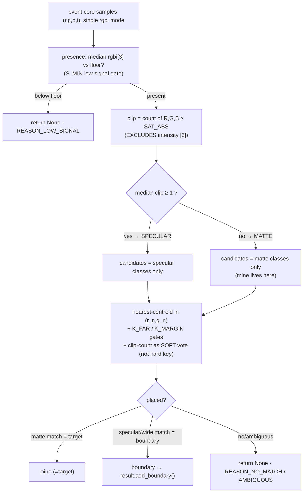
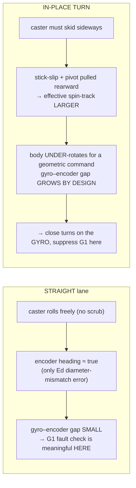
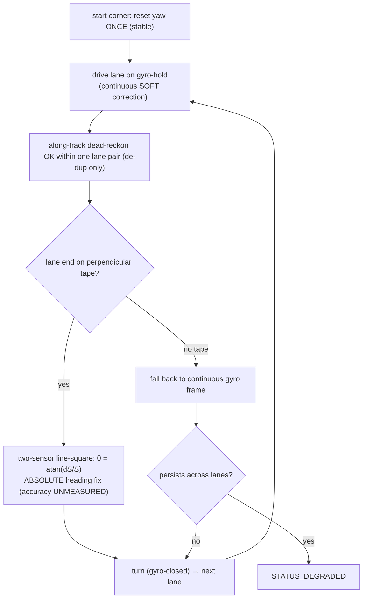
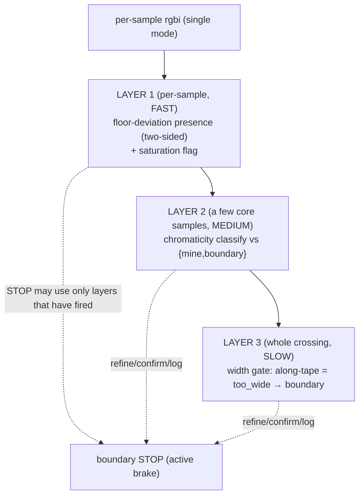

# Detection, Odometry & Coverage — design brief for the robot AS BUILT

> **Type:** RESEARCH (design brief) · **Created:** 2026-09-01 · **Owner:** the **Programmer**
> **Designs to:** the chassis measured 2026-09-01 — differential drive (A=LEFT, B=RIGHT, id 48,
> forward A:−v B:+v, direct drive 1 rev = 360 enc-deg), a **single fixed unidirectional rear roller**
> that rolls fore/aft but resists sideways scrub, and **two down-facing colour sensors** (C=LEFT,
> D=RIGHT, id 61) straddling the width, each giving `color()` / `reflection()` / `rgbi()` (channels
> **0–1024 MEASURED**).
> **Refines, never replaces:** [../plans/competition-program-design.md](../plans/competition-program-design.md)
> (the run's state machine) and [../plans/mission-algorithm.md](../plans/mission-algorithm.md).
> **Techniques from:** [color-discrimination.md](./color-discrimination.md) ·
> [motion-control-and-odometry.md](./motion-control-and-odometry.md) ·
> [detection-and-sweep-techniques.md](./detection-and-sweep-techniques.md).
> **Measured behaviour from:** [../findings/colour-first-look-2026-09-01.md](../findings/colour-first-look-2026-09-01.md)
> · [../findings/drive-checkpoint-2026-09-01.md](../findings/drive-checkpoint-2026-09-01.md).
> **Numbers come from:** [../plans/bench-measurement-plan.md](../plans/bench-measurement-plan.md).

**Nothing in this brief has been measured on a mission surface at the built geometry.** Every threshold
is `[ASSUMED]` and every physical magnitude is `[UNVERIFIED]` unless it cites a measurement that exists.
The rule this brief obeys — the whole point of writing it now — is that a clarified answer or a bench
number changes a **value in `config.py`**, never a state in the machine or a module in the tree. Where a
design maps onto an existing module, the change is **additive**: `classify()`, `EdgeCounter`, `SweepPlan`
and `Odometry.update` are left as they are; new helpers sit beside them.

**Two conventions used throughout.** (1) Everything is expressed in **encoder-degrees / wheel-revs and
gyro-degrees** wherever mm is not yet convertible — wheel diameter is UNMEASURED (KU-M3), so there is no
deg→mm scale. (2) Confidence is split into **structural** (is the shape of the rule sound?) and
**measured** (has it been observed on a real mission surface at the built geometry?). This split is a
folded-in challenge correction: several decisions below are structurally sound and empirically **at
zero** — the saturation signal in particular has only ever been seen on laminated *substitute cards* at
the wrong (~51 mm) height, never on matte yellow paper or real floor tape at the corrected ~16 mm mount.

**One prerequisite gates most of this brief.** The two sensors are still mounted **~51 mm up**; LEGO's
optimal is **16 mm**. No clip, reflection, or chromaticity number below is trustworthy until the mount is
lowered. Treat "lower the mount to ~16 mm" as a build prerequisite, not an unknown.

---

## Contents

- [A. Colour fusion — specularity as a feature, not a failure](#a-colour-fusion--specularity-as-a-feature-not-a-failure)
- [B. Odometry and the scrubbing caster](#b-odometry-and-the-scrubbing-caster)
- [C. Coverage under drift](#c-coverage-under-drift)
- [D. Boundary detection with two sensors and no walls](#d-boundary-detection-with-two-sensors-and-no-walls)
- [New function signatures (consolidated)](#new-function-signatures-consolidated)
- [RECOMMENDED CHANGES to other files](#recommended-changes-to-other-files)
- [The single bench measurement that unblocks the most](#the-single-bench-measurement-that-unblocks-the-most)
- [Sources](#sources)

---

## A. Colour fusion — specularity as a feature, not a failure

**Problem.** The mines are **matte yellow sticky notes**; the boundary is **floor tape** (blue painters
OR silver/grey duct, unresolved). [colour-first-look-2026-09-01.md](../findings/colour-first-look-2026-09-01.md)
MEASURED that a matte red substitute peaked at **r = 761** (well under the 1024 ceiling) while two
**glossy** cards drove green and blue to **exactly 1024** and became mutually indistinguishable — the
**specular collapse**. `reflection()` separated surface-present (high) from air (~7) but did **not**
separate colour. Sensors C and D read a shared surface identically (a matched pair).

**Thesis.** Make channel **clipping** (saturation) a discriminating axis instead of a discarded failure,
layered *additively* on the existing chromaticity nearest-centroid in `classify.py`. This is the
dichromatic reflection model (Shafer 1985): a matte/Lambertian surface returns *body* reflection carrying
its own pigment chromaticity and never approaches the ceiling; a glossy surface adds an *interface*
(specular) lobe that returns the illuminant near-whole and pins channels at max.

### A.1 The load-bearing decisions

1. **Clip is the primary partition axis, and the inference is ONE-WAY.**
   `clip = count of the R,G,B channels at/near the measured 1024 ceiling`. A clipped sample means the
   surface is glossy, so it is **not** the matte mine and its fine hue is untrustworthy.
   `clip ⇒ not-the-matte-mine` is always safe. **The reverse is NOT safe:** gloss is
   angle-dependent (a glossy tape crossed off its specular lobe reads diffuse and does not clip), so
   `no-clip ⇏ not-tape`. The classifier must therefore **degrade to hue/width/position** when a glossy
   surface fails to clip on a given pass — it may never *require* the clip flag to fire on tape.
   *Structural: high. Measured: zero — see A.2.*

2. **Two-axis class model: a specularity GATE in front of the existing chromaticity matcher.**
   Partition the calibrated classes into **matte** (`clip≈0`, low reflection) and **specular**
   (`clip≥1`, reflection near ceiling). An event may only match classes of its own specularity; *within*
   the matching partition, the existing nearest-centroid in `(r_n, g_n)` with the `K_FAR`/`K_MARGIN`
   rejection gates runs **exactly as `classify()` does today**. The chromaticity math, medians/MAD, and
   the low-signal gate are reused verbatim; the only new thing is the pre-partition.
   *Structural: high. Measured: zero.*

3. **Resolve blue-tape-vs-blue-note by specularity FIRST, then hue, then width, then position.**
   The mission's mine is **yellow**, so:
   - Glossy tape (`clip≥1`) and the matte note (`clip=0`) fall in **different partitions** — hue never
     has to separate them.
   - Matte blue painters tape vs the yellow note — **hue** separates them trivially (blue vs yellow are
     far apart in chromaticity).
   - The **only** case where both optical axes collapse is a **matte-blue decoy note coexisting with
     matte-blue tape**. That does not exist in the briefing and must be an **escalation to the
     professor**, backed by `separability_2axis` failing loud at DERIVE — never guessed.
   *Structural: high. Measured: zero.*

4. **[CHAL — demoted] Silver vs blue tape within the specular partition is a SOFT vote, not a hard key.**
   The naive design used `clip-count {2 vs 3}` as a *hard quantized* separator (silver reflects the LED
   near-whole → ~3 channels clip → neutral chroma; glossy blue clips ~2 with R free → residual blue
   chroma). **But decision A.1(1) already established the clip flag is intermittent off the specular
   lobe** — so a *count* built from that flag cannot be hard. Demote it: `clip-count` is one soft vote
   **fused with residual chromaticity + width + recurrence**, not a decisive key. The measured blue card
   sat at chroma (0.21, 0.38) — ~0.13 from neutral — so residual chromaticity survives saturation and
   carries the split; clip-count only corroborates. *Structural: medium. Measured: zero (no silver/grey
   surface has ever been read on this hardware).*

5. **[CHAL — resolved] Count clip over R, G, B ONLY; EXCLUDE the intensity channel `[3]`.**
   The naive signature was ambiguous between "r,g,b" and "r,g,b,i". Resolve it to **R,G,B only.** The run
   takes *presence* from `rgbi[3]` (competition-program-design §3.10), so folding `[3]` into the clip
   count couples presence and gloss on the same channel; worse, `[3]` is ~overall intensity, so a
   **bright matte** surface (white paper measured 387/426/434, but bright fluorescents or a glossy floor
   could push `[3]` high) can clip `[3]` without any R,G,B clipping and without being specular — which
   would pollute `clip ⇒ not-matte`. If `[3]` behaviour on bright matte surfaces is ever benched and
   found safe, it can be added; until then it stays out. *Structural: high.*

6. **`reflection()` is a CALIBRATION-time cross-check, never a per-tick read.**
   `reflection()` and `rgbi()` are different LPF2 modes; alternating them per tick forces a mode change
   of **unmeasured** latency (failure C8 — bounded in the research, never timed on our hub). So the whole
   sweep runs in **one `rgbi` mode**, the per-tick gloss surrogate is "an R/G/B channel near the
   ceiling," and `reflection()` is read only during (stationary) calibration to corroborate each class's
   gloss and set the reflection floor. **[CHAL]** the claim that a mode switch is "safe while stationary"
   is itself `[UNVERIFIED]` — keep it calibration-only (correct) but tag the safety as unverified, not
   settled. *Structural: high.*

7. **Fuse strip WIDTH as a corroborating vote via odometry.**
   A tape strip driven **along its length** produces an event far wider than a note — route
   `too_wide + tape-coloured` to BOUNDARY, never silently to `rejected`. A note-width span corroborates
   *mine*; a narrow tape-perpendicular span is ambiguous with a note edge-clip and defers to colour.
   Compute the span in mm from odometry distance at event entry/exit (`abs(exit − entry)`), **not** from
   `samples × speed` (speed is unmeasured; odometry distance is directly available). *Structural: medium.
   Un-tunable until wheel diameter (KU-M3) gives deg→mm.*

8. **[CHAL] Fuse POSITION/RECURRENCE — but only its recurrence half is unblocked.**
   A boundary is *a line at a known place that recurs every pass*; a mine is *a one-off interior point*.
   That structural difference rides the already-planned `detector.MineLedger` (Approach A, local
   along-track de-dup). The naive design blamed only KU-M3; in fact the **"within `BOUNDARY_MARGIN` of an
   arena EDGE" (perimeter-proximity) test additionally needs to know where the edge IS** — i.e. the arena
   **size and the units of "10×10"**, the project's top mission blocker. So split this axis:
   - **Recurrence** (a line repeats every pass) is **size-independent** and structurally fine.
   - **Perimeter-proximity** is gated on the **units question**, not just the drivetrain scale.
   *Structural: high for recurrence, blocked for perimeter. Measured: zero.*

9. **[CHAL] `S_MIN` side effect in the matte partition.**
   `classify()`'s low-signal gate is `S_MIN = 0.5 × min(total_median across classes)`. Adding a **dark
   matte** boundary (blue painters tape) into the matte partition **lowers the presence floor for the
   mine class too**. The specular partition is safe (glossy totals are high); the matte partition is
   exactly the flagged case. Note this explicitly wherever a boundary class is calibrated into the matte
   partition. *Structural: high.*

10. **`separability_2axis` fails loud at DERIVE — but only over REAL surfaces.**
    Refine the separability check to report **which axis** separates each class pair
    (`specular` / `clip` / `chroma` / `none`). A pair differing in specularity is separable regardless of
    chromaticity distance; a pair differing in clip-count in the specular partition is separable; only
    same-specularity, same-clip pairs are held to the 3σ chromaticity distance. A pair that separates on
    **no** axis fails the run loudly and names the pair and the missing axis. **[CHAL]** this loud
    verdict is only as good as the bursts feeding it — gate it behind a precondition that calibration ran
    on the **real** surfaces at ~16 mm, or the failure/success is theatre. *Structural: high.*

11. **Keep `config.CLASSES = ('target',)`; carry `boundary` as a SEPARATE class dict.**
    `result.display_pages()` iterates `config.CLASSES` and indexes `CLASS_GLYPHS` (length 1); a second
    entry raises `IndexError` on the report page, and a boundary in `by_color` breaks the
    `detected == classified + unknown` invariant. Calibrate `{floor, target(=mine), boundary}` as a
    separate dict passed to `build_classes`; route a `boundary` label to the planned `add_boundary()`
    only. `mine == target` in code. *Structural: high.*

### A.2 The 2-axis classifier, as a decision flow

The one-way safety property is what makes this robust: the *matte* partition is where the mine lives, and
nothing glossy can reach it. A glossy tape that fails to clip on a pass falls back into the matte matcher
and is separated from the yellow note by **hue** (blue/silver-neutral vs yellow) — never silently
mistaken for a mine.

### A.3 Maps onto

- `classify.py:_features` — chromaticity `(r_n, g_n)` unchanged; the within-partition matcher.
- `classify.py:classify` — reused **verbatim** as the within-partition matcher (gates unchanged).
- `classify.py:build_classes` — extended to store per-class specularity + reflection stats
  (old single-arg call form still valid).
- `classify.py:separability_report` — refined to a 2-axis, which-axis-separates report (kept as-is for
  callers wanting raw chromaticity distances).
- `classify.py:ColorClass` — two new optional trailing fields.
- `detector.py` width gate (`too_narrow`/`too_wide`) — the strip-width discriminator; `too_wide` +
  tape-colour routes to boundary.
- `config.py` — `CEIL = 1024.0` (MEASURED, KU-M20 closed); `SAT_ABS` as a fraction of it.
- `calibration.py:median` / `median_absolute_deviation` — reused for the reflection burst stats.
- `result.py:add_boundary()` (planned) — where a boundary label lands; `by_color`/`detected` invariant
  preserved.
- `odometry.py:distance_mm` — the span and the along-track position for width and recurrence.

---

## B. Odometry and the scrubbing caster

**The central chassis fact.** The rear roller rolls freely fore/aft (no scrub on a straight) but must
**skid sideways** in any in-place rotation (scrub on **every** turn). So the gyro-vs-encoder heading gap
is inflated **on turns but not on straights**. Encoder-derived heading is trustworthy-ish on straights
(blind only to wheel-diameter mismatch) and **structurally wrong on turns** (scrub + a rearward-pulled
pivot). Every rule below follows from this asymmetry.

### B.1 The load-bearing decisions

1. **Position is encoder-sourced; the gyro is a heading WITNESS, never a position source.**
   The IMU cannot measure translation and must never be integrated into `x,y` (double-integrating
   milli-g noise drifts catastrophically). Encoders give distance directly to ±3°/rev. The gyro's job is
   heading confirmation — holding the commanded heading on straights, confirming turn completion. There
   is no contradiction between "use the gyro for heading" (`odometry.py` docstring) and "the IMU is the
   check, not the source" (a **relayed-transcript** operator note, *not* a standing repo directive —
   cite it as such): the two statements govern **different quantities** (heading vs position).
   *Structural: high.*

2. **Recover `WHEEL_DIAMETER` (D_eff, the average of the two wheels) from a straight drive.**
   `D_eff = 360 · d_tape / (π · Δenc_mean_deg)` — encoders as distance-truth, **exactly one** tape
   measurement for the mm scale. Until a tape number exists, **do not block**: work in wheel-revs /
   encoder-degrees, which is all the sweep geometry needs to command a lane. Clean on a straight (no
   scrub), **except** a forward/reverse asymmetry (backlash/drag) that must be *checked* (M3.7), not
   assumed away. The boustrophedon always drives forward and turns around, so a fwd/rev asymmetry costs
   little in-mission but must be recorded. *Structural: high.*

3. **Recover `TRACK_WIDTH` by REGRESSING encoder differential against gyro angle over a logged spin —
   not from a ruler and not from UMBmark endpoints.**
   `b_hat = Σ(sdiff_i · ψ_i) / Σ(ψ_i²)` (cumulative, ψ in **radians**), with `sdiff = (s_R − s_L)` from
   encoder deltas × D_eff and ψ from the gyro. The **RMS residual about the fitted line** is the
   trustworthiness measure. **A line that BENDS is the direct signature that the caster is moving the
   pivot through the turn** — i.e. `b` is not a scalar for this chassis, and the answer is gyro-closed
   turns, not a better `b`. *Structural: high.*

4. **Adapt UMBmark; do not run it as primary calibration.**
   Borenstein's bidirectional square recovers orientation error *indirectly* precisely because his
   platform had **no** independent heading witness. We have one (the gyro), so direct estimators do the
   primary work: a straight leg gives D_eff and the diameter error; a logged spin gives `b_hat` and the
   gyro scale `k`. Demote the square to a reduced **3×CW + 3×CCW VERIFICATION** run, scheduled **after**
   the constants are set, to confirm the geometry *composes* over a closed loop — the one thing the two
   single-fault-blind estimators cannot prove. `examples/square_odometry.py` already drives this
   gyro-closed and streams raw rows, so no new hub tooling is needed. The honest expected result is
   "residual systematic error is below what 3 runs can resolve," a sufficient verification, not a
   measured systematic. *Structural: high.*

5. **Use Borenstein's Type A / Type B split, cited correctly, as the fault vs calibratable diagnostic.**
   Run the turn **both** CW and CCW:
   - Same sign both directions → **Type A = wheelbase / track-width**. Borenstein: *"Eb has an effect
     only when turning."* The caster drag is direction-symmetric friction (it resists rotation both
     ways equally), so it presents **Type-A-signed** and can be folded into a turn-scale rather than
     requiring a wheel swap.
   - Reverses sign between CW and CCW → **Type B = unequal wheel diameters**. Borenstein: *"Ed affects
     only straight-line motion"* — a physical fault to fix on the robot, never a constant to re-derive.

   This citation is verified against the primary source on disk (`docs/research/papers/`,
   Borenstein & Feng 1995): Type A = wheelbase Eb = same sign in cw/ccw; Type B = diameters Ed = reverses.
   **[CHAL — keep provisional]** Type A is a *geometric* constant linear in turn angle, whereas caster
   stick-slip friction can be **nonlinear** in speed/load/surface. "Folds into a Type-A-signed
   turn-scale" therefore stays **conditional on the BM-4 regression residual being non-bending** — assert
   the conditionality in the docs, never present it as established. *Structural: high.*

6. **Caster-drag cost: expected DOMINANT and SYSTEMATIC turn error; magnitude UNVERIFIED.**
   For a fixed encoder-degree turn command computed from the geometric track, the body **under-rotates**
   (drag pulls the pivot rearward → effective spin-track larger → more encoder-degrees per body-degree).
   A physics-plausibility bracket — anchored to the Prime Lessons ~500 dps overshoot figure, **not** a
   measurement of this chassis — is *several degrees to well over 10° per commanded 90° turn* if executed
   open-loop on the geometric track. **This range is `[UNVERIFIED]` and must never be quoted downstream
   without that tag.** BM-4's CW/CCW turn-gap is the measurement. Likely surface-dependent (worse on
   carpet), so the turn-scale is a per-surface constant like D_eff. *Structural: high. Measured: zero.*

7. **Calibrate the caster out with a dimensionless TURN-SCALE — but the mission never needs it to
   execute a turn.**
   Turns are **gyro-closed** and the gyro bypasses the caster error entirely (it closes on ψ_gyro to the
   true angle regardless of `b` or scrub). So `TURN_ENC_SCALE` (body-deg per encoder-deg of wheel
   differential) has exactly **two** jobs: (1) set `HEADING_DISAGREE_LIMIT_DEG` / the G1
   turn-suppression so a **healthy** caster does not false-flag DEGRADED, and (2) serve as the
   encoder-only conversion for a **degraded** turn if the gyro is stuck-at-zero. Keeping it dimensionless
   means it is measurable now, with the units of "10×10" still unknown and D_eff still unconverted.
   *Structural: high.*

8. **There are TWO effective tracks; one `TRACK_WIDTH_MM` cannot serve both.**
   - A **straight/gentle-curve** track (caster rolling, near-geometric) — used by the arc integration and
     the on-straight encoder-heading cross-check. Keep this in `config.TRACK_WIDTH_MM`.
   - A **spin** track (caster scrubbing, inflated) — used only by the degraded encoder-only turn and the
     G1 prediction. Carry it as the separate `TURN_ENC_SCALE` (or an optional `SPIN_TRACK_WIDTH_MM`).

   Do **not** overwrite `TRACK_WIDTH_MM` with the spin-regression `b_hat`: injecting the scrub inflation
   into the straight-line cross-check corrupts the very divergence signal G1 depends on. *Structural:
   medium.*

9. **Concrete `odometry.py` changes — documentation plus one thin pure helper, no architecture change.**
   (a) Document that `heading_disagreement_deg()` **grows on turns by design** and is only meaningful on
   straight segments — the caller must gate it to `CMD_DRIVE`. (b) Note that the exact-arc integration
   models an in-place spin as ~zero translation (`d_center ≈ 0`), while the real caster pulls the pivot
   rearward and translates the body a few mm forward per spin — a small, bounded, **UNMEASURED** error
   we *record* (M4.2), not model out. (c) Add a pure `encoder_turn_to_body_deg(enc_diff_deg,
   turn_enc_scale)` for the degraded encoder-only turn path **only**; keep `heading_from_encoders()` on
   the straight/geometric track. A Kalman/complementary filter is **rejected** — it would hide the very
   divergence we log to detect the caster. *Structural: high.*

10. **Set the heading-disagreement alarm from data, not taste.**
    `HEADING_DISAGREE_LIMIT_DEG` = above the p95 of `|divergence|` over **healthy straight** segments and
    below the one-lane budget `θ_max = atan(ε/L)`. Separate the two faults that look alike on a straight:
    wheel-diameter mismatch is constant in **degrees per metre** (re-run one lane at half speed: same
    deg/m); gyro bias drift is constant in **degrees per second** (same lane at half speed: same deg/s
    but twice the deg/m). One extra half-speed lane (~30 s) settles which one is present. Doing this on
    straight segments only is mandatory here because the caster makes turn-segment divergence
    uninformative. *Structural: high.*

### B.2 Maps onto

- `src/odometry.py` — `Pose`, `Odometry.update(gyro_heading_deg)`, `heading_from_encoders()`,
  `encoder_heading_deg` cross-check, `heading_disagreement_deg()`, `normalize_angle()`,
  `cross_track_error_mm()`, `degrees_to_mm()`/`mm_to_degrees()`.
- `src/config.py` — `WHEEL_DIAMETER_MM`, `TRACK_WIDTH_MM`, `ENCODER_COUNTS_PER_REV = 360`,
  `HEADING_DISAGREE_LIMIT_DEG`, `TURN_RATE_DPS`, `STUCK_YAW_TICKS`; **new** `TURN_ENC_SCALE`.
- `src/hub_motors.py` — CONFIRMED mirrored signs (LEFT=A forward −v, RIGHT=B forward +v),
  `DRIVE_MAX_DPS = 930`, id 48.
- `src/hub_imu.py` — `read_yaw_deg()`, `reset_yaw()`, flat/stable gate on reset.
- `examples/square_odometry.py` — the gyro-closed square already streaming per-tick encoders + yaw:
  straight legs (D_eff), per-corner spins (`b_hat`, `k`), CW/CCW pair (Type A/B).
- `docs/plans/analysis-motion-quality.md` — the `b_hat` regression, gyro scale `k`, the divergence
  channel, the reduced-UMBmark-as-verification recommendation.

---

## C. Coverage under drift

**Problem.** A two-sensor boustrophedon sweep in a taped, wall-less arena. How wide can the lane pitch be
given the sensor spacing? How tight must heading be held per lane and over the full run? When must the
robot re-establish heading against something absolute? And the units of "10×10" multiply all of it.

### C.1 The load-bearing decisions

1. **Pass (lane) pitch as a function of sensor spacing S:** `P(S) = S + (W − 2e − m)`, valid while
   `S ≤ W − 2b − m`. This is a **formula, not a number**, because S is a Designer choice and W, e, b are
   unmeasured. The two gaps a downward point-sensor leaves carry **different** errors: the between-pass
   gap `(P − S)` is charged the odometry cross-track error `e` (two traverses minutes apart, independent
   errors); the within-pass gap `S` is charged only the **build tolerance** `b` (both sensors ride one
   rigid cross-member, so a cross-track error **translates** the pair without opening the gap). Adding a
   sensor therefore adds S to the pitch at build tolerance (~3 mm) instead of odometry error (~15 mm),
   which is why the gain exceeds 2× (≈2.6× at S≈65). At `S=0` it collapses to
   `config.lane_pitch_mm() = W − 2e − m`. `W=76 [ASSUMED]`, `e=15 [ASSUMED, optimistic; KU-M4
   UNMEASURED]`, `m=LANE_OVERLAP_MM=5`, `b=3 [ASSUMED]`. *Structural: high.*

2. **Two sensors buy LANES, not looser control.** The between-pass constraint `P − S ≤ W − 2e − m`
   contains `e` identically whether `S=0` or `S=65`; the per-lane drift budget `r_max = 2·e·v / L²`
   depends only on `e`, lane length `L` and speed `v` — not on sensor count. What two sensors change is
   the **consequence** of missing the budget: single-sensor pitch collapses to zero as `e` grows, while
   two-sensor pitch never falls below its floor `S`. One sensor has a **cliff**; two have a **slope**.
   **[CHAL — minor]** the single-sensor pitch reaches zero at `e = (W − m)/2 = 35.5 mm`, not `W/2 = 38`
   (the overlap term `m` is not dropped). *Structural: high.*

3. **Per-lane heading budget `r_max = 2·e·v/L²`.** Derivation: a constant heading error `θ` gives
   end-of-lane offset `y ≈ L·θ`; a yaw drifting at rate `r` while the controller holds target gives mean
   error `r·T/2` over `T = L/v`, so `y ≈ r·L²/(2v)`; setting `y = e` gives `r_max = 2ev/L²`. At `e=15 mm`
   and a representative `v=200 mm/s [ASSUMED — wheel unmeasured]`:

   | Arena side L | `r_max` (deg/min) |
   |---|---|
   | 0.25 m | ~330 |
   | 76 mm cells | ~36 |
   | 6-inch tiles | ~8.9 |
   | 10 ft (3.05 m) | ~2.2 |
   | 10 m | ~0.21 |

   It scales as `1/L²`, so the arena **units swing it ~170×**. Every absolute figure inherits the
   `[ASSUMED]` speed. *Structural: high.*

4. **The verdict against measured drift is UNITS-dependent and gated on one unmeasured number.**
   MEASURED stationary yaw drift ≤ **0.0033 deg/s = 0.20 deg/min**, but n=1, 30 s, USB power, and
   **NO MOTORS ATTACHED** (KU-M9 PARTIAL — the discarded contaminated 3.29 deg/s run must never be
   quoted). The number that matters — **drift WHILE DRIVING** (motor current, vibration, caster
   turn-scrub) — is genuinely unmeasured; literature bounds are 10–30× over the feet budget.
   - **Metres:** budget ~0.2 deg/min is at/below even stationary drift → gyro-hold over a 10 m lane is
     **insufficient**; continuous re-localization mandatory. **No heading reference in this design
     (line-squaring included) is adequate at metre scale.**
   - **Feet:** budget ~2.2 deg/min sits ~9× above stationary drift, but the driving number is unmeasured
     and could be 10–30× over → **marginal; decide on a driving-drift measurement.**
   - **Small (≤1.5 m tiles/cells):** budget 9–36 deg/min clears even pessimistic bounds →
     open-loop-per-lane gyro-hold is fine.

   This is a **pass/fail acceptance test we must run**, and its result decides whether long lanes are
   viable at all. *Structural: high.*

5. **Over a full sweep the binding constraint is cumulative gyro-zero (bias) drift × duration — UNLESS
   each lane end re-establishes heading against an ABSOLUTE reference.** Keep **one global yaw frame**
   from a single start-corner reset; never re-zero mid-lane against a doubted heading. A slow monotone
   bias of even 0.20 deg/min over a 4–5.5 min feet+2-sensor run reaches ~1° by the last lane =
   `3050 · tan(1°) ≈ 53 mm` on a 3.05 m lane — blowing the 15 mm budget and producing the classic
   "lanes fan out, gaps at one end" failure. The one legitimate mid-run re-zero is immediately after an
   **absolute** square. Re-zeroing to current heading **renames** the error, it does not remove it.
   *Structural: high.*

6. **[CHAL — the one substantive overclaim] Two-sensor tape line-squaring is the ONLY candidate absolute
   heading reference in a wall-less arena — pending an accuracy measurement.** When both sensors cross
   the same straight tape edge, the along-track lag `dS` gives skew `θ = atan(dS / S)`, an absolute fix
   independent of gyro bias. Mechanical wall-square (the only reference the motion doc rates adequate at
   ~0.6°) needs walls the arena lacks; the distance sensor is 6–30× too coarse **and** not owned. **But
   the naive design promoted line-squaring to "the load-bearing primitive" without quantifying its
   angular accuracy against the very budget C.1(3) derives.** Back-of-envelope: with baseline `S≈55–65
   mm`, an `[ASSUMED]` 100 Hz loop and `v≈200 mm/s`, one sample is ~2 mm along-track, so crossing-time
   quantization alone gives skew resolution `atan(2/60) ≈ 1.9°` — **worse** than the ~0.28° a 10-ft lane
   needs and worse than the 0.6° wall-square, i.e. in the same "too coarse" class (1.6–8°) this design
   dismisses the distance sensor for. So line-squaring is **the only candidate**, not an established fix;
   its viability is gated on that accuracy number **plus** sub-sample edge interpolation and a slow
   approach speed at the boundary. *Structural: high (it is the only candidate). Measured: zero, and its
   accuracy is un-quantified.*

7. **Re-localization decision rule for the runner:**
   (1) reset yaw **once** at the known start corner, stationary, gated on `motion_sensor.stable()`;
   (2) trust dead-reckoned **along-track only** within one lane pair (tens of seconds) for de-dup;
   (3) **never** trust dead-reckoned **heading** past ~60 cm / one lane — re-establish it every lane end;
   (4) end each lane by **detecting** the perpendicular boundary tape (boundary-triggered, not
   fixed-odometry) and line-square off it;
   (5) fall back to the continuous gyro frame only when a lane does not end on tape, and flag
   `STATUS_DEGRADED` if that persists.
   **[CHAL]** the "~60 cm" figure is the RoboCatz **position/distance** limit **repurposed** as a heading
   limit (defensible via Approach A's local-consistency rationale — state it as a repurposing, not a
   direct quotation). *Structural: medium.*

8. **The teammates' start-in-corner + dead-reckoning proposal is RIGHT in structure, with three
   corrections.** Adopt: corner frame, dead-reckoned lane **INDEX** (a discrete integer per turn, never a
   continuous `y`), and strip-WIDTH as the tape/note discriminator. Correct: (a) dead-reckoning is
   trustworthy only for lane-index and local along-track, never long-lane heading; (b) with no walls the
   heading re-establishment must be two-sensor tape line-squaring (their proposal predates recognizing
   that capability); (c) fuse colour-with-position for **boundary disambiguation** (recurrence at the
   perimeter), which is exactly the use the teammates proposed — **not** for de-dup. The literature
   rates positional dead-reckoned de-dup (Approach B) **strictly worse** than local along-track
   (Approach A) because it invites comparisons minutes apart in odometry time; restrict any position
   fusion to boundary disambiguation. Pure dead-reckoning degrades within-cell (Galceran & Carreras 2013
   §10); pure boundary-following covers only the perimeter band (Gabriely & Rimon STC). The synthesis the
   two sensors enable is **boustrophedon with tape line-squaring as the per-lane absolute fix.**
   *Structural: high.*

9. **Strip WIDTH is a correct, free discriminator, already implemented.** A tape strip driven **along**
   its length is `REJECT_TOO_WIDE` by `detector.py`'s width gate (`config.event_width_gates()` from the
   run-start MEASURED loop rate, which **raises** rather than clamps when the rate is too low). One
   refinement: a `too_wide` event whose buffered rgbi classifies as boundary-colour must route to the
   **boundary-STOP** signal, not be dropped into `result.rejected`. *Structural: high.*

10. **The caster is a TURN-specific drift source → evaluate the G1 heading-disagreement check on
    straights only, and fold the caster's baseline turn-scrub into `HEADING_DISAGREE_LIMIT_DEG`.** Left
    active during `CMD_TURN`, G1 trips on a healthy robot. More lanes = more turns = more turn-overshoot
    injected, so the ~2.6× lane reduction from two sensors also cuts cumulative turn error — a drift
    benefit complementing the pitch story. *Structural: high.*

11. **All of the above is correct-in-STRUCTURE, and — for the SIGN chain — resolved.** The drive sign
    chain (LEFT=A forward −v, RIGHT=B forward +v) is **CONFIRMED 2026-09-01** in `hub_motors.py`. The
    remaining sign risk is the **steering/turn** sign feeding a future squaring controller, which stays
    correct-in-structure only until the Stage-2 finding lands; a backwards heading loop fans out instead
    of holding, so settle it before trusting any bench drift measurement. *Structural: high.*

### C.2 Maps onto

- `config.py` — `lane_pitch_mm()` is the `S=0` case; **new** `pass_pitch_mm(S)`, `pass_count()`,
  `max_heading_drift_deg_per_min()`; `SENSOR_SPACING_MM`, `BAR_SPACING_TOLERANCE_MM`, `N_SENSORS`;
  `BOUNDARY_MODE` gains a `'tape'` option.
- `odometry.py` — `cross_track_error_mm()` (already `L·tan θ`), `normalize_angle()` (the one
  global-frame guard), `heading_disagreement_deg()` (G1, straights only).
- `sweep.py` — `SweepPlan` `STEP` must use pass pitch (not lane pitch); `RESQUARE` (a no-op placeholder)
  is where the tape line-square / gyro-frame re-establishment lands; boundary-triggered lane end; the
  docstring de-dup claim needs correcting (see RECOMMENDED CHANGES).
- `detector.py` — `EdgeCounter` reused per sensor; width gate is the along-tape discriminator; new
  `MineLedger` (Approach A) and `skew_deg_from_crossings()`.
- `result.py` — `STATUS_DEGRADED` for persistent no-tape lane ends; `add_boundary()` kept out of the
  `detected == classified + unknown` invariant.

---

## D. Boundary detection with two sensors and no walls

**Problem.** A downward sensor crossing tape produces a "not-floor" event **indistinguishable from a
mine on presence alone**. With no walls, a **missed** boundary is catastrophic (the robot drives out of
the arena) while a **false** stop only ends a lane early (recoverable). So the design is fail-safe-biased
and layered by latency.

### D.1 A THREE-LAYER discriminator, ordered by latency

The STOP decision may use **only** the layers that have fired by the time the wheels are about to cross;
the slower layers refine, confirm, and log.

### D.2 The load-bearing decisions

1. **SATURATION is the fast tape-vs-mine discriminator, per-sample.** A reading with
   `≥ SATURATION_MIN_CHANNELS` R/G/B channels at/near `SATURATION_CEILING` (~1000 of the MEASURED
   0–1024) is glossy → tape/laminate, not a matte note. Available on the **first** confirmed sample.
   `SATURATION_MIN_CHANNELS = 2` is backed by the measured green+blue co-saturation. **[CHAL]** the whole
   saturation layer was observed **only** on glossy substitute cards at <1 cm — until the ~16 mm sweep on
   **real** blue painters + silver duct + matte yellow runs, it is a **HYPOTHESIS**, and the two-sided
   deviation trip + odometry backstop (B1) must carry the fail-safe **unaided**. *Structural: high.
   Measured: zero on mission surfaces at built geometry.*

2. **Caveat: saturation's PRESENCE proves tape; its ABSENCE does not prove not-tape.** Blue painters tape
   may read matte and not saturate; silver duct almost certainly saturates. Saturation is one **positive
   input**, never the sole gate. *Structural: high.*

3. **Boundary STOP fires on the CONFIRMED RISING EDGE, via a new `detector.BoundaryWatch` — not the
   falling-edge count `EdgeCounter` uses for mines.** `EdgeCounter` counts on the *falling* edge once
   width is known — correct for counting mines, far too late to stop before the wheels cross a line.
   `BoundaryWatch` reuses the Schmitt + dwell idea but **emits on ON-confirmation** (dwell-confirmed
   rising edge), carrying side, along-track encoder position, the saturation flag, and buffered rgbi.
   A thin sibling to the planned `MineLedger`. *Structural: high.*

4. **Stop-before-cross is solved primarily by CREEP-ON-APPROACH (odometry-gated), not by a large forward
   sensor offset.** Sweep at traverse speed; when the along-track encoder distance enters
   `BOUNDARY_APPROACH_BAND` of the expected far edge, drop to `BOUNDARY_CREEP` speed and command an
   **active brake** on a trip. A large physical offset swings wide in every lane-end turn (adding
   cross-track error exactly where the pattern needs it small); coast distance grows with speed, so
   creeping shrinks the required offset and makes the modest mounted offset sufficient. *Structural:
   high.*

5. **Express the stop budget in dps / encoder-degrees and VERIFY it diameter-free at the bench.**
   `x_offset` must exceed `d_detect + d_coast + margin`, all in encoder-deg (or ruler-marked on the
   floor), so unknown wheel diameter never enters. **[CHAL — correction]** the naive design cited the
   ~9° datum (250 dps × 1.5 s commanded 375°, logged 366°) as bounding the decel coast. That figure is a
   **startup-ramp SHORTFALL** over a timed move, **not** a post-stop-command coast; the two are
   physically distinct and the 9° bounds neither the coast nor its growth with speed. **Drop that
   reasoning: no coast datum exists yet.** The honest plan is to measure the decel coast in encoder-deg
   at TRAVERSE and CREEP dps, and the sensor forward offset in mm, **together in one stop test** (KU-M13).
   *Structural: high. Measured: zero.*

6. **Presence trips on floor-DEVIATION MAGNITUDE (`|reading − floor|`, either polarity), not the
   polarity-locked `Calibration.signal()`.** Tape polarity vs floor is unmeasured and may oppose the
   mine's (silver duct brighter, blue painters darker). A polarity-locked boundary detector could
   silently miss the tape → out of arena. **[CHAL — provenance]** the "surface 80–100 vs air ~7"
   `reflection()` band comes from the HIGH ~51 mm mount on glossy cards; the as-built LOW mount read
   `reflection ≈ 22` on a dark desk. Surface-vs-air separation still holds directionally (22 vs 7), but
   "80–100" is **not** the presence band at the current low mount — the real band at ~16 mm on the arena
   floor is **UNMEASURED**. Derive a two-sided `BOUNDARY_DEVIATION_MIN` at calibration. *Structural:
   medium.*

7. **Split the work by crossing geometry.**
   - **PERPENDICULAR end-of-lane hits** (tape crosses the lane): handled by the fast rising-edge
     `BoundaryWatch` + forward-offset/creep geometry. Width does **not** help — a perpendicular crossing
     is only strip-width wide, note-sized.
   - **ALONG-TAPE / shallow hits** (a sensor rides the tape length): handled by the width gate — a
     `REJECT_TOO_WIDE` event whose buffered rgbi classifies boundary-coloured routes to boundary-STOP.

   A boustrophedon runs lanes down the arena length, so the far boundary is crossed perpendicular (narrow
   event) and the side boundaries along-tape (wide event). *Structural: medium.*

8. **Two sensors give the angle of approach.** **First-sensor-to-trip fires the STOP** (fail-safe — the
   leading corner stops the robot before either wheel crosses on a skewed approach). The along-track lag
   is the skew cue: `skew = atan(dS / SENSOR_SPACING_MM)`. Ship `skew_sign_from_crossings()`
   (which corner first → which way skewed; diameter-free, works **now** in raw encoder-deg) and
   `skew_deg_from_crossings(left_mm, right_mm, spacing_mm)` (magnitude — **[CHAL]** pends **both**
   `SENSOR_SPACING_MM` *and* wheel diameter, not diameter alone). Feed skew to the record and the no-op
   `RESQUARE` only; do **not** build a squaring controller (Q3 unresolved). *Structural: high for the
   sign and the fail-safe stop; magnitude blocked.*

9. **Shallow-angle approach: width + saturation carry it, and the odometry rectangle (degraded mode B1)
   is the GUARANTEED backstop.** As the approach angle → 0, the lag `dS = S/tan(angle)` blows up (one
   sensor rides the tape, the other may never cross) and the geometric skew becomes unreliable — but
   `classify` gets *easier* (more core samples along the tape). Route by width; near corners (necessarily
   oblique) rely on **B1 + creep**, not on a clean trip. *Structural: medium.*

10. **Fail-safe bias.** Near the expected edge, the trigger is biased to stop: `presence + saturation` OR
    `presence + odometry-expectation-band` is sufficient. `UNKNOWN` is deliberately **not** auto-stopped
    mid-lane (it would abort on any ambiguous note); B1 covers the missed-tape case. Keeping this policy
    in the run loop (not baked into `detector`) means one place to tune. *Structural: high.*

### D.3 Maps onto

- `detector.py` — `EdgeCounter` reused verbatim for mines; **new** `BoundaryWatch`/`BoundaryTrip`
  (rising-edge), pure `saturated()`/`saturation_count()`, and the skew helpers.
- `classify.py` — boundary in a **separate** `{mine, boundary}` dict (not `config.CLASSES`); a
  **saturation pre-gate** bails specular readings to `UNKNOWN` before chromaticity.
- `calibration.py` — a two-sided deviation-magnitude boundary threshold beside the polarity-locked
  `signal()`; `separability_report` at DERIVE.
- `sweep.py` — the TRAVERSE→CREEP schedule and the boundary-stop are **run-loop decisions**, not new
  `SweepPlan` states; `CMD_RESQUARE` bound to the skew cue.
- `result.py` — `add_boundary()`/`boundary_hits` (planned), plus a `skew_deg` field in the record.
- `hub_color.py` — `read_rgb(side)` must return the full `(r,g,b,i)` so `saturated()` can test each
  channel; one `rgbi` LPF2 mode all run.

---

## New function signatures (consolidated)

All **pure** unless noted; all thresholds `[ASSUMED]` until the real-surface bench GATE runs.

| Module | Signature | Purpose |
|---|---|---|
| `classify.py` | `specular_features(sample, sat_abs=SAT_ABS) -> (clip, colorfulness) \| None` | `clip` = count of **R,G,B only** (not `[3]`) ≥ `sat_abs`; `colorfulness = (max−min)/max`. Per-sample. |
| `classify.py` | `ColorClass.__init__(..., specular_fraction=0.0, reflection_median=None)` | two new **optional trailing** fields + `is_specular` property; old call form valid. |
| `classify.py` | `build_classes(samples_by_name, reflection_by_name=None, sat_abs=SAT_ABS)` | computes `specular_fraction` + `reflection_median`; old single-arg call valid. |
| `classify.py` | `classify_2axis(classes, rgb_samples, sat_abs=SAT_ABS) -> (name\|None, reason)` | partition by specularity, then the existing within-partition matcher; clip-count a **soft** vote. |
| `classify.py` | `separability_2axis(classes) -> [(a, b, axis\|None, distance, required)]` | names which axis (`specular`/`clip`/`chroma`/`none`) separates each pair; `none` ⇒ loud DERIVE failure. |
| `classify.py` | `is_boundary(name) -> bool` | thin helper over `config.BOUNDARY_CLASS`. |
| `detector.py` | `saturated(sample, ceiling=None, min_channels=None) -> bool` | fast gloss/tape flag over R,G,B. |
| `detector.py` | `saturation_count(sample, ceiling=None) -> int` | diagnostic. |
| `detector.py` | `class BoundaryWatch(cal, floor_level, deviation_min=None, dwell=None)` · `update(reading, sample=None, along_track_deg=None) -> BoundaryTrip\|None` | rising-edge, two-sided presence + per-sample saturation. |
| `detector.py` | `class BoundaryTrip: side, along_track_deg, saturated, peak_signal, rgb_samples` | emitted on confirmed rising edge. |
| `detector.py` | `skew_sign_from_crossings(left_along_deg, right_along_deg) -> int` | −1/0/+1; **diameter-free, works now.** |
| `detector.py` | `skew_deg_from_crossings(left_mm, right_mm, spacing_mm) -> float` | `atan(dS/S)`; magnitude pends spacing **and** diameter. |
| `detector.py` | `width_class(span_mm, ...) -> str` | `WIDTH_NOTE`/`WIDTH_TAPE`/`WIDTH_WIDE`/`WIDTH_NARROW`, a **soft** width vote. |
| `detector.py` | `Event.span_mm(entry_odom_mm, exit_odom_mm) -> float` | `abs(exit − entry)`; along-track width in mm from odometry. |
| `odometry.py` | `encoder_turn_to_body_deg(enc_diff_deg, turn_enc_scale=None) -> float` | DEGRADED encoder-only turn; not used while the gyro closes turns. |
| `calibration.py` | `boundary_deviation_threshold(floor_samples, tape_samples) -> float` | two-sided `\|x−floor\|` trip level, either polarity. |
| `config.py` | `pass_pitch_mm(spacing_mm=None) -> float` | `lane_pitch_mm() + spacing`; RAISES past validity edge. |
| `config.py` | `pass_count(width_mm=None) -> int` | two-sensor replacement for `lane_count()`. |
| `config.py` | `max_heading_drift_deg_per_min(lane_length_mm, speed_mms, cross_track_mm=None) -> float` | `r_max = 2ev/L²` as deg/min. |
| `sweep.py` | `SweepPlan(..., pass_pitch_mm=None, boundary_triggered=False)` | STEP uses pass pitch; boundary-triggered lane end feeds RESQUARE. |
| `result.py` | `MissionResult.add_boundary()` · `note_relocalized(source, residual_deg)` | boundary count (out of `detected`); records each absolute re-square + residual. |

**New `config.py` values** (all `[ASSUMED]` / `[UNVERIFIED]` with a named measurement path):
`CEIL = 1024.0` (MEASURED), `SAT_ABS = 0.95*CEIL (~973)`, `SATURATION_CEILING ≈ 1000`,
`SATURATION_MIN_CHANNELS = 2`, `RHO_GLOSS = 98`, `SPECULAR_FRACTION_MIN = 0.5`, `BOUNDARY_CLASS =
"boundary"` (NOT in `CLASSES`), `SENSOR_SPACING_MM (~55–60, not 65)`, `BAR_SPACING_TOLERANCE_MM = 3.0`,
`N_SENSORS = 2`, `TAPE_WIDTH_MM` (MEASURE the real tape), `TURN_ENC_SCALE = 1.0`,
`BOUNDARY_DEVIATION_MIN`, `BOUNDARY_DWELL_SAMPLES`, `TRAVERSE_DPS`/`BOUNDARY_CREEP_DPS`
(fractions of the MEASURED 930 dps), `BOUNDARY_APPROACH_BAND_DEG`, `SENSOR_FORWARD_OFFSET_MM`,
`BOUNDARY_COAST_DEG_AT_TRAVERSE`/`_AT_CREEP`.

---

## RECOMMENDED CHANGES to other files

**Collision safety: I have NOT edited any of these. Another workflow and the main agent are editing docs
and `src/` concurrently. These are recommendations only.** Every change below is **additive** — no
existing function signature or state changes.

| File | Change | Why |
|---|---|---|
| `src/classify.py` | Add `specular_features` (R,G,B only); extend `ColorClass` with two optional trailing fields + `is_specular`; extend `build_classes` (`reflection_by_name` optional); add `classify_2axis`, `separability_2axis`, `is_boundary`. **Leave `classify()` and `separability_report()` untouched** as the matte path / raw-chroma view. Add a `S_MIN` comment for the matte partition (A.1-9). | Makes saturation a signal instead of a discarded failure; every threshold `[ASSUMED]` until bench GATE. |
| `src/detector.py` | Add pure `saturated`/`saturation_count`, `BoundaryWatch`/`BoundaryTrip`, `skew_sign_from_crossings`, `skew_deg_from_crossings`, `width_class`, `Event.span_mm`. **Do NOT touch `EdgeCounter`'s four-state core.** Comment that a `REJECT_TOO_WIDE` + boundary-colour event must be surfaced to the caller for boundary-STOP (a wiring note; the rgbi buffer is the caller's). | Rising-edge boundary trip stops before the wheels cross; width and skew are the along-tape and angle cues. |
| `src/config.py` | Add the "Surface classification (2-axis)" and "Caster / turn calibration" and "Two-sensor coverage" blocks listed above; `pass_pitch_mm`/`pass_count`/`max_heading_drift_deg_per_min`; extend `BOUNDARY_MODE` with `'tape'`; comment `TRACK_WIDTH_MM` as the **straight** track and add `TURN_ENC_SCALE` as the **spin** scale kept separate; keep `CLASSES=('target',)`. | A clarified answer or bench number changes a value here, never a state. |
| `src/calibration.py` | Add two-sided `boundary_deviation_threshold`; capture a short **stationary** `reflection()` burst per class and pass it to `build_classes` as `reflection_by_name`. Tag the mode-switch "safe while stationary" claim `[UNVERIFIED]` (A.1-6). | Tape polarity vs floor is unknown; a polarity-locked detector could miss the tape → out of arena. |
| `src/result.py` | Add `add_boundary()`/`boundary_hits` and a `skew_deg` field; keep boundary **out** of `by_color` so `detected == classified + unknown` holds. | Boundary is logged, never over-indexes `CLASS_GLYPHS`. |
| `src/hub_color.py` | Ensure `read_rgb(side)` returns full `(r,g,b,i)`; sweep loop reads `read_rgb()` only (single `rgbi` mode, presence + clip from one read); `read_reflection()` from the calibration path only. | One sensor mode all run (avoids mode-thrash C8). |
| `src/odometry.py` | Extend docstrings: `heading_disagreement_deg()` grows on turns **by design** (caller gates to `CMD_DRIVE`); in-place spin integrates as ~zero translation while the caster translates a few mm/spin (bounded, UNMEASURED, recorded at M4.2). Add pure `encoder_turn_to_body_deg`. No hub import. | Documents the caster asymmetry; one thin helper for the degraded path only. |
| `src/sweep.py` | Correct the module docstring: the PATH prevents re-driving ground, but cross-line **double-sighting is expected** (pitch < W, and two sensors) and is removed by the `MineLedger` (Approach A), not by the path. `STEP` must drive `pass_pitch_mm`; add a boundary-triggered lane-end mode; bind the no-op `CMD_RESQUARE` to `skew_deg_from_crossings` as the absolute fix, else fall back to the gyro frame and set `STATUS_DEGRADED` if it persists. | The overclaim "the same target cannot be presented twice" is false for a downward point sensor. |
| `docs/plans/competition-program-design.md` | In §3.4/§3.7 replace "chromaticity nearest-centroid over `{mine,boundary}`" with the 2-axis form (partition by specularity FIRST, chroma WITHIN); add the resolution order specularity→hue→width→position→escalate; add `classify_2axis`/`separability_2axis`/`specular_features` to the §5 table and the new-config values; note gloss is angle-dependent so clip is a **one-way** inference. | Folds the fusion into the active spec. **Do not edit — another agent owns this file.** |
| `docs/plans/analysis-motion-quality.md` | Repair **only** the stale warning box (~lines 195–198) that cross-references runbook §6.5 as still-wrong — the body (~189–192) and changelog already carry the CORRECT Type A/B pairing. Add the two-effective-tracks note so `constants()` never overwrites `config.TRACK_WIDTH_MM` with the spin `b_hat`. | The warning box is stale; the body is right — edit just the box to avoid colliding. |
| `docs/runbooks/measure-drivetrain.md` | Make the gyro-vs-encoder **regression** the PRIMARY track-width method (chord/endpoint as paper fallback); add a caster-scrub row (per-turn gyro-vs-encoder gap both directions → `TURN_ENC_SCALE`; whether the regression line BENDS); keep M3.7 fwd/rev asymmetry. | Hundreds of samples with a residual diagnostic beat two endpoint marks on a scrubbing-caster chassis. |
| `docs/plans/bench-measurement-plan.md` | Add: (BM-4 sub-row) caster turn-scale from the CW/CCW closing spins; the **real-surface GATE** — rgbi + reflection bursts at ~16 mm on matte yellow, real tape (both types), floor, air, with the go/no-go questions (does matte yellow clip? does the tape clip? does the floor clip?); the 2-axis separability matrix; width across the tape perpendicular and along; a 12/16/20 mm height sweep; the KU-M13 stop test (coast in encoder-deg at traverse + creep, offset in mm, **together**). | These are the measurements every `[ASSUMED]` threshold above is waiting on. |
| `docs/findings/coverage-time-budget.md` | Optional: note that the two-sensor pitch gain reduces lanes/turns/re-squares (less cumulative drift injection) but does NOT relax `r_max = 2ev/L²` — "two sensors buy lanes, not looser control." | Keeps the pitch story and the drift story from being conflated. |

---

## The single bench measurement that unblocks the most

**Run the GATE-1 real-surface optical burst — `rgbi()` + `reflection()` on matte yellow notes, the real
boundary tape (blue painters AND silver/grey duct), the arena floor, and air — at the corrected ~16 mm
mount, on both sensors C and D.** (Prerequisite: lower the mount from ~51 mm to ~16 mm first — that is a
build action, not a measurement.)

It unblocks **three of the four sections at once**, because all three currently rest on optical behaviour
that has only ever been seen on laminated substitute cards at the wrong height:

- **Colour fusion** — whether matte yellow clips any channel at 16 mm (the load-bearing premise of the
  one-way `clip ⇒ not-mine` rule), and the real `SAT_ABS` / `RHO_GLOSS` / separability matrix.
- **Boundary detection** — whether the saturation *hypothesis* holds on real tape, the two-sided
  `BOUNDARY_DEVIATION_MIN`, and the real surface-vs-air presence band at the low mount (the "80–100"
  figure is stale).
- **Coverage** — confirms the matched-sensor precondition the two-sensor line-square depends on.

It needs **no** wheel diameter and **no** answer to the units question, so it can be run the moment the
hub and the real surfaces are on the bench. The close second is **wheel diameter** (one tape measurement
+ one loaded rolling revolution): it unblocks the deg→mm scale that every *magnitude* — coverage pitch in
mm, skew magnitude, width in mm, the stop-distance margin, the driving-drift budget in mm — is waiting on,
across odometry, coverage, and boundary. Colour is scale-free, which is why the optical GATE, not the
ruler, unblocks the most **decisions**.

---

## Sources

- [../findings/colour-first-look-2026-09-01.md](../findings/colour-first-look-2026-09-01.md) — MEASURED:
  `rgbi` 0–1024 (KU-M20 closed); matte red peaked 761 while glossy cards clipped g,b to 1024 and
  collapsed hue; `reflection()` 7 = air, surface high (80–100 at the HIGH mount / ~22 at the low mount on
  a dark desk); sensors C and D matched.
- [../findings/drive-checkpoint-2026-09-01.md](../findings/drive-checkpoint-2026-09-01.md) — A=LEFT,
  B=RIGHT, forward A:−v B:+v, direct drive 1 rev = 360 enc-deg, 930 dps ceiling; the ~9° ramp **shortfall**
  (a startup-ramp figure, **not** a decel-coast datum).
- [color-discrimination.md](./color-discrimination.md) — §1.1 LEGO 45605 (4000 K LED, 16 mm optimal),
  §2.2 restrict-candidate remedy, §4.3/§4.4 chromaticity nearest-centroid + rejection + separability,
  §5.1 ~12 mm spot, §6 failure table (C3 heading/shadow, C8 mode-thrash, C9 specular).
- [detection-and-sweep-techniques.md](./detection-and-sweep-techniques.md) —
  `width_mm = exit_odom_mm − entry_odom_mm`; `rgbi[3]` as the reflection stand-in for a single-mode run;
  Schmitt-hysteresis edge counting; Approach A vs B de-dup; the RoboCatz ~60 cm re-localize rule.
- [motion-control-and-odometry.md](./motion-control-and-odometry.md) — `r_max = 2e/(L·T)` drift budget
  and its table (10 ft: 1.8–2.8 deg/min); re-square accuracy (mechanical ~0.6°, distance sensor 1.6–8°
  too coarse); one-global-yaw-frame rule; UMBmark algebra; geometric-command + gyro-verify turn.
- [../plans/competition-program-design.md](../plans/competition-program-design.md) — the chassis as
  built; gyro-closed turns; two-sensor skew = atan(dS/S); `MineLedger`; boundary detect-and-stop; the
  §3.4 `CLASSES` / `result.py` IndexError guard; §3.6 `too_wide` → boundary; §3.10 single `rgbi` mode.
- [../plans/2026-08-25-coverage-strategy-trade-study.md](../plans/2026-08-25-coverage-strategy-trade-study.md)
  — boustrophedon vs spiral/random; worst-chord classification ceiling; multi-sensor de-dup.
- Borenstein & Feng, UMBmark (SPIE 1995) and "Correction of Systematic Odometry Errors" (IROS 1995), on
  disk at `docs/research/papers/` — Type A (wheelbase Eb, same sign both directions) / Type B (unequal
  diameters Ed, sign reverses); *"Eb has an effect only when turning, while Ed affects only straight-line
  motion."*
- S. A. Shafer (1985), "Using color to separate reflection components" — the dichromatic model (body +
  interface), the physical basis for clipping/neutral-pull as the matte-vs-gloss axis. Klinker/Shafer/
  Kanade and the HSI specular-free work (via ResearchHub) corroborate the `(max−min)/max` colorfulness
  gate.
- Galceran & Carreras (2013) survey §10 — coverage under uncertainty degrades within-cell; Acar & Choset
  2002b: drive the boundaries to minimize dead-reckoning error; Gabriely & Rimon STC leaves the perimeter
  ring uncovered (all cited in the repo's sweep-techniques doc).
- `src/config.py`, `src/odometry.py`, `src/detector.py`, `src/classify.py`, `src/calibration.py`,
  `src/result.py`, `src/sweep.py` — the actual code every design maps onto.

---

### Confidence key

- **Structural** = the shape of the rule is sound and maps onto the code without inventing architecture.
- **Measured** = observed on a real mission surface at the built geometry. For the optical decisions this
  is currently **zero** — the honest state, and the reason the GATE-1 burst above is the highest-leverage
  next step.
