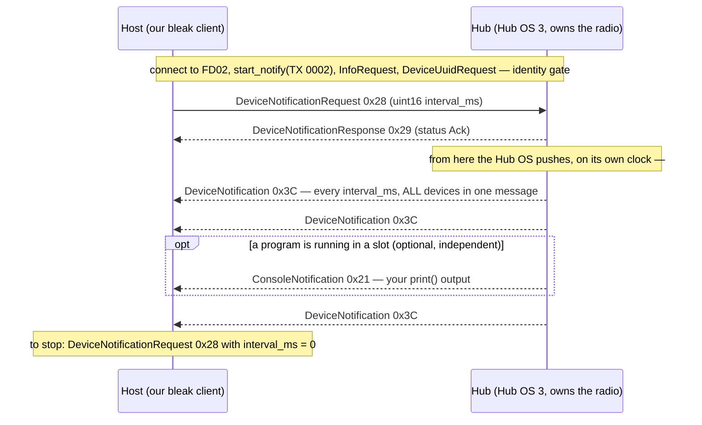

# Research — how the SPIKE App streams live data, and whether we subscribe to it instead of `print()`

**Type:** EXTERNAL research (LEGO/spike-prime-docs primary source) · **Created:** 2026-09-01 ·
**Status:** primary-source + host-reasoned, **NOTHING run on our hub.** The subscription mechanism is read
from LEGO's own protocol repo and reference client; whether our hub honours a fast interval, and whether it
streams while our slot program drives, are **[UNVERIFIED]** and gated on one bench test (§ 7).

**Answers the operator's re-asked question** — *"ways around being able to use bluetooth while motors are in
use"* — from a new angle the earlier docs raised but did not resolve: **the Hub OS itself pushes every
device's live values to a connected client, with zero cooperation from the running program.** That is how
the SPIKE App live-monitors sensors and motors while your program runs, and our own `bleak` client can
subscribe to the exact same stream.

> **This EXTENDS, does not replace:**
> [telemetry-while-driving.md](./telemetry-while-driving.md) (chose `print()`→`ConsoleNotification` +
> log-on-hub; treated `DeviceNotification` only in passing, §1.3) and
> [bluetooth-control-plane.md](./bluetooth-control-plane.md) (first identified `DeviceNotification` id 60,
> but **predates the SPIKE-3 measurement** and lists "Hub OS 3 only / generation unknown" as its #1
> caveat — that caveat is now **closed**, see § 1). It does not re-derive the upload/framing/CRC layers —
> [program-upload-protocol.md](./program-upload-protocol.md) owns those.
>
> Ground truth: [../findings/ble-protocol-2026-08-27.md](../findings/ble-protocol-2026-08-27.md) ·
> [../findings/hub-first-contact-2026-08-27.md](../findings/hub-first-contact-2026-08-27.md).
> Governing rules: [../directives/hardware-safety.md](../directives/hardware-safety.md) ·
> [../decisions/0001-stock-lego-firmware-only.md](../decisions/0001-stock-lego-firmware-only.md).

---

## 0. The verdict up front

**Yes — there is a second, better telemetry path for the hardware channels, and it is a documented Hub OS
feature, not a hack.** The SPIKE App streams two independent notification streams off the hub while a
program runs, both pushed by the Hub OS over the FD02 TX characteristic:

| The App shows you… | …over this message | Who produces it |
|---|---|---|
| the live console (your `print()` output) | **`ConsoleNotification` id 33 / 0x21** | your program's `print()` |
| the live sensor/motor **monitor panel** (port values, IMU, battery) | **`DeviceNotification` id 60 / 0x3C** | **the Hub OS, no program code** |

`DeviceNotification` is the reverse-engineering prize. It carries, in **one binary snapshot per requested
interval**: battery %, the full 6-axis IMU (yaw/pitch/roll + raw accel XYZ + raw gyro XYZ), **every motor's
32-bit cumulative position, absolute position, speed and power**, the colour sensor's class **and raw R/G/B
(0–1023)**, and distance in mm — for **every device attached**, with **no hub-side code**. Our client turns
it on with a single message (`DeviceNotificationRequest` id 40) carrying a `uint16` millisecond interval.

**But it does not *replace* `print()` — it complements it.** `DeviceNotification` is a photograph of the
*hardware*. It cannot carry what our program *believed* (`state`, `lane`, `count`, `det_state` in
[telemetry.py](../../src/telemetry.py)), and it carries **no hub-side timestamp**. So the honest picture is
**three channels, each doing the one thing it is best at** (§ 5), not a swap of one for another.

**Why this is the answer to "BLE while the motors run":** the single most dangerous unknown in
[telemetry-while-driving.md](./telemetry-while-driving.md) is **G4b — does `print()` stall the control loop
when no BLE client is draining the console?** `DeviceNotification` **sidesteps that unknown entirely for the
hardware channels**, because those values never pass through our Python VM at all — the firmware samples and
frames them. A robot running a slot program that does nothing but drive still streams its encoders, gyro and
colour to the laptop.

**One correction it lets us make cheaply, and it is load-bearing:**
[bluetooth-control-plane.md](./bluetooth-control-plane.md)'s first caveat was *"Hub OS 3 only; our
generation is unknown (KU-M1); a BLE scan is itself the generation test."* **We ran that test.** The hub is
**measured SPIKE 3 / Hub OS 3** (`ble-protocol-2026-08-27.md`: `InfoResponse` RPC 1.0.47, the FD02 service,
COBS framing validated both directions). The protocol that defines `DeviceNotification` **is** our hub's
protocol. What remains unverified is no longer *"does this apply to us"* but *"does our specific build
honour a fast interval and stream during a driving program"* — a much smaller question.

---

## 1. What the SPIKE App is actually doing (mechanism, from primary source)

LEGO publishes the protocol and a working `bleak` reference client at
[`LEGO/spike-prime-docs`](https://github.com/LEGO/spike-prime-docs). The App's live monitoring is two
subscriptions on top of the same GATT link we already proved works:

Three facts pin down the model, all primary-source:

1. **Subscription is a single request with an interval.** LEGO's reference `app.py`
   ([`examples/python/app.py`](https://github.com/LEGO/spike-prime-docs/blob/main/examples/python/app.py))
   sends `DeviceNotificationRequest(DEVICE_NOTIFICATION_INTERVAL_MS)` and waits for a
   `DeviceNotificationResponse` — **before, and independently of, starting any program.** The constant is
   `DEVICE_NOTIFICATION_INTERVAL_MS = 5000`, commented *"The interval in milliseconds between device
   notifications."* `interval_ms = 0` disables it
   ([messages.rst](https://github.com/LEGO/spike-prime-docs/blob/main/docs/source/messages.rst)).

2. **It is Hub-OS-driven and program-independent.** LEGO issue
   [#9](https://github.com/LEGO/spike-prime-docs/issues/9): a user reports `DeviceNotification`s that *"occur
   after programs complete and continue logging until disconnection."* Notifications flow whether or not a
   program is running. **This is the property we want:** run a slot program that only drives, and the
   encoders/IMU/colour still stream because the Hub OS, not the program, produces them. **[INFERRED for our
   build; the report is on firmware 1.6.62, ours is 1.8.149 — gate DN-1, § 7.]**

3. **Console and device streams are independent.** `ConsoleNotification` (33) carries `print()` text;
   `DeviceNotification` (60) carries device values. Both are BLE notifications on the same TX characteristic
   `0000fd02-0002-…`. The App's console pane is the former; its live monitor/plot pane is the latter. You can
   run either, both, or neither.

> **[INFERRED] The App's in-program *plotting* (`app.linegraph.plot(...)` called from user code) is a
> different, program-initiated path** — SteffenLEGO states the `app` module *"only does anything against
> LEGO's app… you'd have to build things like that yourself using the TunnelMessage"* (ble-bring-up §7.5).
> That path needs the LEGO app and our program's cooperation, so it is **not** useful to us. The path that
> *is* useful is the passive `DeviceNotification` monitor, which needs neither. Do not conflate the two.

---

## 2. `DeviceNotification` — exact byte layout (LEGO/spike-prime-docs, `messages.rst` + `messages.py`)

The outer message, then a packed sequence of per-device sub-messages until the payload is exhausted. All
little-endian; the deserializer format strings below are copied from LEGO's own
[`examples/python/messages.py`](https://github.com/LEGO/spike-prime-docs/blob/main/examples/python/messages.py)
`DEVICE_MESSAGE_MAP`.

**Outer:** `DeviceNotification` id **60 / 0x3C** — header `struct.unpack("<BH", data[:3])` = `id`, `uint16
size`; then `payload = data[3:3+size]`, parsed sub-message by sub-message.

**Subscribe:** `DeviceNotificationRequest` id **40 / 0x28** — `struct.pack("<BH", 0x28, interval_ms)`.
**Ack:** `DeviceNotificationResponse` id **41 / 0x29** — `<BB` id, status (0x00 Ack / 0x01 Nak).

**Sub-messages** (each begins with its own `uint8` type id; the first `B` in every format below is that id):

| id | Device message | `struct` | Fields (after the type byte) | Size |
|---:|---|---|---|---:|
| 0 | `DeviceBattery` | `<BB` | battery % | 2 B |
| 1 | `DeviceImuValues` | `<BBBhhhhhhhhh` | face-up (`uint8`), yaw-face (`uint8`), then `int16` ×9: **yaw, pitch, roll, accel X/Y/Z, gyro X/Y/Z** | 21 B |
| 2 | `Device5x5MatrixDisplay` | `<B25B` | 25 pixel bytes | 26 B |
| 10 | `DeviceMotor` | `<BBBhhbi` | port (`uint8`), motor type (`uint8`), abs position `int16` (−180…179°), power `int16` (±10000), speed `int8` (±100), **position `int32` (cumulative degrees)** | 12 B |
| 11 | `DeviceForceSensor` | `<BBBB` | port, value 0–100, pressed flag | 4 B |
| 12 | `DeviceColorSensor` | `<BBbHHH` | port, colour class `int8`, **raw R/G/B `uint16` each 0–1023** | 9 B |
| 13 | `DeviceDistanceSensor` | `<BBh` | port, distance `int16` mm (`messages.rst` says 40–2000; techspec says **50**–2000 — use 50; **−1** = nothing detected) | 4 B |
| 14 | `Device3x3ColorMatrix` | `<BB9B` | port, 9 pixels (brightness high nibble, colour low nibble) | 12 B |

Colour class enum ([enums.rst](https://github.com/LEGO/spike-prime-docs/blob/main/docs/source/enums.rst)):
`0x00` Black · `0x01` Magenta · `0x02` Purple · `0x03` Blue · `0x04` Azure · `0x05` Turquoise · `0x06`
Green · **`0x07` Yellow** · `0x08` Orange · `0x09` Red · `0x0A` White · **`0xFF` = "Unknown or no color
detected."** The hub's own classifier has an explicit UNKNOWN, which is exactly the behaviour scope FR-2b
demands of ours — but this is **not** evidence its UNKNOWN is any good on matte pastel paper
([color-discrimination.md](./color-discrimination.md) § 8 stays the open separability question). The raw
R/G/B 0–1023 is the more valuable field: it feeds our own `classify.py` without the hub pre-deciding.

**Concrete size for OUR robot** (battery + IMU + 5×5 matrix always present, 2 motors, 1 colour, 1 distance):
`2 + 21 + 26 + 24 + 9 + 4 = 86 B` payload + 3 B outer header = **~89 B before COBS framing** — coincidentally
the same magnitude as one 89-B `telemetry.py` CSV line, but **all-hardware, no logic state**, and binary.
The exact device set the Hub OS includes (in particular whether the 5×5 matrix's 26 B always rides along —
26 wasted bytes we do not want) is **[UNVERIFIED]**; there is **no way to select which devices report** —
the interval is global and the set is "whatever is attached."

---

## 3. The rate the App actually achieves — and the honest limits

**The interval is a *request*, not a contract.** `DeviceNotificationRequest` is `uint16` ms, so 1–65535 ms
is *expressible*, but the hub delivers on its own clock and may floor or jitter it. LEGO's reference client
asks for **5000 ms** (a conservative example default, not a limit). The rate the GUI App uses for live
plotting is **[UNVERIFIED]** — no primary capture found. A widely-cited SPIKE **2** figure (thecodingfun,
2021) is that the on-hub *plot* block samples as fast as **~4 ms**, but that is **on-hub data collection, a
different mechanism from the BLE `DeviceNotification` wire rate** — do not quote it as the wire rate.

**Three hard limits, none measured on our hub, all shared with every other BLE notification path:**

1. **Same connection-interval latency floor as `ConsoleNotification`.** `DeviceNotification` is a BLE
   notification on the same characteristic, so it inherits the same floor and the same
   packets-per-connection-event ceiling analysed in
   [telemetry-while-driving.md](./telemetry-while-driving.md) § 3 and § 2.1. **It buys no throughput or
   latency over `print()`.** A ~89-B composite still spans ~5 notifications at MTU 23 (→ the same ~5–7
   composite-records/s floor) or collapses to 1 at MTU ≥ 247. The recorded "MTU 23" is very likely a
   bleak/BlueZ reporting default, not the wire MTU — re-measure per that doc § 3.2.
2. **No hub timestamp.** `DeviceNotification` carries no tick field. Every sample is stamped by the host on
   arrival, so its recorded interval includes BLE queueing + scheduler jitter of unknown size. For tight
   time-alignment the on-hub log's hub-side `t_ms` is strictly better; reconcile offline (that doc § 4,
   lower-envelope fit), never live.
3. **Global rate for all devices.** One interval governs the whole snapshot; you cannot sample the colour
   sensor fast and the battery slow.

**So `DeviceNotification`'s advantage over `print()` is architectural, not bandwidth:** it is off-VM, needs
no hub code, cannot stall the control loop, and is compact binary — **not** faster on the wire.

---

## 4. Can OUR client subscribe to the same stream? — yes, with these preconditions

**Mechanically, yes**, and it is ~1 message to turn on. The preconditions are the ones every FD02 control
message already carries (see [program-upload-protocol.md](./program-upload-protocol.md) and ble-bring-up):

- **Identity gate first.** `InfoRequest 0x00` then `DeviceUuidRequest 0x1A`, compare 16 bytes to
  `03970000-3600-1B00-1450-30514B323320`, disconnect on mismatch. Never subscribe to another team's hub.
- **It rides the COBS/XOR/0x02 control plane, not the REPL.** Over USB this means the binary protocol on
  `/dev/spike` (the Hub OS must own the port — **no `Ctrl-C`**, which would kill the very Hub OS that
  produces the notifications). Over BLE it is the FD02 TX notify characteristic. The same reassembly-on-0x02
  buffering that `ConsoleNotification` needs applies — an ~89-B composite **will** fragment at small MTU.
- **Parse defensively — the battery extra-byte bug is real.** LEGO issue #9: `DeviceNotification`
  deserialisation intermittently throws `struct.error: unpack requires a buffer of 2 bytes` (a `DeviceBattery`
  record carries an extra byte LEGO's own layout lacks). Parse by known per-device length, tolerate trailing
  bytes, and **log-unparsed rather than crash the link.** Present on firmware 1.6.62; **[UNVERIFIED]** on our
  1.8.149 build — gate DN-3.
- **Turn it off when done:** `DeviceNotificationRequest(0)`.

**For the untethered driving robot, the shape is:** run the mission as a **slot** program
([program-upload-protocol.md](./program-upload-protocol.md)) that only drives; the laptop, connected over
BLE, subscribes to `DeviceNotification` and captures encoders/IMU/colour with **no telemetry code on the
hub at all.** If the link drops mid-run you lose those live samples — which is exactly why the on-hub log
stays the dropout-proof record of account (§ 5).

---

## 5. Three channels, not a swap — how this changes the telemetry design

[telemetry-while-driving.md](./telemetry-while-driving.md) recommended **log-on-hub + optional `print()`
heartbeat**. `DeviceNotification` does not overturn that; it **adds a third channel that removes that plan's
two most dangerous unknowns for the hardware columns.** The refined picture:

| Channel | Carries | Produced by | Key property | Its job |
|---|---|---|---|---|
| **`DeviceNotification` (60)** | battery, 6-axis IMU, every motor's cumulative+abs position/speed/power, colour class + raw RGB, distance | **Hub OS, no program code** | off-VM (no loop cost, no `print()` stall), binary, program-independent, **no hub timestamp** | **the live hardware witness** — the honest, non-perturbing instrument for encoders/gyro/colour while driving |
| **`ConsoleNotification` (33)** = `print()` | anything, incl. **program-logic state** `state/lane/count/det_state` and a **hub-side `t_ms`** | our program | costs loop time; **may stall with no listener (G4b)** | carry the *logic state + hub clock* that `DeviceNotification` structurally cannot |
| **on-hub `/flash` log** | the full `telemetry.py` record, every tick | our program | survives link drops; retrieved over USB after the run | **record of account** — dropout-proof, full-rate |

**What this concretely means for the plan:**

1. **The hardware columns of `telemetry.py` (`encL/R_deg`, `yaw/pitch/roll_ddeg`, `acc*_mg`, `r/g/b`,
   `reflection`, `distance_mm`) have a second, off-VM source.** Subscribing to `DeviceNotification` gives an
   independent hardware trace that does **not** depend on G4 (does our `print()` reach the host) or G4b
   (does `print()` stall the loop) — the two crux gates. That makes it the **safest first thing to try** on
   the next BLE session: it needs no slot upload and no hub code, only a subscribe.
2. **But it cannot carry `state/lane/count/det_state`.** Those live only in our program. So `print()` (or
   the `/flash` log) is still required for *what the logic believed* and for a *hub-side timestamp*. This is
   the precise sense in which `DeviceNotification` is **not** a drop-in replacement for `print()`.
3. **Unit cross-check required before trusting it.** `DeviceImuValues` yaw/pitch/roll are `int16` of
   unstated unit; our `imu-characterisation-2026-08-27.md` measured `motion_sensor.tilt_angles()` as
   **decidegrees** and `acceleration()` as **milli-g**. Whether the `DeviceNotification` IMU fields share
   those units/scaling is **[UNVERIFIED]** — cross-check against a known pose before merging traces.
4. **No architecture change, no new hub module.** This is a host-side receiver concern only; nothing in
   `src/` changes. Do **not** add `hub_ble.py` (ble-bring-up § 4.6 — there is nothing for it to do).

---

## 6. What this does NOT do (kept honest)

- **It does not beat the throughput floor.** Full-rate live at a tens-of-Hz control loop is still infeasible
  at small MTU; the composite is ~89 B like a CSV line. `DeviceNotification` is not a way around the
  connection-interval limit — [telemetry-while-driving.md](./telemetry-while-driving.md) § 3 still governs.
- **It does not let us drive the radio ourselves, and we still must not.** This uses the Hub OS's own push;
  it does **not** touch `bluetooth.BLE()` (ble-bring-up § 4 — a shared singleton; user code must not
  register services or an IRQ handler). No blacklist item is weakened.
- **It is not free of the on-hub log.** A dropped link loses live samples; the `/flash` log remains the
  record of account.
- **It is not confirmed on our firmware.** Everything about *our hub honouring a fast interval, streaming
  during a driving program, its exact device set, its IMU units, and the battery bug* is **[UNVERIFIED]** —
  § 7.

---

## 7. [UNVERIFIED] register — the one bench test that settles most of it

Nothing here was run on our hub. The decisive test is cheap and needs **no slot upload and no hub code**:
**connect over BLE (or the USB control plane), send `DeviceNotificationRequest(1000)`, and watch for
`DeviceNotification`s.** Then repeat while a slot program spins a motor.

| # | Open point | Confidence | The test that settles it |
|---|---|---|---|
| DN-1 | Does our hub stream `DeviceNotification` at all, and **while a slot program drives**? | INFERRED (LEGO app.py + issue #9, other firmware) | Subscribe at 1000 ms with no program → expect ~1 Hz. Then start a motor-spin slot program → confirm the motor's `position` field advances in the stream. |
| DN-2 | The **fastest interval our hub honours**, and delivered jitter | UNVERIFIED (ref uses 5000 ms) | Request 200/100/50/20 ms; record actual inter-arrival times; find where requested ≠ delivered. |
| DN-3 | Is the **`DeviceBattery` extra-byte bug** present on our 1.8.149 build? | UNVERIFIED (seen on 1.6.62) | Log raw `DeviceNotification` frames; check the battery record length; confirm the defensive parser survives it. |
| DN-4 | The **exact device set** our hub includes (does the 5×5 matrix's 26 B always ride along?) | UNVERIFIED | Parse one real notification; list the sub-message ids present. |
| DN-5 | **Units** of the `DeviceImuValues` int16 yaw/pitch/roll and accel/gyro — do they match our measured decidegrees / milli-g? | UNVERIFIED | Tilt the hub to a known angle; compare the `DeviceNotification` field to `tilt_angles()`. |
| DN-6 | Does a mid-run **subscribe perturb** a running slot program (is the streamed run the demo run)? | UNVERIFIED | Start a driving program, subscribe during it, watch for a loop-rate change. (Same concern as that doc's U-18.) |
| DN-7 | Real negotiated **MTU / connection interval** governing the composite's fragmentation and rate | UNVERIFIED | `_acquire_mtu()` + `btmon` per telemetry-while-driving § 3.2 / U-6, U-7. |

---

## 8. Recommended changes to OTHER files — NOT applied here (collision-safe)

Per the minimalism constraint, only this doc is written. Recommended, for the operator/parent to apply:

1. **`docs/research/INDEX.md`** — add a row:
   `| [device-notification-telemetry.md](./device-notification-telemetry.md) | **How the SPIKE App live-monitors sensors/motors while a program runs — and whether we subscribe instead of print().** The Hub OS pushes DeviceNotification (id 60 / 0x3C): one binary snapshot per requested interval (DeviceNotificationRequest id 40, uint16 ms) of battery, 6-axis IMU, every motor's cumulative+abs position/speed/power, colour class + raw RGB, distance — with NO hub-side code, program-independent. Exact nested byte layouts from messages.py. Verdict: a superior OFF-VM path for the hardware channels (removes the G4/G4b print()-stall unknowns) but NOT a print() replacement — it cannot carry program-logic state or a hub timestamp, so THREE complementary channels, not a swap. bluetooth-control-plane's "Hub OS 3 only / generation unknown" caveat is now CLOSED (measured SPIKE 3). Same connection-interval floor as any BLE notification — no throughput win. 7-item [UNVERIFIED] register; one cheap bench test (subscribe, no upload) settles most. Nothing run on hardware |`
2. **`docs/research/telemetry-while-driving.md`** — its § 1.3 mentions `DeviceNotification` as "the only
   telemetry path with real parallelism" but stops there. Add a one-line pointer to this doc as the full
   treatment, and note that `DeviceNotification` is the **safest first BLE test** (no upload, no hub code)
   and sidesteps gates G4/G4b for the hardware columns.
3. **`docs/research/bluetooth-control-plane.md`** — its #1 caveat ("Hub OS 3 only; generation unknown;
   KU-M1") is **now closed** by the SPIKE-3 measurement; add a note at that caveat pointing here and to
   `ble-protocol-2026-08-27.md`.
4. **`docs/plans/known-unknowns.md`** — add DN-1…DN-7 as concrete probes (the subscribe test is the highest
   leverage, since it needs no slot upload).

No `src/` change is recommended; this is a host-side receiver concern and `telemetry.py` stays untouched.

---

## 9. Sources

**LEGO/spike-prime-docs (`main`, primary):**
[`docs/source/messages.rst`](https://github.com/LEGO/spike-prime-docs/blob/main/docs/source/messages.rst)
(DeviceNotificationRequest 40/0x28 uint16 interval; DeviceNotificationResponse 41; DeviceNotification 60/0x3C
uint16 size + sub-messages; ConsoleNotification 33; the per-device layouts) ·
[`docs/source/enums.rst`](https://github.com/LEGO/spike-prime-docs/blob/main/docs/source/enums.rst) (colour
class enum, hub-face enum, Ack/Nak) ·
[`examples/python/messages.py`](https://github.com/LEGO/spike-prime-docs/blob/main/examples/python/messages.py)
(`DEVICE_MESSAGE_MAP` struct formats; `<BH` request pack; `.messages` = list of (name, values)) ·
[`examples/python/app.py`](https://github.com/LEGO/spike-prime-docs/blob/main/examples/python/app.py)
(`DeviceNotificationRequest(5000)` sent before program start; the `on_data` handler) ·
[`docs/source/connect.rst`](https://github.com/LEGO/spike-prime-docs/blob/main/docs/source/connect.rst)
(enable notifications on TX; no rate stated) · rendered:
[messages.html](https://lego.github.io/spike-prime-docs/messages.html).

**LEGO issue tracker:** [#9](https://github.com/LEGO/spike-prime-docs/issues/9) — `DeviceNotification`s
*"continue after programs complete until disconnection"* (program-independence) and the intermittent
`struct.error` battery extra-byte bug, on firmware 1.6.62 / RPC 1.0.14.

**Secondary / indicative (flagged in text):** thecodingfun (2021) SPIKE **2** on-hub plot ~4 ms sampling —
*not* the BLE wire rate.

**Ours (measured ground truth):**
[../findings/ble-protocol-2026-08-27.md](../findings/ble-protocol-2026-08-27.md) (SPIKE 3 confirmed; FD02;
COBS validated both directions; InfoResponse 509/5000/4096) ·
[../findings/imu-characterisation-2026-08-27.md](../findings/imu-characterisation-2026-08-27.md) (decidegrees
/ milli-g, for the DN-5 unit cross-check) · [../../src/telemetry.py](../../src/telemetry.py) (the record
whose hardware columns `DeviceNotification` can source, and whose logic columns it cannot).
