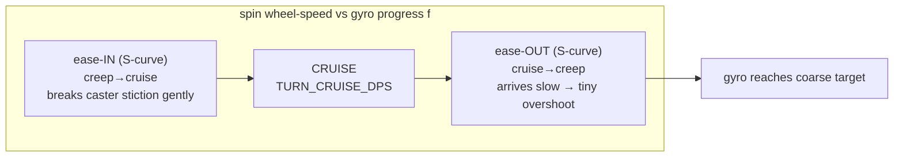

# Distance & turn kinematics — design brief for the robot AS BUILT

> **Type:** RESEARCH (design brief) · **Created:** 2026-09-01 · **Owner:** the **Programmer**
> **Designs to:** the chassis measured 2026-09-01 — differential drive (**A = LEFT, B = RIGHT**, id 48,
> 930 dps ceiling), **forward = A:−v, B:+v** (motors mounted mirrored), **direct drive** (1 wheel rev =
> exactly 360 encoder-deg, no gearing), a **single unidirectional rear roller caster** that rolls
> fore/aft but scrubs sideways in any in-place turn.
> **Refines, never replaces:** [motion-control-and-odometry.md](./motion-control-and-odometry.md)
> (heading hold, turn overshoot, UMBmark) and
> [detection-odometry-coverage-2026-09-01.md](./detection-odometry-coverage-2026-09-01.md) (§B the
> scrubbing caster, §C the drift budget). This brief owns the two mechanics those defer: **how a raw
> encoder delta becomes a forward distance** and **how a turn ramps its speed while closing on the gyro**.
> **Measured behaviour from:** [../findings/drive-checkpoint-2026-09-01.md](../findings/drive-checkpoint-2026-09-01.md)
> · [../findings/imu-characterisation-2026-08-27.md](../findings/imu-characterisation-2026-08-27.md).
> **Maps onto:** `src/odometry.py` (pure), `src/config.py`, `src/hub_motors.py`, `src/sweep.py`,
> `examples/`.

**Two conventions, held throughout.** (1) Everything is in **encoder-degrees, wheel-revolutions and
gyro-degrees**; millimetres appear **only** through the symbol `D = WHEEL_DIAMETER_MM`, which is
**UNMEASURED** (KU-M3 — one ruler read pending). Nothing here blocks on `D`: a lane is commanded in revs
and a turn closes on the gyro, neither of which needs a mm scale. (2) Confidence is split into
**structural** (is the arithmetic sound and does it map onto the code without inventing architecture?)
and **measured** (has it been observed at the built geometry?). For every *turn* magnitude below,
measured is **zero** — no `motor_pair`/profiled turn has ever run, and **no decel-coast datum exists**.

**No number below is invented as measured.** Every threshold is `[ASSUMED]` with a named bench path, or
`[UNVERIFIED]`, or derived **symbolically** from named constants. Where a design changes existing code the
change is **additive** — no existing signature moves.

---

## Contents

- [A. Distance — raw encoder deltas to forward travel](#a-distance--raw-encoder-deltas-to-forward-travel)
- [B. Variable-rate turns — a profiled spin closed on the gyro](#b-variable-rate-turns--a-profiled-spin-closed-on-the-gyro)
- [New function signatures (consolidated)](#new-function-signatures-consolidated)
- [RECOMMENDED CHANGES to other files](#recommended-changes-to-other-files)
- [What must be measured before any of this is trusted](#what-must-be-measured-before-any-of-this-is-trusted)
- [Sources](#sources)

---

## A. Distance — raw encoder deltas to forward travel

### A.1 The exact formulae

Standard differential-drive forward kinematics (Siegwart & Nourbakhsh, *Introduction to Autonomous Mobile
Robots*, §3.2): body speed is the **mean** of the two wheel speeds, heading rate is their **difference**
over the track. Integrated over one tick, with `D = WHEEL_DIAMETER_MM` and the two raw encoder deltas
`Δθ_L`, `Δθ_R` (degrees, straight from `motor.relative_position(A)` / `(B)`):

```
per-wheel ground distance (forward-convention, signed):
    s_L = sL · π · D · (Δθ_L / 360)
    s_R = sR · π · D · (Δθ_R / 360)

body forward translation this tick:
    d_center = (s_L + s_R) / 2                     <-- the MEAN of the two signed wheel distances

body heading change this tick (encoder cross-check only, straight/gentle track b):
    Δψ_enc = degrees( (s_R − s_L) / b )
```

`sL`, `sR` are the **mirror signs** — the whole subject of §A.2. `360` is `ENCODER_COUNTS_PER_REV`, and
because direct drive is **CONFIRMED** (1 rev = 360 enc-deg, no gearbox) there is **no gear-ratio divisor**
to carry. `π · D · (Δθ / 360)` is exactly the existing `odometry.degrees_to_mm(Δθ, D)`.

**In revolutions, when `D` is still unknown** (all the sweep actually needs to command a lane):

```
body_revs = ( sL·Δθ_L + sR·Δθ_R ) / (2 · 360)     ; distance_mm = π · D · body_revs  (once D exists)
```

**Scale sensitivity** (already in the motion doc, formula 1): `distance_error / distance = dD / D`. So `D`
must be the **effective rolling diameter under load, per surface** — not the moulded number — measured by
rolling to exactly 360 enc-deg against a ruler (Prime Lessons measured 17.5 cm where geometry said 17.6).

### A.2 Where the mirror sign enters — and why it is load-bearing

The motors are mounted mirrored, so **forward drives the two encoders in opposite directions**
(drive-checkpoint 2026-09-01, watched on the robot):

| Move | commanded A / B (dps) | left Δθ (A) | right Δθ (B) |
|---|---|---|---|
| FORWARD | −250 / +250 | **−366** | **+366** |
| TURN RIGHT (CW) | −250 / −250 | −217 | −217 |

`motor.relative_position()` accumulates in each motor's **native** direction, so on a forward run the
**left** encoder *decreases*. Feed the raw deltas straight into a mean and forward motion cancels:
`(deg2mm(−366) + deg2mm(+366)) / 2 = 0` — the robot crossed the room and the odometry says it never moved.
**The mirror must be applied per-wheel, before the mean and before the heading difference:**

```
sL = LEFT_MOTOR_FORWARD_SIGN  = −1     # +motor-velocity drives the LEFT wheel BACKWARD → −1 to un-mirror
sR = RIGHT_MOTOR_FORWARD_SIGN = +1     # +motor-velocity drives the RIGHT wheel forward → +1
```

Re-checking the table with the signs applied confirms the whole convention is self-consistent with the
existing `Pose` frame (x right, y forward, heading 0 = +y, **CCW positive**) and `heading_from_encoders`:

- **FORWARD:** `s_L = (−1)·deg2mm(−366) = +`, `s_R = (+1)·deg2mm(+366) = +` → `d_center > 0` (forward ✓),
  `s_R − s_L ≈ 0` (no turn ✓).
- **TURN RIGHT:** `s_L = (−1)·deg2mm(−217) = +`, `s_R = (+1)·deg2mm(−217) = −` → `d_center = 0` (in-place ✓),
  `s_R − s_L < 0` → `Δψ_enc < 0` → clockwise in a CCW-positive frame = a **right** turn ✓.

**The one rule that prevents a double-flip:** reads are raw, writes are signed. `hub_motors.drive()`
already multiplies by the forward sign when it *commands* a wheel (`LEFT_FWD * pct`);
`hub_motors.read_motor_degrees()` returns the **raw** `relative_position`. So the sign is applied on the
write side by `hub_motors` and on the read side by `odometry` — **once each, in different modules, never
twice.** The odometry layer is pure and cannot import `hub_motors`, so it must own its own copy of the
sign; the single source of truth is `config`, imported by both.

### A.3 Config constants for distance

| Constant | Value | Status | Role |
|---|---|---|---|
| `WHEEL_DIAMETER_MM` | 56.0 | `[ASSUMED]` — exists; one ruler read pending (KU-M3) | `D`; enters every distance **linearly** |
| `ENCODER_COUNTS_PER_REV` | 360.0 | **spec + CONFIRMED direct drive** — exists | rev denominator; no gear divisor |
| `LEFT_MOTOR_FORWARD_SIGN` | −1 | **MEASURED 2026-09-01** — **NEW** (today only a comment in `hub_motors.py`) | `sL` |
| `RIGHT_MOTOR_FORWARD_SIGN` | +1 | **MEASURED 2026-09-01** — **NEW** | `sR` |

Promoting the two signs from a `hub_motors.py` comment into `config.py` is the only structural move in
Part A: it lets the **pure** odometry layer import the physical fact without importing the hub API, and it
puts the flip beside the wheel geometry it belongs with — CLAUDE.md's "the flip lives beside the port map,
NOT in main.py."

### A.4 New signatures + maps-onto (distance)

All **pure**, all host-runnable, all in `src/odometry.py`:

| Signature | Purpose |
|---|---|
| `signed_wheel_mm(dtheta_left_deg, dtheta_right_deg, diameter_mm=None, left_sign=None, right_sign=None) -> (s_left_mm, s_right_mm)` | apply the mirror per-wheel; return forward-convention signed ground distances. Defaults read `config`. |
| `forward_distance_mm(dtheta_left_deg, dtheta_right_deg, diameter_mm=None, left_sign=None, right_sign=None) -> float` | `(s_L + s_R)/2` — body translation this tick. |
| `body_revs(dtheta_left_deg, dtheta_right_deg, left_sign=None, right_sign=None) -> float` | mean signed revolutions; **needs no `D`** — the sweep-command quantity while `D` is unknown. |

**Maps onto** — the additive change to `Odometry`: `__init__(..., left_sign=None, right_sign=None)`
storing the two signs (default `config`), and `update()` applies them at the existing difference step:

```
d_left  = degrees_to_mm(self.left_sign  * (left_motor_deg  - self._last_left_deg),  D)
d_right = degrees_to_mm(self.right_sign * (right_motor_deg - self._last_right_deg), D)
```

Everything downstream in `update()` (`d_center`, `heading_from_encoders`, the exact-arc integration) is
**unchanged** — it already assumes forward-convention inputs; this makes that assumption true for *this*
robot. `degrees_to_mm` / `mm_to_degrees` / `mm_per_count` / `cross_track_error_mm` are untouched.

---

## B. Variable-rate turns — a profiled spin closed on the gyro

### B.1 Why the gyro closes the turn (and encoders stay primary for distance)

The operator's standing rule is **encoders primary, IMU confirming**. That holds for **translation**:
§A takes distance straight from the encoders and the gyro only witnesses heading. **Turns are the one
place the rule inverts, and the caster is why.** The rear roller must **skid sideways** in any in-place
rotation, so it (a) drags the pivot rearward — the *effective spin track is larger than the geometric
one* — and (b) adds stick-slip friction. An encoder-geometry turn command
(`enc_deg = (π·b/C_w)·φ`) therefore **under-rotates the body** by an amount that is **systematic,
surface-dependent and UNVERIFIED** (coverage-brief §B.6 brackets it at "several to >10° per commanded 90°",
`[UNVERIFIED]`, anchored only to the Prime Lessons overshoot figure — never quote it downstream). The gyro
sees true body rotation regardless of `b` or scrub, so it — not the encoder count — must **terminate** the
turn. This is the same gyro-closed turn `examples/square_odometry.py` already drives and
`motion-control-and-odometry.md` recommends ("geometric turn as the command, gyro as the verifier"); the
encoders keep their job of *measuring the wheels* the whole time, feeding the fault checks (§B.6) and the
degraded fallback (§B.7). No contradiction: **distance = encoders, turn-completion = gyro.**

### B.2 The velocity profile — trapezoid / S-curve, not a constant spin

The operator asked for turns that are **not** a fixed spin speed. Shape the spin **wheel-speed magnitude**
as an ease-in / cruise / ease-out envelope over the **fraction of the turn the gyro reports done**:

```
f = clamp( angle_done_deg / angle_total_deg , 0, 1 )      # progress, from the GYRO

              ┌ 0.5·(1 − cos(π·f / r))           f < r            (ease-IN,  creep→cruise)
   g(f)  =    ┤ 1                                 r ≤ f ≤ 1−b      (CRUISE)
              └ 0.5·(1 − cos(π·(1−f) / b))        f > 1−b          (ease-OUT, cruise→creep)

   speed_dps = TURN_CREEP_DPS + (cruise_dps − TURN_CREEP_DPS) · g(f)      # floored at creep, never 0
```

`r = TURN_RAMP_FRAC`, `b = TURN_BRAKE_FRAC`. Setting `shape="trapezoid"` swaps the two cosine arms for the
linear ramps `g = f/r` and `g = (1−f)/b` — the classic constant-acceleration trapezoid; the cosine arms
are the **jerk-limited S-curve**, which the mobile-robot motion-planning literature prefers precisely
because bounding jerk suppresses the slip and stick-slip a hard velocity step provokes (ResearchHub 2026-09-01:
*Minimum-Jerk Velocity Planning for Mobile Robot Applications*; *Assessment of jerk performance — S-curve
and trapezoidal velocity profiles*; *Computational Analysis of Jerk-Limited Velocity Planning for AGVs*).
Both arms are **one pure function** with a **non-zero floor** (`TURN_CREEP_DPS`), so the loop can always
still close and the caster never has to re-break static friction mid-turn.

Why each arm earns its place on **this** chassis:

- **Ease-IN** breaks the caster's sideways stiction gently. A hard step to cruise is the worst case for the
  scrubbing roller — it slips, and slip is the one error neither gyro nor encoder can undo on the distance
  axis.
- **Ease-OUT is where the accuracy comes from.** Turn overshoot scales with turn **rate** — Prime Lessons
  measured **+8° at 500 dps vs +2° at 200 dps** for a commanded 90° (motion doc, § "Overshoot vs turn
  speed"). Arriving at the target already down at `TURN_CREEP_DPS` makes momentum overshoot small **by
  construction**, instead of subtracting a constant fudge that is only right at one speed and one battery
  charge.



### B.3 The ~9° startup ramp, and the brake distance we do NOT have a datum for

Drive-checkpoint logged a **~9° startup-ramp shortfall**: 250 dps × 1.5 s should command 375°, the
encoders read **366°** — the acceleration ramp ate ~9° of a *timed* move. Two consequences for turns:

1. **Never command a turn as "spin at constant dps for `T` seconds."** That open-loop form eats the ramp
   as heading error. The profile above absorbs the ramp automatically because `f` comes from the **gyro** —
   angle accumulated *during* ease-in counts toward `angle_total`, and the loop terminates on measured
   angle, not on elapsed time.
2. **The ~9° bounds the START ramp, not the STOPPING coast.** Coverage-brief §D.5 corrected exactly this:
   the 9° is a startup shortfall and says nothing about post-stop coast or how it grows with speed.
   **So `TURN_BRAKE_FRAC` / `TURN_BRAKE_DEG` may NOT borrow the 9°.** If a decel rate is ever benched, the
   ease-out extent is the kinematic bleed distance, **derived symbolically**:

```
TURN_BRAKE_DEG  ≈  cruise_dps² / (2 · TURN_DECEL_DPS2)      # v²/2a; UNVERIFIED until TURN_DECEL_DPS2 is measured
```

Until then `TURN_BRAKE_FRAC` is `[ASSUMED]` and closed by the settle-and-verify creep (§B.4), which makes
the final accuracy robust to a wrong brake guess — it just costs an extra creep pass.

### B.4 Settle-and-verify — the executor around the profile

The profile drives the gyro to a **coarse** target; a **settle-and-verify** wrapper converts "≈90°,
systematic overshoot" into "±TOL, bounded" — the pattern `motion-control-and-odometry.md` §"Settle and
verify" prescribes, and the only thing that survives 48–132 turns in a sweep.

```mermaid
stateDiagram-v2
  [*] --> Profile
  Profile: profiled spin (B.2), gyro closes on target within a coarse band
  Profile --> Settle
  Settle: motor.stop(A) / motor.stop(B) (BRAKE); wait TURN_SETTLE_MS
  Settle --> Read
  Read: err = normalize_angle(target_yaw − read_yaw_deg())
  Read --> Done: abs(err) <= TURN_TOL
  Read --> Creep: abs(err) > TURN_TOL and tries < TURN_MAX_TRIES
  Read --> Flag: tries == TURN_MAX_TRIES
  Creep: profiled micro-turn of −err at TURN_CREEP_DPS (no cruise arm)
  Creep --> Settle
  Flag: record TURN_UNCONVERGED; light_matrix warning; continue
  Flag --> Done
  Done --> [*]
```



- **Settle before reading** — part of the overshoot is the robot still moving when the gyro is sampled;
  `square_odometry.py` already keeps sampling yaw for `SETTLE_MS = 600` after each stop to *capture* the
  coast. `TURN_SETTLE_MS` **must be measured** (stop, log yaw every 20 ms for 1 s, find the knee; motion
  doc starts at 200 ms).
- **`TURN_TOL` from lane length, not taste** — a residual `θ` costs `L·tan θ` on the next lane
  (`odometry.cross_track_error_mm`). Pick TOL so `cross_track_error_mm(TOL, L) < ½ · lane pitch margin`.
- **Cap retries and record the failure** — looping forever on Demo Day is the worst outcome
  (honest-instrumentation); a capped `TURN_UNCONVERGED` is reported, not swallowed.
- **Never animate the 5×5 matrix during the gyro-controlled part** — light-matrix updates cost ~25° per
  360° of gyro contention (motion doc); status frames wait for `Done`.

### B.5 Spin sign mapping — the mirror makes both motors the same sign

A counterintuitive but **CONFIRMED** consequence of the mirror mount: an **in-place spin drives both
motors the same sign.** From drive-checkpoint, TURN RIGHT commanded A:−250 **and** B:−250 (both negative)
and the robot went clockwise; TURN LEFT commanded A:+250 **and** B:+250 (both positive) and it went
counter-clockwise. So:

```
CCW (left, +heading in the odometry frame):  motor.run(A, +v) ; motor.run(B, +v)     spin_dir = +1
CW  (right, −heading):                        motor.run(A, −v) ; motor.run(B, −v)     spin_dir = −1
    where v = the profiled speed_dps(f) from B.2
```

**One convention seam to resolve in the runner, not in the pure math.** `sweep.py` emits
`CMD_TURN(value)` with **positive = right**; the odometry `Pose` frame is **CCW-positive = left**. So the
executor maps a sweep command `turn_deg` (positive = right = CW) to `target_yaw = normalize_angle(yaw −
turn_deg)` and `spin_dir = −sign(turn_deg)`. Keep that one negation in the executor (main.py / the turn
example), and keep the pure profile and `normalize_angle` frame-agnostic — a backwards steering sign fans
the sweep out instead of holding it, so this seam is settled explicitly and once.

### B.6 Auto-tune — derive the profile from a few measured constants

Operator intent #4: derive the parameters, don't hand-tune each. `plan_turn()` computes the profile from
named constants so a new wheel or a new surface changes an input, not the code:

- **cruise** = `min(TURN_CRUISE_DPS, HEADROOM_FRACTION · DRIVE_MAX_DPS)`. Capping below the 930 dps ceiling
  leaves both wheels correction headroom and keeps the spin off the saturation limit; the research turn
  sweet-spot is ~200 dps (+2° overshoot) — far under 930, so headroom is comfortable.
- **`TURN_TOL`** ← lane length via `cross_track_error_mm` (§B.4).
- **`TURN_BRAKE_DEG`** ← `cruise² / (2·TURN_DECEL_DPS2)` once the decel is benched (§B.3); a fraction until.
- **`TURN_RAMP_FRAC`** ← a stiction/jerk constant (how gently the caster must be broken loose) — the one
  arm with no closed-form source yet; `[ASSUMED]`, tuned by watching one turn.
- **`TURN_ENC_SCALE`** (from the coverage brief) — body-deg per encoder-differential-deg — is measured from
  the same CW/CCW closing spins and used **only** by the fault check and the degraded path, never to
  execute a healthy turn.

**Fault cross-checks during the turn (operator intent #3), stated only where turns need them:**

- **Stuck gyro** (`SP3GyroDrift` pathology, or the `angular_velocity()==0` deadband that
  imu-characterisation §5.5 warns could make a healthy slow turn *look* stuck): the profiled loop watches
  for the encoders advancing (a commanded spin *is* happening) while yaw stays frozen past a timeout, and
  **falls back to the encoder-only turn** (`encoder_turn_to_body_deg`, §B.7), flagging DEGRADED — never
  spinning forever, exactly as `square_odometry.py`'s `TURN_TIMEOUT_MS` guards.
- **Stall** — encoders **not** advancing while a spin is commanded → abort the turn (a jammed wheel or a
  wall), do not keep pushing.
- **G1 (gyro-vs-encoder heading gap) is suppressed during `CMD_TURN`.** The caster inflates that gap **by
  design** on turns (coverage brief §B.9a), so a healthy turn would false-trip it; G1 is meaningful on
  straights only. `HEADING_DISAGREE_LIMIT_DEG` is set above the healthy caster turn-scrub, from
  `TURN_ENC_SCALE`, so it does not fire on a good robot.

A health check here is a **small pure function** — `turn_converged(residual_deg, tol_deg) -> bool` and the
stuck-gyro predicate `gyro_stalled(enc_advanced_deg, yaw_change_deg, ...) -> bool` — not a class or a
framework.

### B.7 Config constants for turns

| Constant | Suggested | Status | Role |
|---|---|---|---|
| `TURN_CRUISE_DPS` | 200.0 | `[ASSUMED]` (research sweet-spot: 200→+2°, 500→+8°) | profile plateau |
| `TURN_CREEP_DPS` | 80.0 | `[ASSUMED]` — must exceed the caster breakaway; measure | ease floor + final approach |
| `TURN_RAMP_FRAC` | 0.25 | `[ASSUMED]` | ease-in extent (fraction of the turn) |
| `TURN_BRAKE_FRAC` | 0.30 | `[ASSUMED]` (or `TURN_BRAKE_DEG` from §B.3) | ease-out extent |
| `TURN_TOL_DDEG` | 20 (=2.0°) | `[ASSUMED]` — DERIVE from lane length (§B.4) | gyro completion tolerance |
| `TURN_SETTLE_MS` | 200 | `[ASSUMED]` — bench the knee (motion doc) | settle before reading residual |
| `TURN_MAX_TRIES` | 3 | `[ASSUMED]` | creep-correction cap → `TURN_UNCONVERGED` |
| `TURN_DECEL_DPS2` | 1000 | `[UNVERIFIED]` — LEGO default accel; measure on our chassis | brake-distance auto-tune |
| `TURN_ENC_SCALE` | 1.0 | `[ASSUMED]` (from coverage brief) | degraded encoder-only turn + G1 |

`TURN_RATE_DPS = 90.0` already exists and is used **only** to estimate turn *time* for the budget; it is a
mean-rate nominal, distinct from `TURN_CRUISE_DPS` (the profile plateau). Reconcile the two in a comment —
the mean rate of the trapezoid is roughly `cruise·(1 − (r+b)/2) + creep·(r+b)/2` — but do not overwrite
one with the other; they answer different questions (how long a turn takes vs how fast it spins).

### B.8 New signatures + executor sketch (turns)

**Pure, in `src/odometry.py`:**

| Signature | Purpose |
|---|---|
| `turn_speed_profile(angle_done_deg, angle_total_deg, cruise_dps, creep_dps, ramp_frac, brake_frac, shape="cosine") -> float` | the ease-in/cruise/ease-out **magnitude** (dps) at this point in the turn; `shape` selects S-curve vs trapezoid. |
| `plan_turn(turn_deg, lane_length_mm=None, cruise_dps=None, decel_dps2=None, drive_max_dps=None) -> dict` | auto-tune: derive cruise (headroom-capped), `TURN_TOL`, `TURN_BRAKE_DEG`, ramp from named constants (§B.6). |
| `encoder_turn_to_body_deg(enc_diff_deg, turn_enc_scale=None) -> float` | DEGRADED encoder-only body angle (stuck gyro); not used while the gyro closes. (Also named in the coverage brief — one shared helper.) |
| `turn_converged(residual_deg, tol_deg) -> bool` · `gyro_stalled(enc_advanced_deg, yaw_change_deg, min_enc_deg, min_yaw_deg) -> bool` | the two pure health checks of §B.6. |

**The executor is hub-facing orchestration** (it reads `hub_imu` **and** writes `hub_motors`), so it does
**not** belong in a one-device `hub_*.py` and it is **not** `main.py`. It goes to `examples/` first — bench
it, file the run — before it is ever mission code, exactly as `drive_moves.py` / `square_odometry.py` were.
Signature and MicroPython-subset sketch (no f-strings, no dataclasses):

```
# examples/turn_to_heading.py  —  RUNS ON THE HUB. THIS ROBOT SPINS IN PLACE.
# turn_to_heading(target_yaw_deg, cruise_dps=None, ...) -> (achieved_deg, residual_deg, converged, tries)
def turn_to_heading(target_yaw_deg, cruise_dps, creep_dps, ramp_frac, brake_frac,
                    tol_deg, settle_ms, max_tries, spin_dir):
    start = read_yaw_deg()                                  # hub_imu; DECIDEGREES/10 already applied
    total = abs(normalize_angle(target_yaw_deg - start))
    tries = 0
    while True:
        base = read_yaw_deg()
        while True:
            done = abs(normalize_angle(read_yaw_deg() - start))
            if done >= total:                              # gyro CLOSES the coarse turn
                break
            v = turn_speed_profile(done, total, cruise_dps, creep_dps, ramp_frac, brake_frac)
            motor.run(port.A, int(spin_dir * v))           # MIRROR: both same sign (B.5)
            motor.run(port.B, int(spin_dir * v))
            # fault: encoders advancing but yaw frozen -> stuck gyro -> break to degraded (B.6)
            time.sleep_ms(PERIOD_MS)
        motor.stop(port.A); motor.stop(port.B)             # BRAKE
        time.sleep_ms(settle_ms)                           # SETTLE, capture coast
        err = normalize_angle(target_yaw_deg - read_yaw_deg())
        if turn_converged(err, tol_deg) or tries >= max_tries:
            return (normalize_angle(read_yaw_deg() - start), err, turn_converged(err, tol_deg), tries)
        tries += 1
        start = read_yaw_deg()                             # creep-correct −err at creep_dps, cruise arm off
        total = abs(err); spin_dir = -spin_dir if err ... else spin_dir
```

**Maps onto:** `hub_imu.read_yaw_deg()` / `reset_yaw()` (reset once, stationary, gated on
`motion_sensor.stable()` — never mid-run); `hub_motors` `motor.run`/`stop`, `DRIVE_MAX_DPS = 930`,
`LEFT/RIGHT_MOTOR_FORWARD_SIGN`; `odometry.normalize_angle` (every yaw delta, wrap-safe — the ±180°
seam is MEASURED); `sweep.py` `CMD_TURN` (the value the executor consumes); `examples/square_odometry.py`
(the existing gyro-closed spin + `SETTLE_MS` this generalises).

---

## New function signatures (consolidated)

All **pure** and in `src/odometry.py` unless the row says otherwise. Every turn threshold `[ASSUMED]`
until the bench GATE below runs.

| Module | Signature | Purpose |
|---|---|---|
| `odometry.py` | `signed_wheel_mm(dtheta_l_deg, dtheta_r_deg, diameter_mm=None, left_sign=None, right_sign=None) -> (s_l, s_r)` | mirror-applied per-wheel signed ground distance. |
| `odometry.py` | `forward_distance_mm(dtheta_l_deg, dtheta_r_deg, diameter_mm=None, left_sign=None, right_sign=None) -> float` | body translation = mean of the two. |
| `odometry.py` | `body_revs(dtheta_l_deg, dtheta_r_deg, left_sign=None, right_sign=None) -> float` | sweep-command quantity; **no `D` needed**. |
| `odometry.py` | `Odometry.__init__(..., left_sign=None, right_sign=None)` + `update()` applies them | make the forward-convention assumption true for this robot. |
| `odometry.py` | `turn_speed_profile(angle_done_deg, angle_total_deg, cruise_dps, creep_dps, ramp_frac, brake_frac, shape="cosine") -> float` | ease-in/cruise/ease-out spin magnitude (S-curve or trapezoid). |
| `odometry.py` | `plan_turn(turn_deg, lane_length_mm=None, cruise_dps=None, decel_dps2=None, drive_max_dps=None) -> dict` | auto-tune the profile from named constants. |
| `odometry.py` | `encoder_turn_to_body_deg(enc_diff_deg, turn_enc_scale=None) -> float` | degraded encoder-only turn (stuck gyro). |
| `odometry.py` | `turn_converged(residual_deg, tol_deg) -> bool` · `gyro_stalled(enc_adv_deg, yaw_chg_deg, min_enc_deg, min_yaw_deg) -> bool` | pure health checks. |
| `examples/turn_to_heading.py` | `turn_to_heading(target_yaw_deg, cruise_dps, creep_dps, ramp_frac, brake_frac, tol_deg, settle_ms, max_tries, spin_dir) -> (achieved, residual, converged, tries)` | the hub-facing executor (gyro-closed profiled turn + settle-and-verify). Bench first, then main.py wires it. |

**New `config.py` values:** `LEFT_MOTOR_FORWARD_SIGN = -1`, `RIGHT_MOTOR_FORWARD_SIGN = +1` (MEASURED
2026-09-01); `TURN_CRUISE_DPS`, `TURN_CREEP_DPS`, `TURN_RAMP_FRAC`, `TURN_BRAKE_FRAC` (or `TURN_BRAKE_DEG`),
`TURN_TOL_DDEG`, `TURN_SETTLE_MS`, `TURN_MAX_TRIES`, `TURN_DECEL_DPS2` (all `[ASSUMED]`/`[UNVERIFIED]` per
§B.7). `TURN_ENC_SCALE` is already introduced by the coverage brief — do not duplicate it.

---

## RECOMMENDED CHANGES to other files

**Collision safety: I have edited NONE of these — this brief is the only file written. Other workflows and
the main agent are editing `docs/` and `src/` concurrently. Every change below is additive; no existing
signature moves.**

| File | Change | Why |
|---|---|---|
| `src/config.py` | Add `LEFT_MOTOR_FORWARD_SIGN = -1` / `RIGHT_MOTOR_FORWARD_SIGN = +1` (MEASURED 2026-09-01) in the drivetrain block; add the "Turn profile" constants of §B.7. Note `TURN_CRUISE_DPS` vs the existing `TURN_RATE_DPS` (plateau vs time-estimate mean) — do not conflate. Coordinate `TURN_ENC_SCALE` with the coverage brief (single definition). | The pure odometry layer imports the mirror signs from here (it cannot import `hub_motors`); the profile is auto-tuned from named constants. |
| `src/odometry.py` | Add the pure distance helpers (`signed_wheel_mm`, `forward_distance_mm`, `body_revs`) and the turn helpers (`turn_speed_profile`, `plan_turn`, `encoder_turn_to_body_deg`, `turn_converged`, `gyro_stalled`). Extend `Odometry.__init__`/`update` to apply `left_sign`/`right_sign` at the difference step (old call form still valid). No hub import; stays pure. | Distance needs the mirror applied per-wheel before the mean; turns need a host-testable profile + health checks. `encoder_turn_to_body_deg` is shared with the coverage brief — one helper. |
| `src/hub_motors.py` | Replace the hard-coded `LEFT_FWD/RIGHT_FWD` values with references to the new `config` constants (single source of truth), keeping the write-side sign exactly as is. Add a one-line comment that **reads are raw, writes are signed, odometry applies the read-side sign** (the no-double-flip rule, §A.2). | Prevents the sign from being defined in two places and drifting; documents the read/write asymmetry. |
| `src/sweep.py` | Where `CMD_TURN` is documented ("positive = right"), add a wiring note that the executor maps it to the CCW-positive odometry frame (`target = yaw − turn_deg`, `spin_dir = −sign(turn_deg)`) and that the mirror makes **both** motors take `spin_dir` (§B.5). No state-machine change. | The one convention seam (sweep positive=right vs odometry CCW-positive) is settled in the runner, once, not scattered. |
| `examples/` | Add `turn_to_heading.py` (the §B.8 executor) as a **bench-first** program with the same safety scaffolding as `drive_moves.py`/`square_odometry.py` (port-present abort, arm countdown, try/finally stop, timeouts, raw streaming), and file its output under `docs/findings/runs/`. Do not wire it into mission code until it has run once. | The profiled turn has never executed; it is verified on the floor before it is trusted, per ADR-0005. |
| `docs/research/INDEX.md` | Add a row for this file (research/design-brief). | INDEX coverage is enforced by `check-docs.py`. |
| `docs/plans/bench-measurement-plan.md` | Add the turn-profile GATE: `TURN_SETTLE_MS` knee (log yaw 20 ms × 1 s after a stop); **decel-coast in encoder-deg at `TURN_CRUISE_DPS` and `TURN_CREEP_DPS`** (the datum that does NOT yet exist — §B.3); caster breakaway dps (the `TURN_CREEP_DPS` floor); overshoot vs cruise (100/200/300/500 dps, CW **and** CCW → Type A/B + `TURN_ENC_SCALE`); the wheel-diameter ruler read for `D`. | These are the measurements every turn threshold and the whole mm scale wait on. |

---

## What must be measured before any of this is trusted

Distance is **structurally complete and needs one number** (`D`, a ruler read) to leave encoder-revs for
mm; the arithmetic and the mirror are already CONFIRMED against the drive-checkpoint table. Turns are
**structurally complete and measured at zero** — the profile, the settle-and-verify and the auto-tune are
sound on paper and have never spun a wheel. In dependency order:

1. **Wheel diameter `D`** (effective rolling, per surface) — one ruler read + one loaded 360-enc-deg roll.
   Unblocks every mm magnitude; distance needs nothing else.
2. **Caster breakaway dps** — the lowest spin speed that reliably turns the body → the `TURN_CREEP_DPS`
   floor. Everything in the profile floors on it.
3. **Overshoot vs cruise, CW and CCW** — 90° at 100/200/300/500 dps, both directions → picks
   `TURN_CRUISE_DPS`, and the CW/CCW split gives `TURN_ENC_SCALE` and the Borenstein Type A/B diagnosis.
4. **Settle-time knee** → `TURN_SETTLE_MS`. **Decel coast in encoder-deg** → `TURN_BRAKE_DEG` /
   `TURN_DECEL_DPS2` (the datum §B.3 says does not exist yet — do not fabricate it, and do not reuse the 9°).
5. **Drift while driving/turning** (KU-M9, still PARTIAL) — decides whether the gyro can be trusted to
   close a turn at all over a run; the caster's turn-scrub is a suspected contributor.

The single highest-leverage one is **`D`** for magnitudes; but every *turn* number waits on **item 3**,
the CW/CCW overshoot sweep, which `examples/square_odometry.py` and the proposed `turn_to_heading.py`
already stream the raw rows for.

---

## Sources

- [../findings/drive-checkpoint-2026-09-01.md](../findings/drive-checkpoint-2026-09-01.md) — **MEASURED:**
  A=LEFT/B=RIGHT, forward A:−v B:+v, direct drive 1 rev = 360 enc-deg, 930 dps ceiling, the FORWARD/BACK/
  TURN encoder table, and the **~9° startup-ramp shortfall** (a startup datum, **not** a coast).
- [../findings/imu-characterisation-2026-08-27.md](../findings/imu-characterisation-2026-08-27.md) —
  yaw = `tilt_angles()[0]/10` DECIDEGREES, **±180° wrap** (route every delta through `normalize_angle`),
  1.35 ms full IMU tick, stationary drift 0.0033 °/s (bare hub, USB, no motors — driving drift unmeasured),
  the `angular_velocity()==0` deadband caveat that can make a healthy slow turn look stuck.
- [motion-control-and-odometry.md](./motion-control-and-odometry.md) — geometric-command + gyro-verify
  turn; overshoot **+8° @ 500 vs +2° @ 200 dps**; settle-and-verify state machine and `SETTLE_MS`; the
  light-matrix ~25°/360° contention; UMBmark and the Ed/Eb scale/track algebra; "slow turns are free
  accuracy."
- [detection-odometry-coverage-2026-09-01.md](./detection-odometry-coverage-2026-09-01.md) — §B the
  scrubbing caster (turns gyro-closed; `TURN_ENC_SCALE`; two effective tracks; G1 suppressed on turns; the
  UNVERIFIED under-rotation bracket), §D.5 the "no coast datum exists" correction, §C the `r_max=2ev/L²`
  drift budget.
- [../findings/drive-checkpoint-2026-09-01.md](../findings/drive-checkpoint-2026-09-01.md) and
  `examples/drive_moves.py` / `examples/square_odometry.py` — the CONFIRMED spin sign mapping (both motors
  same sign) and the existing gyro-closed spin with `SETTLE_MS` this brief generalises.
- Siegwart, Nourbakhsh & Scaramuzza, *Introduction to Autonomous Mobile Robots* (MIT Press), §3.2 —
  differential-drive forward kinematics: body velocity = mean of wheel velocities, heading rate =
  difference over the track.
- Borenstein & Feng, UMBmark (SPIE 1995) / "Correction of Systematic Odometry Errors" (IROS 1995), on disk
  at `papers/` — scale error `dD/D`, Type A (wheelbase, same sign CW/CCW) vs Type B (diameter, reverses).
- Motion-profile literature (ResearchHub 2026-09-01) — *Minimum-Jerk Velocity Planning for Mobile Robot
  Applications*; *Assessment of jerk performance — S-curve and trapezoidal velocity profiles*;
  *Computational Analysis of Jerk-Limited Velocity Planning for AGVs*; *Efficient Learning Control of
  Point-to-Point Robot Motion* — the S-curve (jerk-limited) vs trapezoidal choice and why bounding jerk
  suppresses slip at the ramp ends.
- `src/odometry.py`, `src/config.py`, `src/hub_motors.py`, `src/hub_imu.py`, `src/sweep.py` — the code
  every formula and signature above maps onto.
```
