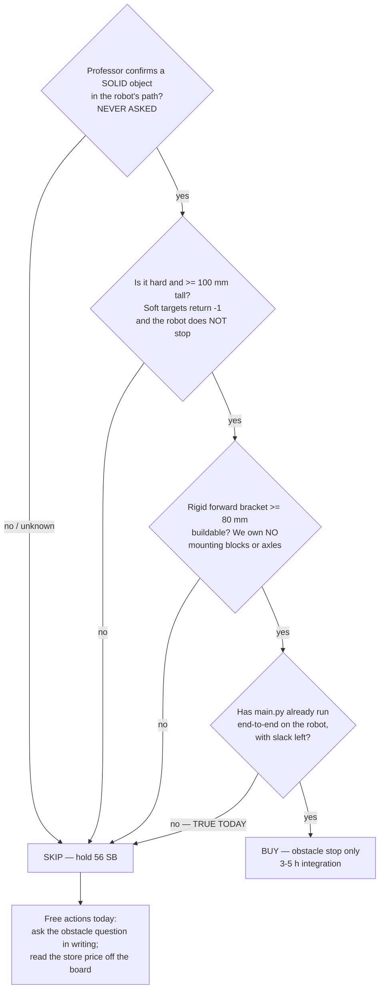

# Distance Sensor 45604 — buy/skip brief, with the *external objects* angle evaluated

**Type:** RESEARCH (external part, mission-fit) · **Created:** 2026-09-08 · **Demo Day:** 2026-09-10 (2 days out)
**Supersedes:** the first pass of this file, and an intermediate draft written against arena facts that
were corrected the same day (see the change log — the correction is the reason §3 reads as it does).

Whether the team should spend Schrute Bucks on a LEGO Education **Technic Distance Sensor 45604** before
Demo Day. **Nothing here was run on hardware.** No distance sensor has ever been owned, plugged in, or
read. Every hub-call claim is `[UNVERIFIED]`; every mission number not sourced to a measurement is
`[ASSUMED]`.

**Why this file exists.** [KU-P3](../plans/known-unknowns.md) deferred the 45604 on one argument: floor
tape has ~0.1–0.3 mm of vertical extent against ±20 mm accuracy and a ~50 mm blind zone, so it cannot see
the boundary. *That argument is correct and is not revisited here.* The operator raised a question KU-P3
never asked: the arena has **no walls**, but the **room around it has objects** — walls, table legs, chairs,
people, other teams' gear. Can the sensor range off *those*, for localisation or containment? §3.1.

### Arena facts used here

OPERATOR-REPORTED 2026-09-08, not measured by us:

- **The graded Demo-Day arena is a COMPLETE CLOSED BOX of blue painters tape on the floor.** ⚠ An earlier
  brief in this session said the boundary was an incomplete polygon; that was **wrong for Demo Day** and
  is retracted. The partial/open tape is a property of the **shared practice area only**, laid out that
  way so teams' setups do not collide. **There are still no walls** — the boundary is tape.
- **The floor is multicolour carpet** — operator's words, *"the floor is the carpet with different colors
  so it is just complicated."* A busy, multi-hue textile.
- **Mines are flat matte sticky notes, yellow and pink.** The colour may change on the day; the professor
  guarantees mines will **never be blue** — blue is reserved for the boundary tape.

The carpet-detection problem and the blue-tape boundary/veto design are **owned by a separate workflow**
and are deliberately not researched here. They appear below only where they change the *distance
sensor's* case, which they do.

---

## 1. TL;DR

**SKIP.** Buy nothing; hold the **56 SB** ([budget ledger](../course/budget.md), checked 2026-09-08).

**One-line why:** with the boundary confirmed as a **closed blue-tape box that the two colour sensors we
already own can see directly**, every containment and localisation job the 45604 might have done is either
**dominated by owned hardware** or **out of its 2000 mm range** — and the only role left standing
(stop for a solid intruder) serves a rule nobody has confirmed, on a robot with no bracket to mount it,
two days from a demo where `src/main.py` has never run.

**Is there a single STRONG defensible use case? Honestly, no.** The strongest surviving role —
obstacle/intruder stop — rates **WEAK**, and it is the *least weak* of eight, not a good one. §3.2 says
so plainly rather than inflating it.

```
BUY the 45604 only if ALL FOUR hold:
  (a) the professor confirms a rule that puts a PHYSICAL, SOLID object in the robot's path
      -- simultaneous robots in one box, a placed obstacle, people allowed inside the tape.
      This has NEVER been asked as an obstacle-stop question; AND
  (b) that object is hard and >= ~100 mm tall -- soft/absorbent targets return -1, i.e. the
      robot does NOT stop, which is the dangerous failure direction; AND
  (c) a RIGID forward bracket at >= 80 mm height exists or can be built in class -- we own
      NO mounting blocks and NO axles; AND
  (d) src/main.py has ALREADY been proven to run end-to-end on the robot, with slack left.

SKIP if ANY hold.  Today (a), (b), (c) and (d) are ALL false -- four for four.
```

**Free actions to take regardless, today:** ask (a) in writing (written team communication is a graded
deliverable), and have the Supplier read the 45604 and 45605 **prices** off the store board —
[KU-T5](../plans/known-unknowns.md) is still open and reading a price is not a purchase.

---

## 2. What it is — key specs

Forward-facing **ultrasonic** rangefinder, two "eyes" (one transmits, one receives). **Colour-blind.**
Not an optical/laser ToF part.

| Spec | Value | Source |
|---|---|---|
| Sensing technology | **Ultrasonic** (sound wave), time-of-flight | LEGO techspec PDF, **text-extracted 2026-09-08**: *"Sensor sample rate — 100 Hz (with ultrasonic function)"* |
| Range (normal) | **50–2000 mm, ±20 mm** | techspec, verbatim: *"Range total: 50-2000 mm +/- 20 mm"* |
| Range (fast mode) | **50–300 mm, ±15 mm** | techspec, verbatim. ⚠ **No SPIKE 3 API exposes fast mode** as of app 3.4.0 — [Prime Lessons SP3](https://primelessons.org/en/PyProgrammingLessons/SP3DistanceSensorPython.pdf) |
| **Near blind zone** | **~50 mm** — nothing readable closer, in either mode | techspec (the range floor *is* the blind zone) |
| Output resolution | **1 mm** | techspec, verbatim |
| **Beam width / FOV** | **Entrance angle ±35° (~70° total cone), "varies according to the distance"** | techspec, verbatim |
| Refresh rate | **100 Hz** (10 ms) | techspec |
| Light ring | 4 white 4000 K LED segments, each **0–100 % in 1 % steps**, individually controlled | techspec |
| Connector / wire | LPF2, **250 mm fixed lead** | techspec |
| Physical size / weight / current draw | **not published** | `[UNVERIFIED]` — absent from the techspec and from every retailer page searched 2026-09-08. Measure on the bench if a mount or power budget ever needs it |
| LPF2 device id | 62 | `[UNVERIFIED]` — our own repo's guess ([identify-hardware-after-rebuild.md](../runbooks/identify-hardware-after-rebuild.md)); never read off a real sensor |

**Marketing vs datasheet — do not quote the marketing.** LEGO's product page says *"1–200 cm with ±1 cm
accuracy"*; the techspec says **50–2000 mm ±20 mm**. The datasheet is the number of record: ±1 cm is
optimistic by 2×, and "1 cm minimum" hides the 50 mm blind zone.

### SPIKE 3 API — exact call sites

Our hub is **SPIKE 3 / MicroPython 1.24.0, MEASURED 2026-08-27**
([hub-first-contact](../findings/hub-first-contact-2026-08-27.md)). Every SPIKE 2 tutorial is
inapplicable. Signatures from the [SPIKE Python v3 reference](https://jvolkening.github.io/lego-spike-python-v3-docs/generated/distance_sensor.html),
corroborated by a SPIKE-3-labelled lesson ([Prime Lessons](https://primelessons.org/en/PyProgrammingLessons/SP3DistanceSensorPython.pdf)):

```python
import distance_sensor
from hub import port

distance_sensor.distance(port.E)            # -> int, MILLIMETRES; -1 when it cannot read
distance_sensor.clear(port.E)               # all four LEDs off
distance_sensor.get_pixel(port.E, x, y)     # x,y in 0..1 -> int 0..100 (%)
distance_sensor.set_pixel(port.E, x, y, i)  # i = 0..100 (%)
distance_sensor.show(port.E, [i0,i1,i2,i3]) # all four at once
```

**The no-echo behaviour is the load-bearing detail.** `distance()` returns **`-1`, not an exception and
not `None`**, whenever nothing is in range — *"If it cannot sense anything, the Python API returns -1.
Note this is different from the value shown in the app … which will be 200cm"* (Prime Lessons, SPIKE 3).
`-1` is the **common** case for a sensor pointed at open space. [`src/hub_distance.py`](../../src/hub_distance.py)
already translates it: `if mm is None or mm < 0: return None`. The light ring **is both settable and
readable** (`set_pixel` / `get_pixel`) — a free 4-segment status indicator if the part were ever owned.

### Can it detect a flat sheet of paper on the floor?

**No. Categorically, three ways at once.** (1) A sticky note has ~0.1–0.3 mm of vertical extent against
**±20 mm** accuracy — 60–200× below the noise floor. (2) It presents **no vertical face** to echo; a pulse
arriving at grazing incidence on a flat floor reflects *forward*, not back — the sonar literature puts the
return cutoff near 45° of incidence
([InTech, *Objects Localization and Differentiation Using Ultrasonic Sensors*](https://cdn.intechopen.com/pdfs/10581/InTech-Objects_localization_and_differentiation_using_ultrasonic_sensors.pdf)).
(3) It is colour-blind, so it could never serve FR-2b. **The colour sensors on C/D are the only mine
detector, and that is not in dispute.**

**The multicolour carpet is neutral-to-negative for this part.** Ultrasonic is colour-blind, so the
carpet's *hues* — the thing that complicates the colour sensors — do not touch the 45604 either way. Its
*texture* does, and not helpfully: carpet pile is a rough scatterer at ultrasonic frequencies, which makes
the grazing floor return of §3.1(4) **more** likely than a hard smooth floor would, not less.
`[UNVERIFIED — never measured on any floor]`

---

## 3. Mission-fit — role by role

Re-rated on the corrected arena facts. The two that changed the ratings: the Demo-Day boundary is a
**closed** tape box, and it is **blue** while mines are guaranteed never blue — so the boundary is
directly observable by the **two colour sensors already on ports C/D**, with no new hardware.

| Candidate role | Verdict | Reason |
|---|---|---|
| **Range off external room objects — CONTAINMENT** | **USELESS** | The problem it solved has been retracted. The Demo-Day box is **closed**, so there is no open side to wander through; and the boundary that does exist is tape the ultrasonic cannot see. §3.1. |
| **Range off external room objects — LOCALISATION / odometry-drift correction** | **WEAK, and dominated** | §3.1. Blocked by a 2000 mm cliff to unmeasured room objects, ±700 mm of cross-range at 1 m, and reflectors that move. And the closed tape box now supplies a *better* exteroceptive fix for free, at every lane end, from owned sensors. |
| **Side-facing wall-follow / heading reference** | **WEAK** *(downgraded from "conditionally strong" once the box was confirmed closed)* | The gyro already holds heading; the closed tape polygon supplies re-squaring references at the lane ends. A room wall would add a mid-lane cross-track check — real, but the smallest of the three, contingent on an unmeasured ≤1500 mm clearance. |
| **Intruder / obstacle / other-robot stop** | **WEAK — the least-weak role, and the strongest that survives** | §3.2. The one genuine ultrasonic strength not dominated by owned hardware. But the *need* is unconfirmed, **soft targets return `-1` so the robot does not stop**, several 45604s in one room hear each other's pings, and a shove/tilt → stop already exists free on the IMU ([fault-detection-cross-check](./fault-detection-cross-check-2026-09-01.md)). |
| **Tape-boundary detection (FR-6)** | **USELESS** | The original KU-P3 argument, unchanged and now doubly moot: 0.1–0.3 mm of tape vs ±20 mm + a 50 mm blind zone, *and* the owned colour sensors do the job. `BOUNDARY_MODE="distance"` in [`config.py`](../../src/config.py) stays unreachable. |
| **Edge / table-drop detection** | **USELESS** | No drop exists (taped classroom floor), *and* geometrically impossible: the ~50 mm blind zone exceeds the robot's floor clearance, so a downward sensor cannot be mounted low enough to read the floor at all. |
| **Start-gate / hand-wave start** | **WEAK** | Works in principle. The hub has **three free buttons**; never spend a port and Schrute Bucks to replace a free button. |
| **Mine detection (FR-2 / FR-2b)** | **USELESS** | See §2 — three independent reasons, any one sufficient. |

### 3.1 The external-objects angle, analysed

**The steelman, as it stood.** The 45604's best case was containment: the arena has no walls, so if the
tape ran out the robot could wander into the room, and `CROSS_TRACK_ERROR_MM = 15.0` in
[`config.py`](../../src/config.py) is `[ASSUMED]` and has **never been measured**. A forward range read
off the room would convert *"drove into the room"* into *"stopped early"*, for ~15 lines against
scaffolding that already exists. That was the operator's angle and it was a fair one — KU-P3 never
considered it.

**The correction removes the load-bearing half of it.** The Demo-Day box is **closed**. There is no open
side. Containment is no longer an unsolved problem, so the role that was going to justify the purchase has
lost its justification. What is left is the *localisation* half — correcting odometry drift against room
walls — and that has to stand on its own. It does not, for four reasons, in order of force:

**(1) The 2000 mm cliff.** Beyond 2000 mm `distance()` returns `-1` → `read_distance_mm()` returns `None`
→ no reading, no fix. **No fact anywhere in this repo** records how far the tape sits from the nearest
room object; the arena is a taped rectangle on an open classroom floor. Under
[KU-P1](../plans/known-unknowns.md) the arena itself may be **3048 mm** across (10 ft), whose
half-diagonal is **2155 mm** — from the centre of a 10 ft box, its own *corners* are already out of range
before the room even starts. The case rests on one unmeasured number with a hard cliff in the middle of
its plausible range.

**(2) The cone destroys bearing.** ±35° means the footprint diameter is **1.400 × range** (computed):

| Range | Cone footprint diameter | Cross-range uncertainty |
|---|---|---|
| 300 mm | 420 mm | ±210 mm |
| 1000 mm | 1400 mm | ±700 mm |
| 2000 mm | 2801 mm | ±1400 mm |

A reading is *"the nearest surface **anywhere** in that cone"*. At 1 m the 2-D fix is a **40 mm × 1400 mm**
ellipse — 20× worse across the beam than the encoders it would be correcting. Spinning does not buy the
resolution back: a 70° beam yields **~5 independent bearing cells per revolution**
([spin-scan-localization.md](./spin-scan-localization.md) reached this in August for the same reason).
*"The sonar sensor's ultrasound beam width is too wide to precisely determine the object's direction"* —
[Sonar Sensor Models and Their Application to Mobile Robot Localization](https://pmc.ncbi.nlm.nih.gov/articles/PMC3267219/).

**(3) The reflectors are neither static nor surveyed.** A range becomes a *position* only against a
surface whose location you know. Chairs move, bags move, other teams' robots move **during** the run, and
the instructor walking the arena is the single most likely thing in the forward cone. Correcting a pose
against an unsurveyed mover **injects** error rather than removing it, and the literature is blunt that
indoor surfaces are specular reflectors producing *"false images of non-existing objects"*
([InTech, above](https://cdn.intechopen.com/pdfs/10581/InTech-Objects_localization_and_differentiation_using_ultrasonic_sensors.pdf)).
Published sonar localisation needs a **prior map plus many readings**, not one range off whatever is
nearest.

**(4) The floor enters the beam at a range we cannot mount above.** With the axis horizontal at height
`h`, the cone's lower ray meets the floor at slant range **1.743·h** (computed, `h / sin 35°`):

| Mount height h | First floor intersection (slant range) |
|---|---|
| 40 mm | **70 mm** — just outside the 50 mm blind zone |
| 60 mm | 105 mm |
| 80 mm | 139 mm |
| 150 mm | 262 mm |

Carpet pile is a rough scatterer, so a return is plausible. If it returns, the sensor reads a **constant
~100 mm forever**, any threshold fires immediately and permanently, and **the run is lost on the day**.
The mitigation is a high mount (≥ 150 mm) with a few degrees of up-tilt — and we own **no mounting blocks
and no axles** (§4). That is a build risk, not a tuning risk, and it cannot be bought away by Thursday.

**(5) — new, and decisive — the job is now dominated by hardware we already own.** The closed boundary is
**blue tape**, and mines are **guaranteed never blue**. Every lane end therefore crosses a known line that
the **two colour sensors on ports C/D** can observe directly, giving an exteroceptive along-track fix with
a footprint measured in millimetres instead of a ±700 mm cone — for **0 SB, 0 ports and 0 new brackets**.
*(How that detection is built is another workflow's problem, not this brief's.)* A 45604 buying a worse
version of a fix the robot can already take is not a purchase; it is a redundancy at full price.

**What survives.** One fragment: a **team-supplied reference board**, taped down at a surveyed spot, would
make the geometry deterministic and static and would kill objections (1) and (3) outright. It needs a
professor answer nobody has asked for, it is a *build* rather than just a buy, and after the correction it
would be competing against the tape box for the same job. It is a curiosity now, not a plan.

### 3.2 The strongest defensible use case — stated honestly

> **There is no STRONG use case.** The strongest surviving role is **stopping for a solid intruder** — a
> person's leg or another team's robot entering the box — and it rates **WEAK**.

It is the only role in the table not dominated by hardware already on the robot, and stopping for a
physical obstacle is the textbook ultrasonic strength. But it fails to reach STRONG on its own merits, not
merely on schedule:

- The **need is unconfirmed.** Nobody has asked whether robots share the box simultaneously, whether an
  obstacle is placed, or whether people may enter during a run. Building for an unconfirmed rule is exactly
  what [minimalism-contract §4](../plans/minimalism-contract-2026-09-03.md) forbids.
- The **failure direction is wrong.** A person in soft clothing absorbs the pulse and returns `-1` — the
  robot does **not** stop. A safety device that silently declines to fire on the softest, most likely
  intruder is not a safety device.
- **Cross-talk degrades the very scenario that would justify it.** Several 45604s in one room hear each
  other's pings; the repo already records this as an adversarial multi-robot competition
  ([competitive-interference.md](../plans/competitive-interference.md)).
- A **free equivalent already exists**: an external shove or tilt already drives stop + DEGRADED off the
  IMU and encoders ([fault-detection-cross-check](./fault-detection-cross-check-2026-09-01.md)).

Reporting this as "the strongest case" and *also* as "not good enough" is the honest reading. It does not
become STRONG by being the best of a weak field.

---

## 4. Integration if bought

The code side really is minimal — the architecture was scaffolded in August to absorb this part as a value
change, not a redesign. **The mount, not the code, is the blocker.**

| Item | Answer |
|---|---|
| **Port** | **E.** Both E and F read EMPTY (MEASURED 2026-09-01, `OSError` on `device.id()`); nothing distinguishes them. Take E, leave F, record the row in [port-map.md](../hardware/port-map.md). |
| **Already exists** | [`src/hub_distance.py`](../../src/hub_distance.py) — a finished reader with the `-1`→`None` translation and the correct SPIKE 3 branch. `config.BOUNDARY_MODE` already carries its `"distance"` value. [`src/sweep.py`](../../src/sweep.py) already emits `CMD_RESQUARE`, which `main.py` deliberately no-ops. |
| **What `main.py` needs** | It reads distance **nowhere** today. Add `import hub_distance`; one new `[ASSUMED]` `OBSTACLE_STOP_MM` (must clear both the 50 mm blind zone *and* the floor-bounce range of §3.1(4) — start at `250.0`); and a ~6-line poll inside `drive_distance_mm()`'s loop routed into the existing degraded-mode stop path. |
| **Rough size** | **~15–25 lines** across `main.py` + `config.py` + `hub_api.py`, plus a port-map row and a journal entry. |
| **Is it a pure `BOUNDARY_MODE` bolt-on?** | **No — be precise.** The knob and the reader exist; **no code reads the knob**. `main.py` never branches on `BOUNDARY_MODE`. It is a *scaffolded* bolt-on: half the wiring is pre-built, the branch is not. And after the correction the surviving role is an **obstacle** stop, which is not what `BOUNDARY_MODE` names — so it wants its own knob, not that one. |
| **New `[UNVERIFIED]` risk** | **One new cold hub call site** — `distance_sensor.distance()` and its `-1` sentinel have never run on our hub — added to a competition program that **has itself never run on hardware**, two days out. Also unconfirmed: device id 62, and whether a sensor on E changes `hub_selfcheck`'s verdict path. |
| **The `None` inversion trap** | `None` means *"nothing within 2 m"* — for an obstacle stop that is the **safe** case, but a soft intruder also returns `None`. Getting the polarity backwards makes the robot stop dead on tick 1, forever. Whoever writes the six lines must state the chosen meaning in the comment. |
| **`RESQUARE` gains nothing** | Squaring needs a fixed vertical reference at a known bearing. There are no walls at the tape; the tape itself is the reference and the colour sensors read it. Wiring the no-op branch buys zero. |
| **Mounting — the real blocker** | A forward sensor needs a **rigid, horizontally-aimed bracket at ≥ 80 mm** (≥ 150 mm to be safe from floor bounce), ideally tilted a few degrees **up**. We own **no mounting blocks and no axles** ([port-map.md](../hardware/port-map.md)). The two colour sensors already pivot in a **~25 mm circle** on single-peg mounts ([mounting-wobble](../findings/colour-sensor-mounting-wobble-2026-09-03.md)); the same peg slop on a forward sensor is mostly harmless in **yaw** (a ±35° cone swamps aim slop) but **fatal in pitch** — a few degrees down and the floor enters the near beam permanently. Only the **Builder** may mount it, **in class**. Forward mass can also silently shift the freshly-measured 95 mm effective track that odometry depends on. |

**Effort estimate.**

| Task | Hours | Who / where |
|---|---|---|
| Code: port constant, config knob, the 6-line poll, host import check | **1.0–1.5 h** | Programmer, host, no hardware |
| Deploy + first-ever call-site smoke test (`distance()`, the `-1` path, device id) | **0.5–1.0 h** | Programmer, hub plugged in |
| Build a rigid ≥ 80 mm forward bracket **from parts we do not own** | **unbounded** — blocked on a purchase *and* a class session | Builder, in class, roles enforced |
| Bench-characterise floor bounce on the carpet, set `OBSTACLE_STOP_MM` | **1.0–2.0 h** | Builder + Programmer, on the real floor |
| Re-check track width / turn scale after adding forward mass | **0.5 h** | Builder |
| **Total, excluding the blocked mount** | **3–5 h** | spread over a class session that does not exist before 2026-09-10 |

---

## 5. Cost & schedule

- **Balance: 56 SB** — verified against the ledger ([../course/budget.md](../course/budget.md)) on
  2026-09-08 (100 start − 20 motors
  − 14 wheels − a 10 SB *"Project budget reallocation"* the ledger does not explain; chase whether that is
  recoverable before spending anything).
- **45604 store price:** `[UNVERIFIED]`. There is deliberately no price list in the repo
  ([KU-T5](../plans/known-unknowns.md)). Motors cost 10 SB and wheels 7 SB, so `[ASSUMED]` **7–15 SB**.
- **Sell-back loss:** 90 % rounded down. At an assumed 10 SB that is **1 SB** lost on a wrong buy.
  **This is the weakest reason to skip — do not lean on it.** The decisive costs are schedule and the
  absence of a confirmed role, not 1–3 Schrute Bucks.
- **Opportunity cost — and a correction to the framing.** The standing "buy a **2nd** colour sensor"
  comparison is **stale**: ports **C and D already hold colour sensors** (MEASURED 2026-09-01,
  `device.id` 61). The real alternative is a **3rd** on E — itself weak: the second sensor already
  delivered **2.59×** swath, a third adds less per sensor, it fills the hub, and the coverage *need* cannot
  be sized while [KU-P1](../plans/known-unknowns.md) is open ([coverage-time-budget](../findings/coverage-time-budget.md)
  says outright: *do not buy a third colour sensor yet*). The honest call is **buy neither, hold the
  reserve** — not "buy colour instead".
- **Demo-in-2-days risk — decisive.** [`src/main.py`](../../src/main.py) has **never run on hardware**
  (KU-M29). The critical path to a grade is *proving the program we already wrote runs at all*, on a
  **multicolour carpet** that is itself a fresh, unmeasured detection problem. A new sensor competes for
  the last class session against both, and contributes nothing to either existential problem — the units
  of "10×10", and the coverage-time budget — which turn on **swath and wheel measurement**, never ranging.



---

## 6. Adversarial self-check — what survived

**Strongest BUY case, attacked.** Before the correction it was containment: *"the tape is open, the robot
can wander into the room, a forward range is a cheap hard stop."* The **closed-box correction retracts its
premise outright** — there is no open side. What remains of it is odometry-drift correction off room
walls, and that is refuted five ways: (1) a **2000 mm cliff** against an unmeasured clearance, with a 10 ft
box's own half-diagonal already at 2155 mm; (2) a **±700 mm cross-range at 1 m** that is 20× worse than
the encoders it would correct; (3) **movers, not landmarks** — chairs, bags, robots, the instructor;
(4) a **floor return at ~1.74 × mount height** on carpet we cannot mount above with parts we do not own;
and (5) — decisively — **the blue closed tape box gives a better fix for free**, from the two colour
sensors already on C/D. One fragment survives: a *team-placed surveyed board*, which is an unasked
question and a build, not a buy.

**Strongest SKIP case, stress-tested.** *"No role, no time, no money."* — the **money leg fails**: at
~1 SB of sell-back loss on a 56 SB balance, cost is not a real deterrent and should not be argued as one.
The **"schedule" leg could be accused of pre-deciding the research**, so it is worth separating: even with
a free week and a mounted bracket, §3.1(5) would still hold — the fix is dominated by owned hardware — and
§3.2 would still rate the residual role WEAK on physics (soft targets return `-1`) rather than on the
calendar. **The verdict does not depend on the two-day deadline; the deadline only makes it obvious.**

**What survives:** SKIP, on three independent legs — **(i)** the surviving roles are dominated by the
colour sensors already owned, **(ii)** the mount cannot be built from parts we have, **(iii)** the
obstacle role fails in the dangerous direction (`-1` on soft targets) and serves an unconfirmed rule.
Schedule is a fourth, and it is the loudest but not the load-bearing one.

**Correction to the record:** the earlier KU-P3 wording — that the 45604 has *"no boundary role left"* —
is right, but the *reason* is now better stated. It is not merely that ultrasonic cannot see tape; it is
that **the tape is blue, closed, and already visible to sensors we own**, which removes the entire class
of jobs the 45604 was being considered for.

---

## 7. Open questions to close before buying

1. **Is there an obstacle rule?** Do robots share one box simultaneously; is any physical obstacle placed;
   may a person enter the box during a run? **This is the only remaining path to a defensible purchase**
   and it has never been asked as an obstacle-stop question.
2. **May the team place its own reference board / marker?** Never asked. It would make any ranging geometry
   static and surveyed — and it also revives the Force Sensor 45606.
3. **Measure the room** *(free, no permission needed, the moment anyone stands in the arena)*: how far is
   the nearest large, flat, **static** vertical surface from each lane axis? ≤ 1500 mm would at least make
   the residual localisation role testable.
4. **[KU-P1] units of "10×10" and [KU-P2] time limit / scoring** — still open, and they gate every
   sensor-count decision.
5. **[KU-T5] the displayed store price** of the 45604 and the 45605. Free, graded, unblocked.
6. **[KU-T6]** what was the 10 SB *"Project budget reallocation"*, and is it recoverable?

---

## Sources

- **LEGO Education, Technic Distance Sensor techspec (PDF)** — [assets.education.lego.com](https://assets.education.lego.com/v3/assets/blt293eea581807678a/blt64c2b9534cf10f68/5f8801b8bc43790f5c4389ea/techspecs_technicdistancesensor.pdf?locale=en-us),
  fetched and **text-extracted 2026-09-08**. Range, accuracy, ±35° entrance angle, 100 Hz and the LED
  figures in §2 are verbatim from it.
- **LEGO Education product page 45604** — [education.lego.com](https://education.lego.com/en-us/products/lego-technic-distance-sensor/45604/)
  (the optimistic "1–200 cm ±1 cm" marketing figure; superseded by the techspec).
- **SPIKE Python v3 API reference, `distance_sensor`** — [jvolkening.github.io](https://jvolkening.github.io/lego-spike-python-v3-docs/generated/distance_sensor.html).
- **Prime Lessons, *Introduction to Distance Sensor* (SPIKE 3)** — [primelessons.org](https://primelessons.org/en/PyProgrammingLessons/SP3DistanceSensorPython.pdf).
  Source of the **`-1` no-echo sentinel** and of the note that **fast mode is not exposed** by the SPIKE 3 API.
- **Sonar Sensor Models and Their Application to Mobile Robot Localization** — [PMC3267219](https://pmc.ncbi.nlm.nih.gov/articles/PMC3267219/) (beam width destroys bearing) · **Objects Localization and Differentiation Using Ultrasonic Sensors** — [InTech PDF](https://cdn.intechopen.com/pdfs/10581/InTech-Objects_localization_and_differentiation_using_ultrasonic_sensors.pdf) (specular reflection, phantom objects, ~45° incidence cutoff) · **A Review of Sensing Technologies for Indoor Autonomous Mobile Robots** — [PMC10893033](https://pmc.ncbi.nlm.nih.gov/articles/PMC10893033/).
- **ResearchHub was DOWN** on 2026-09-08 (`./scripts/rh-query.sh` exit 3, tunnel unreachable), so the
  academic citations above come from open web sources rather than the usual first stop. Noted per
  [knowledge-retrieval](../directives/knowledge-retrieval.md) fail-open.
- **In-repo:** [known-unknowns.md](../plans/known-unknowns.md) (KU-P1, KU-P3, KU-T5, KU-T6) · [scope.md](../scope.md) · [spin-scan-localization.md](./spin-scan-localization.md) · [coverage-time-budget.md](../findings/coverage-time-budget.md) · [mounting-wobble](../findings/colour-sensor-mounting-wobble-2026-09-03.md) · [minimalism-contract](../plans/minimalism-contract-2026-09-03.md) · [mission-algorithm.md](../plans/mission-algorithm.md) · [competition-movement-options](../plans/competition-movement-options-2026-09-03.md) · [competitive-interference.md](../plans/competitive-interference.md) · [port-map.md](../hardware/port-map.md) · [budget.md](../course/budget.md).

## Change log

| Date | What changed | Who |
|---|---|---|
| 2026-09-08 (3rd) | **Re-weighted for two corrected arena facts:** the Demo-Day boundary is a **COMPLETE CLOSED BOX** of blue tape (the open/partial tape belongs to the shared *practice* area only — the earlier "partially open" premise is retracted), and the **floor is multicolour carpet**. Consequences: the containment role drops **WEAK → USELESS** (the problem it solved does not exist); the localisation role stays WEAK but is now **dominated** by the closed blue box, which the two owned colour sensors can observe for 0 SB (new §3.1(5)); the side-wall reference drops from "conditionally strong" to WEAK. §3.2 now states plainly that **no role reaches STRONG**. Decision rule rewritten around an *obstacle* rule rather than an open boundary. Carpet noted as neutral for a colour-blind sensor but as a rougher, more likely floor-bounce scatterer. Adversarial check re-run and now shows the verdict does **not** rest on the deadline. | Claude |
| 2026-09-08 (2nd) | Re-opened for the operator's **external-objects** question, which KU-P3 never asked. Specs re-sourced by **text-extracting** LEGO's techspec PDF rather than a search summary of it (±35° entrance angle, 50–2000 mm ±20 mm, fast mode not exposed by the SPIKE 3 API, 100 Hz, 4 LED segments). SPIKE 3 call sites listed with the `-1` sentinel sourced. Added the beam-footprint and floor-intersection geometry tables. | Claude |
| 2026-09-08 (1st) | First pass: SKIP on the grounds that no role survived KU-P3. | Claude |
