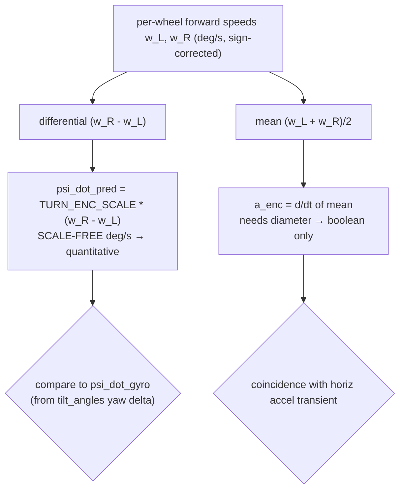
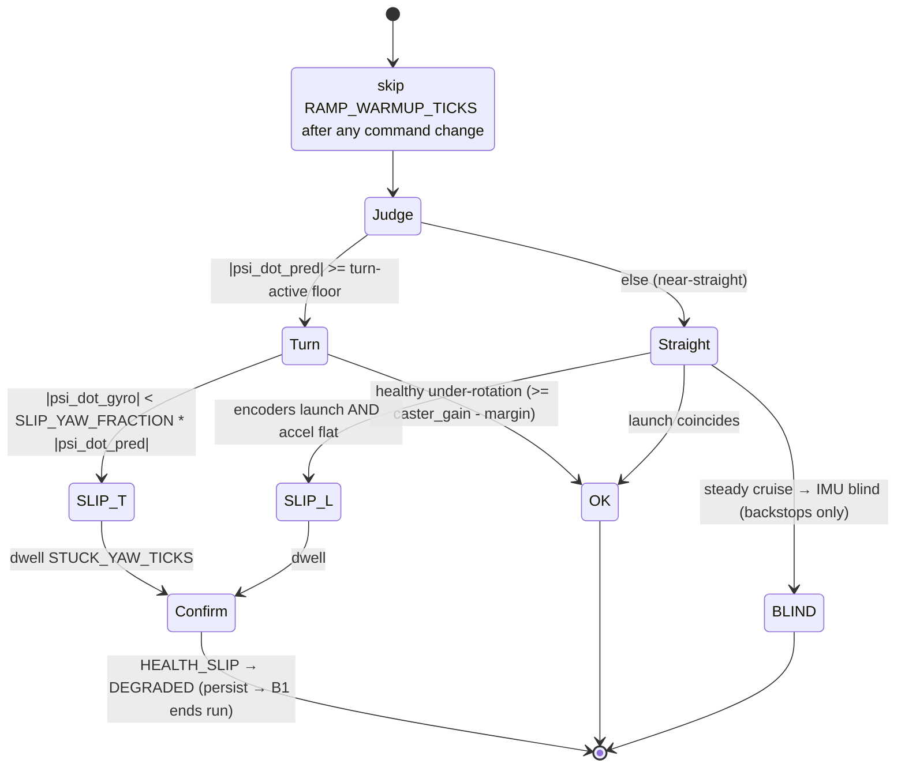

# Cross-check fault detection — encoders vs the IMU, as small pure functions

> **Type:** RESEARCH (design brief) · **Created:** 2026-09-01 · **Owner:** the **Programmer**
> **Designs to:** the chassis measured 2026-09-01 — differential drive (A=LEFT, B=RIGHT, id 48,
> forward A:−v B:+v, direct drive 1 rev = 360 enc-deg, 930 dps ceiling), a **single fixed
> unidirectional rear roller** that rolls fore/aft but scrubs sideways in any spin.
> **Refines, never replaces:** [../plans/competition-program-design.md](../plans/competition-program-design.md)
> §2.5 / §4.9 (degraded modes G1/B1/M1) and [../plans/mission-algorithm.md](../plans/mission-algorithm.md).
> **Sits beside:** [detection-odometry-coverage-2026-09-01.md](./detection-odometry-coverage-2026-09-01.md)
> §B (the scrubbing caster and the gyro-vs-encoder gap) — this brief is the fault half of that section.
> **Measured behaviour from:** [../findings/imu-characterisation-2026-08-27.md](../findings/imu-characterisation-2026-08-27.md)
> · [../findings/drive-checkpoint-2026-09-01.md](../findings/drive-checkpoint-2026-09-01.md).
> **Techniques / literature from:** [motion-control-and-odometry.md](./motion-control-and-odometry.md)
> and the ResearchHub corpus (§ Sources).

**The operator's intent, verbatim in effect:** the **encoders are the PRIMARY** motion source and the
**IMU is a CONFIRMATION** source. Two named faults are wanted, each a cross-check between the two:

1. **SLIP / STUCK** — the encoders advance (wheels turning) but the IMU shows **no corresponding
   motion**. Wheels turning, robot not moving.
2. **LIFTED / PUSHED / FALLING / TIPPED** — the IMU shows motion (a tilt change, an acceleration spike
   on **any** axis beyond gravity, an `up_face` change, a yaw change) while the motors report **~zero**
   velocity and duty. External disturbance.

**Nothing in this brief has been measured on a moving robot.** Every threshold is `[ASSUMED]` and every
magnitude `[UNVERIFIED]` unless it cites a measurement that exists. The rule this brief obeys is the
project's: a bench number changes a **value in `config.py`**, never a state in the machine or a module in
the tree. Where a decision maps onto existing code the change is **additive** — the new pieces are small
**pure functions** that take readings and return a status string, sitting beside `odometry.py`'s existing
`heading_disagreement_deg()`. **No new module, no class, no state machine, no `main.py`.**

**Two conventions.** (1) Everything is in **encoder-degrees / deg-per-second and raw IMU units**
(decidegrees, milli-g) — wheel diameter is UNMEASURED (KU-M3), so there is no deg→mm scale, and the
central result below is that the **yaw cross-check does not need one**. (2) Confidence is split into
**structural** (is the rule sound?) and **measured** (has it been seen on this moving robot?). For every
decision here the measured column is currently **zero** — the honest state, and the reason § 7 lists the
one bench run that unblocks the most.

---

## Contents

- [0. The one physical fact that shapes everything](#0-the-one-physical-fact-that-shapes-everything)
- [1. The kinematic predictor — expected IMU from the wheels](#1-the-kinematic-predictor--expected-imu-from-the-wheels)
- [2. Fault 1 — SLIP / STUCK](#2-fault-1--slip--stuck)
- [3. Fault 2 — LIFTED / PUSHED / FALLING / TIPPED](#3-fault-2--lifted--pushed--falling--tipped)
- [4. Auto-tune — the thresholds derive from a few measured constants](#4-auto-tune--the-thresholds-derive-from-a-few-measured-constants)
- [5. New function signatures (consolidated)](#5-new-function-signatures-consolidated)
- [6. RECOMMENDED CHANGES to other files](#6-recommended-changes-to-other-files)
- [7. Blind spots, and the bench runs that close them](#7-blind-spots-and-the-bench-runs-that-close-them)
- [Sources](#sources)

---

## 0. The one physical fact that shapes everything

**An accelerometer at constant velocity is indistinguishable from one at rest.** Both measure only the
specific force of gravity (`|a| ≈ 989 mg`, MEASURED 2026-08-27). Proper horizontal acceleration is
non-zero **only while speed is changing** — at launch and at braking. This is not a limitation to design
around; it is the boundary that decides which cross-check is available when:

- **Turning** produces a *sustained* signal the gyro reads directly (yaw rate) → a **quantitative**
  cross-check, available every tick a turn is commanded.
- **Straight-line launch/brake** produces a *transient* the accelerometer reads → a **coincidence**
  cross-check, available only during the ramp.
- **Straight-line steady cruise** produces **no** inertial signal at all → the IMU is **blind** to a
  robot that is cruising vs. one whose wheels are spinning in place at constant speed. This blind spot is
  real, is stated in § 2.4, and is covered by other backstops, not by the IMU.

Everything below follows from sorting the faults into these three regimes.

---

## 1. The kinematic predictor — expected IMU from the wheels

Differential drive, direct drive (1 wheel-rev = 360 enc-deg, no gearing). Work in a **forward-positive
per-wheel frame**: `w_L`, `w_R` are each wheel's forward angular speed in **deg/s**, already
sign-corrected by the caller with `LEFT_MOTOR_FORWARD_SIGN`/`RIGHT_MOTOR_FORWARD_SIGN`
([`hub_motors.py`](../../src/hub_motors.py); forward is A:−enc, B:+enc, so `w_L = -Δenc_A/dt`,
`w_R = +Δenc_B/dt`). Keeping the sign flip in the caller (the hub layer, beside the port map) is the same
rule the drive loop already follows; these pure functions never see a raw port.

### 1.1 Yaw rate — scale-free, so it works NOW

Standard diff-drive heading rate is `ω = (v_R − v_L)/b` with `v = (πD/360)·w` the wheel's ground speed.
Substituting and converting rad→deg, the wheel-diameter and track collapse into a single **dimensionless
ratio**:

```
psi_dot_pred [deg/s]  =  (D / (2*b)) * (w_R - w_L)
                      =  TURN_ENC_SCALE  *  (w_R - w_L)
```

**This is the load-bearing result.** `D` (mm) and `b` (mm) appear only as the ratio `D/(2b)`, a pure
number, so **the predicted body yaw rate is in real deg/s and directly comparable to the gyro without
knowing the wheel diameter in mm.** `TURN_ENC_SCALE` is the same constant
[detection-odometry-coverage-2026-09-01.md § B.1-7](./detection-odometry-coverage-2026-09-01.md) already
carries (body-deg per enc-deg of wheel differential); its job (1) there is *exactly* to feed this check.
It is measurable now — regress logged gyro yaw against the encoder differential over one gyro-closed spin
(`examples/square_odometry.py` already streams the rows) — with the units of "10×10" still unknown and
`D` still unconverted. *Structural: high. Measured: zero.*

Sign convention: `w_R > w_L` ⇒ robot yaws **left (CCW)** ⇒ `psi_dot_pred > 0`, matching
`odometry.Pose` (CCW-positive). The caller compares against a gyro yaw rate in the **same** CCW-positive
frame; `read_yaw_deg()` is decidegrees/10 and sign-inverted vs the app, so the frame must be reconciled
once, in the caller, and every delta passes through `normalize_angle()` for the ±180 seam.

**Measure the gyro rate as a yaw *delta*, not from `angular_velocity()`.** `angular_velocity()` reads
**exactly `0,0,0`** at rest (MEASURED; a firmware deadband, KU-M19), so it would report zero through a
genuine slow turn and *false-flag slip*. Derive the rate from consecutive `tilt_angles()[0]`:
`psi_dot_gyro = normalize_angle(yaw - yaw_prev) / dt`. `tilt_angles()` yaw *may* carry the same
filtering (UNVERIFIED); until a slow motorised turn is watched (KU-M19), the dwell in § 2.3 is what keeps
that from tripping.

### 1.2 Forward acceleration — NOT scale-free, so it degrades to a coincidence test

The forward-motion predictor is the mean wheel rate `w_mean = (w_L + w_R)/2`. Its *rate of change*
`a_enc = (w_mean − w_mean_prev)/dt` (deg/s², encoder-derived) is the launch/brake transient. But turning
`a_enc` into an expected accelerometer reading in mg needs `πD/360` — **the wheel diameter we do not
have.** So the straight-line check cannot be a magnitude match. It degrades to a **boolean coincidence**:

```
encoders say launching   :=  |a_enc|              >  LAUNCH_ACC_ACTIVE_DPS2
IMU says launching        :=  horiz_accel_dev_mg   >  ACC_STILL_BAND_MG
```

where `horiz_accel_dev_mg = sqrt(ax^2 + ay^2)` is the accelerometer's horizontal magnitude with gravity
on `z` (assumes the hub is mounted flat; `is_flat()`/`up_face()` confirm that first — which physical face
is `TOP` once mounted is still open). Slip at launch is "encoders say launching **and** IMU does **not**."
No diameter enters either side. *Structural: high. Measured: zero.*



---

## 2. Fault 1 — SLIP / STUCK

Encoders advancing, the IMU showing no corresponding motion. Three regimes, three strengths.

### 2.1 Turn-slip — the strong case

**Predicts:** if the encoder differential commands a real yaw (`|psi_dot_pred|` above the gyro noise
floor), the gyro must show a proportional yaw rate. **Discriminant** — a *ratio*, because
`psi_dot_pred` is in the same units as the gyro:

```
gate   : |psi_dot_pred| >= TURN_ACTIVE_DIFF_DPS * TURN_ENC_SCALE   (a turn is actually commanded)
slip   : |psi_dot_gyro| < SLIP_YAW_FRACTION * |psi_dot_pred|        (body under-rotates far past healthy)
```

The ratio form is what makes this robust to the wheel diameter and to the exact turn speed. A stuck
robot whose wheels spin gives `psi_dot_gyro ≈ 0` while `psi_dot_pred` is large — the ratio collapses to
~0, far below any healthy value. *Structural: high. Measured: zero (no gyro-during-turn data exists; KU-M9
turn half is untouched).*

### 2.2 Launch-slip — the moderate case

The boolean coincidence of § 1.2: on a straight (`|w_R − w_L|` small) with the encoders showing a launch
transient but the accelerometer flat, the robot did not actually accelerate → slip/stuck at launch. Only
fires during the ramp; says nothing during cruise. *Structural: high. Measured: zero.*

### 2.3 Avoiding false positives — this is where the chassis bites

Four healthy behaviours look like slip and must be excused:

1. **The caster under-rotates by design.** The fixed rear roller scrubs sideways in every spin, so a
   *healthy* robot already turns **less** body-angle than the geometric encoder differential predicts
   ([detection-odometry-coverage § B.1-6](./detection-odometry-coverage-2026-09-01.md): "expected
   DOMINANT and SYSTEMATIC, several degrees to >10° per 90°, UNVERIFIED"). So the slip threshold is **not**
   `gyro ≠ predicted`; it is `gyro ≪ predicted`. Set `SLIP_YAW_FRACTION` **below** the healthy caster
   under-rotation gain `caster_gain = psi_dot_gyro / psi_dot_pred` (< 1, measured at BM-4), with margin:
   `SLIP_YAW_FRACTION = caster_gain - CASTER_MARGIN`. A healthy caster sits at `caster_gain`, comfortably
   above the trip. **This is the auto-tune of § 4 in miniature:** one measured chassis constant sets the
   threshold, not taste.
2. **The gyro deadband (KU-M19).** `angular_velocity()` reads exact zeros at rest and `tilt_angles()` yaw
   *may* filter the same way, so a slow healthy turn can hold yaw constant for several ticks. **Debounce
   with `config.STUCK_YAW_TICKS`** (already 50 ≈ 0.5 s at the assumed rate) and **do not lower it** until a
   slow motorised turn is benched — the config comment already carries this caveat.
3. **The startup ramp.** A short move loses ~9° to the launch ramp (MEASURED: 250 dps × 1.5 s commanded
   375°, logged 366° — a *ramp shortfall*, **not** a coast). Skip the first `RAMP_WARMUP_TICKS` of any
   commanded-velocity change before trusting either discriminant; during the ramp the encoders and the
   body are both still catching up to the command.
4. **The turn settle window.** After a gyro-closed turn ends, momentum keeps the body moving while the
   wheels are braked — the opposite of slip. Suppress the launch check during `TURN_SETTLE_MS`.

### 2.4 The blind spot, stated not hidden

**Both wheels slipping equally at constant speed** (e.g. both wheels spinning on a slick patch while the
robot sits still, mid-cruise) produces **no** differential (so no yaw error) and **no** acceleration
transient (constant speed) — it is **invisible** to the IMU (§ 0). It is caught only by:

- **motor stall** (`status() == STALLED`, or `velocity()` ≈ 0 against a non-zero command) for the *not
  turning* variant — a motor-side signal complementary to this IMU check; slip where the wheel genuinely
  turns is exactly what stall detection *misses* and this brief *adds*;
- the **odometry rectangle backstop** (degraded mode **B1**) and `MAX_CONSECUTIVE_NONE`, which end a run
  that stops making ground or stops seeing floor;
- ultimately **coverage** — a robot not progressing detects nothing new and the sweep never completes.

Do not claim the IMU covers steady-cruise equal-slip. It does not, and the design says so.



---

## 3. Fault 2 — LIFTED / PUSHED / FALLING / TIPPED

The IMU shows motion while the motors are quiescent. This is the **kidnapped-robot** signature in
proprioceptive form: an *un-commanded* displacement, detected because the motion witness (IMU) and the
actuation (motors) disagree about whether the robot should be moving at all
([Engelson & McDermott 1992](#sources); MCL kidnap-detection work, § Sources).

### 3.1 The gate that makes an IMU spike mean "external"

An accelerometer spike or a yaw change is only *external* if the robot did not cause it. So **gate the
whole fault on motor quiescence**:

```
motors_quiet := |w_L| < MOTOR_QUIET_DPS and |w_R| < MOTOR_QUIET_DPS
             and |duty_L| < MOTOR_QUIET_DUTY and |duty_R| < MOTOR_QUIET_DUTY
```

Both velocity **and** duty are checked: a commanded-but-stalled motor reads low velocity yet non-zero
duty (it is *trying* to move, so any lurch is arguably its own), and a coasting motor reads non-zero
velocity yet zero duty. Requiring both low is the honest "the robot is not acting" test. `velocity()` and
`get_duty_cycle()` are both in the measured motor API.

### 3.2 The four IMU witnesses, and what each catches

With the motors quiet, **any** of these beyond its stationary band is an external disturbance:

| Witness | Quantity | Catches | Orientation-robust? |
|---|---|---|---|
| **Gravity deviation** | `\| \|a\| − GRAVITY_MG \|` | lift/shove (spike **>** 1 g), **free-fall** (`\|a\| → 0`, deviation ≈ 989) | **Yes** — magnitude, mount-independent |
| **Tilt change** | `\|Δpitch\|, \|Δroll\|` (decidegrees) | tipping, being set on a ramp, a wheel lifted | Yes — deltas |
| **`up_face` change** | face id ≠ previous | flipped / knocked over | Yes |
| **Yaw change** | `\|normalize_angle(Δyaw)\|` | spun by hand or by a rival | Yes |
| **`FALLING` gesture** | gesture == 3 (MEASURED) | free-fall, corroborates gravity→0 | Yes |

Free-fall is the cleanest signal in the whole brief: a dropped hub reads `|a| → 0`, a deviation of ~989
mg — an order of magnitude past any noise band — and the firmware's own `FALLING` gesture fires
independently. `gravity_deviation_mg` is the **same physical constant** `gyro_drift.py` already uses to
refuse a contaminated drift window ([imu-characterisation § 5.3](../findings/imu-characterisation-2026-08-27.md)):
a still hub holds its gravity vector to a milli-g or two, so the accelerometer is a free disturbance
detector. *Structural: high. Measured: zero on a mounted robot (the 2.2 mg still-figure was a bare hub).*

### 3.3 Avoiding false positives — the mirror of § 2.3

The trap is symmetric: the accelerometer transient at a **normal launch** and the yaw change in a
**normal turn** are exactly what fault 2 looks for. The motor-quiescence gate (§ 3.1) is the whole
defence — while the robot is driving or turning, `motors_quiet` is false and fault 2 cannot fire. Two
refinements:

- **Post-stop settle.** Just after a stop the body is still decelerating and rocking on the caster; the
  motors read quiet but the motion is the robot's own. Suppress fault 2 for `TURN_SETTLE_MS` /
  `STOP_SETTLE_MS` after a commanded stop.
- **Dwell.** Require `DISTURB_DWELL_TICKS` consecutive ticks for the *shove/tilt/yaw* witnesses (a single
  bump is not a kidnap) — **but treat `FALLING` and an `up_face` flip as immediate**, because a fall in
  progress must stop the motors *now*, not after 0.5 s.

### 3.4 Mutual exclusivity, and the response policy (kept in the run loop, not here)

Fault 1 needs *encoders active + IMU quiet*; fault 2 needs *motors quiet + IMU active*. Their gates are
opposite, so **at most one fires per tick** — a caller runs both and never has to arbitrate. The
detection is pure; the *response* stays in `main.py` (the same split as boundary-STOP in the sibling
docs):

- confirmed **SLIP** that clears → log + `STATUS_DEGRADED`; that persists → let B1/`MAX_CONSECUTIVE_NONE`
  end the run (do not spin forever);
- **EXTERNAL** shove/tilt → `stop_motors()`, re-verify pose (heading may be corrupted), `STATUS_DEGRADED`;
- **EXTERNAL** free-fall or `up_face` flip → `stop_motors()` immediately + `STATUS_FAULT` (safety first);
  a robot in the air must not drive.

This also hardens the run against the **authorised interference**
([competitive-interference.md](../plans/competitive-interference.md)) a bump or shove is named as: fault
2 is precisely a rival-shove detector, and it costs no new mechanism.

---

## 4. Auto-tune — the thresholds derive from a few measured constants

The operator wants the bands **derived from a few measured constants, not hand-tuned each**. Every band
above is symbolic in a named measurement, so one pure deriver (a sibling to `calibration.calibrate()` and
`config.event_width_gates()`) produces them at run start from short **stationary** bursts plus the two
chassis constants:

```
derive_motion_health_thresholds(
    still_yaw_rate_dps,      # stationary yaw-rate spread, run-start burst (stationary ≤0.0033 dps MEASURED, bare hub)
    still_acc_dev_mg,        # stationary |a|−GRAVITY spread (bare-hub worst 2.2 mg; gyro_drift uses a 25 mg gate)
    still_tilt_spread_ddeg,  # stationary pitch/roll spread
    turn_enc_scale,          # D/(2b), from the gyro-vs-encoder spin regression (BM-4)
    caster_gain):            # healthy psi_dot_gyro/psi_dot_pred on a spin (BM-4), < 1
  ->
    YAW_RATE_STILL_BAND_DPS = K_STILL * still_yaw_rate_dps
    ACC_STILL_BAND_MG       = max(25.0, K_STILL * still_acc_dev_mg)
    TILT_STILL_BAND_DDEG    = K_STILL * still_tilt_spread_ddeg
    TURN_ACTIVE_DIFF_DPS    = YAW_RATE_STILL_BAND_DPS / turn_enc_scale   # only test slip above the gyro floor
    SLIP_YAW_FRACTION       = caster_gain - CASTER_MARGIN                # healthy caster sits above the trip
```

The chain is honest about what it rests on: the stationary bursts are **MEASURED at run start on the real
robot** (the correct place — bands scale with that day's noise), while `turn_enc_scale` and `caster_gain`
are the two BM-4 chassis constants. `K_STILL`, `CASTER_MARGIN` and `GRAVITY_MG = 989.0` are the only
free numbers, and each is a small `[ASSUMED]` multiplier over a measured spread, not a magnitude pulled
from air. **Critically, this needs no wheel diameter** — every band is in dps, mg, decidegrees, or a
dimensionless ratio. *Structural: high. Measured: zero (never run against a moving-robot noise floor).*

⚠ The stationary yaw and accel spreads that feed this were measured on a **bare, still, USB-powered hub
with no motors attached**. Motor vibration, current and chassis flex will raise the real driving noise
floor, so `K_STILL` is a placeholder until the bands are re-derived from a **stationary burst on the
assembled, powered robot** and, better, from a *driving* window (KU-M9 second half). Do not quote the
0.0033 dps / 2.2 mg figures as the driving bands.

---

## 5. New function signatures (consolidated)

All **pure**, all in `odometry.py` beside `heading_disagreement_deg()` (no hub import, host-runnable so
`check-docs.py` stays green). Each takes readings and returns a value or a status **string** — a health
check is a function, not a class. Status constants: `HEALTH_OK = "ok"`, `HEALTH_SLIP = "slip"`,
`HEALTH_EXTERNAL = "external"`, `HEALTH_UNKNOWN = "unknown"` (returned when any input reader gave `None` —
a caller that gets `HEALTH_UNKNOWN` knows it has no verdict, never a cheerful OK).

| Module | Signature | Returns | Purpose |
|---|---|---|---|
| `odometry.py` | `predicted_yaw_rate_dps(w_left_dps, w_right_dps, turn_enc_scale=None)` | `float` | `TURN_ENC_SCALE*(w_right-w_left)`; scale-free body yaw rate, CCW+. Pure |
| `odometry.py` | `yaw_rate_residual_dps(gyro_yaw_rate_dps, w_left_dps, w_right_dps, turn_enc_scale=None)` | `float` | measured − predicted; the loggable turn-slip discriminant |
| `odometry.py` | `gravity_deviation_mg(accel_xyz, gravity_mg=None)` | `float` | `\| \|a\| − GRAVITY_MG \|`; lift/fall/shove magnitude, mount-independent |
| `odometry.py` | `slip_status(w_left_dps, w_right_dps, gyro_yaw_rate_dps, a_enc_dps2=None, horiz_accel_dev_mg=None, turn_enc_scale=None, turn_active_diff_dps=None, slip_yaw_fraction=None, launch_active_dps2=None, acc_still_band_mg=None)` | `str` | fault 1: `HEALTH_OK`/`HEALTH_SLIP`/`HEALTH_UNKNOWN`; turn-slip + launch-slip. One-tick verdict; caller debounces with `STUCK_YAW_TICKS` |
| `odometry.py` | `disturbance_status(w_left_dps, w_right_dps, duty_left, duty_right, accel_xyz, d_tilt_ddeg, d_yaw_deg, up_face_changed=False, falling=False, motor_quiet_dps=None, motor_quiet_duty=None, gravity_mg=None, acc_dev_band_mg=None, tilt_band_ddeg=None, yaw_band_deg=None)` | `str` | fault 2: `HEALTH_OK`/`HEALTH_EXTERNAL`/`HEALTH_UNKNOWN`; motor-quiescent gate then any witness. Caller debounces (immediate on `falling`/`up_face`) |
| `config.py` | `derive_motion_health_thresholds(still_yaw_rate_dps, still_acc_dev_mg, still_tilt_spread_ddeg, turn_enc_scale, caster_gain)` | `dict` | § 4 auto-tune; the bands from measured constants |

**Illustrative sketch** (MicroPython subset — no f-strings, no dataclasses, no typing):

```python
HEALTH_OK = "ok"
HEALTH_SLIP = "slip"
HEALTH_EXTERNAL = "external"
HEALTH_UNKNOWN = "unknown"

def predicted_yaw_rate_dps(w_left_dps, w_right_dps, turn_enc_scale=None):
    if turn_enc_scale is None:
        turn_enc_scale = config.TURN_ENC_SCALE
    return turn_enc_scale * (w_right_dps - w_left_dps)

def slip_status(w_left_dps, w_right_dps, gyro_yaw_rate_dps,
                a_enc_dps2=None, horiz_accel_dev_mg=None,
                turn_enc_scale=None, turn_active_diff_dps=None,
                slip_yaw_fraction=None, launch_active_dps2=None,
                acc_still_band_mg=None):
    if w_left_dps is None or w_right_dps is None or gyro_yaw_rate_dps is None:
        return HEALTH_UNKNOWN
    if turn_active_diff_dps is None:
        turn_active_diff_dps = config.TURN_ACTIVE_DIFF_DPS
    if slip_yaw_fraction is None:
        slip_yaw_fraction = config.SLIP_YAW_FRACTION
    pred = predicted_yaw_rate_dps(w_left_dps, w_right_dps, turn_enc_scale)
    # Turn-slip: a real turn is commanded but the body under-rotates far past the healthy caster.
    if abs(pred) >= turn_active_diff_dps:
        if abs(gyro_yaw_rate_dps) < slip_yaw_fraction * abs(pred):
            return HEALTH_SLIP
        return HEALTH_OK
    # Launch-slip: near-straight; encoders show a launch transient the accelerometer does not.
    if a_enc_dps2 is not None and horiz_accel_dev_mg is not None:
        if launch_active_dps2 is None:
            launch_active_dps2 = config.LAUNCH_ACC_ACTIVE_DPS2
        if acc_still_band_mg is None:
            acc_still_band_mg = config.ACC_STILL_BAND_MG
        if abs(a_enc_dps2) > launch_active_dps2 and horiz_accel_dev_mg <= acc_still_band_mg:
            return HEALTH_SLIP
    return HEALTH_OK   # steady cruise → IMU-blind (§2.4), reported OK here; backstops cover it
```

`disturbance_status` mirrors it: return `HEALTH_UNKNOWN` on any `None`; if **not** `motors_quiet` return
`HEALTH_OK`; else return `HEALTH_EXTERNAL` when `gravity_deviation_mg(...) > acc_dev_band_mg` **or**
`max(|Δpitch|,|Δroll|) > tilt_band_ddeg` **or** `|normalize_angle(d_yaw_deg)| > yaw_band_deg` **or**
`up_face_changed` **or** `falling`, else `HEALTH_OK`.

---

## 6. RECOMMENDED CHANGES to other files

**Collision safety: I have edited NONE of these. Another workflow and the main agent are editing docs and
`src/` concurrently. These are recommendations only.** Every change is **additive** — no existing
signature or state changes. `TURN_ENC_SCALE` is shared with, and first proposed by,
[detection-odometry-coverage-2026-09-01.md](./detection-odometry-coverage-2026-09-01.md); add it once.

| File | Change | Why |
|---|---|---|
| `src/odometry.py` | Add the `HEALTH_*` constants; the pure `predicted_yaw_rate_dps`, `yaw_rate_residual_dps`, `gravity_deviation_mg`, `slip_status`, `disturbance_status` (§5). **Do NOT touch `Odometry`, `update()`, `heading_disagreement_deg()`, `normalize_angle()`.** Extend the module docstring: the gyro-vs-encoder gap is a slip meter, and yaw-rate prediction is scale-free (needs only `TURN_ENC_SCALE`, not `D`). No hub import. | The natural home of pure heading/cross-check arithmetic; these are siblings of the existing disagreement check. Replay-testable on the host |
| `src/config.py` | Add a `--- Motion health (cross-check faults) ---` block: `GRAVITY_MG = 989.0` (MEASURED 2026-08-27), `TURN_ENC_SCALE` (shared; = `D/(2b)`, from the BM-4 spin regression), `SLIP_YAW_FRACTION`, `CASTER_MARGIN`, `TURN_ACTIVE_DIFF_DPS`, `YAW_RATE_STILL_BAND_DPS`, `ACC_STILL_BAND_MG = 25.0` (from `gyro_drift.py`), `TILT_STILL_BAND_DDEG`, `LAUNCH_ACC_ACTIVE_DPS2`, `MOTOR_QUIET_DPS`, `MOTOR_QUIET_DUTY`, `DISTURB_DWELL_TICKS`, `STOP_SETTLE_MS`, `RAMP_WARMUP_TICKS`, `K_STILL`. Keep `STUCK_YAW_TICKS = 50` as the turn-slip dwell and keep its KU-M19 caveat. Add `derive_motion_health_thresholds()` (§4). Each value `[ASSUMED]` with its named measurement path; derive symbolically, never as a measured number. | The values-not-architecture contract; each band traces to a measured constant |
| `src/hub_imu.py` | Add `read_up_face()` (`motion_sensor.up_face()`) and `read_gesture()` (for `FALLING`); both `None` on unreadable. **Do NOT** add a gyro-rate reader from `angular_velocity()` — it deadbands to 0 (KU-M19); the caller derives yaw rate from `read_yaw_deg()` deltas. Note in the docstring that `gravity_deviation_mg` reuses the `read_accel()` gravity-constant trick. | The fault-2 witnesses; one reader per quantity, `None`-on-unreadable rule intact |
| `src/hub_motors.py` | Add `read_motor_velocities()` → `(left, right)` forward-positive dps (apply the mirror sign here), `read_motor_duty()` → `(left, right)` from `get_duty_cycle`, and `read_motor_status()` → `(left, right)` (for the STALLED backstop, §2.4). `None` on unreadable. **Do NOT** touch `drive`/`stop_motors`/`read_motor_degrees`/`DRIVE_MAX_DPS`. The sign flip stays here beside the port map, so the pure functions receive forward-positive speeds. | The fault inputs; the caller must not see a raw port or an un-flipped sign |
| `src/result.py` | Reuse `STATUS_DEGRADED`/`STATUS_FAULT` as-is; optionally add a `slip_ticks`/`disturbance_ticks` counter tracked like `rejected` for the report (**not** part of `detected`, invariant safe). No new status needed. | Books the faults without breaking `detected == classified + unknown` |
| `docs/plans/competition-program-design.md` | In §2.5/§4.9 note that G1 (heading disagreement, straights-only) is now **complemented** by a per-tick `slip_status`/`disturbance_status` cross-check, with the response policy (§3.4) in the run loop; add the two functions and the `HEALTH_*`/`config` names to the §5 tables. **Do not edit — another agent owns this file.** | Folds the fault half into the active spec |
| `docs/plans/mission-algorithm.md` | Add a "Cross-check faults" degraded-mode row beside G1/B1/M1: SLIP → DEGRADED (persist → B1 ends run); EXTERNAL shove/tilt → stop + DEGRADED; EXTERNAL fall/flip → stop + FAULT. Detection pure, response in the loop. **Do not edit — another agent owns this file.** | Binds the faults to the run's degraded-mode ladder |
| `docs/plans/bench-measurement-plan.md` | Add, under BM-4: `caster_gain = psi_dot_gyro/psi_dot_pred` on a gyro-closed spin, both directions (also feeds `TURN_ENC_SCALE`); a **stationary burst on the assembled powered robot** (yaw-rate, `|a|`, tilt spreads → the `_STILL_BAND_` seeds); and, on the driving window (KU-M9 second half), the driving yaw/accel noise floor. | Turns every `[ASSUMED]` band here into a measurement |
| `docs/plans/known-unknowns.md` | Cross-reference KU-M9 (drift while driving) and KU-M19 (the `angular_velocity()`/`tilt_angles()` deadband) as the two unknowns that gate this brief's thresholds and its no-false-slip claim. **Do not edit — INDEX-tracked, another agent may own it.** | Ties the faults to the open register |
| `docs/research/INDEX.md` | Add a row for this file (required — `check-docs.py` enforces INDEX coverage and will fail until it exists). **Not edited here to avoid colliding with the concurrent docs edits.** | Keeps the linter green |

---

## 7. Blind spots, and the bench runs that close them

**The design is correct-in-STRUCTURE and measured at ZERO.** In leverage order:

1. **`TURN_ENC_SCALE` and `caster_gain` from one gyro-closed spin (BM-4, both directions).** Unblocks the
   *quantitative* turn-slip check and its no-false-positive threshold at once, and needs **no wheel
   diameter**. `examples/square_odometry.py` already streams the rows — a regression, not new tooling.
   **The single highest-leverage run here.**
2. **A stationary burst on the assembled, powered robot**, then a **driving** window (KU-M9 second half).
   The bare-hub 0.0033 dps / 2.2 mg figures are the *best case*; the driving noise floor sets the real
   `_STILL_BAND_`s and `K_STILL`. Until then every band is optimistic.
3. **The `angular_velocity()`/`tilt_angles()` deadband (KU-M19).** A slow motorised turn watched against
   the encoders decides whether `tilt_angles()` yaw filters like `angular_velocity()` — if it does, it
   sets the real `STUCK_YAW_TICKS` floor and confirms the launch/dwell design is what keeps a healthy slow
   turn from false-flagging.
4. **The steady-cruise equal-slip blind spot (§2.4)** is *fundamental* to IMU+encoder-only sensing — no
   threshold closes it. It is a design limit to record in the report, covered by stall + B1 + coverage,
   not something to tune away.
5. **Which physical hub face is `TOP` once mounted** gates the launch check's horizontal-magnitude
   assumption (gravity ≈ z). The magnitude-based fault-2 witnesses (`gravity_deviation`, tilt delta,
   `up_face`, yaw delta) are mount-robust and unaffected.

None of this blocks writing the pure functions now: they are `[ASSUMED]`-parameterised, and a bench
number changes a `config` value, not a line of code.

---

## Sources

**Repo measurements (the ground truth this designs to):**

- [../findings/imu-characterisation-2026-08-27.md](../findings/imu-characterisation-2026-08-27.md) —
  `acceleration()` MILLI-G (~989 at rest), `tilt_angles()` DECIDEGREES, yaw wraps ±180, full IMU tick
  1.350 ms, stationary yaw drift 0.0033 dps (bare hub), `angular_velocity()` reads exact `0,0,0` at rest
  (the deadband, KU-M19), the gravity-vector-as-disturbance-detector method (`gyro_drift.py`, 25 mg gate).
- [../findings/drive-checkpoint-2026-09-01.md](../findings/drive-checkpoint-2026-09-01.md) — A=LEFT
  (forward −enc), B=RIGHT (forward +enc), direct drive 1 rev = 360 enc-deg, 930 dps ceiling; the ~9°
  launch-ramp shortfall (a startup datum, **not** a coast).
- [detection-odometry-coverage-2026-09-01.md § B](./detection-odometry-coverage-2026-09-01.md) — the
  scrubbing caster inflates the gyro-vs-encoder gap **on turns by design**; `TURN_ENC_SCALE` (= `D/2b`)
  and its two jobs; Type A/B (Borenstein) as the fault-vs-calibratable diagnostic; two effective tracks.
- [motion-control-and-odometry.md](./motion-control-and-odometry.md) — encoder-difference heading kept as
  a "cheap slip/stall detector, never the heading controller"; the gyro sees slip the encoders cannot;
  turn overshoot vs turn rate (the momentum the settle window absorbs).
- `src/odometry.py`, `src/config.py`, `src/hub_imu.py`, `src/hub_motors.py`, `src/detector.py`,
  `src/result.py` — the code every function maps onto (`heading_disagreement_deg`, `normalize_angle`,
  `STUCK_YAW_TICKS`, `STATUS_DEGRADED`/`STATUS_FAULT`, the `None`-on-unreadable reader rule).

**External literature (surfaced via ResearchHub; titles/abstracts consulted, full texts not fetched —
cited for the transferable idea only):**

- **Kidnapped-robot problem** — R. Engelson & D. McDermott (1992) coined it; the MCL detection line
  ("Detection strategy for kidnapped robot problem in Monte Carlo Localization based on similarity
  measure of environment"; "…based on the natural displacement of the robot", *Int. J. Adv. Robotic
  Systems* 2017; "Detection and Recovery for Kidnapped-Robot Problem Using Measurement Entropy", CCIS).
  The transferable core: a fault is an **un-commanded displacement** — proprioception (motors) says
  "still", the motion witness (IMU) says "moved". Fault 2 is exactly this test in its simplest, sensorless
  form.
- **Wheel-slip / traction-loss detection by inertial cross-check** — "Visual-Inertial-Wheel Odometry with
  Slip Compensation and Dynamic Feature Elimination"; "Online Odometry Calibration for Differential Drive
  Mobile Robots in Low Traction Conditions with Slippage"; "Monocular visual-inertial SLAM combined with
  wheel speed anomaly detection"; Ojeda & Borenstein, "Methods for Wheel Slip and Sinkage Estimation in
  Mobile Robots"; "Kinematic control design for wheeled mobile robots with longitudinal and lateral slip".
  Transferable core: **a persistent, structured disagreement between the wheel-odometry prediction and an
  independent inertial estimate is slip, not noise** — the gyro-vs-encoder residual generalised. Fault 1's
  yaw-rate ratio is the minimal instance.
- **Zero-velocity detection / ZUPT** — "ConvLSTM-Attention-Based Wheel Slip and Zero Velocity Detection
  for Inertial Navigation"; classical pedestrian-INS stance-phase ZUPT. Transferable core: an IMU-only
  **stillness** detector. The launch-slip check inverts it — IMU stillness *while the wheels command
  motion* is the fault.
- **Analytical-redundancy / model-based FDI** — the general principle that two independent estimates of
  one quantity, differenced against a threshold, localise a fault. Both faults here are one-residual FDI
  with the threshold auto-tuned from a measured noise floor (§4).

---

### Confidence key

- **Structural** = the rule's shape is sound and maps onto the code without inventing architecture. High
  throughout: the two functions are ~30 lines of pure arithmetic over readings the API already exposes.
- **Measured** = observed on **this moving robot**. **Zero** for every threshold and every predicted-vs-
  measured relationship — no gyro-during-turn, no driving-noise-floor, no mounted-robot disturbance run
  exists yet. The § 7 spin regression is the honest first step.
