# Floor-relative colour anomaly detection — learn the floor, flag what deviates

> Created 2026-09-03. **NOTHING HERE HAS BEEN MEASURED.** The hub has never sampled the venue floor;
> every constant below is a *shape*, not a tuning. Marked `[UNVERIFIED]` throughout, with the one
> bench test that closes it in the last section.

## Why this exists

Two competition-day facts break any hard-coded colour threshold, and both are outside our control:

1. **The mine colour is unknown.** The professor said *"I think yellow"* and later *"we expect
   yellow"* — hedged twice ([scope § Mission](../scope.md)). It may be another colour on the day.
2. **The floor is unknown and multicoloured.** The venue carpet has alternating colour bands, so the
   floor is not one colour — it is a *set* of a few colours. A single floor baseline is wrong.

The consequence: we cannot hunt for a known colour, and we cannot subtract a single floor. The robot
must, at run start, **learn the floor it is actually on**, then during the run **flag any surface that
deviates from that learned floor** — colour-agnostic novelty detection, not "find yellow." A mine is
"the thing on the floor that is not the floor," whatever colour either turns out to be.

This is a deliberately conservative reading of the briefing (CLAUDE.md: build to the narrowest
defensible reading, parameterise the rest). If the professor later pins the mine colour, this same
pipeline still works — a known colour is just a floor-relative anomaly we happen to have named.

## What already exists — build ON these, do not redesign them

This doc fills **one gap** in a pipeline that is already three-quarters built. The existing pieces and
what they already give us:

| Module | What it already does | What we reuse verbatim |
|---|---|---|
| [`src/calibration.py`](../../src/calibration.py) | Learns a floor baseline **vs a KNOWN target**, detects polarity, works in robust median/MAD space, refuses to arm below `MIN_SNR_MAD` contrast (the 6-SD = 8.90-MAD rule). | `median()`, `median_absolute_deviation()`, `CalibrationError`, the 8.90-MAD convention. |
| [`src/detector.py`](../../src/detector.py) | 4-state Schmitt-trigger edge counter over a **single scalar signal per sample**; counts on the falling edge; width-gates events (too_narrow / too_wide). | The whole state machine, **unchanged**. It only touches `cal.signal(reading)`, `cal.on_threshold`, `cal.off_threshold`. |
| [`src/classify.py`](../../src/classify.py) | Chromaticity `(r/(r+g+b), g/(r+g+b))` nearest-centroid with a MAD-derived per-class `sigma`, sigma-normalised distance, reject-don't-guess gates. | `_features()`, the `ColorClass` centroid+sigma math (`sigma = 1.4826 * MAD`). |
| [`src/config.py`](../../src/config.py) | `MIN_SNR_MAD = 8.90`, `HYSTERESIS_FRACTION = 0.25`, `MIN_CONTRAST`. | The 8.90-MAD constant is the anchor for the threshold rule below. |

**The gap:** `calibration.py` needs a *known target* to build thresholds. On the day we have **no known
target** — only the floor. We need (a) a **floor-only** calibration that captures the floor's multi-modal
colour distribution, and (b) a **deviation metric** that maps each new `rgbi` reading to a single scalar
"how far from floor" value — which then feeds the existing `detector.py` **unchanged**.

## Data flow

```mermaid
flowchart TD
    subgraph LEARN["Run start: learn the floor (a few seconds)"]
        A[Drive a short clean stretch<br/>crossing the colour bands] --> B[N raw rgbi samples]
        B --> C["_features(): chromaticity<br/>(r_n, g_n) = r/&#40;r+g+b&#41;, g/&#40;r+g+b&#41;<br/>drop unreadable / total&le;0"]
        C --> D["Greedy radius cluster into<br/>&le; K_MAX exemplars<br/>(one per floor band)"]
        D --> E["Each exemplar:<br/>median centroid (cx,cy)<br/>sigma = 1.4826 &times; MAD"]
        E --> F[FloorModel = small exemplar set]
        C --> G["Deviation of every floor sample<br/>d_floor = nearest-exemplar sigma-distance"]
        F --> G
        G --> H["med = median&#40;d_floor&#41;<br/>mad = MAD&#40;d_floor&#41;<br/>on = med + 8.90&middot;mad<br/>off = med + &#40;1-HYST&#41;&middot;excess"]
    end
    subgraph RUN["Per sample, during the sweep"]
        I[raw rgbi reading] --> J["deviation&#40;rgbi, FloorModel&#41;<br/>= min over exemplars of<br/>hypot&#40;r_n-cx, g_n-cy&#41; / sigma<br/>&rarr; ONE scalar d"]
        F --> J
        J --> K{d readable?}
        K -->|None: unreadable| L[skip sample,<br/>count as none_sample]
        K -->|scalar| M["detector.EdgeCounter.update&#40;d&#41;<br/>signal&#40;d&#41; = d, polarity +1<br/>d &gt; on &rarr; ON, d &lt; off &rarr; OFF"]
        H --> M
        M --> N[Event on falling edge<br/>width-gated &rarr; count]
    end
    N --> O[MissionResult / classify by colour if wanted]
```



The only new code is **LEARN** (the FloorModel + threshold derivation) and the one-line `deviation()`
call in **RUN**. The detector, the event/width logic, and the result accounting are untouched.

## Q1 — the deviation metric: which one, and why

The metric must (i) be cheap on MicroPython (no numpy, no statistics, boxed floats, ~250 KiB heap —
[hub-compute-limits.md](./hub-compute-limits.md)), (ii) be **distance- and brightness-invariant** (the
sensor sits high and the battery sags — Q4 below), and (iii) handle a **multi-modal floor** (the
baseline is several colours, not one).

| Candidate | Multi-modal floor? | Cost/sample | Verdict |
|---|---|---|---|
| Euclidean distance in chromaticity to **one** floor centroid | **No** — one centroid straddling two bands has a huge sigma; every band edge and the mine all read "far." | O(1) | **Reject.** Assumes a uni-modal floor we do not have. |
| Distance in hue / chroma space | Partial | O(1) + trig | **Reject as primary.** Hue is undefined and numerically unstable near grey, exactly where pastel notes and pale carpet live ([color-discrimination.md § 4.2](./color-discrimination.md)). Keep hue as a *secondary gate* only. |
| Per-channel robust z-score `\|x−median\|/MAD`, combined by max or sum-of-squares | Weak | O(1) | **Reject.** Per-channel medians over a multi-modal floor sit between the bands — no real floor colour is near them. Combining by max/SSQ does not recover the modes. |
| **Nearest-exemplar sigma-normalised chromaticity distance** to a **small learned set** | **Yes** — one exemplar per band; `min` over exemplars is naturally multi-modal. | O(K), K small | **RECOMMENDED.** Reuses `classify.py` almost verbatim; the floor bands are just unlabelled `ColorClass`es. |
| k-NN distance to **every** floor sample kept as an exemplar | Yes | O(N) | **Fallback.** Simpler (no cluster step) but O(N) per tick (~1 ms at N=200 — tolerable, ~10% of a 10 ms budget). Use if the cluster count is hard to tune. |

### Recommended default — the formula

Nearest-exemplar sigma-normalised chromaticity distance. One reading → one scalar:

```python
# Pure Python, MicroPython-safe. Reuses classify._features and math.hypot.
# floor_model.exemplars is a list of (cx, cy, sigma) built at run start (next section).

def deviation(rgbi, floor_model):
    """Raw (r, g, b, i) -> scalar 'how unlike the floor', or None if unreadable.

    Higher = more unlike the floor. Scale-free: chromaticity divides brightness out, so a
    weaker (high sensor) or battery-sagged reading of the SAME surface lands at the SAME value.
    Multi-modal by construction: min() over the exemplars picks the nearest floor band.
    """
    f = classify._features(rgbi)          # -> (r_n, g_n, total) or None
    if f is None:
        return None                       # unreadable: caller skips, never feeds the detector
    r_n, g_n = f[0], f[1]
    best = None
    for (cx, cy, sigma) in floor_model.exemplars:
        d = math.hypot(r_n - cx, g_n - cy) / sigma
        if best is None or d < best:
            best = d
    return best                           # dimensionless: "sigmas of the nearest floor band"
```

Why this and not the fancier options: it is the **same sigma-distance `classify.py` already computes**,
turned inside out. `classify.py` asks "which class is this nearest to, and is it close enough?"; the
mine detector asks "is this far from *every* floor band?" — the `min` over exemplars is the only
difference. It inherits `classify.py`'s robustness (median centroids, `sigma = 1.4826·MAD`, the
`MIN_SIGMA` floor against a divide-by-near-zero) for free, and it is `O(K)` with K ≈ the number of
floor colours (2–4), so it is trivially cheap.

**Fallback if clustering proves fiddly:** drop the cluster step, keep every floor `(r_n, g_n)` sample
as its own exemplar with a single shared `sigma` (the global chromatic MAD), and take the nearest
raw-distance. Same formula, `O(N)` per tick. Handles arbitrarily complex floors and removes the one
tuning knob (`K_MAX`), at a per-sample cost that is still within budget at N≈200.

## Building the floor model (Q1/Q2 — multi-modal, robust)

The model is a **small set of exemplars, one per floor colour**, each a robust centroid + spread.
Built entirely from the run-start floor sweep, robust-stats based to match `calibration.py`.

```python
# MERGE_SIGMAS, K_MAX are [ASSUMED] shapes — settled by the bench test.
MERGE_SIGMAS = 4.0    # [ASSUMED] two floor points within this many global-MADs merge into one band
K_MAX        = 6      # [ASSUMED] a "floor" with more distinct colours than this is refused

class FloorModel(object):
    def __init__(self, exemplars):
        self.exemplars = exemplars        # list of (cx, cy, sigma)

def build_floor_model(floor_rgbi_samples):
    """N raw (r,g,b,i) floor samples -> FloorModel. Raises CalibrationError, never guesses."""
    pts = []
    for s in floor_rgbi_samples:
        f = classify._features(s)         # chromaticity, drops unreadable / total<=0
        if f is not None:
            pts.append((f[0], f[1]))
    if not pts:
        raise calibration.CalibrationError("floor learn: every reading was unreadable")

    # 1. One robust pass for scale: the typical chromatic scatter of the whole floor.
    gx = calibration.median([p[0] for p in pts])
    gy = calibration.median([p[1] for p in pts])
    gdist = [math.hypot(p[0] - gx, p[1] - gy) for p in pts]
    global_sigma = max(1.4826 * calibration.median_absolute_deviation(gdist), classify.MIN_SIGMA)
    merge_radius = MERGE_SIGMAS * global_sigma

    # 2. Greedy radius clustering -> one seed cluster per band. O(N*K), no numpy.
    clusters = []                         # each: list of (x, y)
    seeds = []                            # each: (cx, cy) running median anchor
    for (x, y) in pts:
        hit = None
        for k in range(len(seeds)):
            if math.hypot(x - seeds[k][0], y - seeds[k][1]) <= merge_radius:
                hit = k
                break
        if hit is None:
            if len(seeds) >= K_MAX:
                raise calibration.CalibrationError(
                    "floor has more than {0} distinct colours: not a floor we can model "
                    "(global_sigma={1:.4f})".format(K_MAX, global_sigma))
            seeds.append((x, y))
            clusters.append([(x, y)])
        else:
            clusters[hit].append((x, y))
            xs = [p[0] for p in clusters[hit]]; ys = [p[1] for p in clusters[hit]]
            seeds[hit] = (calibration.median(xs), calibration.median(ys))  # re-anchor on median

    # 3. Each cluster -> median centroid + MAD-sigma (classify.ColorClass math, verbatim).
    exemplars = []
    for cl in clusters:
        cx = calibration.median([p[0] for p in cl])
        cy = calibration.median([p[1] for p in cl])
        dists = [math.hypot(p[0] - cx, p[1] - cy) for p in cl]
        sigma = max(1.4826 * calibration.median_absolute_deviation(dists), classify.MIN_SIGMA)
        exemplars.append((cx, cy, sigma))
    return FloorModel(exemplars)
```

Notes that matter:

- **Median centroid + `sigma = 1.4826·MAD`** is copied from `classify.build_classes` (line ~101) so a
  flicker beat or a stray highlight cannot move a floor exemplar, exactly as for a colour class.
- **`merge_radius` is derived from the floor's own scatter**, not a magic chromaticity number — so it
  self-scales to however tight or loose the venue carpet reads.
- **The band-boundary problem (Q2):** a ~12 mm sensor spot straddling a seam between two bands returns a
  *blended* chromaticity that belongs to no band — a transient high deviation that could read as a mine.
  Two defences, in order:
  1. **Build exemplars from within-band samples** (drive the learn stretch mostly along bands), so the
     model captures the pure floor colours and the threshold is not inflated by seam blends.
  2. **Let the EXISTING width gate reject seams**, exactly as it already rejects reflectance seams
     ([detector.py](../../src/detector.py), `REJECT_TOO_WIDE`/`REJECT_TOO_NARROW`): a seam crossed
     perpendicular is a *narrow* blip (too_narrow); a band running *along* the lane is a *wide* plateau
     (too_wide). Neither is note-shaped. This is why the deviation metric feeds the detector rather than
     thresholding on its own — the seam rejection is free and already written.

  Do **not** try to raise the threshold until seams stop tripping — that also blinds you to a faint
  mine. Keep the threshold at the 6-SD line and let width do the shape discrimination.

## The threshold rule (Q2 — self-calibrating, tied to the 6-SD convention)

`calibration.py` sets thresholds *between* a known floor and a known target and refuses to arm unless
`contrast >= MIN_SNR_MAD * floor_noise` (the 6 SD = 8.90 MAD rule). Here there is **no target**, so we
cannot place a midpoint between two classes and we cannot run the contrast gate at calibrate time. What
we *can* do is apply the identical 8.90-MAD rule to the **deviation scalar's own floor distribution** —
the threshold *is* the 6-SD arming line, measured from the floor alone:

```python
def derive_floor_thresholds(floor_rgbi_samples, floor_model):
    """Self-calibrating on/off thresholds in deviation space, from the floor's own spread."""
    dfloor = []
    for s in floor_rgbi_samples:
        d = deviation(s, floor_model)
        if d is not None:
            dfloor.append(d)
    if not dfloor:
        raise calibration.CalibrationError("floor learn: no usable deviation samples")

    med = calibration.median(dfloor)
    mad = calibration.median_absolute_deviation(dfloor)
    excess = config.MIN_SNR_MAD * mad          # 6 SD of the floor's OWN deviation noise
    on_threshold  = med + excess               # nothing the floor does reaches here
    off_threshold = med + (1.0 - config.HYSTERESIS_FRACTION) * excess
    return med, mad, on_threshold, off_threshold
```

Why this is the right anchor:

- **It is `calibration.py`'s rule, verbatim, one level up.** `calibration.py` checks a *contrast*
  against `MIN_SNR_MAD * floor_noise`; here we *place the threshold* at `median + MIN_SNR_MAD * MAD` of
  the deviation scalar. Same constant (`config.MIN_SNR_MAD = 8.90`), same meaning: "a mine must be at
  least 6 SD more novel than the floor's own worst novelty." Editing `MIN_SNR_MAD` moves both together.
- **Fully self-calibrating.** `med`, `mad`, and every exemplar `sigma` come from the floor sampled on
  the day, under the day's light. No number is carried in from another surface.
- **Hysteresis semantics differ from `calibration.py` on purpose.** There the gap is split half-above /
  half-below a midpoint *between two classes*. Here the only anchor is the floor (`med`), so the whole
  hysteresis band hangs *below* `on_threshold`: `off = med + (1 − HYST)·excess`. With `HYST = 0.25` the
  detector must reach `med + 8.90·mad` to arm and fall back below `med + 6.68·mad` to disarm. This
  matches how `detector.py` already uses the pair (`on > off`, `above`/`below`).

**The structural difference to flag loudly:** because there is no target at calibrate time, this floor-
only path **cannot refuse to run for "insufficient contrast."** `calibration.py` fails loud when a pale
note on a pale floor is unresolvable; here that same case is silent — the mine simply never crosses
`on_threshold` and is missed, with nothing on the matrix to say so. The only calibrate-time gates left
are floor-side: the floor must be *modellable* (≤ K_MAX bands) and *readable* (enough non-None
samples). The contrast check effectively moves to **run time and to the bench test** — which is why the
one validating measurement below is not optional.

## Feeding `detector.py` unchanged

`detector.EdgeCounter.update(reading)` does only three things with its calibration:
`self.cal.signal(reading)`, compare to `self.cal.on_threshold`, compare to `self.cal.off_threshold`. So
we pass it a tiny `Calibration`-shaped shim whose `signal()` is the identity (the deviation scalar *is*
the signal; higher = more anomalous, so polarity is `+1`) and whose thresholds are the ones derived
above. **No line of `detector.py` changes.**

```python
class FloorDeviationCal(object):
    """A Calibration-compatible view for anomaly mode. signal() is identity: the caller has
    already reduced rgbi -> scalar via deviation(), so the detector consumes ONE scalar per
    sample exactly as before. Higher deviation is the ON state, so polarity is +1."""
    def __init__(self, med, mad, on_threshold, off_threshold):
        self.floor_level = med            # deviation of the floor itself
        self.target_level = None          # unknown by construction: no target was placed
        self.on_threshold = on_threshold
        self.off_threshold = off_threshold
        self.polarity = 1
        self.floor_noise = mad
    def signal(self, reading):
        return reading                    # reading IS the deviation scalar d
```

Caller shape (a future `src/` module — this doc does not write it):

```python
counter = detector.EdgeCounter(FloorDeviationCal(med, mad, on_t, off_t))
for rgbi in stream:
    d = deviation(rgbi, floor_model)
    if d is None:
        result.none_samples += 1          # honest: never feed the detector a fabricated value
        continue
    event = counter.update(d)
    ...
```

Colour *classification* of a flagged mine (which colour it is) is unchanged: it still runs through
`classify.py` on the event's buffered `rgbi` samples if the mission needs it. Detection (is it a mine?)
and classification (which colour?) stay separate, as they already are.

## Q3 — reflectance vs colour: why chromaticity, and where even it fails

A reflection-only (intensity) detector — the classic `reflection()` or `rgbi()[3]` scalar that the
original `calibration.py` path assumes — asks only *"is this brighter/darker than the floor?"* It
**misses a note that matches the floor's brightness but differs in hue.** A pastel note placed on a
carpet band of the same luminance but a different colour has intensity distance ≈ 0 and would be
invisible to a brightness detector, while its **chromaticity distance is large**. On a multicoloured
floor this is not an edge case — it is the expected case, because the bands already span a range of
brightnesses, so "brighter than the floor" has no single meaning.

**Therefore the metric above is chromaticity-based, not intensity-based, by requirement, not
preference.** `deviation()` divides brightness out (`r/(r+g+b)`) and never looks at intensity for the
detection decision. This is the same reasoning `classify.py`'s docstring already gives for
classification; it applies with equal force to detection on a multicoloured floor.

**Where even chromaticity fails — state it plainly:**

- **A note whose chromaticity matches one floor band** (e.g. a yellow note on a floor that happens to
  have a yellow band). Its deviation against that exemplar is ≈ 0 → invisible. **No colour-only metric
  can catch this** — separating it needs spatial/shape/texture information the sensor does not provide.
  This is the irreducible limit and it is the direct colour-agnostic analogue of `calibration.py`'s
  "pale note on a pale floor." The professor-facing mitigation is to *ask which floor we get* and, if a
  band shares the mine colour, to raise it as a known blind spot rather than pretend coverage.
- **A same-hue, different-brightness note** (e.g. a glossy note the same colour as a matte band).
  Chromaticity-only ignores the brightness difference. This is rarer, and the specularity/clipping work
  already sketched for `classify.py` ([detection-odometry-coverage-2026-09-01.md § A](./detection-odometry-coverage-2026-09-01.md))
  is the place to add a *secondary* channel if the day demands it — not the default detector.

## Q4 — sensor practicalities that drive the metric choice

The Color Sensor 45605 is specified for a **16 mm** optimal reading distance
([color-discrimination.md § 1](./color-discrimination.md), techspecs PDF ©2019). Our sensor sits at
**~50 mm (2 in)** off the ground — [UNVERIFIED] mounting height, roughly 3× the spec distance. What
that costs, and why it forces normalised features:

- **Signal magnitude falls with distance and with battery charge.** A higher sensor and a sagging
  battery both shrink the raw `rgbi` numbers. An *absolute* threshold would drift with both. Chromaticity
  ratios are **scale-free** — the same surface lands at the same `(r_n, g_n)` whether the return is
  strong or weak — so the deviation metric is invariant to exactly the two things that move during a
  run. This is the primary reason the metric is normalised, not raw.
- **Spot size scales with height.** The ~12 mm spot at 16 mm ([color-discrimination.md § 7](./color-discrimination.md))
  is larger at 50 mm, so each read averages more floor and **band edges blend over a wider strip** —
  more seam-blend samples of no fixed chromaticity. Handled by the width gate (Q2), but it argues for a
  *slower* traverse so a note still yields several pure-interior samples.
- **Ambient light shifts chromaticity.** Additive broadband ambient pulls every surface toward the
  ambient source's own chromaticity and *compresses* the separation between classes
  ([color-discrimination.md § 7](./color-discrimination.md), ~line 429). Two consequences: (i) the floor
  **must be learned at run start under the venue's actual light** — a model learned elsewhere will not
  transfer; this is the whole design, so it is already satisfied. (ii) If ambient changes *during* the
  run (a moving shadow, sun through a window), the floor-wide deviation rises and could false-positive;
  such a shift is slow and floor-wide, so the width gate rejects it as too_wide, but a large step change
  would need a re-learn. `[UNVERIFIED]` — flagged below.
- **May the return be too weak to read at 50 mm at all?** If `total = r+g+b` collapses, `_features`
  returns `None` and the sample is skipped (counted as `none_sample`, never fabricated). A run that is
  mostly `None` is a *mounting* failure the bench test must catch before Demo Day, not a tuning problem.

## `[UNVERIFIED]` register — every claim resting on unmeasured ground

| # | Claim / value | Why it is unverified | How it closes |
|---|---|---|---|
| U1 | The mine's chromaticity differs from **every** floor band. | The unfalsifiable core assumption; no floor and no note have been sampled together. | The bench test: does the note's deviation clear `on_threshold` on **every** band? |
| U2 | The floor is describable by **≤ K_MAX exemplars** and `MERGE_SIGMAS = 4.0` separates the bands without merging or over-splitting them. | `K_MAX`, `MERGE_SIGMAS` are shapes; the true band count and chromatic spacing are unmeasured. | Cluster a real floor sweep offline; count the exemplars; check they map 1:1 to visible bands. |
| U3 | `on = med + 8.90·mad` sits **above** typical seam-blend deviation, or the width gate catches the seams. | Seam-blend deviation magnitude vs the threshold is unmeasured. | Bench test logs a seam crossing; compare its deviation and width to `on_threshold` and the gates. |
| U4 | At ~50 mm, `total` stays high enough that `_features` returns a reading most of the time. | Height is 3× spec; no return has ever been measured on our hub. | Count the `None` fraction in a real floor sweep. If high, lower the sensor. |
| U5 | Ambient does not step-change mid-run enough to false-arm the whole floor. | No run has happened; venue lighting unknown. | Log a floor sweep with a deliberate shadow passed over it; watch floor-wide deviation. |
| U6 | The rgbi scale/range on SPIKE 3 (`~0–1024` assumed) does not matter because chromaticity divides it out. | Range is undocumented on SPIKE 3 ([spike3-api-reference.md](./spike3-api-reference.md)). | Structurally sound (ratios cancel scale); confirmed the moment any real burst is logged. |
| U7 | The fallback (keep-all-samples, O(N)) stays within the loop budget at the real N and loop rate. | Loop rate is unmeasured (`SAMPLE_RATE_HZ` is the device spec, not a loop rate — KU-M5). | Time `deviation()` over the real exemplar set on the hub once a loop exists. |

## The ONE bench test that validates all of this

**Log a floor sweep and a note sweep; compute the metric offline; check separation.** No new hardware,
one recording session, mirrors [color-discrimination.md § 8](./color-discrimination.md)'s "replay
recorded runs" method and the project's honest-instrumentation rule.

1. Mount the sensor at its real height. Drive a slow, clean stretch that **crosses every floor band**,
   logging raw `rgbi` (and `reflection` as a cross-check) to a `/flash` file, retrieved over USB after
   the run ([telemetry-offload-paths.md](./telemetry-offload-paths.md)). This is the floor sweep.
2. Place one note of the candidate colour **on each band in turn** and drive over each. Log the same.
   (If time is tight, at least the darkest and lightest bands.)
3. **Offline, on the host:** build the FloorModel and thresholds from the floor sweep (steps above);
   compute `deviation()` for every sample of both sweeps.
4. **Pass criteria:**
   - Floor-sweep deviations sit **below `on_threshold`** (excluding seam blips, which must instead be
     caught by the width gate — check both).
   - Note deviations rise **above `on_threshold` on every band**, with the note-vs-floor separation
     ≥ the 6-SD margin the threshold encodes (U1, U3).
   - The exemplar count matches the visible band count (U2); the `None` fraction is low (U4).
5. Record the numbers, not just the verdict (CLAUDE.md: "floor 20±3%, target 68±4% … 2026-09-03"): the
   per-band `med`, `mad`, `on_threshold`, each note's deviation, and the seam deviation. That table is
   the results section for the Intro Report and the evidence the metric works on the real surface.

If step 4 fails on any band, the mine colour on that band is a blind spot (U1) — a professor question,
not a tuning knob.

## Sources

- [`src/calibration.py`](../../src/calibration.py), [`src/detector.py`](../../src/detector.py),
  [`src/classify.py`](../../src/classify.py), [`src/config.py`](../../src/config.py) — the existing
  pipeline this extends (read 2026-09-03).
- [detection-and-sweep-techniques.md](./detection-and-sweep-techniques.md) — the 6-SD arming rule
  (`contrast >= 6 * floor_sd`, § "DERIVE_THRESHOLDS") that `MIN_SNR_MAD = 8.90` encodes in MAD units.
- [color-discrimination.md](./color-discrimination.md) — chromaticity nearest-centroid method, robust
  `sigma = 1.4826·MAD`, the 16 mm / ~12 mm spot geometry, and the ambient-light chromaticity shift.
- [detection-odometry-coverage-2026-09-01.md](./detection-odometry-coverage-2026-09-01.md) — the
  specularity/clipping secondary channel, if a same-hue-different-brightness case ever needs one.
- [hub-compute-limits.md](./hub-compute-limits.md) — no numpy, boxed floats, why O(K) is chosen over
  anything iterative; [spike3-api-reference.md](./spike3-api-reference.md) — rgbi range undocumented.
- ResearchHub (`scripts/rh-query.sh`, 2026-09-03) — a query for multi-modal / nearest-neighbour anomaly
  metrics returned only unrelated high-energy-physics deep-learning papers; **no directly applicable
  academic source found**, so the method here rests on the in-repo colour research above, which is
  primary-sourced to LEGO's own techspecs.
