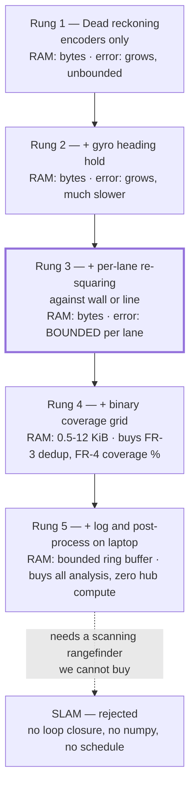

# Hub Compute Limits — what the SPIKE Prime actually has, and whether SLAM fits in it

**Type:** EXTERNAL research · **Created:** 2026-08-26 · **Status:** open — **no hardware was available.**
Every figure is either quoted from a source that was actually fetched, or arithmetic over a quoted figure
and labelled as such. Nothing here was measured on our hub.
**Answers:** *"what are the hardware resources on the SPIKE Prime?"* and *"is SLAM feasible?"*
**Governs:** `SAMPLE_RATE_HZ` in [../../src/config.py](../../src/config.py), the sample budget in
[../plans/telemetry-and-analysis.md](../plans/telemetry-and-analysis.md), and the localization rung the
sweep is built on ([../plans/2026-08-25-coverage-strategy-trade-study.md](../plans/2026-08-25-coverage-strategy-trade-study.md)).

---

## Summary — and the SLAM verdict

**SLAM is rejected. The operator's instinct is right, but the usual reason given for it is wrong, and the
Intro Report should not use the wrong reason.**

"The hub is too small" is *not* the argument. A 20-landmark EKF-SLAM covariance matrix is **7.2 KiB** in a
packed float array — it fits in this hub's heap several times over (§4.1). Memory is not what kills it.

What kills it, in order of how hard each one is to argue with:

> **⚠ CORRECTED 2026-08-26 — the order of these arguments has changed, and one of them was factually
> wrong.** This section originally led with "the sensor suite cannot scan", and called the 45604 a
> *time-of-flight* beam. **It is ultrasonic** — LEGO's own product page: *"Sound wave sensor features
> 1-200cm range"* — and the "cannot scan" argument is **answerable**: spinning the robot turns a fixed
> beam into a scanner for free, which is how early low-cost 2D lidars work. The argument that actually
> holds is what was formerly #2. Full assessment:
> [./spin-scan-localization.md](./spin-scan-localization.md).

1. **The mission does not have the problem SLAM solves.** The arena is a known, bounded, empty rectangle
   ([../scope.md](../scope.md)) — there is **nothing to map**. Localizing in a known rectangle estimates
   *five scalars* (two side lengths, x, y, heading), not a map: no covariance matrix, no landmark
   database, and it fits this hub easily. **This argument cannot be answered by better hardware**, which
   is exactly why it now leads.
2. **The scan, if you take one, has almost nothing in it.** The 45604 is **ultrasonic** with a **±35°
   entrance angle** — a ~70° cone, giving roughly **5 independent bearing cells per revolution**, and a
   hard **2000 mm** ceiling. Spinning is free and works; it just does not produce a point cloud, and no
   amount of sampling buys resolution the beam does not have. A blank rectangle offers no re-identifiable
   landmark to close a loop against anyway.
3. **The mission does not have the problem SLAM solves.** The arena is a known, bounded, empty square
   ([../scope.md](../scope.md)) — nothing to map. What we need is *bounded pose error over a sweep
   that runs 8–23 minutes if "10×10" turns out to be metres-scale*
   ([../findings/coverage-time-budget.md](../findings/coverage-time-budget.md)): a localization
   problem, solved by a wall or a boundary line (§5, rung 3).
3. **Interpreted float compute is probably short — but the recomputed range runs from "fits a 10 Hz loop
   with margin" to "~400× short"** for the EKF and particle families (§4.1–4.2). This reason *does* depend
   on the hub and carries by far the widest error bar: **nobody has measured this hub's Python loop rate**
   (§3.2), and at the generous corner it is not a rejection at all. **Do not lead the report with this reason and do
   not quote an order-of-magnitude figure for it until D-2 (§7) is run.**
4. **Two weeks.** Demo Day is 10 SEP. The hub has never been connected.

**What replaces it:** gyro heading hold plus per-lane re-squaring against a physical reference, with a
coarse binary coverage grid as a near-free add-on (§5, rung 3 + rung 4). Costs under 2 KiB of RAM at 25–50 mm grid cells (§4.4) and a
handful of integer operations per loop. Buys *bounded* cross-track error instead of error that grows with
lane count — which is the number `CROSS_TRACK_ERROR_MM` stands for, and the multiplier on the whole
coverage-time budget.

**One thing this changes in the code today:** `SAMPLE_RATE_HZ = 100.0` in
[../../src/config.py](../../src/config.py) is the **colour sensor's** rate off LEGO's fact sheet — now
sourced, previously bare "UNVERIFIED". It is **not** the rate a Python loop achieves, and the two must not
be one constant (§3.1).

---

## 1. The silicon

### 1.1 What LEGO itself publishes

LEGO's own fact sheet for the Technic Large Hub 45601 states, verbatim, under **System**:

```
• The Hub is powered by a 100MHz M4 320 KB RAM 1M FLASH processor
• 32 MB of memory for programs, sound, and content
• Embedded MicroPython operating system
  • Provides an open platform for advanced users and third-parties
```

and under **Input/output ports**: `115 kB port speed (ports E and F are prepared for "high-speed")`.
This is a primary source — LEGO Education, *SPIKE Prime Technical Specifications, Technic Large Hub*
(§Sources). It does **not** name the part number.

### 1.2 What the teardowns add — the part number is community-sourced, not LEGO-sourced

| Item | Value | Source |
|---|---|---|
| MCU | **STM32F413** (identified over USB as `LEGO Technic Large Hub with STM32F413xx`) | gpdaniels/spike-prime; bigl.es |
| Core | Arm Cortex-M4, 100 MHz | LEGO fact sheet + ST |
| **FPU** | **Single-precision hardware FPU**, plus the full DSP instruction set and an MPU | ST STM32F413 product line |
| Flash (internal) | 1 MB (line goes to 1.5 MB; LEGO says 1M) | LEGO fact sheet; ST |
| SRAM | **320 KB** | LEGO fact sheet; ST |
| External flash | **32 MB**, Winbond W25Q256JV | gpdaniels/spike-prime |
| IMU | **LSM6DS3TR** — 3-axis accel + 3-axis gyro in one part | gpdaniels/spike-prime |
| Bluetooth | TI CC2564C (BT Classic 4.2 + BLE 4.2) | gpdaniels; LEGO fact sheet |
| Matrix / motor drivers | TI TLC5955; 3 × LB1836 for 6 outputs | gpdaniels/spike-prime |
| Performance | 125 DMIPS / 339 CoreMark from flash at 100 MHz, 0 wait states | ST |

**The FPU is single-precision only** — doubles are a software library. **No FCC filing was located**
(not searched to exhaustion; a gap, not an absence).

### 1.3 The number that actually matters: heap left for a user program

320 KB of SRAM is the chip, not what your program gets — the MicroPython runtime, Bluetooth stack, LPF2
drivers, sound buffers, display driver and the interpreter's own C stack are all in it first. The only
concrete figure found is **Pybricks' documentation**, showing `micropython.mem_info()` labelled
**SPIKE Prime Hub**:

```
stack: 372 out of 40184
GC: total: 258048, used: 352, free: 257696
No. of 1-blocks: 4, 2-blocks: 2, max blk sz: 8, max free sz: 16103
```

**~39 KiB** interpreter C stack · **~252 KiB** GC heap — the whole budget for every Python object ·
**~251 KiB free** at that instant because nothing was allocated yet · `max free sz: 16103` blocks is the
largest *contiguous* run, and fragmentation rather than total free is what a big allocation actually hits.

**⚠ This figure is Pybricks, not us.** Pybricks is permanently excluded here
([ADR-0001](../decisions/0001-stock-lego-firmware-only.md)) and is a *lean* firmware written to leave the
user the maximum heap. Stock LEGO Hub OS additionally carries `hub_runtime.mpy`, the SPIKE app streaming
protocol, the sound engine and the slot manager in the same heap. **The stock free heap is therefore
expected to be lower and it is UNMEASURED.** Treat **≈250 KiB as an optimistic ceiling**, plan with
margin, and measure it (§7, D-1) as the second thing typed at the REPL after the version string. Note that
the REPL figure is the *pre-program* heap; the number a mission program actually gets is the second half of
D-1, and needs a program in a slot.

---

## 2. What MicroPython on this hub is

### 2.1 The module set

`help('modules')` on a SPIKE Prime hub (Prime Lessons, *MicroPython on SPIKE Prime*, deck dated
2020 — therefore **SPIKE 2 / early Hub OS**, see the API-generation warning in
[./spike-prime-linux-toolchain.md](./spike-prime-linux-toolchain.md)) returns:

```
__main__     heapq        struct       umachine
_onewire     hub          sys          uos
array        io           time         urandom
binascii     json         ubinascii    ure
builtins     machine      ucollections uselect
cmath        math         uctypes      ustruct
collections  micropython  uerrno       utime
errno        os           uhashlib     utimeq
firmware     random       uheapq       uzlib
gc           re           uio          zlib
hashlib      select       ujson
Plus any modules on the filesystem
```

**Present and useful to us:** `array` (packed numeric arrays — the difference between 7 KiB and 37 KiB in
§4.1) · `struct`/`ustruct` (binary log packing) · `gc` · `micropython` (`mem_info()`, `const()`) ·
`utime` (`ticks_ms/us`, `ticks_diff`) · `math`, `cmath` · `ucollections` (`deque` ring buffer).

**Notably absent — and these are the ones people assume:**

| Missing | Consequence |
|---|---|
| **`numpy` / `ulab`** | No vectorized linear algebra — every matrix operation is an interpreted Python loop. The single largest fact in the SLAM verdict. |
| **`_thread`** | No pre-emptive threads. SPIKE 3's `runloop` is *cooperative*: a coroutine that does not `await` blocks everything. SPIKE 2 has neither. |
| **`decimal`, `fractions`, `statistics`** | Roll your own, in integers where possible. |

**UNVERIFIED for SPIKE 3.** The dump is SPIKE 2-era. Hub OS 3 replaces the top-level API (`import motor` /
`from hub import port` / `import runloop`, per Tufts CEEO); the underlying MicroPython module set is
*probably* similar but no source re-dumped it. Re-run `help('modules')` during hub identification
([../runbooks/hub-identification.md](../runbooks/hub-identification.md)) and paste it verbatim.

### 2.2 Floats are slow, and LEGO says so

Tufts CEEO's SPIKE 3 documentation states plainly:

> "Decimals use the unoptimized `float` type, so the SPIKE Prime modules avoid this data type."

That is why the LEGO API takes **milliseconds** and **integer degrees** rather than seconds and radians.
The Cortex-M4's FPU exists, but a MicroPython float is a *heap-allocated boxed object* — every arithmetic
result allocates, and allocation eventually triggers GC. Interpreter overhead swamps the FPU.

**Actionable for our code:** [../../src/config.py](../../src/config.py) uses floats throughout
(`ARENA_WIDTH_MM = 1000.0`, `TRAVERSE_SPEED_MMS = 150.0`) — correct and harmless for the *pure* host-side
modules. Anything landing **inside the per-sample loop on the hub** should be integer millimetres /
millidegrees, converted once at the boundary in [../../src/hub_*.py](../../src/hub_api.py).

### 2.3 What a MemoryError looks like in practice

Two distinct failures, and they are usually confused:

1. **Allocation failure at run time.** `MemoryError: memory allocation failed, allocating N bytes` — often
   raised while `gc.mem_free()` still reports plenty, because the heap is *fragmented* and no contiguous
   run of N bytes exists (`max free sz`, §1.3). Growing a list by `append` in a loop is the classic cause.
2. **Failure at import/compile time.** The hub compiles `.py` to bytecode *in the same heap*: source text,
   parse tree and bytecode are all resident at once. On some ports the message is truncated or absent, so
   it presents as the hub "just not starting".

**Defences, cheapest first:** pre-allocate (`bytearray(n)`, `array('f', [0]*n)`) instead of appending ·
reuse one buffer · `gc.collect()` at a safe point, never inside the control loop · no large literal tables.

---

## 3. The loop rate — the load-bearing unknown

### 3.1 Three different rates, currently conflated

| Rate | What it is | Value | Status |
|---|---|---|---|
| **Sensor sample rate** | How fast the Colour Sensor 45605 samples internally | **100 Hz** | **Sourced** — LEGO *Technic Colour Sensor* fact sheet, verbatim: `Sensor sample rate  100 Hz` |
| **Port/wire rate** | LPF2 UART link | `115 kB port speed`; 115200 baud after handshake | Sourced (LEGO; pybricks/technical-info) |
| **Python loop rate** | Iterations/s a `while` loop achieves *including* the sensor call | **UNKNOWN** | **No source found has measured it on stock firmware** |

`SAMPLE_RATE_HZ = 100.0` in [../../src/config.py](../../src/config.py) is row 1. Every consumer of it —
`samples_per_target()`, the event-width gate in [../../src/detector.py](../../src/detector.py), the
traverse ceiling in [./color-discrimination.md](./color-discrimination.md) §5.2 — needs row 3.
**They are not the same number, and row 3 can only be smaller.**

### 3.2 What can honestly be said about row 3

Nothing precise. The only transferable datapoint found is a MicroPython Mandelbrot benchmark across many
boards (scruss, Jan 2025) in which an **STM32F411CE at 96 MHz took 21.4 s** — the closest available proxy
for our STM32F413 at 100 MHz: same core, same single-precision float build. The benchmark source
(gist, fetched) is 128 × 64 pixels at `maxit = 120`, so **983,040 is the *maximum* inner iteration count**
and the real count is lower because most pixels escape early. 983,040 ÷ 21.4 s is therefore an upper bound
of **4.6 × 10⁴ inner iterations/s**; at roughly 7 float operations per iteration that is a hard ceiling of
**≈3 × 10⁵ float ops/s**, with the true figure below it. Working band: **10⁴–10⁵ float ops/s, ceiling near
3 × 10⁵** — order of magnitude and no tighter. Two things it does *not* capture: the 21.4 s also includes
the benchmark's I²C display writes and its `valmap()` calls, which are not float arithmetic; and it says
nothing about the cost of an LPF2 read, which may well dominate. Per the operator's standing
guidance that is where the modelling stops: **the deliverable is D-2 in §7, not a better estimate.**

### 3.3 What will make it slower than a bare loop

The LPF2 round trip per `color_sensor.rgbi()` (unknown — possibly cached, possibly blocking) · SPIKE 3
`runloop` is cooperative, so a coroutine loop yields to every other scheduled task and is slower than
`while True:` by an unmeasured amount · motors under closed-loop control do periodic work in the same
runtime · GC pauses proportional to live-object count · Bluetooth, if left on.

### 3.4 Why this bounds the mission

The classification speed ceiling is `v_max = rate × (chord − D_spot) / N_pure` — the formula from
[./color-discrimination.md](./color-discrimination.md) § 5.2, **including the `− D_spot` term**, because
the spot must be *entirely inside* the note to give a pure sample. With the worst guaranteed chord
**31.5 mm** and `D_spot` ≈ 12 mm from
[../plans/2026-08-25-coverage-strategy-trade-study.md](../plans/2026-08-25-coverage-strategy-trade-study.md)
§ 7.1, and with the *loop* rate (row 3) substituted for `f` rather than the sensor rate (row 1):

| Loop rate | `v_max`, `N_pure` = 5 | `v_max`, `N_pure` = 10 |
|---|---|---|
| **100 Hz** — the sensor's rate, an upper bound the loop cannot beat | 390 mm/s | 195 mm/s |
| **50 Hz** | 195 mm/s | 98 mm/s |
| **25 Hz** | 98 mm/s | 49 mm/s |

The 100 Hz row reproduces the trade study's § 7.1 figures exactly, as it must. **At 50 Hz the 300 mm/s that
the 3-sensor option back-solves for is already unreachable; at 25 Hz so is the 150 mm/s standing in
[../../src/config.py](../../src/config.py).** That is a design consequence, not a tuning consequence, which
is why D-2 is the highest-value ten minutes of the first hub session.

---

## 4. SLAM families vs this hub

Notation: `N` = landmarks, `M` = particles, `d = 3 + 2N` = EKF state dimension (2-D pose + 2-D point
landmarks). Memory assumes MicroPython `array('f')` at **4 bytes** per element; a naive list-of-lists costs
roughly **5×** that, because every float is a boxed heap object with a pointer to it.

### 4.1 EKF-SLAM

**Memory:** state `d` floats, covariance `d²` floats.

| N | d | Covariance entries | `array('f')` | list-of-lists (approx.) |
|---|---|---|---|---|
| 10 | 23 | 529 | **2.1 KiB** | ~10 KiB |
| 20 | 43 | 1,849 | **7.2 KiB** | ~36 KiB |
| 50 | 103 | 10,609 | **41 KiB** | ~200 KiB — at the edge |

**Memory is not the problem below ~50 landmarks.** Say so plainly in the report — rejecting EKF-SLAM
"because 320 KB isn't enough" is not defensible and a reviewer will catch it.

**Compute is worse — but by how much depends on how the update is written, and the honest range is wide
enough that it must not be quoted as a single figure.** Two bracketing implementations, at N=20 (d=43):

| Per-observation covariance update | Multiply-accumulates |
|---|---|
| Sparse-aware standard form — `K` is `d×2` and `H` is `2×d`, so `Σ ← (I − KH)Σ` is a rank-2 update: ≈4·d² | **≈7,400** |
| Naive dense form — materialise `(I − KH)` and multiply it by `Σ`: d³ | **≈79,500** |

Against §3.2's band (10⁴ ops/s at the low end, the ≈3 × 10⁵ ceiling at the high end) that is **≈0.025 s to
≈8 s per update**, where a useful rate of 10–50 Hz allows 0.02–0.1 s per update. So the corners are:
**sparse form at the ceiling rate fits a 10 Hz loop with ~4× margin**, and **dense form at 10⁴ ops/s is
~400× short of a 50 Hz loop**. Anywhere from *comfortable* to two-and-a-half orders short, depending on two
things nobody here has pinned down.

Two corrections to the argument people reach for, both of which a reviewer will catch:

- **It is not "two to three orders of magnitude", and the generous corner is not a rejection at all.**
- **`numpy` changes the constant, not the exponent.** The d³ row above comes from writing the update
  naively; its absence multiplies the cost *per operation* and does not raise the order. Saying "O(d³)
  because there is no `numpy`" is wrong.

**Consequently the compute verdict does not survive the unmeasured loop rate**, contrary to what is
convenient to claim. D-2 (§7) is what would settle it.

**Verdict: NO — on §4.5, not on this.** Memory is not the reason, and compute is not a *safe* reason.
§4.5 is the one that holds without a single measurement.

### 4.2 Particle filter / FastSLAM

**Memory:** `M × (3 + N × 6)` floats — per particle, a pose plus a 2-vector mean and 2×2 covariance per
landmark. M=100, N=20 → 12,300 floats → **48 KiB** packed. Fits.

**Compute:** each particle carries `N` *independent* 2×2 landmark filters, so per-particle work is O(N),
not the EKF's O(d²) — total ≈ M·N against the EKF's ≈ d². At M=100, N=20 that is roughly **5× the EKF's
per-step arithmetic, not 100×**; being cheaper per landmark is the whole point of factoring the map.
Arithmetic alone would not reject it. **What does** is a platform-specific pathology: resampling
**copies the map of every surviving particle, every step** — thousands of allocations per second into a
250 KiB fragmenting heap. The realistic failure is not "too
slow" but **`MemoryError` mid-run** (§2.3), which on Demo Day looks like the robot stopping dead.
FastSLAM's O(M log N) advantage needs an efficient tree-structured map, which here would itself be
interpreted Python — giving the win straight back.

**Verdict: NO** — on heap fragmentation and allocation churn, which is a *harder* failure than being slow,
not on raw arithmetic, where it is cheaper than §4.1.

### 4.3 Graph-based / pose-graph SLAM

Needs the full trajectory in memory (unbounded growth over a 2–20 minute run), a sparse Jacobian, and a
sparse Cholesky or QR solve. **There is no sparse linear algebra on this hub and no library to import**
(§2.1), and writing one in two weeks on a hub that has never been connected is not a schedule that exists.

**Verdict: NO on the hub** — but note the useful half: pose-graph optimization *offline on the laptop* over
a logged trajectory is entirely feasible, and is §5 rung 5. That is the route to a rigorous statement about
odometry error in the report.

### 4.4 Occupancy grids

Not SLAM by itself — the *map* half, needing a pose from somewhere. Sized for a **10 ft** (3048 mm) square
arena, the worst case in [../findings/coverage-time-budget.md](../findings/coverage-time-budget.md):

| Cell | Grid | Binary, 1 bit/cell (packed `bytearray`) | 1 byte/cell | float32 log-odds |
|---|---|---|---|---|
| 50 mm | 61 × 61 = 3,721 | **466 B** | 3.6 KiB | 14.5 KiB |
| 25 mm | 122 × 122 = 14,884 | **1.8 KiB** | 14.5 KiB | 58 KiB |
| 10 mm | 305 × 305 = 93,025 | **11.4 KiB** | 91 KiB | **363 KiB — does not fit** |

**A binary coverage grid is essentially free at any resolution we care about.** A float log-odds grid at
fine resolution is the one structure in this whole section that genuinely does not fit.

**The catch, and it is the whole catch:** *a grid is only as good as the pose that indexes it.* With no
exteroceptive localization, cells are written at drifting coordinates and the map degrades exactly as fast
as the odometry. A grid is **bookkeeping, not mapping** — still worth having (§5 rung 4).

**Verdict: YES as a coverage record, NO as a map.**

### 4.5 The reason that outranks all of the above

Every family in §4.1–§4.4 assumes an exteroceptive sensor that measures *range and bearing to a
re-identifiable feature*. We have:

- **Colour Sensor 45605** — one downward point, optimal reading distance 16 mm (LEGO fact sheet), spot
  ~12 mm. It sees floor under the robot; it cannot see a landmark at 1 m.
- **Distance Sensor 45604** — **ultrasonic** (LEGO: *"Sound wave sensor… 1-200cm range"*), one fixed
  axis, ±35° entrance angle, 2000 mm ceiling. **Not a scanning LiDAR — but it can be spun.** Doing so is
  free (the robot already turns) and yields ~5 bearing cells per revolution, not a point cloud:
  [./spin-scan-localization.md](./spin-scan-localization.md).
- **IMU + encoders** — proprioceptive. They measure *motion*, not the world: they are the odometry SLAM is
  meant to correct, not the correction.

**SLAM without loop closure is dead reckoning with a covariance matrix attached.** Sweeping a Distance
Sensor on a motor to synthesize a scanning rangefinder is a real technique — and would spend a motor, a
sensor, most of the remaining 56 SB and the schedule, to solve a problem the arena does not pose.

### 4.6 State this in the report as a considered rejection

> SLAM was evaluated and rejected. The decisive reason is that the mission does not pose the problem SLAM
> solves: the arena is a known, bounded, empty rectangle, so localizing within it estimates five scalars
> rather than building a map. A secondary reason is sensory: the ultrasonic distance sensor's ±35°
> entrance angle yields roughly five bearing cells per revolution even when the robot is spun to scan, and
> a blank rectangle presents no re-identifiable landmark for loop closure. The mission
> — exhaustive coverage of a known, bounded, empty rectangle — is a localization problem, not a mapping
> problem, and is addressed by gyro heading hold with per-lane re-squaring against a physical boundary
> reference. Platform limits reinforce but do not carry the decision: memory is *not* a barrier (a
> 20-landmark EKF covariance is 7.2 KiB against roughly 250 KiB of MicroPython heap), while interpreted
> arithmetic without a vectorized numerics library is estimated to leave the covariance update between
> marginal and roughly two orders of magnitude short of a 10–50 Hz rate — an estimate whose error bar is
> wide because the hub's achievable Python loop rate has not been measured. Particle-filter variants add
> per-step map copying into a fragmenting heap; graph SLAM has no sparse linear-algebra support on the
> platform.

---

## 5. What IS feasible, in ascending order of ambition



| Rung | RAM | Per-loop cost | What it buys | What it needs |
|---|---|---|---|---|
| **1. Dead reckoning** | ~tens of bytes (two encoder counts, a pose) | 2 encoder reads + ~10 integer ops | Lane counting; a pose good enough for a *count* (FR-3) | Nothing. Already possible with what we own |
| **2. + gyro heading hold** | negligible | 1 IMU read + a P or PI correction, integer | The largest error reduction per unit of effort in the whole ladder. Heading error is what becomes cross-track error at 21 mm per degree per 1.2 m lane ([../findings/coverage-time-budget.md](../findings/coverage-time-budget.md)) | Nothing to buy — the IMU is in the hub. Needs KU-M9 (drift, turn repeatability) |
| **3. + per-lane re-squaring** | negligible | one alignment action per lane turn (~1–3 s) | **Converts error that accumulates over N lanes into error bounded per lane.** This is the rung that changes the coverage-time budget, because it lets `CROSS_TRACK_ERROR_MM` stop growing | A reference to square against — **blocked on KU-P3** (boundary type). Wall → Distance Sensor 45604. Tape/colour border → a second colour channel. Nothing → not available, fall back to rung 2 |
| **4. + binary coverage grid** | **466 B** at 50 mm cells over a 10 ft arena (§4.4) | 1 index computation + 1 bit set per sample | Coverage % for FR-4; per-cell dedup for FR-3 (a note already counted in this cell is not re-counted on a second pass). Nearly free | Nothing. Pure Python over a `bytearray` |
| **5. + log and post-process** | bounded ring buffer (§6.2) | 1 `struct.pack_into` per sample | Every analysis the report needs, computed on the laptop where `numpy` exists. Turns Demo Day into data | The sample-budget discipline in §6.2 and [../plans/telemetry-and-analysis.md](../plans/telemetry-and-analysis.md) |

### Recommendation

**Build rung 2 now; target rung 3; take rung 4 because it costs 466 bytes; keep rung 5 running throughout.**

**Rung 2 is unconditional** — no purchase, no answer from the professor, and the highest-value control
feature available; nothing later works without it. **Rung 3 is the goal and is gated on one question, not
on engineering:** KU-P3 (what bounds the arena) decides whether there is anything to square against, and it
is Q3 in [../plans/questions-for-the-professor.md](../plans/questions-for-the-professor.md). **This document
is a reason to ask Q3 early**, because the answer decides a sensor purchase out of 56 SB. **Rung 4** costs
less RAM than a paragraph of this file costs disk and answers "did we cover the arena?" with a number
instead of an assertion. **Rung 5** is how the Intro Report gets a results section.

**To move above rung 3** you would need a sensor measuring range *and* bearing to a re-identifiable
feature at 10+ Hz, within budget. Nothing in the course store does that. **That is the end of the ladder
for this project**, and the report should say so in those words.

---

## 6. Program size and complexity — the practical ceiling

### 6.1 Storage is not the constraint

32 MB external flash, **20 program slots numbered 0–19** (LEGO's own glossary, quoted in
[./spike-prime-linux-toolchain.md](./spike-prime-linux-toolchain.md) § *Program storage and slots*). Our
entire `src/` is **945 lines across 7 files** (verified with `wc -l src/*.py`), of which only
[../../src/hub_*.py](../../src/hub_api.py) (220 lines) ships to the hub in the current design. Slot storage will never bind this project.

### 6.2 RAM at compile time is the constraint

The limit is §2.3 failure mode 2: source text, parse tree, bytecode and the LEGO runtime coexist in one
heap. **No hard byte limit is published and none was found** — it is soft, and depends on how much of the
~250 KiB (optimistic; §1.3) the runtime already took.

**What actually blows it, in our project, most likely first:**

1. **Per-sample logging into a growing list.** This is the real one. Note that the cited budget's
   **8 minutes is its *best* case** (10 ft at 250 mm/s on an optimistic 76 mm lane pitch); its **realistic**
   case is **14–23 minutes** ([../findings/coverage-time-budget.md](../findings/coverage-time-budget.md)).
   At 16 bytes per sample:

   | Log rate | 8 min (best case) | 14 min | 23 min |
   |---|---|---|---|
   | 100 Hz | **750 KiB** | **1.28 MiB** | **2.11 MiB** |
   | 10 Hz | 75 KiB | **131 KiB** | **216 KiB** |
   | 2 Hz | 15 KiB | 26 KiB | 43 KiB |

   Against the ≈250 KiB *optimistic* heap of §1.3 — which the LEGO runtime has already eaten into by an
   unmeasured amount — **100 Hz never fits**, and **10 Hz fits only the best case**: at a realistic run
   length it is most of the heap, in a structure that grows by `append`.
   **Therefore:** rung 5 must log *events* (detections, lane transitions, re-square corrections) plus a
   *downsampled* raw stream into a **pre-allocated fixed-size `bytearray` ring buffer**, never a list that
   grows. This is a concrete constraint on
   [../plans/telemetry-and-analysis.md](../plans/telemetry-and-analysis.md) and it is new.
2. **A float log-odds occupancy grid at fine resolution** — 363 KiB at 10 mm cells (§4.4). Use bits.
3. Large literal tables in source (colour reference, calibration lookup). Compute or pack them.
4. Long module-level docstrings *on the hub-side file* — keep the downloaded file lean if a MemoryError
   ever appears; the repo copy stays as documented as it is.

### 6.3 When it does not fit

Symptom: `MemoryError: memory allocation failed, allocating N bytes` at download or first run, sometimes
truncated, sometimes just a program that refuses to start. Remedies in order: pre-allocate rather than
append · `gc.collect()` before entering the run loop · split into a main file plus imported modules ·
`micropython.const()` for constants · last, pre-compile to `.mpy`.

**`.mpy` is UNVERIFIED on stock LEGO firmware.** The hub filesystem contains `hub_runtime.mpy`, so the
firmware clearly *can* load `.mpy` — but whether a user can place one in a slot and have the SPIKE app
run it has not been demonstrated by any source found, and doing so touches the hub filesystem, which is
adjacent to [../directives/hardware-safety.md](../directives/hardware-safety.md) territory. **Do not try
this without the operator.** It is a last resort we are very unlikely to need at 945 lines.

---

## 7. What must be measured on the real hub

**Read the split before scheduling these.** Only the REPL half of D-1 and all of D-3 are read-only
expressions of the kind [../runbooks/hub-identification.md](../runbooks/hub-identification.md) permits —
that runbook writes *nothing* to the hub and must stay that way. **D-2, D-4, D-5, D-6 and the second half
of D-1 require a program uploaded into a slot**, which writes to the hub filesystem. That is normal
development, not a firmware change and not a Hub OS update — but it is not "read-only", it happens *after*
identification succeeds, and it is the Builder's action per
[../directives/course-compliance.md](../directives/course-compliance.md). All are cheap.

| ID | Measurement | How | Consumer | Register row |
|---|---|---|---|---|
| **D-1** | **Free heap under stock firmware** | `from micropython import mem_info; mem_info()` at the REPL, then again from inside a running downloaded program. **Record both, verbatim.** The second is the real budget | Every RAM number in §4 and §6 | *proposed new row* |
| **D-2** | **Achievable Python loop rate** | Three separate timings with `utime.ticks_us`/`ticks_diff` over 1000 iterations: (a) bare `while` loop, no I/O; (b) loop + one colour sensor read; (c) loop + sensor read **with both drive motors running** — robot up on a block so the wheels spin free, per [../directives/hardware-safety.md](../directives/hardware-safety.md). (b)−(a) is the sensor cost; (c)−(b) is the motor-control tax | `SAMPLE_RATE_HZ`, the sweep speed ceiling, the whole trade study | **KU-M5** — extend it: it currently asks only for the sensor rate |
| **D-3** | **`help('modules')` on our actual Hub OS** | One line at the REPL. Paste verbatim | Confirms/refutes §2.1 for SPIKE 3 | **KU-M1** (add as sub-item) |
| **D-4** | **Float vs integer arithmetic cost** | Time 10,000 `a*b+c` in floats, then in ints | Decides whether §2.2's integer discipline is worth the code churn | *proposed new row* |
| **D-5** | **GC pause length** | Allocate the structures the mission actually holds — one `bytearray(4096)` ring buffer, one `array('f')` of the calibration references, the pose tuple — then `t=ticks_us(); gc.collect(); print(ticks_diff(ticks_us(),t))`, ten times, and record all ten. Compare against the ~1–3 s of a lane turn | Whether a collect can be hidden in a lane turn | *proposed new row* |
| **D-6** | **`runloop` overhead** (SPIKE 3 only) | Compare a bare `while` loop against the same loop inside a `runloop` coroutine | Whether the mission loop should use `runloop` at all | *proposed new row* |

D-1 and D-2 together take under ten minutes and retire more `[ASSUMED]` numbers than any other ten minutes
available to this project. **D-1's REPL half and D-3 are the next two lines typed after the version
string**; D-2 is the first thing to run once a program can be put in a slot at all — which makes it the
natural payload of the very first upload, since it is also the smallest possible program that proves the
upload path works. *(Rows marked "proposed" are for whoever owns
[../plans/known-unknowns.md](../plans/known-unknowns.md); this document does not write to it.)*

---

## 8. Open questions

- **Q-A.** How much heap does stock LEGO Hub OS actually leave a user program? The only public figure is
  Pybricks' (§1.3) and it is for firmware we are not running. **D-1.**
- **Q-B.** What loop rate does a stock-firmware Python loop achieve with one sensor read? **No source
  anywhere reports this.** **D-2.** This is the largest unmeasured multiplier in the project.
- **Q-C.** Is the SPIKE 3 MicroPython module set the same as the SPIKE 2 dump in §2.1? **D-3.**
- **Q-D.** Does the LPF2 read block, and for how long? If a colour-sensor read blocks for ~10 ms, the loop
  rate is pinned at ~100 Hz *regardless* of interpreter speed, and §3.4's worry evaporates. If it returns a
  cached value instantly, interpreter speed is the limit. **D-2 (b)−(a) answers this.**
- **Q-E.** Does the colour sensor expose raw RGB at the full 100 Hz, or is LEGO-colour classification mode
  slower? Bears on [./color-discrimination.md](./color-discrimination.md).
- **Q-F.** Can a user-placed `.mpy` run from a slot on stock firmware (§6.3)? **Operator decision first.**
- **Q-G.** Is there an FCC filing for the 45601 with internal photos? Not located; would confirm §1.2
  independently of community teardowns.

---

## Sources

**Primary — LEGO**

- LEGO Education, *SPIKE Prime Technical Specifications — Technic Large Hub* (PDF, fetched + text-extracted; source of `100MHz M4 320 KB RAM 1M FLASH`, `32 MB of memory for programs, sound, and content`, `115 kB port speed`) — https://assets.education.lego.com/v3/assets/blt293eea581807678a/bltf512a371e82f6420/5f8801baf4f4cf0fa39d2feb/techspecs_techniclargehub.pdf
- LEGO Education, *SPIKE Prime Technical Specifications — Technic Colour Sensor* (PDF, fetched + text-extracted; source of **`Sensor sample rate  100 Hz`**, `Optimal reading distance: 16 mm`, the eight LEGO colour RGB triples) — https://assets.education.lego.com/v3/assets/blt293eea581807678a/blt62a78c227edef070/5f8801b9a302dc0d859a732b/techspecs_techniccolorsensor.pdf
- STMicroelectronics, STM32F413/423 product line (Cortex-M4, **single-precision FPU**, full DSP set, MPU, 100 MHz, up to 1.5 MB flash, **320 KB SRAM**, 125 DMIPS / 339 CoreMark) — https://www.st.com/en/microcontrollers-microprocessors/stm32f413-423.html

**Teardown / reverse-engineering (community, specific and mutually consistent)**

- gpdaniels/spike-prime, *Large Hub Hardware* — STM32F413, W25Q256JV 32 MB, CC2564C, **LSM6DS3TR**, TLC5955, 3× LB1836 — https://github.com/gpdaniels/spike-prime
- bigl.es, *Microcontroller Monday: Lego Spike Prime* — identifies as `LEGO Technic Large Hub with STM32F413xx`; `os.listdir()` showing `boot.py`, `main.py`, `hub_runtime.mpy`, `version.py` — https://bigl.es/microcontroller-monday-lego-spike-prime/

**MicroPython environment**

- Prime Lessons, *MicroPython on SPIKE Prime* (PDF, dated 1/17/2020 → **SPIKE 2 era**; the `help('modules')` dump in §2.1 and the `hub.` attribute list) — https://primelessons.org/en/ProgrammingLessons/MicroPythonIntro.pdf
- Pybricks docs, *micropython — MicroPython internals* — the `mem_info()` output labelled **"SPIKE Prime Hub"**: `stack: 372 out of 40184 / GC: total: 258048, used: 352, free: 257696 / max free sz: 16103`. **⚠ Pybricks firmware, not stock LEGO** — https://docs.pybricks.com/en/stable/micropython/micropython.html
- Tufts CEEO, *SPIKE Prime Python Documentation (SPIKE 3)* — SPIKE 3 module inventory; **"Decimals use the unoptimized `float` type, so the SPIKE Prime modules avoid this data type"** — https://tuftsceeo.github.io/SPIKEPythonDocs/SPIKE3.html
- pybricks/technical-info, *uart-protocol.md* — LPF2 handshake, 2400 → 115200 baud switch, NACK keepalive every 100 ms — https://github.com/pybricks/technical-info/blob/master/uart-protocol.md
- scruss, *MicroPython Benchmarks* (2025-01-21) — Mandelbrot benchmark, **STM32F411CE @ 96 MHz: 21.4 s** (page fetched; the blog does not name the workload, the gist header does: *"benchmark Mandelbrot set … on OLED"*). Benchmark source fetched and read: `WIDTH = 128`, `HEIGHT = 64`, `maxit = 120` → **983,040 maximum inner iterations**, the figure §3.2 divides by. Code at https://gist.github.com/scruss/c85cfd98dd8c6884b2ea6cb91bb6e658 — https://scruss.com/blog/2025/01/21/micropython-benchmarks/ · *order-of-magnitude bound only: transfer to STM32F413 @ 100 MHz is **UNVERIFIED**, the real iteration count is below the maximum, and the 21.4 s includes I²C display writes and `valmap()` calls that are not float arithmetic.*

**SLAM literature**

- Cyrill Stachniss, Univ. Freiburg, *Robot Mapping — EKF SLAM* (lecture deck, PDF, fetched + text-extracted).
  Source of `d = 3 + 2N` used throughout §4 — verbatim: *"Map with n landmarks: (3+2n)-dimensional
  Gaussian"* — and of the complexity framing: *"EKF SLAM Complexity · Cubic complexity depends only on the
  measurement dimensionality · Cost per step: dominated by the number of landmarks"*. Note that this is the
  slide that refutes the naive "O(d³) because no `numpy`" reading corrected in §4.1 —
  http://ais.informatik.uni-freiburg.de/teaching/ws13/mapping/pdf/slam05-ekf-slam.pdf
- Galceran & Carreras, *A survey on coverage path planning for robotics* — on disk at
  [./papers/galceran2013-coverage-path-planning-survey.txt](./papers/galceran2013-coverage-path-planning-survey.txt),
  for Choset's boustrophedon cellular decomposition: coverage of a known bounded region is a decomposition
  problem, not a SLAM problem.

`./scripts/rh-query.sh` returned the Stachniss deck plus a majority of off-topic hits for the
SLAM-complexity queries; a PythonRobotics *EKF SLAM* page was also returned by title but **its URL was not
resolved and it is not cited here**. The §4 complexity claims therefore rest on the Stachniss result plus
the arithmetic shown inline, not on a paper read end to end. Recorded as a retrieval limitation.

**Could NOT be fetched** — antonsmindstorms.com *Advanced undocumented Python in SPIKE Prime and MINDSTORMS
hubs* (HTTP 403; likely the best single source on stock-firmware internals — retry from a browser) ·
st.com part-level pages for STM32F413VG (repeated 60 s timeouts, so **the exact die suffix, and whether it
is the 1 MB or 1.5 MB part, is UNVERIFIED**; LEGO's fact sheet says 1M and that is what §1.1 quotes) ·
instructables.com *MicroPython on SPIKE Prime* (body did not render).

**Project documents extended, not restated:**
[./spike-prime-linux-toolchain.md](./spike-prime-linux-toolchain.md) ·
[./speed-envelope.md](./speed-envelope.md) · [./color-discrimination.md](./color-discrimination.md) ·
[./detection-and-sweep-techniques.md](./detection-and-sweep-techniques.md) ·
[./motion-control-and-odometry.md](./motion-control-and-odometry.md) ·
[../findings/coverage-time-budget.md](../findings/coverage-time-budget.md) ·
[../plans/telemetry-and-analysis.md](../plans/telemetry-and-analysis.md) ·
[../plans/bench-measurement-plan.md](../plans/bench-measurement-plan.md) ·
[../plans/known-unknowns.md](../plans/known-unknowns.md) (KU-M1, KU-M5, KU-M9, KU-P3) ·
[../plans/2026-08-25-coverage-strategy-trade-study.md](../plans/2026-08-25-coverage-strategy-trade-study.md) ·
[../decisions/0001-stock-lego-firmware-only.md](../decisions/0001-stock-lego-firmware-only.md) ·
[../runbooks/hub-identification.md](../runbooks/hub-identification.md) ·
[../../src/config.py](../../src/config.py) · [../../src/hub_*.py](../../src/hub_api.py)
