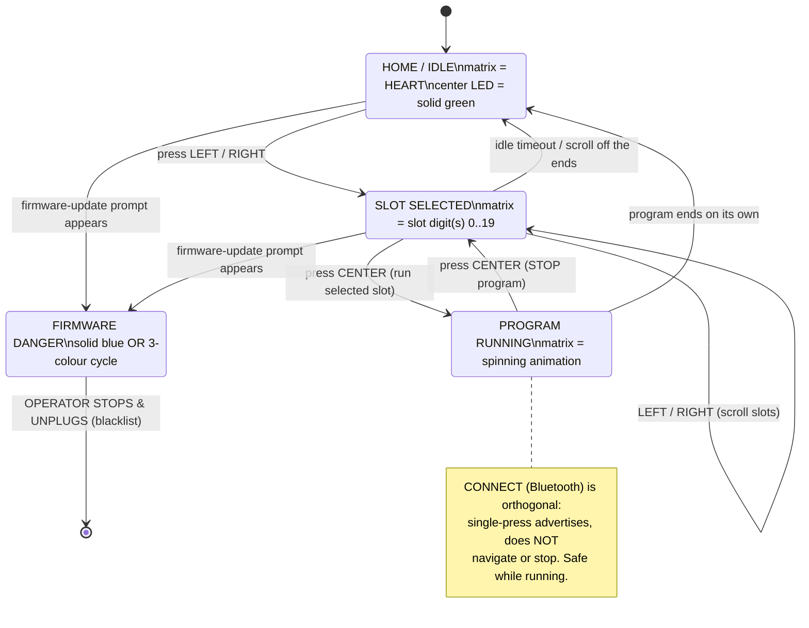

# Research — the Hub OS 3 on-brick menu, and launching a slot program from the buttons

**What this answers.** The competition START procedure. We upload a program to a slot over USB, unplug,
and the **Builder-operator** must start it from the hub itself — buttons and the 5×5 matrix only, no
computer. This document maps the Hub OS 3 menu states, the exact button gestures to select and run a
slot, the rule for the operator while a program runs, and the power-off hazard — and isolates the **one
open question that decides whether our START procedure is legal at all**: does a program we uploaded over
the control protocol appear in the on-brick menu and run from the buttons, or does menu-launch need the
LEGO app?

> ## STATUS: primary-source (LEGO Education support + LEGO/spike-prime-docs) + community, cross-checked against **what our own hub already showed**. The button-launch of OUR uploaded program is **[UNVERIFIED]** on our hardware.
>
> **What our hub confirmed 2026-09-03** (measured, do not contradict): the idle matrix shows a **HEART**;
> pressing **LEFT/RIGHT** changed the display to a **digit** ("0") — the menu navigates. `hub.button`
> exposes `LEFT RIGHT POWER CONNECT`; `button.pressed(b)` returns **milliseconds held, 0 when not
> pressed** ([spike3-api-reference.md](./spike3-api-reference.md) § buttons, `[MEASURED]`). A slot program
> uploaded as `program.py` and started over the wire **runs, drives motors, and keeps running ~45 s after
> USB is unplugged**. **Not yet shown on our hub:** starting that program *from the buttons* with no
> computer ever sending `ProgramFlow(Start)`. That is § 4 and the whole point of the bench test.
>
> Hardware was forbidden for this task — nothing here was run against the hub.
> Builds on: [slot-execution-and-live-motor-control-2026-09-03.md](./slot-execution-and-live-motor-control-2026-09-03.md) ·
> [program-upload-protocol.md](./program-upload-protocol.md) ·
> [spike3-api-reference.md](./spike3-api-reference.md).
> Governing rules: [../directives/hardware-safety.md](../directives/hardware-safety.md), and the
> **firmware blacklist** in [../../CLAUDE.md](../../CLAUDE.md) — which § 1 and § 5 touch directly.

---

## 0. Bottom line

| Question | Answer | Confidence |
|---|---|---|
| What does the **heart** mean? | Home / idle. The hub is on, no program running, ready to pick a slot. | **High** — LEGO tutorials + our hub |
| What do the **digits** mean? | The selected **slot number**. Hub OS 3 has **20 slots, 0–19**; two-digit slots (10–19) display as two digits (the matrix number mode shows −99…99). | **High** on the mechanism; **exact count on our hub [UNVERIFIED]** (older SPIKE-2 material says 5) |
| How do you **select** a slot? | Press **LEFT / RIGHT** to scroll to the slot number. | **High** |
| How do you **run** the selected slot? | Press the **CENTER button once** (this is `button.POWER` in the API — the big round button). A short chime/animation plays, then the program starts. | **High** |
| How do you **stop** a running program? | Press the **CENTER button** again. | **High** |
| What does **CONNECT** (Bluetooth) do? | Advertises for a BLE connection; it is **not** a run/menu key. Safe to single-press on a running hub. | **High** |
| Can the operator launch **OUR uploaded `program.py`** from the buttons? | **[UNVERIFIED] on our hub — but strong-INFERRED YES.** The SPIKE app downloads a program using the *identical* control-protocol sequence we use (`StartFileUpload "program.py"` → chunks → the slot now holds `program.py`); the hub cannot tell our upload from an app download, so slot N should list and run from the menu. One bench test settles it (§ 4). | **Inferred-high; unproven on hardware** |
| Biggest hazard | The CENTER button is also the **power button**: a **long hold powers off / restarts** the hub. A **solid-blue** or **three-colour-cycling** center button is the firmware-update danger zone — **STOP** (blacklist). | **High** |

---

## 1. Menu and display states

The Hub OS **firmware itself** drives this menu whenever **no program is running** — it is not something
our code renders. (Our `hub.button` / `hub.light_matrix` API only takes over *inside* a running program.)

**5×5 light-matrix states**

- **Heart** — home / idle. On our hub, boot settles to the heart; this is the "ready" screen.
  ([LEGO Education tips & tricks][legotips]; confirmed on our hub.)
- **A digit (or two digits)** — the currently selected **slot number**. LEFT/RIGHT change it. The number
  animation takes about **a second to clear before the program actually starts** after you press run —
  so a short pause after the button press is normal, not a hang. ([LEGO Education tips & tricks][legotips];
  two-digit numbers via the matrix number mode, −99…99, [Anton's Mindstorms][anton].)
- **Spinning / animated pattern** — a program is **running**. ([community light guides][ewb].)

**Center-button LED colours** (this is the ring around the big center button — read it *before* every run):

| Center LED | Meaning | Operator action |
|---|---|---|
| **Solid green** | Hub on, SPIKE-compatible Hub OS, battery ≥ 20% — healthy. | Normal. Proceed. |
| **Flashing orange** | Battery < 20%. | Charge before the run. |
| **Flashing red** | Program error, or thermal/extended load. | Restart or let it cool; do not run. |
| **White** | Hub OS not SPIKE-compatible. | Do not proceed. |
| **Solid blue** | "Needs a firmware update — connect to the SPIKE App." | **STOP. Do NOT connect the app or accept any update** (blacklist item 3). |
| **Flashing purple** | Firmware update in progress. | **STOP / unplug** — this must never be happening to us. |
| **Any three-colour cycle** (e.g. pink→green→blue→off) | DFU / "Hub OS updated, restart me" — indistinguishable by eye. | **STOP and unplug immediately** (blacklist item 2). |

Sources: [engineeringwithbricks light guide][ewb], [LEGO Education FAQ][legofaq]; the blacklist reading is
[../../CLAUDE.md](../../CLAUDE.md) and [ble-bring-up.md](./ble-bring-up.md).

**CONNECT (Bluetooth) button LED**: flashes blue while advertising, steady when a BLE central is
connected. Pressing CONNECT on an already-running hub is normal and safe — it just re-advertises
([../../CLAUDE.md](../../CLAUDE.md) blacklist item 2 parenthetical).

Menu-transition detail (idle timeout, whether empty slots are skipped or shown) is [UNVERIFIED] and does
not affect the procedure — the operator navigates to a **known** slot number. See § 6.

---

## 2. Button gestures — select and run

The physical **CENTER** button = `button.POWER` in the API (the big round button; **not** a separate key).
LEFT/RIGHT are the two small buttons flanking it. CONNECT is the Bluetooth button.
`button.pressed(b)` returns **milliseconds held** ([spike3-api-reference.md](./spike3-api-reference.md),
`[MEASURED]`) — which is why *duration* matters for the center button (§ 5).

| Goal | Gesture | Result |
|---|---|---|
| Wake / show the menu | Any button (LEFT/RIGHT) from the heart | Matrix shows a slot digit |
| Move to the **next** slot | Press **RIGHT** | Slot number increments |
| Move to the **previous** slot | Press **LEFT** | Slot number decrements |
| **RUN the selected slot** | **Single short press of CENTER** | ~1 s number animation, then the program runs (spinning animation) |
| **STOP the running program** | **Single press of CENTER** | Program halts, hub returns toward the menu |
| Advertise for Bluetooth | **Single press of CONNECT** | BT LED flashes blue; no effect on the running program |
| **Power off / restart** | **Long hold of CENTER** (~3 s restart; longer powers off) | ⚠ Ends any run — see § 5 |

**The competition START gesture, end to end** (assuming our program is in slot *S*):

1. Confirm center LED is **solid green** (§ 1). If blue/purple/cycling → STOP.
2. From the heart, press **RIGHT/LEFT** until the matrix shows **S**.
3. **Single short press of CENTER.**
4. Wait ~1 s for the number animation to clear; the spinning animation confirms the run started.
5. **Hands off all buttons** until the run is meant to end (§ 3).

Sources: [LEGO Education tips & tricks][legotips], [FLLCasts "navigating the hub menu"][fllcasts]
(fetch blocked by the host, but corroborated by the LEGO page and multiple community write-ups),
[ResearchParent "writing and managing programs"][rp], [Pybricks slot navigation][pyb].

---

## 3. Pressing a button while a program is running

**The CENTER button STOPS the running program.** Every source agrees: while a program runs, a center
press is the stop/abort ([LEGO Education FAQ][legofaq], [Pybricks primehub docs][pybhub]). The operator's
observation that "a button changed the display" is consistent with this — either menu navigation *before*
the run, or a center press stopping the run.

Whether LEFT/RIGHT/CONNECT do anything *during* a run is [UNVERIFIED] and irrelevant to us, because the
safe rule removes all ambiguity:

> **Operator rule for a competition run: after the single center press that starts the program, DO NOT
> touch any hub button until the run is meant to end.** The only button that matters mid-run is CENTER,
> and mid-run CENTER = STOP. A stray press aborts the sweep.

If a deliberate abort gesture is ever wanted from *inside* our own program, `button.pressed()` returning
milliseconds gives a long-press abort for free ([spike3-api-reference.md](./spike3-api-reference.md)) —
but that is program logic, separate from the firmware menu described here.

---

## 4. THE KEY UNKNOWN — can the operator launch OUR uploaded `program.py` from the buttons?

**This decides whether the untethered START procedure is legal.** If menu-launch needs the LEGO app's
project format, we cannot start from the buttons and would have to start every run from a computer over
USB/BLE — unacceptable at a demo.

**[UNVERIFIED] on our hub. Strong-INFERRED answer: YES, it will run from the buttons.** The reasoning:

1. **The SPIKE app downloads to a slot using the exact protocol we use.** LEGO's own reference client
   [`app.py`][legoapp] performs `StartFileUpload("program.py", slot)` → `TransferChunk`×N →
   `ProgramFlow(Start)` — the identical sequence in
   [slot-execution-and-live-motor-control-2026-09-03.md](./slot-execution-and-live-motor-control-2026-09-03.md).
   The SPIKE app's "download to hub" is this same COBS control protocol underneath.
2. **After a correct upload, the slot literally contains a file named `program.py`.** Once we apply the
   filename fix (upload as `program.py`, not the source basename — see the slot-execution doc), the slot's
   on-disk state is **byte-indistinguishable** from an app download. The hub has no way to know which tool
   wrote it.
3. **The on-brick menu enumerates slots by their stored program and runs the selected one locally.**
   Pressing CENTER at slot N is the *firmware's local equivalent* of `ProgramFlow(Start, N)` — the same
   action the app sends over the wire. We have already proven that a `program.py` in a slot, started this
   way over USB, **runs and keeps running 45 s after unplug**. The only unproven link is that the *button*
   triggers that same start.

So the conclusion is not a leap — it is: "the button press does locally what we already proved works over
the wire, on a slot whose contents we already proved run." But **it has not been observed on our hub**, and
it is the load-bearing assumption of the whole competition plan, so it stays **[UNVERIFIED]** until run.

**The one bench test that settles it (USB only, no BLE — point-to-point, cannot hit another team's hub):**

> 1. With `slot_upload.py` (filename-fixed to send `program.py`), upload the known-good spin-and-print
>    program to **slot 3**. Do **not** send `ProgramFlow(Start)` from the host.
> 2. **Unplug USB.** No computer is now involved.
> 3. On the hub: from the heart, press RIGHT to reach **slot 3**.
> 4. **Single press CENTER.**
> 5. **Observe:** does the motor spin (i.e. did the slot program run purely from the button)?
>    - **Runs → [UNVERIFIED] closes; the untethered START procedure is proven.** File the result under
>      [../findings/runs/](../findings/runs/).
>    - **Does not run → menu-launch needs something our upload lacks** (app project metadata, a different
>      slot registration). Then fall back to host-triggered start (USB `ProgramFlow(Start)` then unplug —
>      already proven to keep running) and re-open the question with a `/flash` listing of what the app
>      writes into a slot vs. what we write.

A useful discriminator to run in the same session (closes § 6 item 2): also upload a `program.py` to a
second slot and a **`notprogram.py`** to a third, and see which the menu will run — that tells us whether
the hub keys on the exact name `program.py` or merely on "a `.py` is present."

---

## 5. The power button — press vs. long-press, and the power-off hazard

The **CENTER button is physically the power button.** Duration selects the action:

| Gesture | Action |
|---|---|
| **Single short press** (at the menu) | Run the selected slot |
| **Single short press** (during a run) | Stop the program |
| **Long hold ~3 s** | Restart the hub (LEGO's documented "if it hangs while green, hold ~3 s") |
| **Longer hold** | Power off |

Sources: [engineeringwithbricks][ewb] (3 s restart), [LEGO Education FAQ][legofaq], [Pybricks primehub][pybhub].

**The competition risk is real and specific:** the same button that *starts* the run will, if **held**,
*restart or power off* the hub mid-run. Under demo pressure a nervous operator may press-and-hold. The
mitigation is procedural, drilled into the Builder:

> **Start and stop are always a single, crisp press — never a hold.** If the hub ever powers off mid-run,
> it is a lost run, not damage; power back on, re-select the slot, restart.

**Blacklist cross-check (does not overlap the power-off risk, but shares this button):** the DFU-entry
gesture is *press-and-hold **CONNECT** while plugging in USB* — **not** the center button
([ble-bring-up.md](./ble-bring-up.md), blacklist item 2). Powering off with a long CENTER hold is *not*
DFU and is not a firmware risk — it only costs a run. Keep the two hazards distinct: **long-CENTER =
lost run; hold-CONNECT-during-USB-plug = firmware danger.** And any **solid-blue or three-colour-cycling**
center LED (§ 1) means STOP regardless of what you were about to press.

---

## 6. [UNVERIFIED] register — what a bench run must close

| # | Open item | What settles it |
|---|---|---|
| 1 | **Our uploaded `program.py` runs from the CENTER button** with no computer in the start path. | The § 4 bench test: upload to slot 3, unplug, navigate to slot 3, press CENTER, watch the motor. **This is the decisive one.** |
| 2 | Does the menu key on the exact name `program.py`, or on any `.py` in the slot? | Upload `program.py` to one slot and `notprogram.py` to another; see which the menu runs (§ 4). |
| 3 | Exact slot count and range on **our** Hub OS 3 (20/0–19 assumed; SPIKE-2 material says 5). | Scroll LEFT/RIGHT from slot 0 and read the range; note whether empty slots are shown or skipped. |
| 4 | How two-digit slots (10–19) render on the 5×5 during selection. | Upload to slot 12, navigate, photograph the matrix. (Avoidable: use a single-digit slot for the demo.) |
| 5 | Does a center press mid-run reliably STOP our program (clean, not a crash)? | Run a slot program, press CENTER, confirm halt and return to menu. |
| 6 | Idle-timeout behaviour of the menu (does it fall back to the heart, losing the selection?). | Select a slot, wait, observe whether the selection persists. |

**Procedure recommendation for the demo (independent of the above):** upload the mission program to a
**low single-digit slot (0–3)** so navigation is one or two presses and the matrix shows a single clean
digit — minimising both operator error and the two-digit rendering unknown.

---

## 7. Sources

Primary / official:

- LEGO Education — SPIKE Prime tips, tricks & hub navigation (heart, LEFT/RIGHT slot select, CENTER run,
  20 slots, number-animation delay): [education.lego.com tips & tricks][legotips]
- LEGO Education — SPIKE Prime troubleshooting / FAQ (center-button colours, run/stop): [LEGO FAQ][legofaq]
- LEGO/spike-prime-docs reference client `app.py` — proves the app-equivalent upload names the file
  `program.py` and starts it by slot number: [`examples/python/app.py`][legoapp]

Community / corroborating:

- FLLCasts — "Navigating the hub menu and starting a program manually" (host blocked our fetch with 403;
  used via search snippet): [fllcasts.com/tutorials/1653][fllcasts]
- engineeringwithbricks — hub light guide (center-LED colour meanings, ~3 s restart hold): [ewb][ewb]
- Anton's Mindstorms — two-digit numbers on the 5×5 matrix: [antonsmindstorms.com][anton]
- ResearchParent — writing & managing programs, run again from the hub button untethered: [ResearchParent][rp]
- Pybricks — slot navigation with LEFT/RIGHT + center to run (mechanism is the same; **Pybricks firmware
  itself is blacklisted** — cited only for the stock-hub menu behaviour it documents): [Pybricks][pyb],
  [primehub docs][pybhub]

Our own prior work this rests on: [slot-execution-and-live-motor-control-2026-09-03.md](./slot-execution-and-live-motor-control-2026-09-03.md),
[program-upload-protocol.md](./program-upload-protocol.md), [spike3-api-reference.md](./spike3-api-reference.md),
[ble-bring-up.md](./ble-bring-up.md); measured ground truth
[../findings/hub-first-contact-2026-08-27.md](../findings/hub-first-contact-2026-08-27.md).

ResearchHub (`./scripts/rh-query.sh`) was queried and returned **no relevant results** — this is an
operator-procedure topic, not an academic one; expected, not a fault.

[legotips]: https://education.lego.com/en-us/product-resources/spike-prime/teacher-resources/tips-tricks/
[legofaq]: https://education.lego.com/en-au/product-resources/spike-prime/troubleshooting/faqs/
[legoapp]: https://github.com/LEGO/spike-prime-docs/blob/main/examples/python/app.py
[fllcasts]: https://www.fllcasts.com/tutorials/1653-navigating-the-hub-menu-and-starting-a-program-manually
[ewb]: https://www.engineeringwithbricks.com/posts/what-spike-prime-hub-lights-are-trying-to-tell-you
[anton]: https://www.antonsmindstorms.com/2021/02/08/how-to-display-two-digit-numbers-on-a-5x5-led-matrix-with-lego-spike-prime-or-robot-inventor/
[rp]: https://researchparent.com/spike-prime-tutorials-writing-and-managing-programs/
[pyb]: https://pybricks.com/project/spike-hub-menu/
[pybhub]: https://docs.pybricks.com/en/latest/hubs/primehub.html
