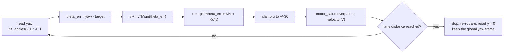

# Motion Control and Odometry for a SPIKE Prime Differential Drive

**ERAU SYS 301 — external research note.** Written 2026-08-25. **No hardware was available.** Every
number is either quoted from a source that was actually fetched, or arithmetic derived from geometry and
labelled as derived. Nothing here was measured on our robot.

**Scope:** making a two-motor SPIKE Prime drive base go where it is told — hold a heading down a lane,
turn a real 90°, use the hub IMU honestly, re-square against a reference, calibrate the wheel constants.
Companion documents own the neighbouring problems and are **not** repeated:

| Covered elsewhere — cite, don't restate | Where |
|---|---|
| Coverage patterns, boustrophedon choice, de-duplication, run-level error budget, sensor roles | [detection-and-sweep-techniques.md](./detection-and-sweep-techniques.md) |
| Colour classification, sensor mounting height, motor speed-vs-no-load table, gearing for resolution | [color-discrimination.md](./color-discrimination.md) |
| Hub OS generations and how to identify ours without flashing anything | [spike-prime-linux-toolchain.md](./spike-prime-linux-toolchain.md), [../runbooks/hub-identification.md](../runbooks/hub-identification.md) |
| Path length and run time vs arena units | [../findings/coverage-time-budget.md](../findings/coverage-time-budget.md) |

**Generation warning, because it bites hardest here.** Nearly every motion tutorial online targets
**Hub OS 2** (`from spike import PrimeHub, MotorPair`), where speeds are **percent**. **Hub OS 3**
(`import motor_pair`, `from hub import port, motion_sensor`) uses **deg/s**. A gain copied across that
boundary is off by roughly 10×. Every code block below is labelled. Our generation is `[UNKNOWN]`.

---

## Summary

1. **The cross-track budget is a 0.3° heading budget.** At the coverage doc's 15 mm allowance a 3.05 m
   (10 ft) lane needs *mean* heading error under **0.28°**; 1.2 m allows 0.72°; 0.76 m allows 1.13°.
   Community-measured SPIKE turn accuracy is ±2° at best. **Lane length, not tuning, makes this feasible.**
2. **Mean heading error matters, peak does not** — cross-track is the integral of heading error along the
   lane. ±2° of wobble about zero is fine; a steady +0.5° is not. So gyro *bias* matters far more than
   gyro *noise*, and the integral term earns its place.
3. **Encoder-difference heading hold is blind to the dominant error.** Unequal wheel diameters curve the
   robot while both encoders read identical counts: **0.1 mm of mismatch on 56 mm wheels costs 74 mm of
   cross-track over a 3.05 m lane** — about a whole lane pitch (46–76 mm).
4. **Stock firmware has no gyro-assisted straight drive.** Nothing published says a `motor_pair`'s motors
   are position-coupled. You write the heading loop.
5. **Slow turns are free accuracy:** measured 98° at velocity 500 vs 92° at velocity 200 for a commanded
   90° — 4× less error for ~0.24 s per turn, per the turn-time table below.
6. **Turns cost time the coverage budget omitted:** derived 1.3–2.7 min for a 41-lane sweep, 2.2–4.4 min
   for 67 lanes, on top of the 8–23 min of driving.
7. **The distance sensor cannot square you to a wall** — ±20 mm over any usable baseline gives 1.6–8° of
   angular uncertainty, 6–30× too coarse. Mechanical contact is the only reference in the right order of
   magnitude — and even that is derived at ~0.6°, still ~2× what a 3.05 m lane wants, so short lanes carry
   the remainder. That is a purchasing argument, not a coding one.
8. **Use the Large Angular Motor 45602 for drive** — for correction *headroom*, not top speed. Hub OS 3's
   velocity ceilings are exactly the no-load speeds (1050 vs 660 deg/s), so a small motor sits at 78 % of
   its ceiling at presence-only sweep speed and cannot reach 360 mm/s at all.
9. **UMBmark fits in one class session** and cut systematic odometry error **10–22×** for Borenstein &
   Feng. Procedure and correction algebra transcribed below.

---

## Heading hold on a straight lane

### The three mechanisms

| Mechanism | Sees diameter mismatch? | Sees slip? | Sees a push? | Cost |
|---|---|---|---|---|
| **LEGO built-in** `motor_pair.move(pair, steering=0)` | No | No | No | Free |
| **Encoder difference** (`motor.relative_position` L vs R) | **No** | No | Only through the wheels | ~10 lines |
| **Gyro P/PI loop** on `motion_sensor.tilt_angles()[0]` | Yes | Yes | Yes | ~20 lines + tuning |

The middle row is the trap. An encoder-difference controller drives `posL − posR` to zero; if one tyre is
0.1 mm larger, equal counts means *unequal distance*, so the robot curves while the controller reports
success. Unequal wheel diameters are Borenstein & Feng's `Ed`, one of the *"two most notorious systematic
error sources"* in differential drive
([UMBmark](https://johnloomis.org/ece445/topics/odometry/borenstein/paper60.pdf)). **Keep encoder
difference as a cheap slip/stall detector; never as the heading controller.**

**Does `motor_pair` synchronise the motors?** LEGO's published API describes only a `steering` and a
`velocity` with per-motor-type ceilings ([Tufts CEEO SPIKE 3 mirror](https://tuftsceeo.github.io/SPIKEPythonDocs/SPIKE3.html)).
**No fetched source states the motors are position-coupled.** The circumstantial evidence that they are
not: Prime Lessons, FLLCasts and the GO-Robot-FLL competition codebase all write their own gyro loop
rather than trusting `steering=0`. Treat synchronisation as **UNVERIFIED and probably absent**; test it
(item 7 in [§ What must be measured](#what-must-be-measured-on-real-hardware)).

### Real API calls, both generations

**Hub OS 3** — correction applied through `steering`, following the structure of Prime Lessons' Hub OS 3
proportional line follower, which also supplies the ±30 clamp
([SP3ProportionalLineFollowerPython.pdf](https://primelessons.org/en/PyProgrammingLessons/SP3ProportionalLineFollowerPython.pdf)):

```python
from hub import port, motion_sensor
import motor, motor_pair, runloop

KP = 0.0            # MUST BE MEASURED. No fetched source publishes a gain for a Hub OS 3
                    # gyro-straight loop driven through `steering`.
CORR_LIMIT = 30     # Prime Lessons: "keep the correction value from -30 to 30"
BASE_VELOCITY = 300 # deg/s

def yaw_deg():
    # tuple is DECIDEGREES and opposite in sign to the app's yaw
    return motion_sensor.tilt_angles()[0] * -0.1

async def drive_lane(target_heading, motor_degrees):
    motor_pair.pair(motor_pair.PAIR_1, port.C, port.D)
    start = motor.relative_position(port.C)
    while abs(motor.relative_position(port.C) - start) < motor_degrees:
        error = yaw_deg() - target_heading
        corr = int(max(-CORR_LIMIT, min(CORR_LIMIT, -KP * error)))
        motor_pair.move(motor_pair.PAIR_1, corr, velocity=BASE_VELOCITY)
        await runloop.sleep_ms(0)      # yield; don't hard-code 20 ms until h is measured
    motor_pair.stop(motor_pair.PAIR_1)
```

**Hub OS 2** — the canonical FLL loop, published with `Kp = 2` at tank speed 60. Speeds are **percent**
and the correction is added to one side and subtracted from the other, not fed to a steering input
([GyroMoveStraight.pdf](https://primelessons.org/en/PyProgrammingLessons/GyroMoveStraight.pdf), verbatim):

```python
from spike import PrimeHub, MotorPair
hub = PrimeHub()
motor_pair = MotorPair('A', 'E')
hub.motion_sensor.reset_yaw_angle()
while True:
    error = hub.motion_sensor.get_yaw_angle()
    correction = error * -2
    motor_pair.start_tank(int(60 + correction), int(60 - correction))
```

**The two gains are not interchangeable** — one is a percent-power differential, the other a unitless
steering value. Record in the code which form a stored gain belongs to.

### Regulated vs unregulated: the inner loop nobody mentions

Prime Lessons note in one line that *"In SPIKE Prime, we use % power so that the motors will be
unregulated"* ([PIDLineFollower.pdf](https://primelessons.org/en/ProgrammingLessons/PIDLineFollower.pdf));
GO-Robot-FLL does the same — `start_at_power(...)`, not `start_tank(...)`. This matters:
`move`/`move_tank`/`start_tank` command **velocity**, achieved by each motor's own onboard closed loop, so
your heading loop sits outside two velocity loops whose gains you cannot see or set, and the plant changes
shape when they respond differently to a disturbance. The Hub OS 3 unregulated equivalent is
`motor.set_duty_cycle(port, pwm)` per motor (−10000…10000), which means abandoning `motor_pair`.
**Recommendation for the Programmer: start regulated** — constant ground speed is worth more to this
mission than clean loop dynamics, since sample pitch and distance odometry both depend on it. Drop to duty
cycle only if the loop proves unstable.

### Tuning the gain — arithmetic, not trial and error

Published starting gains exist; none is for our loop. `Kp = 2` is Hub OS 2 tank-percent; `0.5 ± 0.05` is
Hub OS 3 *reflected-light* error into steering; `P 1.0 / I 0.05 / D 1.0` are the Seshans' generic PID
starting points. The widely cited `Kp 1.8 / Ki 0.184 / Kd 4.4` is **EV3 Python under Pybricks, not
SPIKE** — its code is `robot.drive(Ts, correction)`
([fll-pigeons](https://fll-pigeons.github.io/gamechangers/gyro_pid.html)). **This corrects an attribution
in [detection-and-sweep-techniques.md § Heading hold](./detection-and-sweep-techniques.md#heading-hold-on-the-straight-legs)**,
which reads that source's 20–30 ms loop time as a measurement on *this* hub. It is not; our loop rate is
**UNVERIFIED**.

Two measurements collapse the search space (**derived, not sourced**): the **loop period `h`** (count
iterations over 10 s), and the **plant gain `k`** — command a fixed `steering = S` at the intended
velocity and record the settled yaw rate, `k = (deg/s of yaw) / S`. Do it at two speeds, because the plant
gain is speed-dependent; that is why GO-Robot-FLL *schedules* gains against speed —
`pRegler = -0.17 * speed + 12.83`, `dRegler = 1.94 * speed - 51.9` (verbatim from `Main.py`; Hub OS 2,
unregulated power). The *structure* — Kp falling, Kd rising with speed — is transferable; the coefficients
are not, and their valid domain is **UNVERIFIED** (past speed ≈ 75 the published `pRegler` goes negative,
which cannot be intended).

Because `steering` is a **turn-rate** command, the heading plant is a pure integrator (`θ̇ = k·u`) and the
closed loop is first-order. Discrete stability needs `k·Kp·h < 2`; well-damped wants roughly

```
k * Kp * h  ~  0.3 … 0.5        =>        Kp  ~  0.4 / (k * h)
```

Start there and adjust by ±20 %, not by the ±0.05 the line-follower lesson suggests for a different error
scale.

**What wrong gains look like on this platform:**

| Symptom | Cause | Fix |
|---|---|---|
| Fast regular weave, period a small multiple of the loop period | `Kp` too high — limit-cycling against the sample rate | Halve `Kp`; measure `h`. Do not add `Kd` to paper over it |
| Slow growing S-curve; heading recovers but the robot has wandered | `Kp` too low, or the correction is clamping at ±30 | Raise `Kp`; check the clamp |
| Heading settles at a small constant offset and never returns to zero — runs perfectly straight *along the wrong line* | Constant disturbance (diameter mismatch, carpet grain, dragging shroud) against a P-only loop. Steady-state error is `d/(k·Kp)`, never zero | **Add `Ki`.** This is the failure that eats lane pitch, and it looks like success on the yaw readout |
| Weave that appears only at high speed | Speed-dependent plant gain | Schedule the gain, or fix the velocity |
| Smooth one-way drift for the whole lane, no oscillation | Not a gain problem — **gyro bias**. See [§ The gyro](#the-gyro-on-this-hub) | Reboot/re-zero; measure drift; shorten the lane |

### Heading hold does not fix lateral offset

A heading controller restores *parallel*, not *on-line*: after a bump the robot ends up parallel to its
lane and permanently displaced. The remedy is a cross-track term integrated from the heading you already
have — `y += v*h*sin(theta_err)`, then `steering = -(Kp*theta_err + Kc*y)`. `Kc` makes the loop
second-order and **will** oscillate if large. For a sweep that touches a wall at every lane end,
re-squaring is the better answer and needs no tuning.



---

## Turning accurately

### Gyro turns vs geometric (encoder) turns

| | **Gyro turn** | **Geometric/encoder turn** |
|---|---|---|
| Depends on | IMU bias and read latency | `WHEEL_CIRCUMFERENCE`, `TRACK`, gear ratio |
| Immune to | wheel size, track, gearing changes | gyro drift, scale error, stuck-at-zero |
| Vulnerable to | drift, per-hub scale error, momentum overshoot | wheel slip during the turn, track measurement error |
| Angles > 180° | needs explicit unwrapping | no special case |

**Recommendation for the Programmer: geometric turn as the command, gyro as the verifier.** Command
open-loop from geometry (it cannot hang, and it degrades gracefully if the gyro is sick), then read the
gyro and creep-correct the residual. That buys the encoder's immunity to drift *and* the gyro's immunity
to slip, and makes a failed turn observable instead of silent.

Geometric spin turn, Hub OS 3, verbatim from
[SP3AccurateTurningPython.pdf](https://primelessons.org/en/PyProgrammingLessons/SP3AccurateTurningPython.pdf):

```python
from hub import port
import motor_pair, runloop, sys, math
motor_pair.pair(motor_pair.PAIR_1, port.C, port.D)
WHEEL_CIRCUMFERENCE = 17.5   # cm - please adjust according to your robot wheel
TRACK = 11.2                 # cm - please measure your own robot.
SPIN_CIRCUMFERENCE = TRACK * math.pi

async def spin_turn(robot_degrees, motor_speed):
    motor_degrees = int((SPIN_CIRCUMFERENCE/WHEEL_CIRCUMFERENCE) * abs(robot_degrees))
    if robot_degrees > 0:
        await motor_pair.move_for_degrees(motor_pair.PAIR_1, motor_degrees, 100, velocity=motor_speed)
    else:
        await motor_pair.move_for_degrees(motor_pair.PAIR_1, motor_degrees, -100, velocity=motor_speed)
```

A **pivot** turn uses `PIVOT_CIRCUMFERENCE = 2 * TRACK * pi` and `steering = ±50`. Steering conventions,
verbatim: **0 = straight, ±50 = pivot (one wheel), ±100 = spin (both wheels opposite)**
([SP3MovingStraightPython.pdf](https://primelessons.org/en/PyProgrammingLessons/SP3MovingStraightPython.pdf)).
The Hub OS 2 equivalent is `motor_pair.start_tank(20, 0)` then
`wait_until(hub.motion_sensor.get_yaw_angle, greater_than_or_equal_to, 90)` then `stop()`
([GyroTurning.pdf](https://primelessons.org/en/PyProgrammingLessons/GyroTurning.pdf)).

### Overshoot vs turn speed — the one hard measurement in the literature

Prime Lessons ran the same Hub OS 3 gyro turn on their Drive Base 1 at two speeds:

| Commanded | Turn velocity | Actual | Error |
|---|---|---|---|
| 90° | 500 deg/s | **98°** | **+8°** |
| 90° | 200 deg/s | **92°** | **+2°** |

Their stated causes, verbatim: *"It takes a short time to read the gyro. In this time, the robot has
moved… It takes some time to stop the robot since it has momentum."* And: *"We did not notice any
significant difference using move vs move_tank. Adjusting the speed made the biggest difference."* Pivot
and spin turns *"have a similar error pattern"*.

That shape is **latency + momentum** — roughly proportional to turn rate, not a fixed offset — so
subtracting a constant fudge (their first suggestion) works at only one speed and one battery charge, and
the same mechanism degrades the *geometric* turn too: *"inaccuracies increase as speed increases."* An
independent 10-trial benchmark reports mean/spread of **9.6°/1.2° for SPIKE App 3 Python** vs 17.1°/0.9°
for Word Blocks on a 90° turn, surface not stated
([dev.to](https://dev.to/_ff41734170f7cc70ac79/comparing-lego-spike-prime-programming-which-is-best-for-robotics-competitions-3-20h1)) —
magnitudes far worse than Prime Lessons' under different conditions, so **not comparable**. The
transferable point is the **small spread** in both datasets: the error is systematic, therefore
correctable.

### Settle and verify — making 90° actually 90°

**Derived design.** The verify step converts "±2° per turn, systematic" into "±TOL, bounded", and it is
the only way a sweep survives 48–132 turns.

```mermaid
stateDiagram-v2
  [*] --> Command
  Command: geometric spin turn, velocity <= 200 deg/s
  Command --> Settle
  Settle: motor_pair.stop(pair, stop=motor.BRAKE); sleep_ms(SETTLE_MS)
  Settle --> Read
  Read: err = wrap(yaw - target)
  Read --> Done: abs(err) <= TOL
  Read --> Creep: abs(err) > TOL and tries < MAX_TRIES
  Read --> Flag: tries == MAX_TRIES
  Creep: spin_turn(-err, velocity=100)
  Creep --> Settle
  Flag: light_matrix warning; record TURN_UNCONVERGED; continue
  Flag --> Done
  Done --> [*]
```



- **Settle before reading** — part of the overshoot is the robot still moving when the gyro is sampled.
  `SETTLE_MS` **MUST BE MEASURED**: stop, log yaw every 20 ms for 1 s, find the knee. Start at 200 ms.
- **`TOL` comes from lane length, not taste** — a residual `θ` costs `L·tan θ` on the next lane.
- **Cap retries and record the failure** (sick gyro, wheel on a seam). Looping forever on Demo Day is the
  worst outcome; per [../directives/honest-instrumentation.md](../directives/honest-instrumentation.md)
  it is reported, not swallowed.
- **Compare with `<` / `>`, never `==`** — the sensor may never be sampled at the exact value.
- **Never animate the 5×5 matrix during a gyro-controlled move** — light-matrix updates add *"about 25
  degrees per 360 degree turn"*
  ([SPIKEPrimevsEV3.pdf](https://primelessons.org/en/ProgrammingLessons/SPIKEPrimevsEV3.pdf)).

### What a turn costs in time

**Derived.** A spin turn of φ degrees needs `motor_deg = (π·b/Cw)·φ`. With `b` = 112 mm (Prime Lessons
Drive Base 1) and `Cw` = 175.9 mm (geometric, 56 mm wheel) — both placeholders — a 90° spin is **180 motor
degrees**.
Default `acceleration = 1000 deg/s²` adds about `velocity/1000` seconds **overall**, not at each end — the
ramps cover ground, so a trapezoidal profile costs `d/v + v/a`.

| Turn velocity | Constant-speed | + ramps | + 0.2 s settle | per 90° turn |
|---|---|---|---|---|
| 500 deg/s | 0.36 s | 0.86 s | 1.06 s | ~1.1 s — **but +8° error** |
| 300 deg/s | 0.60 s | 0.90 s | 1.10 s | ~1.1 s |
| 200 deg/s | 0.90 s | 1.10 s | 1.30 s | ~1.3 s — **+2° error** |

A boustrophedon lane change is **two** 90° turns, so `N` lanes cost `2(N−1)` turns:

| Lanes | Turns | @1.0 s | @1.5 s | @2.0 s |
|---|---|---|---|---|
| 25 — illustrative shorter arena, not a row in the coverage finding | 48 | 0.8 min | 1.2 min | 1.6 min |
| 41 (10 ft @ 76 mm pitch) | 80 | 1.3 min | 2.0 min | 2.7 min |
| 67 (10 ft @ 46 mm pitch) | 132 | 2.2 min | 3.3 min | 4.4 min |

**The coverage finding explicitly excluded turn overhead; this is that number.** Against its own 8–23 min
of driving ([../findings/coverage-time-budget.md](../findings/coverage-time-budget.md)) it adds roughly
10–30 % to the run — and it is why the 500 deg/s turn is tempting and why to resist it: 8° of turn error
costs more misses than 0.2 s saves.

---

## The gyro on this hub

### LEGO documents essentially nothing

The Large Hub 45601 spec sheet lists the IMU as *"Six-axis Gyro Sensor… Able to report: Gyroscope mode
(three-axis), Accelerometer/tilt mode (three-axis), Gestures as tap, free fall, and shake"* — and stops
([techspecs PDF](https://assets.education.lego.com/v3/assets/blt293eea581807678a/bltf512a371e82f6420/5f8801baf4f4cf0fa39d2feb/techspecs_techniclargehub.pdf?locale=en-us),
extracted with `pdftotext` 2026-08-25). **No resolution, no update rate, no noise figure, no drift or
bias-stability figure.** The *motor* sheets publish all three (360 counts/rev, ≤±3°, 100 Hz) for both the
45602 and 45607. That asymmetry is a legitimate report finding: **the sensor our heading control depends
on most is the one LEGO declines to specify.** Any "SPIKE gyro drift spec" quoted at us does not exist.

### Zeroing, and when to redo it

| | Hub OS 3 | Hub OS 2 |
|---|---|---|
| Read yaw | `motion_sensor.tilt_angles()[0]` → **decidegrees**, sign **inverted** vs the app: `yaw = tilt_angles()[0] * -0.1` | `hub.motion_sensor.get_yaw_angle()` → degrees, cw positive |
| Zero | `motion_sensor.reset_yaw(0)` | `hub.motion_sensor.reset_yaw_angle()` |
| Rest gate | `await runloop.until(motion_sensor.stable)` — *"returns true when the sensor is resting flat"* | none published |
| Raw rate | `motion_sensor.angular_velocity(raw_unfiltered)` → decidegrees/s | — |

Wrap-around, verbatim: *"When moving clockwise from 0, the readings go from 0 to −1799, then to 1800 and
down to 0"* ([SP3GyroTurningPython.pdf](https://primelessons.org/en/PyProgrammingLessons/SP3GyroTurningPython.pdf)).
Missing the 10× decidegree conversion is the most common Hub OS 3 porting bug.

**Reset yaw exactly once per run, stationary, gated on `motion_sensor.stable()`** — resetting while
rotating zeroes the bias estimate against a rotating frame and injects a permanent phantom rotation.
**Do not reset between lanes**; keep one global heading frame and work in wrapped deltas. The one
legitimate mid-run re-zero is **immediately after a mechanical wall square**, pressed and still.
Re-zeroing mid-lane re-anchors to a heading that may already be wrong — that renames the error, it does
not remove it.

### The drift / stuck-at-zero pathology

Prime Lessons document a stock-firmware fault in **both** generations: after boot the yaw either drifts
continuously or **sticks at 0 forever**. Verbatim: *"the gyro waits for the robot to be still before
reading gyro values. However, since drift has already been introduced at this point by shaking the robot,
the hub thinks that it is moving continuously even when the robot is still."* Remedy: *"Check if your
gyro is drifting before you launch your robot for your match. If it is drifting, reboot your robot."*
([SP3GyroDrift.pdf](https://primelessons.org/en/ProgrammingLessons/SP3GyroDrift.pdf)) **For the Builder
this is a Demo Day pre-run ritual**, not a coding concern: flat, still, run the gate, power-cycle on
failure and wait before touching it.

### How much drift can we tolerate?

**Derived.** If the yaw reading drifts at rate `r`, a controller holding yaw = 0 physically turns the
robot at `r`. Mean heading error over a lane is `rT/2` with `T = L/v`, so cross-track is `y ≈ L·r·T/2`
and the budget is `r_max = 2ε/(L·T)`:

| Lane | Speed | Lane time | ε = 15 mm → max drift |
|---|---|---|---|
| 3.05 m | 160 mm/s (classification-limited) | 19.1 s | **0.030 °/s = 1.8 °/min** |
| 3.05 m | 250 mm/s (presence-only) | 12.2 s | **0.046 °/s = 2.8 °/min** |
| 1.20 m | 160 mm/s | 7.5 s | 0.19 °/s = 11.5 °/min |

Against what is actually reported:

| Claim | Value | Status |
|---|---|---|
| LSM6DS3 zero-rate drift vs temperature, ±0.05 dps/°C → ~0.5 dps after a 10 °C self-heat | **~30 °/min** | Silicon-level bound (part ID from a teardown, not LEGO); cited in [detection-and-sweep-techniques.md](./detection-and-sweep-techniques.md) |
| Error over a slow 360° turn on official firmware | *"easily off by 5–10 degrees"* | One user's impression, [pybricks #980](https://github.com/orgs/pybricks/discussions/980). **Not a measurement** |
| *"as much as 1 degree per second"* of yaw drift | 60 °/min | Search-snippet only; source threads return **HTTP 403**. **UNVERIFIED** |
| Per-hub gyro scale error, consistent per hub | 4–7° per 360° | Seshans, [SPIKEPrimevsEV3.pdf](https://primelessons.org/en/ProgrammingLessons/SPIKEPrimevsEV3.pdf) |

**Both reported drift *rates* are an order of magnitude worse than the 1.8 °/min budget** — the more
optimistic of them (~30 °/min) is ~17× too large. The other two rows are per-360°-turn errors, not rates,
and are not comparable to a °/min budget at all. Read literally, a 10-foot lane cannot be held on gyro
alone, which is exactly why [§ Re-squaring](#re-squaring-against-a-reference) is central and not an
appendix. But **no fetched source
measured drift on a hub at rest under our conditions**, so the honest position is that this is a
pass/fail acceptance test we must run, and its result decides whether long lanes are viable at all.

Behaviour over 2–10 minutes is likewise unspecified and unmeasured. Physically, expect a warm-up
transient as the die self-heats, then a slower residual — so drift measured in minute one is **not**
representative of minute eight. Measure both.

---

## Re-squaring against a reference

This is what lets boustrophedon run without localisation: error is zeroed at each lane end rather than
accumulated. The companion doc lists the technique menu and the hardware we lack for each
([detection-and-sweep-techniques.md § Re-squaring](./detection-and-sweep-techniques.md#re-squaring-techniques-all-workable-on-stock-firmware)).
What follows is what that document does not do: **how well each can possibly work.**

### With walls, using the distance sensor — not accurate enough

45604 official figures: **50–2000 mm, ±20 mm**, entrance angle **±35°**, 1 mm output resolution, and
`distance_sensor.distance()` returns **−1** when it cannot read
([techspecs PDF](https://assets.education.lego.com/v3/assets/blt293eea581807678a/blt64c2b9534cf10f68/5f8801b8bc43790f5c4389ea/techspecs_technicdistancesensor.pdf?locale=en-us)).
Two independent problems, both derived here:

1. **A ±35° beam on a flat wall does not measure along the sensor axis.** A beam that wide returns the
   *nearest* reflecting point in the cone — for a flat wall, the foot of the perpendicular. So the
   reading is approximately the **perpendicular** distance regardless of heading. The naive `d/cos θ`
   inference of heading is wrong *in principle*, not merely noisy.
2. **The two-point method dies on the accuracy figure.** Drive a baseline `s` along the lane, take
   perpendicular distances `d1`, `d2` to a side wall; heading relative to the wall is `asin((d2−d1)/s)`.
   With ±20 mm per reading the angular noise is about `20√2/s`:

| Baseline | Angular uncertainty |
|---|---|
| 200 mm | **8.1°** |
| 500 mm | **3.2°** |
| 1000 mm | **1.6°** |

Against a 0.28° budget, **the distance sensor is 6–30× too coarse to square the robot.** It stays useful
for *ranging* — how far to the far wall, am I about to hit something — and for coarse pre-alignment. It
is not a squaring sensor. Note also the 50 mm minimum: blind in the last 50 mm before contact.

**Recommendation for the Supplier and Designer:** do not buy the 45604 *for squaring*. If the boundary
turns out to be walls, the money buys more from a mechanical bumper. Depends on professor Q3 —
[../plans/questions-for-the-professor.md](../plans/questions-for-the-professor.md).

### With walls, mechanically — the only adequate reference

Driving into a wall squares the robot to the *mechanics*; accuracy is set by chassis geometry, not sensor
noise. A flat contact face of width `w` seating against the wall bounds residual heading at about
`atan(δ/w)` for contact slop `δ` — with `w` = 100 mm and `δ` = 1 mm that is **0.6°**: 3–14× better than the
distance sensor, but still ~2× the 0.28° a 3.05 m lane wants, so a wider contact face or a shorter lane has
to make up the rest. **Derived; the actual slop MUST BE MEASURED on the real chassis.** Practical rules, from [RoboCatz](https://robocatz.com/using-the-wall.htm)
and Prime Lessons:

- **Use a timed drive into the wall, not a degrees-based one** — `move_for_degrees` never completes if the
  motor cannot turn and hangs the program; `move_for_time` always returns. Most important detail here.
- **Power just high enough to move the robot** — more and the wheels slip or the robot climbs the wall
  instead of seating flat, corrupting the encoders *and* defeating detection. Worse on carpet.
- **Re-zero yaw immediately after seating**, still pressed and stationary.
- **Infer the stall yourself** from `motor.velocity()` or successive `motor.relative_position()` reads:
  *"as of version 3.4, SP3 does not allow stall detection to be changed or queried"*
  ([SP3MovingObjectsStallPython.pdf](https://primelessons.org/en/PyProgrammingLessons/SP3MovingObjectsStallPython.pdf)).
- **A wall square fixes heading and one position axis, not lane pitch** — pitch comes from the cross-lane
  hop, which is short (46–76 mm) and cheap to get right.

### Without walls

| Reference | Viable for us? |
|---|---|
| **Line squaring on border tape** | **No** — needs two colour sensors on a wide baseline; *"Your color sensors should NOT be placed right next to each other"* ([SP3SquaringonLine.pdf](https://primelessons.org/en/ProgrammingLessons/SP3SquaringonLine.pdf)). We own zero and plan to buy one |
| **Single-sensor line crossing** | Partial. One sensor crossing a border at an angle gives no angle, but the time between crossings on successive lanes measures accumulated along-track error. A drift indicator, not a square |
| **Gyro alone, re-zeroed at rest mid-lane** | Renames the error rather than removing it — you re-anchor to whatever heading you currently have |
| **A team-supplied reference** — a beam the robot backs into at each lane end | Converts a no-wall arena into a walled one at one point. Worth pricing against the 56 SB balance |
| **Short lanes** | Always available, always works. Halving lane length halves accumulated cross-track for the same drift, at twice as many turns (see the turn-time table) |

**This is the load-bearing reason Q3 (what bounds the area) ranks alongside Q1 (the units).** A walled
arena is an architecturally easier control problem than a taped one — not a tuning parameter.

---

## Odometry arithmetic

All derived from geometry. `Cw` = wheel rolling circumference, `D` = wheel diameter, `b` = track,
`L` = lane length, `v` = ground speed. Worked examples use `Cw` = 175.9 mm (geometric, 56 mm wheel — *not*
Prime Lessons' measured 17.5 cm — see the scale-error note below) and `b` = 112 mm (Prime Lessons Drive
Base 1), both **placeholders only**. Our wheel diameter and track are `[UNKNOWN]` and belong in [../hardware/build-record.md](../hardware/build-record.md).

```
1.  Scale error (average wheel diameter wrong by dD):
        distance_error / distance  =  dD / D

2.  Wheel-diameter MISMATCH (right minus left = dD), on a nominally straight leg:
        Ed         = D_R / D_L
        heading    = L * (Ed - 1) / b            [radians]
        crosstrack = L^2 * (Ed - 1) / (2 * b)    [mm]

3.  Track error (b wrong by db), on an ENCODER turn only:
        turn_error / turn  =  db / b

4.  Heading budget from a cross-track allowance:
        theta_max = atan(epsilon / L)
```

Formula 3 has no effect on a straight leg and formula 2 none on a spot turn — Borenstein & Feng's central
observation: *"Eb has an effect only when turning, while Ed affects only straight line motion"*
([paper59](https://johnloomis.org/ece445/topics/odometry/borenstein/paper59.pdf)). That separation is
what makes them separately measurable.

**Diameter mismatch, over one 3.05 m lane, `b` = 112 mm:**

| Mismatch | `Ed − 1` | Heading swept | Cross-track |
|---|---|---|---|
| 0.05 mm | 0.00089 | 1.4° | **37 mm** |
| 0.1 mm | 0.00179 | 2.8° | **74 mm** |
| 0.2 mm | 0.00357 | 5.6° | 148 mm |
| 1.0 mm | 0.01786 | 27.9° | 742 mm |

Read that against a 46–76 mm lane pitch: **a tenth of a millimetre of tyre mismatch is a whole missed
lane.** Sanity check — Borenstein & Feng's LabMate calibrated out to `D_R/D_L` = 1.00084 on a 340 mm
wheelbase, which by formula 2 gives 0.57° and 19.8 mm per 4 m leg — compounding to roughly 110 mm over the
four legs of their square, since each leg starts with the heading the previous ones left. Their measured
317 mm is larger because it also carries the wheelbase error the same calibration removed (340.00 →
336.17 mm); separating those two contributions is the entire point of running both directions. The
conclusion is not "buy better tyres" (partly it is *load asymmetry* compressing one tyre more,
which no purchase fixes) but **closed-loop heading control is a requirement, not an optimisation** — and
the residual after correction is what `Ki` removes.

**Scale error, affecting distance only:**

| `dD` on 56 mm | Fractional | Over one 3.05 m lane | Over a 125 m sweep |
|---|---|---|---|
| 0.5 mm | 0.89 % | 27 mm | 1.12 m |
| 1.0 mm | 1.79 % | 54 mm | 2.23 m |
| 2.0 mm | 3.57 % | 109 mm | 4.46 m |

Scale error does not cause misses between lanes; it makes the robot stop short of or overrun the arena
edge and mis-place the cross-lane hop. Borenstein calls it *"exceedingly easy to [measure]… with an
accuracy of 0.3–0.5 % of full scale, even with an unsophisticated tape measure"* and insists it is
corrected **before** UMBmark runs. **Do not use the geometric circumference** — Prime Lessons' worked
example uses **17.5 cm, not the geometric 17.6 cm**, because the tyre compresses; roll to exactly 360
encoder degrees and measure with a ruler
([ConfiguringRobotMovement.pdf](https://primelessons.org/en/PyProgrammingLessons/ConfiguringRobotMovement.pdf)).
On carpet it sinks further, so this is a **per-surface** constant. Hub OS 3's `motor_pair` has **no
distance-unit API** (Hub OS 2's `set_motor_rotation(17.5, 'cm')` has no equivalent), so you convert
cm→degrees yourself every time.

**Track error, affecting encoder turns only:**

| `db` on `b` = 112 mm | Fractional | Error in a 90° turn | Cross-track over the next 3.05 m lane |
|---|---|---|---|
| 1 mm | 0.89 % | 0.80° | 43 mm |
| 2 mm | 1.79 % | 1.61° | **86 mm** |
| 5 mm | 4.46 % | 4.02° | 214 mm |

**A 2 mm track error is nearly two lane pitches on the following lane.** And `b` is genuinely hard to
measure — Borenstein defines it as *"the distance between the contact points of the two drive wheels"*,
and the contact point of a compressed rubber tyre is not a point. This is the strongest argument for the
gyro-verified turn: a gyro turn does not care what `b` is.

**Encoder quantisation, for scale:** 360 counts/rev on a 175.9 mm wheel is **0.489 mm per count**, and
the 45602's ±3° combined sensor+gearbox accuracy is **±1.47 mm** — ±0.75° of heading if it fell entirely
on one wheel. That is the noise floor, and it is 10–100× smaller than the systematic terms above.

### UMBmark, concretely enough to run in one class session

Across eight experiments Borenstein & Feng cut `Emax,syst` from **232–423 mm to 12–35 mm** — **10× to 22×**
— purely by measuring two constants and putting them in software
([paper59, Table I](https://johnloomis.org/ece445/topics/odometry/borenstein/paper59.pdf); paper60's
Table I is a different table — six vehicles, no before/after column). The essential idea: a **one-directional** square path is worthless as a calibration, because wheelbase error and
diameter mismatch *compensate each other* in one direction and you can tune yourself into a fiction.
Running both directions separates them. Procedure, condensed from the paper's §3.4 (their path is 4×4 m;
scale to what fits the classroom and **use the same `L` in the algebra**):

1. Mark the start pose against two perpendicular walls — the walls are the absolute reference.
2. Drive a square of side `L` **clockwise**: four straight legs, **a complete stop at the end of each**,
   four **on-the-spot** 90° turns (a fourth after returning), **slowly, to avoid slippage** (they used
   0.2 m/s).
3. Measure the true return pose; record `εx = x_abs − x_calc`, `εy = y_abs − y_calc`.
4. **Five runs cw, then five ccw.** Average each cluster to its centre of gravity `(x_cg, y_cg)`.

Correction algebra, from [paper59](https://johnloomis.org/ece445/topics/odometry/borenstein/paper59.pdf)
(eqs. 7–18):

```
alpha = (x_cg,cw + x_cg,ccw) / (-4L) * (180/pi)     # degrees -- wheelbase error (Type A)
beta  = (x_cg,cw - x_cg,ccw) / (-4L) * (180/pi)     # degrees -- diameter mismatch (Type B)

R  = (L/2) / sin(beta/2)                            # radius of the curved "straight" leg
Ed = (R + b/2) / (R - b/2)                          # = D_R / D_L
Eb = 90 / (90 - alpha)                              # b_actual = Eb * b_nominal

cL = 2 / (Ed + 1)                                   # left-wheel correction factor
cR = 2 / ((1/Ed) + 1)                               # right-wheel correction factor
```

Apply `b_new = Eb · b_nominal` to the turn geometry and scale each wheel's counted travel by `cL`/`cR`.
That pair is constructed to leave the *average* diameter unchanged, so the scale calibration survives.

**Two adaptations, ours not Borenstein's:** (a) rather than re-deriving his coordinate frame under time
pressure, measure **final heading error** directly against the wall. A wheelbase error (Type A) reverses
sign between the cw and ccw runs while a diameter mismatch (Type B) keeps the same sign — that is
Borenstein's own definition of the two types (paper59 §3.2) — so the *difference* isolates one and the
*sum* the other: `α ≈ (θ_cw − θ_ccw)/8` per turn, `β ≈ (θ_cw + θ_ccw)/8` per leg. *Derived, not
transcribed; confirm the sign convention against a run whose error direction you already know.*
(b) **Turn the gyro turn off for the calibration runs** — UMBmark measures the *encoder* model;
gyro-closed turns calibrate the gyro instead.

**Recommendation:** Builder operates, Programmer observes; roughly 30–40 minutes for ten runs plus
measurement. It is exactly the quantitative verification artefact the Intro Report is graded on. Put it
on the calendar before Demo Day, not after.

---

## Motor choice — and telling ours apart

We own **two motors of unknown type** ([../scope.md](../scope.md), [../todo.md](../todo.md)). The
speed/torque comparison is already tabulated in
[color-discrimination.md § 5.3](./color-discrimination.md). What matters *for control* is different.

### Why the large 45602 is the right drive motor for a control loop

- **Correction authority.** Hub OS 3's documented velocity ceilings are **±1050 deg/s (large)** and
  **±660 deg/s (small)** — exactly the no-load speeds (175 and 110 RPM). A heading loop *adds* velocity
  on one side and *subtracts* on the other; if the base velocity is near the ceiling the outer motor
  saturates and the correction becomes one-sided and non-linear — a controller that behaves differently
  for left and right errors. Derived, 56 mm wheels:

| Ground speed | Motor command | % of large's ceiling | % of small's ceiling |
|---|---|---|---|
| 160 mm/s (classification-limited) | 327 deg/s | 31 % | 50 % |
| 250 mm/s (presence-only) | 512 deg/s | 49 % | **78 %** |
| 360 mm/s | 737 deg/s | 70 % | **112 % — impossible** |

- **Torque against carpet at low speed:** 25 Ncm stall vs 5 Ncm; 8 Ncm vs 1.8 Ncm at max efficiency. A
  drive near its torque limit stutters over carpet seams — a heading disturbance *and* a sample-pitch error.
- **Encoder resolution is identical** (360 counts/rev, 100 Hz); the small motor's *sensor* accuracy is
  better on paper (±1° vs ≤±3°) but its **control** accuracy is the same ±3°. Resolution is not the
  discriminator; authority is.
- **Supply voltage:** 45602 rated 5–9 V (quoted at 7.2 V); 45607 is a SPIKE **Essential** part rated
  3.3–6 V (quoted at 5 V) on a 7.2 V-class hub. **UNVERIFIED** what the hub delivers or how the curve
  shifts — one more reason not to build a drive from a part specified for a different hub.
- The small motor still has a job: any low-load duty — a sensor lift, a marker gate.

### How to tell which two we own — for the Builder

1. **Look at the output faces — but this only excludes the SMALL one.**
   **CORRECTED 2026-08-25** ([speed-envelope.md](./speed-envelope.md)): this test was written as if there
   were two candidates. There are **three**. **45607** (small) has only *"Rotating disc output with
   crosshole and building interface"*, so a crosshole on the face **opposite** the disc rules it out —
   but **45602 (large)** and **45603 (medium)** carry *identical* wording on their fact sheets, so this
   test **cannot tell large from medium**. Both have 250 mm wire, so cable length proves nothing either.

   **And a spin test cannot separate them.** Large is 1050 deg/s, medium **1110 deg/s** — 5.7 % apart,
   well inside LEGO's own ±15 % tolerance. Only the device ID (step 2), stall torque (**25 N·cm large vs
   18 N·cm medium**), or physical bulk distinguishes them.

   **This matters more than it looks:** SPIKE Prime set 45678 ships **two Medium and one Large**, so two
   identical-looking motors are *more likely* to be a pair of mediums than a pair of larges — and the
   medium is the **fastest** of the three.
2. **Ask the hub.** LPF2 device type IDs: **48 = SPIKE Prime Medium, 49 = SPIKE Prime Large, 65 = Technic
   Small Angular** (75/76 are the grey MINDSTORMS Technic Medium/Large)
   ([pybricks/technical-info](https://github.com/pybricks/technical-info/blob/master/assigned-numbers.md)).
   Reading the ID on stock firmware is the catch: the `hub.port.A.info()` route is documented only for
   the older hub module ([hubmodule.readthedocs.io](https://hubmodule.readthedocs.io/en/latest/motors/))
   and **whether it exists on our Hub OS is UNVERIFIED**. Try it during the read-only pass in
   [../runbooks/hub-identification.md](../runbooks/hub-identification.md) — definitive in seconds if it
   works.
3. **Measure no-load speed — definitive, no API archaeology.** Wheels off the ground, run at a high
   commanded velocity, read `motor.velocity(port)`: the large tops out near **1050 deg/s**, the small
   near **660 deg/s**. A 60 % separation, unmissable. **UNVERIFIED** whether commanding above a motor's
   ceiling raises, clamps, or misbehaves — which is why the wheels come off first.

**For the Supplier:** if we own two **small** 45607s, the control argument is a real case for swapping
against the 56 SB balance — but it trades against the colour sensor, without which the mission cannot run
at all. **Price it, do not assume it.** Owning one of each is worse than two of either: a differential
drive with mismatched motors has different speed and torque limits per side, and the heading loop must
correct a permanent asymmetry.

---

## Speed limits — where control meets detection

The traverse ceiling is set by the sensor and is already established: **~360 mm/s at a 30 mm chord across
a note, ~160 mm/s at a 20 mm chord** for reliable colour classification; presence-only detection tolerates
far more ([../findings/coverage-time-budget.md](../findings/coverage-time-budget.md),
[color-discrimination.md](./color-discrimination.md)). What this document adds is that the interaction
with heading quality runs in **both** directions.

**Slower helps control:** turn overshoot scales with turn rate (8° at 500, 2° at 200 deg/s); wheel slip —
the error neither gyro nor encoders can fix on the distance axis — falls with speed and acceleration
(Borenstein ran UMBmark at 0.2 m/s specifically for this); and a lower base velocity leaves more
correction headroom on both motors.

**Slower hurts control:** lane time rises, so **gyro drift has longer to accumulate** — dropping from 250
to 160 mm/s on a 3.05 m lane tightens the drift budget from 2.8 to **1.8 °/min**. Halving speed *doubles*
exposure to bias. Low speed also sits nearer the motor's stiction/cogging region where velocity
regulation is roughest; **UNVERIFIED** where that begins on a 45602 under our chassis load.

So there is a genuine optimum, and it moves with professor Q5:

| If the professor says… | Speed regime | Dominant control worry |
|---|---|---|
| Yellow only — presence detection suffices | ~250–360 mm/s | Turn overshoot and slip. Turn velocity ≤ 200 deg/s, short settle |
| Decoy colours — classification required | ~160 mm/s | **Gyro drift over a longer lane.** Shorten lanes or re-square more often |

**Neither branch changes the architecture** — speed, lane length and re-squaring cadence are all
parameters. Ask Q1, Q2 and Q5 together
([../plans/questions-for-the-professor.md](../plans/questions-for-the-professor.md)).

---

## What must be measured on real hardware

Nothing here has been measured. In dependency order; items 1–5 need no chassis.

| # | Measurement | Method | Gates |
|---|---|---|---|
| 1 | **Hub OS generation** | [../runbooks/hub-identification.md](../runbooks/hub-identification.md) | Every API call above. Do not write mission code first |
| 2 | **Which two motors we own** | Device ID, or no-load `motor.velocity()` | Velocity ceiling; whether a purchase is needed |
| 3 | **Gyro drift at rest over 10 min** | Flat and still, `reset_yaw(0)`, log yaw every 5 s for 600 s; report minute-1 and minute-8 rates separately | **Pass/fail: >1.8 °/min means long lanes are not viable on gyro alone.** LEGO publishes no spec |
| 4 | **Drift / stuck-at-zero gate** | Prime Lessons' pre-run check; confirm a reboot clears it | Builder's Demo Day ritual |
| 5 | **Control-loop period `h`** | Count iterations over 10 s | The stability bound `k·Kp·h < 2`. Currently UNVERIFIED |
| 6 | **Plant gain `k`** at two velocities | Fixed steering, log yaw rate to settling | Turns gain tuning into arithmetic |
| 7 | **Does `motor_pair.move(pair, 0)` drive straight?** | 3 m open-loop, five trials, measure lateral deviation both directions | Settles the synchronisation question; also *is* the `Ed` measurement |
| 8 | **Rolling circumference, per surface** | Roll to exactly 360 encoder degrees, measure; repeat on carpet and tile | Every distance in the sweep. Expect ~17.5 cm, not 17.6 |
| 9 | **Track `b`** | Contact point to contact point, three times | Encoder turns and the `Ed` algebra |
| 10 | **Turn error vs turn velocity** — 90°, 5 trials at 100/200/300/500 deg/s, both directions | Gyro readout plus a protractor mark | Picks the turn velocity; direction asymmetry is the `Eb`/`Ed` signature |
| 11 | **Settle time after a turn** | Stop, log yaw every 20 ms for 1 s, find the knee | `SETTLE_MS`, multiplied by 48–132 turns |
| 12 | **UMBmark, 5 cw + 5 ccw** | § UMBmark above | The 10–22× win. Before Demo Day, not after |
| 13 | **Wall-square residual heading**, 10 trials | Drive in, back off, measure against the wall | Whether re-squaring delivers the 0.3° the sweep needs |
| 14 | **Achieved vs commanded velocity, 100–700 deg/s** | Ramp and log `motor.velocity()` | Low-speed regulation floor; confirms motor identification |

Record all of it in [../hardware/build-record.md](../hardware/build-record.md) and `docs/findings/`,
**with units, surface and lighting**, per
[../directives/honest-instrumentation.md](../directives/honest-instrumentation.md). The Intro Report's
results section is written from these rows.

---

## Open questions

1. **Does `motor_pair` cross-couple the two motors at all?** No fetched source says either way; item 7
   answers it, and the answer sets how much the heading loop must do.
2. **What is the real loop rate on this hub?** The widely quoted 20–30 ms figure is EV3 Python, not SPIKE.
3. **Does gyro drift stabilise after warm-up, and on what timescale?** Decides whether a 2-minute and an
   8-minute demo are the same problem. Unspecified by LEGO, unmeasured by anyone fetchable.
4. **Is there a published gain for a Hub OS 3 gyro-straight loop using `steering`?** Nothing fetched has
   one; the leads all return HTTP 403 and need reading manually in a browser.
5. **Does commanding a velocity above a motor's ceiling raise, clamp, or misbehave?** Affects the motor
   identification test and saturation handling in the loop.
6. **Can `hub.port.X.info()` be called on our Hub OS** to read the device type ID?
7. **Does the light-matrix/gyro contention (25° per 360°) apply to Hub OS 3?** The measurement's
   generation is not stated. If it is Hub OS 2 only, we regain the matrix as a live status display during
   motion, which [../directives/honest-instrumentation.md](../directives/honest-instrumentation.md) wants.
8. **What does carpet grain cost per lane, in each direction?** Systematic and distance-proportional per
   the iRobot patent; no magnitude published for LEGO tyres. On carpet it may dominate everything above.

Blocking questions for the professor (units, boundary, decoy colours, time limit) live in one place:
[../plans/questions-for-the-professor.md](../plans/questions-for-the-professor.md).

---

## Sources

Every URL was fetched on **2026-08-25**. PDFs were downloaded and text-extracted locally with
`pdftotext`, because the Prime Lessons decks return image-only content to a naive fetcher. Claims from
sources that could not be fetched are marked UNVERIFIED in the text and listed at the end.

**Official LEGO Education specifications**

- Technic Large Hub 45601 — https://assets.education.lego.com/v3/assets/blt293eea581807678a/bltf512a371e82f6420/5f8801baf4f4cf0fa39d2feb/techspecs_techniclargehub.pdf?locale=en-us
- Large Angular Motor 45602 — https://assets.education.lego.com/v3/assets/blt293eea581807678a/bltb9abb42596a7f1b3/5f8801b5f4c5ce0e93db1587/le_spike-prime_tech-fact-sheet_45602_1hy19.pdf?locale=en-us
- Small Angular Motor 45607 — https://assets.education.lego.com/v3/assets/blt293eea581807678a/blt20ee0f27f6735942/60fe86455483765886b0da3c/LE_SPIKE_Essential_Tech_fact_sheet_Small_Angular_Motor_45607_2HY21_Digital.pdf
- Distance Sensor 45604 — https://assets.education.lego.com/v3/assets/blt293eea581807678a/blt64c2b9534cf10f68/5f8801b8bc43790f5c4389ea/techspecs_technicdistancesensor.pdf?locale=en-us
- Large Angular Motor 45602 product page — https://education.lego.com/en-us/products/lego-technic-large-angular-motor/45602/

**SPIKE Python API**

- Tufts CEEO SPIKE 3 mirror (Hub OS 3 signatures, velocity ceilings, stop modes) — https://tuftsceeo.github.io/SPIKEPythonDocs/SPIKE3.html
- LEGO SPIKE Python v3 autogenerated reference — https://jvolkening.github.io/lego-spike-python-v3-docs/index.html
- Unofficial low-level hub module docs (`hub.port.X.motor`, `pid()`, `pwm()`, `info()`) — https://hubmodule.readthedocs.io/en/latest/motors/
- pybricks/technical-info, LPF2 device type IDs — https://github.com/pybricks/technical-info/blob/master/assigned-numbers.md

**Prime Lessons — Hub OS 3**

- Moving Straight (motor_pair signatures, steering conventions, per-motor velocity ceilings) — https://primelessons.org/en/PyProgrammingLessons/SP3MovingStraightPython.pdf
- Turning With The Gyro (decidegrees, sign inversion, wrap handling, `runloop.until`) — https://primelessons.org/en/PyProgrammingLessons/SP3GyroTurningPython.pdf
- More Accurate Turns (**98° @ v500 vs 92° @ v200**; geometric spin/pivot code) — https://primelessons.org/en/PyProgrammingLessons/SP3AccurateTurningPython.pdf
- Proportional Line Follower (steering correction, ±30 clamp, 0.5 ± 0.05 tuning) — https://primelessons.org/en/PyProgrammingLessons/SP3ProportionalLineFollowerPython.pdf
- Gyro Drift (stuck-at-zero pathology, reboot remedy) — https://primelessons.org/en/ProgrammingLessons/SP3GyroDrift.pdf
- Moving Objects / Stall Detection (stall not queryable as of 3.4) — https://primelessons.org/en/PyProgrammingLessons/SP3MovingObjectsStallPython.pdf
- Squaring on a Line (two colour sensors, wide baseline) — https://primelessons.org/en/ProgrammingLessons/SP3SquaringonLine.pdf

**Prime Lessons — Hub OS 2**

- Gyro Move Straight (**`correction = error * -2`, `start_tank(60±corr)`**, percent speeds) — https://primelessons.org/en/PyProgrammingLessons/GyroMoveStraight.pdf
- Gyro Turning (`get_yaw_angle`, `reset_yaw_angle`, `wait_until`, `start_tank(20, 0)`) — https://primelessons.org/en/PyProgrammingLessons/GyroTurning.pdf
- Configuring Robot Movement (`MotorPair`, `set_motor_rotation`, stop modes; **17.5 cm measured vs 17.6 cm geometric**) — https://primelessons.org/en/PyProgrammingLessons/ConfiguringRobotMovement.pdf
- PID Line Follower (P/I/D roles, starting constants, "% power so that the motors will be unregulated") — https://primelessons.org/en/ProgrammingLessons/PIDLineFollower.pdf
- SPIKE Prime vs EV3 (per-hub scale error 4–7°/360°; light-matrix contention ~25°/360°) — https://primelessons.org/en/ProgrammingLessons/SPIKEPrimevsEV3.pdf
- Butler, Lego Spike Python Booklet (Hub OS 2 `start_tank(100, -100)` = "forward full speed", confirming percent semantics) — https://robocoast.tech/wp-content/uploads/2021/05/Lego-Spike-Python-Booklet.pdf

**Odometry calibration**

- Borenstein & Feng, "UMBmark", SPIE 1995 (procedure §3.4; Table I, 10–22× improvement) — https://johnloomis.org/ece445/topics/odometry/borenstein/paper60.pdf
- Borenstein & Feng, "Correction of Systematic Odometry Errors in Mobile Robots", IROS 1995 (**eqs. 7–18: α, β, R, Ed, Eb, cL, cR**) — https://johnloomis.org/ece445/topics/odometry/borenstein/paper59.pdf

**Practitioner sources**

- GO-Robot-FLL competition codebase `Main.py` (**speed-scheduled gains**, `start_at_power`, Hub OS 2) — https://github.com/GO-Robot-FLL/Python-for-Spike-Prime/blob/main/Main.py
- FLL Pigeons gyro PID (**EV3/Pybricks, not SPIKE** — Ziegler-Nichols recipe, 20–30 ms dT, `if error == 0: integral = 0`) — https://fll-pigeons.github.io/gamechangers/gyro_pid.html
- RoboCatz, "Using the Wall" (timed vs degrees-based wall push; power just high enough) — https://robocatz.com/using-the-wall.htm
- pybricks discussion #980 (community impression, 5–10° per 360° on official firmware) — https://github.com/orgs/pybricks/discussions/980
- dev.to SPIKE Prime language benchmark part 3 (90° turn, 10 trials per language) — https://dev.to/_ff41734170f7cc70ac79/comparing-lego-spike-prime-programming-which-is-best-for-robotics-competitions-3-20h1
- Brickset, LEGO 45607 (checked for dimensions; **none published**) — https://brickset.com/sets/45607-1/Small-Angular-Motor

**Could NOT be fetched — anything attributed to these is UNVERIFIED**

- `forums.firstinspires.org` — HTTP 403. The "1 °/s drift" claim and a `motor_pair`-based Hub OS 3 gyro-straight implementation both live here; reachable only via search snippets.
- `www.chiefdelphi.com` — HTTP 403. Thread "Spike Prime robot is drifting" (t/420565) reportedly carries a workaround (unplug colour sensors before boot). **Worth opening manually in a browser.**
- `www.antonsmindstorms.com` — HTTP 403. "Advanced undocumented Python in SPIKE Prime hubs" and "Python Motor Synchronization" are directly on-topic for open question 1.
- `www.fllcasts.com` — HTTP 403 / Cloudflare. Has a "Python program to move in straight line with the gyro sensor" that would answer open question 4.
- `spike.legoeducation.com/prime/help/lls-help-python` — a JavaScript SPA returning no text; the Tufts CEEO and jvolkening mirrors were used instead.
- `tuftsceeo.github.io/SPIKEPythonDocs/SPIKE2.html` — fetched but returned only a table of contents; the Hub OS 2 signatures above come from the Prime Lessons decks and the Butler booklet.
