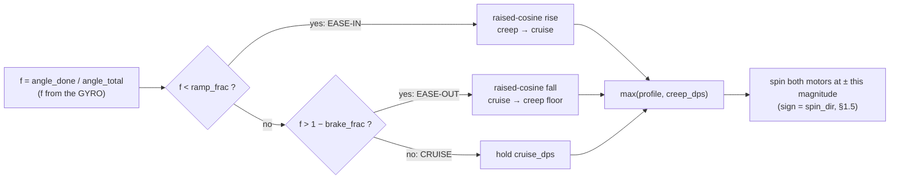
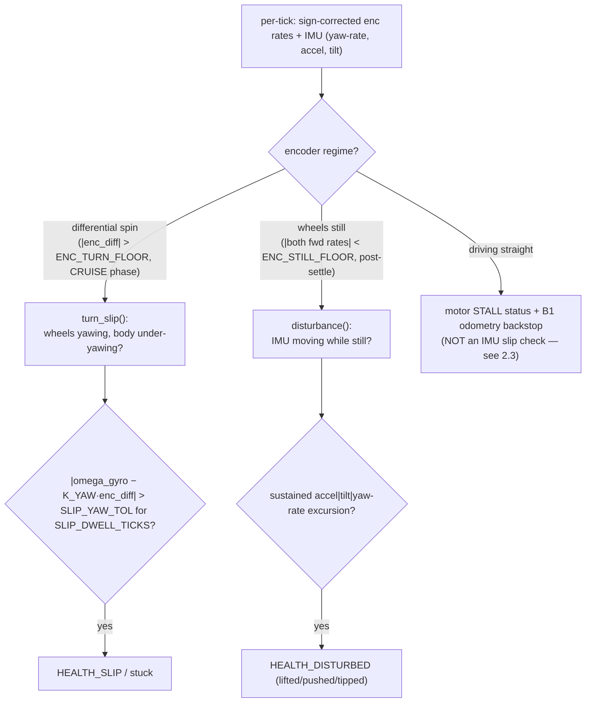
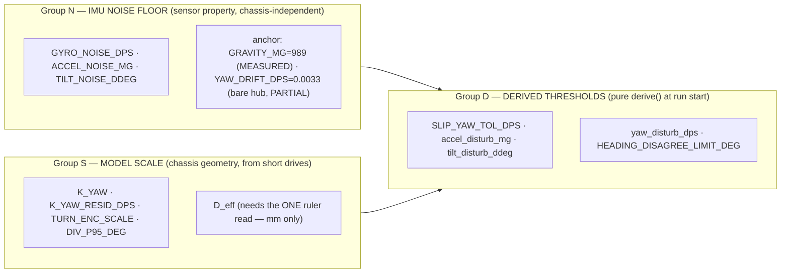
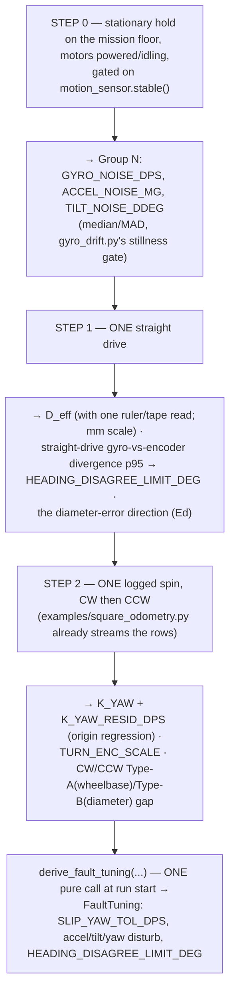

# Odometry fusion & health — distance, variable-rate turns, and IMU-vs-encoder fault detection

> **Type:** RESEARCH (design brief) · **Created:** 2026-09-01 · **Owner:** the **Programmer**
> **Designs to:** the chassis **as built and measured 2026-09-01** — differential drive (A = LEFT,
> B = RIGHT, id 48, **forward = A:−v, B:+v**, direct drive **1 rev = 360 enc-deg, no gearing**), a
> single **unidirectional rear roller caster** (rolls fore/aft, scrubs sideways on every in-place turn),
> a 6-axis IMU (`hub.motion_sensor`).
> **Refines, never replaces:** [motion-control-and-odometry.md](./motion-control-and-odometry.md) and
> [detection-odometry-coverage-2026-09-01.md](./detection-odometry-coverage-2026-09-01.md) §B (the
> scrubbing-caster odometry). Every change here is **additive**: `Odometry`, `heading_from_encoders`,
> `normalize_angle`, `cross_track_error_mm` keep their shapes; new helpers sit beside them.
> **Measured behaviour from:** [../findings/drive-checkpoint-2026-09-01.md](../findings/drive-checkpoint-2026-09-01.md)
> · [../findings/imu-characterisation-2026-08-27.md](../findings/imu-characterisation-2026-08-27.md).
> **Numbers land in:** [../plans/bench-measurement-plan.md](../plans/bench-measurement-plan.md) ·
> known-unknowns in [../plans/known-unknowns.md](../plans/known-unknowns.md).

**Two rules this brief obeys.** (1) **Everything is in encoder-degrees / dps / wheel-revs / raw IMU
units** (decidegrees, milli-g, deg/s) wherever mm is not yet convertible — **wheel diameter is
UNMEASURED** ([KU-M3], one ruler read pending), so there is no deg→mm scale and nothing here blocks on
it. (2) **No threshold is a typed-in number presented as measured.** Every threshold is **derived
symbolically from named constants** and tagged with the bench value it still needs. Confidence is split
into **structural** (is the shape of the rule sound?) and **measured** (has it been observed at the built
geometry? — almost always **zero**: no `motor_pair`, no profiled turn, and no motorised fault check has
ever executed on this hub).

**The operator's intent this serves.** (1) distance from wheel diameter; (2) a **variable/dynamic**
turn-rate profile, not a fixed spin; (3) **robust IMU+encoder odometry with fault detection** by
cross-checking the two sources — wheels spinning but IMU still ⇒ stuck/slipping; IMU moving but wheels
still ⇒ lifted/pushed/tipped; (4) **auto-tune** thresholds and scale factors from a few measured
constants. **Encoders are PRIMARY, the IMU CONFIRMS** — with one deliberate exception (turn termination,
§1.4).

---

## Contents

- [0. The one code-fact that gates everything: signs are applied, not assumed](#0-the-one-code-fact-that-gates-everything-signs-are-applied-not-assumed)
- [1. Distance and variable-rate turn kinematics](#1-distance-and-variable-rate-turn-kinematics)
- [2. Fault detection as small pure functions](#2-fault-detection-as-small-pure-functions)
- [3. Minimal self-tuning / calibration](#3-minimal-self-tuning--calibration)
- [4. New function signatures, by module](#4-new-function-signatures-by-module)
- [RECOMMENDED CHANGES to other files](#recommended-changes-to-other-files)
- [Unknowns](#unknowns)
- [Sources](#sources)

---

## 0. The one code-fact that gates everything: signs are applied, not assumed

The whole design rests on the mirror-mount sign convention, so state the code reality first, because it is
**not** what a companion note assumed.

**MEASURED** ([drive-checkpoint](../findings/drive-checkpoint-2026-09-01.md)): forward = `A:−v, B:+v`;
`LEFT_MOTOR_FORWARD_SIGN = −1`, `RIGHT_MOTOR_FORWARD_SIGN = +1`. The encoder table:

| Move | commanded A/B dps | raw Δ left (A) | raw Δ right (B) |
|---|---|---|---|
| FORWARD | −250 / +250 | **−366** | **+366** |
| TURN RIGHT (CW) | −250 / −250 | **−217** | **−217** |
| TURN LEFT (CCW) | +250 / +250 | **+217** | **+216** |

**Where the sign lives today, verified in the source, not assumed:**

- `hub_motors.drive()` **does NOT apply the mirror sign.** It clamps percent and scales by
  `DRIVE_MAX_DPS` — nothing else. The signs are **only a comment** beside the port map
  ([`src/hub_motors.py`](../../src/hub_motors.py) lines 52–56). *(This corrects a companion brief that
  claimed `drive()` "already multiplies by LEFT_FWD/RIGHT_FWD"; it does not — writes apply no sign today.)*
- `hub_motors.read_motor_degrees()` returns **raw port positions**, no sign applied.
- `odometry.Odometry.update()` differences the raw positions and takes a plain mean — so **fed the real
  mirrored encoders it computes ≈ 0 mm for a genuine forward move** (`−366` and `+366` average to zero).
  This is a **latent bug**, not a style point, and §1.1 is its fix.

**The rule, stated once, applied once each side:** `config` is the single source of truth for the two
signs. **Writes** apply them (add to `drive()`); **reads stay raw**, and **odometry applies the read-side
sign itself** at its difference step. One flip on the write path, one on the read path — never both, never
neither.

```
left_fwd  = LEFT_SIGN  * raw_left     # LEFT_SIGN  = −1
right_fwd = RIGHT_SIGN * raw_right     # RIGHT_SIGN = +1
```

**Two quantities fall out of the sign-corrected forward speeds, and getting them the wrong way round is
the single most damaging error in this whole design:**

| Quantity | Formula (sign-corrected) | FORWARD row | SPIN (CW) row |
|---|---|---|---|
| **Translation** (body forward) | `(left_fwd + right_fwd) / 2` | (366+366)/2 = **+366** | (217+(−217))/2 = **0** |
| **Yaw differential** (turning) | `right_fwd − left_fwd` | 366−366 = **0** | −217−217 = **−434** |

> **⚠ Sign-inversion guard (challenger PRIMARY correction, folded in).** In **raw** port terms the yaw
> differential is `raw_R + raw_L` (the **SUM**), because the motors are mirrored — **NOT** `raw_R − raw_L`.
> Raw `R − L` measures **forward translation** (~2v on a straight, ~0 on a spin): exactly backwards. Any
> cross-check, fit, or heading-from-encoders fed the raw port difference will see a huge differential on
> every straight (false "turn"/false slip everywhere) and ~0 during a real spin (slip never detected where
> it matters). **`heading_from_encoders(left, right)` in `odometry.py` already computes `(right − left)`,
> so it MUST be fed sign-corrected mm, never raw** — the same requirement §1.1 imposes on `update()`.

Everything below assumes this correction is in place.

---

## 1. Distance and variable-rate turn kinematics

### 1.1 Distance — mirror applied per wheel, then the mean

Direct drive is confirmed, so per-wheel ground distance is the existing `degrees_to_mm`, i.e.
`π·D·(ΔEnc/360)`, with the sign applied **before** the mean:

```
s_L      = LEFT_SIGN  * π * D * (ΔEnc_L / 360)
s_R      = RIGHT_SIGN * π * D * (ΔEnc_R / 360)
d_center = (s_L + s_R) / 2                       # body translation this tick
```

- `D = WHEEL_DIAMETER_MM` — still `[ASSUMED 56]`, one ruler read of the **effective rolling** diameter
  pending ([KU-M3]). **Until then, work in revs / encoder-deg** — `body_revs = mean signed revs` needs no
  `D` and is all the sweep needs to command a lane.
- **Fix `Odometry.update()`** to apply `left_sign`/`right_sign` at its difference step (constructor
  defaults from config; the old call form stays valid). This is the §0 latent-bug repair: without it a
  forward move integrates to ≈ 0 mm.
- `heading_from_encoders()` is unchanged in *form* — but it is now fed the **sign-corrected** `s_L, s_R`,
  so on a straight it correctly yields ~0° and on a spin a real heading change. (Reused, not rewritten.)

Pure helpers (host-runnable, no hub import): `signed_wheel_mm(...)`, `forward_distance_mm(...)`,
`body_revs(...)`. See §4.

### 1.2 Turns are GYRO-CLOSED — the one place "encoders primary" inverts

The unidirectional caster **must skid sideways in any in-place spin**, dragging the pivot rearward
(effective spin-track larger than geometric) and adding stick-slip. An encoder-geometry turn command
therefore under-rotates the body by a **systematic, surface-dependent, [UNVERIFIED]** amount (the coverage
brief brackets *several to >10°/90°*, anchored to the Prime Lessons overshoot figure — **never a
measurement of this chassis, never quote it downstream**). The gyro sees true body rotation regardless of
`b` or scrub.

**So the gyro TERMINATES the turn; the encoders keep measuring the wheels for the fault checks (§2) and
the degraded fallback.** Distance stays encoder-sourced; only the turn's terminal condition is gyro. This
matches the `odometry.py` docstring ("use the gyro for heading"), `examples/square_odometry.py`, and the
motion doc's "geometric command, gyro verify."

### 1.3 The variable-rate profile — ease-in / cruise / ease-out on the spin magnitude

The operator asked for a turn that is **not** a constant spin. One pure function shapes the spin
wheel-speed magnitude as a function of the **fraction of the turn the gyro says is done**, floored at a
non-zero creep:

```
turn_speed_profile(angle_done_deg, angle_total_deg, cruise_dps, creep_dps,
                   ramp_frac, brake_frac, shape="cosine") -> dps  (>= creep_dps)
```

- **Ease-IN** (`shape="cosine"` = raised-cosine, jerk-limited; `"trapezoid"` = linear ramp) breaks the
  caster's sideways stiction **gently** — a hard velocity step is the worst case for slip. Jerk-limited
  S-curves are the mobile-robot literature's remedy for exactly the ramp-end slip a scrubbing caster
  suffers (ResearchHub 2026-09-01: minimum-jerk / S-curve-vs-trapezoid velocity planning).
- **Ease-OUT** is where accuracy comes from. Overshoot scales with turn rate (Prime Lessons: **+8°@500 dps
  vs +2°@200 dps**), so **arriving at creep speed makes momentum overshoot small by construction**, not by
  a one-speed fudge.
- Because the fraction comes from the **gyro**, angle accumulated during ease-in counts toward the target
  — the ramp is absorbed by the closed loop, not spent as error.



### 1.4 The executor: settle-and-verify around the profile

The profile drives a coarse gyro target; a settle-and-verify loop converts "about 90°, systematic
overshoot" into "±TOL, bounded" — the only thing that survives the **48–132 turns** of a sweep.

```mermaid
stateDiagram-v2
    [*] --> Profile
    Profile: gyro-closed profiled spin toward target (§1.3)
    Profile --> Brake: gyro fraction reaches ~1
    Brake: active brake
    Brake --> Settle: sleep TURN_SETTLE_MS (capture the coast)
    Settle --> Read: err = normalize(target − yaw)
    Read --> Done: abs(err) <= TURN_TOL
    Read --> Creep: abs(err) > TURN_TOL and tries < TURN_MAX_TRIES
    Read --> Flag: tries == TURN_MAX_TRIES
    Creep: creep-correct −err at creep_dps
    Creep --> Settle
    Flag: record TURN_UNCONVERGED; light-matrix warning; CONTINUE
    Flag --> Done
    Done --> [*]
```

- **Settle before reading** — part of the overshoot is the robot still moving when the gyro is sampled.
  `TURN_SETTLE_MS` **MUST BE MEASURED** (stop, log yaw every 20 ms for 1 s, find the knee; start 200 ms).
  `square_odometry.py` already keeps sampling yaw for `SETTLE_MS = 600` post-stop.
- **`TURN_TOL` from lane length, not taste** — a residual `θ` costs `L·tan θ` on the next lane
  (`odometry.cross_track_error_mm`).
- **Cap retries and record the failure** — looping forever on Demo Day is the worst outcome
  (honest-instrumentation). `TURN_UNCONVERGED` is reported, not swallowed.
- **Compare with `<`/`>`, never `==`.** **Never animate the 5×5 matrix during the move** — it adds
  ~25°/360° of gyro contention.

**⚠ No coast datum exists.** The `~9°` drive-checkpoint figure is a **STARTUP-ramp shortfall** over a
timed move (250 dps × 1.5 s commanded 375°, logged 366°). It bounds the **start** ramp only and **may NOT
be borrowed for the stopping coast** — they are physically distinct and grow differently with speed.
`TURN_BRAKE_DEG` is therefore **symbolic**: `cruise_dps² / (2·TURN_DECEL_DPS2)`, `[UNVERIFIED]` until the
decel is benched. And a turn is **never** commanded as "constant dps for T seconds" (that eats the ramp as
error) — always as a gyro-closed profile.

### 1.5 Spin direction and the sweep-vs-odometry sign seam

**The mirror mount makes an in-place spin drive BOTH motors the SAME sign** — CONFIRMED by `drive_moves`:

- **CW / turn RIGHT:** `A:−v, B:−v` (both negative).
- **CCW / turn LEFT:** `A:+v, B:+v` (both positive).

This is counterintuitive and must be stated plainly. There are two heading-sign conventions in the tree:
`sweep.CMD_TURN` uses **positive = right** (value in degrees), while `odometry.Pose` is **CCW-positive =
left**. **Resolve the seam once, in the executor** (never scatter it into the pure math, and never into a
future heading-hold loop — a backwards steering sign fans a sweep out instead of holding it):

```
target   = normalize_angle(yaw − turn_deg)     # positive turn_deg ⇒ clockwise ⇒ yaw decreases
spin_dir = −sign(turn_deg)                      # both motors take spin_dir
```

`turn_speed_profile` and `normalize_angle` stay **frame-agnostic**.

### 1.6 Auto-tune the turn: `plan_turn()`

`plan_turn(turn_deg, lane_length_mm, cruise_dps, decel_dps2, drive_max_dps)` derives the turn's constants
from a few named measured values (operator intent #4), returning a dict:

- **cruise** = `min(TURN_CRUISE_DPS, headroom_frac · 930)`. **Cap below the 930 ceiling for
  overshoot/saturation** — a pure spin has no simultaneous differential correction to leave headroom for,
  so the reason is momentum/overshoot, not correction room. *(Challenger correction folded in.)*
- **TURN_TOL** from `lane_length` via `cross_track_error_mm` inverted.
- **TURN_BRAKE_DEG** = `cruise² / (2·TURN_DECEL_DPS2)` — symbolic, `[UNVERIFIED]`, needs the coast bench.
- **TURN_ENC_SCALE** (body-deg per encoder-deg of the sign-corrected wheel **differential**) from the
  CW/CCW closing spins — used **only** by the fault check (§2) and the degraded encoder-only path, never to
  execute a healthy turn.

Health checks are small pure functions: `turn_converged(residual, tol)` and
`gyro_stalled(enc_advanced, yaw_change, min_enc, min_yaw)` (§2.2).

---

## 2. Fault detection as small pure functions

Every check is a **pure function that takes readings and returns a status** — not a class, not a state
machine, not a framework (ADR-0005: "a health check is a function"). Each is **host-runnable and
replayable against a logged CSV**, which is how it is verified without the robot. Status is a plain string
constant: `HEALTH_OK`, `HEALTH_SLIP`, `HEALTH_STALL`, `HEALTH_DISTURBED` (no `enum`).

The two checks are **gated by encoder regime** so they are active in different regimes and cannot trip
each other:



### 2.1 The discriminants

**Slip / stuck — `turn_slip(enc_diff_dps, omega_gyro_dps, tuning) -> bool`.**
The wheels are turning **differentially** (a commanded spin) but the body is **not yawing** as the wheels
predict:

```
omega_pred = K_YAW * enc_diff_dps           # enc_diff_dps = right_fwd_dps − left_fwd_dps  (SIGN-CORRECTED)
slip       = abs(omega_gyro_dps − omega_pred) > SLIP_YAW_TOL_DPS   # for SLIP_DWELL_TICKS ticks
```

Because `omega_pred` reads the **instantaneous** encoder differential, the prediction tracks **whatever
turn profile** §1.3 follows — a dynamic turn-rate needs **no** change to the check. This is the strong arm.

**Lifted / pushed / tipped — `disturbance(enc_left_dps, enc_right_dps, accel_mg, d_tilt_ddeg,
yaw_rate_dps, tuning) -> str|None`.**
The wheels are **still** but the IMU shows motion on some axis. Generalises `gyro_drift.py`'s 25 mg
gravity-contamination gate to three axes, each with an auto-tuned threshold:

```
if |accel_mg| deviates from GRAVITY_MG by > accel_disturb_mg   (SUSTAINED)  -> "lifted/tipped/pushed"
if |d_tilt_ddeg|                        > tilt_disturb_ddeg                  -> "tipped/ramp"
if |yaw_rate_dps|                       > yaw_disturb_dps                    -> "pushed/rotated"
else None
```

### 2.2 Turn-completion health checks (from §1)

- `turn_converged(residual_deg, tol_deg) -> bool` — pure, the executor's Done test.
- `gyro_stalled(enc_advanced_deg, yaw_change_deg, min_enc_deg, min_yaw_deg) -> bool` — wheels advanced but
  yaw frozen during a **commanded** spin ⇒ the gyro is stuck-at-zero; fall back to
  `encoder_turn_to_body_deg()`. **Gated to the CRUISE phase only** (see 2.3, guard 5).

### 2.3 False-trigger guards — the load-bearing corrections

These are the reason a naive version of this design should **not** be adopted verbatim. Each is a real
false trigger on **this** chassis; each has a guard.

1. **Sign inversion (§0).** Feed `turn_slip` / `estimate_k_yaw` / `heading_from_encoders` the
   **sign-corrected** differential `right_fwd − left_fwd` (raw-port equivalent: `raw_R + raw_L`). Fed the
   raw port difference, `turn_slip` fires on **every straight** (raw `R−L` ≈ 2v) and never during a real
   spin (raw `R−L` ≈ 0), and `estimate_k_yaw` regresses gyro against ~0 → divide-by-near-zero → garbage
   `K_YAW`. **Verify at the bench:** on a pure spin the corrected differential must be large; on a straight
   it must be ~0 (raw is the opposite). *Most severe of the six.*

2. **The accelerometer cannot see constant velocity.** A robot driving straight and one stuck-going-
   straight look nearly identical to a low-frequency IMU (gravity steady, yaw steady). **There is no
   honest IMU straight-line slip detector.** The reliable straight signal is the **motor's own STALL
   status** (`motor.status()==STALLED`, `velocity()≈0`) plus the B1 odometry backstop — encoder-primary,
   no IMU. Overclaiming an IMU straight-slip detector violates honest-instrumentation; the driving-
   vibration-collapse signal stays tagged `[UNVERIFIED]`.

3. **`disturbance()` at end-of-move.** A hard brake leaves the chassis **rocking/rebounding** while the
   encoders already read ~0 — an accel/tilt transient that trips "pushed/tipped/lifted" at **every normal
   stop**. Guard: require a **post-stop SETTLE debounce** (a few ticks after enc goes still before
   `disturbance()` arms), **blank during commanded decel**, and **key on a SUSTAINED gravity change**, not
   a one-tick spike. Note the stationary noise floor (§3) does **not** capture the decel-settling
   transient.

4. **G1 heading-disagreement trips a healthy caster on turns.** `heading_disagreement_deg()` has **no
   gate** today; the caster inflates the gyro-vs-encoder gap **on turns by design**. Guard: **evaluate G1
   on straight segments only** (`CMD_DRIVE`); suppress it during `CMD_TURN`; fold the caster's baseline
   turn-scrub into `HEADING_DISAGREE_LIMIT_DEG` via `TURN_ENC_SCALE`.

5. **The gyro deadband makes a slow healthy turn look stuck.** `angular_velocity()` reads **exactly 0** at
   rest ([imu-characterisation §5.5]); a slow healthy turn — or a gentle heading-hold correction whose
   differential exceeds `ENC_TURN_FLOOR_DPS` while the true rate sits inside the deadband — can hold yaw
   ~constant and false-flag SLIP/STUCK. Guard: **gate `turn_slip` / `gyro_stalled` to the CRUISE phase**
   (ease-in/ease-out/creep are low-rate by design), require `enc_diff_dps > ENC_TURN_FLOOR_DPS` **and** a
   short `SLIP_DWELL_TICKS`. **Do not lower these thresholds until a motorised slow turn is watched with
   encoders as reference.** Record which source feeds `omega_gyro` (`angular_velocity()` is the deadbanded
   one; a `normalize_angle`-differenced `tilt_angles()` yaw may be filtered differently — unknown).

6. **Turn-onset ramp lag.** At a turn's start the encoders **lead** the body (the ~9° startup ramp is this
   effect); `turn_slip` could read "wheels spinning, body not yet yawing." It is absorbed only by
   `SLIP_DWELL_TICKS`, itself `[ASSUMED]` and **unvalidated against that ramp datum** — flag it, bench it.

---

## 3. Minimal self-tuning / calibration

Every threshold above is **derived at run start by a pure `derive_fault_tuning()`**, never hand-set. The
coupling story the operator asked about is the **grouping**: a wheel-diameter change is provably a *scale*
event and never a *threshold* event, because diameter never reaches the noise/threshold groups.

### 3.1 Three constant groups, one invariant anchor



- **Group N is the anchor** because the noise floor belongs to the **MEMS part, not the robot** — no
  chassis change moves it. Fault thresholds live in Group N/D (IMU units: mg, dps, ddeg, or pure angles).
- **Scale factors live in Group S** (mm, wheel-deg, dimensionless). **A wheel-diameter change rescales only
  Group S**, never a threshold.

### 3.2 `K_YAW` — the single cross-check gain, measured directly, diameter-free

```
K_YAW = omega_gyro / (right_fwd_dps − left_fwd_dps)      # body-yaw-rate per SIGN-CORRECTED differential-rate
```

Measured directly from a logged spin by **regression through the origin**, **not** computed from geometry.
Two reasons this is the right primitive:

1. **Diameter-free** — available the first bench session, before the ruler settles `D`.
2. **It bakes the caster in automatically** — the scrubbing roller inflates the effective spin track, so
   the measured `K_YAW` comes out **below** the geometric `D/(2b)` (≈0.16 for the assumed D=56, b=176, a
   doubly-assumed lower-bound sanity number only); the deficit quantifies the caster for free.

The **RMS fit residual** `K_YAW_RESID_DPS` is the trustworthiness measure and feeds `SLIP_YAW_TOL_DPS`. A
**bending** regression line is the direct signature that the pivot moves through the turn — `b` is not a
scalar for this chassis — so keep `TURN_ENC_SCALE` provisional until the residuals are seen.

> **Keep the PREDICTION GAIN and the TOLERANCE separate — never one fused "slip threshold."**
> `K_YAW` (Group S, diameter-coupled) predicts the yaw; `SLIP_YAW_TOL_DPS` (Group D, noise-derived,
> diameter-independent) is how far off is a fault. A single fused threshold would silently re-tune the
> tolerance every time the wheel changed — the exact coupling to forbid.

### 3.3 N-sigma from MAD, with a MANDATORY deadband floor

```
sigma_band(mad, n_sigma, floor) = max( 1.4826 * n_sigma * mad , floor )     # 1σ = MAD / 0.6745
SLIP_YAW_TOL_DPS = max( quadrature(GYRO_NOISE_DPS_band, K_YAW_RESID_DPS) , YAW_RATE_FLOOR_DPS )
```

- The `0.6745` MAD-vs-SD conversion is the **1.48 trap** that has bitten this project repeatedly
  (`calibration.py`'s own comments) — done **once**, named once.
- **The floor is not decorative — it is mandatory.** `angular_velocity()` reads exactly 0 at rest, so
  `MAD = 0`, so a pure `N·MAD` band is 0, which would **trip every tick**. The `max(band, sensor floor)`
  is what stops that. The sensor floors (`ACCEL_FLOOR_MG`, `YAW_RATE_FLOOR_DPS`, `TILT_FLOOR_DDEG`,
  `ENC_TURN_FLOOR_DPS`, `ENC_STILL_FLOOR_DPS`) are themselves `[ASSUMED]` and must be **measured**, since
  they set the minimum any auto-tuned threshold can reach.
- The slip tolerance combines gyro noise and the `K_YAW` fit residual **in quadrature** because it compares
  the gyro against a `K_YAW`-scaled prediction.

`FAULT_SIGMA` default `6.0` is defensible (`gyro_drift.py`'s 25 mg gate is ~11× its 2.2 mg worst
deviation) but the right `N` is unknown until a healthy driving run's residual distribution is seen — tune
it against a real run, not a priori.

### 3.4 Measure the noise floor ON THE CHASSIS, with motors powered

The number that actually governs the thresholds is the noise a **driving robot's electronics and idle
motors** inject ([KU-M28]) — genuinely unmeasured. Treat the 2026-08-27 **bare-hub** figures (2.2 mg,
0.0033 deg/s, USB, no motors, cool) as **optimistic best-case `[ASSUMED]` placeholders**; deriving
thresholds from bare-hub noise would set them dangerously tight.

### 3.5 The calibration procedure — three short drives, then one pure call



- **Step 0 sets Group N.** The wheels-still precondition on `disturbance()` is exactly why the
  **stationary** floor is the correct anchor for it — the check only runs when not driving.
- **Step 1** is clean on a straight (no scrub), except a forward/reverse asymmetry (backlash/drag) that
  must be *checked* (M3.7), not assumed away.
- **Step 2** — `K_YAW` and `TURN_ENC_SCALE` are **diameter-free**, so the whole fault half is available
  with `D` still unmeasured and the units of "10×10" still unknown.

### 3.6 Which thresholds are independent of wheel diameter

**This is the operator's guarantee, made concrete:**

| Constant | Units | Diameter-coupled? | A wheel change… |
|---|---|---|---|
| `GYRO_NOISE_DPS`, `ACCEL_NOISE_MG`, `TILT_NOISE_DDEG` | dps / mg / ddeg | **No** | untouched |
| `SLIP_YAW_TOL_DPS`, `accel_disturb_mg`, `tilt_disturb_ddeg`, `yaw_disturb_dps` | dps / mg / ddeg | **No** | untouched |
| `HEADING_DISAGREE_LIMIT_DEG`, `TURN_ENC_SCALE` | pure angle / dimensionless | **No** | untouched |
| `K_YAW` | dps / dps | **No** (measured as a ratio) | re-run the 20 s spin, or unchanged if only the ratio is used |
| `D_eff` and every **mm** magnitude | mm | **Yes** | rescales — one ruler read |

So a diameter change is a **scale** event (rescale `D_eff`, at most re-run one spin) and **never** a
threshold event. The **only** thing that waits on the ruler is the mm distance scale.

---

## 4. New function signatures, by module

All **pure** (host-runnable, no hub import) unless marked HUB-FACING. All thresholds default from
`config` and are `[ASSUMED]` until the bench GATE runs.

| Module | Signature | Purpose |
|---|---|---|
| `src/odometry.py` | `signed_wheel_mm(dEnc_L_deg, dEnc_R_deg, diameter_mm=None, left_sign=None, right_sign=None) -> (s_L, s_R)` | mirror-applied per-wheel signed ground distance |
| `src/odometry.py` | `forward_distance_mm(dEnc_L_deg, dEnc_R_deg, diameter_mm=None, left_sign=None, right_sign=None) -> float` | body translation `(s_L+s_R)/2` |
| `src/odometry.py` | `body_revs(dEnc_L_deg, dEnc_R_deg, left_sign=None, right_sign=None) -> float` | mean signed revolutions; **no D** — the sweep-command quantity |
| `src/odometry.py` | `Odometry.__init__(..., left_sign=None, right_sign=None)` + apply at the `update()` difference step | store & apply the mirror signs (fixes the §0 latent bug; old call form valid) |
| `src/odometry.py` | `turn_speed_profile(angle_done_deg, angle_total_deg, cruise_dps, creep_dps, ramp_frac, brake_frac, shape="cosine") -> float` | ease-in/cruise/ease-out spin magnitude, floored at creep (S-curve or trapezoid) |
| `src/odometry.py` | `plan_turn(turn_deg, lane_length_mm=None, cruise_dps=None, decel_dps2=None, drive_max_dps=None) -> dict` | auto-tune cruise / TOL / brake / ramp / TURN_ENC_SCALE from named constants |
| `src/odometry.py` | `encoder_turn_to_body_deg(enc_diff_deg, turn_enc_scale=None) -> float` | DEGRADED encoder-only body angle (stuck gyro only) |
| `src/odometry.py` | `turn_converged(residual_deg, tol_deg) -> bool` | health check |
| `src/odometry.py` | `gyro_stalled(enc_advanced_deg, yaw_change_deg, min_enc_deg, min_yaw_deg) -> bool` | stuck-gyro-during-spin (CRUISE-gated) |
| `src/odometry.py` | `class FaultTuning(...)` | derived-threshold bundle (auto-tune output) |
| `src/odometry.py` | `sigma_band(mad, n_sigma, floor) -> float` | N-sigma-from-MAD with the mandatory floor; the 1.48 conversion named once |
| `src/odometry.py` | `derive_fault_tuning(gyro_noise_dps, accel_noise_mg, tilt_noise_ddeg, k_yaw, k_yaw_resid_dps, div_p95_deg, n_sigma=None) -> FaultTuning` | the auto-tune, run once at run start |
| `src/odometry.py` | `turn_slip(enc_diff_dps, omega_gyro_dps, tuning) -> bool` | wheels differentially spinning, body under-yawing ⇒ slip/stuck (instantaneous ⇒ variable profile free) |
| `src/odometry.py` | `disturbance(enc_left_dps, enc_right_dps, accel_mg, d_tilt_ddeg, yaw_rate_dps, tuning) -> str\|None` | wheels still + IMU moving ⇒ lifted/pushed/tipped (post-settle gate) |
| `src/odometry.py` | `HEALTH_OK/SLIP/STALL/DISTURBED = "ok"/"slip"/"stall"/"disturbed"` | plain string status constants (no enum) |
| `src/hub_imu.py` | (no new signatures) — consumers of `read_yaw_deg()` route deltas through `normalize_angle`; `omega_gyro` source is `angular_velocity()` **or** differenced `tilt_angles()` yaw, and which one is recorded | the deadband caveat (5.5) rides here |
| `src/config.py` | new constants (Groups N/S/D + turn-profile block + floors) | see RECOMMENDED CHANGES |
| `data_analysis/motion.py` | `estimate_k_yaw(enc_diff_dps, omega_gyro_dps) -> (k_yaw, rms_resid)` | log-side K_YAW + trust residual by origin-regression; **`enc_diff_dps` must be sign-corrected** |

**Where the split falls:** the pure run-time consumers live in **`src/odometry.py`** (already the pure
motion-math home holding `heading_disagreement_deg`); the log-side estimator lives in
**`data_analysis/motion.py`**; `src/calibration.py` stays colour-only (its `median`/MAD helpers are reused
for the Group-N stats). A HUB-FACING `examples/turn_to_heading.py` executor (§1.4) is **bench-first, not
part of this Write task** — see RECOMMENDED CHANGES.

---

## RECOMMENDED CHANGES to other files

**Not applied here — this brief writes only itself (collision safety).** Each is a proposal for the
operator.

- **`docs/research/INDEX.md`** — *(edited by this task: the one other file)* add a summary row for this
  brief. REQUIRED or `./scripts/check-docs.py` INDEX coverage flags the new doc.

- **[`src/config.py`](../../src/config.py)** — add, with each derivation in its comment:
  - **Drivetrain:** `LEFT_MOTOR_FORWARD_SIGN = −1`, `RIGHT_MOTOR_FORWARD_SIGN = +1` (MEASURED 2026-09-01).
  - **Turn-profile block:** `TURN_CRUISE_DPS (~200)`, `TURN_CREEP_DPS (~80)`, `TURN_RAMP_FRAC (~0.25)`,
    `TURN_BRAKE_FRAC (~0.30)` or `TURN_BRAKE_DEG`, `TURN_TOL_DDEG (~20)`, `TURN_SETTLE_MS (~200)`,
    `TURN_MAX_TRIES (3)`, `TURN_DECEL_DPS2 (1000, UNVERIFIED)`. Comment that `TURN_CRUISE_DPS` (plateau)
    differs from the existing `TURN_RATE_DPS` (time-estimate mean).
  - **Group N:** `GYRO_NOISE_DPS`, `ACCEL_NOISE_MG`, `TILT_NOISE_DDEG` (`[ASSUMED]`, "MEASURE with motors
    on the floor"), `YAW_DRIFT_DPS = 0.0033` (MEASURED 2026-08-27, PARTIAL/KU-M28),
    `GRAVITY_MG = 989.0` (MEASURED).
  - **Group S:** `K_YAW`, `K_YAW_RESID_DPS`, `TURN_ENC_SCALE`, `DIV_P95_DEG` (`[ASSUMED]`, KU-M27).
  - **Group D policy + floors:** `FAULT_SIGMA = 6.0`, `ACCEL_FLOOR_MG = 15.0`, `YAW_RATE_FLOOR_DPS = 1.0`,
    `TILT_FLOOR_DDEG = 10.0`, `ENC_TURN_FLOOR_DPS = 30.0`, `ENC_STILL_FLOOR_DPS = 10.0`,
    `SLIP_DWELL_TICKS = 3`, `SETTLE_DEBOUNCE_TICKS (~3)` — **each is an [ASSUMED] placeholder, none is
    measured**, every one needs a bench value.
  - **Reframe `STUCK_YAW_TICKS = 50`:** mark it superseded by `turn_slip()` (model residual +
    `SLIP_DWELL_TICKS`), kept only as the degraded encoder-only fallback; retain the KU-M19 deadband
    caveat. Change the `HEADING_DISAGREE_LIMIT_DEG` comment to say it is **DERIVED** from `DIV_P95_DEG` at
    run start, evaluated on **straight segments only**.

- **[`src/odometry.py`](../../src/odometry.py)** — add the pure signatures in §4; extend
  `Odometry.__init__`/`update()` to apply `left_sign`/`right_sign` at the difference step **(this is the
  §0 latent-bug fix — a forward move currently integrates to ≈0 mm)**; update `heading_disagreement_deg()`
  docstring: threshold now the straight-drive p95, grows on turns by design (caster), callers gate it to
  straights. Stays pure — no hub import.

- **[`src/hub_motors.py`](../../src/hub_motors.py)** — **add sign application inside `drive()`** from the
  new config constants (writes apply no sign today — the comment is not code); replace the hard-coded
  `LEFT_FWD/RIGHT_FWD` **comment** with references to the config constants (single source of truth); add
  one comment stating reads are raw, writes are signed, odometry applies the read-side sign (**no double
  flip**).

- **[`src/sweep.py`](../../src/sweep.py)** — at the `CMD_TURN` docstring, add a wiring note: the executor
  maps positive = right to the CCW-positive odometry frame (`target = yaw − turn_deg`,
  `spin_dir = −sign(turn_deg)`) and the mirror makes **both** motors take `spin_dir`. No state-machine
  change.

- **[`examples/turn_to_heading.py`](../../examples/drive_moves.py)** *(new bench-first program — path
  shown against the sibling it mirrors; NOT written by this task)* — the gyro-closed profiled-turn executor
  with the same safety scaffolding as `drive_moves.py` / `square_odometry.py` (port-present abort, arm
  countdown, try/finally stop, timeouts, raw streaming). File its output under `docs/findings/runs/`
  before it becomes mission code (ADR-0005).

- **`data_analysis/motion.py`** *(new/extended; path in text, no link — existence not confirmed)* — add
  `estimate_k_yaw()` into the constants block; emit `K_YAW`, its RMS residual, and the CW/CCW Type-A/B gap
  alongside `D_eff`, `b_hat`, gyro scale `k`. **Feed it the sign-corrected differential.**

- **[`docs/plans/bench-measurement-plan.md`](../plans/bench-measurement-plan.md)** — add the GATEs:
  Step-0 stationary hold **with motors powered** (Group N); `TURN_SETTLE_MS` knee (yaw @20 ms × 1 s
  post-stop); **DECEL-COAST in encoder-deg at cruise and creep** (the datum that does NOT exist — do not
  reuse the 9°); caster breakaway dps (the creep floor); overshoot vs cruise at 100/200/300/500 dps CW and
  CCW (→ `TURN_CRUISE_DPS`, `TURN_ENC_SCALE`, Type A/B); a **slow motorised turn watched with encoders** to
  validate `ENC_TURN_FLOOR_DPS`/`SLIP_DWELL_TICKS` against the deadband; the wheel-diameter ruler read.

- **[`docs/plans/known-unknowns.md`](../plans/known-unknowns.md)** — cross-link this brief on KU-M3
  (diameter — the fault half is diameter-free), KU-M9 (driving drift), KU-M19 (deadband), KU-M27 (K_YAW),
  KU-M28 (on-chassis noise floor).

---

## Unknowns

- **`WHEEL_DIAMETER_MM` (D) is UNMEASURED** ([KU-M3]) — one ruler read of the effective rolling diameter,
  per surface. Every mm magnitude waits on it; the **fault half of this design is diameter-free** and does
  not. Distance stays in encoder-revs until then.
- **The caster under-rotation per commanded turn is `[UNVERIFIED]`** (bracket *several to >10°/90°* from a
  figure, **not** this chassis) — why turns are gyro-closed; **never quote it downstream**.
- **No decel-coast datum exists.** The ~9° figure is a **startup**-ramp shortfall, not a stopping coast;
  `TURN_BRAKE_DEG` stays symbolic until the coast is benched at cruise and creep.
- **Every turn threshold is `[ASSUMED]` and measured at zero** — no `motor_pair` or profiled turn has ever
  executed on this hub.
- **Every Group-D/floor number is an `[ASSUMED]` placeholder** (`FAULT_SIGMA`, `ACCEL_FLOOR_MG`,
  `YAW_RATE_FLOOR_DPS`, `TILT_FLOOR_DDEG`, `ENC_TURN_FLOOR_DPS`, `ENC_STILL_FLOOR_DPS`, `SLIP_DWELL_TICKS`,
  `SETTLE_DEBOUNCE_TICKS`) with false precision — none is derived from a measurement.
- **Group-N noise on the chassis with motors powered is unmeasured** ([KU-M28]); the only data (2.2 mg,
  0.0033 deg/s) is bare-hub best-case and will not survive a moving robot.
- **`K_YAW` and its residual are unmeasured** ([KU-M27]); geometric `D/(2b)≈0.16` is a doubly-assumed
  lower-bound sanity number only. Whether the regression line **bends** (b not a scalar) is unknown until
  the spin is logged.
- **Drift WHILE DRIVING/TURNING is unmeasured** ([KU-M9] PARTIAL) — decides whether the gyro can be trusted
  to close a turn over a run; the caster turn-scrub is a suspected contributor.
- **The `angular_velocity()==0` deadband** (imu-characterisation §5.5) could make a healthy slow turn look
  stuck — do not lower the stuck-gyro thresholds until a motorised slow turn is watched with encoders.
- **The sweep(positive=right) vs odometry(CCW-positive) seam** is a runner/`main.py` wiring decision; a
  backwards steering sign fans a sweep out, so settle it before trusting any bench drift measurement.
- **`TURN_ENC_SCALE` folds the caster into a Type-A turn-scale ONLY if the CW/CCW regression is
  non-bending** — a bending line means the pivot moves through the turn; keep it provisional.
- **The straight-line slip arm's IMU signal (driving-vibration collapse) is `[UNVERIFIED]`** — straight-
  line stuck detection leans on motor stall status + the B1 backstop, not the IMU.

---

## Sources

- [../findings/drive-checkpoint-2026-09-01.md](../findings/drive-checkpoint-2026-09-01.md) — MEASURED:
  A=LEFT/B=RIGHT, forward A:−v B:+v, direct drive 1 rev = 360 enc-deg, 930 dps ceiling, the FWD/BACK/TURN
  encoder table, the ~9° startup-ramp shortfall.
- [../findings/imu-characterisation-2026-08-27.md](../findings/imu-characterisation-2026-08-27.md) — yaw
  decidegrees, ±180 wrap, 1.35 ms IMU tick, 0.0033 deg/s stationary drift (bare hub), the
  `angular_velocity()==0` deadband caveat, `gyro_drift.py`'s contamination gate.
- [motion-control-and-odometry.md](./motion-control-and-odometry.md) — geometric-command + gyro-verify
  turn, overshoot +8@500 / +2@200 dps, settle-and-verify, light-matrix 25°/360° contention, UMBmark
  Type A/B algebra.
- [detection-odometry-coverage-2026-09-01.md](./detection-odometry-coverage-2026-09-01.md) §B — scrubbing
  caster (gyro-closed turns, `TURN_ENC_SCALE`, two effective tracks, G1 suppressed on turns), §D.5 the
  no-coast-datum correction, `r_max = 2ev/L²`.
- [`src/odometry.py`](../../src/odometry.py), [`src/config.py`](../../src/config.py),
  [`src/hub_motors.py`](../../src/hub_motors.py), [`src/hub_imu.py`](../../src/hub_imu.py),
  [`src/sweep.py`](../../src/sweep.py), [`src/calibration.py`](../../src/calibration.py) — the code every
  formula and signature maps onto.
- [`examples/square_odometry.py`](../../examples/square_odometry.py),
  [`examples/drive_moves.py`](../../examples/drive_moves.py),
  [`examples/gyro_drift.py`](../../examples/gyro_drift.py) — CONFIRMED spin sign mapping (both motors same
  sign), the gyro-closed spin with `SETTLE_MS`, the disturbance-gate ancestor.
- [../plans/analysis-motion-quality.md](../plans/analysis-motion-quality.md) — the `b_hat`/`k` regression
  and divergence-channel contract `estimate_k_yaw()` extends.
- Siegwart, Nourbakhsh & Scaramuzza, *Introduction to Autonomous Mobile Robots* §3.2 — differential-drive
  forward kinematics (body velocity = mean of wheel velocities, heading rate = difference over track).
- Borenstein & Feng, UMBmark (SPIE 1995) & Correction of Systematic Odometry Errors (IROS 1995) — scale
  error dD/D, Type A wheelbase vs Type B diameter fault signatures. Corpus:
  [papers/INDEX.md](./papers/INDEX.md).
- ResearchHub 2026-09-01: minimum-jerk velocity planning; S-curve vs trapezoidal velocity profiles;
  jerk-limited planning for AGVs — the ease-in/ease-out profile choice.
