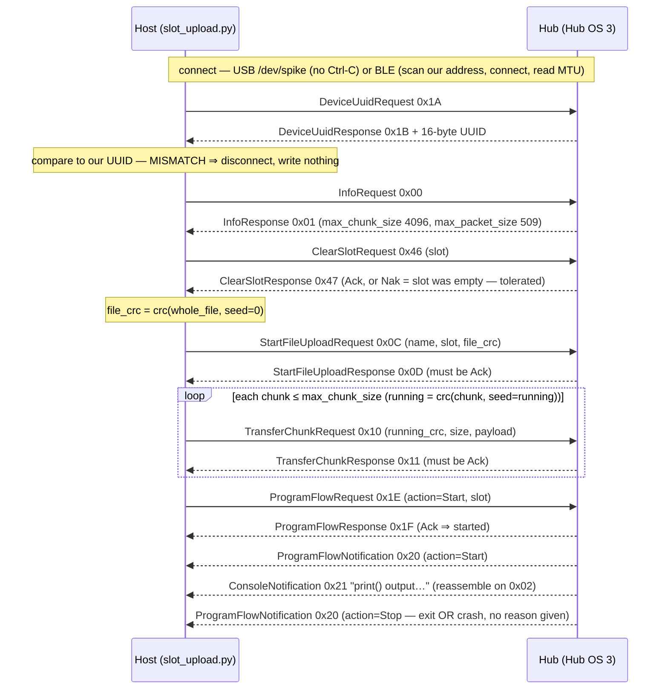

# Research — SPIKE Prime program-SLOT upload & start protocol

**What this answers.** How to store a `.py` program in a Hub OS *program slot* and **run it**, over the
LEGO binary control protocol — the capability the REPL/module route (ADR-0007) does **not** give us,
because `/flash/main.py` does **not** autorun (measured after a real power cycle: KU-M16). The same
frames drive it over USB and over BLE.

**Client:** [`../../hub_programmer/slot_upload.py`](../../hub_programmer/slot_upload.py) (host, CPython;
imports framing from [`../../probes/_cobs.py`](../../probes/_cobs.py)).

> ## STATUS: primary-source + host-checked, **NOT run on our hub**
>
> Every message layout below is taken from **LEGO/spike-prime-docs** (a primary source) and
> cross-checked on the host: framing round-trips through `probes/_cobs.py`, `InfoRequest` frames to the
> known-good `00 00 02`, the CRC matches `binascii.crc32`, and an `InfoResponse` parses to our measured
> values. **The whole upload+start sequence has never been exercised against our hardware** — hardware
> was forbidden for this task. Anything the hub itself would confirm is **[UNVERIFIED]** (§ 6). The
> proven deploy route remains ADR-0007 (write a module to `/flash/lib` over the REPL).
>
> Governing rules: [../directives/hardware-safety.md](../directives/hardware-safety.md) ·
> [../decisions/0001-stock-lego-firmware-only.md](../decisions/0001-stock-lego-firmware-only.md) ·
> Ground truth this builds on: [../findings/ble-protocol-2026-08-27.md](../findings/ble-protocol-2026-08-27.md) ·
> Framing: [../findings/hub-first-contact-2026-08-27.md](../findings/hub-first-contact-2026-08-27.md)

---

## 0. Why a slot, and why it is not a firmware risk

There are two filesystem write paths to a stock-firmware hub. Neither changes firmware.

| | ADR-0007 (proven) | Slot upload (this doc) |
|---|---|---|
| Writes | a module into `/flash/lib` | a program into a numbered **slot** (0..19) |
| Mechanism | base64 chunks over the **REPL** (sends Ctrl-C first) | the **binary control protocol** (never Ctrl-C) |
| Runs? | `import`-able; does **not** run standalone | Hub OS **runs** it via `ProgramFlowRequest` |
| Status | **PROVEN** on our hub 2026-08-27 | **UNTESTED** on our hub |

**Firmware ≠ `/flash`.** The firmware is the MicroPython binary in the STM32F413's internal flash;
changing it needs DFU/bootloader, which is blacklisted. Storing a program in a slot is a *filesystem
write*, the same class of operation as ADR-0007 — proved harmless there by baseline diff
([../findings/firmware-integrity-proof.md](../findings/firmware-integrity-proof.md)). The genuinely
dangerous messages are the **firmware** ones — `StartFirmwareUploadRequest 0x0A` and
`BeginFirmwareUpdateRequest 0x14` — which sit right next to the file-upload id `0x0C` in the id space.
The client refuses to emit `0x0A/0x0B/0x14/0x15` at all (`FIRMWARE_IDS` guard in `send()`). **Never
send those.**

**Ctrl-C warning.** The REPL tools (`probes/`, `hub_programmer/upload.py`) send Ctrl-C to get a `>>>`.
This protocol is the opposite: it is driven by the running Hub OS, and Ctrl-C would kill the Hub OS.
Measured 2026-08-27: `DeviceUuidRequest` answered over `/dev/spike` at 115200 **without any Ctrl-C**.

---

## 1. Transport and framing (already validated on our hardware)

Same for both transports; only the byte pipe differs.

- **USB:** `/dev/spike` (VID:PID `0694:0009`), 115200 8N1. Point-to-point, always available while
  tethered, **cannot hit another team's hub** — develop here first.
- **BLE:** service `0000fd02-…`; write-without-response char `…-0001` (host→hub), notify char `…-0002`
  (hub→host). Untethered path for a driving robot.
- **Framing:** LEGO's XOR-COBS — delimiter `0x02`, `NO_DELIMITER 0xFF`, `COBS_CODE_OFFSET 0x02`,
  `MAX_BLOCK_SIZE 84`, whole frame XOR 3. Implemented and hardware-validated both directions in
  `probes/_cobs.py`. `pack()` appends the `0x02` delimiter; the receive side buffers bytes, `split_frames()`
  splits on `0x02` (stripping it), then `unpack()` decodes each frame. **`pack`/`unpack` are not direct
  inverses** — `unpack` expects the delimiter already stripped, which is exactly what `split_frames`
  does. This same buffer-and-split loop is what reassembles fragmented `ConsoleNotification`s.

All message fields are **little-endian**; strings are **NUL-terminated** (messages.rst).

---

## 2. Messages (IDs, fields, widths — all confirmed against LEGO/spike-prime-docs)

Requests are host→hub; responses/notifications hub→host. `struct` formats are the reference client's.

### Handshake / identity (read-only; both exercised on our hub)

| Msg | ID | `struct` | Fields |
|---|---|---|---|
| **InfoRequest** | `0x00` | `<B` | id only. Frames to `00 00 02`. Send **first** on every connection. |
| **InfoResponse** | `0x01` | `<BBBHBBHHHHH` (17 B) | id, rpc maj, rpc min, rpc build(u16), fw maj, fw min, fw build(u16), **max_packet_size**(u16), **max_message_size**(u16), **max_chunk_size**(u16), product_group_device(u16). Our hub: rpc 1.0.47, fw 1.8.149, **509 / 5000 / 4096**. |
| **DeviceUuidRequest** | `0x1A` | `<B` | id only. |
| **DeviceUuidResponse** | `0x1B` | `<B` + `uint8[16]` | id, then 16-byte device UUID. Compare to `03970000-3600-1B00-1450-30514B323320` to **prove** our hub. |

### Upload + start (from LEGO docs + reference client; **not** run on our hub)

| Msg | ID | `struct` | Fields |
|---|---|---|---|
| **ClearSlotRequest** | `0x46` | `<BB` | id, slot (u8, 0..19). |
| **ClearSlotResponse** | `0x47` | `<BB` | id, status (`0x00` Ack / `0x01` Nak). **Nak tolerated** = slot was already empty. |
| **StartFileUploadRequest** | `0x0C` | `<B{n+1}sBI` | id, **name + one NUL** (variable width, ≤31 name bytes; *not* padded to 32), slot (u8), **whole-file CRC32** (u32 LE). |
| **StartFileUploadResponse** | `0x0D` | `<BB` | id, status. Must be **Ack** before chunks. No resume field (unlike the *firmware* upload response). |
| **TransferChunkRequest** | `0x10` | `<BIH{size}s` | id, **running CRC32** (u32 LE), size (u16 LE), payload (≤ max_chunk_size = 4096). |
| **TransferChunkResponse** | `0x11` | `<BB` | id, status. Each chunk must be Ack'd before the next (stop-and-wait). |
| **ProgramFlowRequest** | `0x1E` | `<BBB` | id, **action** (`0x00` Start / `0x01` Stop), slot. `1E 00 NN` starts slot NN. |
| **ProgramFlowResponse** | `0x1F` | `<BB` | id, status. Ack ⇒ the slot program was started. |
| **ProgramFlowNotification** | `0x20` | `<BB` | id, action (Start/Stop), **unsolicited**. Carries only the action — **no status, no reason, no slot**. A normal exit, an operator Stop, and (inferred) a crash all surface as `action=Stop`. |
| **ConsoleNotification** | `0x21` | id + `string[256]` | id, then NUL-terminated UTF-8 console text (decode `data[1:].rstrip(b'\0')`). This is the telemetry/print path. Long output spans several messages and **must be reassembled** by the same buffer/split-on-`0x02` loop. |

### DANGER — never sent by this client

| Msg | ID | Why listed |
|---|---|---|
| **StartFirmwareUploadRequest** | `0x0A` (`0x0B` resp) | Flashes **firmware**. Adjacent to file-upload `0x0C`. Blacklist item 1. |
| **BeginFirmwareUpdateRequest** | `0x14` (`0x15` resp) | Same. `send()` refuses `0x0A/0x0B/0x14/0x15`. |

---

## 3. Checksum — standard reflected CRC-32 with LEGO's 4-byte padding

It is exactly `binascii.crc32` (the zlib/PKZIP/gzip IEEE variant: poly `0xEDB88320` reflected, init
`0xFFFFFFFF`, reflect in/out, final XOR — **not** CRC-32C, **not** Adler-32).

**LEGO's mandatory rule (glossary.rst):** the CRC is computed over a **multiple of 4 bytes** — pad the
data with `0x00` up to a multiple of 4 *before* computing. LEGO's `crc.py`:

```python
def crc(data, seed=0, align=4):
    remainder = len(data) % align
    if remainder:
        data += b"\x00" * (align - remainder)
    return binascii.crc32(data, seed)
```

Two uses, different coverage:

1. **StartFileUploadRequest** carries `crc(whole_file, seed=0)` — the whole file, padded once at the end.
2. **TransferChunkRequest** carries a **running** CRC: `running = 0`, then per chunk
   `running = crc(chunk, seed=running)` with *that chunk* padded to /4.

The final running CRC equals the whole-file CRC **iff every non-final chunk length is a multiple of 4**.
`max_chunk_size` is 4096 (a multiple of 4), so it holds; the final chunk's padding matches the
whole-file tail padding. A chunk size *not* a multiple of 4 breaks the equality.

**Host-confirmed for this client:**

- `binascii.crc32(b"123456789") == 0xCBF43926` — the standard IEEE check value (verifies the
  *algorithm*; note this is the **unpadded** 9-byte string).
- `crc(b"12345678")` (already 4-aligned) `== binascii.crc32(b"12345678")` — padding is a no-op when aligned.
- `crc(b"123456789")` pads to 12 bytes and equals `binascii.crc32(b"123456789\x00\x00\x00")` — padding is
  applied correctly (so it is **not** `0xCBF43926`; that value is only for the raw unpadded string).
- For a real file, the client's final running CRC equals its whole-file CRC (dry-run prints `MATCH`).

---

## 4. The upload + start sequence



`DeviceNotificationRequest 0x28` appears in LEGO's `app.py` but is **optional** and not part of the
upload path; this client does not send it.

**Debuggability of an untethered robot.** `print()` comes back as `ConsoleNotification` text, so an
untethered BLE robot *is* observable. But `ProgramFlowNotification` tells you only *that* a program
stopped, never *why* — to learn why you must read the console traceback text (whether an uncaught
exception's traceback is forwarded to the console is **[INFERRED]**, not measured on our hub).

---

## 5. MTU & throughput (BLE) — computed, dominated by unmeasured link params

`max_packet_size` (509) is the biggest single write the **hub** accepts; realizing it needs a negotiated
ATT_MTU ≥ 512. On BlueZ you do **not** negotiate MTU from the app — BlueZ (≥ 5.62; ours is 5.64) does the
ATT exchange at connect. Your job is only to **read** it, and bleak's `mtu_size` returns the default **23**
until you do. So the recorded "MTU 23" is very likely a **bleak reporting default, not the wire MTU** — it
was read without `_acquire_mtu()`. The client forces the read (`_backend._acquire_mtu()` on BlueZ) and
also uses the public `max_write_without_response_size` (= link MTU − 3), then sizes every write to
`min(hub_max_packet_size, usable)`.

Throughput = (MTU−3) × packets_per_event × (1000/interval_ms). **Connection interval (assumed 30 ms) and
packets-per-event (assumed 4) are [UNVERIFIED] and dominate every number below** — treat these as
computed, not measured:

| | ~4 KB program (one 4096-B chunk) | 89-B telemetry record (~91 B framed) |
|---|---|---|
| MTU 23 (20 B usable) | ~208 packets → ~1.6 s | 5 notifications/record → ~16.7 rec/s |
| MTU 247 (244 B) | ~17 packets → ~0.18 s | 1 notification/record |
| MTU 512 (509 cap) | ~9 packets → ~0.12 s | 1 notification/record |

The headline "509/23 ≈ 20×" is the raw per-packet **byte** ratio. Realistically: bulk upload gains
~9–13×; an 89-B telemetry record gains ~2–5× (it never filled a 509-B packet anyway — the win is
collapsing 5 packets into 1). **And the gap only exists if 23 is the real link MTU — re-measure first.**

**USB has no MTU gate at all.** It is a CDC-ACM byte stream at 115200 (~11.5 KB/s), so a ~4 KB program is
~0.36 s of wire time plus framing and one stop-and-wait ACK per chunk. Faster *and* more deterministic
than BLE for upload — which is why development stays on USB. USB sizing rules: `TransferChunk` payload ≤
`max_chunk_size` (4096) and a multiple of 4; one logical message ≤ `max_message_size` (5000).

---

## 6. [UNVERIFIED] — and exactly what would settle each

Nothing in §§ 2–5 has been run against our hub. To make it MEASURED, run `slot_upload.py … --apply` over
**USB first**, capture the raw frames it prints, and file the transcript under
[../findings/runs/](../findings/runs/).

| # | Open item | What settles it |
|---|---|---|
| 1 | **The entire sequence is unrun on our hub.** | Run `slot_upload.py prog.py --apply` over USB; confirm each response id and Ack, and that the program's `print()` returns as `0x21`. |
| 2 | Does a natural exit (runloop completes) emit `ProgramFlowNotification action=Stop`, or nothing? | Upload a program that returns; watch for a `0x20`. |
| 3 | Is an uncaught-exception **traceback** forwarded to `ConsoleNotification`? (INFERRED from LEGO Education console docs + MicroPython behavior, not measured.) | Upload a program that raises; see whether the traceback text arrives as `0x21`. |
| 4 | When does `ProgramFlowResponse` return **Nak** (empty slot? bad slot? already running?)? A Nak gives no reason — only `0x00/0x01`. | Start an empty slot and a running slot; record each status. |
| 5 | Does the hub independently re-check the whole-file CRC against the final running CRC, or trust one? | Send a deliberately wrong whole-file CRC with correct chunk CRCs (over USB, throwaway slot); observe which fails. |
| 6 | Does a single whole-frame USB write work, or must USB also be split by `max_packet_size`? (The splitting rule is documented for the BLE RX char only.) | Upload over USB and confirm large frames are accepted whole. |
| 7 | Can any upload/console response arrive **high-priority** (leading `0x01`) rather than low-priority (`0x02`-terminated)? `split_frames` handles only `0x02`. | Log raw bytes during a real run; check for `0x01`-led frames. |
| 8 | File-name constraints: does the hub require `.py`, a specific name, or reject some names? Only the 31-byte+NUL length limit is documented. | Try names on a throwaway slot; record which the hub accepts. |
| 9 | What path/filename does a slot map to? Our ground truth shows `/flash/program` **empty**; the protocol abstracts the slot behind a number. | After an upload, `--list` `/flash/program` over the REPL (separate session) and diff. |
| 10 | Inter-message timing / whether chunks must be paced. | Time a real run; note any pacing needed. |
| 11 | **BLE MTU:** is the recorded 23 the real link MTU or a bleak default? The `~4 KB in 1.6 s` etc. depend on interval (assumed 30 ms) and packets/event (assumed 4). | `_acquire_mtu()` then read `mtu_size` / `max_write_without_response_size`; read the negotiated interval. The client prints these. |
| 12 | Does the FD02 write char require **bonding** before large writes? LEGO's client does no pairing, so probably not. | Attempt a BLE upload without pairing; observe. |
| 13 | Secondary report: a crashing/badly-disconnected program can wedge the BLE stack (needs a cold reboot) — unconfirmed for our firmware. If true, a crash can drop the very link carrying its traceback. | Force a crash over BLE; see whether the link survives. |

---

## 7. Verifier corrections reflected here (disagreements named, not papered over)

The three researched topics were adversarially verified (`refuted: false` on all three). The load-bearing
corrections, carried into this doc and the client:

- **CRC must be stated as coverage + seed + padding, not just "crc32."** Done in § 3 — standard reflected
  CRC-32 = `binascii.crc32`, seed 0, zero-pad to /4 *on every call*, which is *why* a non-/4 chunk size
  diverges. The § 3 host check note is explicit that `0xCBF43926` is the algorithm's check value on the
  **unpadded** string, so it deliberately does **not** equal `crc(b"123456789")`.
- **`StartFileUploadRequest` name is variable-width name+one NUL, NOT a padded 32-byte field.** The
  builder uses `<B{n+1}sBI`. messages.rst's `string[32]` is a max-incl-NUL type, a doc/impl wording
  discrepancy noted so a future reader doesn't pad to 32.
- **The "20× MTU win" is a raw byte ratio only.** § 5 gives the realistic ~9–13× (upload) / ~2–5×
  (telemetry) and flags that it only exists if 23 is the true link MTU.
- **`ProgramFlowNotification` carries no reason** — exit, Stop, and crash all read as `action=Stop`; § 4
  says so and points to the console traceback (itself INFERRED) as the only "why."
- **Characteristic naming hazard:** this client and the LEGO reference name the FD02 chars from opposite
  perspectives. We use hub-perspective: `…-0001` = write-without-response (host→hub), `…-0002` = notify
  (hub→host). Wire behavior is identical; only the label differs.
- **Peripheral, non-load-bearing:** `DeviceNotificationRequest 0x28` and "product_group_device 0x0000 =
  SPIKE Prime" were not independently re-confirmed; neither is used by the upload path. Left [UNVERIFIED].

---

## 8. Sources

Primary (LEGO/spike-prime-docs `main`): `docs/source/messages.rst` (message layouts, ids in decimal),
`enums.rst` (Response Status; Program Action), `glossary.rst` (CRC /4 rule; 20 slots 0..19;
NUL-terminated `string[n]`), `encoding.rst` (XOR-COBS), `connect.rst` (BLE UUIDs, Info-first handshake,
max_packet vs max_chunk), `examples/python/{crc.py,messages.py,app.py,cobs.py}`, and
[the rendered docs](https://lego.github.io/spike-prime-docs/messages.html). Console fragmentation:
[spike-prime-docs issue #10](https://github.com/LEGO/spike-prime-docs/issues/10). BLE/MTU on BlueZ:
bleak discussions [#1166](https://github.com/hbldh/bleak/discussions/1166) /
[#1270](https://github.com/hbldh/bleak/discussions/1270) and its `examples/mtu_size.py`.
Our measured ground truth: [../findings/ble-protocol-2026-08-27.md](../findings/ble-protocol-2026-08-27.md).
