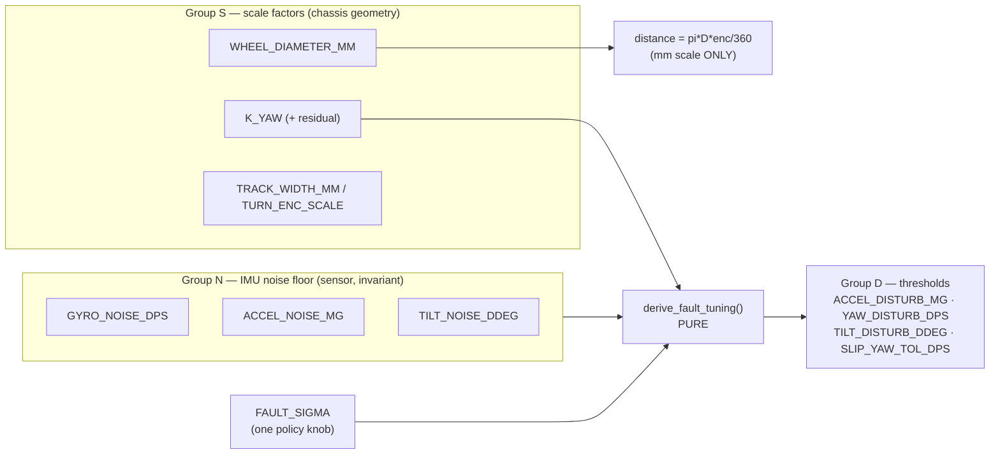
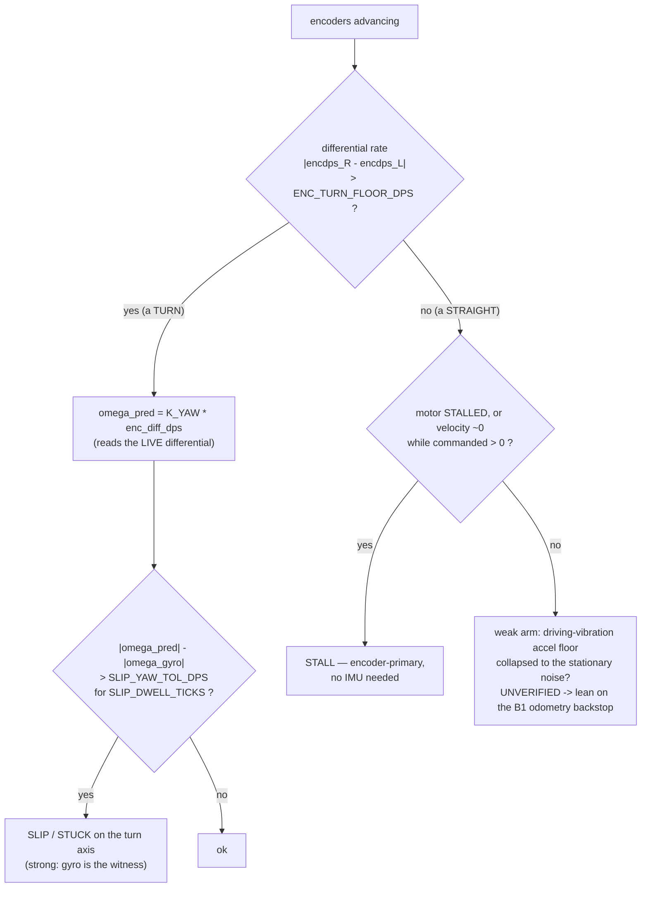
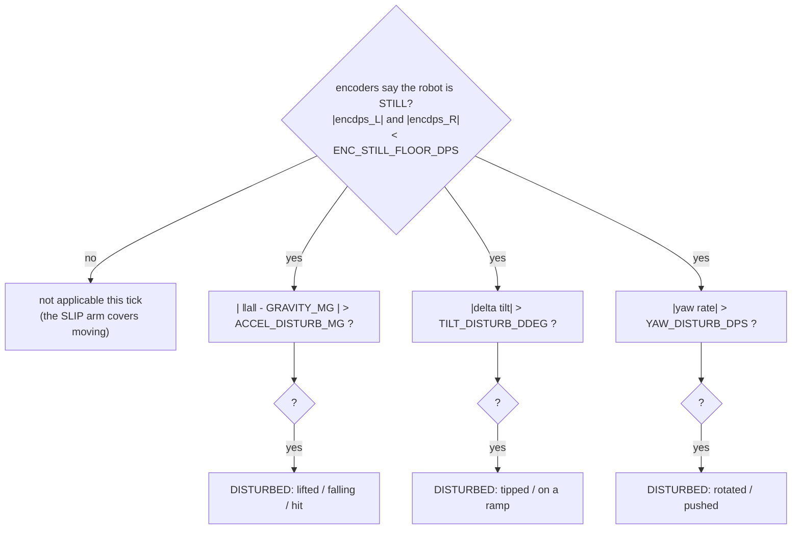
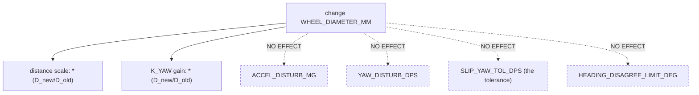

# Self-tuning odometry fault detection — thresholds from measured noise, not hand-tuning

> **Type:** RESEARCH (design brief) · **Created:** 2026-09-01 · **Owner:** the **Programmer**
> **Designs to:** the chassis measured 2026-09-01 — differential drive (A=LEFT, B=RIGHT, id 48, 930 dps
> max, forward A:−v B:+v), **direct drive** (1 wheel rev = 360 enc-deg, no gearing), a **single fixed
> unidirectional rear roller** that rolls fore/aft but resists sideways scrub.
> **Refines, never replaces:** [detection-odometry-coverage-2026-09-01.md § B](./detection-odometry-coverage-2026-09-01.md#b-odometry-and-the-scrubbing-caster)
> (the caster asymmetry and the two-effective-tracks split) and
> [../plans/analysis-motion-quality.md](../plans/analysis-motion-quality.md) (the estimators that recover
> the constants from a logged drive).
> **Measured behaviour from:** [../findings/imu-characterisation-2026-08-27.md](../findings/imu-characterisation-2026-08-27.md)
> · [../findings/drive-checkpoint-2026-09-01.md](../findings/drive-checkpoint-2026-09-01.md).
> **Closes register rows:** [../plans/known-unknowns.md](../plans/known-unknowns.md) **KU-M27**
> (fault thresholds + turn-scale + track width, all from one drive) and **KU-M28** (driving yaw drift).
> **Needs KU-M21 (wheel diameter) only for the mm-scale half — the fault half is diameter-free.**

**Nothing in this brief has been measured on the built robot in motion.** Every threshold is `[ASSUMED]`
and every magnitude `[UNVERIFIED]` unless it cites a measurement that exists. This is a **next-session
bench task**: it needs the hub, the motors, and the floor. What the brief does now is fix the *shape* of
the tuning so that the bench session produces a handful of numbers and a pure `derive` function turns them
into every threshold — rather than a class period spent hand-picking a dozen constants one at a time.

**The thesis, in one line.** The fault detectors compare two independent estimates of the same physical
motion — encoders (**primary**) against the IMU (**confirmation**, as the operator directed). A comparison
needs two things: a **model gain** to convert one estimate into the other, and a **tolerance** for how far
apart "healthy" is allowed to be. The gain comes from a short calibration drive; the tolerance comes from
the IMU's measured noise floor as an N-sigma band. **Neither is hand-tuned, and — the load-bearing
property of the whole design — they live in different unit systems, so a wheel-diameter change moves one
and never the other.**

---

## Contents

- [1. The minimal measured set — three groups, one anchor](#1-the-minimal-measured-set--three-groups-one-anchor)
- [2. The two cross-checks, as pure health functions](#2-the-two-cross-checks-as-pure-health-functions)
- [3. Deriving the thresholds from the noise floor (the auto-tune)](#3-deriving-the-thresholds-from-the-noise-floor-the-auto-tune)
- [4. Turn-scale, track width, and K_yaw from one calibration drive](#4-turn-scale-track-width-and-k_yaw-from-one-calibration-drive)
- [5. The calibration procedure — ordered, one short session](#5-the-calibration-procedure--ordered-one-short-session)
- [6. Propagation — what a diameter change touches, and what it must not](#6-propagation--what-a-diameter-change-touches-and-what-it-must-not)
- [New function signatures (consolidated)](#new-function-signatures-consolidated)
- [Maps onto](#maps-onto)
- [RECOMMENDED CHANGES to other files](#recommended-changes-to-other-files)
- [Sources](#sources)

---

## 1. The minimal measured set — three groups, one anchor

Everything in the fault system derives from **eight measured primitives**, in three groups. The grouping
*is* the design: it is what makes the coupling in [§6](#6-propagation--what-a-diameter-change-touches-and-what-it-must-not)
predictable.

### Group N — the IMU noise floor (a **sensor** property, chassis-independent, the anchor)

Measured by a stationary hold, **on the chassis, motors powered, on the mission floor** — not the bare
hub of 2026-08-27, because the number that matters is the noise a *driving* robot's electronics and idle
motors inject, and that is genuinely unmeasured (KU-M28).

| Primitive | What it is | Bare-hub datum (2026-08-27) | Status |
|---|---|---|---|
| `GYRO_NOISE_DPS` | MAD of yaw-rate at rest | ~0 — `angular_velocity()` **deadbands to exact 0** (KU-M19) | `[ASSUMED]` — remeasure with motors |
| `ACCEL_NOISE_MG` | MAD of the gravity-vector magnitude at rest | worst deviation **2.2 mg** over a clean 30 s window | `[ASSUMED]` — remeasure with motors |
| `TILT_NOISE_DDEG` | MAD of pitch/roll at rest | not separately reported | `[ASSUMED]` |
| `YAW_DRIFT_DPS` | net yaw / duration at rest (a **bias**, not a noise) | **0.0033 °/s**, n=1, 30 s, USB, no motors | MEASURED but PARTIAL (KU-M9) |
| `GRAVITY_MG` | ‖a‖ a still, flat hub reports (the disturbance reference) | **989** | MEASURED 2026-08-27 |

These five are properties of the LSM6-class MEMS part inside the hub. **They do not move when the wheels,
the track, or the surface change.** That invariance is why they are the anchor every threshold hangs from.

### Group S — the model scale factors (chassis **geometry**, from short drives)

| Primitive | What it is | Recovered by | Diameter-free? |
|---|---|---|---|
| `WHEEL_DIAMETER_MM` (D_eff) | effective rolling diameter | one ruler read + a straight drive (KU-M21/BM-3) | — (it *is* the diameter) |
| `K_YAW` | body-yaw-rate per **encoder-differential-rate** (deg body per deg wheel-differential) | a logged spin — regress ω_gyro on (encdps_R − encdps_L) | **YES** |
| `TRACK_WIDTH_MM` (b) | the near-geometric straight/gentle-curve track | D_eff + the spin (or a closing turn) | no |
| `TURN_ENC_SCALE` | the caster-inflated **spin** track, for degraded encoder-only turns | the same spin | no |

`K_YAW` is the centre of the fault system and it is worth dwelling on. It is exactly the operator's
**"driving-yaw-rate-per-differential-dps"**: `K_YAW = ω_gyro / (encdps_R − encdps_L)`. Geometrically it
equals `D / (2·b)`, but **we never compute it that way** — we *measure* it directly from the spin, which
(a) needs no wheel diameter and no track width, so it is available the first bench session before the
ruler ever comes out, and (b) bakes the **caster drag** straight in: the scrubbing rear roller pulls the
pivot rearward, inflating the effective spin track, so the measured `K_YAW` comes out **lower** than
`D/(2·b)` predicts. That deficit *is* the caster, quantified for free
([detection-odometry-coverage-2026-09-01.md § B.1](./detection-odometry-coverage-2026-09-01.md#b-odometry-and-the-scrubbing-caster)).

### Group D — the derived thresholds (computed, never hand-set: the auto-tune output)

Not measured — **produced** by `derive_fault_tuning()` ([§3](#3-deriving-the-thresholds-from-the-noise-floor-the-auto-tune))
from Groups N and S plus one policy knob `FAULT_SIGMA`. Listed here so the three-group closure is visible;
their formulas are in §3.

`ACCEL_DISTURB_MG` · `YAW_DISTURB_DPS` · `TILT_DISTURB_DDEG` · `SLIP_YAW_TOL_DPS` · `HEADING_DISAGREE_LIMIT_DEG`.



Notice what does **not** feed the thresholds: `WHEEL_DIAMETER_MM` reaches only the distance scale. This is
the entire coupling story, previewed.

---

## 2. The two cross-checks, as pure health functions

The operator named two faults. Each is a small **pure** function that takes readings and returns a status —
not a class, not a state machine ([ADR-0005](../decisions/0005-no-test-suite-verify-on-hardware.md): a
health check is a function). They are active in **different encoder regimes**, gated by the encoder state,
which is exactly why they never trip each other.

### Fault A — SLIP / STUCK: wheels advancing, body not moving to match



The **turn arm is the strong one**: on a differential turn the encoders predict a body yaw rate
`ω_pred = K_YAW · enc_diff_dps`, and the gyro is an independent witness of the actual yaw. Wheels spinning
with the body under-yawing is slip or a stuck wheel. Two design properties earn their place:

1. **A dynamic (eased-in/out) turn rate needs no special case.** `ω_pred` reads the **instantaneous**
   encoder differential, so whatever profile the turn follows — trapezoidal, raised-cosine — the
   prediction tracks it. This is the direct answer to the operator's request for a variable turn-rate
   profile: the cross-check is model-based, not a fixed expected rate, so the profile is free to vary.
2. **The gyro deadband is guarded, not ignored.** `angular_velocity()` reads exactly 0 at rest (KU-M19),
   and if `tilt_angles()` yaw is filtered the same way a *slow healthy* turn could hold yaw briefly constant
   and look stuck. So the slip flag fires only when `enc_diff_dps` is clearly above `ENC_TURN_FLOOR_DPS`
   **and** the shortfall persists `SLIP_DWELL_TICKS`. This supersedes the raw `STUCK_YAW_TICKS = 50` in
   config with a model residual plus a dwell.

The **straight arm is honestly weak.** A robot driving straight and a robot stuck-going-straight look
nearly identical to a low-frequency IMU (gravity steady, yaw steady). The reliable straight-line signal is
**encoder-primary**: `motor.status()` returning `STALLED (2)`, or `velocity()` reading ~0 while commanded
high — no IMU required. The IMU confirmation for *slip* on a straight (wheels turning freely, robot not
translating) is only the loss of the driving-vibration accel signature, which is `[UNVERIFIED]`; where it
is silent, the guaranteed backstop is the degraded-mode odometry rectangle (B1) and the boundary tape, not
this check.

### Fault B — DISTURBANCE: body moving while the wheels are still

This is the operator's second fault (lifted / pushed / falling / tipped / hit) and it is a **direct
generalisation of a tool this project already has**: `examples/gyro_drift.py` refuses to report a drift
figure when the gravity vector moves more than **25 mg**, because a still hub holds gravity to a milli-g or
two ([imu-characterisation-2026-08-27.md § 5.3](../findings/imu-characterisation-2026-08-27.md)). That is
exactly the disturbance detector, on one axis, with a hand-picked threshold. Generalise it to three axes
and auto-tune the thresholds:



The **wheels-still precondition is what makes the stationary noise floor the correct anchor**: the check
only runs when the robot is not driving, so the accel noise it must clear is the *stationary* floor
(Group N), not the driving-vibration floor. During active driving the SLIP arm is the live one. They never
overlap.

Both functions return a plain status string (`"ok"` / `"slip"` / `"stall"` / `"disturbed"`), take readings
plus the tuning object, and touch no hardware — they are host-runnable and replayable against a logged CSV,
which is how they get verified without the robot.

---

## 3. Deriving the thresholds from the noise floor (the auto-tune)

The operator asked for thresholds set as **N-sigma multiples of the measured noise**. Three things make
that correct rather than glib on this hub.

**(a) MAD, not SD.** The stationary spread is measured as **median absolute deviation** — robust, one stray
sample cannot inflate it, and it is the statistic `calibration.py` already uses. The operator's "N-sigma"
is in standard-deviation units, and for Gaussian noise `MAD = 0.6745·SD`, so an N-sigma band is
`N · MAD / 0.6745 = 1.4826·N · MAD`. This 1.48 conversion is the *same unit trap that has already bitten
this project three times* (see `calibration.py`'s MIN_SNR_MAD comment); it is done once, named, in
`sigma_band()`.

**(b) A deadband floor is mandatory, or every tick trips.** `angular_velocity()` reads **exactly 0** at
rest (KU-M19). A pure `N × MAD` on a MAD of 0 is **0**, and a threshold of 0 fires on every sample. So the
derivation is `max(N-sigma band, sensor floor)`, where the floor is the sensor's own quantisation /
deadband width (≈1 dps, ≈1 mg, ≈1 ddeg — themselves `[ASSUMED]` until benched). The `gyro_drift.py` 25 mg
gate is exactly such a floor, chosen well above the 2.2 mg spread; this design keeps that shape and derives
the multiple instead of guessing it.

**(c) The slip tolerance combines two noises.** The slip check compares `ω_gyro` against `K_YAW·enc_diff`,
so its tolerance must absorb **both** the gyro noise **and** the calibration residual of the `K_YAW` fit
(how well the straight line through the spin actually fit). Combine in quadrature:
`SLIP_YAW_TOL_DPS = N-sigma of sqrt(GYRO_NOISE_DPS² + K_YAW_RESID²)`, floored the same way.

The derivation is one pure function, run **once at run start** — the same TR-4 pattern the colour detector
uses (derive from what you just measured; never hard-code):

```python
# pure; MicroPython subset (no f-strings, no typing, no dataclasses)

def _mad_to_sd(mad):
    return mad / 0.6745                       # MAD = 0.6745 * SD for Gaussian noise

def sigma_band(mad, n_sigma, floor):
    """N-sigma band from a measured MAD spread, never below the sensor's own floor.
    The floor is not optional: the gyro deadbands to exactly 0 at rest (KU-M19),
    so n_sigma * 0 = 0 would trip on every tick."""
    band = n_sigma * _mad_to_sd(mad)
    return band if band > floor else floor

def derive_fault_tuning(gyro_noise_dps, accel_noise_mg, tilt_noise_ddeg,
                        k_yaw, k_yaw_resid_dps, div_p95_deg, n_sigma=None):
    if n_sigma is None:
        n_sigma = config.FAULT_SIGMA
    accel = sigma_band(accel_noise_mg,  n_sigma, config.ACCEL_FLOOR_MG)
    yaw   = sigma_band(gyro_noise_dps,  n_sigma, config.YAW_RATE_FLOOR_DPS)
    tilt  = sigma_band(tilt_noise_ddeg, n_sigma, config.TILT_FLOOR_DDEG)
    combined = math.sqrt(gyro_noise_dps * gyro_noise_dps
                         + k_yaw_resid_dps * k_yaw_resid_dps)
    slip = sigma_band(combined, n_sigma, config.YAW_RATE_FLOOR_DPS)
    # heading-disagreement alarm is an ANGLE straight from the measured p95 -- see section 4
    return FaultTuning(accel, yaw, tilt, slip, k_yaw, div_p95_deg)
```

Every number a fault detector uses now traces to a measured primitive times one auditable policy knob.
Nothing is hand-picked; nothing is a magic constant in a comparison.

---

## 4. Turn-scale, track width, and K_yaw from one calibration drive

The scale factors come out of **two drives**, exactly the estimators
[analysis-motion-quality.md](../plans/analysis-motion-quality.md) already specifies — this brief adds only
the fault-facing outputs.

**Straight drive (open loop, heading correction OFF, 1–2 m).**
- `WHEEL_DIAMETER_MM = 360·d_tape / (π·Δenc_mean)` — one tape number for the mm scale (KU-M21).
- On-straight **gyro-vs-encoder divergence** `div(t) = ψ_gyro − ψ_enc`: its **p95** over healthy straight
  segments sets `HEADING_DISAGREE_LIMIT_DEG`. This is an **angle**, so it is diameter-independent — the
  same value holds whatever the wheel size. The caster rolls freely on a straight, so this divergence is
  small and meaningful *here*; it is meaningless on turns (below).
- Captures the **driving-vibration accel floor** for the weak straight-slip arm (§2).

**Logged spin (CW then CCW, 2–3 rotations each).** Regress the body yaw rate on the encoder differential
through the origin, over every sample:

```python
def estimate_k_yaw(enc_diff_dps, omega_gyro_dps):
    """K_YAW by least-squares through the origin; RMS residual is the trust measure.
    DIAMETER-FREE: both inputs are rates the hub reads directly. A residual that GROWS
    with turn angle (a bending line) is the caster moving the pivot -- b is not a scalar
    for this chassis, and the answer is gyro-closed turns, not a better b."""
    num = 0.0; den = 0.0
    for d, w in zip(enc_diff_dps, omega_gyro_dps):
        num += w * d; den += d * d
    if den <= 0.0:
        raise ValueError("no differential motion in the spin log")
    k = num / den
    sse = 0.0
    for d, w in zip(enc_diff_dps, omega_gyro_dps):
        r = w - k * d; sse += r * r
    return (k, math.sqrt(sse / len(enc_diff_dps)))
```

Outputs, all from the one spin:
- `K_YAW` and `K_YAW_RESID` → the slip cross-check gain and (via §3) its tolerance.
- `TRACK_WIDTH_MM` (straight track) and `TURN_ENC_SCALE` (spin track) once `D_eff` lands — kept **separate**
  because the caster inflates the spin track only; overwriting `TRACK_WIDTH_MM` with the spin value would
  corrupt the on-straight cross-check that G1 depends on
  ([detection-odometry-coverage-2026-09-01.md § B.1.8](./detection-odometry-coverage-2026-09-01.md#b-odometry-and-the-scrubbing-caster)).
- The **CW/CCW gap** is Borenstein's Type A / Type B diagnostic: **same sign both ways = wheelbase / caster
  drag** (a symmetric friction that folds into the turn-scale), **reverses = unequal wheel diameters**
  (a physical fault to fix on the robot, not a constant to re-derive). Cited correctly against the paper on
  disk; the pairing in [../runbooks/measure-drivetrain.md](../runbooks/measure-drivetrain.md) §6.5 is
  inverted and carries a standing correction in analysis-motion-quality.md.

**A bending regression line is itself a result**, not a nuisance: it says the pivot moves through the turn,
so no single scalar spin-track fits, and the design's answer is already gyro-closed turns (the gyro bypasses
the caster entirely). `K_YAW` then serves only the fault check and the degraded encoder-only turn.

---

## 5. The calibration procedure — ordered, one short session

A next-session bench task. It needs the hub, the motors mounted, and the mission floor. It reuses
`examples/square_odometry.py` (already streams per-tick encoders + yaw, gyro-closed) and the
`gyro_drift.py` contamination gate; **no new hub tooling is required**, and every step logs raw for
laptop-side arithmetic, so a wrong formula costs a re-read, not a re-run.

| # | Run | Duration | Measures (raw) | Sets after the laptop DERIVE |
|---|---|---|---|---|
| **0** | **Stationary hold** — on the floor, motors **powered but idle**, robot still. Run `gyro_drift.py`'s gate; reject the window if ‖a‖ moves > 25 mg | 20–30 s | `GYRO_NOISE_DPS`, `ACCEL_NOISE_MG`, `TILT_NOISE_DDEG`, `YAW_DRIFT_DPS` (Group N) | `ACCEL_DISTURB_MG`, `YAW_DISTURB_DPS`, `TILT_DISTURB_DDEG` — the disturbance thresholds |
| **1** | **Straight drive** — open loop, heading correction OFF, 1–2 m, forward | ~10 s + a tape read | `WHEEL_DIAMETER_MM` (with tape), straight-segment `div` p95, driving-vibration floor | distance scale; `HEADING_DISAGREE_LIMIT_DEG` |
| **2** | **Logged spin** — CW then CCW, 2–3 rotations each, gyro-closed | ~20 s | `K_YAW` + residual, `TRACK_WIDTH_MM`, `TURN_ENC_SCALE`, the CW/CCW Type-A/B gap (KU-M27) | `K_YAW`, `SLIP_YAW_TOL_DPS`, the turn-scale |
| **3** | **DERIVE** — laptop only, no robot | seconds | — | `derive_fault_tuning()` computes all of Group D from the logged primitives |

Steps 0–2 are one continuous log with a stationary pre-roll and post-roll (which is where step 0 and the
driving-drift half of KU-M28 come from for free). **Step 0 and the spin are diameter-free** — they can run
and set the entire *fault* system the first session, before the ruler settles `WHEEL_DIAMETER_MM`; only the
mm distance scale waits on the tape.

**Honest gaps this session must record, not paper over:** the driving-yaw-drift (KU-M28) is the number the
2026-08-27 bare-hub 0.0033 °/s does **not** cover, and it is what the disturbance yaw threshold really has
to clear; the gyro deadband (KU-M19) may make a slow healthy turn look stuck, so the `ENC_TURN_FLOOR_DPS`
guard must be checked against a *slow* logged turn before `SLIP_DWELL_TICKS` is trusted; and every
constant is **per-surface** (carpet scrubs the caster harder than tile), so the surface travels with each
number.

---

## 6. Propagation — what a diameter change touches, and what it must not

This is the payoff, and the reason for the three-group split. The question the operator posed: a change in
wheel diameter **rescales distance** but must **not** move the slip/disturbance thresholds, which are in
IMU units. Stated as a dependency table:

| If this changes → | rescale THESE | leave THESE untouched |
|---|---|---|
| **Wheel diameter D** | `distance = π·D·enc/360`; **`K_YAW` by `D_new/D_old`** (or re-run the 20 s spin) | **all IMU-unit thresholds**: `ACCEL_DISTURB_MG`, `YAW_DISTURB_DPS`, `TILT_DISTURB_DDEG`, the slip **tolerance** `SLIP_YAW_TOL_DPS`, `HEADING_DISAGREE_LIMIT_DEG` (an angle) |
| **Track width b** | `K_YAW` by `b_old/b_new`; `TRACK_WIDTH_MM`; `TURN_ENC_SCALE` | the distance scale; **all IMU-unit thresholds** |
| **Surface** (carpet↔tile) | `D_eff` (loaded), `K_YAW` (caster scrub is worse on carpet), the driving-vibration floor | the **stationary** IMU noise floor (a sensor property) |
| **Hub / IMU swap** | the IMU noise floor and therefore all of Group D | the entire drivetrain geometry |

The one subtlety worth stating precisely, because it is where a careless design would couple things that
must stay separate: **the slip check has a diameter-coupled part and a diameter-independent part, and the
design keeps them as two constants on purpose.**

- The **prediction gain `K_YAW`** is a *scale factor* — geometrically `D/(2b)` — so it **is** coupled to
  the diameter. Change the wheel and `K_YAW` must be rescaled (or re-measured).
- The **tolerance `SLIP_YAW_TOL_DPS`** is a *noise band* in dps, derived from the gyro noise floor. It is
  **not** coupled to the diameter at all.

If a design folded these into a single "slip threshold" it would silently re-tune the tolerance every time
the wheel changed — the exact coupling the operator wants forbidden. Keeping the gain in Group S and the
tolerance in Group D is what delivers the guarantee: **a diameter change is a *scale* event, never a
*threshold* event.** The IMU noise floor is the anchor because it belongs to the sensor, not the robot, so
nothing you do to the chassis can move it.



---

## New function signatures (consolidated)

All **pure**, MicroPython-subset, host-runnable. Run-time consumers (`derive_*`, the health checks, the
turn profile) belong in `src/odometry.py`; the log-side estimators belong in `data_analysis/motion.py`
(analysis owns constant recovery, per analysis-motion-quality.md).

| Where | Signature | Purpose |
|---|---|---|
| `src/odometry.py` | `class FaultTuning(accel_disturb_mg, yaw_disturb_dps, tilt_disturb_ddeg, slip_yaw_tol_dps, k_yaw, heading_disagree_deg)` | the derived-threshold bundle; the auto-tune output, passed to the checks |
| `src/odometry.py` | `sigma_band(mad, n_sigma, floor) -> float` | one N-sigma-from-MAD band with the mandatory deadband floor; the 1.48 conversion named once |
| `src/odometry.py` | `derive_fault_tuning(gyro_noise_dps, accel_noise_mg, tilt_noise_ddeg, k_yaw, k_yaw_resid_dps, div_p95_deg, n_sigma=None) -> FaultTuning` | the auto-tune; run once at run start |
| `src/odometry.py` | `turn_slip(enc_diff_dps, omega_gyro_dps, tuning) -> bool` | wheels differentially spinning, body under-yawing → slip/stuck; instantaneous, so a variable turn profile is free |
| `src/odometry.py` | `disturbance(enc_left_dps, enc_right_dps, accel_mg, d_tilt_ddeg, yaw_rate_dps, tuning) -> str\|None` | wheels still + IMU moving → lifted/pushed/tipped/hit; `None` when not applicable this tick |
| `src/odometry.py` | `turn_rate_multiplier(fraction, ramp=0.25) -> float` | ease-in/out turn-rate profile (0..1 progress → 0..1 rate); the operator's dynamic-rate request |
| `data_analysis/motion.py` | `estimate_k_yaw(enc_diff_dps, omega_gyro_dps) -> (k_yaw, rms_resid)` | `K_YAW` + trust residual by origin-regression over a logged spin; diameter-free |

Status constants (plain strings, no `enum`): `HEALTH_OK = "ok"`, `HEALTH_SLIP = "slip"`,
`HEALTH_STALL = "stall"`, `HEALTH_DISTURBED = "disturbed"`.

---

## Maps onto

- `src/odometry.py` — `normalize_angle()` (every yaw delta still routes through it), `heading_from_encoders()`
  (the straight-track cross-check feeding `div`), `heading_disagreement_deg()` (its `[UNVERIFIED]` threshold
  is now set from the straight-drive `div` p95 — this brief closes that docstring TODO), `Odometry.update()`
  (unchanged; the checks read the same encoder + gyro values it consumes).
- `src/config.py` — `WHEEL_DIAMETER_MM`, `TRACK_WIDTH_MM`, `ENCODER_COUNTS_PER_REV`, `HEADING_DISAGREE_LIMIT_DEG`,
  `STUCK_YAW_TICKS` (reframed), plus the new primitives and floors listed below.
- `src/hub_imu.py` — `read_yaw_deg()`, `read_tilt_ddeg()`, `read_accel()` (the disturbance inputs);
  `angular_velocity()` is the direct yaw-rate source, subject to the KU-M19 deadband caveat.
- `src/hub_motors.py` — `read_motor_degrees()`, `velocity()`, `status()` (the STALL arm), `DRIVE_MAX_DPS = 930`.
- `src/calibration.py` — `median()` / `median_absolute_deviation()` reused verbatim for the Group N stats
  (the noise floor is a MAD burst, exactly like the floor-stability burst).
- `examples/square_odometry.py` — the gyro-closed spin already streaming encoders + yaw is the step-2 drive.
- `examples/gyro_drift.py` — the 25 mg contamination gate is the disturbance detector's ancestor and its
  step-0 stillness gate.
- `docs/plans/analysis-motion-quality.md` — `estimate_k_yaw()` extends its `constants()` / `divergence()`
  contract; the p95 it already computes is the source for `HEADING_DISAGREE_LIMIT_DEG`.

---

## RECOMMENDED CHANGES to other files

Collision-safe: **not applied here.** One change per row, each additive.

| File | Recommended change |
|---|---|
| `src/config.py` | Add Group-N primitives: `GYRO_NOISE_DPS`, `ACCEL_NOISE_MG`, `TILT_NOISE_DDEG` (all `[ASSUMED]`, "MEASURE with motors on the floor"), `YAW_DRIFT_DPS = 0.0033` (MEASURED 2026-08-27, PARTIAL — driving drift KU-M28), `GRAVITY_MG = 989.0` (MEASURED). Add scale factors `K_YAW`, `K_YAW_RESID_DPS`, `TURN_ENC_SCALE`, `DIV_P95_DEG` (all `[ASSUMED]`, KU-M27). Add policy + floors: `FAULT_SIGMA = 6.0`, `ACCEL_FLOOR_MG = 15.0`, `YAW_RATE_FLOOR_DPS = 1.0`, `TILT_FLOOR_DDEG = 10.0`, `ENC_TURN_FLOOR_DPS = 30.0`, `ENC_STILL_FLOOR_DPS = 10.0`, `SLIP_DWELL_TICKS = 3`. Every one carries its derivation in the comment. |
| `src/config.py` | Reframe `STUCK_YAW_TICKS = 50`: note it is **superseded** by `turn_slip()` (a model residual + `SLIP_DWELL_TICKS`), and keep it only as the degraded encoder-only fallback tick count. Its existing KU-M19 deadband caveat stays. |
| `src/config.py` | Change the `HEADING_DISAGREE_LIMIT_DEG = 10.0` comment to say it is **derived** from the straight-drive `div` p95 at run start (via `DIV_P95_DEG`), not hand-set. |
| `src/odometry.py` | Add the pure `sigma_band()`, `derive_fault_tuning()`, `FaultTuning`, `turn_slip()`, `disturbance()`, `turn_rate_multiplier()` and the `HEALTH_*` string constants (signatures above). Update `heading_disagreement_deg()`'s docstring: the "must be MEASURED" threshold is now the straight-drive p95, and the value **grows on turns by design** (caster), so callers gate it to straight segments. |
| `data_analysis/motion.py` | Add `estimate_k_yaw()` to the `constants()` block; emit `K_YAW`, its RMS residual, and the CW/CCW Type-A/B gap alongside `D_eff`, `b̂`, `k`. |
| `docs/plans/known-unknowns.md` | On **KU-M27**, replace "design in flight, `docs/research/`" with a link to this brief; note the fault half is **diameter-free** (needs KU-M21 only for the mm scale). On **KU-M28**, cross-link this brief's step-0/step-1 as where driving drift gets measured. |
| `docs/research/INDEX.md` | Add a row for this file (its summary). **Required for `./scripts/check-docs.py` to pass** — the linter enforces INDEX coverage, so the doc fails the check until this row lands. |
| `docs/plans/mission-algorithm.md` | In the run-start calibration, add the step-0 stationary hold and the `derive_fault_tuning()` call beside the existing colour `calibrate()`; add `turn_slip()` / `disturbance()` to the per-tick order as the fault channel, gated by encoder state. |
| `docs/runbooks/measure-drivetrain.md` | Add the step-0 stationary hold (Group N) as a prerequisite run; note step-2's spin already yields `K_YAW`; fix the §6.5 Type-A/B inversion (standing correction from analysis-motion-quality.md). |

---

## Sources

**This repo — measured:** [../findings/imu-characterisation-2026-08-27.md](../findings/imu-characterisation-2026-08-27.md)
(the noise floor: ‖a‖=989 mg, worst deviation 2.2 mg, drift 0.0033 °/s, the `angular_velocity()`=0 deadband,
the 1.350 ms IMU tick) · [../findings/drive-checkpoint-2026-09-01.md](../findings/drive-checkpoint-2026-09-01.md)
(direct drive 1 rev = 360 enc-deg, mirror signs, the 9° startup-ramp datum).

**This repo — design:** [detection-odometry-coverage-2026-09-01.md § B](./detection-odometry-coverage-2026-09-01.md#b-odometry-and-the-scrubbing-caster)
(the caster asymmetry, two effective tracks, `K_YAW` as the caster-inflated turn-scale, gyro-as-witness) ·
[../plans/analysis-motion-quality.md](../plans/analysis-motion-quality.md) (the `constants()` / `divergence()`
estimators, the spin regression, the gyro scale factor `k`, the Borenstein Type-A/B split, the p95 that
sets the heading-disagreement alarm) · [motion-control-and-odometry.md](./motion-control-and-odometry.md)
(UMBmark algebra, the drift budget) · `src/calibration.py` (the MAD burst and the derive-at-run-start
pattern this reuses) · `examples/gyro_drift.py` (the contamination gate that is the disturbance detector's
ancestor) · `examples/square_odometry.py` (the step-2 spin log).

**Register:** [../plans/known-unknowns.md](../plans/known-unknowns.md) KU-M9, KU-M19, KU-M21, KU-M27, KU-M28.

**Nothing here has run on the moving robot.** It is a bench design: the numbers land next session.
