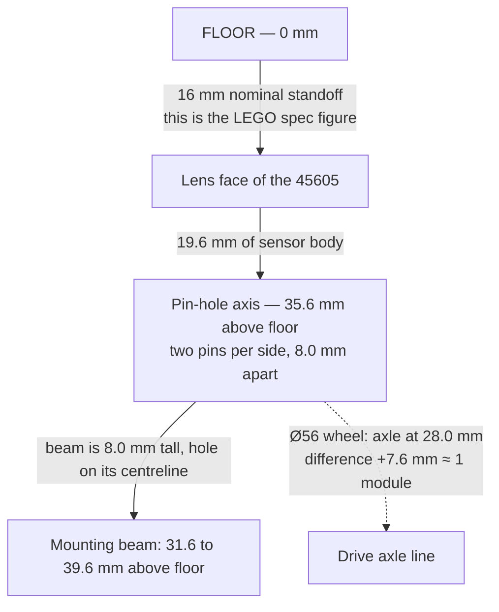
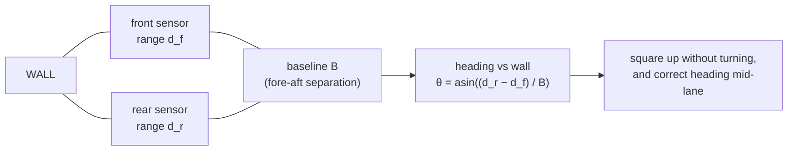

# Sensor Mounting Geometry — what each sensing role physically demands

**Type:** EXTERNAL research · **Created:** 2026-08-26 · **Status:** open — every dimension here comes
from a published LEGO specification or from the official LDraw solid model. **Nothing has been measured
on our own parts, because we own none of them.**
**Adversarially audited 2026-08-26** — all three techspec PDFs and all six LDraw models re-fetched and
the bounding boxes and peg-hole positions recomputed independently; the Element Overview re-read for the
beam and angle-element inventory. Every envelope, pin-hole position, cable cross-section and beam/axle/pin
figure below **reproduced exactly**. Twenty-eight corrections applied — the largest are the inverted
floor-clearance rule in § 2.2, `atan`→`asin` in § 2.3, the per-unit bias hole in the two-sensor heading
claim, and the inverted skid inequality in C1. Details in the changelog at the foot of this file.
**Answers:** the operator's request that sensor **orientation** be tracked alongside sensor count *"so
that we can budget for it."*
**Governs:** the mounting-hardware lines in [../plans/purchasing-strategy.md § 5](../plans/purchasing-strategy.md)
and the Designer's mount sketch that gates them.
**Does NOT cover:** which sensors to buy — that is
[../plans/sensor-suite-architecture.md](../plans/sensor-suite-architecture.md); how to buy them — that is
[../plans/purchasing-strategy.md](../plans/purchasing-strategy.md). This file is the **physical/geometric**
side only, and it does not design the chassis: the Designer designs, the Builder builds.

---

## Summary — the eight things that matter

1. **All three sensors mount the same way: four Technic pin holes, two on each of two opposite faces,
   8.0 mm apart, sitting 4.0 mm in front of the cable face.** (Colour and force put them on the *side*
   faces; the distance sensor puts them on its two *end* faces, 56 mm apart — § 1.2.) Nothing mounts from
   the sensing face, and nothing mounts from the back. The sensor is gripped at the *far end from where it
   senses*.
2. **The colour sensor's pin-hole axis is 19.6 mm behind its lens.** At a 16 mm standoff the beams holding
   it sit at **35.6 mm above the floor** — on our `[ASSUMED]` Ø56 wheels, 7.6 mm above the drive axle, i.e.
   **almost exactly one LEGO module (8 mm) up from the axle line**.
3. **Standoff is quantised, not dialled.** The pin grid moves in 8.0 mm steps, so 16 mm is a value you land
   near and then *record*. Design the mount so the sensor can shift by the smallest increment available.
4. **You cannot tilt a LEGO sensor by 5–10°.** Double-pinned beam geometry only produces
   Pythagorean-triple angles, and the only two reachable from the set's beams are **36.87°** (7M or 11M)
   and **22.62°** (15M). 45° needs the `Angle element 135 degrees`, not a beam. The
   "tilt the distance sensor up 5–10 degrees" advice in
   [./detection-and-sweep-techniques.md § Sensor role assignment](./detection-and-sweep-techniques.md#sensor-role-assignment)
   **is not buildable**. Raise the sensor instead; that is the only lever we have.
5. **The captive cable is a flat ribbon, ~7.5 × 1.7 mm, and it is ~20× stiffer edgewise than flatwise.**
   Its easy-fold plane is fixed relative to the sensor body, so the *roll* of a sensor about its own
   sensing axis is decided by where the hub is, not by the sensor. This is the constraint people miss.
6. **Two side-facing distance sensors do give heading against a wall without turning** — the geometry is
   sound — but it lives or dies on *range repeatability*, not on the ±20 mm accuracy spec. At a 120 mm
   baseline, 3 mm of per-sensor noise is ±2.0° of heading; 20 mm is ±14° and useless. **We have no
   repeatability figure. Measure it before committing two of the four free ports and a second purchase.**
7. **The force sensor's plunger has a cross-axle hole on its own axis.** A bumper on a 3M axle sliding in
   two guide holes is ~6 parts and buildable in a class session. The risk is not the parts: **0.5–1.0 N of
   trigger force is the same order as the stiction of a sloppy slide**, so it must be tested.
8. **A shroud that simply continues the colour sensor's own 24 mm footprint straight down to the floor
   cannot clip the 12 mm measurement spot.** It costs about four black parts and four pins, and its
   bottom edge becomes the lowest point on the robot other than whatever touches the floor.

---

## 1. The sensor bodies and their cables

### 1.1 How these numbers were obtained

Two sources, both re-checked on **2026-08-26**:

- **LEGO Education technical-specification PDFs**, re-extracted with `pdftotext -layout` today. They give
  electrical and optical behaviour and the wire length. **They contain no physical dimension and no
  mounting geometry** — the only mounting statement in any of the three is the sentence "The sensor has a
  Technic build geometry that allows for versatile building", which names nothing. An absence worth
  recording, because it is why the rest of this section had to come from somewhere else.
- **The official LDraw part models** by Philippe Hurbain (Philo), fetched from `library.ldraw.org` and
  walked programmatically: sub-part transforms composed, every vertex mapped into part coordinates, and
  the bounding box taken (1 LDU = 0.4 mm; 1 module = 20 LDU = 8.0 mm). Mounting points were located by
  finding every `npeghol7` ("Technic Peg Hole") primitive and reporting its global position and axis.
  **One caveat for anyone reproducing this:** a naive bounding box of `37312` (force) returns 26.18 mm
  across the width axis, not 24.0 mm, because exactly **two vertices out of ~3 000** sit at ±32.73 LDU —
  a stray in a 45°-rotated `1-4cyli` corner fillet. 1 262 vertices sit at ±30.0 LDU (±12.00 mm), which is
  the body face. The 24.0 mm in the table is the modal face, not the raw extent. Nothing similar affects
  `37308` or `37316`, whose extents are clean.

**LDraw models are made by measuring real parts, but they are not a LEGO specification.** Treat every
dimension below as **UNVERIFIED against a physical part** until the Builder puts a ruler on one — which
is measurement **MG-1** in [§ 7](#7-what-must-be-measured-or-tried-on-the-real-build). They are, however,
consistent to 0.4 mm and self-consistent across all three sensors, which is more than we had yesterday.

### 1.2 Envelopes, mounting points, and which way things face

Coordinates below use the sensor's own frame: **sensing axis** (out of the sensing face), **width axis**
(the long axis of the body), **cross axis** (the remaining one).

| | **Colour 45605** (37308c01) | **Distance 45604** (37316c01) | **Force 45606** (37312c01) |
|---|---|---|---|
| Envelope, W × C × sensing-axis | **24.0 × 23.2 × 23.6 mm** | **56.0 × 23.2 × 31.6 mm** | **24.0 × 23.6 × 48.0 mm** overall |
| In LEGO modules (8 mm) | 3 × 3 × 3 | **7** × 3 × 4 | 3 × 3 × 6 |
| Body alone (excl. moving part) | — | — | 39.6 mm (5 modules) + **8.4 mm** of protruding plunger |
| Sensing face | lens + 3 white LEDs, one 24 × 23.2 face | two ultrasonic "eyes" + 4 LED segments, one 56 × 23.2 face | plunger, 14.4 × 7.2 mm, centred |
| **Pin holes** | **4** — two per side face | **4** — two per **end** face, 56 mm apart | **4** — two per side face, at the rear |
| Pin-hole spacing | 8.0 mm (1 module), axis ⟂ sensing axis | 8.0 mm (1 module), axis ⟂ sensing axis | 8.0 mm (1 module), axis ⟂ plunger axis |
| Pin axis, behind the sensing face | **19.6 mm** | **27.6 mm** | **44.0 mm** (behind the plunger tip) |
| Pin axis, ahead of the cable face | 4.0 mm | 4.0 mm | 4.0 mm |
| Cable exit | **rear face, on axis, directly opposite the lens** | rear face, **5.6 mm off the centre line** | rear face, on axis |
| Extra geometry | — | back panel removable via 2 screws (LPF2 break-out). **Do not remove it** | **cross-axle hole through the plunger, on the sensing axis**; further connector-hole geometry on one long face — count it on the real part |

Two consequences the Designer should have in hand before sketching anything:

- **Every sensor is held at the end furthest from where it senses.** The lens, the eyes and the plunger
  are all cantilevered ~20–44 mm beyond the pins. Any wobble at the pins is amplified at the sensing
  point, and for the force sensor the bumper's reaction load acts through a **44 mm moment arm** on those
  four pins. Brace in the plane of the load, or the pins work loose.
- **The distance sensor is 7 modules wide.** Its two mounting faces are 56 mm apart, so it needs a
  cross-member at least 7M (or a `Technic frame 5x7`). It is the single most awkward sensor to mount and
  the one most likely to define the robot's width.

### 1.3 The cable — the constraint that decides sensor *roll*

The distance and force sheets say **"250 mm (fixed to sensor)"**; the colour sheet says only
**"250 mm"** — the three are *not* verbatim identical, and only two of them state the captivity in words.
The LDraw models show the same moulded-in stub on all three, so the colour cable is captive too, but that
is a model inference, not a LEGO sentence. There is no detachable end at the sensor; the only plug is the
one that goes into the hub.

From the LDraw model the wire is a **flat 6-conductor ribbon, ≈ 7.5 mm wide × 1.7 mm thick**, and it
leaves the rear face with its **width lying along the sensor's width axis**.

That geometry has a hard consequence. A flat ribbon's bending stiffness scales as thickness³ one way and
width³ the other, so this cable is roughly **(7.5/1.7)² ≈ 20× stiffer edgewise than flatwise**. It folds
happily toward the sensor's two *cross-axis* faces and fights being swept toward its *width-axis* faces.

- **Downward colour sensor**: mount it with its 24 mm width athwartships and the cable folds freely
  fore-and-aft, stiffly left-and-right. Mount it rolled 90° and the opposite is true. **The hub's position
  therefore decides the sensor's roll, and the roll decides nothing optically** — provided the spot is
  circular, which is `[ASSUMED]`: the one measurement we have swept bars across a single axis and never
  checked the other ([./color-discrimination.md § 5.1](./color-discrimination.md#51-spot-size-governs-everything)).
  Confirm it in MG-3. This is the one free choice in the whole document; spend it on the cable.
- **Forward distance sensor**: mounted eyes-forward with its 56 mm width horizontal, the cable folds
  freely up and over the top, or down and under. Both are fine. Do not try to route it sideways.
- **250 mm is not much.** From a colour sensor at the front of a 200 mm chassis to a hub port at the rear,
  a real route with two 90° bends and a service loop can easily reach 200 mm. **Check the route with a
  250 mm piece of string before the sensor is bought** (MG-4). Excess cable near a downward colour sensor
  is worse than short cable: a loop that dangles can shade the spot or drag on the floor. The SPIKE set
  ships **twelve "Wire clip w/ cross hole"** elements in six colours for exactly this job.
- **Bend radius: LEGO publishes none. UNVERIFIED.** Working rule, `[ASSUMED]`: never crease it, never bend
  it within ~10 mm of the strain relief where it leaves the body, and keep bends to a radius of roughly
  10× the ribbon thickness (~17 mm). This is a rule of thumb for flat cable, not a LEGO figure.
- **Nothing goes on a continuously rotating mount.** The cable is captive and will wrap and tear off. A
  limited sweep with a service loop is possible in principle; a scanning turret is not.

---

## 2. Role-by-role geometry

### 2.1 Downward colour sensor — target detection

**Orientation:** sensing face perpendicular to the floor, looking straight down.
**Standoff:** **16 mm**, nominal, from the lens face to the surface.

The 16 mm figure is LEGO's own, and it is stated *twice* in the techspecs sheet — once for colour sensing
and once for reflectivity sensing — as "Optimal reading distance: 16 mm (depending on object size, color,
and surface)". Confirmed from the PDF again today, and already recorded at
[./color-discrimination.md § 1.1](./color-discrimination.md#11-official-hardware-specification) and
[§ 5](./color-discrimination.md#5-mounting-geometry-and-the-speed-arithmetic). At that height the one
independent measurement we have puts the spot at **≈ 12 mm diameter**
([§ 5.1](./color-discrimination.md#51-spot-size-governs-everything)).

**What LEGO does not say is the tolerance.** "Optimal" is not "±n mm", and no reflectance-vs-distance
curve for the 45605 was found. The honest answer is *we do not know, and MG-3 is a 20-minute experiment
that would tell us*. We do know the direction of failure at each end: LEGO's own Advanced Driving Base
mounts at ~8 mm and gets black wrong in colour mode, while higher averages over more floor and weakens
the signal ([§ 5.1](./color-discrimination.md#51-spot-size-governs-everything)).

#### The stack, in numbers

Because the pin grid is 8.0 mm, the reachable standoffs from any given chassis datum are 16 mm, 24 mm,
8 mm — and nothing in between *on the pin grid alone*. Two ways off the grid, both for the Designer to
choose between rather than for this file to pick: interpose a studded element and inherit the **3.2 mm
plate step** (16 + 3.2 = 19.2 mm, which lands inside the 18–20 mm band recommended below), or carry the
sensor's beam on a **cross axle** and locate it with `Bush for cross axle`, which slides continuously.
**Design the mount so one member can be re-pinned or re-shimmed by the smallest step available**, then
measure the result (MG-1) and write it into [../hardware/build-record.md](../hardware/build-record.md).

#### Holding 16 mm over a floor that is not flat

| Threat | Size | Why it matters |
|---|---|---|
| Carpet pile, compressing under the wheels | 3 mm swing on a 5 mm pile — ~19 % of the gap | Already recorded at [./detection-and-sweep-techniques.md § Mounting geometry](./detection-and-sweep-techniques.md#mounting-geometry) |
| **Chassis pitch under acceleration and braking** | at 60 mm forward offset: 1.0 mm per degree, **3.1 mm at 3°** | Same order as the carpet effect, and nobody has mentioned it. A two-wheel differential base with a skid pitches every time it starts and stops |
| Tilt of the sensor away from vertical | 10° of tilt about the lens costs `16(sec10°−1)` = **0.25 mm**; 10° about the *pin axis* 19.6 mm above the lens costs **0.55 mm** and walks the spot **`19.6·sin10°` = 3.4 mm sideways** | Standoff is *insensitive* to tilt; **spot position is not**. 3.4 mm is a quarter of the 12 mm spot, and it breaks R2's "both sensors match within 2 mm" |

The pitch line is the one to act on: **the forward offset that
[./color-discrimination.md § 5.3](./color-discrimination.md#53-motor-choice-gearing-wheel-size-offset)
already wants kept modest for turning reasons is also what couples pitch into standoff.** Both arguments
point the same way. Keep the colour sensor close to the drive axle.

#### Rigid mount versus floating mount

- **Rigid** (~6–10 parts): two beams either side, four friction pins, two more pins tying it to the
  chassis. Ten minutes for the Builder. It holds the sensor at a fixed height above *the chassis*, which
  is only the same as a fixed height above *the floor* on a hard, flat surface.
- **Floating** (~+8 parts): a parallelogram of two short links so the sensor stays parallel to the floor,
  a skid or low-friction foot riding the surface, and a rubber band (the set has two, `Rubber band ø33
  yellow`) for preload. On carpet it converts a 3 mm height error into a nearly constant standoff.

**Recommendation: build rigid, and do not buy floating-mount parts until MG-2 shows a problem.** The
floating mount trades a known error for three unknown ones — link friction and hysteresis, a foot that
snags on carpet, and unsprung mass hanging off the front — and it cannot be tuned in a class session. The
cheaper mitigation is already in the repo: **mount slightly high (18–20 mm)** so pile variation is a
smaller fraction of the gap, and lean on hysteresis and dwell.

#### Fore/aft placement and turning

At forward offset `r` the sensing point is not on the turn centre. Two effects, both from
[./color-discrimination.md § 5.3](./color-discrimination.md#53-motor-choice-gearing-wheel-size-offset):
a heading error `θ` becomes a lateral position error of `r·sinθ` (60 mm at 5° = 5.2 mm, a real fraction of
a 12 mm spot), and `r` is the budget for any "stop on the target" behaviour, so it must exceed stopping
distance. Adding the pitch term above: **`r` between roughly 30 and 60 mm is the sane band, and the case
for the small end is now three arguments deep.**

### 2.2 Forward distance sensor — end of lane, boundary

**Orientation:** eyes horizontal, on the robot centreline, pointing along the direction of travel.
**Height:** the compromise already recorded is 60–80 mm.

The floor is what it must not see. Two different numbers matter here and the earlier draft of this file
conflated them:

- **Where** the floor enters the cone: horizontal distance `h / tan 35° = 1.43 h` ahead.
- **What the sensor reports** when the floor is the nearest thing in the cone: the *slant* range along the
  cone edge, `h / sin 35° = 1.74 h`. This is the number a threshold has to clear, because an ultrasonic
  returns the shortest round trip inside its cone, not something at a chosen bearing.

| Height `h` | Floor enters cone at | **Floor reads as** | Highest usable turn-trigger threshold |
|---|---|---|---|
| 40 mm | 57 mm ahead | **70 mm** | < 70 mm — barely outside the 50 mm blind zone. Unusable |
| 60 mm | 86 mm ahead | **105 mm** | < 105 mm |
| 80 mm | 114 mm ahead | **139 mm** | < 139 mm |
| 140 mm | 200 mm ahead | **244 mm** | < 244 mm — but tall and top-heavy |

**The rule is `h > 0.57 × (the threshold you want)`, not `h > anything`.** A 150 mm turn trigger needs
`h ≥ 86 mm`; a 100 mm trigger needs `h ≥ 57 mm`. The 60–80 mm compromise supports triggers up to about
105–139 mm, which is the band the lane-end logic should be written to. Whether a floor at 35° grazing
incidence returns at all is a separate question — a hard floor may reflect the pulse away and never
appear, carpet will scatter it back. **MG-5 measures it; do not assume either way.**

**And here is the finding that changes the standing advice.** Tilting up 5–10° would buy that clearance
cheaply, and it is not available: a beam pinned at two holes must land both pins on the 8 mm grid, so the
*hole span* `N` between the two pinned holes and the grid offsets `(a, b)` must satisfy `a² + b² = N²` — a
Pythagorean triple. Note the constraint is on the **hole span, not the beam length**: a beam only has to be
one module longer than the span, and either end hole may be used.

The straight beams in the SPIKE Prime set are **2M, 3M, 5M, 7M, 9M, 11M, 13M and 15M** (element overview —
there is no 6M and no 14M beam in the set), giving hole spans up to 14. Spans ≤ 14 that are triple
hypotenuses are 5, 10 and 13:

| Triple | Angle (and its complement) | Hole span | Shortest set beam that has it |
|---|---|---|---|
| 3-4-5 | **36.87°** / 53.13° | 5 | **7M** (holes 0 and 5) |
| 6-8-10 | 36.87° / 53.13° — same angle | 10 | **11M** |
| 5-12-13 | **22.62°** / 67.38° | 13 | **15M** (holes 0 and 13) |

So **two** exact tilts are buildable from set beams, 22.62° and 36.87°, and the nearest to 5–10° is more
than twice too steep. 45° is *not* beam-reachable — a (1,1) offset spans √2 modules, which is not an
integer hole span — it comes from the `Angle element 135 degrees` connector, not from a beam.

The `Angle element` axle connectors are likewise coarse. The element overview lists four of them, and the
**bracketed digit is LEGO's angle-element type number, not a quantity — the set contains 4× of each of the
four**: `0 degrees [1]`, `90 degrees [6]`, `135 degrees. [4]`, `180 degrees [2]`. Nothing in the box
produces a 5–10° tilt rigidly.

**So: mount the distance sensor level and set its height instead.** The escape hatches both need a test —
pin only the upper hole on each side and let the lower edge bear on a beam for a small controlled droop,
or accept 22.6°, which is far more than wanted. Level and higher is the answer.

Two more things it must not see: **the robot's own structure** — nothing may protrude into the cone, whose
half-width is `tan 35° × range = 0.70 × range`, so the cone is **1.40 × range across** — 140 mm wide at
100 mm ahead, two and a half times the sensor's own 56 mm width — and **a
wall at a grazing angle**, where the pulse reflects away specularly. The ±35° in the sheet is a cone of
*emission*, not a promise of detection off an oblique surface
([./detection-and-sweep-techniques.md § Distance sensor: exactly where it fails](./detection-and-sweep-techniques.md#distance-sensor-exactly-where-it-fails)).

### 2.3 Side-facing distance — wall following, and heading without turning

**Orientation:** sensing axis at 90° to the direction of travel. Mechanically this is the *easiest* of all
the orientations — the pin holes are on faces perpendicular to the sensing axis, so a side-facing sensor
pins into a fore-and-aft beam with no angle parts at all.

**Standoff — state the datum, because two different ones are in play.** The 50 mm blind zone is measured
**from the sensing face**, and the sensor body puts that face 31.6 mm outboard of the beam it is pinned to.
So: keep **lens-to-wall ≥ 80 mm** (50 mm blind zone plus 30 mm of margin for noise and for the robot
wandering), which is **≥ 112 mm chassis-flank-to-wall**. Reading the ~80 mm off the chassis instead leaves
the lens sitting at 48 mm — inside the blind zone — which is the opposite of what is wanted.

The interesting claim is the geometric one: **two range readings at a known separation give an angle.**

**Which inverse function, and why it matters.** An ultrasonic sensor returns the shortest round trip
inside its ±35° cone. Against a flat wall the shortest path is the **perpendicular** foot, and that foot
stays inside the cone for any heading within ±35° of square — so each reading is a clean perpendicular
distance and the difference of two of them is `B·sinθ`, giving **θ = asin((d_r − d_f)/B)**. That is the
same form already used in
[../plans/sensor-suite-architecture.md § 5.2](../plans/sensor-suite-architecture.md), and this file was
previously wrong to write `atan` — `atan` is the answer for an on-axis rangefinder, which the 45604 is not.
Below ~5° the two agree to a hundredth of a degree; at large deflections they do not. **The method also has
a hard operating envelope: beyond ±35° of square there is no perpendicular foot in the cone and the reading
stops meaning anything.**

What the method needs is *range repeatability* — a different number from the ±20 mm accuracy on the sheet,
because an offset **common to both units** cancels in the difference while random noise does not, and
enters multiplied by √2. Heading uncertainty for per-sensor noise `σ`:

| Baseline `B` | σ = 1 mm | σ = 3 mm | σ = 20 mm (the accuracy spec) |
|---|---|---|---|
| 56 mm (sensors touching) | ±1.45° | ±4.34° | ±30.3° |
| 80 mm | ±1.01° | ±3.04° | ±20.7° |
| **120 mm** | **±0.68°** | **±2.03°** | ±13.6° |
| 160 mm | ±0.51° | ±1.52° | ±10.2° |
| 200 mm | ±0.41° | ±1.22° | ±8.13° |

**Three caveats before anyone reads that table as a green light.**

1. **"Common offset cancels" is doing more work than it can bear.** It cancels only if the two units share
   it. A *per-unit* bias does not cancel: two sensors each up to 20 mm off in opposite directions put
   40 mm straight into the difference, which at `B` = 120 mm is a **fixed 19° heading error** that no
   amount of averaging removes. It is a constant, so it can be zeroed once against a known-square wall —
   but that calibration is a required step, not an optional one, and the single MG-6 originally written here
   did not measure it. Split into MG-6a/MG-6b in § 7.
2. **Two 45604s on the same flank, 120 mm apart, will hear each other.** Both fire at 100 Hz into
   overlapping cones. Whether the hub interleaves the pings or lets them collide is **UNVERIFIED** — no
   LEGO statement was found, and nothing in this repo tests it. A cross-talk failure looks like
   intermittent wild ranges, i.e. exactly like bad repeatability, so it has to be checked with **both**
   sensors live — MG-6b, which unavoidably comes after the purchase.
3. **This file does not reopen the purchase decision.**
   [../plans/sensor-suite-architecture.md § 5.2](../plans/sensor-suite-architecture.md) already ranks the
   second distance sensor the worst marginal Schrute Buck in the suite, on the ±20 mm accuracy figure.
   Nothing here overturns that. What this section says is narrower: *if* MG-6a comes back with a few
   millimetres of repeatability and a stable differential offset, the geometry is not the thing that kills
   the idea. That is a precondition, not a recommendation.

Physical cost of the pair, for the ranking in
[../plans/sensor-suite-architecture.md § 5.3](../plans/sensor-suite-architecture.md): two of the four free
ports, **+63 mm of robot width if both flanks are used** (31.6 mm of body per side) or +31.6 mm one-sided,
and 120 mm of straight side to mount against.

### 2.4 Force sensor as a bump sensor

**Orientation:** plunger axis horizontal, along the direction of travel, at the front.
**Height:** wherever the boundary actually is. Against a vertical wall, anywhere above the floor and below
the wall's top. Against a low rail or a taped line, the bumper must reach it.

The mechanical budget is tiny. What LEGO actually specifies is the *sensing* budget: touch activation
zone **0–2 mm** with the threshold at **1 mm ± 0.5 mm** and **0.5–1.0 N ± 10 %**, and force sensing over
**2–8 mm** at 2.5–10 N. The **8 mm of usable travel is the top of the force zone, not a stated mechanical
limit** — that inference is ours. It is corroborated, though: LDraw puts the plunger **8.4 mm** proud of
the body, so 8 mm of travel is the whole protrusion less a hair, at which point the body is the hard stop.
Both numbers are re-checked in MG-1 and MG-7.

**How the force is actually transmitted.** The plunger carries a **cross-axle hole down its own axis**.
That makes the honest design obvious and cheap:

1. A `Cross axle 3m` or `4m` plugged into the plunger.
2. A beam or panel on the far end of that axle as the bumper face.
3. Two axle holes in the chassis ahead of the sensor as a slide guide, so the load stays axial.
4. Optionally a `Bush for cross axle` as a travel stop so the bumper cannot drive the plunger past 8 mm.

That is **five to eight parts and about ten minutes** — well within a class session, and the Builder needs
no jig. It is realistic.

**What is not realistic is assuming it works.** The trigger force is 0.5–1.0 N; a bumper of two or three
beams sliding through two guide holes can easily have that much stiction, and the plunger's own return
spring is all that pushes it back. The failure mode is a bumper that latches "pressed" and never releases,
which looks exactly like a boundary that never ends. A pivoting lever giving 4 mm of bumper travel per
1 mm of plunger travel divides the required force by four, costing 4 mm of travel into the wall (16 ms at
250 mm/s — irrelevant). Both variants need **MG-7** before anyone trusts them.

And the 44 mm moment arm from § 1.2 applies: every bump loads those four rear pins in bending. Brace the
sensor front and back, not just at the pins.

---

## 3. Ambient-light shielding for the colour sensor

[./detection-and-sweep-techniques.md § Ambient-light shielding](./detection-and-sweep-techniques.md#ambient-light-shielding)
recommends one and explains why the effect is unproven but the shroud is cheap. Here is what one is,
physically.

**Shape.** The front face is 24.0 × 23.2 mm and the measured spot is ~12 mm across at 16 mm. Those two
numbers give a clean result: **a skirt that simply continues the 24 mm footprint straight down to the
floor cannot clip the spot**, because the cone from the emitter face to the spot *converges*. No flare is
needed, and the emitter's cone angle need not be known. Four black elements boxing the sensor and
extending past the lens is the whole design.

**Height.** From the lens plane to the floor is 16 mm. Leave a gap so the skirt never touches — 3–5 mm on
carpet, 2–3 mm on hard floor. So the skirt extends **11–14 mm below the lens**, which is 1.5 modules.

**What the gap lets in.** A ray entering under the skirt's bottom edge at elevation `φ` reaches the floor
`gap / tanφ` inboard of the skirt wall. Two thresholds follow, and they differ by a factor of two — the
skirt half-width is 12 mm (half of the 24 mm footprint) but the spot's *near edge* is only 6 mm inboard of
that, because the spot is 12 mm across. The distinction matters: contamination starts at the edge of the
spot, not at its centre.

| Skirt gap | Reaches the **near edge** of the spot below | Reaches the spot **centre** below |
|---|---|---|
| 2 mm | **18.4°** | 9.5° |
| 3 mm | **26.6°** | 14.0° |
| 4 mm | **33.7°** | 18.4° |
| 5 mm | **39.8°** | 22.6° |
| 6 mm | **45.0°** | 26.6° |

Read the **left** column, not the right. A 5 mm carpet gap admits anything below 40° of elevation onto part
of the spot. Overhead fluorescents arrive far above that and are blocked. **A window, a low lamp, or a
phone torch held by a teammate is not blocked**, and neither is the robot's own shadow edge. That is worth
knowing before the demo, and it is an argument for the smallest gap the floor allows.

**Colour.** Black and matte, so the skirt does not bounce the emitter's own light back into the lens. A
complete set contains **4× `Biscuit 1x3x3, black`** (against 6× magenta, which are exactly wrong). Beam
colours are not given in the Element Overview — **UNVERIFIED** whether black beams are available to buy.

**Interaction with everything else.** The skirt bottom, at 2–5 mm, becomes **the lowest point on the
robot**: it sets ground clearance, it snags first on a carpet seam, and it must clear a curled note
corner (a flat note is well under 1 mm). **Do not seal it to the floor.**

**Cost:** roughly four black parts plus four friction pins. Few parts, and it can be added after the mount
is proven rather than bought with it.

---

## 4. The mounting parts we would actually need to buy

**No prices here.** Prices change daily, only the Supplier may buy, and buying happens in class
([../plans/purchasing-strategy.md](../plans/purchasing-strategy.md)). What follows is *what to ask the
price of*, by the names LEGO Education prints in the SPIKE Prime Set Element Overview, so the Supplier can
point at a line rather than describe a shape.

**The Element Overview is a naming reference, not our stock list.** Every quantity quoted from it below —
12 wire clips, 4 black biscuits, 2 rubber bands — is what a *complete* SPIKE Prime set contains. We own two
motors and two wheels; everything else is a store purchase at an unknown price (open question 5). Do not
read "the set ships 12" as "we have 12".

Reference geometry from the LDraw models, for sizing a mount on paper: a **Technic beam is 7.2 mm thick ×
8.0 mm tall, holes on an 8.0 mm pitch** (5M beam = 39.2 mm long); a **cross axle is 4.8 mm across**, `N`M
≈ 8·N mm; a **3M friction pin is 24 mm long**.

| Role | Parts, by element-overview name | Rough count | Relative cost |
|---|---|---|---|
| Colour sensor, rigid downward mount | 2× `Technic 3m beam` or `5m beam`, 4× `Connector peg w/friction`, 2× more pins or 1× `Technic angular beam 3x5 90 deg.` to tie into the chassis | 6–10 | **Low** |
| …made height-adjustable | +1 beam so one member can be re-pinned a hole up or down | +1–2 | Negligible |
| Ambient shroud | 4× black element (`Biscuit 1x3x3, black` or black beams), 4× `Connector peg w/friction` | ~8 | **Low**, and deferrable |
| Colour sensor, floating mount | + 2× short beam as parallelogram links, 4× pins, 1× skid/`Ball`, 1× `Rubber band ø33` | +8–10 | **Medium** — do not buy before MG-2 |
| Forward distance sensor | 2× beam ≥7M **or** 1× `Technic frame 5x7`, 4× `Connector peg w/friction`, plus chassis tie-in | 6–10 | **Medium** — the 56 mm span is the cost |
| Side distance sensor, one | 1–2× beam, 4× `Connector peg w/friction` | 5–6 | **Low** — the easiest orientation in the document |
| Side distance pair for heading | double the above, plus a 120 mm-plus fore-aft rail on that flank | 12–14 | **Medium-high**, and two ports |
| Force sensor bumper | 1× `Cross axle 3m` or `4m`, 1× beam as the bumper face, 1× beam/frame with two axle holes as the slide guide, 1× `Bush for cross axle` as a stop, 4× `Connector peg w/friction` for the sensor | 6–8 | **Low** |
| Cable management, all roles | `Wire clip w/ cross hole` — the set ships 12, in six colours | 2–4 per sensor | **Very low**, and non-optional |

**Ask the Supplier to check one thing first**: whether the store sells these individually at all, or only
in bundles. That single answer changes every count above from "buy 6" to "buy 1 bag", and it is a
five-second question at the counter.

---

## 5. Where these roles fight each other

| # | Conflict | Verdict |
|---|---|---|
| **C1** | **Ground clearance vs 16 mm standoff.** The lens at 16 mm, or the shroud bottom at 2–5 mm, is the lowest non-contacting thing on the robot | Hard, and the earlier draft had the inequality backwards. **A skid or caster must reach *lower* than the shroud** — it touches the floor by definition, and it is what sets front ride height; the shroud then clears by whatever is left. A **bumper** is the opposite case: it never touches the floor, so it must stay *above* the shroud bottom or it drags. On Ø56 wheels the axle is at 28 mm and the pin axis at 35.6 mm, so the mount reaches down from the chassis; on Ø88 the axle is at 44 mm, the pin axis is 8.4 mm *below* it, and the lens 28 mm below it — a much deeper drop to build |
| **C2** | **Front bumper vs forward distance sensor** — both want the front centreline | Hard, but there is a window. The cone half-width is 0.70 × range: at 40 mm ahead a sensor 60 mm up illuminates from 32 to 88 mm above the floor, so a bumper face must sit **below ~30 mm or above ~90 mm** at that reach or it is a permanent sub-50 mm echo. Combine with C1 (a bumper must clear the shroud bottom at 2–5 mm) and the low branch is a real band: **a bumper face between roughly 6 and 30 mm above the floor, about 3 modules tall, satisfies both.** The high branch needs 90 mm of structure and is not worth it |
| **C3** | **Sensor mass and overhang vs traction.** LEGO publishes no sensor masses — **UNVERIFIED** | Depends on a Designer choice: with a **rear** skid, mass ahead of the drive axle presses the drive wheels down and *helps* traction (at some tipping risk); with a **front** skid it unloads them and *hurts*. **Which end the skid is on decides the sign of the effect** |
| **C4** | **Cable routing vs anything that turns** | Hard rule: **nothing on a continuously rotating mount.** The 250 mm ribbon is captive and will wrap |
| **C5** | **Colour sensor forward offset vs turn accuracy and pitch** | Soft but real: offset `r` costs `r·sinθ` of lateral error per degree of heading error, and `r·sinφ` of standoff per degree of pitch. Three independent arguments for a small `r` |
| **C6** | **Two colour sensors at a chosen lane pitch** ([../plans/sensor-suite-architecture.md § 5.1](../plans/sensor-suite-architecture.md)) | **The physical floor is 24 mm centre-to-centre** — the bodies touch (envelope width 24.0 mm, § 1.2, CONFIRMED off LDraw). Shrouding raises it by twice the wall thickness, and no element in § 4 has a 4 mm wall: one **shared** Technic-beam wall between the two gives 24 + 7.2 = **31.2 mm**, two separate walls give 24 + 14.4 = **38.4 mm**. Which applies depends on the element chosen — `[ASSUMED]` beam thickness, UNVERIFIED for a `Biscuit` panel. Any lane pitch below 24 mm is unbuildable regardless of what the coverage maths wants |
| **C7** | **250 mm of cable vs where the hub sits** | Easy to fix, easy to discover too late. Measure the route with string (MG-4) before buying |
| **C8** | **The distance sensor's 56 mm width vs a narrow chassis** | It will likely set the robot's minimum width. Decide this before the Builder commits to a frame |

**Easy combinations:** one downward colour sensor + one forward distance sensor; one downward colour
sensor + a front bumper; a single side-facing distance sensor.
**Hard combinations:** front bumper *and* forward distance sensor (C2); two colour sensors at a fine lane
pitch (C6); anything with a floating mount plus a shroud, because the shroud must then float with it.

---

## 6. Orientation summary table

**This is the artifact the operator asked for** — one row per plausible sensing role, so that sensor
*count* and sensor *orientation* can be budgeted together. Difficulty is the Builder's view, in a class
session, from parts we do not yet own. **Every part count and build time in this file is `[ASSUMED]`** —
they are reasoned from the pin geometry above, not from anyone having built one, and nobody on the team has
assembled a SPIKE sensor mount yet. Treat them as relative rankings, which is all the budgeting needs; the
absolute numbers are worth nothing until the Builder has done one (MG-1).

| # | Role | Sensor | Orientation | Standoff / height | Tolerance | Build difficulty | Parts cost | What it unlocks |
|---|---|---|---|---|---|---|---|---|
| **R1** | Target detection | Colour 45605 | Face down, ⟂ floor, on centreline, 30–60 mm ahead of the drive axle | **16 mm** lens-to-floor (pin axis at 35.6 mm) | **UNKNOWN** — LEGO gives no band. Working band 14–20 mm pending MG-3; 8 mm is known-bad | **Easy** — 4 pins into 2 beams | Low | The mission. Nothing else detects a flat sticky note |
| **R2** | Second colour lane / wide baseline | Colour 45605 | As R1, laterally offset | 16 mm | As R1, plus both must match within ~2 mm | **Easy**, but ≥24 mm centre-to-centre is a hard floor | Low ×2 | Wider effective swath, or line squaring (P6) |
| **R3** | End of lane, boundary | Distance 45604 | Eyes forward, **level**, on centreline | **60–80 mm** above floor | Height ±10 mm is harmless; **tilt is not adjustable** — see § 2.2 | **Medium** — 56 mm span needs a 7M cross-member | Medium | A lane that ends on a wall instead of on odometry |
| **R4** | Wall-following standoff | Distance 45604 | Sensing axis at 90° to travel | Any height clear of the floor cone; **wall ≥ 80 mm from the lens = ≥ 112 mm from the chassis flank** | Generous. Blind below 50 mm from the lens | **Easy** — the pin holes already face the right way | Low | Perimeter following (P4) |
| **R5** | **Heading against a wall, without turning** | 2 × Distance 45604 | Both at 90°, same flank, fore and aft | Baseline **≥ 120 mm**; each lens ≥ 80 mm from the wall | **Gated on MG-6a, and on the MG-6b differential-offset calibration.** ±2.0° if σ=3 mm; useless if σ=20 mm; only valid within ±35° of square | **Medium** — needs a 120 mm rail and 2 of the 4 free ports | Medium-high | Continuous heading correction mid-lane. **Already ranked worst-value in [../plans/sensor-suite-architecture.md § 5.2](../plans/sensor-suite-architecture.md); this row is a geometry precondition, not a recommendation to buy** |
| **R6** | Contact boundary | Force 45606 | Plunger forward, horizontal, at the front | At the boundary's height; body 44 mm behind the bumper face | Travel budget **8 mm total**, trigger at **1 ± 0.5 mm** | **Medium** — parts are easy, free sliding is not | Low | An authoritative end-of-lane a soft or angled border cannot fool |
| **R7** | Run start / stop button | Force 45606 | Plunger anywhere the operator can reach; up or rearward is fine | n/a | n/a | **Trivial** — 4 pins, no linkage | Very low | Free, if the sensor is already aboard for R6 |
| **R8** | *Rejected:* forward colour for wall proximity | Colour 45605 | Face forward | — | — | — | — | Optimal reading distance is 16 mm. It is a contact sensor, not a rangefinder |
| **R9** | *Rejected:* downward distance for note detection | Distance 45604 | Face down | — | — | — | — | 50 mm blind zone and ±20 mm against a sub-millimetre note |

---

## 7. What must be measured or tried on the real build

Standing rule: an unknown number gets a **procedure**, not an estimate. These are geometry measurements
and belong in [../plans/bench-measurement-plan.md](../plans/bench-measurement-plan.md), which currently
has no mounting-geometry entries (`grep MG- ` returns nothing there). **Two** of them — MG-1 and MG-4 —
need no hub, no motion and no purchase.

| # | Measurement | Needs | Minutes | Feeds |
|---|---|---|---|---|
| **MG-1** | **Ruler the real sensor.** Envelope, pin-hole spacing, pin-axis-to-lens distance. Confirm or correct § 1.2. Also: does a standard 2M friction pin bottom out in the side hole? | the sensor only | 5 | This file; [../hardware/build-record.md](../hardware/build-record.md) |
| **MG-2** | **As-built standoff, and its variation.** Feeler-gauge or shim the gap under the lens at four points on the arena floor; then log `reflection()` down one lane over uniform floor and take the spread | sensor mounted, hub up | 10 | The rigid-vs-floating decision in § 2.1; BM-0 |
| **MG-3** | **Reflectance vs standoff curve.** Shim the sensor at 8/12/16/20/24 mm over the same floor patch and over a note; 10 readings each | sensor + hub, no motion | 20 | **Replaces "16 mm ± a few mm" with a real tolerance band.** Feeds § 2.1 and BM-0 |
| **MG-4** | **Cable route length.** Lay 250 mm of string along the intended route with bends and a service loop | nothing — do it with string **before buying** | 3 | § 1.3; the mount sketch |
| **MG-5** | **Distance-sensor floor pickup.** Park with 2 m clear ahead at h = 40/60/80 mm and read `distance()`. A stable short reading is the floor | sensor + hub | 10 | § 2.2; the R3 height |
| **MG-6a** | **Side-range repeatability σ.** 50 stationary readings at 80/150/300 mm from the real arena boundary. Report the **standard deviation**, not the mean. A *necessary* condition for R5 and the only half that can be tested with one sensor | 1 sensor + hub | 15 | **The first go/no-go on R5.** Run it before buying the second distance sensor |
| **MG-6b** | **Differential offset and cross-talk — needs both sensors, so it can only run after the purchase.** Mount both, park square against a wall, log 50 simultaneous readings from each. Report (i) `d_r − d_f`, which is the fixed offset to subtract in software, (ii) whether σ per sensor is worse with both live than it was in MG-6a — if so they are hearing each other | 2 sensors + hub | 15 | **The second go/no-go on R5.** § 2.3 caveats 1 and 2 |
| **MG-7** | **Bumper trigger and return.** Does the built bumper trigger under a light push, and does it release every time? 20 presses, count failures | force sensor + bumper | 10 | § 2.4; whether R6 is real |
| **MG-8** | **Note displacement at the shroud.** Drive one lane over placed notes with the shroud fitted and photograph before and after | full robot | 5 | Overlaps **BM-10** in the bench plan — fold it in there, do not run twice |

MG-1 and MG-4 cost nothing and need no hardware we do not already have access to in class. **MG-6a is the
highest-value fifteen minutes in this list**, because it is the only thing standing between "two side
sensors give heading" being a good idea and being two wasted ports — and it is the only half of the
question that can be answered *before* spending the Buck.

---

## Open questions

1. **Arena units and boundary type** — still the blocker on everything.
   [../scope.md](../scope.md), [../plans/questions-for-the-professor.md](../plans/questions-for-the-professor.md).
   If the boundary is a taped line rather than a wall, R3/R4/R5/R6 all collapse and only R1/R2 survive.
2. **Floor surface** (KU-P7). Carpet makes MG-2 and MG-3 mandatory and puts the floating mount back on the
   table; hard floor makes the rigid mount obviously right.
3. **Sensor masses.** LEGO publishes none for the 45604/45605/45606. **UNVERIFIED**, and C3 cannot be
   settled without them. A kitchen scale in class closes it.
4. **Cable bend radius.** No LEGO figure exists. The 10×-thickness rule in § 1.3 is `[ASSUMED]`.
5. **Whether the store sells individual Technic elements** or only bundles — one question at the counter,
   and it re-scales every count in § 4.
6. **Which wheels we own.** The +7.6 mm result in § 1 assumes Ø56. On Ø88 the colour sensor sits *below*
   the axle line and C1 gets much tighter. BM-1 in the bench plan closes this.
7. **Whether the hole depth in the sensor's side faces accepts a full-depth pin.** The LDraw model does
   not settle it; MG-1 does.

---

## Sources

**Official LEGO Education technical specifications** — all three re-downloaded and extracted with
`pdftotext -layout` on **2026-08-26**; all three carry "©2019 The LEGO Group". **None of them contains a
physical dimension or any mounting information.**

- [Technic Color Sensor 45605 techspecs (PDF)](https://assets.education.lego.com/v3/assets/blt293eea581807678a/blt62a78c227edef070/5f8801b9a302dc0d859a732b/techspecs_techniccolorsensor.pdf?locale=en-us) — "Optimal reading distance: 16 mm (depending on object size, color, and surface)", stated for colour sensing *and* reflectivity sensing; "Wire length 250 mm"; 100 Hz; 3 white 4000 K LEDs.
- [Technic Distance Sensor 45604 techspecs (PDF)](https://assets.education.lego.com/v3/assets/blt293eea581807678a/blt64c2b9534cf10f68/5f8801b8bc43790f5c4389ea/techspecs_technicdistancesensor.pdf?locale=en-us) — 50–2000 mm ±20 mm; fast mode 50–300 mm ±15 mm; "Entrance angle: +/- 35 degrees (varies according to the distance)"; "Wire length 250 mm (fixed to sensor)"; "The back of the sensor can be removed and used as 'break-out' access to the LPF2 wired platform"; "The sensor has a Technic build geometry that allows for versatile building".
- [Technic Force Sensor 45606 techspecs (PDF)](https://assets.education.lego.com/v3/assets/blt293eea581807678a/blt23df304b05e587b2/5f8801ba721f8178f2e5e626/techspecs_technicforcesensor.pdf?locale=en-us) — touch activation zone 0–2 mm, threshold 1 mm ±0.5 mm, 0.5–1.0 N ±10 %; force zone 2–8 mm, 2.5–10 N, ±0.65 N; "Wire length 250 mm (fixed to sensor)".
- [LEGO Education SPIKE Prime Set — Element Overview (PDF)](https://le-www-live-s.legocdn.com/sc/media/files/support/spike-prime/le_spike_prime_set_element_overview_classroom_poster_18x24inch-a7ecd36fbf6d15fd4c7617f4cb882531.pdf) — every element name and quantity used in § 4, including `Wire clip w/ cross hole` (2 each in six colours = 12), `Biscuit 1x3x3, black` (4), `Rubber band ø33, yellow` (2), the straight-beam range (2M, 3M, 5M, 7M, 9M, 11M, 13M, 15M — **no 6M, no 14M**), `Technic frame 5x7` (2), `Wheel ø56` (4), and four `Angle element` types. **The bracketed digit in an angle element's name is LEGO's element number, not a quantity** — `0 degrees [1]`, `90 degrees [6]`, `135 degrees. [4]`, `180 degrees [2]`, and the set holds 4× of each.

**LDraw official parts library** — models by Philippe Hurbain (Philo), CC BY 4.0, fetched from
`library.ldraw.org` on **2026-08-26**. Bounding boxes and mounting-point positions computed locally by
composing every sub-part transform; 1 LDU = 0.4 mm.

- [`parts/37308.dat`](https://library.ldraw.org/library/official/parts/37308.dat) — "Electric Powered Up Colour Sensor", BrickLink 37308c01. Envelope, lens sub-parts in trans-clear, cable stub position, 4 × `npeghol7`.
- [`parts/37316.dat`](https://library.ldraw.org/library/official/parts/37316.dat) — "Electric Powered Up Distance Sensor", BrickLink 37316c01. Front/back assemblies, 2 screws, 4 × `npeghol7`.
- [`parts/37312.dat`](https://library.ldraw.org/library/official/parts/37312.dat) — "Electric Powered Up Force Sensor", BrickLink 37312c01. Body + button sub-part; the button carries `axlehol2`/`axlehol6` on the plunger axis.
- [`parts/s/23816s01.dat`](https://library.ldraw.org/library/official/parts/s/23816s01.dat) — "Electric Power Functions 2.0 6-Wire Ribbon Cable End" — the ribbon cross-section used in § 1.3.
- [`parts/32316.dat`](https://library.ldraw.org/library/official/parts/32316.dat) (Technic Beam 5), [`parts/32073.dat`](https://library.ldraw.org/library/official/parts/32073.dat) (Technic Axle 5), [`parts/6558.dat`](https://library.ldraw.org/library/official/parts/6558.dat) (Technic Pin Long with Friction) — the beam/axle/pin reference geometry in § 4.
- [Brick Architect part 37308](https://brickarchitect.com/parts/37308) — names the colour sensor "3×3×3 Color Sensor", corroborating the 3-module cube. Its 37316/37312 pages returned HTTP 429 and could not be read.

**Could not be obtained**

- **Sensor masses** — not published by LEGO; Rebrickable part pages return HTTP 403 from this host.
- **Cable bend radius** — no LEGO figure found.
- **Reflectance-vs-distance curve for the 45605** — none published; hence MG-3.

**Project documents extended, not restated**

[./color-discrimination.md § 5](./color-discrimination.md#5-mounting-geometry-and-the-speed-arithmetic) ·
[./detection-and-sweep-techniques.md § Mounting geometry](./detection-and-sweep-techniques.md#mounting-geometry) ·
[./speed-envelope.md](./speed-envelope.md) ·
[../plans/sensor-suite-architecture.md](../plans/sensor-suite-architecture.md) ·
[../plans/purchasing-strategy.md](../plans/purchasing-strategy.md) ·
[../plans/bench-measurement-plan.md](../plans/bench-measurement-plan.md) ·
[../plans/known-unknowns.md](../plans/known-unknowns.md) (KU-P7, KU-M6, KU-M10) ·
[../hardware/build-record.md](../hardware/build-record.md) ·
[`inventory.py`](../../inventory.py)

---

## Audit changelog — 2026-08-26

Independent re-derivation. Three techspec PDFs re-extracted with `pdftotext -layout`; the SPIKE Prime
Element Overview re-read; LDraw `37308`, `37316`, `37312`, `32316`, `32073`, `6558` re-fetched and walked
with a fresh transform-composer. **Reproduced exactly, with no change:** all three envelopes and peg-hole
positions (colour 24.0 × 23.2 × 23.6 mm, pin axis 19.6 mm behind the lens and 4.0 mm ahead of the cable
face; distance 56.0 × 23.2 × 31.6 mm with holes 56 mm apart; force 48.0 mm overall = 39.6 mm body +
8.4 mm plunger, pin axis 44.0 mm behind the tip, plunger face 14.4 × 7.2 mm with a coaxial axle hole);
the 8.0 mm hole spacing on every sensor; the 7.54 × 1.66 mm ribbon and its 5.6 mm offset on the distance
sensor; Technic beam 7.2 × 8.0 mm with 8.0 mm pitch and a 5M beam at 39.20 mm; axle 4.8 mm across; 3M
friction pin 24.00 mm. Every LEGO-spec quote in Sources verified against the re-extracted PDFs.

| # | Where | Was | Now |
|---|---|---|---|
| 1 | Summary 1 | "two on each side face" for all three | The distance sensor's are on its **end** faces |
| 2 | Summary 4 | 45° listed as beam-reachable; 6M/14M implied | Only 36.87° and 22.62° from set beams; 45° is the 135° angle element |
| 3 | Summary 6 | "two ports and **two Bucks**" | No price. Sensor prices are unknown and change daily |
| 4 | Summary 8 | shroud is "the lowest point on the robot" | …other than whatever touches the floor |
| 5 | § 1.1 | techspecs contain "no mounting information at all" | They do carry one mounting sentence; also added the `37312` bounding-box artifact so the numbers reproduce |
| 6 | § 1.3 | "All three techspec sheets state, verbatim: *250 mm (fixed to sensor)*" | **False.** The colour sheet says only "250 mm". Captivity on the colour cable is an LDraw inference |
| 7 | § 1.3, C7 | string test cited as MG-8 | It is **MG-4** |
| 8 | § 1.3 | "the spot is round" asserted | `[ASSUMED]` — the one measurement swept a single axis |
| 9 | § 2.1 | 10° tilt costs 0.24 mm of standoff | 0.25 mm about the lens, **0.55 mm about the pin axis — and 3.4 mm of lateral spot walk**, which breaks R2's 2 mm match |
| 10 | § 2.1 | 18–20 mm recommended, but "nothing in between" the 8 mm grid | Named the two ways off the grid: the 3.2 mm plate step (→ 19.2 mm) or an axle-and-bush slide |
| 11 | § 2.2 | "60 mm: usable if the turn trigger is set **above** ~100 mm" | **Inverted.** The floor reads as its *slant* range `1.74 h` = 105 mm, so the trigger must be **below** it. Rule is `h > 0.57 × threshold` |
| 12 | § 2.2 | 3-4-5 needs a "6M" beam, 5-12-13 a "14M" | Constraint is **hole span**, not beam length, and **the set has neither a 6M nor a 14M beam**. 7M and 11M give 36.87°, 15M gives 22.62° |
| 13 | § 2.2, Sources | "0° [1], 90° [6], 135° [4], 180° [2]" reads as quantities | Those are LEGO **element numbers**; the set holds 4× of each of the four |
| 14 | § 2.2 | cone "half-width ±70 mm at 100 mm, wider than the 56 mm body" | Mismatched denominators. The cone is **140 mm across** at 100 mm, 2.5× the body's 56 mm |
| 15 | § 2.3 | "wall-following standoff below ~80 mm" (datum unstated) | ≥ 80 mm **from the lens**, = ≥ 112 mm from the chassis flank. On the other reading the lens sat at 48 mm, inside the blind zone |
| 16 | § 2.3 | `θ = atan(Δd / B)` | `asin` — an ultrasonic returns the shortest path in its cone, i.e. the perpendicular foot. Matches [../plans/sensor-suite-architecture.md § 5.2](../plans/sensor-suite-architecture.md). σ = 20 mm column recomputed (13.3 → 13.6° at 120 mm). Added the ±35° validity envelope |
| 17 | § 2.3 | "a fixed offset shared by both sensors cancels" | Only a **common** offset cancels. A per-unit bias does not: ±20 mm each way is a fixed **19°** error at B = 120 mm. Needs a one-off differential calibration, and MG-6 did not measure it |
| 18 | § 2.3 | cross-talk unmentioned | Two 45604s 120 mm apart with overlapping cones may hear each other — **UNVERIFIED**, and it looks exactly like bad repeatability |
| 19 | § 2.3, C6, R5 | cited `sensor-suite-architecture.md` § 5.5 and § 5.6 | Those sections do not exist. Correct refs are § 5.1 and § 5.2 / § 5.3 — and § 5.2 already ranks the second distance sensor worst-value, which this file now defers to instead of talking past |
| 20 | § 2.4 | "completely specified: total plunger travel 8 mm" | 8 mm is the top of the **force-sensing zone**; the mechanical travel is our inference, corroborated by the 8.4 mm LDraw protrusion |
| 21 | § 3 | skirt-gap table labelled "reaches the spot" | It was the threshold for the spot **centre** (12 mm run). The spot's near edge is 6 mm in, so contamination starts at **twice** those angles — table now gives both |
| 22 | § 4 | set quantities quoted as if available | The Element Overview is a **naming reference**; we own two motors and two wheels. Black beams: UNVERIFIED |
| 23 | C1 | "any skid, caster or bumper at the front must be **shorter** than the shroud" | **Inverted for skids** — a skid touches the floor and sets ride height, so it must reach *lower*. Only a bumper must stay above |
| 24 | C2 | bumper "below ~30 mm or above ~90 mm" | Combined with C1 into the buildable window: a bumper face between ~6 and ~30 mm clears both |
| 25 | C6 | shrouded colour-sensor pitch "~32 mm" | Unsupported — no § 4 element has a 4 mm wall. **31.2 mm** with one shared beam wall, **38.4 mm** with two |
| 26 | § 6 | build difficulty and part counts stated flat | Marked `[ASSUMED]`; nobody on the team has built a SPIKE sensor mount |
| 27 | § 7 | "Three of them need no hub and no motion" | **Two** — MG-1 and MG-4; the file's own closing line already said so |
| 28 | § 7 | one MG-6 | Split: **MG-6a** (σ, one sensor, before the purchase) and **MG-6b** (differential offset + cross-talk, two sensors, unavoidably after it) |

**Not changed, and why:** the σ table's small-noise columns (recomputed to the stated decimals), the
16 mm standoff and ~12 mm spot (consistent with
[./color-discrimination.md § 5](./color-discrimination.md#5-mounting-geometry-and-the-speed-arithmetic)),
the 20× ribbon stiffness ratio `(7.5/1.7)²`, the 19 % carpet figure `3/16`, the pitch terms
`60·sin1°` and `60·sin3°`, the 63 mm two-flank width, the 24 mm colour-sensor spacing floor, and the
converging-cone argument that a 24 mm skirt cannot clip a 12 mm spot. All verified as written.

