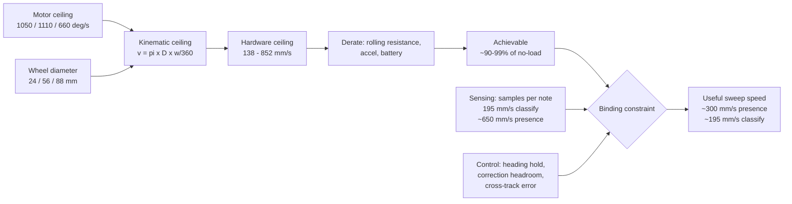

# Speed Envelope — how fast the hardware *can* go, and how fast it *should*

**Type:** EXTERNAL research · **Created:** 2026-08-25 · **Status:** open — every hardware figure here is a
published specification, not a measurement. Nothing in this project has been measured.
**Answers:** *"we don't know how fast the motors spin or how fast the robot is able to move… we need an
upper bound of actual movement."*
**Governs:** the `v` parameter in [../plans/2026-08-25-coverage-strategy-trade-study.md § 3](../plans/2026-08-25-coverage-strategy-trade-study.md#3-parameters-and-what-each-one-actually-is)
and the run times in [../findings/coverage-time-budget.md](../findings/coverage-time-budget.md).

---

## Summary

**The upper bound of actual movement — the question as asked — is ~513 mm/s no-load and ~506 mm/s
rolling on carpet, for a Large 45602 on a Ø56 wheel. Both of those parts are `[ASSUMED]`: neither of
the two motors nor either of the two wheels we own has been identified.** The speed we should *sweep*
at is **~300 mm/s** — and that number is **not a derived ceiling**. It is the speed the 3-sensor option
needs to hit the 5-minute gate, back-solved from the trade study, which happens to sit inside the
motor/wheel envelope for a large or medium motor. Whether it is *safe* is a control question, and
**nobody has measured it**. Confidence in the arithmetic: HIGH. Confidence in 300 mm/s as a usable
sweep speed: **MEDIUM**.

- If colour **classification** is required, the ceiling falls to **~195 mm/s**, bounded by *sensing*
  ([trade study § 7.1](../plans/2026-08-25-coverage-strategy-trade-study.md#71-the-worst-case-chord-is-31-mm-not-20-mm)).
  The *arithmetic* is firm; its inputs are not — `W` = 76 mm is `[ASSUMED]` and `D_spot` = 12 mm is a
  single community measurement ([color-discrimination § 5.1](./color-discrimination.md#51-spot-size-governs-everything)).
- If **presence detection** suffices, sensing permits roughly 650 mm/s at a full 100 Hz loop —
  on an `[ASSUMED]` 3 pure samples per crossing, which no source states — so the binding constraint
  becomes heading hold and cross-track error, **unmeasured**, which is where the MEDIUM confidence
  comes from.
- The **hardware ceiling** under the reference combination used throughout (Large 45602 + Ø56 wheel —
  `[ASSUMED]`, and *not* the most likely one: the SPIKE Prime set ships two Mediums for every Large) is
  **513 mm/s** no-load, **~506 mm/s** after carpet rolling resistance. The gap between the hardware
  ceiling and the useful ceiling is roughly **1.7×**. We are not motor-limited, and gearing up is a trap.
- **250 mm/s is not an upper bound of anything.** On Ø56 wheels it is 48.7 % of the large motor's
  no-load ceiling and 77.5 % of the small motor's. Every Ø56 and Ø88 combination exceeds it; **no Ø24
  combination reaches it at all** — not even a large motor, which tops out at 219.9 mm/s on Ø24.
  See [§ Impact on the trade study](#impact-on-the-trade-study) — this is not academic; **v ≥ 300 mm/s
  moves the 3-sensor option from "5.77 min, still over" to exactly the 5-minute gate.**
- **Three motors are candidates, not two — probably.** The brief lists Large 45602 and Small 45607, and
  [`inventory.py`](../../inventory.py) records the line only as **Motors** (qty 2, 10 SB each) — no
  part number.
  The Medium is a **hypothesis, not a sighting**: the SPIKE Prime set 45678 ships
  **two Medium Angular Motors 45603 and one Large** — and the SPIKE 3 API exposes
  a **Medium** velocity ceiling of 1110 deg/s, *higher* than the large's 1050. The medium must be ruled
  out by observation, not by assumption. Its no-load speed is within 5.7 % of the large's, which is inside
  the ±15 % spec tolerance — **so a no-load spin test cannot tell large from medium.** Only torque, the
  device ID, or physical inspection can.
- **Three wheels are candidates.** Ø56 (LEGO-official, the base set), Ø88 (the expansion set), Ø24
  (a rim+tyre in the base set). The difference is linear in ground speed: 3.7× from smallest to largest.



---

## Motor specifications

All three fact sheets were fetched and text-extracted on 2026-08-25 (see [Sources](#sources)). These are
**LEGO-official**. Every performance figure carries LEGO's own **±15 %** tolerance.

| | **Large Angular 45602** | **Medium Angular 45603** | **Small Angular 45607** |
|---|---|---|---|
| Product line | SPIKE Prime | SPIKE Prime | SPIKE **Essential** |
| Voltage range | 5–9 V, data at **7.2 V** | 5–9 V, data at **7.2 V** | 3.3–6 V, data at **5 V** |
| **No load** | 0 Ncm, **175 RPM**, 135 mA | 0 Ncm, **185 RPM**, 110 mA | 0 Ncm, **110 RPM**, 55 mA |
| **Max efficiency** | **8 Ncm**, **135 RPM**, 430 mA | **3.5 Ncm**, **135 RPM**, 280 mA | **1.8 Ncm**, **85 RPM**, 170 mA |
| **Stall** | **25 Ncm**, 0 RPM, 1900 mA | **18 Ncm**, 0 RPM, 800 mA | **5 Ncm**, 0 RPM, 340 mA |
| Encoder resolution | 360 counts/rev | 360 counts/rev | 360 counts/rev |
| Encoder accuracy | ≤ ±3° (sensor + gearbox slack) | ≤ ±3° | sensor ±1°, **control ±3°** |
| Update rate | 100 Hz | 100 Hz | 100 Hz |
| Wire | 250 mm | 250 mm | 250 mm |
| Output faces | crosshole one side, **disc + crosshole** other | crosshole one side, **disc + crosshole** other | **rotating disc only** |

**In deg/s** (RPM × 6): large **1050**, medium **1110**, small **660** no-load; at max efficiency
**810 / 810 / 510**.

**The 1050 vs 660 figures in existing project research are confirmed** — independently, from two
directions. They are the LEGO fact-sheet no-load speeds converted (175 × 6 = 1050; 110 × 6 = 660), *and*
they are the exact velocity clamps the SPIKE 3 API documents. **No disagreement found.** What existing
research omits is the **medium at 1110 deg/s / 185 RPM**, which is both a real motor and the *fastest* of
the three.

### Shape of the speed–torque curve

LEGO publishes three points, not a curve. Fitting straight lines between them:

| Motor | Slope 0 → max-eff | Slope max-eff → stall | Single straight line no-load→stall would predict… |
|---|---|---|---|
| Large 45602 | **−5.00 RPM/Ncm** | −7.94 RPM/Ncm | 119 RPM at 8 Ncm — actual is **135** |
| Medium 45603 | **−14.29 RPM/Ncm** | −9.31 RPM/Ncm | 149 RPM at 3.5 Ncm — actual is **135** |
| Small 45607 | **−13.89 RPM/Ncm** | −26.56 RPM/Ncm | 70.4 RPM at 1.8 Ncm — actual is **85** |

Two things fall out, and both matter more than the headline speeds:

1. **The curve is not a straight line.** A textbook brushed-DC motor droops linearly from no-load to
   stall. These do not: the large and small motors sit *above* the straight line at their efficiency
   point, the medium *below* it. Do not model these motors with a single linear droop — at the large
   motor's efficiency point (8 Ncm) it predicts 119 RPM against an actual 135, a **13 %** under-prediction.
   **The error is largest there and vanishes at light load**: in the 0.25–0.77 Ncm band this robot
   actually occupies, the straight line and the correct segment differ by under 1 %, so the two-segment
   fit matters for *reasoning about the motor*, not for the derating numbers below.
2. **Stiffness, not top speed, separates the large motor from the other two.** In the light-load region
   we actually live in, the large motor loses **5 RPM per Ncm**; the medium and small lose ~14 — nearly
   **3× softer**. On a Ø56 wheel that is **−14.7 mm/s per Ncm** (large) versus **−41.9** (medium) and
   **−40.7** (small). A carpet seam that costs 1 Ncm costs the large motor 15 mm/s of ground speed and
   the small one 41 mm/s. *That* is the real content of "the large motor has headroom".

---

## Wheel options, and how to tell them apart

### What actually exists

| Wheel | Diameter | Circumference (π·D) | Where it ships | Source |
|---|---|---|---|---|
| **Ø56 × 14** (part **39367**, wheel+tyre assembly) | **56.0 mm** | **175.93 mm** | SPIKE Prime set 45678, **×4** | LEGO-official diameter; part no. community |
| **Ø88 × 14.34** (part **49295**) | **88.0 mm** | **276.46 mm** | SPIKE Prime **Expansion** set 45681, **×4** | LEGO-official element name "Wheel ø88"; part no. community |
| **Ø24 × 7** tyre (**61254**) on Ø18 × 8 rim (**56903**) | **24.0 mm** | **75.40 mm** | SPIKE Prime set 45678, **×3** | community |
| Wedge-belt wheel/pulley (**4185**) + tyre (**2815**) | not established | — | SPIKE Prime set 45678, ×2 | community — a pulley, **not** a drive wheel |

**The project's 56 mm / 176 mm assumption is confirmed as a real LEGO wheel with a real LEGO-published
figure** — LEGO Education's own *Going the Distance* lesson states verbatim: *"The wheel you'll be using
has a diameter of 5.6 cm (2.2 in.) and travels a distance of 17.6 cm (6.9 in.) per rotation."* Prime
Lessons (community) gives both standard sizes: *"Small SPIKE Prime Wheels = 5.6cm in diameter … 17.6cm per
rotation"* and *"Large SPIKE Prime Wheels = 8.8 cm in diameter … 27.6 cm per rotation."*

**But confirming the wheel exists is not confirming it is ours.** [KU-M3](../plans/known-unknowns.md) stays
open. Two wheels were bought at 7 SB each ([`inventory.py`](../../inventory.py)) and nobody has looked at
them.

**The geometric circumference is not the rolling circumference.** The same Prime Lessons deck that gives
17.6 cm geometric uses **17.5 cm** in its worked code for Droid Bot IV (0.6 % lower). **The deck gives no
reason for the difference** — it says only that Droid Bot IV uses "smaller wheels" than the Advanced
Driving Base's 27.6 cm ones. Loaded-tyre deflection is the obvious explanation but it is **our inference,
UNVERIFIED**, and rounding in a lesson is an equally good one. Either way the lesson stands: use the
measured number, not π·D. Bench item 4 below produces it.

### How the Builder tells which wheel we own

1. **Read the tyre.** Prime Lessons (community): *"Look up the wheel size in mm printed on your tire."*
   LEGO moulds the size into the sidewall. If it reads 56 × 14 you are done.
2. **Put a ruler across it.** 24, 56 and 88 mm are not confusable — this is a 5-second test and it
   needs no software.
3. **Roll it one revolution** against a ruler, on the demo surface, with the robot's weight on it. This is
   the only number the code should use, and it is bench item 4.

### How the Builder tells which motor we own

**Correction to existing project research.** [motion-control-and-odometry.md § Motor choice](./motion-control-and-odometry.md#motor-choice--and-telling-ours-apart)
says a motor with a crosshole opposite the disc "is the large one". Comparing the fact sheets directly:
the **medium 45603 carries the identical wording** — *"Crosshole output on one side, rotating disc with
Crosshole and building interface on the other side"*. **The output-face test excludes the small motor. It
does not distinguish large from medium.** Use it as a first cut, then:

| Test | Separates | Notes |
|---|---|---|
| Output faces (above) | small vs {large, medium} | LEGO-official wording, no hub needed |
| Physical bulk | medium vs large | LEGO calls the medium *"Low-profile design for smaller models where space is limited"*. Qualitative — LEGO publishes no motor dimensions |
| **No-load spin test** | small (660) vs {large 1050, medium 1110} | **Cannot separate large from medium**: 5.7 % apart, inside LEGO's own ±15 % tolerance |
| **Device type ID** | all three | 48 = SPIKE Prime Medium, 49 = SPIKE Prime Large, 65 = Technic Small Angular (community: pybricks/technical-info). Whether the ID is readable on stock Hub OS is **UNVERIFIED** — try it in [../runbooks/hub-identification.md](../runbooks/hub-identification.md) |
| **Stall/holding torque** | large (25 Ncm) vs medium (18) vs small (5) | Crude but decisive: hold the output and feel it. Do not stall a motor for more than a second |

**Why it matters here and not only for odometry:** the medium is the *fastest* motor and the *softest* of
the two SPIKE Prime ones. If we own two mediums, top speed goes **up** 5.7 % and stiffness goes **down**
almost 3×. That is the opposite trade from the one [KU-T3](../plans/known-unknowns.md) currently frames.

---

## Kinematic ceiling table

`v = π × D × (ω / 360)` for ω in deg/s, D in mm, v in mm/s. Worked once in full:

```
Large 45602, Ø56 wheel, no load:
  ω = 175 RPM × 6            = 1050 deg/s
  rev/s = 1050 / 360         = 2.9167 rev/s
  C = π × 56                 = 175.93 mm
  v = 2.9167 × 175.93        = 513.1 mm/s
```

**No-load ground speed (mm/s) — the hardware ceiling, zero load, zero derating:**

| | **Ø24** (75.40 mm) | **Ø56** (175.93 mm) | **Ø88** (276.46 mm) |
|---|---|---|---|
| **Large 45602** — 1050 deg/s | 219.9 | **513.1** | 806.3 |
| **Medium 45603** — 1110 deg/s | 232.5 | **542.4** | 852.4 |
| **Small 45607** — 660 deg/s | 138.2 | **322.5** | 506.8 |

**At maximum efficiency (mm/s)** — *not* an upper bound, this is the point of best torque-per-watt, and
the robot only sits here if the load happens to equal 8 / 3.5 / 1.8 Ncm, which it does not:

| | **Ø24** | **Ø56** | **Ø88** |
|---|---|---|---|
| **Large 45602** — 810 deg/s | 169.6 | **395.8** | 622.0 |
| **Medium 45603** — 810 deg/s | 169.6 | **395.8** | 622.0 |
| **Small 45607** — 510 deg/s | 106.8 | **249.2** | 391.7 |

**Read this table as the answer to the operator's question.** Six of the nine no-load cells and **five**
of the nine max-efficiency cells exceed 250 mm/s. **The combinations that cannot reach 250 mm/s are all
three Ø24 cells** — large 219.9, medium 232.5, small 138.2 — not just the small motor's. On Ø56, the
small motor's max-efficiency figure (249.2 mm/s) misses 250 by 0.8 mm/s, which is well inside LEGO's own
±15 % tolerance and should not be read as a real distinction.

**Percent of the API velocity ceiling at a given ground speed, Ø56 wheels** (`ω = v × 360 / 175.93 = v ×
2.0463`):

| Ground speed | ω command | Large (1050) | Medium (1110) | Small (660) |
|---|---|---|---|---|
| 150 mm/s | 307 deg/s | 29.2 % | 27.7 % | 46.5 % |
| 195 mm/s (classification ceiling) | 399 deg/s | 38.0 % | 35.9 % | 60.5 % |
| 250 mm/s (trade-study midpoint) | 512 deg/s | 48.7 % | 46.1 % | **77.5 %** |
| **300 mm/s** | 614 deg/s | **58.5 %** | 55.3 % | **93.0 %** |
| 360 mm/s | 737 deg/s | 70.2 % | 66.4 % | **111.6 % — impossible** |
| 400 mm/s | 819 deg/s | 78.0 % | 73.7 % | **124 % — impossible** |

---

## Derating to reality

### Mass — what is actually published

| Item | Mass | Status |
|---|---|---|
| Technic Large Hub 45601, **without battery** | **63 g** | **LEGO-official** (fact sheet) |
| Rechargeable battery 45610 (2100 mAh / 7.3 V Li-po) | **not published** | LEGO's battery fact sheet gives capacity, cycles and form factor — **no mass** |
| Large Angular Motor 45602 | **76 g** | **community, and ambiguous** — a set database whose page reads *"contains of 1 pieces and weighs 76 grams"*, so it may be quoting the packaged item, not the part |
| Wheels, beams, sensor, chassis | not published | — |

**No credible whole-robot mass exists, and none is invented here.** Everything below is therefore
tabulated across a mass *range* wide enough that the conclusion does not depend on which value is right:
**0.4 kg** (implausibly light) to **1.2 kg** (heavy chassis, battery, three sensors).

### Rolling resistance

`F = Crr × m × g`, and the torque the two drive motors must jointly supply is `T = F × r`, r = wheel
radius. Coefficients from a fetched experiment (community, PocketLab, a 0.137 kg cart coasting to rest):
carpet **Crr = 0.0465**, wood floor **Crr = 0.00757** — *"it requires about 6 times more force per unit
weight to keep the cart moving at a constant speed on the carpet than on the wood floor."* Small hard
wheels on carpet pile will be at least this bad, so treat 0.0465 as a floor for carpet, not a ceiling.

**Torque required, Ø56 wheel (r = 28 mm), per motor** (total ÷ 2):

| Surface | m = 0.4 kg | m = 0.75 kg | m = 1.2 kg |
|---|---|---|---|
| Hard floor (0.00757) | 0.042 Ncm | 0.078 Ncm | 0.125 Ncm |
| **Carpet (0.0465)** | 0.255 Ncm | **0.479 Ncm** | 0.766 Ncm |

Compare to what the motors have at their efficiency point: **8 / 3.5 / 1.8 Ncm**. Even the worst cell —
1.2 kg on carpet — asks **0.766 Ncm**, which is **9.6 %** of the large motor's max-efficiency torque,
**22 %** of the medium's and **43 %** of the small's. Rolling resistance is *not* what stops this robot
going fast.

### Where the robot actually sits on the curve

Intersecting the load torque with the light-load segment of each curve (`RPM = no-load + slope × T`),
Ø56 wheel, carpet:

| Load per motor | **Large 45602** | **Medium 45603** | **Small 45607** |
|---|---|---|---|
| 0.255 Ncm (0.4 kg) | 173.7 RPM = **509 mm/s** (99.3 %) | 181.3 RPM = 532 mm/s (98.0 %) | 106.4 RPM = 312 mm/s (96.8 %) |
| **0.479 Ncm (0.75 kg)** | 172.6 RPM = **506 mm/s** (**98.6 %**) | 178.2 RPM = 522 mm/s (96.3 %) | 103.3 RPM = **303 mm/s** (94.0 %) |
| 0.766 Ncm (1.2 kg) | 171.2 RPM = **502 mm/s** (97.8 %) | 174.1 RPM = 510 mm/s (94.1 %) | 99.4 RPM = 291 mm/s (90.3 %) |

**Answer to "what fraction of no-load is realistically achievable": 90–99 %, and the source is LEGO's own
published speed–torque points intersected with a measured rolling-resistance coefficient.** That is far
higher than intuition suggests, and it is the single most important correction in this document: **steady
rolling on carpet barely derates a SPIKE motor.** The motors are closed-loop velocity-regulated (SPIKE 3
`motor.run` takes a velocity, and the hub regulates to it), so within available torque you get the speed
you asked for; the curve only bites when you ask for something near the ceiling.

**What *does* remove speed, in order of size:**

1. **The command ceiling equals the no-load speed** — no reserve above it. A gyro heading loop adds
   velocity on one side and subtracts on the other; at base velocity `V` the correction available is
   `ceiling − V`. On a small motor that is 148 deg/s (22 %) at 250 mm/s and 46 deg/s (7 %) at 300 mm/s,
   after which the loop saturates on one side and behaves asymmetrically for left and right errors.
2. **Transients** — carpet seams, pile direction, a snagged cable. No published magnitude for LEGO tyres
   (**UNVERIFIED**), but the stiffness figures convert any guess directly: 1 Ncm costs 15 mm/s on a large
   motor, 41 mm/s on a medium or small.
3. **Battery voltage.** The large/medium curves are quoted at 7.2 V against a 7.3 V nominal pack, so the
   published curve is roughly the fresh-pack curve; how far it scales down as the pack sags is
   **UNVERIFIED** (LEGO publishes no derating curve). The small 45607 is specified 3.3–6 V and would run
   *above* its rated maximum on this hub — **UNVERIFIED**, and an argument against it for drive.
4. **Acceleration ramps.** Default 1000 deg/s² = **488.7 mm/s²** on a Ø56 wheel: 63.9 mm of travel to
   reach 250 mm/s, 92.1 mm to reach 300. Negligible on one 3.05 m lane; over 67 lanes it is 6.2 m of
   accelerating, and **12.3 m if each lane also decelerates to a stop for its turn** — still ~6 % of a
   204 m path, and largely already inside the `t_turn` figure.

### Checking the "78 % of its ceiling" claim

[motion-control-and-odometry.md](./motion-control-and-odometry.md#motor-choice--and-telling-ours-apart)
states the small motor "sits at 78 % of its ceiling at presence-only sweep speed". **The arithmetic is
right:** 250 × 360 / 175.93 = 511.6 deg/s; 511.6 / 660 = **77.5 %**. **The stated reason is not.** That
document attributes the problem to torque headroom — *"a drive near its torque limit stutters over carpet
seams"*. At 250 mm/s the small motor is at 85.3 RPM, essentially its max-efficiency point, where it can
deliver **1.8 Ncm** against a required **~0.48 Ncm** — a **3.8× torque margin**, not a shortage.

The two real defects at 78 % are **velocity headroom of 22 %, one-sided** (the loop can slow the inner
wheel freely but can add only 148 deg/s to the outer before clipping), and a **2.8× softer curve** — the
same seam costs 41 mm/s instead of 15 mm/s, so 2.8× the sample-pitch error and 2.8× the heading kick.

**The recommendation — use the large motor for drive — survives the correction and is strengthened;** only
its mechanism changes. Worth fixing there, because "no torque headroom" invites the wrong fix (gear down)
where "soft curve, no velocity headroom" invites the right one (use a stiffer motor).

**One more row in that document is stale.** Its speed table quotes *"160 mm/s (classification-limited)"*
and derives 327 deg/s / 31 % / 50 % from it. **The arithmetic is correct** (160 × 2.0463 = 327.4;
÷1050 = 31.2 %; ÷660 = 49.6 %) but the **input is superseded**: 160 mm/s comes from a 20 mm chord, and
[trade study § 7.1](../plans/2026-08-25-coverage-strategy-trade-study.md#71-the-worst-case-chord-is-31-mm-not-20-mm)
showed the worst *guaranteed* chord this sweep produces is 31.5 mm, giving **195 mm/s**. Where the two
documents disagree, **the trade study's 195 mm/s is right and motion-control's 160 mm/s is wrong**,
because the 20 mm chord is not a geometry the lane spacing can actually produce. The 150 mm/s the trade
study *uses* stays conservative-but-defensible either way.

---

## Gearing — can we buy speed?

**LEGO gear geometry.** Pitch radius in studs = teeth ÷ 16, so two meshing gears sit at
`(t1 + t2) / 16` studs (community: technicbrickpower FAQ). **That source states the rule for
parallel-axis (spur) meshes**; the four sizes in the set are *bevel* gears, and whether the z12 bevel
(32270) in particular will run as a parallel-axis spur at these spacings is **UNVERIFIED**. The spacings
below are therefore indicative, not a build instruction — which matters little, because the verdict is
not to gear at all. The SPIKE Prime set 45678 contains bevel gears
in four sizes — **z12 (32270) ×3, z20 (18575) ×3, z28 (46372) ×3, z36 (32498) ×3** (community
inventory). Practical speed-*up* ratios, motor gear driving the smaller wheel gear:

| Motor gear → wheel gear | Ratio | Axle spacing | Pairs available |
|---|---|---|---|
| z36 → z12 | **3.00 : 1** | 48/16 = **3.0 studs** | yes (3 of each) |
| z28 → z12 | 2.33 : 1 | 40/16 = 2.5 studs | yes |
| z36 → z20 | 1.80 : 1 | 56/16 = 3.5 studs | yes |
| z20 → z12 | 1.67 : 1 | 32/16 = **2.0 studs** | yes |

**What 3:1 would buy, and what it costs.** Large motor, Ø56 wheel, carpet, 0.75 kg:

- Torque reflected to the motor triples: 0.479 → **1.44 Ncm**, still 18 % of max-efficiency torque.
  Speed at 1.44 Ncm = 175 − 5 × 1.44 = 167.8 RPM at the motor → 503 RPM at the wheel → **1476 mm/s**.
  Torque is genuinely not the obstacle.
- **Encoder resolution at the wheel is divided by the ratio** — the cost that matters:

| Wheel | Direct drive | With 3:1 speed-up |
|---|---|---|
| Ø56 | 0.489 mm per motor degree; ±3° = **±1.47 mm** | 1.466 mm per degree; ±3° = **±4.40 mm** |
| Ø88 | 0.768 mm per degree; ±3° = ±2.30 mm | 2.304 mm per degree; ±3° = ±6.91 mm |
| Ø24 | 0.209 mm per degree; ±3° = ±0.63 mm | 0.628 mm per degree; ±3° = ±1.88 mm |

The cross-track error budget is **15 mm** and the lane pitch derived from it is 46 mm
([trade study § 3](../plans/2026-08-25-coverage-strategy-trade-study.md#3-parameters-and-what-each-one-actually-is)).
Gearing 3:1 on Ø56 wheels spends **±4.4 mm — 29 % of the entire `e` budget — on quantisation alone**,
before any drift.

- **Backlash.** LEGO's ±3° spec covers *"the tolerances in the sensor combined with the gearbox slack"* —
  the motor's **internal** gearbox only. Each external mesh adds its own slack, multiplied by the ratio at
  the wheel. Magnitude for LEGO bevel meshes: **UNVERIFIED**, no fetched source. Direction is not in doubt.
- **We may own no gears at all** — the ledger shows motors and wheels only
  ([`inventory.py`](../../inventory.py)); [KU-T4](../plans/known-unknowns.md) is open. Gears would be a
  purchase at an unknown price against 56 SB.

**Verdict: gearing up is a trap for a two-week project.** It solves a problem we do not have — the
hardware ceiling is already ~1.7× the useful ceiling — and pays for it in the one currency the coverage
arithmetic is most sensitive to. Note the symmetry with [KU-D7](../plans/known-unknowns.md), which asks
about gearing *down* for resolution: that direction buys something real (0.489 → 0.244 mm/count at 2:1)
and costs top speed we can afford to lose. **If any gearing is considered, it is that one, and only after
cross-track error is measured.**

---

## API ceilings — command versus delivery

### Hub OS 3 (`import motor`, `import motor_pair`) — deg/s

Velocity is in **degrees per second**, and the accepted range is **per motor type**:

| Motor | Accepted velocity | Equals |
|---|---|---|
| Small (Essential) | −660 … 660 | its no-load speed |
| **Medium** | −1110 … 1110 | its no-load speed |
| Large | −1050 … 1050 | its no-load speed |

Confirmed from two independent fetches: the Tufts CEEO SPIKE 3 mirror and the Prime Lessons Hub OS 3
*Moving Straight* deck, which prints the same three lines verbatim. Other relevant limits:

- `motor_pair.move(pair, steering, velocity=360, acceleration=1000)` — **default velocity 360 deg/s**
  (= 176 mm/s on Ø56), steering **−100 … 100**.
- `acceleration` / `deceleration`: **1 … 10000** deg/s².
- `motor.set_duty_cycle(port, pwm)`: **−10000 … 10000** — the unregulated path. It bypasses the velocity
  regulator but cannot exceed the no-load speed, because that *is* what 100 % duty produces at zero load.
- `motor.velocity(port)` returns the achieved velocity in deg/s. This is the measurement instrument for
  every bench item below.

**The API ceiling is exactly the physical ceiling, which means there is no command reserve.** Commanding
1050 deg/s on a loaded drive asks for something the motor cannot produce at any load above zero. **What
the hub does when a velocity above the type's ceiling is requested — raise, clamp, or misbehave — is
UNVERIFIED**; no fetched source states it. This is why the identification spin test is done wheels-off.

### Hub OS 2 (`from spike import PrimeHub`, `MotorPair`) — percent

Speed is a **percentage, −100 … 100**, per the Prime Lessons Hub OS 2 *Moving Straight* deck's parameter
tables for `.move(...)` and `.move_tank(...)`; the same deck notes *"Power can be anywhere between −100 %
to 100 %"* for the `start_at_power` family, and the Butler booklet's `motors.start_tank(100, -100)` is
commented *"forward full speed"*.

**The percentage is of that motor's own maximum.** LEGO's fact sheets describe the built-in speed sensor
as measuring *"percentage of maximum design speed"*. So `speed=50` is **525 deg/s** on a large motor,
**555** on a medium and **330** on a small — three different ground speeds from one number. Under SPIKE 3
the same command is an absolute deg/s and is identical across motors.

**Consequence for our code:** the `src/` adapter converts mm/s → the generation's unit, and cannot
do so without both the API generation ([KU-M1](../plans/known-unknowns.md)) and the motor type
([KU-T3](../plans/known-unknowns.md)). A percent speed copied from a tutorial is meaningless until both
are closed.

### Command versus delivery

| Layer | Ceiling, Large + Ø56 |
|---|---|
| API accepts | 1050 deg/s = **513 mm/s** |
| Motor delivers, no load | 1050 deg/s = **513 mm/s** |
| Motor delivers, 0.75 kg on carpet | ~1036 deg/s = **506 mm/s** |
| Usable with heading-correction headroom (say 150 deg/s reserve) | ~900 deg/s = **440 mm/s** |
| Sensing permits, presence-only at a **verified** 100 Hz | ~650 mm/s — not binding |
| Sensing permits, presence-only at 40 Hz | **~260 mm/s — binding** |
| Sensing permits, classification | **~195 mm/s — binding** |

---

## The practical ceiling

**~300 mm/s, presence-only, Large or Medium motors on Ø56 wheels. Confidence MEDIUM.**

**Be precise about what kind of number this is.** It is *not* derived from control or sensing — neither
produces 300. It is the speed the 3-sensor option needs to hit the 5-minute gate
([§ Impact on the trade study](#impact-on-the-trade-study)), tested here against every ceiling this
document can compute. It clears three of them and **is blocked by two** — at 0.75 kg on carpet:

| Ceiling | Ø56, presence-only | Binds at 300 mm/s? |
|---|---|---|
| Motor + wheel, large / medium | 506 / 522 mm/s | No — 1.7× headroom |
| Motor + wheel, **small** | **303 mm/s** (291 at 1.2 kg) | **Yes** |
| Sensing, 100 Hz achieved | ~650 mm/s | No |
| Sensing, 40 Hz achieved | ~260 mm/s | **Yes** |
| Control (cross-track error) | **UNMEASURED** | **Unknown — this is the whole risk** |

So: 300 mm/s is a *target that survives the ceilings we can compute*, and two of the five rows above are
open. Why each row reads the way it does:

- **The motor is not the binding term — unless we own small motors.** Margin has to be read at the
  *commanded speed*, not at the motor's max-efficiency point. At 300 mm/s a Ø56 wheel turns 102.3 RPM;
  on the full-duty curve the large motor still offers **12.1 Ncm** there against the ~0.48 Ncm required
  — a **25×** margin (medium: 7.0 Ncm, **15×**). The small motor at 102.3 RPM offers only **0.55 Ncm**
  — **1.2×**, i.e. essentially none. Its own row in
  [§ Where the robot actually sits on the curve](#where-the-robot-actually-sits-on-the-curve) says the
  same: 303 mm/s at 0.75 kg and **291 mm/s at 1.2 kg**. **On two small motors, 300 mm/s is not "at the
  edge" — on a heavy chassis it is unreachable.**
- **Sensing is not binding either, in presence-only mode.** The worst guaranteed chord across a 76 mm note
  is **31.5 mm** ([trade study § 7.1](../plans/2026-08-25-coverage-strategy-trade-study.md#71-the-worst-case-chord-is-31-mm-not-20-mm));
  with a 12 mm spot that leaves 19.5 mm of pure interior, and — on an **`[ASSUMED]` `N_pure` = 3**, which
  is our choice and not a figure any cited source gives — 100 Hz permits ~650 mm/s (`100 × 19.5 / 3`).
  **This collapses if the achieved Python loop rate is not 100 Hz** — at 40 Hz
  it becomes ~260 mm/s and *is* binding. That measurement has not been made
  ([trade study § 6.3](../plans/2026-08-25-coverage-strategy-trade-study.md#63-loop-rate--o4s-real-risk)).
- **Control is the one term that could still refute 300 mm/s, and it is unmeasured.** Higher speed does not obviously raise the
  cross-track error `e` — a shorter lane gives gyro drift less time to accumulate — but wheel slip rises
  with speed and acceleration, and Borenstein ran UMBmark at 0.2 m/s deliberately for that reason
  ([motion-control-and-odometry.md](./motion-control-and-odometry.md#speed-limits--where-control-meets-detection)).
  **Which effect dominates at 300 mm/s on our chassis is unknown.**
- **If classification is required the answer is ~195 mm/s instead**, bounded by sensing, and no motor
  choice changes it.

**The falsifier is cheap and it is bench item 7:** sweep the speed and watch `e`. If `e` at 300 mm/s is
worse than 15 mm, the higher speed is *self-defeating* — see the next section for exactly how much.

---

## Impact on the trade study

**Do not edit [../plans/2026-08-25-coverage-strategy-trade-study.md](../plans/2026-08-25-coverage-strategy-trade-study.md)
— it is another agent's file.** What follows is what that document's author would need to change.

**§ 13 says a measured ground speed well above 250 mm/s would overturn part of the study. It can be
exceeded, and here is by how much.** Reworking § 5's own formula
(`passes = ceil(side / (N·L))`, `t = path/v + (passes−1)·t_turn`) for the 10 ft arena, `e` = 15 mm,
`L` = 46 mm, and solving for the `v` that hits a 300-second gate:

| N sensors | Passes | Path | Turn time @3.0 s | **v needed for 5 min** | Feasible? |
|---|---|---|---|---|---|
| 1 | 67 | 204.35 m | 198 s | **2003 mm/s** | **No — 3.9× the hardware ceiling.** Even at infinite speed the turns alone are 3.3 min |
| 2 | 34 | 103.70 m | 99 s | **516 mm/s** | **No** — 100.6 % of a large motor's Ø56 no-load ceiling |
| **3** | 23 | 70.15 m | 66 s | **300 mm/s** | **Yes** — 58.5 % of a large motor's ceiling, with torque to spare |

With the optimistic `t_turn` = 1.5 s the N = 3 requirement drops to **263 mm/s** and N = 2 to 414 mm/s
(81 % of ceiling — kinematically possible, but far past what sensing allows).

**So the precise statement is:**

- **§ 8.5's headline sentence is speed-sensitive for exactly one option.** It currently reads *"three
  sensors comes closest at 5.77 min modelled, and the gap is closed by reducing `e`, by the professor
  relaxing the limit, or not at all."* **There is a fourth way to close it: run at 300 mm/s.** That is
  inside the hardware envelope of a Large or Medium 45602/45603 on Ø56 wheels — **25× / 15×** torque
  margin at that speed — and it survives derating (achievable speed on carpet is 502–522 mm/s).
  **It is not inside a Small 45607's envelope**: two small motors deliver 291–303 mm/s on carpet across
  the plausible mass range, so on small motors this way of closing the gap does not exist.
- **§ 13's first bullet should be sharpened** from "a measured ground speed well above 250 mm/s" to
  "**a measured, heading-stable ground speed of 300 mm/s rescues O4 and only O4**". One and two sensors
  are refuted by the turn overhead alone, at any speed the hardware can produce.
- **§ 3's `v` row needs its basis corrected.** It cites the large motor's 396 mm/s max-efficiency figure
  as the reference point. Max efficiency is not a ceiling and the robot never sits there: the load is
  ~0.5 Ncm, not 8 Ncm, so the operating point is **506 mm/s**, and 250 mm/s is 49 % of it. The same row's
  claim that a small motor "leaves no torque headroom at 250 mm/s" is wrong — the margin is 3.8× — the
  real deficits are velocity headroom (22 %) and a 2.8× softer curve.
- **§ 3 should add the Medium 45603 as a third candidate.** It is faster than the large (1110 vs 1050
  deg/s) and as soft as the small.

**But the speed lever is weaker than the `e` lever, and can be self-cancelling.** Same formula, N = 3,
`t_turn` = 3.0 s, varying the cross-track error:

| `e` | `L` = 76 − 2e | Swath 3L | Passes | Path | **v needed for 5 min** |
|---|---|---|---|---|---|
| 10 mm | 56 mm | 168 mm | 19 | 57.95 m | **236 mm/s** |
| 15 mm | 46 mm | 138 mm | 23 | 70.15 m | **300 mm/s** |
| 20 mm | 36 mm | 108 mm | 29 | 88.45 m | **410 mm/s** |

**If running at 300 mm/s degrades `e` from 15 mm to 20 mm, the option fails at 300 mm/s** — it would then
need 410. Speed and cross-track error are coupled through the lane count, and the coupling is roughly
quadratic in effect. **This is why bench item 7 measures `e` *at* the speed, not the speed alone.**

---

## Bench procedure — one class session

Builder operates (roles are enforced); Programmer observes and records. **Items 1–2 need no chassis and no
floor space.** Record everything in [../hardware/build-record.md](../hardware/build-record.md) with units,
surface, and date, per [../directives/honest-instrumentation.md](../directives/honest-instrumentation.md).
Nothing here may be reported unless it was run.

1. **Identify the wheels — 3 minutes, no hub.** Read the size moulded into each tyre sidewall. Measure the
   outside diameter of both with a ruler across the tread. **Record two numbers, not one** — if they
   differ, that difference *is* Borenstein's `Ed` and it is the dominant heading error. Expect 56, 88 or
   24 mm.
2. **Identify the motors — 5 minutes, no hub.** (a) Look at both output faces: disc-only on both sides
   ⇒ **Small 45607**, done. (b) If one face has an axle crosshole, it is a Large **or a Medium** — the
   fact sheets do not distinguish them here. Compare bulk against LEGO's *"low-profile"* description of
   the medium, and photograph both motors for the record.
3. **Read the device type ID — 5 minutes, hub connected, read-only.** Follow
   [../runbooks/hub-identification.md](../runbooks/hub-identification.md). Look for **49** (Large), **48**
   (Medium) or **65** (Small). If the call does not exist on our Hub OS, record that it does not — that
   is a result — and rely on step 5.
4. **Effective rolling diameter — 15 minutes, chassis needed.** Wheels **on the demo surface**, full robot
   weight on them. Mark the start, command exactly 360 motor degrees (SPIKE 3: `motor.run_for_degrees`),
   measure the travel with a tape. **Five trials, report mean and spread.** Repeat on the second surface
   (carpet *and* hard floor) — the answers will differ. Expect ~175 mm geometric, ~175 mm or a little less
   loaded; Prime Lessons uses 17.5 cm where geometry says 17.6. **This number, not π·D, goes into the
   code.**
5. **No-load velocity ceiling — 10 minutes, wheels OFF the ground.** Chock the robot up. Command a ramp
   of velocities 100 → 700 deg/s in 100 deg/s steps and log `motor.velocity(port)` at each step for 2 s.
   Then command 1200 deg/s — **above every motor's ceiling** — and record what happens: does it clamp, does
   it raise, does it error? That is currently an open question in
   [motion-control-and-odometry.md](./motion-control-and-odometry.md). **Expect a plateau near 660 (small)
   or 1050–1110 (large/medium).** A plateau near 660 identifies the motor definitively; a plateau near
   1050–1110 does **not** separate large from medium, so fall back on step 3.
6. **Achieved ground speed — 10 minutes, chassis on the demo surface.** Drive a measured 2.0 m straight at
   commanded 300, 500, 700 deg/s. Time it with a stopwatch, three trials each. Compute mm/s and compare
   against `π × (measured diameter from item 4) × ω / 360`. **A shortfall over 5 % is wheel slip or a
   voltage-sag effect** and must be recorded, because every time estimate in
   [../findings/coverage-time-budget.md](../findings/coverage-time-budget.md) rests on it.
7. **Where heading hold degrades — 20 minutes, the item that produces the answer.** Chalk a 3 m straight
   line. Drive it under the gyro heading loop at 150, 250, 300 and 400 mm/s (converted to deg/s using
   item 4's diameter), **three trials each, both directions**. Measure the **lateral deviation at the far
   end** with a tape. That deviation *is* `e`. **Stop at the first speed where `e` exceeds 15 mm — that,
   not the motor, is the practical ceiling**, and the table in
   [§ Impact on the trade study](#impact-on-the-trade-study) converts it straight into a verdict on the
   3-sensor option.
8. **Battery-state repeat — 5 minutes, end of session.** Repeat item 6 at one speed with the pack near
   empty. Record the pack state and the delta. **UNVERIFIED** today; it decides whether the demo needs a
   fresh charge as a procedure step.

**If the session runs short, items 1, 2 and 4 are the ones that unblock everything else** — they close
[KU-T3](../plans/known-unknowns.md) and [KU-M3](../plans/known-unknowns.md), which are the two open
unknowns every speed figure in this repo currently rests on.

---

## Open questions

1. **What does the hub do with a velocity command above the motor type's ceiling?** Raise, clamp, or
   error. No fetched source states it. Bench item 5 answers it; until then, never command above the
   ceiling in mission code.
2. **What is the battery's mass, and the robot's?** LEGO publishes 63 g for the hub without battery and
   nothing else. Every derating figure here is therefore tabulated over a range instead of computed once.
3. **How does the speed–torque curve shift with pack voltage?** LEGO quotes 7.2 V (large, medium) and 5 V
   (small) and publishes no derating curve. The pack is 7.3 V nominal.
4. **What does the hub deliver to a 45607 rated 3.3–6 V?** If we own small motors this is a hardware
   question, not a tuning one.
5. **What is the achieved Python loop rate with one, two and three colour sensors?** It converts directly
   into a speed ceiling (~650 mm/s at 100 Hz, ~260 mm/s at 40 Hz) and is the difference between "sensing
   is not binding" and "sensing is the binding constraint".
6. **Does cross-track error degrade with speed on our chassis, and how fast?** The whole verdict on
   300 mm/s turns on it. Bench item 7.
7. **Are our two wheels the same diameter to within 0.1 mm?** 0.1 mm of mismatch on 56 mm wheels costs
   74 mm of lateral error per lane ([motion-control-and-odometry.md](./motion-control-and-odometry.md)) —
   which dwarfs every speed effect in this document. (Bevel-mesh backlash is also unpublished, but only
   matters if gearing is ever revisited.)

---

## Sources

All URLs fetched **2026-08-25**. PDFs were downloaded and text-extracted locally with `pdftotext`.

**LEGO-official**

- Technic Large Angular Motor 45602 tech fact sheet (175/135/0 RPM, 8/25 Ncm, 360 counts, ±3°, 5–9 V @ 7.2 V) — https://assets.education.lego.com/v3/assets/blt293eea581807678a/bltb9abb42596a7f1b3/5f8801b5f4c5ce0e93db1587/le_spike-prime_tech-fact-sheet_45602_1hy19.pdf?locale=en-us
- Technic **Medium** Angular Motor 45603 tech fact sheet (185/135/0 RPM, 3.5/18 Ncm) — https://le-www-live-s.legocdn.com/sc/media/files/support/spike-prime/techspecs_technicmediumangularmotor-19684ffc443792280359ef217512a1d1.pdf
- Technic Small Angular Motor 45607 tech fact sheet (110/85/0 RPM, 1.8/5 Ncm, 3.3–6 V @ 5 V) — https://assets.education.lego.com/v3/assets/blt293eea581807678a/blt20ee0f27f6735942/60fe86455483765886b0da3c/LE_SPIKE_Essential_Tech_fact_sheet_Small_Angular_Motor_45607_2HY21_Digital.pdf
- Technic Large Hub 45601 tech fact sheet (**hub weight 63 g without battery**, 88 × 56 × 32 mm) — https://assets.education.lego.com/v3/assets/blt293eea581807678a/bltf512a371e82f6420/5f8801baf4f4cf0fa39d2feb/techspecs_techniclargehub.pdf?locale=en-us
- Technic Large Hub Rechargeable Battery 45610 tech fact sheet (2100 mAh / 7.3 V; **no mass published**) — https://assets.education.lego.com/v3/assets/blt293eea581807678a/bltb87f4ba8db36994a/5f8801b918967612e58a69a6/techspecs_techniclargehubrechargeablebattery.pdf?locale=en-us
- *Going the Distance* lesson (**"a diameter of 5.6 cm (2.2 in.) and travels a distance of 17.6 cm (6.9 in.) per rotation"**) — https://education.lego.com/en-us/lessons/prime-extra-resources/going-the-distance/
- SPIKE Prime Expansion Set element overview poster (**"Wheel ø88"**) — https://le-www-live-s.legocdn.com/sc/media/files/support/spike-prime/le_spike_prime_expansion_set_element_overview_classroom_poster_18x24inch-1ffffebb088c5875820d767462b0a1d3.pdf
- Medium Angular Motor 45603 product page (**"Low-profile design for smaller models where space is limited"**) — https://education.lego.com/en-us/products/lego-technic-medium-angular-motor/45603/
- Large Angular Motor 45602 product page (no dimensions or mass published) — https://education.lego.com/en-us/products/lego-technic-large-angular-motor/45602/

**Community — API**

- Tufts CEEO SPIKE 3 mirror (velocity ranges per motor type, `motor_pair.move` default 360, steering ±100, `set_duty_cycle` ±10000, acceleration 1–10000) — https://tuftsceeo.github.io/SPIKEPythonDocs/SPIKE3.html
- Prime Lessons Hub OS 3, *Moving Straight* (prints the same three velocity ranges verbatim) — https://primelessons.org/en/PyProgrammingLessons/SP3MovingStraightPython.pdf
- Prime Lessons Hub OS 2, *Moving Straight* (**speed −100 to 100**; *"Power can be anywhere between -100% to 100%"*) — https://primelessons.org/en/PyProgrammingLessons/MovingStraight.pdf
- Prime Lessons Hub OS 2, *Configuring Robot Movement* (**5.6 cm → 17.6 cm; 8.8 cm → 27.6 cm**; *"Look up the wheel size in mm printed on your tire"*; 17.5 cm used in worked code) — https://primelessons.org/en/PyProgrammingLessons/ConfiguringRobotMovement.pdf
- Butler, *Lego Spike Python Booklet* (`motors.start_tank(100, -100)` — *"forward full speed"*) — https://robocoast.tech/wp-content/uploads/2021/05/Lego-Spike-Python-Booklet.pdf
- pybricks/technical-info, LPF2 device type IDs (**48 Medium, 49 Large, 65 Small Angular**) — https://raw.githubusercontent.com/pybricks/technical-info/master/assigned-numbers.md
- pybricks discussion #1874, *max speed of lego spike prime motors* (maintainer: *"For most motors, the maximum speed is about 1000 deg/s"*; quotes the same LEGO ranges) — https://github.com/orgs/pybricks/discussions/1874

**Community — parts and physics**

- Brick Owl, inventory of SPIKE Prime set 45678 (**Wheel Ø56 × 14 (39367) ×4**; rim 56903 ×3 + tyre 61254 ×3; bevel gears z12/z20/z28/z36 ×3 each; **1× Large + 2× Medium angular motor**) — https://www.brickowl.com/catalog/lego-spike-prime-set-45678/inventory
- Brick Owl, inventory of SPIKE Prime Expansion Set 45681 (**Wheel Ø88 × 14.34 (49295) ×4**) — https://www.brickowl.com/catalog/lego-spike-prime-expansion-set-v2-45681/inventory
- mybricks.net, set 45602 (**"76 grams"** — ambiguous: may be the packaged set, not the part) — https://mybricks.net/set/45602/
- PocketLab, *A Study of Rolling Resistance* (**Crr = 0.0465 carpet, 0.00757 wood floor**, 0.137 kg cart) — https://archive.thepocketlab.com/sites/default/files/2017-07/A%20Study%20of%20Rolling%20Resistance_0.pdf
- technicbrickpower FAQ, LEGO gear geometry (**"Pitch Radius = Gear Teeth / 16"**, `axle spacing = (t1+t2)/16`) — https://technicbrickpower.com/faq/what_is_the_relationship_between_the_number_of_teeth_on_a_gear_and_it_s_radius
- Sariel's wheel chart (referenced by Prime Lessons as the standard LEGO wheel-diameter reference; does not list the SPIKE-specific 39367/49295) — http://wheels.sariel.pl/

**Could NOT be fetched**

- Rebrickable set/part pages — HTTP 403. Part masses would have come from here.
- Brick Architect part pages — HTTP 429/timeout. Motor dimensions in studs would have come from here.
- Engineering ToolBox rolling-resistance table — HTTP 403. The PocketLab experiment was used instead.
- `web.archive.org` — blocked in this environment, so the retired LEGO Hub OS 2 Python knowledge base
  could not be read directly; the SPIKE 2 percent semantics rest on the two Prime Lessons decks and the
  Butler booklet, all community.

**Project documents extended, not restated**

[./motion-control-and-odometry.md](./motion-control-and-odometry.md) ·
[./color-discrimination.md § 5.2–5.3](./color-discrimination.md#52-sample-pitch-and-the-maximum-sweep-speed) ·
[./detection-and-sweep-techniques.md](./detection-and-sweep-techniques.md) ·
[../findings/coverage-time-budget.md](../findings/coverage-time-budget.md) ·
[../plans/2026-08-25-coverage-strategy-trade-study.md](../plans/2026-08-25-coverage-strategy-trade-study.md) ·
[../plans/known-unknowns.md](../plans/known-unknowns.md) (KU-M3, KU-T3, KU-T4, KU-D7) ·
[`inventory.py`](../../inventory.py)
