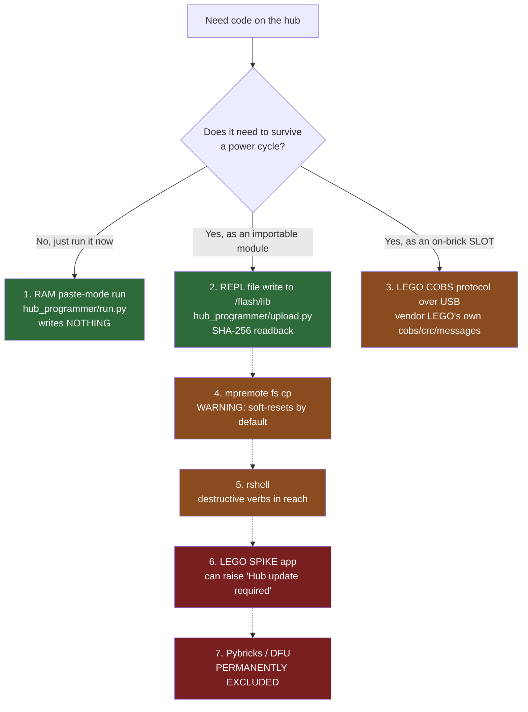

# SPIKE 3 — deploying code and the on-hub radio (research)

**Type:** EXTERNAL research · **Split out of** [spike3-api-reference.md](./spike3-api-reference.md)
on 2026-08-27, which had grown past the 1200-line limit.

> ⚠ **Both topics below were OPEN QUESTIONS when this was written, and both have since been SETTLED
> by measurement on our own hub.** Read the authoritative records first; this file is kept for the
> reasoning and the routes we did *not* take.
>
> | Topic | Now settled by |
> |---|---|
> | Getting code onto the hub | [ADR-0007](../decisions/0007-deploy-by-writing-modules-to-flash-lib.md) — decided and demonstrated · [../runbooks/deploy-to-hub.md](../runbooks/deploy-to-hub.md) — the procedure |
> | The hub's radio | [../findings/ble-protocol-2026-08-27.md](../findings/ble-protocol-2026-08-27.md) — connected, framed, hub identified · [./ble-bring-up.md](./ble-bring-up.md) — the verdict on hub-side BLE |

---

## 10. Getting code ONTO the hub without the LEGO app

### 10.1 Two destinations, and they are not the same thing

Confusing them is the main source of bad advice online.

1. **A program slot (0–19)** — what the on-brick left/right/centre selector runs untethered. Slots are
   a *protocol-level* concept: populate one with `StartFileUploadRequest` + `TransferChunkRequest`,
   start it with `ProgramFlowRequest`. `[LEGO]`
2. **An importable module in the filesystem** at `/flash` or `/flash/lib` — reachable because our
   measured `sys.path` is `['', '.frozen', '/flash', '/flash/lib']`. Written with plain `open()`.

**A file written with `open()` does not become a slot, and a slot upload does not let you choose an
arbitrary path.** Our flat `src/` was designed for destination 2.

Measured filesystem `[MEASURED]`: `/flash` holds `README.txt boot.py config main.py program
pybcdc.inf`; `main.py` is 34 bytes of comment; `/flash/program` is an **empty directory**; **`/flash/lib`
does not exist** though it is on `sys.path`; 32.4 MB free.

### 10.2 Routes ranked by risk to stock firmware



**1 — Run from RAM. Lowest risk of all.** [`hub_programmer/run.py`](../../hub_programmer/run.py) sends
the file through MicroPython's paste mode and executes it without ever touching `/flash`, so an example
that turns out to be wrong does not become litter on shared course equipment. It always carries a
deadline and sends Ctrl-C when it expires.

**2 — REPL file write.** [`hub_programmer/upload.py`](../../hub_programmer/upload.py) opens the file at
the REPL, streams base64 chunks, and **reads the file back and compares SHA-256** — a write is reported
successful only when the hashes match, never merely because no exception was raised. It refuses to
touch `boot.py`, `README.txt`, `pybcdc.inf`, `/flash/program` or `/flash/config`, and needs `--force`
for `main.py`. **Mechanism confirmed on SPIKE 3** by a published SPIKE 3 lesson doing exactly this
`open()/write()` from an on-hub program; **our script itself has never been run against the hub** (no
session record shows a write, and the 2026-08-27 finding states nothing was written). *Confirmed
against a source, not measured.*

**3 — LEGO's own COBS protocol over `/dev/spike`.** Fully documented by LEGO with an Apache-2.0
reference implementation (`cobs.py`, `crc.py`, `messages.py`). Sequence: `InfoRequest(0)` →
`DeviceNotificationRequest(40)` → `ClearSlotRequest(70)` → `StartFileUploadRequest(12: filename[32],
slot, CRC32)` → repeated `TransferChunkRequest(16)` capped at `InfoResponse.max_chunk_size` →
`ProgramFlowRequest(30)`. Framing: COBS → XOR every byte with `0x03` → append `0x02`. LEGO documents it
for BLE, but the identical protocol runs over USB CDC-ACM — LEGO's own `cobs.py` carries the comment
`# XOR buffer to remove problematic ctrl+C`, which only makes sense on a serial REPL link, and both the
maintained VS Code extension and the SPIKE web app speak it over serial at 115200 to VID `0x0694`.

> ⚠ **The protocol contains firmware-flash messages: `StartFirmwareUploadRequest` id 10 and
> `BeginFirmwareUpdateRequest` id 20.** Vendoring LEGO's own `messages.py` does **not** smuggle them in
> — neither class is defined in it, verified — but any client we write must be auditable to never
> construct them. One grep proves it, and it must cover decimal literals as well as hex:
> `grep -rnE 'FirmwareUpload|FirmwareUpdate|\b(10|20|0x0A|0x14)\b' scripts/ hub_programmer/ vendor/`
>
> ⚠ **`ProgramFlowRequest` STARTS the program on the robot.** On an assembled robot that means motors
> move. **Upload and start are separate operator-gated steps**, per
> [../directives/hardware-safety.md](../directives/hardware-safety.md).

**4 — `mpremote fs cp`. ⚠ It soft-resets the hub before your "read-only" listing.** In
`tools/mpremote/mpremote/commands.py`, `do_filesystem()` calls `state.ensure_raw_repl()`, and
`_auto_soft_reset` is `True` for the first command of an invocation. Only `do_resume()` clears it.
**The correct form is `mpremote connect /dev/spike resume fs ls /flash`.** This matters here because
`/flash/boot.py` starts the LEGO Hub OS; a soft reset restarts the interpreter under it.
> **Correction.** Earlier research stated flatly that "`fs` subcommands do not soft-reset". That is
> **false against MicroPython master**, and the safety recommendation built on it inverted the actual
> behaviour.

Whether `mpremote`/`rshell`/`ampy` work against Hub OS 3 at all is `[UNVERIFIED]` — every published
success is Hub OS 1/2 — and all three reach only the filesystem, never a slot. **5 — `rshell`** adds
`rm` and `rsync --delete` within one typo of the "OS has to be reinstalled" scenario. **6 — the LEGO
app** alone can raise a Hub update prompt. **7 — Pybricks/DFU** replaces the firmware and is
permanently excluded ([ADR-0001](../decisions/0001-stock-lego-firmware-only.md)).

### 10.3 Hard rules, whichever route

- **NEVER write `/flash/boot.py`.** All five of its lines are in
  [the first-contact finding](../findings/hub-first-contact-2026-08-27.md); it sets
  `hub.config["hub_os_enable"] = True`. **A one-character edit there boots the hub as a plain
  MicroPython board with no LEGO layer.** That is not a firmware flash and so escapes the blacklist's
  letter — which makes it the single most consequential write available on this hub, and it belongs at
  the top of any rule list.
- **`/flash/main.py` is different, and the risk was overstated.** It is 34 bytes of comment and the
  firmware's own `README.txt` invites writing it. **There is nothing to clobber.** But whether the Hub
  OS pre-empts it at boot is `[UNVERIFIED]` — **do not build a deploy process on it until it is tested.**
- **Never `os.remove()`/`os.rmdir()` anything we did not create.** Never touch `/flash/program` or
  `/flash/config`.
- **Never call `machine.bootloader()`, `machine.reset()` or `machine.soft_reset()`** — all three are on
  our hub `[MEASURED]` and all three are forbidden by [ADR-0001](../decisions/0001-stock-lego-firmware-only.md).
- If we ever ship precompiled bytecode instead of source it must be **mpy ABI 6.3, arch armv7emsp**,
  computed from our measured `_mpy=7942`.

> **Correction to our own runbook.** [../runbooks/upload-to-hub.md](../runbooks/upload-to-hub.md) says
> of the raw REPL: *"No file management — you cannot upload a program this way, only run statements."*
> **That is false**, and `hub_programmer/upload.py` in this repo already contradicts it. The accurate
> statement is: **REPL → filesystem modules; COBS protocol → slots.** The same file's open question
> "which Hub OS" is closed by measurement (SPIKE 3), so extension v3.x is the right version and the
> Hub-OS-2-only tools (`spikejsonrpc`, `lego-hub-tk`, JSON-RPC) are irrelevant to us.

---

## 11. The `bluetooth` module — can a hub program drive its own radio?

**Our earlier inference — that it cannot — is now in doubt, and we should stop asserting it.**

`bluetooth` is present, and it is the **complete standard MicroPython BLE surface**: `[MEASURED]`

```
dir(bluetooth)     -> BLE UUID FLAG_READ FLAG_WRITE FLAG_NOTIFY FLAG_INDICATE
                      FLAG_WRITE_NO_RESPONSE
dir(bluetooth.BLE) -> active config gap_advertise gap_connect gap_disconnect gap_pair
                      gap_passkey gap_scan gattc_* (6) gatts_indicate gatts_notify
                      gatts_read gatts_register_services gatts_set_buffer gatts_write irq
```

That is a full GAP + GATT **server and client**. [bluetooth-control-plane.md](./bluetooth-control-plane.md)
inferred the opposite *from an absence in a module list*, and the module list now shows the reverse.

**But presence is not permission, and the two sides of the evidence do not actually conflict:**

- The contrary evidence is a first-hand report that on SPIKE 3 `import bluetooth` **raises `EPERM`**,
  with the author of the leading LEGO-hub BLE libraries confirming SPIKE 3 is excluded. That is a blog
  comment from Dec 2023 on an unspecified build, ~2.5 years older than our firmware — the strongest
  evidence found, not proof.
- **Crucially, our `dir()` was taken at the raw REPL. The EPERM report is about a program in a slot.**
  `[INFERRED]`: the restriction, if it exists, may live in the SPIKE 3 *program runner* rather than in
  the module. Both observations can be true at once.
- Every known working on-hub BLE library (btbricks, hub2hub, PrimePoweredUP) targets **SPIKE 2 /
  Robot Inventor** firmware, and every one of those sources resolves the problem by **flashing
  Pybricks — which is permanently excluded here.** The answer for us is to not need on-hub BLE.
- Even if the import succeeds, `BLE()` is a **singleton** the firmware's own stack is already using to
  serve LEGO's `FD02` service. `gatts_register_services()` is documented as *"replacing any existing
  services"* and `active(False)` takes the radio down — i.e. it could drop the app/laptop link
  mid-session `[INFERRED]`. On the older firmware where this worked, sharing the radio was documented
  as fragile enough to need battery-out cold reboots.

**What would settle it — and none of it is a tool call:** run `import bluetooth` **the way mission code
will run**, i.e. from a program (paste-mode via `hub_programmer/run.py`, and separately from
`/flash/main.py`), not from the REPL. If the import succeeds there, read `BLE().active()` with **no
argument** (documented as a read) before ever passing `True`. Instantiating the radio is a state change
on shared equipment: **operator's call, never a probe's** — which is why
[`probes/bluetooth_state.py`](../../probes/bluetooth_state.py) inspects the class and never
instantiates it.

**We do not need the radio for telemetry anyway.** Two BLE paths need no radio API at all: `print()`
from a hub program leaves as `ConsoleNotification` (id 33, **string[256]**, fragmented — buffer to the
`0x02` terminator), and `DeviceNotification` (id 60) streams IMU, motors and sensors with **no hub-side
code whatsoever**. There is also an undocumented `hub.config["module_tunnel"]` (`.callback(fn)` /
`.send(data)`) from a LEGO maintainer — `hub.config` exists here `[MEASURED]`, the key is `[UNVERIFIED]`.
> ⚠ **Do not treat `module_tunnel` as a sanctioned working path.** The only first-hand SPIKE 3 attempt
> on record **failed** (no console output, no notification) and was never resolved; the LEGO maintainer
> never confirmed it working. And the crash caveat is worse than earlier drafts said: two independent
> users report a `TunnelMessage` **shutting the hub down — one having verified a program was running at
> the time.** An earlier draft said the crash happened only "while no program is running".

---
