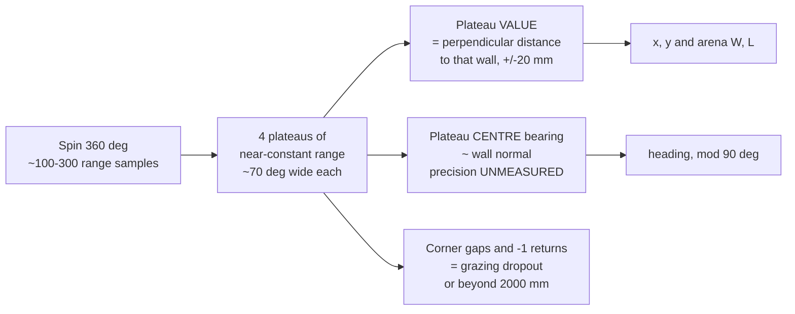
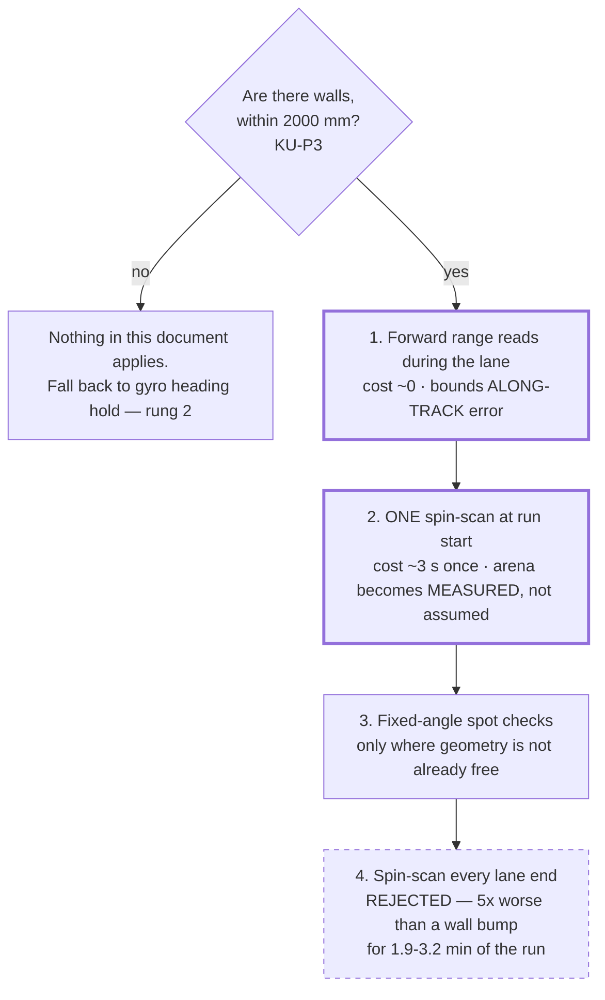

# Spin-Scan Localization — can we turn the Distance Sensor into a scanning rangefinder by rotating the robot?

**Type:** EXTERNAL research · **Created:** 2026-08-26 · **Status:** open — **no hardware exists.** Nothing
here was measured. Every hardware figure is quoted from a source that was actually fetched, or is
arithmetic over such a figure and labelled as derived.
**Answers:** the operator's question — *"can we spin the robot, track the rotation with the
accelerometer and motor encoders, take distance measurements as we go, and do SLAM?"*
**Governs:** nothing in code yet. It **contests one paragraph** of
[./hub-compute-limits.md](./hub-compute-limits.md) § 4.5 and proposes two additions to the
re-squaring menu in [./motion-control-and-odometry.md](./motion-control-and-odometry.md).
**This document does not edit either of those files.** It states what should change and where.

---

## Summary — the verdict up front

**The mechanism works. The sensor does not.**

The operator is right about the part everybody gets wrong: you *can* synthesize a scanning rangefinder
from a fixed sensor by spinning the platform — that is literally how early low-cost 2D lidar was built,
and rotating-sonar robots are a real, published line of work (§ Sources). And on this robot it is
**free**: the robot already spins, the sensor's 250 mm lead rotates *with* the hub so nothing winds, and
no extra motor and no extra port are needed. The objection in
[./hub-compute-limits.md](./hub-compute-limits.md) § 4.5 — *"one fixed-axis ToF beam, not a scanning
LiDAR"* — is, as **mechanization**, wrong. It should not be argued that way in the Intro Report.

**But two facts kill the result, and neither is about compute or mechanism:**

1. **The 45604 is ultrasonic, not optical time-of-flight, and its entrance angle is ±35°.** LEGO's own
   fact sheet says so verbatim (§ 3.1). Rotating a ~70°-wide acoustic cone does **not** produce a point
   cloud. It produces a handful of wide plateaus of near-constant range — the *nearest surface anywhere
   in the cone*. Effective angular resolution is about **70°, i.e. ~5 independent bearing cells in a full
   revolution**, and **no amount of sampling buys resolution back**: even a pessimistic hub loop rate
   already oversamples the beam by ~10×. This is physics, not tuning.
2. **Maximum range is 2000 mm.** A 10 ft arena is 3048 mm across. From near the centre all four walls are
   in range; from a corner the far walls are not. Anything larger than ~4 m across — a taped square inside
   a classroom, the 10 m reading of KU-P1 — and the sensor sees **nothing at all** for most bearings.

**So: SLAM stays rejected, but hub-compute-limits.md's *primary* argument has to be re-worded, not
re-affirmed.** It currently claims the sensor cannot scan. It can. The correct claim is that **the scan
has no features in it** — you recover *surfaces*, not re-identifiable landmarks, and in an empty
rectangle every wall looks like every other wall. See § Impact on the SLAM verdict for the exact edit.

**The practical kernel is real and worth taking.** Ranked by value for effort:

| # | Idea | Cost | Verdict |
|---|---|---|---|
| **1** | **Forward range reads at zero extra angle** — no spin at all, just read the wall you are already driving at | ~free once the sensor is owned | **TAKE.** Bounds *along-track* position, which the wall bump does **not** ([./detection-and-sweep-techniques.md](./detection-and-sweep-techniques.md) line 782: a bump corrects heading, not offset) |
| **2** | **One spin-scan at run start** to measure the arena and set the initial pose | one ~3 s scan, once | **TAKE, conditional on walls (KU-P3).** Its real value is not "closing KU-P1" — it is that the sweep stops being *hard-coded* to KU-P1's answer |
| **3** | **Fixed-angle spot checks** — turn to a known heading, take one reading | a turn each | **CONDITIONAL.** Only worth it where the geometry is not already free (#1) |
| **4** | **Spin-scan at every lane end**, to re-square heading | **1.9–3.2 min added to a run already at 8–23 min** | **REJECT.** Buys ~±3.5° of heading where a mechanical wall bump derives **0.6°** — five times worse for a large slice of the budget |

**One thing that should change in another document today:** [./hub-compute-limits.md](./hub-compute-limits.md)
§ 4.5 and § 4.6 call the 45604 a *"time-of-flight beam."* It is **ultrasonic**
([techspecs PDF](https://assets.education.lego.com/v3/assets/blt293eea581807678a/blt64c2b9534cf10f68/5f8801b8bc43790f5c4389ea/techspecs_technicdistancesensor.pdf?locale=en-us),
fetched 2026-08-26, verbatim: *"Sensor sample rate — 100 Hz (with ultrasonic function)"*).
[../hardware/port-map.md](../hardware/port-map.md) already has it right. The report must not go out with
both.

---

## 1. The scanning mechanism — spin the robot, or spin the sensor?

Two mechanizations, and they are not close.

| | **A. Spin-in-place** (both wheels opposite) | **B. Sensor on a third motor** |
|---|---|---|
| **Ports** | Sensor only → **1 of 4 free ports** | Sensor + motor → **2 of 4** |
| **Schrute Bucks** | Sensor price **UNKNOWN** ([KU-T5](../plans/known-unknowns.md)) | Sensor + a motor (the two we own were recorded at **10 SB each**, [`inventory.py`](../../inventory.py)) + mounting blocks and axles **we do not own** ([KU-D3](../plans/known-unknowns.md)) |
| **Builder work** | **None.** The robot already spins; § Motion control has the code | A mast, a rotating joint that stays square under load, and a raised centre of gravity on a base whose track we have not even measured (BM-4) |
| **Cable** | **No winding.** The 250 mm lead is fixed to the sensor at one end and to the hub at the other, and the hub turns with it — the whole assembly rotates as one rigid body | **Winds, one turn per revolution.** LEGO ships no slip ring. This is close to fatal for *continuous* rotation and forces the design down to an oscillating arc |
| **Angular accuracy of the tag** | Gyro + wheel encoders, through a contact patch that is **skidding by design** | Motor encoder **direct**: 1 count = 1°, ≤ ±3° including gearbox slack ([45602 fact sheet](https://assets.education.lego.com/v3/assets/blt293eea581807678a/bltb9abb42596a7f1b3/5f8801b5f4c5ce0e93db1587/le_spike-prime_tech-fact-sheet_45602_1hy19.pdf?locale=en-us)), no slip |
| **Side effect on odometry** | **Corrupts XY.** A spin scrubs both wheels; the position estimate degrades by an unknown amount every scan | **None.** The chassis never moves |
| **Can it scan while driving?** | No — the sweep must stop | Yes, in principle |

**Recommendation: A, spin-in-place — and build neither for Demo Day.**

The cable is the decider. A continuously rotating sensor winds its own lead every revolution and there is
no LEGO part that fixes it; the only survivable form of B is a **bounded oscillation** (say ±90°, unwind
on the return), which is a genuinely nice idea — it scans without scrubbing the wheels — but still costs a
port, ~10 SB, and a mast, to feed a sensor that resolves 70°. The trade study wants that port and that
money for a **second colour sensor**, where it multiplies the swath and directly attacks the KU-P1
coverage problem ([../plans/2026-08-25-coverage-strategy-trade-study.md](../plans/2026-08-25-coverage-strategy-trade-study.md) § 1).

Option A's one real cost — that spinning wrecks the odometry it is being used to fix — is less circular
than it sounds: the scan re-establishes position, so the damage is repaired by the thing that caused it.
But it means the scan must be **trusted over** the odometry. That is fine when it works and catastrophic
when it silently does not, which is why § Bench go/no-go is written the way it is.

**One bench-only trap:** if the hub is USB-tethered for logging, spinning the robot winds the **USB**
cable. Run the spin test untethered, buffer to hub RAM, dump afterwards — or cap the test at ~400° and
accept the twist.

---

## 2. Angle knowledge and fusion — correcting the accelerometer part

The operator proposed *"track a full rotation with the accelerometer … and check the spin with the motor
encoders to fuse."* One correction, and it matters:

> **An accelerometer cannot measure heading.** It measures specific force — linear acceleration plus
> gravity. During a flat spin on a level floor the gravity vector is *stationary in the body frame*
> (pointing down the body z-axis the whole time), so it carries **no** yaw information. Yaw during a flat
> spin comes from the **gyroscope** — the z-axis rate, integrated.

The hub has both; LEGO calls the pair a *"six-axis motion sensor (3-axis accel + 3-axis gyro)"*
([45601 techspecs](https://assets.education.lego.com/v3/assets/blt293eea581807678a/bltf512a371e82f6420/5f8801baf4f4cf0fa39d2feb/techspecs_techniclargehub.pdf?locale=en-us)),
and `motion_sensor.tilt_angles()[0]` already hands back an integrated yaw in decidegrees
([./motion-control-and-odometry.md](./motion-control-and-odometry.md) § The gyro).

### What each source actually gives you

| Source | What it measures | Good for | Fails when |
|---|---|---|---|
| **Gyro z, integrated** | Yaw rate → yaw | The **only** real heading source. Immune to wheel slip | Bias drift, and the stock-firmware *stuck-at-zero* pathology |
| **Wheel encoders, differential** | `φ = (C_w/(π·b))·Δmotor_deg` | A slip-free cross-check; immune to gyro drift | **Spin turns are the worst case for it** — see below |
| **Accelerometer** | Specific force | (a) confirming the robot is **flat**, so the gyro z-axis really is the yaw axis — `motion_sensor.stable()`; (b) detecting a bump or a tip; (c) a curiosity: centripetal accel `ω²r` cross-checks the *magnitude* of ω if the sensor sits off the spin axis, ~0.03 g at a 124 °/s spin and 60 mm offset — **derived, not a method** | Anything to do with heading |

**Gyro drift inside one scan is not the problem.** At the most pessimistic *sourced* rate in
[./motion-control-and-odometry.md](./motion-control-and-odometry.md) § The gyro — ~30 °/min, a
silicon-level bound, LEGO publishes no drift spec at all — a ~3 s revolution accrues **~1.5°**. Against a
70° beam that is nothing. Drift is a lane-length problem, not a scan problem.

**Wheel slip inside one scan is the problem.** Borenstein's error taxonomy lists *"fast turning
(skidding)"* explicitly as a non-systematic slip source, and the UMBmark procedure itself instructs
*"run the vehicle slowly to avoid slippage"*
([papers/borenstein1995-umbmark-benchmark.txt](./papers/borenstein1995-umbmark-benchmark.txt), lines
92–98 and 449). A differential-drive spin turn is *entirely* lateral scrub at both contact patches. It is
the single motion where encoder-derived yaw is least trustworthy.

### Why fuse anyway — the disagreement is the payload

Do not average them. **Log both and difference them.**

- Gyro says the body turned 360°; encoders say the wheels turned enough for 378°. The **18° gap is scrub**,
  and it is a direct, per-scan measurement of how much this floor slips.
- If the gap is small and stable, the scan's angle tags are good and — more importantly — **BM-4's track
  width and BM-8's cross-track budget are being measured on a floor that behaves.**
- If the gap is large or varies run to run, that is not a scan problem. It is the finding that the demo
  surface is slippery, which invalidates spin-turn odometry generally.

**This diagnostic is worth having even if every other idea in this document is thrown away**, and it costs
one extra column in a log file.

### Tagging each range reading with an angle

```
reset_yaw(0)              # ONCE, stationary, gated on motion_sensor.stable()
start a constant-velocity spin
loop:
    t   = ticks_ms()
    yaw = tilt_angles()[0]        # decidegrees, sign inverted vs the app
    rng = distance_sensor.distance(port)   # mm, or -1
    encL, encR = relative_position(...)
    append (t, yaw, rng, encL, encR)       # int16 each, struct.pack_into
until unwrapped yaw exceeds 400 deg
stop; do NOT reset_yaw here
```

Four things that will bite, all of them already documented in this repo:

1. **Yaw wraps.** `tilt_angles()` runs −1795…1800 decidegrees; a full revolution crosses the seam once and
   the log must be unwrapped. *"Missing the 10× decidegree conversion is the most common Hub OS 3 porting
   bug"* ([./motion-control-and-odometry.md](./motion-control-and-odometry.md) § The gyro).
2. **Never `reset_yaw()` while rotating** — it zeroes the bias estimate against a rotating frame and
   injects a permanent phantom rotation (*ibid.*).
3. **Read skew.** The yaw read and the range read are not simultaneous. At a 124 °/s spin, 10 ms of skew is
   **1.24°** of tag error — negligible against 70°, and the reason it is negligible is worth writing down
   rather than engineering around.
4. **`distance()` returns −1** when it cannot read ([SPIKE 3 API surface, ./detection-and-sweep-techniques.md](./detection-and-sweep-techniques.md)).
   A −1 is **data**, not an error: it means *"nothing reflecting within 2 m in this cone."* Log it. Do not
   substitute a previous value.

**Net angle error on a tag: on the order of 2–4°** (skew + drift + a scale-factor term), against a beam
that is 70° wide. **Angle knowledge is not the limiting factor anywhere in this idea.** That is the honest
answer to the operator's fusion question — the fusion is worth doing for the slip diagnostic, not because
the scan needs the precision.

---

## 3. Point quality — this is where it dies

### 3.1 What LEGO actually publishes

Fetched 2026-08-26 from the
[Technic Distance Sensor techspecs PDF](https://assets.education.lego.com/v3/assets/blt293eea581807678a/blt64c2b9534cf10f68/5f8801b8bc43790f5c4389ea/techspecs_technicdistancesensor.pdf?locale=en-us),
verbatim where quoted:

| Property | Value |
|---|---|
| Technology | *"measure the distance to an object or surface using **ultrasonic** technology"* |
| Sample rate | *"100 Hz (with ultrasonic function)"* |
| Range | **50–2000 mm, ±20 mm** |
| Fast mode | 50–300 mm, ±15 mm |
| **Entrance angle** | **±35°** — *"varies according to the distance"* |
| Output resolution | 1 mm |
| Wire | **250 mm, fixed to sensor** |

Two independent readings of *"entrance angle ±35°"* are both plausible and **both are bad for scanning**:
as a **beam half-angle**, the insonified cone is ~70° wide; as a **maximum angle of incidence**, a surface
tilted more than 35° off the beam axis stops returning a usable echo. LEGO does not disambiguate.
**Marked UNVERIFIED — § Bench go/no-go measures it.** For everything below, the conservative
consequence of *either* reading is the same.

### 3.2 Spot size — the number that decides it

Under the beam-half-angle reading, the lateral extent of the cone at range `d` is `2·d·tan 35° = 1.40·d`
(**derived**):

| Range | Cone width |
|---|---|
| 500 mm | 700 mm |
| **1000 mm** | **1400 mm** |
| 1500 mm | 2100 mm |
| 2000 mm (max) | 2800 mm |

At 1 m the sensor's "spot" is wider than a 10 ft arena is deep at that distance. There is no meaningful
sense in which a returned range is a *point* on a surface. Compare the colour sensor's ~12 mm floor spot
([./color-discrimination.md](./color-discrimination.md) § 5.1) — that sensor is a point sampler and this
one is not, and the report should not treat them as the same kind of instrument.

### 3.3 What a rotating wide beam actually returns

The echo comes from the **nearest** reflecting surface anywhere in the cone. For a flat wall that is the
foot of the perpendicular. So as the robot spins past a wall, the reading stays at roughly the wall's
**perpendicular distance** across a wide band of bearings, then hands over to the next wall.

This is not our observation — it is the founding observation of sonar robotics. Leonard &
Durrant-Whyte named the phenomenon (constant-range arcs from a specular surface) and built their
localization method *on* it rather than fighting it (§ Sources). The same wide-cone/specular behaviour is
why [./motion-control-and-odometry.md](./motion-control-and-odometry.md) § Re-squaring already concluded
that *"the naive `d/cos θ` inference of heading is wrong **in principle**, not merely noisy."*



### 3.4 Grazing incidence and surface finish

| Surface | Behaviour |
|---|---|
| **Matte, hard, flat** (painted wall, plywood) | The good case. Diffuse enough to echo over a range of incidence angles |
| **Specular and smooth** (glass, whiteboard, polished door) | At oblique incidence the sound reflects *away*. The reading is not noisy, it is **absent** — `−1` |
| **Soft or textured** (fabric, acoustic tile, clothing) | Absorbs. `−1`, or a much-too-long second-bounce reading |
| **Corners** | Manufacture **double bounces**: wall A → wall B → sensor, reporting a range longer than either |

Every one presents as a plateau of the wrong width or the wrong value, and **none of them looks like an
error at the API**. That is why the bench test's first criterion is *"does the polar plot look like a room
at all."*

### 3.5 Usable points per revolution, and the effective resolution

**Samples are not the constraint.** A ~2.9 s revolution at any plausible hub loop rate (**UNMEASURED** —
that is BM-5, and [./hub-compute-limits.md](./hub-compute-limits.md) § 3 is explicit that nobody has
measured it) gives roughly:

| Loop rate | Samples/rev | Degrees per sample |
|---|---|---|
| 20 Hz | 58 | 6.2° |
| 50 Hz | 145 | 2.5° |
| 100 Hz (sensor's own ceiling) | 290 | 1.2° |

Even the pessimistic row **oversamples the 70° beam by more than 10×**.

> **Effective angular resolution ≈ 70° → about 5 independent bearing cells per revolution.**
> Spinning slower, sampling faster, or averaging harder does not change that number. You cannot buy
> resolution with time here.

Physics floor, for completeness: sound at ~343 m/s takes ~11.7 ms for a 2 m round trip, so ~86 Hz is the
ceiling at full range regardless of what the port can carry — consistent with LEGO's 100 Hz. At 124 °/s the
robot turns 1.45° during one ping. Negligible. **Derived.**

---

## 4. Localizing against a known rectangle

Here the news is better, and it is worth separating carefully from the news above.

### 4.1 Five bearing cells is not enough for scan matching, but it is enough for a rectangle

Scan matching (ICP and relatives) needs many points on distinguishable geometry. We have ~5 fat cells on
four featureless walls. **Scan matching is off the table.** But a rectangle is the one map you can solve
with almost nothing, because the *model* supplies what the sensor cannot:

From one revolution near the centre you get four plateaus `d₁…d₄` at bearings ~90° apart. Then, directly:

```
width   W  =  d_left  + d_right  + robot_width
length  L  =  d_front + d_back   + robot_length
x       =  d_left  + robot_width/2
y       =  d_back  + robot_length/2
heading θ  =  plateau-centre bearing        (mod 90 deg)
```

**Five unknowns — pose *and* arena size — from four numbers and a model.** No optimizer, no matrix, no
`numpy`. That is a real result, and it is the reason this document does not simply say "no."

### 4.2 Why this is *not* SLAM, and why that matters more than anything else here

The map is a rectangle. We are not estimating it — at most we are estimating its two side lengths, which
are two scalars, not a map. **This is localization in a known parametric map.** What that changes:

- No landmark association problem. No loop closure requirement. No covariance over map features.
- No unbounded state. The whole estimate is `(x, y, θ, W, L)` — **five numbers**, versus the 20-landmark
  EKF whose 7.2 KiB covariance [./hub-compute-limits.md](./hub-compute-limits.md) § 4.1 sized.
- Nothing to forget and nothing to diverge. A bad scan produces a bad fix, not a corrupted map.

Leonard & Durrant-Whyte's *"tracking geometric beacons"* is exactly this posture — model-based
localization against known surfaces — and it predates and outperforms sonar SLAM for indoor rooms
(§ Sources). **The Intro Report should use this framing.** "We evaluated SLAM and instead implemented
localization in a known map" is a stronger systems-engineering sentence than "SLAM was too hard."

### 4.3 The rotational-symmetry ambiguity

A rectangle has **180° rotational symmetry**: a scan taken at pose `(x, y, θ)` is identical to one taken at
`(W−x, L−y, θ+180°)`. If the arena is **square**, the symmetry is 4-fold and the ambiguity is 90°. A single
spin-scan **cannot** resolve it. Nothing about better sensors changes this; it is a property of the map.

What breaks it, cheapest first:

1. **A known starting pose.** The Builder places the robot; the run begins from a stated corner facing a
   stated way. From then on the gyro tracks heading continuously and the scan is *tracking*, not global
   localization — the ambiguity never gets a chance to bite. **This is the answer.**
2. **Gyro continuity alone**, if the robot is never lifted. Same thing, weaker.
3. **One asymmetric feature** — a box in a known corner, a strip of coloured tape one wall has and the
   others do not. Costs a purchase and a request to the professor; not worth it.

**Consequence for the design:** the start pose becomes a documented, rehearsed part of the Demo Day
procedure rather than an incidental. That belongs in the runbook, not in the code.

### 4.4 Does the fit fit the hub?

Two candidate algorithms, and the difference between them is the whole compute story.

| Method | Work | Fits the hub? |
|---|---|---|
| **Plateau detection + arithmetic** (§ 4.1) | One O(N) pass over ~100–300 int16 samples: run-length the ranges against a tolerance, take medians. A few hundred bytes of state, integer throughout | **Yes, easily.** Comparable to the binary coverage grid that [./hub-compute-limits.md](./hub-compute-limits.md) § 4.4 calls "essentially free" |
| **Grid search over θ** with a nearest-surface-in-cone forward model, closed-form `x,y` per θ | ~360 hypotheses × N residuals ≈ 10⁴–10⁵ integer ops, **once per scan** | **Yes for a run-start scan.** It is 2–3 orders of magnitude *below* what § 4.1–4.2 of hub-compute-limits priced for an EKF or particle update, and — decisively — it runs **once**, not at 10–50 Hz. Even a pessimistic loop rate makes it a one-off pause, not a real-time constraint |

**Compute is not an objection to any of this**, and saying so plainly is important, because the compute
argument is the one [./hub-compute-limits.md](./hub-compute-limits.md) already warns carries the widest
error bar. The objection is § 3, and only § 3.

---

## 5. The time cost

**Every input below is a placeholder.** Track width `b` = 112 mm and wheel circumference `C_w` = 175.9 mm
are `[ASSUMED]` in [./motion-control-and-odometry.md](./motion-control-and-odometry.md); the motors and
wheels we own have not been identified ([BM-1](../plans/bench-measurement-plan.md), KU-T3). The
**procedure** is what to trust, not the numbers.

**Derived.** A spin of φ degrees needs `motor_deg = (π·b/C_w)·φ`, which with the placeholders is exactly
`2.0·φ` — so a full revolution is **720 motor degrees**. With a trapezoidal profile costing `d/v + v/a`
and `a = 1000 deg/s²` default:

| Spin velocity | Constant-speed | + ramps | + 0.2 s settle | **One 360° scan** |
|---|---|---|---|---|
| 200 deg/s | 3.60 s | 3.80 s | 4.00 s | ~4.0 s |
| **300 deg/s** | **2.40 s** | **2.70 s** | **2.90 s** | **~2.9 s** |
| 500 deg/s | 1.44 s | 1.94 s | 2.14 s | ~2.1 s — but +8° of turn error |

Add re-acquiring the lane heading afterwards: call it **~3–4 s of dead time per scan**, and note the scan
cannot overlap driving — the robot must stop.

**Scanning at every lane end**, against the lane counts in
[../findings/coverage-time-budget.md](../findings/coverage-time-budget.md):

| Case | Lanes | Lane ends | @2.9 s | @4.0 s |
|---|---|---|---|---|
| 10 ft @ 76 mm pitch | 41 | 40 | **1.9 min** | 2.7 min |
| 10 ft @ 46 mm pitch (realistic cross-track) | 67 | 66 | **3.2 min** | 4.4 min |

That lands on top of **8–23 min** of driving and **1.3–4.4 min** of turn overhead — a run that
[../findings/coverage-time-budget.md](../findings/coverage-time-budget.md) already flags as possibly not
fitting a demo slot. **A 15–25% surcharge on the one budget that is already over.**

### How to replace these placeholders with measurements

1. **BM-3** gives effective rolling diameter under load → `C_w`.
2. **BM-4** gives track width from a spin turn that actually closes → `b`.
3. Then `motor_deg` is exact, and one timed 360° spin at three velocities gives the real per-scan cost
   including the hub's own overhead. **Time it; do not compute it.** That measurement is one line added to
   the existing BM-4 run and costs nothing extra.

---

## 6. The practical kernel — what to actually keep

### 6.1 Spin-scan at lane ends, to re-square heading — **reject**

The heading a spin-scan can deliver is bounded by how precisely the plateau **centre** can be located, and
the plateau edges are set by wall handover geometry and the incidence limit, not cleanly by the robot's
heading. If each edge can be located to ±5°, the centre is ~±3.5° (**derived, and both inputs are
guesses — UNMEASURED**).

Put that next to the numbers already on the table in
[./motion-control-and-odometry.md](./motion-control-and-odometry.md) § Re-squaring:

| Method | Heading accuracy | Cost per lane |
|---|---|---|
| Budget for a 3.05 m lane at 15 mm cross-track | **0.28°** | — |
| **Mechanical wall bump**, 100 mm contact face, 1 mm slop | **0.6°** (derived) | ~1–3 s, and the robot is driving to the wall anyway |
| Two-point distance method, 500 mm baseline | 3.2° | a 500 mm detour |
| **Spin-scan** | **~±3.5°** (estimated) | **~3–4 s of pure dead time** |

**The bump wins on both axes.** Spin-scanning at lane ends is five times worse for more money and more
time. It does not even survive as a fallback for the no-wall case, because if there is no wall to bump
there is usually nothing to range against either. Reject it, and say in the report that it was evaluated.

### 6.2 One spin-scan at run start — **take, and it is the interesting one**

**What it is worth is not what it first looks like.** It will *not* reliably close
[KU-P1](../plans/known-unknowns.md) (the units question), for two reasons:

- It measures **the room**, and the room is not necessarily the arena. If "a 10×10 area" is tape on the
  floor of a classroom, the scan sees the classroom walls — which are far more than 2 m away, so it returns
  `−1` in every direction and tells you nothing.
- Even where it works, a plain encoder drive from boundary to boundary measures the same thing with
  hardware we **already own** (2 motors, 2 wheels) and no purchase. Asking the professor remains cheaper
  and more reliable ([Q1, ../plans/questions-for-the-professor.md](../plans/questions-for-the-professor.md)).

**What it *is* worth:** it lets the sweep stop being *hard-coded* to KU-P1's answer. Today
`ARENA_WIDTH_MM = 1000.0` is, in the words of [../plans/known-unknowns.md](../plans/known-unknowns.md),
*"a placeholder chosen to make the code run."* A run-start scan turns arena size into a **measured input**
— the robot is placed in whatever the arena turns out to be, measures it, computes its lane pitch and lane
count, and sweeps. Ship the professor's answer as the default and let the scan override it when it gets a
confident four-plateau fit.

That is a genuinely strong systems-engineering story for the Intro Report — a design whose response to its
largest unknown is *parameterization plus run-time measurement*, exactly what
[CLAUDE.md](../../CLAUDE.md)'s standing rule asks for — and it costs **one 3-second scan, once**.

**Conditions it needs:** walls (KU-P3), all four within 2000 mm, robot near the centre. For a 10 ft square
that means starting within ~1 m of centre on both axes (**derived**: `d_left + d_right = 3048`, so both
stay under 2000 only inside a 1048 mm band). Note this **conflicts** with the known-start-pose fix for the
symmetry ambiguity (§ 4.3), which wants a corner. Resolution: **start in a known corner, drive to
approximately the centre, scan, then begin the sweep.** The drive is short and the heading is still fresh.

### 6.3 Fixed-angle spot checks — **take the free version, skip the rest**

The cheapest version of this idea involves **no rotation at all**. In boustrophedon the robot spends every
lane pointed straight at the far wall. One forward range read per loop, no turn, no dead time:

- **It bounds along-track position**, which is precisely what the wall bump does *not* do —
  [./detection-and-sweep-techniques.md](./detection-and-sweep-techniques.md) is explicit that after a bump
  *"the robot ends up parallel to but [offset from]"* where it should be.
- It gives the end-of-lane trigger that document already assigns to this sensor.
- ±20 mm on a boundary that matters is real, and it costs a sensor read.

*Turning* to a known heading for a spot check is a different, worse thing — it pays most of a spin's cost
for one plateau. Only worth it in a geometry the lane does not already hand you for free.

### 6.4 The ranking



**All of it is downstream of buying the sensor, which is downstream of KU-P3.** Nothing here justifies the
purchase on its own; it strengthens the case if the answer to Q3 is "walls."

---

## 7. Impact on the SLAM verdict

**Do not edit [./hub-compute-limits.md](./hub-compute-limits.md) from here — it owns its own text.** What
follows is what its author should change.

### 7.1 The primary argument survives, but its wording is wrong and must change

Current text, § 4.5 and quoted again in § 4.6:

> *"the Distance Sensor 45604 is one fixed-axis ToF beam, not a scanning rangefinder"*

**Three problems.** (a) It is **ultrasonic**, not time-of-flight — a factual error, and it contradicts
[../hardware/port-map.md](../hardware/port-map.md). (b) *"fixed-axis"* is only true of the sensor, not of
the robot: spinning the platform makes it scan, for free, with no port and no parts. (c) § 4.5's aside that
*"sweeping a Distance Sensor on a motor … would spend a motor, a sensor, most of the remaining 56 SB and
the schedule"* is a fair objection to **mechanization B** and does not touch mechanization A at all. As
written, the argument is answerable — and a reviewer who knows how early lidar was built **will** answer
it.

**Suggested replacement, which is both true and stronger:**

> The Distance Sensor 45604 is an ultrasonic rangefinder with a ±35° entrance angle. It *can* be made to
> scan — spinning the robot in place costs nothing and winds no cable — but the resulting scan has no
> features in it. A ~70° acoustic cone returns the nearest surface anywhere within it, so a full revolution
> yields roughly five independent bearing cells, not a point cloud, and in a bounded empty rectangle every
> wall is indistinguishable from every other wall. There is no re-identifiable landmark to close a loop on.
> The 2000 mm maximum range independently rules out any arena much larger than 4 m across.

### 7.2 The new strongest argument against SLAM

Reason **#2** in the current summary list should be **promoted to #1**:

> **The mission does not have the problem SLAM solves.** The map is a rectangle. There is nothing to
> estimate but two side lengths. This is localization in a known parametric map — five scalars — and it is
> both cheaper and more accurate than mapping something we already know the shape of.

Sensor-suite arguments become #2 (re-worded per § 7.1), compute stays #3 with its wide error bar, and
schedule stays #4. **The ordering matters** because the promoted argument is the one that cannot be
answered by better hardware, and the Intro Report should lead with the argument that survives scrutiny.

### 7.3 What genuinely falls, stated honestly

The implication that **no exteroceptive correction is available at all** falls. It is not true. Ranging a
wall is a real measurement of the world, and in a known rectangle it constrains pose. So:

- **§ 5's ladder gains a rung.** Between rung 3 (per-lane re-square) and rung 4 (coverage grid) there is a
  defensible **rung 3.5 — known-map wall localization**: a run-start spin-scan for `(x, y, θ, W, L)`, plus
  forward range reads during each lane. RAM: tens of bytes of state plus a ~600-byte scan buffer. Compute:
  one O(N) pass, once. It is *coarse* — ±20 mm in range, ~±3.5° in heading — but it is exteroceptive, and
  the § 4.5 claim that we have nothing exteroceptive is what needs the qualifier.
- **The § 5 mermaid edge** labelled *"needs a scanning rangefinder we cannot buy"* is wrong twice over: we
  do not need to buy one, and buying one would not help. Re-label it *"the scan has no features in it."*

**SLAM itself does not become defensible.** It becomes *unnecessary* — which is a different and better
reason to reject it than *impossible*, and it is the reason that holds up under questioning.

---

## 8. Bench go/no-go — the cheapest test of the whole idea

**Not a test.** A **diagnostic**, in `scripts/`, per [CLAUDE.md](../../CLAUDE.md). Numbering belongs to
[../plans/bench-measurement-plan.md](../plans/bench-measurement-plan.md), which this document does not
edit — proposed as **BM-11**, after BM-3 (rolling diameter) and BM-4 (track width).

**Preconditions:** hub identified; drive base built; Distance Sensor bought and mounted forward, level, at
a height clear of the chassis; BM-3 and BM-4 done. **Untethered** — spinning winds a USB cable (§ 1).

**Setup:** a rectangular space with hard flat walls, all four within 2000 mm of the centre — a taped-off
corner of the room with two boards closing it is enough. Tape-measure the true `W`, `L`, and mark the
robot's true `(x, y, θ)` on the floor.

**Procedure**
1. Flat, still, `motion_sensor.stable()` gate, then `reset_yaw(0)` **once**.
2. Command a constant spin at ~300 deg/s motor velocity.
3. Log `(t_ms, yaw_decideg, range_mm, encL, encR)` per iteration as packed int16 until unwrapped yaw
   exceeds **400°** (a 40° overlap proves repeatability within one scan).
4. Stop. **Do not** `reset_yaw` here.
5. Dump the buffer over USB. Plot in polar on the laptop, where `numpy` exists — this is § 5 rung 5.
6. Repeat **5 times from the identical marked pose**, then once each from a near-wall pose and a corner.

**Pass criteria, written before the run**

| # | Criterion | If it fails |
|---|---|---|
| **P1** | **The polar plot looks like a room.** ≥3 distinct near-constant-range plateaus, each ≥40° wide | **Stop. The idea is dead.** Report it and keep § 6.3 only |
| **P2** | Plateau **values** match the tape measure within **±40 mm** (2× spec) | Systematic → check mount height and squareness. Random → the surface is wrong for ultrasound |
| **P3** | Plateau **centres** are 90° apart within **±10°** | The residual is combined gyro scale error and beam asymmetry — **record it, it is a number nobody has** |
| **P4** | **Repeatability.** Spread of recovered `(x, y, θ)` over the 5 identical runs | **This is the number that decides § 6.2.** It has no predicted value. Anything worse than ~±50 mm / ±5° and the run-start scan is not worth trusting over a hard-coded default |
| **P5** | **Gyro vs encoder yaw disagreement** over one revolution | Not a pass/fail. **Record it.** It is the spin-slip measurement, and it feeds BM-4 and BM-8 whether or not any of the rest works |
| **P6** | Count of `−1` returns per pose | Quantifies grazing dropout and tells you how close to centre § 6.2 really needs the robot |

**Run P5 and P6 even if P1 fails.** They cost nothing extra, they are independently valuable, and P5 in
particular measures something the odometry work needs regardless.

**A secondary experiment, 2 minutes:** park the robot at a fixed 1000 mm from a wall and rotate it in 10°
steps, recording the range and whether a return exists at each. That directly resolves the ±35° ambiguity
of § 3.1 — beam half-angle or incidence limit — which is currently the single largest UNVERIFIED input in
this document.

---

## 9. Open questions

| # | Question | Why it matters | Who / how |
|---|---|---|---|
| **SS-1** | Does *"entrance angle ±35°"* mean beam half-angle or maximum incidence? | The single largest UNVERIFIED input here. Sets both the resolution and the dropout behaviour | § 8 secondary experiment. LEGO does not disambiguate |
| **SS-2** | How precisely can a plateau centre be located in a real scan? | Decides whether § 6.1's rejection is 5× or 15×. The ±3.5° estimate is a guess with guessed inputs | P3 + P4 in § 8 |
| **SS-3** | Is the arena bounded by **walls**, and are they within 2000 mm? | **Gates everything in § 6.** Also the 45604 purchase itself | [KU-P3](../plans/known-unknowns.md) → Q3 to the professor |
| **SS-4** | If the arena is tape inside a larger room, does anything reflect within 2 m? | If not, § 6.2 and § 6.3 both evaporate and only rung 2 remains | Answered by SS-3 plus one look at the room |
| **SS-5** | What is the hub's achievable Python loop rate with the distance sensor being polled? | Does not change § 3.5's conclusion, but it sizes the scan buffer | **BM-5** — the same unmeasured number [./hub-compute-limits.md](./hub-compute-limits.md) § 3 flags |
| **SS-6** | Does the demo floor slip enough to make spin turns unreliable at all? | Larger than this document. Affects every turn in the sweep | **P5**, and it is free |

---

## 10. Sources

**Primary — LEGO, fetched 2026-08-26**

- Technic™ Distance Sensor, *SPIKE™ Prime Technical Specifications* (PDF, fetched and text-extracted) —
  https://assets.education.lego.com/v3/assets/blt293eea581807678a/blt64c2b9534cf10f68/5f8801b8bc43790f5c4389ea/techspecs_technicdistancesensor.pdf?locale=en-us
  Source of: **ultrasonic**, 100 Hz, 50–2000 mm ±20 mm, entrance angle ±35°, 1 mm resolution, 250 mm fixed
  wire. **The load-bearing document for this whole analysis.**
- Technic™ Large Hub 45601 techspecs — six-axis motion sensor (3-axis accel + 3-axis gyro). Cited via
  [./detection-and-sweep-techniques.md](./detection-and-sweep-techniques.md); **LEGO publishes no gyro
  drift, noise or bias-stability figure.**
- Large Angular Motor 45602 techspecs — 360 counts/rev, ≤±3° including gearbox slack, 100 Hz. Cited via
  [./detection-and-sweep-techniques.md](./detection-and-sweep-techniques.md).

**Academic — titles, authors, venues and years verified against Crossref / arXiv on 2026-08-26. PDFs were
not fetched into the corpus; these are cited for their framing, not for numbers.**

- J. J. Leonard & H. F. Durrant-Whyte, *"Simultaneous Map Building and Localization"*, in **Directed Sonar
  Sensing for Mobile Robot Navigation**, Springer, 1992 — https://doi.org/10.1007/978-1-4615-3652-9_5
  The canonical treatment of wide-beam sonar as constant-range arcs from specular surfaces rather than
  point returns. **The reason § 3.3 is not our invention.**
- J. J. Leonard & H. F. Durrant-Whyte, *"Mobile robot localization by tracking geometric beacons"*, **IEEE
  Transactions on Robotics and Automation**, 7(3), 1991 — https://doi.org/10.1109/70.88147
  Model-based localization against **known** surfaces. The § 4.2 framing.
- K.-S. Beom & H.-S. Cho, *"Mobile robot localization using a single rotating sonar and two passive
  cylindrical beacons"*, **Robotica**, 13(3), 1995 — https://doi.org/10.1017/S026357470001777X
  Direct precedent for the operator's proposal: **one** sonar, rotated, used for localization. Note what it
  needed that we do not have — **beacons**.
- E. Mumolo, K. Lenac & M. Nolich, *"Spatial map building using fast texture analysis of rotating sonar
  sensor data for mobile robots"*, **Int. J. Pattern Recognition and AI**, 19(1), 2005 —
  https://doi.org/10.1142/S0218001405003922
  Rotating-sonar mapping is a real technique; it is also a paper's worth of signal processing.
- X. Zhang et al., *"Mobile Robot Localisation and Navigation Using LEGO NXT and Ultrasonic Sensor"*,
  arXiv:1810.08816, 2018 — https://arxiv.org/abs/1810.08816
  Closest analogue on comparable hardware. Abstract, verbatim: *"an effective method is proposed to extract
  useful information from the **distorted readings** collected by the ultrasonic sensor. Then, the particle
  filter is used to localise the robot."* Two lessons for us: the readings **are** distorted and need
  processing, and the authors reached for a particle filter — which
  [./hub-compute-limits.md](./hub-compute-limits.md) § 4.2 prices out of reach on this hub.

**Within this repo — cited by path throughout, not recopied here**

[./hub-compute-limits.md](./hub-compute-limits.md) (the SLAM verdict this contests; hub memory and compute;
the five rungs; the unmeasured loop rate) · [./motion-control-and-odometry.md](./motion-control-and-odometry.md)
(gyro API, drift, the reset-yaw pathology, turn-time derivation, the re-squaring accuracy table, why
`d/cos θ` is wrong in principle) · [./detection-and-sweep-techniques.md](./detection-and-sweep-techniques.md)
(the 45604 spec table, the SPIKE 3 API surface, and the point that a bump corrects heading but not offset) ·
[./color-discrimination.md](./color-discrimination.md) (the ~12 mm colour spot, for contrast) ·
[../findings/coverage-time-budget.md](../findings/coverage-time-budget.md) (the 8–23 min run and the lane
counts § 5 charges against) · [../plans/known-unknowns.md](../plans/known-unknowns.md) (KU-P1, KU-P3, KU-T5,
KU-D3, KU-M4) · [../plans/bench-measurement-plan.md](../plans/bench-measurement-plan.md) (BM-3/4/5/8, and
where BM-11 slots in) · [../plans/2026-08-25-coverage-strategy-trade-study.md](../plans/2026-08-25-coverage-strategy-trade-study.md)
(the port and Schrute Buck competition § 1 loses to) ·
[papers/borenstein1995-umbmark-benchmark.txt](./papers/borenstein1995-umbmark-benchmark.txt)
(*"fast turning (skidding)"* as a slip source; *"run the vehicle slowly to avoid slippage"*).

**Not consulted, and it should be:** nobody has published a beam-pattern measurement of the 45604 that this
document found. SS-1 is therefore resolved by our own bench, not by a citation.

---

## Revision History

| Date | Change |
|---|---|
| 2026-08-26 | Created. Verdict: the mechanism works and costs nothing; the ±35° ultrasonic beam and the 2000 mm ceiling kill the point quality. SLAM stays rejected, but hub-compute-limits.md § 4.5's wording must change. Practical kernel extracted and ranked. |
