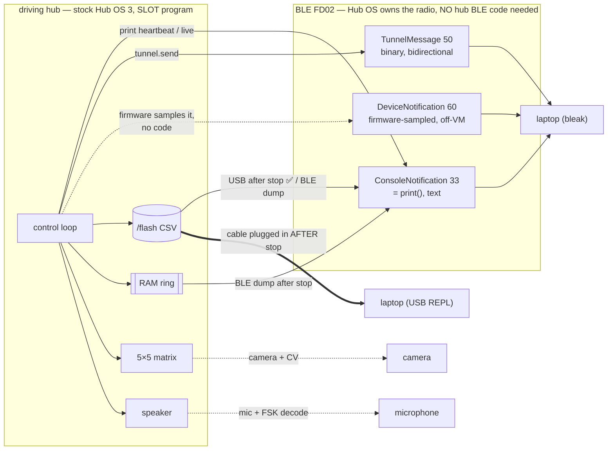

# Research — the EXHAUSTIVE set of ways to move data off a driving, untethered SPIKE Prime

**Type:** EXTERNAL research + repo synthesis · **Created:** 2026-09-01 · **Status:** enumeration,
**nothing here was run on our hub.** Every path is rated on stock firmware; the on-hardware gates that
would confirm each are named. Marked `[UNVERIFIED]` wherever unsourced.

**Answers the operator's re-ask, verbatim intent:** *"do as much research as you can especially into the
bluetooth stuff like if there are ways around being able to use bluetooth while motors are in use."* So
this goes **broad** — beyond the one recommended architecture — and lists **every** channel by which bytes
can leave a driving, untethered hub, ruling each in or out on stock firmware.

**This EXTENDS, does not repeat, [telemetry-while-driving.md](./telemetry-while-driving.md).** That doc is
the settled recommendation (log-on-hub-to-`/flash`, retrieve over USB after stop, optional ~3 Hz
heartbeat) and it is NOT re-argued here. What was already concluded there and is treated as SETTLED:

> - A **SLOT program runs under the live Hub OS**, so one program CAN drive motors AND emit telemetry at
>   once. The **REPL route cannot** (its `Ctrl-C` kills the Hub OS and its radio). So every BLE path below
>   presupposes a slot program (`hub_programmer/slot_upload.py`, itself UNRUN — prove over USB first).
> - **Recommendation:** log on hub to `/flash` CSV, retrieve over USB after stop, + optional ~3 Hz
>   heartbeat. Full-rate live streaming is infeasible at the current link (~5–7 records/s pessimistic).
> - The reported **"MTU 23" is a bleak/BlueZ reporting default, not a measured wire MTU.** MTU is not the
>   main throughput lever — connection interval, packets-per-connection-event, and DLE are.

> Ground truth this builds on:
> [../findings/ble-protocol-2026-08-27.md](../findings/ble-protocol-2026-08-27.md) ·
> [program-upload-protocol.md](./program-upload-protocol.md) · [ble-bring-up.md](./ble-bring-up.md) §4 ·
> [../../src/telemetry.py](../../src/telemetry.py). Governing rules:
> [../directives/hardware-safety.md](../directives/hardware-safety.md) ·
> [../decisions/0001-stock-lego-firmware-only.md](../decisions/0001-stock-lego-firmware-only.md).

---

## 0a. 2026-09-03 fallback answer -- SD card, hub flash, and log recovery

**Question answered:** if live BLE telemetry is too fragile, can the team store the run on the SPIKE Prime /
Pybricks hub and pull it later?

**Short verdict:** there is no SD-card or removable-media fallback on SPIKE Prime 45601. The usable
stock-firmware path is the hub's internal `/flash` filesystem, measured on our hub at **32,452,608 B free**
before the first project write. Log full telemetry there while untethered, then retrieve over **USB after the
robot stops**. BLE retrieval is possible only as a slow console dump because LEGO's Hub OS 3 protocol has
upload/program-flow/notification messages but **no file-download message**. Under **Pybricks**, the current
stable PrimeHub API exposes only **512 B** of user persistent storage, not a general file system suitable for
CSV logs; Pybricks is therefore not a log-offload solution for this project and remains excluded by ADR-0001.

### Hardware/media answer

| Question | Answer | Evidence |
|---|---|---|
| Does SPIKE Prime 45601 have an SD/microSD slot? | **No usable SD/removable-media path found.** Plan as if the only persistent store is internal flash. | LEGO's 45601 product/spec pages list six LPF2 ports, USB, Bluetooth, battery, speaker, matrix, IMU, MicroPython, and internal program/content memory; no card slot is listed. Our hub's root mount listing is only `['flash']`, with no `/sd` or other media mount. |
| Is anything removable? | The **battery** is removable without tools; it is not storage media. | LEGO 45601 technical specifications, power-supply section. |
| What storage does the hub publish? | Internal memory: LEGO specifies **32 MB for programs, sound, and content**. Our stock Hub OS exposes that as `/flash`. | LEGO technical specifications; `docs/archives/hub-baseline/04-filesystem.txt`. |

This is a negative conclusion by enumeration, not by teardown: no source says "there is no SD slot" in those
words. The load-bearing facts are that LEGO's own feature/interface list names the available physical
interfaces, and our live filesystem probe found no removable mount.

### Persistent storage by firmware

| Firmware state | Persistent storage available to user code | Telemetry implication |
|---|---|---|
| **Stock LEGO Hub OS 3, our accepted path** | `/flash` MicroPython filesystem. Baseline: block size 4096, total blocks 7936, free blocks 7923 => **32,452,608 B free**; `/flash/lib` is on `sys.path`; `/flash/program` was empty in the baseline. | Suitable for full-run CSV telemetry if a **slot program** can `open()`/write it; that exact slot-program write is still gate **U-11**, but REPL writes to `/flash/lib` are proven by ADR-0007. |
| **Pybricks on SPIKE Prime / Inventor Hub** | `hub.system.storage(offset, read=...)` / `write=...`, capped at **512 B**; saved to flash on normal shutdown, persists after battery removal, cleared by Pybricks firmware update. Pybricks program slots are also persistent on normal shutdown. | Fine for calibration bytes, a run counter, or a tiny summary. **Not enough for telemetry logs.** Current Pybricks file-system access for Prime/Inventor is an open feature issue, not a stable API. |

Do not confuse Pybricks EV3 documentation with SPIKE Prime. Pybricks `DataLog` creates files on EV3, whose
MicroPython environment is built around an SD-card-backed Linux filesystem. The current Pybricks PrimeHub
stable docs point users to 512 B `system.storage`, not general `open()` file logging.

### How to log while untethered on stock Hub OS

The recommended stock path is boring in the best way:

1. Run the mission as a **Hub OS slot program**, not through the REPL. The REPL route sends `Ctrl-C` to get a
   prompt; that interrupts the Hub OS that owns BLE and slot execution.
2. At run start, check space with `os.statvfs('/flash')` and choose one log file under `/flash`, for example
   `/flash/team21-run.csv` or `/flash/log-<counter>.csv`.
3. Write `telemetry.header_lines(...)`, then append `telemetry.Recorder.format(...) + '\n'` records.
4. Batch writes in RAM, for example flush every 10-50 records or around 0.5-2 KiB. Do **not** open/close or
   flush on every sample unless a bench test proves the latency is harmless.
5. On normal stop/report, write `Recorder.trailer()` and close the file in `finally` so a truncated file is
   detectable by `seq_last` / `sum_seq`.

Capacity is not the first-order constraint. Using the existing ~120 B worst-record estimate:

| Rate/run | Computed log size |
|---|---|
| 20 Hz for 10 min | ~1.44 MB |
| 20 Hz for 23 min | ~3.31 MB |
| 100 Hz for 10 min | ~7.2 MB |
| 100 Hz for 23 min | ~16.56 MB |

All fit under the measured free `/flash` space with room left for code, but run
`./hub_programmer/upload.py --list` before relying on that number because project uploads and prior logs
consume 4096-byte blocks.

### Retrieval with the repo as it exists today

| Retrieval path | Current status | Use / next code task |
|---|---|---|
| **USB after stop** | **Best path, but no polished `download` command exists yet.** `upload.py --list` can list `/flash` and free bytes; `upload.py` already has REPL command/read/hash primitives; `run.py --save` can execute a one-off reader in RAM and save its printed output. | Main-agent code task: add a small host-side downloader, likely in `hub_programmer/`, that reads `/flash/<log>` in chunks, base64-encodes or otherwise frames safely, saves to `docs/findings/runs/`, and compares a hub-computed SHA-256 with the host file. Do not put it in `probes/` if it can delete/rename, and keep it read-only by default. |
| **Manual USB REPL / `run.py --save` bridge** | Feasible for a short-term bench recovery, awkward for a full log. | A temporary reader can `open('/flash/team21-run.csv','rb')`, print bounded/base64 chunks, and let `hub_programmer/run.py --save ...` capture stdout. This reuses existing tooling but still needs a helper source file or pasted one-off program. |
| **BLE after stop, stock Hub OS 3** | Fallback only. LEGO protocol notifications can carry console output, but the message table has no file-download request. | The running program must dump its own log by `print()`/`ConsoleNotification`, and the host must reassemble frames. `slot_upload.py --listen` can capture console output from a program it starts; it is not yet a standalone "ask an already-running mission to send file X" client. Expect tens of seconds to minutes for full logs at the current conservative BLE rates. |
| **Pybricks BLE** | Different protocol from this repo's stock FD02 tooling. | Pybricks exposes stdin/stdout over its BLE service / Nordic UART pattern once a Pybricks program is loaded, but that does not help this stock-firmware repo, and Pybricks still lacks full-file logging on PrimeHub today. |

### Risks and limits

- **Flash wear:** treat `/flash` as internal flash, not an SD card. LEGO specifies 32 MB program/content
  memory; the teardown-cited Winbond W25Q256JV part is rated at minimum 100k program/erase cycles per sector,
  but the SPIKE firmware's exact wear-leveling/metadata behavior is not documented here. Sequential append to
  one file for course-scale runs is reasonable; per-sample open/close/flush and repeated overwrite of the
  same tiny file are the patterns to avoid.
- **Write latency:** sector erase and filesystem metadata updates can pause user code. Batch writes and make
  U-11 measure "slot program writes while motors run" before promoting `/flash` logging from INFERRED to
  MEASURED.
- **Power loss:** a crash or hard power-off may lose the last buffered records. Bound the batch size so the
  worst-case loss is acceptable; write the integrity trailer on normal stop so missing tails are obvious.
- **Storage hygiene:** logs will accumulate. Use one project prefix, list free space before runs, and delete
  only files the team created. `upload.py --remove` already refuses stock files and guarded directories.
- **Motor/BLE contention:** stock `motor.run()` is fire-and-forget, but Python scheduling is cooperative.
  `print()` and file writes still consume loop time, and a back-pressured console may stall the loop until G4b
  proves otherwise. Keep the live BLE heartbeat off by default; the `/flash` log is the record of account.
- **User-code BLE ownership:** do not call `bluetooth.BLE()` from mission code on stock Hub OS. It risks
  displacing the Hub-OS-owned FD02 service and buys no storage fallback.

### Sources added on 2026-09-03

- LEGO Education 45601 product page: https://education.lego.com/en-us/products/lego-technic-large-hub-for-spike-prime-/45601/
- LEGO Education 45601 technical specifications PDF: https://assets.education.lego.com/v3/assets/blt293eea581807678a/bltf512a371e82f6420/5f8801baf4f4cf0fa39d2feb/techspecs_techniclargehub.pdf?locale=en-us
- LEGO SPIKE Prime Hub OS 3 protocol: https://lego.github.io/spike-prime-docs/ , especially
  https://lego.github.io/spike-prime-docs/connect.html and
  https://lego.github.io/spike-prime-docs/messages.html
- Pybricks PrimeHub stable API (`system.storage`): https://docs.pybricks.com/en/stable/hubs/primehub.html
- Pybricks getting-started / program slots: https://pybricks.com/learn/getting-started/pybricks-environment/
- Pybricks hub-to-PC communication / BLE stdin-stdout: https://pybricks.com/projects/tutorials/wireless/hub-to-device/pc-communication/
- Pybricks file-system access feature issue for Prime/Inventor context: https://github.com/pybricks/support/issues/1989
- Pybricks EV3-only `DataLog` contrast: https://docs.pybricks.com/en/v2.0/tools.html
- Winbond W25Q256JV datasheet, used only for flash-endurance context if the teardown part number is correct:
  https://resources.ampheo.com/static/datasheets/winbond-electronics-corporation/w25q256jveiq-tray.pdf
- Community teardown naming the SPI flash part, treated as non-primary hardware detail:
  https://github.com/gpdaniels/spike-prime

---

## 0. The one-paragraph answer to "can we BLE while the motors run?"

**Yes — and no workaround is needed for the basic case.** A single stock-firmware slot program runs
*under* the live Hub OS, which keeps owning the radio, so the program can command motors (`motor.run()` is
fire-and-forget, non-blocking) and `print()` telemetry in the same cooperative loop. The workarounds below
exist for the *hard* parts that remain: (1) the link is too slow for full-rate live streaming, so the
**record of account is an on-hub log**, not the stream; (2) `print()` may stall the loop if the console
back-pressures with no listener (gate **G4b**), so the safe live channel is a low-rate heartbeat; and (3)
if a denser or non-perturbing live channel is ever wanted, **TunnelMessage** and **DeviceNotification**
exist *without any hub-side radio code*. Every path that would make *user code own the radio* is ruled OUT
on stock firmware (§ Tier 5). Firmware-replacement paths (Pybricks `broadcast`/`observe`) are OUT by
ADR-0001 before feasibility is even discussed.

---

## 1. The complete channel map

Data can only leave the STM32F413 by a physical emitter it controls. There are exactly five: the **BLE
radio** (a separate TI CC2564C part, owned by the Hub OS), the **USB CDC serial line**, the **`/flash`
filesystem** (retrieved later over one of the first two), the **5×5 light matrix**, and the **speaker**.
Everything below is one of those five.

**Crucial protocol fact, re-confirmed from LEGO/spike-prime-docs `messages.html` today:** there is **no
file-download message** in the protocol — only upload (`StartFileUpload 0x0C`, `TransferChunk 0x10`).
"Downloading the log over BLE" therefore means *a program `print()`s the file back*, bounded by the same
notification limits as live streaming. Bulk retrieval over **USB** is the only channel with no radio gate.

---

## 2. RANKED — feasibility on stock firmware × throughput × simplicity

Ranked for the actual job: get a full 21-column run off a driving, untethered hub for offline analysis,
with a cheap live confidence check. **Higher tier = better on all three axes together.**

| # | Path | Stock-firmware feasibility | Rough throughput | Simplicity | Rank |
|---|---|---|---|---|---|
| 10 | **On-hub `/flash` log → USB retrieval after stop** | **HIGH** — ADR-0007 proves `/flash` writable over REPL; slot-program write INFERRED; free space measured 32,452,608 B on 2026-08-27 baseline | **Highest effective** — USB 115200 ≈ 11.5 KB/s, ~16–21 s for a 184 KB log, deterministic | **Highest** — reuses `Recorder` verbatim, no listener, fail-safe | **T1 — record of account** |
| 1 | **`print()` → ConsoleNotification, ~3 Hz heartbeat (default OFF)** | INFERRED (gate G4); the known path | ~273 B/s at 3 Hz — fits even the 667 B/s floor | **Highest** — one `print()` per N ticks | **T1 — live half** |
| 2 | **TunnelMessage 50 via `hub.config['module_tunnel']`** (BLE) | STOCK-CAPABLE, `[UNVERIFIED]` our build; SPIKE-3 third-party working | Binary → ~2–3× denser than CSV; same latency floor as #1 | Medium — undocumented API, callback + keep-alive loop | **T2 — best live upgrade** |
| 3 | **DeviceNotification 60** (host sends `DeviceNotificationRequest 40`, BLE) | STOCK — a LEGO message; `[UNVERIFIED]` our build | Firmware-set interval; **off-VM, does not perturb the loop** | High — zero hub-side code | **T2 — non-perturbing witness** |
| 4/5 | **On-hub log (`/flash` or RAM ring) → BLE dump after stop** | HIGH (flash) / MED (RAM heap ceiling) | ~69–276 s for 184 KB at MTU 23 (slow) | Medium — read file, `print()` burst, reassemble | **T3 — untethered fallback** |
| 9 | **A second simultaneous BLE connection** | `[UNVERIFIED]` — LEGO radio spec allows 4 BLE | **No throughput gain** — same stream duplicated, not split | Low — two centrals, reassemble twice | **T3 — redundancy only** |
| 11 | **5×5 light matrix → camera + CV** | STOCK (matrix API, no radio) | ~1–10 bit/s reliable `[UNVERIFIED]` | Low — needs camera + decoder, fragile | **T4 — status, not data** |
| 12 | **Speaker → microphone (tone/FSK)** | STOCK (sound API, no radio) | ~tens of bit/s `[UNVERIFIED]` | Low — needs mic + decoder, disruptive | **T4 — status, not data** |
| 6 | **User code drives its own GATT notify** (`bluetooth.BLE()`) | **OUT on stock** — displaces the Hub OS radio singleton | Zero gain over #1/#2 (same radio/interval); ~15–25% framing only | Very low — no Hub OS 3 precedent | **T5 — ruled OUT** |
| 7 | **Connectionless BLE broadcast/observe** | **OUT on stock** — `ble.broadcast`/`observe` is **Pybricks only**; on stock needs `gap_advertise()` = same displacement | ~26 B/msg, connectionless/lossy | Very low | **T5 — ruled OUT** |
| 8 | **Hub as BLE CENTRAL pushing to another device** | **OUT on stock** — the only precedent (hub2hub) is Hub OS 2 / LWP3; LEGO *removed* hub-to-hub BLE | n/a | Very low | **T5 — ruled OUT** |
| — | **Pybricks `broadcast`/`observe`, any reflash** | **OUT by ADR-0001** — requires replacing firmware | (n/a) | (n/a) | **Excluded — named, then ruled out** |
| — | **Bluetooth Classic RFCOMM channel** | **OUT on stock Hub OS 3** — Classic RFCOMM is the Hub OS 2 stack; Hub OS 3 is BLE GATT FD02 | (n/a) | (n/a) | **Excluded** |

**The recommendation is unchanged from [telemetry-while-driving.md](./telemetry-while-driving.md):** #10 as
the record of account + #1 as an OFF-by-default heartbeat. This document's contribution is the *rest of the
list* — what to reach for if that pairing is not enough, and what to never reach for.

---

## 3. Per-path detail — the catch on each

### Tier 1 — the recommended pairing (both settled elsewhere; stated for completeness)

- **(#10) On-hub `/flash` CSV → USB after stop.** Robot drives untethered, appending `telemetry.py`
  `Recorder` lines to a `/flash` file; the operator plugs the cable in **only after the robot stops** and
  reads the file over the REPL. Zero cable drag during the run, deterministic ~16–21 s bulk pull,
  fail-safe (needs no listener), reuses the pure formatter unchanged. **Catch:** nothing is visible until
  the run ends; slot-program `open()`/write of `/flash` is INFERRED-yes (ADR-0007 proves `/flash` writable
  over the REPL) but UNRUN as a slot program (gate **U-11**); `/flash` free space is now MEASURED from the
  baseline at **32,452,608 B free** before the first project upload, and should be re-listed before each run.
- **(#1) ConsoleNotification heartbeat.** `print()` one full record every N ticks (~3 Hz), which LEGO's
  firmware wraps as `ConsoleNotification 0x21` (`string[256]`, NUL-terminated, fragmented at the packet
  size, reassemble on the `0x02` delimiter — LEGO's own `app.py` omits this buffering and loses long
  lines). **Catch:** `print()` may block the control loop if the console back-pressures with **no** BLE
  listener attached — the most dangerous unknown, gate **G4b**; keep `TELEMETRY_LIVE_ENABLED = False` until
  it passes. Thin by **rate, never columns**, so `telemetry.py`'s one-parser invariant holds.

### Tier 2 — the two live upgrades that need NO hub radio code

- **(#2) TunnelMessage 50 — `hub.config['module_tunnel']`.** Confirmed layout from `messages.html`:
  bidirectional, `[0x32][uint16 size][payload]`, so a message can be **binary** and large (near
  `max_message_size` 5000). A running program does `tunnel = hub.config['module_tunnel']`,
  `tunnel.callback(fn)`, `tunnel.send(bytes)` — and must **stay alive** (a sleep loop) for the callback to
  fire. It rides the Hub-OS-owned radio, so **no `bluetooth.BLE` call is ever made** — this is the sanctioned
  way to get a binary, bidirectional channel. Binary packing buys ~2–3× over the ~89 B CSV record; it does
  **not** beat #1 on latency (same radio, same connection-interval floor). Bidirectionality is the real
  prize: remote start/stop and back-pressure-aware sending. **Catch:** undocumented (exists only in a LEGO
  engineer's issue comment + one working SPIKE-3 third-party repo); `[UNVERIFIED]` on our 2025-03-27 build
  (**U-16**); a known **tunnel-message crash bug** shut down some hubs on older firmware — do the first
  tunnel test only in a throwaway session. An undocumented API is *more* stable for us than for anyone,
  because ADR-0001 freezes our firmware forever.
- **(#3) DeviceNotification 60.** The host sends `DeviceNotificationRequest 0x28` with an interval in ms
  (`0` disables); the hub then streams `DeviceNotification 0x3C` (`[0x3C][uint16 size][device messages]`)
  carrying battery, IMU, every motor's position/speed/power, colour, distance, and matrix state —
  **sampled by firmware, off the Python VM.** This is the **only** telemetry path with real parallelism: it
  cannot perturb the control-loop rate it is helping measure, and it needs **zero** hub-side code. **Catch:**
  the schema is fixed to what firmware exposes — it carries **no** logic fields (`state`, `lane`, `count`,
  `det_state`), so it is a *witness*, not a replacement for the log; a known firmware bug adds an extra byte
  to the battery record that breaks LEGO's own parser and is provoked by flooding `print()` (**U-15**) —
  log frames unparsed rather than crashing the link, and do not enable it on first contact.

### Tier 3 — untethered retrieval and redundancy

- **(#4/#5) On-hub log dumped over BLE after stop.** If the cable genuinely cannot be reached after the run
  (it can, in this project — the operator retrieves it), the log can instead be `print()`ed back over BLE
  once the robot stops. Bounded by the same notification limits: ~69–276 s for a 184 KB log at MTU 23. The
  **RAM ring** variant (#5, `TELEMETRY_RING_SAMPLES` ≈ 2000) avoids `/flash` but does **not** scale — a
  10 min @ 20 Hz sweep overflows the ~250 KB optimistic heap ceiling (**U-13**); use it only as a
  consciously-accepted black-box of the last N samples. **Catch:** slow, and there is no download message,
  so it is a `print()` burst needing reassembly.
- **(#9) A second simultaneous BLE connection.** LEGO's radio spec lists up to **4 BLE + 1 BTC**
  connections, so two laptops could both connect and subscribe to notify. But GATT notifications are the
  Hub OS's own `ConsoleNotification`/`DeviceNotification`, delivered **per connection** — a second central
  receives a **duplicate** of the same stream, not a second half of it, and user code cannot address
  different data to different centrals (it cannot drive the radio). So a second connection buys
  **failover redundancy** (if one link drops mid-run the other still has the samples), **not** throughput.
  `[UNVERIFIED]`: whether the Hub OS actually notifies all subscribers, and whether two connections'
  connection events raise or merely share airtime. Worth it only if a dropout during the demo is judged
  costly — and the `/flash` log already covers that failure for free.

### Tier 4 — non-BLE emitters (the operator asked to assess these seriously)

- **(#11) Light matrix as a visual data channel to a camera.** 25 pixels × ~10 brightness levels is a
  real information surface, and the matrix API needs no radio. But a camera + CV decoder reads it reliably
  at maybe **~1–10 bit/s** `[UNVERIFIED]` once you budget for frame rate, rolling shutter, viewing angle,
  and classroom lighting — five-plus orders of magnitude under even the BLE floor. **Verdict: a genuine
  last-resort data channel, but its real use is the human-readable status panel the design already
  specifies** (competition-program-design §4.5) — a few glyphs a blind operator reads directly, not a
  machine data link.
- **(#12) Speaker as an audio (tone/FSK) channel to a microphone.** Audio FSK to a nearby mic could carry
  **tens of bit/s** `[UNVERIFIED]`; the sound API needs no radio. But it needs a mic + decoder, is
  disruptive in a shared room, and depends on unawaited-beep behaviour that is itself untested (**U-17**).
  **Same verdict as the matrix: better as human status beeps** (already recommended) than as a data
  channel. Neither #11 nor #12 can carry a 21-column record at any useful rate; both are legitimate for
  *state*, not *data*.

### Tier 5 — paths that require user code to OWN the radio: ruled OUT on stock firmware

All three below fail for the **same root reason**, established from MicroPython v1.24.0 C source in
[ble-bring-up.md](./ble-bring-up.md) §4: `bluetooth.BLE()` is a **process-wide singleton** — user code gets
the Hub OS's object; `BLE.irq()` is a **single handler slot with no chaining** (registering ours silently
discards the Hub OS handler and FD02 goes deaf); `gatts_register_services()` **resets the GATT DB** (wiping
LEGO's FD02 service); and `active(True)` risks a **double-init** of the CC2564C under the C-level owner. The
`bluetooth` module **is** present and importable, but presence is not permission.

- **(#6) Hand-rolled GATT notify characteristic.** Technically the API is there; there is **no published
  case of it working on Hub OS 3**. It buys **zero** latency/throughput over #1/#2 (same radio, same
  connection interval) — only ~15–25% framing savings — while costing `DeviceNotification`, remote
  start/stop, discoverability, and the no-perturbation property. **OUT before 10 SEP; never without an ADR.**
- **(#7) Connectionless BLE broadcast / observe.** Verified via web search today: `ble.broadcast(data)` /
  `hub.ble.observe(channel)` and the `micropython-bleradio` module are **Pybricks** (`PrimeHub.ble`), **not
  stock firmware** — combined payload capped at 26 bytes. On **stock** firmware there is no
  broadcast/observe API; producing connectionless adverts would require `gap_advertise()`, i.e. the same
  singleton displacement as #6, and it would replace the FD02 advertisement. **OUT on stock.**
- **(#8) Hub as a BLE central/scanner pushing to another device.** The one cited precedent —
  `NStrijbosch/hub2hub`, and Anton's "remote-control an EV3 from SPIKE over Bluetooth" — is **Hub OS 2**
  acting as an **LWP3 central**, a different protocol *and* GAP role; its own README records LEGO firmware
  **removing** hub-to-hub BLE. On stock Hub OS 3 this is the singleton-displacement problem again, plus it
  needs a second LEGO receiver. **OUT on stock.**

### Excluded by hard constraint (named, then ruled out)

- **Pybricks `broadcast`/`observe` (or any third-party firmware).** The clean connectionless-messaging API
  the web surfaces (`ble.broadcast`, `micropython-bleradio`) is **real and good — and it requires flashing
  Pybricks.** That is a firmware replacement, OUT by [ADR-0001](../decisions/0001-stock-lego-firmware-only.md)
  and BLACKLIST item 1, before throughput is even considered. Listed so a future reader who finds the
  attractive Pybricks docs knows it was seen and rejected on the firmware axis, not missed.
- **Bluetooth Classic RFCOMM.** The hub's radio is dual-mode, but Hub OS 3 speaks **BLE GATT FD02**;
  Classic RFCOMM + JSON-RPC was the **Hub OS 2** stack. No stock Hub OS 3 Classic data channel exists.

---

## 4. [UNVERIFIED] register — the bench test that settles each new-in-this-doc point

The gates from [telemetry-while-driving.md](./telemetry-while-driving.md) §5 (G3/G4/G4b/G5, U-1…U-18)
still stand and are not repeated. Points this enumeration adds or sharpens:

| # | Point | Status | Test that settles it |
|---|---|---|---|
| A | Does `hub.config['module_tunnel']` exist on our 2025-03-27 build, and is the crash bug fixed? | `[UNVERIFIED]` (other hubs only) | Probe `hub.config['module_tunnel']` in `try/except KeyError` over the REPL; run a first `tunnel.send`/`callback` round-trip only in a throwaway session (U-16). |
| B | `DeviceNotification 60` interval floor, per-frame size, and whether the battery extra-byte bug is present on our build | `[UNVERIFIED]` | Send `DeviceNotificationRequest 0x28` at a modest interval; log raw `0x3C` frames; check the battery record length (U-15). Do not enable on first contact. |
| C | Does the Hub OS notify **all** subscribers on a second BLE connection, and does a second link add or merely share airtime? | `[UNVERIFIED]` | Connect two bleak centrals, both `start_notify`, run a `print()` slot program, compare received streams and rates. |
| D | Light-matrix / speaker data-rate ceilings | `[UNVERIFIED]` (assessed, not measured) | Only if T4 is ever pursued — out of scope for 10 SEP; both are recommended as *status*, not *data*. |
| E | `broadcast`/`observe` is Pybricks-only, not stock | **Sourced** (Pybricks docs, `micropython-bleradio`) | Confirmed by primary Pybricks documentation; no test needed — it is excluded by ADR-0001 regardless. |

**The single test that unlocks the whole live upgrade path:** the same **G4** from the sibling doc — upload
a slot program that spins a motor and `print()`s numbered lines and watch for `ConsoleNotification`s while
it drives. Passing G4 + G4b confirms #1; a follow-on `module_tunnel` round-trip (test A) confirms #2; a
`DeviceNotificationRequest` (test B) confirms #3 — three sittings that convert Tiers 1–2 from INFERRED to
MEASURED.

---

## 5. Recommend — do NOT edit these files here (per the minimalism constraint)

This document is the only new file. When the team acts on it:

- **No code changes today.** The recommendation of [telemetry-while-driving.md](./telemetry-while-driving.md)
  stands: `/flash` log + OFF-by-default `print()` heartbeat, both already mapped onto
  [../../src/telemetry.py](../../src/telemetry.py). **Do not add `hub_ble.py`** — every Tier-5 path that
  would need it is ruled out.
- **`docs/research/INDEX.md`** should get a one-line entry for this file (operator/normal edit — not made
  here to keep this task to a single new file).
- **`docs/plans/known-unknowns.md`** already tracks `module_tunnel`; add DeviceNotification interval/size
  (test B) and the second-connection question (test C) when that file is next touched.

---

## 6. Sources

**LEGO, primary (spike-prime-docs):** `messages.html` — re-fetched 2026-09-01, confirming
ConsoleNotification `0x21` (`string[256]`), TunnelMessage `0x32` (bidirectional, `uint16` size + payload),
DeviceNotificationRequest `0x28` (`uint16` interval ms, 0 = disable), DeviceNotification `0x3C` (`uint16`
size + battery/IMU/motor/sensor/matrix records), and **no file-download message**. `hub.config['module_tunnel']`
API and the tunnel-crash bug: spike-prime-docs issue #8 (SteffenLEGO), working SPIKE-3 use in
`etomasfe/SpikeRemoteControl`. Radio "4 BLE + 1 BTC": `gpdaniels/spike-prime` (STM32F413 + TI CC2564C).

**Pybricks (to rule the reflash path OUT, not to adopt it):** `docs.pybricks.com` PrimeHub `ble.broadcast`
/ `ble.observe` (`broadcast_channel`, `observe_channels`, 26-byte combined limit); `pybricks/micropython-bleradio`
(connectionless messaging) — **Pybricks firmware, excluded by ADR-0001.** Anton's Mindstorms "remote
control an EV3 with SPIKE over Bluetooth" and `NStrijbosch/hub2hub` — **Hub OS 2 / LWP3 central**, the
(#8) precedent that no longer applies.

**Repo ground truth:** [ble-protocol-2026-08-27.md](../findings/ble-protocol-2026-08-27.md) (FD02, MTU-23
default, InfoResponse 509/5000/4096) · [ble-bring-up.md](./ble-bring-up.md) §4 (singleton/irq/GATT-DB
mechanisms; `module_tunnel`; the four channels out of the hub) · [program-upload-protocol.md](./program-upload-protocol.md)
(slot upload, no download message) · [telemetry-while-driving.md](./telemetry-while-driving.md) (the settled
recommendation and gates G3/G4/G4b/G5). ResearchHub was queried for BLE-offload technique on 2026-09-01;
its corpus returned nothing on-domain (physics/logging-while-drilling), consistent with the fail-open rule —
the field literature (AUV post-recovery download, PixHawk log-and-stream, robot black box) is already
synthesised in telemetry-while-driving.md §4.
