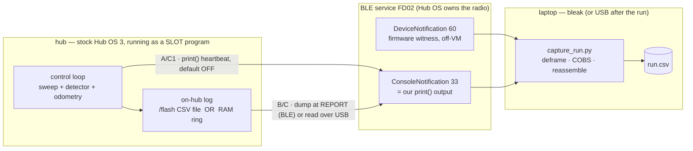

# Research — Bluetooth telemetry WHILE THE MOTORS RUN

**Type:** EXTERNAL research + repo synthesis · **Created:** 2026-09-01 · **Status:** designed,
**nothing here was run on our hub** — the concurrency claim is INFERRED end-to-end and gated on bench
tests G4/G4b/G5 (§5).

**Answers the operator's question, verbatim intent:** *"we really need to figure out how we can use
bluetooth while the motors are running"* — and the follow-on, *"our final design might not be streaming
over bluetooth or something,"* i.e. be open to **log-on-hub-then-retrieve** if live streaming does not
work.

**Synthesises** four adversarially-verified research passes (concurrency, architecture, MTU, literature;
all returned `refuted: false`) against the repo's measured ground truth. It **refines, does not replace**,
[../plans/telemetry-over-bluetooth.md](../plans/telemetry-over-bluetooth.md) and
[../plans/competition-program-design.md](../plans/competition-program-design.md) §4 — the centre of
gravity moves from *live-primary* to *log-primary*. Every number is COMPUTED from LEGO's published
protocol, bleak/BlueZ source, and BLE primers, or quoted from a repo measurement; nothing was measured on
a hub for this document.

**Maps entirely onto existing modules** — [../../src/telemetry.py](../../src/telemetry.py) `Recorder`,
[../../src/result.py](../../src/result.py) `describe()`, the `hub_*` layer. **No new framework, no
`hub_ble.py`, no architecture change.**

> Ground truth this builds on:
> [../findings/ble-protocol-2026-08-27.md](../findings/ble-protocol-2026-08-27.md) ·
> [../findings/hub-first-contact-2026-08-27.md](../findings/hub-first-contact-2026-08-27.md) ·
> [program-upload-protocol.md](./program-upload-protocol.md) · [ble-bring-up.md](./ble-bring-up.md).
> Governing rules: [../directives/hardware-safety.md](../directives/hardware-safety.md) ·
> [../decisions/0001-stock-lego-firmware-only.md](../decisions/0001-stock-lego-firmware-only.md).

---

## 1. The core concurrency answer

**Can ONE stock-SPIKE-3 slot program run a motor control loop AND emit telemetry over BLE at the same
time? YES in principle — with one confidence level per link in the chain, and the weakest link is
INFERRED, not measured on our hub.**

### 1.1 The mechanism, and why a SLOT program is the only route

There are two ways to run our code on the hub, and only one keeps BLE alive:

| | REPL route (`hub_programmer/run.py`) | SLOT route (`hub_programmer/slot_upload.py`) |
|---|---|---|
| How it runs | pasted/run over the MicroPython REPL | Hub OS runs it via `ProgramFlowRequest 0x1E` |
| Needs `Ctrl-C`? | **Yes** — to get a `>>>` | **No** — driven by the live Hub OS |
| BLE while it runs? | **No.** A REPL `Ctrl-C` (`0x03`) interrupts the **Hub OS, which owns the radio** | **Yes.** The program runs *under* the live Hub OS, so the Hub OS keeps driving BLE |
| Status on our hub | REPL deploy PROVEN (ADR-0007) | **UNTESTED** — the whole upload+start sequence has never run on our hub |

So the operator's "BLE while the motors run" is achievable **only** as a **slot program**, and step zero
of any BLE-telemetry work is proving `slot_upload.py` **over USB first** (USB is point-to-point and cannot
touch another team's hub). That the slot sequence is unrun is the first UNVERIFIED item, not a detail —
[program-upload-protocol.md](./program-upload-protocol.md) §6 item 1.

### 1.2 Telemetry leaves as `print()`, not as user BLE code

Under a running slot program, telemetry leaves the hub as **ordinary `print()`**, which LEGO's firmware
wraps as a **`ConsoleNotification` (msg id 33 / `0x21`, `string[256]`, NUL-terminated)** and pushes over
whatever link is attached. This is exactly what `src/telemetry.py` was built for: a **pure formatter**
whose caller does the `print()`. Nothing in `src/` changes when the transport is chosen.

```
hub -> telemetry.Recorder.format(...) -> print() -> [ ConsoleNotification over BLE | USB serial ] -> laptop
```

**Confidence, link by link:**

| Link in the chain | Confidence | Basis |
|---|---|---|
| SLOT program runs under the live Hub OS, keeping BLE up | INFERRED | REPL-vs-slot mechanism (measured: `DeviceUuidRequest` answered without any `Ctrl-C`); the slot start sequence itself is UNRUN |
| `runloop` is cooperative, single-threaded; `motor.run()` is fire-and-forget non-blocking | **PRIMARY-SOURCE** | LEGO SPIKE 3 docs + tuftsceeo SPIKE3 mirror (§1.3) |
| `print()` reaches the host as a `ConsoleNotification` on OUR firmware | **INFERRED** — the weakest link | LEGO's `app.py` uploads a program whose body is `print('Console message from hub.')` and captures it — circumstantial. **Gate G4.** |
| `print()` does NOT block the loop when no client is listening | **UNVERIFIED** — the most dangerous unknown | MicroPython stdout can block on a full TX buffer with a connected-but-not-draining host; the Hub-OS-intercepted-console backpressure policy with no subscribed central is undocumented. **Gate G4b.** |
| It survives with both motors actually running | **UNVERIFIED** | **Gate G5.** |

**The honest one-sentence answer: the mechanism is sound and primary-sourced, but the end-to-end path —
slot program drives motors and its `print()` arrives over BLE without stalling — has never been run on our
hub, and three cheap bench gates (G4, G4b, G5) convert it from INFERRED to MEASURED.**

### 1.3 Cooperative scheduling: a separate coroutine does NOT shield the loop

`runloop.run(control(), telemetry())` runs coroutines **concurrently but cooperatively on one thread** —
non-preemptive. LEGO's own guidance: *"when you use a tight while loop, use `await runloop.sleep_ms(1)` to
give other coroutines a chance to run."* A coroutine that never awaits monopolises the CPU. There is **no
true parallelism in the Python VM**, so time spent in `print()`/framing is time the drive loop is **not**
correcting heading. **Budget telemetry time against the control-loop period; do not assume a "telemetry
coroutine" isolates it.**

- `motor.run(port, velocity_dps)` is **fire-and-forget** (non-awaitable, returns immediately), so
  *commanding* motors does not block; `motor.run_for_degrees()` is the awaitable variant.
- The only telemetry path with **real** parallelism is `DeviceNotification` (msg id 60), sampled by
  firmware **off** the Python VM — which is why the repo keeps it as an independent witness. (That it is
  sampled off-VM is INFERRED, consistent with ble-bring-up.md, not stated by a fetched primary source.)

### 1.4 Do NOT drive the radio from user code — effectively closed

The `bluetooth`/`ubluetooth` module **is** present and importable on our hub (full GAP+GATT confirmed by
`dir()`, so the old "API missing" claim is dead), but user code **must not** call it, on mechanism read
from MicroPython v1.24.0 C source ([ble-bring-up.md](./ble-bring-up.md) §4):

1. `BLE()` returns a **process-wide singleton** — user code gets the Hub OS's object.
2. `BLE.irq()` is a **single handler slot with no chaining** — registering ours silently discards the Hub
   OS handler; its FD02 protocol goes deaf with no error.
3. `gatts_register_services()` **replaces the GATT DB** ("This will reset the DB") — it would wipe LEGO's
   FD02 service.
4. `gap_advertise()` replaces the advertising payload; `active(True)` risks a double-init of the CC2564C.

It buys ~15–25% framing savings and **zero** latency/throughput gain (all options share the same
connection-interval latency floor), while costing `DeviceNotification`, remote start/stop, discoverability,
and the no-perturbation property. **Verdict: do not pursue before 10 SEP, never without an ADR.** If a
binary channel is ever genuinely needed, the better alternative is `hub.config['module_tunnel']` (binary,
bidirectional, no hub BLE code) — confirmed working on SPIKE 3 by third parties but **UNVERIFIED on our
firmware**, and it carries a known tunnel-message crash bug on older builds (§5).

---

## 2. The three architectures



### 2.1 The throughput math that decides it

**Assumptions, all `[UNVERIFIED]` and stated so the numbers can be checked and reconciled:** framed record
~89 B typical / ~119 B worst (measured by formatting `telemetry.COLUMNS`; **not yet run through LEGO's
`cobs.pack()`** — do that, it is ~30 s of host work); usable notify payload = ATT MTU − 3 = **20 B** at MTU
23; connection interval **30 ms**; packets-per-connection-event bracketed **1 (pessimistic) to 4
(conservative)**; **no Data Length Extension** unless stated.

At MTU 23 one record spans `ceil(89/20)=5` to `ceil(119/20)=7` BLE notifications.

| Scenario (MTU 23, 30 ms) | Bytes/s | Full records/s |
|---|---|---|
| Pessimistic — 1 packet/event | ~667 | **~5–7** |
| Conservative — 4 packets/event | ~2 667 | ~21–29 |

> **⚠ Two COMPUTED estimates disagree, and both are honest.** This table's ~5–7 rec/s (pessimistic, 1
> pkt/event) is the floor; [program-upload-protocol.md](./program-upload-protocol.md) §5 computes **~16.7
> rec/s** at MTU 23 assuming **30 ms and 4 packets/event**. The gap is entirely the packets-per-event
> assumption (1 vs 4), which is UNMEASURED. Neither is measured; **gate G3** settles it by counting
> achieved notifications/s. The qualitative conclusion — full-record live streaming is infeasible at MTU
> 23 for a tens-of-Hz control loop — holds under both.

A **~3 Hz heartbeat** of the full record is `3 × ~91 B ≈ 273 B/s`, ~41% of even the 667 B/s floor — safe
under every bracket. That is the only live traffic the recommended design ever asks for.

### 2.2 Design A — live stream at loop rate

One `print()` per control tick; the laptop captures `ConsoleNotification`s. Simplest, and the only design
where an operator watches numbers live.

- **For:** file complete the instant the run ends; unbounded run length; no hub RAM cost beyond a format
  string.
- **Against:** **infeasible at MTU 23** (§2.1) for any real loop rate; a dropout loses those samples
  forever; `print()` costs loop time and **may stall the robot if the console blocks with no listener**
  (UNVERIFIED, gate G4b). **Not the record of account.**

### 2.3 Design B — log on the hub, retrieve after the run (RECORDED CHOICE)

Write the full record every tick to the hub, dump/retrieve after the sweep. Two storage options:

- **`/flash` CSV file (preferred for a long run).** Append `telemetry.py` `Recorder` CSV lines to a file,
  buffered/batched. It is the **only** store that scales to a multi-minute (possibly 8–23 min, arena-in-
  feet — [../findings/coverage-time-budget.md](../findings/coverage-time-budget.md)) sweep, survives
  program end, needs **no BLE listener** (inherently fail-safe), and reuses `Recorder` verbatim — no
  struct-packing. **Caveats [UNVERIFIED]:** whether a slot program can `open()`/write `/flash` (ADR-0007
  proves `/flash` is writable over the REPL, so almost certainly yes, but unrun as a slot program);
  per-tick flash write latency (batch/flush to bound it); `/flash` free space (unmeasured, but orders of
  magnitude above the ~200 KiB heap).
- **RAM ring buffer (bounded black-box).** A fixed-size ring of the last N samples
  (`TELEMETRY_RING_SAMPLES = 2000` in competition-program-design §4.4), dumped at REPORT. RAM forces binary
  packing for a long run — a 25 B packed record vs an ~89–119 B CSV line — and **still overflows** a long
  sweep (telemetry-over-bluetooth §4.2 heap table: 10 min @ 20 Hz = 293 KiB > the ~250 KiB *optimistic*
  ceiling). Use it only if the team consciously accepts a black-box of the last N samples instead of a
  full-run log.

- **For:** loses nothing to a link dropout; zero per-sample link cost; does not compete with the control
  loop.
- **Against:** nothing is visible until the run ends; the RAM variant does not scale; **there is no
  file-download message in LEGO's protocol** (§3), so a *BLE* dump is still a `ConsoleNotification` burst
  bound by the same link limits.

**Retrieval — USB after the run is the baseline.** Attach the cable only **after** the robot stops → zero
cable drag during the run (the entire concern of telemetry-over-bluetooth §2, where a ~0.7° systematic
heading bias would consume the whole cross-track budget). USB is deterministic; a BLE bulk dump at MTU 23
is impractically slow:

| Retrieve a 2000-sample (~184 KB) log | Time |
|---|---|
| BLE dump @ MTU 23, ~667 B/s pessimistic | ~276 s |
| BLE dump @ MTU 23, ~2667 B/s conservative | ~69 s |
| BLE dump @ MTU 247 | ~23 s |
| **USB CDC-ACM @ 115200, raw wire (184000/11520)** | **~16 s optimistic** |
| USB with ADR-0007 base64 + framing (~33% inflation) | **~21 s** |

The ~16 s figure is raw-wire and ignores the base64/framing inflation of the same REPL mechanism the
retrieval relies on; ~21 s is the honest number. Either way USB dominates the BLE dump. Promote a BLE dump
to primary only once the MTU read (§3) confirms the wire MTU > ~127 B.

### 2.4 Design C — hybrid (what the RECOMMENDATION actually is)

Design B as the record of account **plus the cheap half of the hybrid**: a ~3 Hz `ConsoleNotification`
heartbeat, **default OFF**. This is what competition-program-design §4.4 already sets
(`TELEMETRY_LIVE_ENABLED = False`, `TELEMETRY_LIVE_HZ = 3.0`) and this document confirms with numbers. When
live is enabled, thin by **rate, never by columns** (`Recorder.note_dropped()` keeps the trailer's
integrity check honest) — dropping columns would break `telemetry.py`'s one-parser invariant.

- **For:** the log survives any link event; the heartbeat is a cheap supervisor confidence check that fits
  even the 667 B/s floor; `DeviceNotification` at ~200 ms can run as an off-VM witness (subject to the
  battery-parse bug, §5).
- **Against:** two channels on one link need reassembling. Mitigated by building the log first — the log
  alone is a working system.

### 2.5 RECOMMENDATION

**Adopt Design B (log the full record on the hub) as the record of account, with a ~3 Hz live heartbeat
(Design C's cheap half) bolted on and default OFF.** In build order:

1. **Run the mission as a SLOT program** (`slot_upload.py`) — the only way to have motors and BLE at once.
   **Prove `slot_upload.py` over USB first**; it is UNTESTED.
2. **On-hub log** = `telemetry.py` `Recorder` CSV appended to a **`/flash` file**, buffered/batched
   (preferred over a RAM ring: it scales to a multi-minute sweep, survives program end, needs no listener,
   reuses `Recorder` unchanged). Fall back to a bounded RAM ring dumped at REPORT only if a slot program
   cannot write `/flash`.
3. **Primary retrieval** = **USB REPL file-read after the robot stops** (zero cable drag during the run,
   deterministic ~21 s vs an impractical ~69–276 s BLE dump at MTU 23).
4. **Live feedback for a (blind) operator** = the **link-independent sound + matrix** panel
   (competition-program-design §4.5), not the BLE stream. Add a ~3 Hz `ConsoleNotification` heartbeat as a
   supervisor check but keep `TELEMETRY_LIVE_ENABLED = False` until **G4b** proves `print()` does not stall
   the loop with no listener.
5. **Fail-safe is by construction** — the link is **output-only**, so a mid-run drop, a 2.4 GHz jam, or a
   rival forcing a disconnect costs a **capture, not the run**. Ordering/completeness are guaranteed
   hub-side by `seq` + `sum_seq` + `t_ms`, so BLE latency/loss cannot corrupt the analysis.

### 2.6 What would change the recommendation

- **If reading the negotiated MTU (§3) returns > ~127 B** (the record fits one packet) **AND G4 + G4b
  pass** → full-rate live streaming becomes feasible; **promote live to primary** (Design A/C) with the
  `/flash` log as the black-box backup. This is a **value change** (`TELEMETRY_LIVE_ENABLED = True`,
  `TELEMETRY_LIVE_HZ` up), **not a redesign**.
- **If a slot program cannot write `/flash`** → fall back to a bounded RAM ring dumped at REPORT, accepting
  a shorter run.
- **If G4 fails** (no `ConsoleNotification` from `print()`) → BLE live is dead; everything goes over USB —
  still an untethered run with a post-run retrieval.

---

## 3. MTU — is it the real constraint, and how to raise it on BlueZ

### 3.1 The recorded "MTU 23" is almost certainly a bleak reporting default, not the wire MTU

bleak's BlueZ backend `mtu_size` returns a **hardcoded 23** and warns *"Using default MTU value. Call
`_acquire_mtu()` or set `_mtu_size` first…"* whenever its internal `_mtu_size` is still `None`. Our capture
read `mtu_size` **without** first calling `_acquire_mtu()`, so **23 is the fallback constant, not the
link's ATT MTU**. BlueZ (≥ 5.62; ours is **5.64**) performs the ATT MTU **exchange automatically at
connect** as GATT client, independent of the app, so the wire MTU may already be far above 23. This
matches [program-upload-protocol.md](./program-upload-protocol.md) §5 and KU-M11.

> **⚠ Correction to a sibling doc.** [competition-program-design.md](../plans/competition-program-design.md)
> §4.6 calls this the **"MEASURED negotiated MTU of 23."** That over-claims: 23 is a bleak reporting
> default read without `_acquire_mtu()`, **not** a measurement of the negotiated wire MTU. Reword there to
> "recorded MTU 23 (a bleak/BlueZ default — re-measure)."

### 3.2 How to read the real MTU on Linux/BlueZ

You **cannot request** a specific MTU from bleak on Linux — BlueZ negotiates it and there is no ordinary
user knob in 5.64. The negotiated value = `min(BlueZ's built-in request, hub ATT max)`. Your job is only to
**read** it:

- **Preferred (public, cross-platform):** read `BleakGATTCharacteristic.max_write_without_response_size` on
  the FD02 write char — it equals `MTU − 3` (bleak discussion #1166, maintainer guidance).
- **BlueZ hack:** `await client._backend._acquire_mtu()` (guard to the BlueZ backend), then read
  `client.mtu_size`. `_acquire_mtu()` opens a D-Bus `AcquireWrite`/`AcquireNotify`, reads the negotiated
  MTU from the reply options, and immediately closes the returned fd — the call exists only to learn the
  MTU.

**Concrete for `capture_run.py`:** after connect, guard `_acquire_mtu()` to BlueZ, then log **both**
`client.mtu_size` and the write char's `max_write_without_response_size` into the CSV header. Free,
read-only over BLE, and it may show the link is already at a large MTU. The old "23-byte cap forever"
threads (bluepy #375, old Ubuntu forums) describe **pre-5.62 BlueZ / bluepy**, not our stack.

### 3.3 MTU is NOT the throughput lever

Sustained hub→host throughput = `(link-layer payload per packet × packets-per-connection-event) /
connection_interval`. ATT MTU only sets the max **size** of one notification value; a value larger than one
link-layer PDU is fragmented into multiple 27-byte PDUs. The three real bounds — **none measured on our
hub** — are:

1. **Connection interval** (7.5 ms–4 s; this host's kernel merely *prefers* 30–50 ms for a link that has
   never existed). Measure with `btmon`.
2. **Packets-per-connection-event** (a link-layer count fixed by the central's stack; ~4 iOS, ~6 Android;
   BlueZ-central + LEGO-peripheral value UNMEASURED).
3. **Data Length Extension** (LL PDU 27 B → up to 251 B) — **optional**, "not all devices implement it,"
   no evidence this pairing does. **This is the real multiplier, not MTU.**

**Without DLE, raising the ATT MTU 23 → 247/509 buys only ~20–33%** (header amortisation), not the headline
20×. The Memfault primer's own worked figure: 0.226 → 0.301 Mbps across that MTU jump without DLE (~33%);
DLE is what reaches ~0.803 Mbps. The "509/23 ≈ 20×" ratio is a **raw per-packet byte ratio** that
materialises only with DLE (big PDUs) plus a full connection event.

### 3.4 `509` is not an ATT-MTU statement

`InfoResponse max_packet_size = 509` is a **LEGO RPC-layer limit on host→hub writes to the RX
characteristic**, not the negotiated ATT MTU and not the hub→host notify payload (the telemetry direction,
bounded by `ATT_MTU − 3`). So do **not** read "509 vs 23" as *the* MTU gap. That the hub accepts a 509-byte
single write **does** imply it can negotiate an ATT MTU ≈ 512 (further evidence the recorded 23 is a bleak
default) — but that is inference from the write path, not a measurement of the notify MTU.

### 3.5 Net for our ~89 B record

MTU 23 needs 5–7 notifications per record; MTU ≥ 247 collapses that to **1 notification per record** — that
is where the MTU raise helps (~20–33% header amortisation), **not** 10–20×. Honest sustainable full-record
rate without DLE is **~7 rec/s floor to ~35 rec/s conservative**, so full-rate live at a tens-of-Hz control
loop is infeasible today; a 3 Hz heartbeat (273 B/s) fits even the floor. **Fix the measurement (read the
real MTU, `btmon` the interval, count notifications via G3); do not treat MTU as the design lever.**

---

## 4. Literature — what the field does in this situation

The telemetry/control literature **endorses the architecture the repo already has**; it does not call for a
redesign.

- **The dominant pattern under a constrained/intermittent link is HYBRID (dual-path): a full-rate onboard
  log as the record of account + an opportunistic, heavily-reduced live stream.** PixHawk logs to SD *and*
  streams telemetry simultaneously; the "robot black box" (ropod) and drone flight-data recorders treat
  onboard logging as an independent post-hoc record; the Smart Black Box adds value-driven buffering atop
  low-bandwidth logging. This is exactly Design C with live default OFF.
- **The AUV pattern is the closest analogue and maps one-to-one:** acoustic links run at O(10)–O(100) bit/s,
  so live telemetry is limited to *state/health* and the full science data is **downloaded after recovery**
  over a high-bandwidth link. The SPIKE case is the same trade with different numbers: a jittery ~0.6–5
  kB/s BLE heartbeat + a post-run bulk pull. Direct support for **log-on-hub-then-retrieve as primary**.
- **Human-teleop latency degrades measurably from ~200–300 ms** (first significant speed loss; EEG neural
  window 100–200 ms; cognitive saturation ~400 ms — arXiv 2508.18074, n=10 Webots), and *move-and-wait*
  traces to Ferrell & Sheridan (1967). **But this is NON-BINDING here:** the robot is autonomous and the
  link is **output-only**, so only **order + completeness** bind — already delivered by `seq` + `sum_seq` +
  hub-side `t_ms`. The 200–300 ms thresholds matter only if the team adds manual blind teleop, which the
  design forbids. Do not let a reader misread 200–300 ms as a telemetry-link requirement.
- **BLE is reliable under 2.4 GHz WiFi interference** (~97–99.5% link-layer PDR via adaptive frequency
  hopping over 37 channels; single-channel interference hits ~1/37 of hops) — **but the cost of that
  reliability is one-sided positive latency** from retransmission, and a longer connection interval makes
  the jitter worse. So live streaming is best-effort; the onboard log is authoritative. *(The eAFH
  98–99.5% PDR figure is from other testbeds and could not be re-verified in-tool — treat as indicative,
  not this-classroom-specific.)*
- **Reconcile the two clocks OFFLINE with a lower-envelope (minimum-delay) fit, NOT least-squares.**
  Transport + retransmission delay is **one-sided positive**, so the minimum one-way delays reveal the true
  clock relationship (Moon, Skelly & Towsley, INFOCOM '99: an O(N) linear-programming fit under all (time,
  delay) points, unbiased, error independent of skew magnitude). Least-squares is not robust to the jitter
  outliers a BLE link produces. **Estimate skew (ppm) as well as offset** — over an 8–23 min sweep a few
  hundred ppm is tens-to-hundreds of ms of drift, which the offline fit removes and a *live* correction
  would bake in irreversibly. This refines telemetry-over-bluetooth §4d: keep `t_ms` and `rx_ms` as two
  columns, never correct live, fit the lower envelope of `(t_ms, rx_ms − t_ms)` offline.

**Citation corrections carried in from the verifier:**
- Nordic throughput: cite **~775 kbps as the *expected maximum* for BLE 4.2 (1M PHY)** vs the 1 Mbps PHY —
  **not** a "775.3 kbps measured at 1 m" figure (that precision/distance is not in the source).
- **Drop** `micropython/micropython` issue #1736 as evidence for `print()` TX-buffer blocking (G4b) — it is
  actually about `uos.dupterm()`/`stdin` blocking, off-point. The G4b concern is real but must be evidenced
  by a bench test, not that issue.
- The Moon/Skelly/Towsley PDF and the eAFH PDF did not parse in-tool; their methods/figures are corroborated
  via secondary summaries only.

**Sources:** LEGO/spike-prime-docs (`messages.html`, `connect.html`); Memfault *BLE Throughput Primer*
(<https://interrupt.memfault.com/blog/ble-throughput-primer>); Nordic DevZone throughput demo; bleak
discussion #1166 + `examples/mtu_size.py` + `bluezdbus/client.py`; Punchthrough / Infineon
packets-per-event; arXiv 2508.18074 (teleop-latency EEG), 2112.03046 (eAFH), 1903.01450 (Smart Black Box);
Moon/Skelly/Towsley INFOCOM '99 (UMass CS TR); MIT AUV low-bandwidth telemetry thesis; ropod black-box.
All also cited inline in the four verified research passes this synthesises.

---

## 5. [UNVERIFIED] register — the on-hardware tests that settle each point

Nothing below has been run on our hub. Each row names the concrete bench test. Gates G3/G4/G4b/G5 are the
go/no-go from [../plans/telemetry-over-bluetooth.md](../plans/telemetry-over-bluetooth.md) §8.

| # | Open point | Confidence now | The test that settles it |
|---|---|---|---|
| U-1 | Does `print()` from a running SLOT program arrive as a `ConsoleNotification` over BLE on **our** firmware? | INFERRED | **G4.** Upload a ~5-line slot program that `print()`s numbered lines; watch for `ConsoleNotification`s on the host. THE crux gate — it alone decides live-vs-store. |
| U-2 | **Does `print()` BLOCK the control loop when NO BLE client is listening / the link stalls?** (most dangerous) | UNVERIFIED | **G4b.** Run the same slot program with a real motor loop and **no listener attached**; confirm it finishes at the same loop rate. Determines whether live streaming is ever safe untethered. |
| U-3 | Does the whole slot upload+start sequence work at all on our hub? | UNTESTED | Run `slot_upload.py prog.py --apply` **over USB first**; confirm each response Ack and that `print()` returns as `0x21`. File the transcript under `docs/findings/runs/`. |
| U-4 | Is the `ConsoleNotification` string emitted per-`print()`, per-line, or on a size boundary — and is `string[256]` variable-length or **padded to a fixed 256 B**? (padding ≈ 4× the byte cost) | UNVERIFIED | **G4 frame-length comparison:** send a short line and a long line, compare received framed lengths. |
| U-5 | Can one slot program drive **both motors** and stream without dropping lines or slowing the loop? | UNVERIFIED | **G5.** Repeat G4 with both motors running; measure line loss and loop-rate change. |
| U-6 | The real negotiated **ATT MTU** (recorded 23 is a bleak default) | UNVERIFIED | `await client._backend._acquire_mtu()` then read `client.mtu_size` / `max_write_without_response_size`. Read-only over BLE (§3.2). |
| U-7 | The **connection interval** and **packets-per-connection-event** BlueZ + the hub negotiate | UNMEASURED | `btmon` during a real connection (interval); **G3** counts achieved notifications/s and bytes/s (the number that actually bounds live rate). |
| U-8 | Is **DLE** enabled on this pairing? (the real throughput multiplier) | UNVERIFIED | Inspect the LL data-length in `btmon`; compare achieved bytes/s at small vs large MTU. |
| U-9 | Framed size of the **21-column** line through LEGO's `cobs.pack()` (short + worst case) | ESTIMATED ~91/~124 B | Run the real line through `examples/python/cobs.py` on the host (~30 s; no hardware). Reconcile competition-program-design §4.6's ~90–120 B estimate. |
| U-10 | Achieved **two-colour-sensor + encoder + IMU** control-loop rate (only the 1.35 ms IMU tick is known) | UNMEASURED | Time a real tick on the hub; it sets the true rate and the heartbeat decimation `N`. |
| U-11 | Can a slot program `open()`/write a **`/flash` file**, and at what per-tick latency? | INFERRED yes (ADR-0007 proves `/flash` writable over REPL) | Have a slot program append lines to `/flash/run.csv`; time the write; read it back over USB. Decides the preferred log store. |
| U-12 | `/flash` **free space** for a multi-minute CSV log | UNMEASURED | `os.statvfs('/flash')` over the REPL. |
| U-13 | Hub **heap ceiling** for a RAM ring (`TELEMETRY_RING_SAMPLES=2000` is a guess) | UNMEASURED | Allocate the ring on-hub and watch `gc.mem_free()`; note fragmentation. |
| U-14 | Is an uncaught-exception **traceback** forwarded to `ConsoleNotification`? (matters for debugging an untethered crash — `ProgramFlowNotification` carries no reason) | INFERRED | Upload a slot program that raises; see whether the traceback arrives as `0x21`. |
| U-15 | The `DeviceNotification` **battery-record extra-byte firmware bug** (breaks LEGO's own parser; flooding `print()` provokes it) on our build | UNVERIFIED | Enable `DeviceNotificationRequest` and log the raw frames; check the battery record length. Log unparsed rather than crashing the link; do not enable on first contact. |
| U-16 | Does `hub.config['module_tunnel']` exist on our 2025-03-27 build, and is the tunnel-crash bug fixed? | UNVERIFIED (other people's hubs only) | Probe `hub.config` over the REPL; run a first tunnel test only in a throwaway session. |
| U-17 | Does an **unawaited** SPIKE-3 `sound.beep()` sound at all, and do `tone_rising`/`tone_falling` stay separable? (the fallback during-run channel) | UNVERIFIED | Bench Stage 1: call beep unawaited, confirm audible and the two tones differ (competition-program-design §4.5 `[CHAL]`). |
| U-18 | Does a BLE client connecting mid-run disturb a running slot program? (is the demo run the logged run?) | UNVERIFIED | Start a slot program, connect a central during it, watch for perturbation. |

**The one test that confirms the whole thing:** **G4 — upload a slot program that spins a motor and
`print()`s numbered lines, and watch for `ConsoleNotification`s on the host while the motor runs.** It is
~5 lines of hub code; passing it (with G4b showing no stall and no listener) converts the central
concurrency claim from INFERRED to MEASURED and decides live-vs-store in one sitting.
