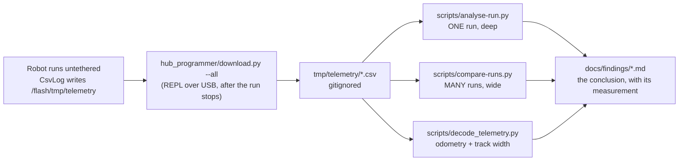

# Runbook — Analysing a run

> **Status: EXECUTED 2026-09-08.** Every number quoted below was printed by the tools described here,
> from the real logs in `tmp/telemetry/`. Nothing in this file is a worked-out example of what the
> output *would* look like. **Host-only — no step touches the hub.**

**When to run this:** after any untethered run, before you change the program that produced it. It
replaces the ad-hoc `awk` and inline python each run used to get picked apart with.

**Who:** Programmer. The Builder operates the robot and does the downloading step's plug/unplug;
everything after the download is a laptop job with the hub disconnected.

---

## 1. The pipeline



The scripts' scrollback is **never** the deliverable. What survives is a `docs/findings/` entry that
records the measurement as well as the conclusion.

## 2. Download, then analyse

```bash
# Builder: run stops, robot is plugged back into USB. Programmer, at the laptop:
python3 hub_programmer/download.py --list
python3 hub_programmer/download.py --all

./scripts/analyse-run.py                 # the newest RUN (see the warning below)
./scripts/analyse-run.py tmp/telemetry/<file>.csv
./scripts/analyse-run.py --trace         # ... plus every row as a table
./scripts/compare-runs.py followtape     # this program's runs, side by side
```

> ### ⚠ The newest FILE is usually not the newest RUN
>
> `download.py --all` re-fetches **every** log the hub still holds, so one run lands on the host
> under a fresh filename on every download. **Counted 2026-09-08: 44 CSVs on disk were 15 distinct
> runs** — 29 files were re-downloads. The leading `20260908T112501` is the *download* time; the
> trailing `-0000360435` is the hub-side stamp and is **the run's identity**.
>
> Both tools deduplicate on that stamp. `analyse-run.py` with no argument picks the run that first
> appeared most recently — not the file that sorts last — and prints `chosen because:` so you can
> see which rule picked it. It also lists the other copies of the same run when they exist.

## 3. What `analyse-run.py` reports, and what good and bad look like

Sections print **even when they have nothing** — a section that vanishes reads as "checked and
fine", which is how a silent gap becomes a false pass.

### 1. VERDICT — the program's own `#end` line, in plain words

| Reason | Means |
|---|---|
| `TAPE_DETECTED` | the blue-fraction rule tripped; the robot stopped **on** the boundary |
| `TAPE_ENDED` | the tape being followed ran out under both sensors |
| `NOTE_FOUND` | the brightness rule tripped; a mine was detected while moving |
| `complete` | the program ran its whole planned sequence |
| `time_cap` / `distance_cap` | a hard cap expired before anything was detected |
| `STOP_button` | a human aborted |

**Bad:** *no* `#end` line at all. The program did not close its log — it crashed, the battery cut, or
the download truncated the file. The rows are still real but the run's own summary is gone.
**Also checked:** `rows=` against the rows actually present, and the program's `mm=` against a
recomputation at the MEASURED 63.5 mm wheel. A mismatch means an incomplete file.

### 2. MOTION

| Metric | What it is | Good | Bad |
|---|---|---|---|
| tick rate (moving) | loop rate over the driving rows only — the trailing `stopped` rows sleep on a different interval and would drag the figure down | **17 Hz** on `drive_to_tape` / `find_note`; 20 Hz has been measured | worst interval > 2.5× the median is flagged: the loop stalled |
| net forward | mean of both wheels, sign-corrected by the measured mirror (forward = `A:-v`, `B:+v`), `deg/360 × 199.49 mm` | matches the `#end mm=` | a **negative** net on a program meant to drive forward is called out explicitly — the robot drove backward |
| L-R divergence | `abs(left − right)` as a % of mean travel — **the straightness metric** | **< 3 %** (measured 0.4 % on `drivetape`) | > 10 % = slipping, dragging, or one wheel loaded. Suppressed on a run that turns, where the wheels differ by design |
| ground speed | from **encoder deltas**, whose unit is measured — not from `velL/velR`, whose unit is not (see HEALTH) | ~55 mm/s at the 100 dps command | — |
| heading / yaw wander | net turn and `max − min` of the **unwrapped** heading (yaw wraps at ±180°) | **< 3° wander** on a straight run | large wander with a near-zero net = it weaved and came back |
| coast after stop | distance covered in the trailing `stopped` rows, motors already cut. **This is the stopping margin the boundary needs.** | **1.7–5.3 mm** measured | only the *final* stop block counts; an interleaved mid-run pause is not a coast |

### 3. PHASE TIMELINE

Every `phase` transition with its `seq`, timestamp, forward mm and heading change. The heading is
unwrapped **across the whole segment**, not endpoint-to-endpoint — a segment that turns more than
180° is invisible to a two-point difference.

Per-segment gyro-vs-encoder fusion and **measuring track width from a spin** belong to
[`scripts/decode_telemetry.py`](../../scripts/decode_telemetry.py), which runs the real `src/`
kinematics. Run that one on a square-drive log; run `analyse-run.py` on a mission log.

### 4. SENSORS — the section that earns the tool

Per port (**C = RIGHT, D = LEFT**, [port-map](../hardware/port-map.md)): reflectance and
blue/red-fraction summaries, the [measured band](../findings/colour-survey-and-first-detection-2026-09-08.md)
each median and peak falls in, and then, for every rule the hub programs apply:

**whether it crossed, its peak, and the signed margin — including when it never crossed.**

That last part is the point. A run that peaked at 0.408 against a 0.44 threshold is a completely
different fact from one that never came close, and until this tool existed that number was buried in
the CSV.

Fractions are discarded, not computed, when `r+g+b < 30` or any channel ≥ 1000 — both ends destroy
colour information, and the count discarded is printed rather than hidden. **On the 2026-09-03
fusion capture this removed 144 phantom tape detections** produced by rows reading `r=1,g=0,b=0`.

### 5. EVENTS

Phase changes, first threshold crossings, and motor status changes in one time-ordered list, capped
at 40 (past that it is a sensor flapping, not a timeline).

### 6. HEALTH — read this before quoting any number above

- **unreadable cells** per column. A blank is a *failed read*, never a zero, and nothing above counts
  one as data.
- **saturation** per port (any channel ≥ 1000). A pinned sensor reads 98–99 reflection on *anything*,
  so a mine crossing on a saturated row is flagged as not-evidence.
- **motor status** values seen, named from the measured constants (`0 READY`, `1 RUNNING`,
  `2 STALLED`, `5 DISCONNECTED`). `STALLED` or `DISCONNECTED` mid-run is called out.
- **`velL` vs the encoders.** `docs/findings/hub-api-surface-2026-09-01.md` records
  `motor.velocity()` as deg/s. On every mission log it is **≈ 12× smaller** than the rate the
  encoders show. The tool reports the ratio and says the unit is **UNRESOLVED**; it does not guess
  one, and it derives every speed from the encoders instead.
- the per-row `reason` column is **empty on every log** — the programs write a reason only into
  `#end`. Reserved, not lost.

### 7. TRACE

One sparkline per signal, scaled to its own min..max, with the range printed. Terminal only —
documents get mermaid, never ASCII art.

## 4. Worked example — a good run

`tmp/telemetry/20260908T103023-drivetape-0000077369.csv`, the first detection while moving:

```
  #end reason=TAPE_DETECTED rows=53 deg=281 mm=155
  reason 'TAPE_DETECTED': the blue-fraction rule tripped — the robot stopped ON the boundary tape
  rows claimed vs found       : 53 vs 53   consistent
  tick rate (moving) : 17.2 Hz   interval median 53 ms, min 53, max 112
    loop held its cadence (worst interval 2.1x median).
  net forward        :   +156.0 mm
  L-R divergence     :      1.0 deg = 0.4% of mean travel  <- the straightness metric
    tracked straight (divergence under 3%).
  heading            : start 85.8 deg, end 86.1 deg, net +0.3 deg
  yaw wander         : 2.7 deg (max-min of the unwrapped heading)
     BLUE TAPE (blue fraction)   CROSSED. Threshold 0.440, peak 0.488 — cleared by 0.048.
                   first crossing at seq 48, t=2788 ms, value 0.472; 5 of 53 samples on the trip side.
```

Everything a good run should be: the verdict is a detection, the file is complete, the loop held
17 Hz, the wheels agree to 0.4 %, the heading held to 2.7°, and the rule cleared by 0.048.

## 5. Worked example — the near-miss that was invisible

`tmp/telemetry/20260908T112501-followtape-0000360435.csv` ended `TAPE_ENDED`, which reads like the
tape simply ran out. It did not:

```
     BLUE TAPE (blue fraction)   NEVER CROSSED. Threshold 0.440, peak 0.408 — SHORT BY 0.032.
     BLUE TAPE (blue fraction)   NEVER CROSSED. Threshold 0.440, peak 0.359 — SHORT BY 0.081.   (port D)
```

**Neither sensor ever saw the tape.** The run drove 116 mm dead straight (1.0 % divergence, 1.3° of
wander) across carpet and stopped because nothing was ever there. `corrections=0` in the `#end` line
says the same thing from the other side. The peak of 0.408 is also exactly the carpet's measured
ceiling — so this is carpet, not faint tape, and the fix is placement or geometry, not the threshold.

The same section on the run that *did* work reads `CROSSED … cleared by 0.048`. That contrast is the
whole reason the crossing report prints a margin in both directions.

## 6. Worked example — comparing runs

```
program       hub stamp    rows     Hz   fwd mm   L-R%   wander  pk refl  pk blue verdict
followtape    0000360435     44  14.9     +116    1.0      1.3        7    0.408  TAPE_ENDED
followtape    0000102164    670  16.6    +1489   86.0   1094.2        9    0.517+ time_cap
```

`+` marks a peak that cleared its rule. Two runs of the same program, and every column tells a
different story: the second saw the tape (0.517), ran 15× longer, and turned **1094°**. Its phase
table shows why — each `follow` segment turned −221° to −306°, so it was circling, not tracing an
edge. A dash in any column is data the log does not carry, never a zero.

## 7. Where the tools live

| File | What it is |
|---|---|
| [`scripts/analyse-run.py`](../../scripts/analyse-run.py) | one run, deep. `[FILE] [--trace]` |
| [`scripts/compare-runs.py`](../../scripts/compare-runs.py) | many runs, wide. `[PREFIX]` |
| [`scripts/runlog.py`](../../scripts/runlog.py) | the shared decoder, threshold table and statistics. **Imported, never run** — it exits non-zero if you run it |
| [`scripts/decode_telemetry.py`](../../scripts/decode_telemetry.py) | the odometry view: gyro-vs-encoder agreement, square-drive segments, track width from a spin |

Standard library only, Python 3.10, no numpy. All four open files and nothing else.

**The thresholds are transcribed, not imported.** `runlog.RULES` carries the mine rule (`≥ 30`) and
the tape rule (`≥ 0.44`) copied from `examples/find_note.py` and `examples/drive_to_tape.py`, which
are hub programs and cannot import host code. They agree today and nothing enforces it: **if a hub
program's threshold changes, change `runlog.py` too**, or these tools will report crossings the robot
did not make.

## Related

- [../findings/colour-survey-and-first-detection-2026-09-08.md](../findings/colour-survey-and-first-detection-2026-09-08.md)
  — where every band, threshold and saturation limit above was measured.
- [../hardware/port-map.md](../hardware/port-map.md) — C = RIGHT, D = LEFT, and the mirror sign.
- [deploy-to-hub.md](./deploy-to-hub.md) — getting the program onto the hub in the first place.
- [../directives/automation-first.md](../directives/automation-first.md) — why this is a script and
  not a re-typed pipeline.
