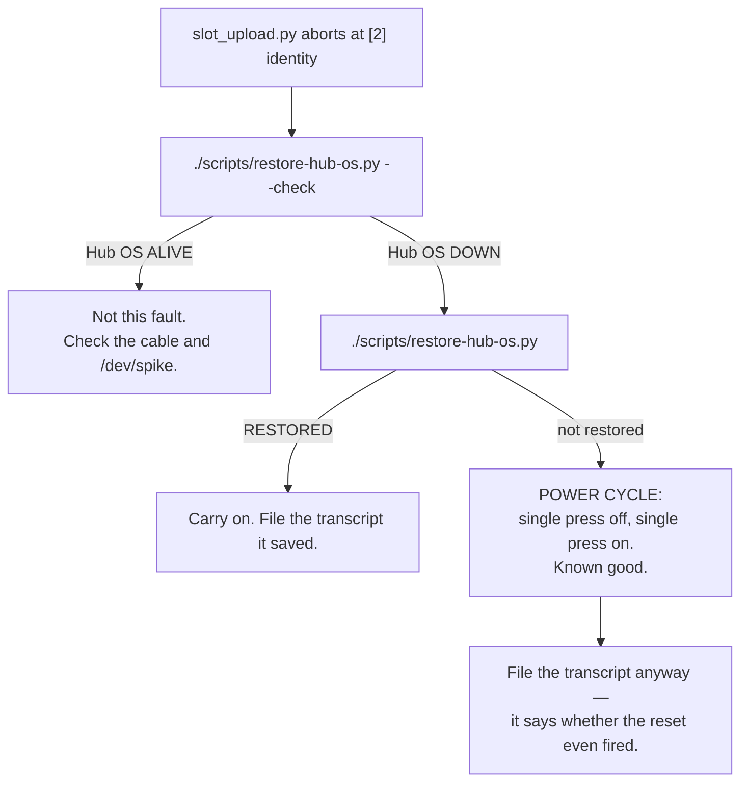

# Runbook — start a run, stop a run, and get the Hub OS back

> **Who:** **Builder** operates the robot and presses every button on it. **Programmer** may plug and
> unplug the cable and drives the laptop. Nobody else touches the hub.
>
> **Status:** the deploy and arm steps are **PROVEN** (untethered runs on battery, 2026-09-03 and
> 2026-09-08). ⚠ **Every hub *button* behaviour in § 1 and § 3 is [UNVERIFIED] on our hub** — the
> sources are LEGO's and the community's, not our own transcript. § 6 closes them in three minutes.
> Referenced from [`examples/competition_start.py`](../../examples/competition_start.py).
> Background: [../findings/stopping-and-restarting-the-hub-2026-09-08.md](../findings/stopping-and-restarting-the-hub-2026-09-08.md)

## 1. Which button does what — memorise this

| Button | Single press | Hold |
|---|---|---|
| **CENTER** (the big round one, `button.POWER`) | At the menu: **launches the selected slot.** While a program runs: **STOPS it** and returns toward the menu. This is the emergency stop of record | ~3 s **restarts** the hub · longer **powers it off**. A hold costs you the run — nothing worse |
| **LEFT / RIGHT** | The **program's** own input. Our programs arm on it and abort on it. **HOLD it until the robot stops** — a tap can fall between two polls and be silently lost | nothing special |
| **CONNECT** (Bluetooth) | On a running hub: advertises. **Normal and safe** | ⛔ **NEVER hold it while USB is being plugged in.** That gesture is how you enter DFU. Any three-colour LED cycle: stop and unplug |

**A program cannot use CENTER as its own input** — the firmware owns it while a program runs. That is
why the arm and abort gesture is LEFT/RIGHT, and it is not a style choice.

## 2. Start a run

```
./hub_programmer/slot_upload.py examples/<program>.py --apply
```

If the program imports `src/` modules that are not already on the hub, use
[deploy-with-deps.md](./deploy-with-deps.md) instead — and read its § "the Hub OS goes down mid-deploy"
note first.

1. **Programmer** — run the command. Expect **`S`** on the matrix when the program starts.
2. **Programmer** — **unplug the USB cable.** From here the robot runs on battery, and no host tool can
   reach it.
3. **Builder** — place the robot, stand clear.
4. **Builder** — **tap LEFT or RIGHT once.** A countdown flashes, then the run starts.
5. **Programmer** — replug USB only once the robot has stopped.

**If the laptop is packed away**, the start is the two-stage button gesture: navigate to the slot,
**single-press CENTER** to launch, then tap LEFT/RIGHT when `S` shows. ⚠ **[UNVERIFIED] — every proven
untethered run so far was started over USB by step 1 and only then unplugged.** Confirm it on a dry run
before relying on it (this is also Demo Day action **A2 RESTART**).

## 3. Stop a run

**In this order:**

1. **HOLD LEFT or RIGHT** until the robot stops. Our own abort path: motors are cut in a `finally`, the
   log is closed, and the end glyph tells you it was an operator stop. **Hold, do not tap.**
2. **CENTER, one crisp press.** The firmware's stop. It does not depend on our loop still being
   healthy. **Never a hold.**
3. **Pick the robot up.** If it is heading for a person, another team's equipment, or the edge of a
   table, the run is already lost — lift it. ("Never grab a moving robot" is about *run integrity*; it
   is not a safety rule and it does not outrank a person.)

**You have more time than it feels like.** The robot drives at **~55 mm/s** and coasts **~3 mm** after
a stop command (both MEASURED). Even the 40 s circling run on 2026-09-08 stayed inside ~2.2 m of arc.
**A walking operator outruns it.** Do not panic-press.

**With the cable in** (bench and dry runs only — never during the demo, the cable is out):

```
./scripts/stop-program.py            # stop slot 0, then sweep the rest
```

⚠ **[UNVERIFIED — never run against our hub.]** It proves the hub's identity first, then sends
`ProgramFlowRequest 0x1E` action Stop. It **cannot stop slot 7** (that frame carries a control byte and
is refused) and it needs the port free — a `--listen` session holds it. **Until it has been run once
deliberately, the CENTER button remains the stop of record.**

## 4. Recover the Hub OS without the power button

**Symptom:** `slot_upload.py` aborts at `[2] identity` — "no DeviceUuidResponse". **Cause:** something
sent Ctrl-C. `hub_programmer/download.py`, `hub_programmer/run.py`, `hub_programmer/upload.py`,
`scripts/identify_hub.py` and everything in `probes/` all do, by design: Ctrl-C is how you get a
MicroPython prompt, and the program it interrupts **is** the Hub OS.



`restore-hub-os.py` checks non-destructively first (it will not kill a healthy Hub OS to "restore" it),
takes two **read-only** diagnostics at the prompt, sends Ctrl-D, and **captures ~5 s of what the REPL
says** into `docs/findings/runs/`. `MPY: soft reboot` in that capture proves the reset fired.
⚠ **[UNVERIFIED] — the restore has never brought the Hub OS back on our hub.** Expect to power-cycle.

**The power cycle:** single press to power off, single press to power on. **Single presses only.**
Never press-and-hold CONNECT while USB is plugged in.

## 5. Do not earn the power cycle in the first place

| Habit | Why |
|---|---|
| **Batch the retrieves.** Run every attempt, then **one** `download.py --all` at the end | Each retrieve kills the Hub OS. On 2026-09-08 the telemetry was pulled in ~20 separate batches — that is ~20 power cycles that one batch would have cost once |
| **When only the slot program changed, run `slot_upload.py` alone** | `/flash/lib` persists across boots, so the dependency uploads (which send Ctrl-C) are not needed again |
| **Do REPL work in one block, then power-cycle once, then do all slot uploads** | Never interleave the two — the second one always loses |
| `./scripts/scan-surface.py` needs no power cycle | It already runs through the slot + console path and sends no Ctrl-C |

## 6. Close the UNVERIFIED buttons — three minutes, wheels off the floor

Do this on the next dry run and write the results into § 1 and § 3, and into
[demo-day.md](./demo-day.md) § 6.

1. Upload a short driving program to a slot **without** starting it, then unplug USB.
2. Navigate to the slot and **single-press CENTER**. → Does it launch? *(closes Demo Day **A2**)*
3. Mid-run, **single-press CENTER** again. → Do the motors stop? Does the matrix return to the menu?
   *(closes **A1**)*
4. Replug, download the log, look for the `#end reason=` trailer. → **Present** means the firmware stop
   ran our `finally`; **absent** means the VM was killed dead and buffered telemetry is lost on a
   CENTER stop.
5. Repeat with a deliberately hung loop (`while True: pass` with the motors commanded). → Does CENTER
   still stop it? That is the difference between "guaranteed emergency stop" and "usually works".
6. Time the **hold** that powers the hub off, and write the number into demo-day.md **A4**.

File the transcript under [../findings/runs/](../findings/runs/).
