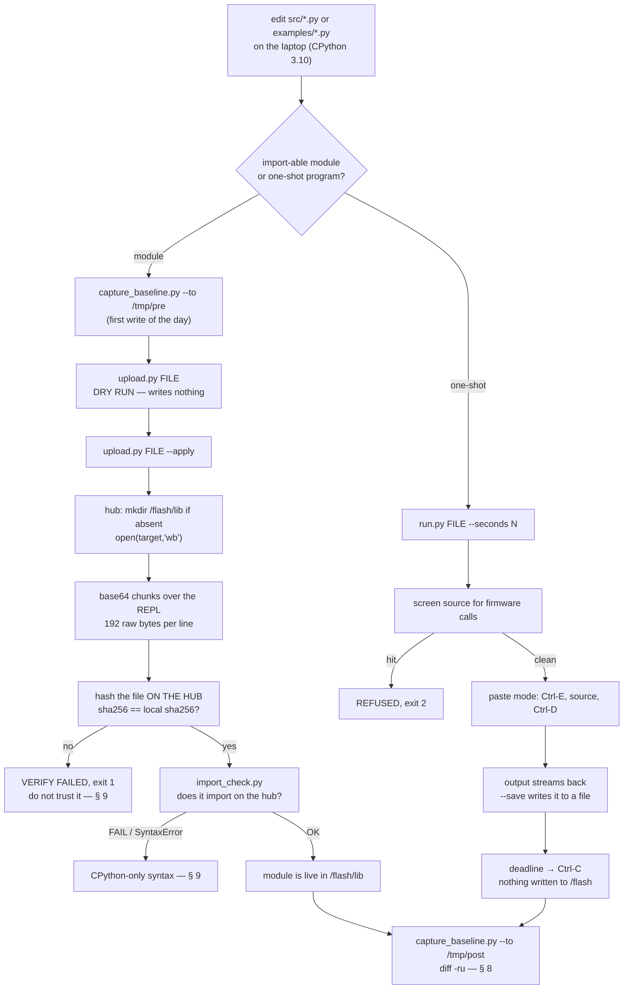

# Runbook — Deploy code to the hub over USB (no LEGO app)

> **Status: PROVEN on our hardware, 2026-08-27.** Every command below was run against our own SPIKE
> Prime Technic Large Hub 45601 over USB on `/dev/spike`, and the numbers quoted are the hub's own
> words or arithmetic on them. This is not a proposal. Where something was *not* run, it is marked
> **[UNVERIFIED]**; where it is reasoning rather than observation, **[INFERRED]**.
>
> **No LEGO application was opened at any point.** No DFU, no bootloader, no `machine.reset`, no
> `vfs.mkfs`, no update prompt accepted. The firmware was proved untouched afterwards by re-capturing
> the baseline and diffing it (§ 8).
>
> Governing rules: [../directives/hardware-safety.md](../directives/hardware-safety.md) ·
> [../directives/honest-instrumentation.md](../directives/honest-instrumentation.md) ·
> [../decisions/0001-stock-lego-firmware-only.md](../decisions/0001-stock-lego-firmware-only.md)
> First contact and identity: [../findings/hub-first-contact-2026-08-27.md](../findings/hub-first-contact-2026-08-27.md)
> Read-only identification comes first: [hub-identification.md](./hub-identification.md)

**The one-line answer.** The hub runs stock MicroPython with an interactive REPL on the USB serial
port and a writable FAT filesystem at `/flash`, and `/flash/lib` is already on `sys.path`. So code
gets onto the hub by typing it in at the REPL — base64 chunks for a file, paste mode for a program.
No LEGO app, no `mpy-cross`, no GCC, no Windows, no slot protocol, no pip.

---

## 0. The distinction this whole runbook rests on

**Firmware ≠ `/flash`.**

- The **firmware** is the MicroPython binary in the STM32F413's internal program flash. Changing it
  requires DFU or the bootloader. That is blacklisted ([ADR-0001](../decisions/0001-stock-lego-firmware-only.md)).
- **`/flash`** is the FAT filesystem that the firmware *exposes* to Python. Writing a `.py` file
  there is saving a document. It cannot and does not modify the firmware image.

Everything below writes only into `/flash`. § 8 is how you prove that to a sceptic — including
yourself in three weeks when you are writing the Intro Report.

### FORBIDDEN in this procedure

| Forbidden | Why |
|---|---|
| Accepting **any** "Hub update required" prompt | A Hub OS change is an operator decision recorded as an ADR, never a side effect. **STOP and ask.** |
| Opening the LEGO SPIKE App or the SPIKE Web App | Not needed for any step here, seizes the serial port, and is the likeliest source of an update prompt |
| DFU, bootloader, `machine.reset`, `machine.bootloader`, `vfs.mkfs`, factory reset | One-way doors on shared course equipment |
| Overwriting `/flash/boot.py`, `/flash/README.txt`, `/flash/pybcdc.inf` | Stock board files. `upload.py` refuses; there is no flag (§ 7) |
| Writing into `/flash/program` or `/flash/config` | `upload.py` refuses (§ 7) |
| `screen`, `cat /dev/spike`, or any blocking serial read **from an agent tool call** | Hangs the session. Every hub-touching step here is a script with a deadline — [../directives/automation-first.md](../directives/automation-first.md) |
| Re-capturing the baseline *over* `docs/archives/hub-baseline/` | Destroys the reference the diff is measured against. Capture elsewhere, always |

---

## 1. Prerequisites

Run these once per machine, then once per session.

| # | Check | Command | What you should see |
|---|---|---|---|
| 1 | Host prep applied | `./scripts/setup-host.sh` | `dialout` membership, `pyserial` present, udev rule written, ModemManager stopped |
| 2 | ModemManager not running | `systemctl is-active ModemManager` | `inactive` |
| 3 | The hub is enumerated | `ls -l /dev/spike` | a symlink to `ttyACM*` |
| 4 | Nothing else holds the port | `fuser -v /dev/spike` | no output |

**On (1).** `scripts/setup-host.sh` writes `/etc/udev/rules.d/99-lego-spike.rules`, which matches
`idVendor` `0694` / `idProduct` `0009`, sets `GROUP="dialout"`, adds `ENV{ID_MM_DEVICE_IGNORE}="1"`,
and creates the `SYMLINK+="spike"`. The VID:PID pair in that rule came from
[../research/spike-prime-linux-toolchain.md](../research/spike-prime-linux-toolchain.md) and we have
**not** transcribed a matching `lsusb` line into the repo — so treat the *numbers* as
**[UNVERIFIED]**. What **is** measured: `/dev/spike` existed and every probe on 2026-08-27 talked
through it (see the header line `# port /dev/spike @ 115200 8N1` in
[../archives/hub-baseline/04-filesystem.txt](../archives/hub-baseline/04-filesystem.txt)).

**On (2).** ModemManager probes any new `/dev/ttyACM*` with AT commands and corrupts a MicroPython
REPL session. On this host `mmcli -L` reported `No modems were found` — it had **not** grabbed the
device — but the mitigation was applied anyway and it is now stopped and disabled.
See [../findings/host-environment.md](../findings/host-environment.md).

**On (3).** If `/dev/spike` is missing, both tools fall back to `/dev/ttyACM0` on their own
(`probes/_hubio.py:find_port()`). If neither exists, the hub is not enumerated: cable, power, then
§ 9.

**Port settings, measured:** 115200 baud, 8N1. Confirmed working 2026-08-27.

---

## 2. Which tool — `upload.py` or `run.py`?

Two scripts in `hub_programmer/`. They are not variants of each other; they do different things.

| | `hub_programmer/upload.py` | `hub_programmer/run.py` |
|---|---|---|
| What it does | **Writes a file** into `/flash/lib` | **Executes source now**, in RAM |
| Mechanism | base64 chunks over the REPL, decoded on the hub with `binascii` | MicroPython **paste mode** (Ctrl-E … Ctrl-D) |
| Leaves behind | a file on the hub filesystem | **nothing** |
| Verified how | SHA-256 computed **on the hub** vs the local file | you read the program's output as it streams back |
| Use it for | `src/` modules the mission code imports — `config`, `detector`, `sweep`, … | `examples/` and one-off experiments — `imu_verbose.py`, `gyro_drift.py` |
| Deadline | per-command serial timeouts | a hard `--seconds` deadline; Ctrl-C on expiry |

**The rule of thumb.** If it is something the robot will `import`, upload it. If it is something you
want to *watch happen once*, run it. An experiment that turns out to be wrong must not become litter
on shared course equipment — that is the whole reason `run.py` exists.



---

## 3. Step 1 — capture a baseline *before* the first write

Do this before the first write of a session. It costs one command and it is the only thing that lets
you prove later what did and did not change.

```bash
python3 probes/capture_baseline.py --to /tmp/pre-$(date +%Y%m%dT%H%M)
```

The pristine, before-anything-was-ever-written capture already lives in
[../archives/hub-baseline/](../archives/hub-baseline/) and its
[INDEX.md](../archives/hub-baseline/INDEX.md) explains each of the six files. **Never re-capture over
it.** Always `--to` somewhere else and diff.

Read-only. Exit codes: `0` captured · `2` no prompt · `3` no port · `4` busy · `5` no pyserial.

---

## 4. Step 2 — upload a module

**Dry run first. `upload.py` writes nothing without `--apply`.**

```bash
./hub_programmer/upload.py src/config.py
./hub_programmer/upload.py src/config.py --apply
```

With no `--to`, the target is `/flash/lib/<basename>`. To place it elsewhere inside `/flash`:

```bash
./hub_programmer/upload.py src/config.py --apply --to /flash/lib/config.py
```

**What actually happened, 2026-08-27** (`src/config.py`, 13262 bytes):

- `/flash/lib` **did not exist** and was created by the script. It was already on `sys.path`
  (`['', '.frozen', '/flash', '/flash/lib']`) — so nothing had to be added to the path.
- 13262 bytes went across as **70 base64 chunks in 3.6 seconds**. (70 = `ceil(13262 / 192)`;
  `CHUNK = 192` raw bytes per REPL line is set in the script's source, and base64 expands it ~4/3.)
- On-hub SHA-256 came back equal to the local file's:
  `05a3efefd08b3c9987947baeefc517548201723ca81747c8f9d5d012ca17828a`.

Exit codes: `0` ok · `1` verify failed · `2` refused · `3` no port / no prompt · `4` busy ·
`5` no pyserial · `64` usage.

> **Note on the script's own docstring.** The usage lines inside `hub_programmer/upload.py` still say
> `./scripts/hub_upload.py` — a stale path from before the file moved. The working invocation is
> `./hub_programmer/upload.py`, which is what was run.

### Why it hashes the file *on the hub*

Because "no exception was raised" is not evidence that the right bytes are on the device.

The write path is a chain of things that can silently truncate or mangle: a serial line at 115200
with no flow control, a REPL that echoes, a base64 round-trip through `binascii` on the hub, a FAT
filesystem with 32.4 MB free that could in principle fill, and a chunk loop that could drop a line
the parser did not keep up with. Every one of those failures looks exactly like success from the
host side.

So after `_f.close()`, the script asks the hub to compute
`hashlib.sha256(open(target,'rb').read())` **itself** and prints the hex digest. The host compares
that against its own hash of the local file and reports `VERIFIED` only on a match. The verification
therefore travels the opposite direction through the same chain, and any corruption anywhere in it
changes the digest. This is the project's `say-which-kind-of-verified` rule applied to a write:
[../lessons_learned/say-which-kind-of-verified.md](../lessons_learned/say-which-kind-of-verified.md).

**A matching hash proves the bytes arrived. It does not prove the module works** — which is § 5.

---

## 5. Step 3 — import-check on the hub

MicroPython is a subset. Our pure modules are written on a laptop running CPython 3.10, where
f-strings, `dataclasses`, `enum` and `typing` all exist. On the hub they may not.

```bash
python3 probes/import_check.py                    # all the pure modules
python3 probes/import_check.py config detector    # just these
```

It lists `/flash/lib`, imports each requested module inside a `try`/`except`, prints `OK <name>` or
`FAIL <name> <ErrorType> <message>`, then reports `gc.mem_free()`.

**Measured 2026-08-27:** `OK config`, and **210528 bytes** free after the import.

Exit codes: `0` all imported · `1` at least one failed · `2` no prompt · `3` no port.

A `SyntaxError` here almost always means CPython-only syntax — see § 9.

---

## 6. Step 4 — run a program in RAM

```bash
./hub_programmer/run.py examples/imu_verbose.py
./hub_programmer/run.py examples/gyro_drift.py --seconds 30
./hub_programmer/run.py examples/imu_verbose.py --save docs/findings/runs/imu-2026-09-03.txt
```

- **Nothing is written to `/flash`.** Paste mode (Ctrl-E, source, Ctrl-D) buffers the whole program
  and executes it from RAM as one unit — which is also why indented multi-line code works here and
  does not at the plain REPL.
- **There is always a deadline.** Default 20 s, override with `--seconds`. On expiry the script sends
  Ctrl-C to interrupt the program on the hub, so an infinite loop cannot hang the host process or the
  session that launched it. The port is closed in a `finally:` block either way.
- `--save` writes the program's output to a file, stripping the `=== ` lines that paste mode echoes
  back — those are your own source, and burying results under them makes the artifact useless. The
  source itself is in git.

Exit codes: `0` ran · `1` the program raised on the hub · `2` refused · `3` no port / no prompt ·
`4` busy · `5` no pyserial · `64` usage.

Saved run outputs belong in [../findings/runs/](../findings/runs/).

---

## 7. The refusals — what these tools will not do

These are enforced in code, not in prose. Read them as part of the safety case.

| Refusal | Where | Escape hatch |
|---|---|---|
| `/flash/boot.py`, `/flash/README.txt`, `/flash/pybcdc.inf` are **never** overwritten | `upload.py` `STOCK` | **None. There is no flag.** |
| `/flash/main.py` needs `--force` | `upload.py` `GUARDED` | `--force`, and only deliberately — it is what the hub runs on boot, and the pristine copy is in [../archives/hub-baseline/05-stock-files.txt](../archives/hub-baseline/05-stock-files.txt) |
| `/flash/program` and `/flash/config` are never written into | `upload.py` `FORBIDDEN_DIRS` | None |
| Anything outside `/flash` is refused | `upload.py` `check_target()` | None |
| Nothing at all is written without `--apply` | `upload.py` | `--apply` |
| `run.py` refuses source containing a firmware or filesystem call — `machine.bootloader`, `machine.reset`, `machine.soft_reset`, `vfs.mkfs`, `os.remove`, `os.rmdir`, `os.rename`, `hub_os_enable`, or an `open()` of `/flash/boot*` or `/flash/main*` | `run.py` `FORBIDDEN` | None. A typo in an experiment must not be able to reach `machine.bootloader()`. |

A refusal exits `2` and changes nothing. **If a tool refuses, that is the tool working**
([../lessons_learned/a-tool-works-when-it-does-its-job.md](../lessons_learned/a-tool-works-when-it-does-its-job.md)).
Do not work around it; ask the operator.

### List and remove

```bash
./hub_programmer/upload.py --list
./hub_programmer/upload.py --remove /flash/lib/config.py            # DRY RUN
./hub_programmer/upload.py --remove /flash/lib/config.py --apply
```

`--list` prints `/flash`, `/flash/lib`, `/flash/program`, and free bytes. `--remove` goes through the
same `check_target()` refusals (so it cannot delete a stock file), and afterwards re-lists the parent
directory and prints `still present: False` — again, confirmation from the hub rather than an assumed
success. It exits `1` if the file is still there.

---

## 8. Prove the firmware is untouched

After a write session, re-capture and diff against the pristine baseline.

```bash
python3 probes/capture_baseline.py --to /tmp/post
diff -ru docs/archives/hub-baseline /tmp/post
```

**The complete diff after uploading `src/config.py` on 2026-08-27 was:**

```
- ['README.txt','boot.py','config','main.py','program','pybcdc.inf']
+ ['README.txt','boot.py','config','lib','main.py','program','pybcdc.inf']
- [('README.txt',528),('boot.py',196),('config',196),('main.py',34),('program',34),('pybcdc.inf',2597)]
+ [('README.txt',528),('boot.py',196),('config',196),('lib',196),('main.py',34),('program',34),('pybcdc.inf',2597)]
- statvfs free blocks 7923
+ statvfs free blocks 7915
- battery 7942 mV,  temperature 247
+ battery 8001 mV,  temperature 251
```

Read it line by line:

| Hunk | Cause |
|---|---|
| `lib` appears in the `/flash` listing and the sizes table | the directory `upload.py` created |
| free blocks 7923 → 7915 | 8 blocks consumed. The block size is 4096 (`os.statvfs` field 0), so **32 KB** — the directory plus the 13262-byte file rounded up to whole blocks |
| battery 7942 → 8001 mV, temperature 247 → 251 | the hub is charging over USB. `06-runtime-state.txt` is volatile **by design**; a diff there means nothing on its own |

**Everything else was identical.** Every stock file byte-for-byte the same, the `help('modules')`
list unchanged, the API surface unchanged, the device identity unchanged.

That is the proof: a filesystem write is visible exactly where a filesystem write should be visible,
and nowhere else. **Any hunk you cannot place on this table is a real change and needs an
explanation** before you do anything else.

---

## 9. Troubleshooting

| Symptom | What it means | Do this |
|---|---|---|
| `BUSY_OR_DENIED: /dev/spike: ...` (exit `4`) | Something else holds the port. **A Chrome tab running the SPIKE web app holds WebSerial EXCLUSIVELY** — nothing else can open the port while that tab is alive. | `fuser -v /dev/spike` to see who. **Close the browser tab** (not just the page — the tab), or kill the other process. Then retry. Do not reconnect through the web app to "release" it; that risks an update prompt. |
| `UNKNOWN: no /dev/spike or /dev/ttyACM0` (exit `3`) | The hub is not enumerated at all. | Check the cable is a **data** cable, that the hub is powered on, and `ls /dev/ttyACM*`. If `ttyACM0` exists but `/dev/spike` does not, the udev rule did not fire — re-run `./scripts/setup-host.sh`. |
| `No '>>>' prompt. ... refusing to write.` (exit `3`) | The port opened but no REPL answered. A program may be running on the hub and eating the interrupt, or ModemManager may have the line mid-AT-probe. | `systemctl is-active ModemManager` → expect `inactive`. Then unplug and replug the hub and retry. Both tools send Ctrl-C before anything else; `_hubio` sends it twice, because a busy loop can eat the first. **Never** open `screen` to "have a look" — that is a blocking read. |
| Garbled or half-eaten replies | Classic ModemManager AT-command interference on a fresh `/dev/ttyACM*`. | Stop and disable it (`sudo systemctl disable --now ModemManager`), replug, retry. [../findings/host-environment.md](../findings/host-environment.md) |
| `import_check.py` reports `FAIL <mod> SyntaxError` | CPython-only syntax reached the hub. MicroPython 1.24.0 has no f-strings in some forms, no `dataclasses`, no `enum`, no `typing`. **The hash matched — the bytes are fine; the language is the problem.** | Rewrite that module to the MicroPython subset ([../directives/code-discipline.md](../directives/code-discipline.md)), re-upload, re-check. |
| `import_check.py` reports `FAIL <mod> ImportError` | The module imports something not on the hub, or a dependency has not been uploaded. `config` is imported by others — upload it first. | Upload the dependency, or drop the import. |
| `VERIFY FAILED: hub hash does not match local.` (exit `1`) | The bytes on the hub are **not** the bytes on disk. Truncation, a dropped chunk, or a full filesystem. | **Do not use that file.** Check free space (`./hub_programmer/upload.py --list`), remove the bad file (`--remove ... --apply`), and re-upload. If it fails twice in the same place, capture the transcript — that is a finding, not a retry. |
| `FAILED on chunk N: ... Traceback` | The hub raised mid-write. The script closes `_f` and stops. | Same as above: remove and re-upload. Note which chunk — a consistent chunk number is diagnostic. |
| `REFUSED: ...` (exit `2`) | You aimed at a stock file, `main.py` without `--force`, `/flash/program`, `/flash/config`, outside `/flash`, or ran source containing a firmware call. | Read § 7. **The tool is working.** Ask the operator rather than reaching for `--force`. |
| `NO_PYSERIAL` (exit `5`) | `pyserial` missing. | `sudo apt-get install -y python3-serial`, or re-run `./scripts/setup-host.sh`. |
| A `run.py` program never stops | It will. The deadline fires and Ctrl-C goes to the hub. | If you need longer, pass `--seconds`. Do not remove the deadline. |

---

## 10. What this runbook does **not** establish

Be precise about the boundary — half of the deploy story is proven and half is not.

- **Proven:** a module written into `/flash/lib` is verifiable by hash and **imports on the hub**
  (`OK config`, 210528 bytes free afterwards), and `/flash/lib` was already on `sys.path`.
- **[UNVERIFIED]:** whether `/flash/main.py` **autoruns at boot** under the Hub OS, and whether the
  Hub OS pre-empts it. Nothing here has tested standalone, untethered operation. Until that is run,
  a "program" on this hub means *source we push and execute over the cable*, not *something the hub
  starts by itself*.
- **[UNVERIFIED]:** the 20-slot program model described in
  [upload-to-hub.md](./upload-to-hub.md). Measured against it: `/flash/program` is **empty** and the
  working route is the one above. Do not build on the slot model without new evidence.
- **Not needed, confirmed:** `mpy-cross`. The hub runs MicroPython **source**. Pre-compiling is
  optional (`sys.implementation._mpy = 7942` gives the bytecode version if we ever want it). No GCC,
  no LEGO app, no Windows.

---

**Sources.** All hub numbers: measurements taken 2026-08-27 over USB on `/dev/spike`, recorded in
[../findings/hub-first-contact-2026-08-27.md](../findings/hub-first-contact-2026-08-27.md) and
[../archives/hub-baseline/](../archives/hub-baseline/). Script behaviour: the source of
`hub_programmer/upload.py`, `hub_programmer/run.py`, `probes/_hubio.py`,
`probes/capture_baseline.py`, `probes/import_check.py`, and `scripts/setup-host.sh`.
Background: [../research/spike-prime-linux-toolchain.md](../research/spike-prime-linux-toolchain.md).
