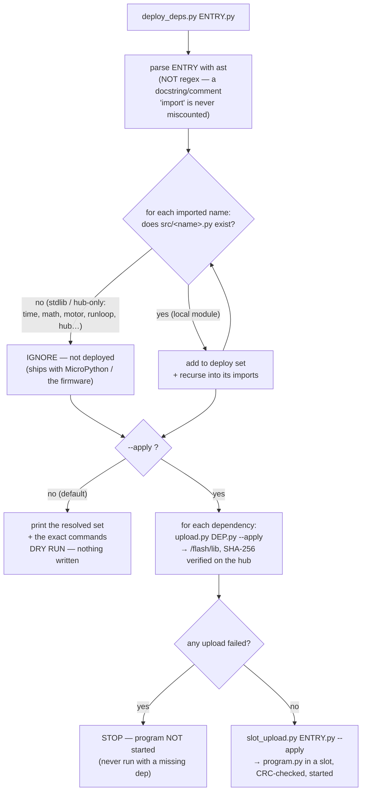

# Runbook — Deploy a slot program *with all its imports* in one command

> **Status: resolver PROVEN on the host, 2026-09-04. The hub-touching `--apply` path is [UNVERIFIED].**
> `hub_programmer/deploy_deps.py` resolves a program's transitive local imports with Python's `ast`
> module (host logic, no hardware) and was host-tested on `src/main.py` and `src/config.py`. The
> `--apply` half only *orchestrates* two existing tools — `upload.py` (PROVEN 2026-08-27) and
> `slot_upload.py` (still UNTESTED on our hub) — but that orchestration has **not** been run against
> our hardware. Run it over USB to make it MEASURED and file the transcript under
> [../findings/runs/](../findings/runs/).
>
> Governing tools: [deploy-to-hub.md](./deploy-to-hub.md) · [first-main-run.md](./first-main-run.md) ·
> [ADR-0007](../decisions/0007-deploy-by-writing-modules-to-flash-lib.md)

## The problem this solves

`src/main.py` (or any slot program) `import`s a dozen sibling `src/` modules. `slot_upload.py` uploads
**only the entry file** as `program.py`; to actually *run*, every module it imports must also be present
in `/flash/lib`. Deploying each dependency by hand was a standing chore
([first-main-run.md](./first-main-run.md) step 0 flagged it as a KU). `deploy_deps.py` does it in one
command: resolve → deploy each dependency → upload + start the entry.

## The command

```bash
./hub_programmer/deploy_deps.py src/main.py            # DRY RUN — prints the deploy plan, touches nothing
./hub_programmer/deploy_deps.py src/main.py --apply    # deploy every dep to /flash/lib, then upload+start the entry
```

Dry-run by default, exactly like `upload.py` and `slot_upload.py`. One flag, `--apply`, is the only thing
that touches the hub. The entry is positional.

## What it does



A **local dependency** is any imported name that resolves to a file `src/<name>.py`. Everything else —
stdlib (`time`, `math`, `os`) and hub-only names (`motor`, `color_sensor`, `runloop`, `hub`, …) — is not
deployed: it ships with MicroPython or is provided by the firmware. The rule is purely "does the file
exist", so there is no stdlib allowlist to maintain. The dry run prints the ignored names too, so you can
eyeball that nothing load-bearing was dropped. The resolver is cycle-safe (each file parsed once) and
reports an unreadable or syntax-broken module instead of crashing.

## Host-verified result for `src/main.py`

The dry run resolved **15** local dependency modules (order does not matter — all land in `/flash/lib`
before the program runs):

```
calibration  classify  config  detector  floor_anomaly  hub_api  hub_color  hub_imu
hub_motors   hub_runtime  hub_telemetry_log  hub_ui  odometry  result  sweep
```

`calibration` and `classify` are not imported by `main.py` directly — they come in transitively through
`floor_anomaly`, which is exactly why a hand-typed list is error-prone and this tool exists. Ignored as
stdlib/hub-only: `color_sensor, distance_sensor, hub, math, motor, os, runloop, spike, time`. A leaf
module resolves to nothing — `deploy_deps.py src/config.py` reports 0 dependencies.

## Manual fallback

If `deploy_deps.py` is unavailable or you want to deploy one module at a time, the underlying tools are
unchanged: `upload.py <module> --apply` per dependency (see [deploy-to-hub.md](./deploy-to-hub.md) § 4),
then `slot_upload.py <entry> --apply` for the entry. `deploy_deps.py` only automates that sequence; it
adds no new hub-touching code.

**Related:** [deploy-to-hub.md](./deploy-to-hub.md) · [first-main-run.md](./first-main-run.md) ·
[ADR-0007](../decisions/0007-deploy-by-writing-modules-to-flash-lib.md)
