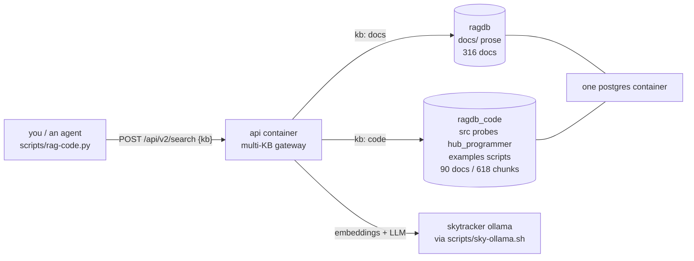

# Runbook — the code knowledge base (ask docs-rag about our own source)

> **Purpose.** Our source code is indexed as a **second knowledge base** inside the same docs-rag
> stack, so a question can be aimed at **code**, at **docs**, or at **both**, and the answer comes
> back as a `file:line` citation you open. It is the same idea as
> [docs-rag.md](./docs-rag.md) — that runbook covers the prose corpus and the stack itself; this one
> covers only the code half and assumes the stack is up.
>
> **Status: BUILT AND EXERCISED 2026-09-08.** 90 documents / 618 chunks in `ragdb_code`, every chunk
> carrying a symbol path; kb-scoped search and `/api/ask` both answered, and the citations were
> hand-checked against the bytes on disk (§ 5). Nothing here touches the hub.
>
> Governing rules: [../directives/knowledge-retrieval.md](../directives/knowledge-retrieval.md) ·
> [../directives/honest-instrumentation.md](../directives/honest-instrumentation.md) ·
> [../directives/automation-first.md](../directives/automation-first.md)

---

## 0. The 30-second version

```bash
./scripts/rag-code.py "how do we decide the sweep lane pitch"   # our code
./scripts/rag-code.py docs "how do we decide the sweep lane pitch"
./scripts/rag-code.py all  "how do we decide the sweep lane pitch"
```

Each hit prints as `path:start-end  [kb]  symbol  cos=…` with a one-line snippet. **The citation is
the product** — open the file at that line span. You do not normally have to re-index anything:
the api reconciles every configured KB on its own timer (§ 3).

---

## 1. What was added, and what was left alone



**One stack, one port, one postgres container, two logical databases.** No second instance was
deployed and no RAM budget changed beyond the extra rows.

| Piece | File | What it does |
|---|---|---|
| KB declaration | `docs-rag/config.yaml` — `kb_defaults` + `knowledge_bases` | Declares `primary` (the existing docs corpus, `ragdb`, `category: docs`) and `code` (`ragdb_code`, `category: code`, its own `ingest_dirs` / `extensions`). A non-empty `knowledge_bases` stanza is the **only** thing that activates `/api/v2/*`. |
| Making the api read it | `docs-rag/docker-compose.override.yml` | The stock single-KB consumer mounts **no** config file at all, which is why `/api/v2/*` used to answer *"multi-KB not configured"*. The override mounts `config.yaml` at `/src/config/config.yaml` **and** the five code directories at their own absolute paths, all `:ro`. Docker Compose auto-merges it — the vendored `docker-compose.yml` is never edited. |
| Chunking levers | `docs-rag/.env` — `RAG_CODE_AWARE_CHUNKING=true`, `RAG_CONTEXTUAL_PREPEND=true` | Cut source on function/class boundaries instead of fixed size, and embed each body together with its symbol header. Both are read **at ingest**, so they must be set before indexing. Both are inert for `.md`. |
| The query tool | `scripts/rag-code.py` | Wraps the `POST /api/v2/search` call and renders the citation line. One flag: `--sync`. |

**Unchanged:** `docs/` is still ingested exactly as before by the v1 flow
(`./scripts/check-docs.py --fix-rag` → `rag ingest`), `/api/v1/search` and an unscoped `/api/ask`
still answer from the docs corpus alone, and `ragdb` was verified at 316 documents before and after.

### What is in the code KB

`src/` · `probes/` · `hub_programmer/` · `examples/` · `scripts/` — **`.py` and `.sh` only**.
File-type isolation is per-KB, so a stray `.md` under those trees is skipped and stays the docs
corpus's job. Deliberately absent: `docs-rag/` (vendored), `.git/`, `tmp/`, `__pycache__/`, and
`find_spike_prime.py` (a lone file at the repo root — move it into `scripts/` if it should be
indexed). Adding a directory means editing **both** `ingest_dirs` in `config.yaml` **and** the
mount list in `docker-compose.override.yml`; they are kept equal by hand.

---

## 2. Query it

`scripts/rag-code.py` is the normal path. The raw call, for a script or an agent:

```bash
curl -s -X POST http://127.0.0.1:10060/api/v2/search \
  -H 'Content-Type: application/json' \
  -d '{"query":"normalize a heading delta that wraps at 180 degrees","kb":"code","limit":5}'
```

`kb` accepts `"code"`, `"docs"`, `"all"`, an explicit name (`"primary"`), or a list. The category
tokens are expanded server-side from each KB's `category:` tag, so a KB added later needs no client
change. An unknown name is a 404.

For a prose answer instead of citations, `/api/ask` takes the **same `kb` field**:

```bash
curl -s -X POST http://127.0.0.1:10060/api/ask -H 'Content-Type: application/json' \
  -d '{"question":"what guarantees a target cannot slip between two sweep lanes?","kb":"code"}'
```

**Expect ~70 s** and read the cited code rather than trusting the prose — retrieval is the reliable
half. (Measured here: 68.5 s warm, correct answer, five exact citations — § 5.)

### Which endpoint answers what

| Endpoint | Corpus | Scopable? |
|---|---|---|
| `/api/v1/search`, `/api/search` | `primary` (docs) only | **No** — v1 has no `kb` field |
| `/api/v2/search` | any KB | **Yes** — `kb` |
| `/api/ask`, `/api/ask/stream` | routed | **Yes** — `kb` |

`kb:"all"` returns a **global** top-N merged by cosine, not N-per-KB, so a small `limit` can show
only the corpus that owns the best hits. Scope to `"code"` when you specifically want code.

---

## 3. Keeping it fresh — usually nothing to do

The api's reconcile loop walks **every configured KB**, not just the docs corpus
(`app/reconcile_scheduler.py` `_do_reconcile`), on a content-hash pass that re-embeds only changed
files. Defaults on this instance: first pass **300 s** after the api starts, then every **300 s**.
So an edited `.py` is picked up within about five minutes with **no command run**, and an unchanged
tree costs zero embedding calls.

To force it now:

```bash
./scripts/rag-code.py --sync      # wraps: docs-rag/rag ingest-kb --kb code
```

It prints one JSON line — `{"kb": "code", "database": "ragdb_code", "ingested_this_run": N,
"documents": N, "chunks": N}`. Add `--rebuild` to the underlying `rag ingest-kb` call **only** when
the chunking config changed: a plain re-ingest skips unchanged files on content hash and would keep
the old chunks. `--rebuild` is destructive for `ragdb_code` alone and refuses to run against `ragdb`.

**Do not** point `rag ingest` (the v1 docs flow) at code, and do not remove the per-KB `extensions`
list — either one merges the two corpora back together.

---

## 4. When it breaks

| Symptom | What it means | Do this |
|---|---|---|
| `multi-KB not configured (no knowledge_bases stanza in config)` | The api is running **without** the config mount — the override file is missing, or the container predates it | `cd docs-rag && docker compose up -d api` (recreates api only, ~15 s) |
| api container will not start, log says `KB 'primary' has no resolvable password` | The `kb_defaults.password_env` stanza was removed from `config.yaml`. **This aborts startup — docs-rag does not come back.** | Restore `kb_defaults` (§ 1), then `docker compose up -d api` |
| Search returns hits with `symbol_path: null` | The file was chunked before `RAG_CODE_AWARE_CHUNKING` was set, or by a flag passed per-run rather than in `.env` | `docs-rag/rag ingest-kb --kb code --rebuild` |
| `no hits above the relevance floor` | Genuinely nothing over `RAG_MIN_SIMILARITY=0.6` | Rephrase toward what the code *does*, not what it is called |
| A stall of ~60 s on any request | A docs ingest job or a reconcile pass is running (observed 2026-09-08) | Wait and retry — it is not a fault |
| Everything is confusing | — | See [docs-rag.md § 6](./docs-rag.md#6-when-it-breaks); the stack is the same one |

### Rollback — one command

```bash
cd docs-rag && rm docker-compose.override.yml && ./rag up
```

That returns the stack to the exact single-KB configuration it had before: `/api/v2/*` goes back to
503, `/api/v1/search` and the docs corpus are untouched throughout. `ragdb_code` survives, inert, and
is picked up again the moment the override returns. The `.env` flags and the `config.yaml` stanza can
stay — with no config mounted, the container never reads them.

---

## 5. The proof — what was actually run, 2026-09-08

Not a claim: these are the commands whose output is quoted.

- **Multi-KB was inactive before.** `GET /api/v2/knowledge-bases` →
  `{"detail":"multi-KB not configured (no knowledge_bases stanza in config)"}`, and
  `GET /api/admin/validate-config` → `config unreadable: /src/config/config.yaml: No such file or
  directory`. That is the evidence for *why* the mount is the fix, rather than a guess.
- **The config was proved in a throwaway container first**, so a broken config could not take the
  running api down: `docker compose run --rm --no-deps api python <preflight>` replayed
  `_init_multi_kb_gateway`. Its **first run failed** — `ValueError: KB 'primary' has no resolvable
  password` — which is exactly the startup abort § 4 warns about, caught before it could happen for
  real. `kb_defaults.password_env: POSTGRES_PASSWORD` fixed it; the second run created `ragdb_code`
  and printed `REGISTRY OK`.
- **Ingest:** `{"kb": "code", "database": "ragdb_code", "rebuilt": false, "ingested_this_run": 90,
  "documents": 90, "chunks": 618}`.
- **Chunking landed:** `select count(*) filter (where metadata->>'symbol_path' is not null) from
  chunks` → **618 of 618**.
- **The docs corpus was untouched:** `/api/status` read `documents: 316, chunks: 5107` before the
  work and the same after, and a v1 search still cites
  `docs/research/ble-bring-up.md cosine=0.753`.
- **The api restart took 14 s** (11:41:11 → 11:41:25) and came back `"status":"healthy"` with
  `[{"name":"primary",…},{"name":"code",…}]`.
- **Citations are line-exact.** `kb:"code"` returned `src/odometry.py:54-59 normalize_angle
  cos=0.707`; lines 54–59 of that file are the `normalize_angle` definition. `src/mission_config.py:177-183
  lane_pitch_mm` likewise.
- **`/api/ask` with `kb:"code"`** answered in **68.5 s** and named `lane_pitch_mm()` with the right
  formula, citing `src/mission_config.py:177-183`, `src/sweep.py`, and `src/odometry.py:171-177`.

**Not verified here:** the reconcile loop had not yet ticked when this was written, so *automatic*
freshness of the code KB is **[INFERRED from the source]** (`_do_reconcile` iterates
`knowledge_bases` and skips only `primary`) rather than observed. Force a sync if it matters.
Retrieval *quality* numbers are upstream's on their own corpus, not ours —
`descriptive_penalty: 0.05` is carried as `[ASSUMED]`.

---

**Sources read:** `~/exudeai/rag-bootstrap` 0.8.3 — `docs/guides/codebase_as_kb.md`,
`docs/adding_code_kbs.md`, `app/main.py`, `app/api_v2.py`, `app/registry.py`,
`app/config_manager.py`, `app/code_chunk.py`, `app/reconcile_scheduler.py`, `scripts/ingest_kb.py`;
this instance's `docker-compose.yml`, `config.yaml`, `.env`, `scripts/lib/commands/ingest-kb.sh`.
