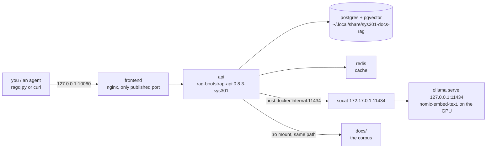

# Runbook — docs-rag (search this repo's own docs instead of re-reading them)

> **Purpose.** A project-local retrieval service over `docs/`. Ask it a question, get back the
> **file path and line span** that answers it, then open only that file. It replaces
> "`cat` a 1000-line markdown file to find one paragraph".
> **Status:** deployed and **verified working for search on 2026-08-25**, then **independently
> re-verified the same day** — `./rag down` + `./rag up` round-trip (index survived), `./rag status`
> / `doctor` / `health` / `ingest` / `diagnose` re-run, real queries with hand-checked citations
> reproduced in § 4, and the read-only corpus mount proven by a failed write from inside the api
> container. **`/api/ask` (LLM answer generation) does NOT work — it returns HTTP 500** — see § 6.
> Owner: whoever is doing the search. Nothing here touches the hub.
>
> Governing rules: [../directives/knowledge-retrieval.md](../directives/knowledge-retrieval.md) ·
> [../directives/honest-instrumentation.md](../directives/honest-instrumentation.md) ·
> [../directives/automation-first.md](../directives/automation-first.md)
> Tool: `rag-bootstrap` **0.8.3** at `~/exudeai/rag-bootstrap` (the TEMPLATE — never run the stack
> from there). Instance for this project: **`/home/devel/sys301_minesweeper/docs-rag/`**.

---

## 0. The 30-second version

```bash
cd ~/sys301_minesweeper/docs-rag
./ollama-serve.sh          # embedding backend — MUST be up first (dies on reboot)
./rag up                   # start the stack
RAG_ENDPOINT_URL=http://127.0.0.1:10060 python3 client/ragq.py "your question"
./rag down                 # stop it when you're done
```

If it answers with a `docs/...md` path, it works. If it returns nothing, go to § 6.

---

## 1. What is actually running



| Fact | Value | Why |
|---|---|---|
| Instance dir | `~/sys301_minesweeper/docs-rag/` | in this repo, so its config is version-controlled with the project |
| Published port | **`127.0.0.1:10060`** only | multiple of 20 and ≥ 10020 as the tool requires; band 10060–10079. Avoids the base stack's 10000–10019 **and** 10040, which the exudeai docs-rag instance owns. Localhost-bound — nothing is exposed to the network |
| Ollama port | `11434` on `127.0.0.1`, bridged to `172.17.0.1` by socat | the stock port; the bridge is what lets the *container* reach it (§ 3) |
| Corpus | `/home/devel/sys301_minesweeper/docs` mounted **read-only** | `DOCS_PATH` in `.env`. The RAG can never write to our docs |
| Index data | `~/.local/share/sys301-docs-rag/` (**~76 MB**: postgres 72 MB measured from inside the container with `docker exec … du -sh /var/lib/postgresql/data`, redis 3.6 MB; the `postgres/` dir is root-owned so a host-side `du` cannot read it) | outside the repo — never committed, never in a `git status`. This host has no separate data drive |
| Measured RAM (re-measured 2026-08-25 by an independent verifier: `docker stats` + PSS from `/proc/<pid>/smaps_rollup`) | containers **146 MB** (api 94 · postgres 33 · redis 10 · frontend 9) · `ollama serve` **593 MB** · its model-runner child `ollama_llama_server` **1362 MB** ≈ **2.1 GB of host RAM while the embedding model is loaded** (plus 1850 MiB of **GPU** memory) | The `.env` caps sum to 1.28 GB and **`rag doctor`'s RAM check counts only those — it does not count ollama at all.** Budget ~2 GB, not 0.7 GB, before you start anything else. The runner exits after its idle keep-alive, so the figure falls back to ~0.7 GB between queries; the earlier "≈ 0.73 GB" figure in this table counted only `ollama serve` and missed the runner |
| Corpus size | 63 documents / 558 chunks at deploy; **65 / 695 when re-verified hours later** | all `.md` under `docs/`, and it tracks the tree — see the reconcile note in § 5 |

Files in `docs-rag/`, and which ones are ours: `docker-compose.yml`, `.env` (secret, git-ignored),
`.env.example` (redacted, committed), **`config.yaml`** (ours — § 5), **`ollama-serve.sh`** (ours),
**`Dockerfile.patch-numpy`** (ours — § 6), plus the vendored `rag` CLI, `client/`, `ops/`, `scripts/`,
and two files emitted by the generator: `RUN.md` and `agent_hints/HOW_TO_QUERY.md` (byte-identical to
the template's copy). **`RUN.md` is generated boilerplate and is already stale** — it still says
`RAG_IMAGE_TAG=0.8.3` (the real pin is `0.8.3-sys301`, § 6.3) and tells you to run `docker compose up -d`,
which skips the `rag doctor` RAM preflight this host needs. **This runbook overrides it.**

---

## 2. Start it

```bash
cd ~/sys301_minesweeper/docs-rag
./ollama-serve.sh     # idempotent; prints STARTED or "already up"
./rag doctor          # preflight: ports, ollama, model, RAM headroom. Expect "all checks passed"
./rag up              # ~30 s
```

`./rag doctor` is worth the 10 seconds — it is the only thing that checks RAM headroom before you
start four containers on a host that has none to spare.

**Expected end state** (`./rag up` prints it): api/frontend/postgres/redis `Up`, and

```
Health Status:
  Overall:    DEGRADED
  Database:   OK
  Redis:      OK
  Embedding:  OK
  LLM:        FAIL
```

**`DEGRADED` with `LLM: FAIL` is the normal, expected state here** — see § 6. `Embedding: OK` is
the line that matters for search. If `Embedding` is `FAIL`, § 6.1.

---

## 3. Stop it

```bash
cd ~/sys301_minesweeper/docs-rag
./rag down                                  # stops containers, releases port 10060. Index survives.
```

Optionally free the ~2 GB ollama holds. **Do not `pkill -f 'ollama serve'`** — that pattern matches
*any* ollama on this host, including one another project started; ollama on `11434` is a shared,
unowned resource here. Kill only the PID that owns the socket, and look before you shoot:

```bash
ss -ltnp 'sport = :11434'          # LOOK FIRST: prints the ollama and socat PIDs that own the port
# then kill exactly those two PIDs, and nothing else:
kill $(ss -ltnpH 'sport = :11434' | grep -o 'pid=[0-9]*' | cut -d= -f2 | sort -u)
```

The `ollama_llama_server` model-runner child exits with its parent, so that one `kill` frees the
whole ~2 GB. **Do not reach for `pgrep -f`** either: `pgrep -f 'TCP-LISTEN:11434…'` also matches the
shell that is running the command line containing the pattern, so `kill "$(pgrep -f …)"` kills your
own shell. Verified on this host — that `pgrep` returned two PIDs, only one of which was socat.

`./rag down` keeps the index. To throw the index away and start clean: `./rag clean` (it is
root-owned, so it will use sudo), then § 2 and a full ingest.

**Free the RAM when you are not using it.** Four idle containers are ~0.15 GB, but ollama with the
embedding model loaded is another ~1.95 GB on a host that has ~4 GB (§ 1). If you are about to run something heavy, `./rag down` first.

---

## 4. Query it — and the proof it actually works

Human-readable, with citations (this is the normal path):

```bash
cd ~/sys301_minesweeper/docs-rag
RAG_ENDPOINT_URL=http://127.0.0.1:10060 python3 client/ragq.py -n 3 "your question"
```

Raw JSON, for a script or an agent:

```bash
curl -sf -X POST http://127.0.0.1:10060/api/v1/search \
  -H 'Content-Type: application/json' \
  -d '{"query":"your question","limit":5}'
```

**Verified 2026-08-25, re-verified the same day by an independent verifier.** Below are transcripts
**pasted verbatim** from the terminal. `curl` on `/api/v1/search` emits **JSON**, not the tidy
`path#Lx-y  cosine=` rendering — that rendering comes from piping it through the two-line formatter
shown below, and this runbook now shows the command that actually produced each block.

Raw JSON, exactly as `curl` prints it (truncated at 420 characters — the full record has
`score`, `cosine`, `start_line`, `end_line`, `chunk_index` and more):

```
$ curl -sf -X POST http://127.0.0.1:10060/api/v1/search -H 'Content-Type: application/json' \
    -d '{"query":"What does ModemManager do to the hub serial connection on this host?","limit":2}' \
  | head -c 420

[{"chunk_id":101,"document_id":36,"document_filename":"host-environment.md","document_filepath":"/home/devel/sys301_minesweeper/docs/findings/host-environment.md","chunk_index":1,"content":"total, ~3 GB available; swap 9 GB | Constrains parallel agent spawning | | earlyoom | `systemctl is-active earlyoom` | `inactive` | Host not hardened; self-throttle | ## The two blockers **1. ModemManager is running and will corru
```

The citation line + snippet rendering, and the formatter that makes it:

```bash
cat > /tmp/ragfmt.py <<'EOF'
import json, sys
for h in json.load(sys.stdin):
    print(f"{h['document_filepath']}#L{h['start_line']}-{h['end_line']}  cosine={h['cosine']:.3f}")
    print("    " + " ".join(h["content"].split())[:110] + " ...")
EOF
curl -sf -X POST http://127.0.0.1:10060/api/v1/search -H 'Content-Type: application/json' \
  -d '{"query":"What does ModemManager do to the hub serial connection on this host?","limit":2}' \
  | python3 /tmp/ragfmt.py
```

Verbatim output of that pipeline:

```
/home/devel/sys301_minesweeper/docs/findings/host-environment.md#L19-43  cosine=0.755
    total, ~3 GB available; swap 9 GB | Constrains parallel agent spawning | | earlyoom | `systemctl is-active ear ...
/home/devel/sys301_minesweeper/docs/plans/risk-register.md#L204-226  cosine=0.715
```

The top hit was opened by hand and does answer the question — [../findings/host-environment.md](../findings/host-environment.md)
§ "The two blockers" item 1. **The line span and the cosine drift** as the corpus is edited and
re-ingested: the same query returned `risk-register.md#L197-219 cosine=0.713` earlier the same day.
Treat the numbers as a sample, not a fixture, and never assert one you did not just run.

Second check, different corner of the corpus — verbatim, all three hits `-n 3` returned:

```
$ RAG_ENDPOINT_URL=http://127.0.0.1:10060 python3 client/ragq.py -n 3 \
    "Why is Pybricks firmware permanently excluded from this project?"

[[RAG:/home/devel/sys301_minesweeper/docs/directives/hardware-safety.md#0@0.015]]
  # Hardware Safety — READ BEFORE TOUCHING THE HUB **Purpose.** The SPIKE Prime hub is shared course equipment on stock LEGO firmware. Its software state is a one-way door. One careless flash ends the project and costs the course a hub. **PERMANENTLY FORBIDDEN — no exceptions, no "just to test":** 1.  ...
[[RAG:/home/devel/sys301_minesweeper/docs/decisions/0001-stock-lego-firmware-only.md#0@0.011]]
  # ADR-0001 — Stock LEGO firmware only; Pybricks permanently blacklisted - **Date:** 2026-08-25 - **Status:** Accepted - **Deciders:** Operator ## Context The hub is a LEGO Education SPIKE Prime Technic Large Hub (45601) belonging to the course. We develop on native Ubuntu 22.04, which LEGO does not  ...
[[RAG:/home/devel/sys301_minesweeper/docs/decisions/0001-stock-lego-firmware-only.md#1@0.011]]
  We identify the installed Hub OS **read-only, before** using any tool that could prompt for an update ([../runbooks/hub-identification.md](../runbooks/hub-identification.md)). - We accept a rougher Linux developer experience in exchange for returning the hub in factory state. - Pybricks stays docume ...
```

Note the `@0.015` / `@0.011` in a `ragq.py` citation is the **hybrid RRF rank score**, not a
similarity — a top hit is ~0.01 by construction. Do not threshold on it. The `cosine` field in the
JSON (and `"mode":"semantic"`) is the comparable ~[0,1] number.

**How to read a result.** `cosine` is the semantic score; for `nomic-embed-text` the useful band is
roughly 0.50–0.81, and `RAG_MIN_SIMILARITY=0.6` is the floor. **The citation is the product** — take
the path and the line span and open the file. Do not quote the chunk text into a doc as if it were a
source; **cite the path** ([../directives/knowledge-retrieval.md](../directives/knowledge-retrieval.md)).

Other endpoints: `GET /api/health`, `GET /api/status` (document/chunk counts), Swagger at
<http://127.0.0.1:10060/api/docs>, and the web UI at <http://127.0.0.1:10060>.

---

## 5. Re-ingest after docs change

**Usually you do nothing.** The api re-runs an idempotent reconcile every 300 s, so a file you add,
edit, or delete is picked up within five minutes. Unchanged files are not re-embedded.
**Confirmed by observation 2026-08-25:** this runbook was written *after* the deploy ingest, was
missing from the index (`live_documents` 63 of 64 `.md` files), and the next reconcile pass indexed
it with no command run — `live_documents` went 63 → 64 and `chunks` 558 → 665.

**Trap: `indexed_at` does NOT advance on a reconcile.** In that same observation the reconcile
ingested new documents while `indexed_at` stayed frozen at the last *explicit* ingest
(`18:08:37Z`); only `./rag ingest` moved it (`18:14:25Z`). So a fresh index can look stale.
Compare `live_documents` against `find docs -name '*.md' | wc -l` instead — that is the check that
actually means something.

To force it now:

```bash
cd ~/sys301_minesweeper/docs-rag
./rag ingest                     # re-scan the corpus now (idempotent)
curl -s http://127.0.0.1:10060/api/status   # documents / chunks / indexed_at
```

**Watch out — the trap this instance had, and how it was fixed.** A single-KB deployment is
env-driven and the container reads no `config.yaml`, but the **host-side `rag` CLI** still wants
one; without it, `rag ingest` and `rag sync` silently fall back to a built-in default directory
(`./data/docs`), find nothing, and report a cheerful `Total: 0 documents ingested`, and `rag up`
refuses to start without `--defaults`. `docs-rag/config.yaml` exists to close that hole. **Do not
delete it, and keep its values equal to `.env`** — a mismatch between the two is a silent
wrong-directory ingest, not an error.

Deleted files become `expired_documents` (soft-deleted ghosts) rather than disappearing; that is
normal. `./rag prune` hard-deletes them (dry-run by default).

**Adding academic PDFs later:** `pdf` is already in `config.yaml`'s extensions, but the ingest-root
guard means a PDF must live **under `docs/`** to be indexed. Put them in a folder there, then
`./rag ingest`.

---

## 6. When it breaks

### 6.1 Query returns nothing, or `Embedding: FAIL`

Ollama is the usual answer — it is a **plain user process with no systemd unit, so it dies on every
reboot and on logout**, and the whole thing is dead without it.

```bash
cd ~/sys301_minesweeper/docs-rag && ./ollama-serve.sh     # restarts both ollama and the socat bridge
curl -s http://127.0.0.1:11434/api/version                # {"version":"0.3.6"}
curl -s http://172.17.0.1:11434/api/version               # the bridge the CONTAINER uses — must also answer
```

If the loopback one answers and the `172.17.0.1` one does not, the socat bridge is down: the api
container reaches ollama through `host.docker.internal` → `172.17.0.1`, and ollama itself binds only
to loopback. `./ollama-serve.sh` starts both. (This is the tool's documented "rootless forwarder"
mode — `~/exudeai/rag-bootstrap/rag ollama-forwarder`.)

### 6.2 `LLM: FAIL` / `/api/ask` returns an error — EXPECTED, not a fault

**Only search is deployed.** `llama3.2:3b` (~2 GB) was deliberately **not** pulled: this is a
two-week course project on a host with ~4 GB of RAM free, and retrieval-with-citations is the whole
requirement. `/api/v1/search` works; `/api/ask` and the web UI's chat box do not. If someone
genuinely needs generated answers:

```bash
OLLAMA_HOST=127.0.0.1:11434 ~/.local/bin/ollama pull llama3.2:3b   # ~2 GB, then /api/ask works
```

### 6.3 `api` container restart-loops with `ModuleNotFoundError: No module named 'numpy'`

**Known upstream defect in rag-bootstrap 0.8.3**, not a local mistake. `app/similarity_report.py:31`
does a top-level `import numpy as np`, but `numpy` is not in `app/requirements.txt` (it is only in
the optional `requirements-rerank.txt` / `requirements-benchmark.txt`). The import chain
`main.py → admin_api.py → doc_health.py → similarity_report.py` therefore kills uvicorn, so the
stock image `rag build --api-only` produces **cannot start at all**.

Fix already applied here: `docs-rag/Dockerfile.patch-numpy` derives
`rag-bootstrap-api:0.8.3-sys301` from the stock image with `numpy<2` added, and `.env` pins
`RAG_IMAGE_TAG=0.8.3-sys301`. To rebuild it (e.g. after `docker image prune`):

```bash
~/exudeai/rag-bootstrap/rag build --api-only        # stock rag-bootstrap-api:0.8.3
~/exudeai/rag-bootstrap/rag build --frontend-only   # stock rag-bootstrap-frontend:0.8.3
cd ~/sys301_minesweeper/docs-rag
docker build -f Dockerfile.patch-numpy -t rag-bootstrap-api:0.8.3-sys301 .
docker tag rag-bootstrap-frontend:0.8.3 rag-bootstrap-frontend:0.8.3-sys301
```

Delete the patch once upstream ships numpy in `app/requirements.txt`.

### 6.4 `./rag diagnose` says `FAIL 1` on section 9 (config validation)

Cosmetic, and expected in single-KB mode. Section 9 validates `/src/config/config.yaml` *inside the
container*, but single-KB deployments deliberately mount no config there. Sections 1–8 are the ones
that mean something. Do not "fix" it by mounting `config.yaml` into the api.

### 6.5 Other

| Symptom | Do this |
|---|---|
| Port 10060 already taken | `./rag ls` (what this host is running) · `ss -ltn \| grep 10060`. Change `RAG_PORT`/`RAG_PORT_BASE` in `.env` **and** `network.port` in `config.yaml` together |
| `./rag doctor` says RAM headroom insufficient | Something else is eating the host. `free -h`, close it, re-run. Do not start the stack anyway — earlyoom is inactive on this machine, so an OOM takes the desktop with it |
| Containers up, API unreachable | `./rag logs api` · `./rag status` · `./rag health` |
| Index looks stale or wrong | `curl -s http://127.0.0.1:10060/api/status` and compare `live_documents` with `find ~/sys301_minesweeper/docs -name '*.md' \| wc -l`. **Do not judge by `indexed_at`** — a reconcile does not advance it (§ 5). If the counts differ, `./rag ingest` |
| Everything is confusing | `./rag down && ./rag up`. Nothing is lost — the index is on disk outside the repo |

---

## 7. What is NOT verified

- **Survives a reboot: UNVERIFIED.** The containers have `restart` policies, but `ollama serve` and
  the socat bridge are bare user processes with no unit file — they will be gone. Expect to run
  `./ollama-serve.sh` after every reboot. Making them permanent (a `systemd --user` unit, per
  `rag ollama-forwarder`) is an operator decision, not something this runbook did.
- **`/api/ask`, the chat UI, and reranking: never exercised.** No LLM model is pulled.
- **PDF ingestion: never exercised.** No PDF has been put in `docs/` yet.
- The corpus is markdown from **this repo only**. It knows nothing about LEGO's API docs or any
  paper unless someone puts it under `docs/` first.
- **`docs/` only — the repo-root markdown is NOT in the corpus.** `CLAUDE.md`, `README.md` and
  `MEMORY.md` sit above `DOCS_PATH`, and `RAG_INGEST_ROOT_GUARD=on` rejects anything outside it, so
  a question about the blacklist, the roles, or the Schrute Buck ledger will retrieve whatever
  `docs/` says about them and **silently miss the authoritative root file**. Verified 2026-08-25:
  65 live documents = every `.md` under `docs/`, and nothing else.
- **`/api/ask` was exercised and returns `HTTP 500 Internal Server Error`** (no LLM pulled) — that
  is the confirmed failure mode, not a timeout or a friendly message.
- `./rag validate-config` fails for the same reason § 6.4 gives for `diagnose` § 9, and **still
  exits 0**. Read its text, not its exit code.

---

**Sources:** `~/exudeai/rag-bootstrap/README.md` · `docs/WIKI.md` · `docs/deployment/DISTRIBUTION.md` ·
`docs/deployment/IMAGE_CONTRACT.md` (rag-bootstrap 0.8.3) · this instance's `RUN.md`.

---

## Optional: point docs-rag at skytracker's ollama instead of the local one

**Why you would.** Local ollama costs **~1.9 GB of RAM** (the model runner, not the containers) on a
machine with about 5 GB free. Skytracker has a GPU and, per the operator, an existing user-level ollama
deployment with a larger model. Moving embeddings there frees that RAM and would also make `/api/ask`
usable, which currently returns HTTP 500 because no LLM is pulled locally.

**Status: NOT APPLIED. Prepared and unverified.** Skytracker sits behind the ERAU VPN and blocks every
port but SSH, and the VPN was not connected at the time of writing, so **none of the steps below have
been executed end to end.** Do not treat the model names or the remote port as known.

### Prerequisites

1. **The ERAU VPN must be connected.** Verify with `ip -br addr | grep -E '^(tun|vpn)'` — you want a
   `tun0`-style interface. **ZeroTier being up is not the same thing**: ZeroTier reaches pwnstar, not
   skytracker. `ip route get 155.31.130.52` should go via the tunnel, not your wifi gateway.
2. `./scripts/sky-ollama.sh up` — discovers ollama's port on skytracker (does not guess it) and forwards
   it to local **11435**, deliberately not 11434 so it cannot collide with local ollama.
3. `./scripts/sky-ollama.sh models` — confirm what is actually pulled there. **The switch below only
   works if skytracker has `nomic-embed-text`**, because the index was built with it (768 dimensions).
   A different embedding model means a different vector space and the existing index becomes meaningless.

### The switch

```bash
# docs-rag/.env — currently:
#   OLLAMA_BASE_URL=http://host.docker.internal:11434
# change to the forwarded port:
OLLAMA_BASE_URL=http://host.docker.internal:11435
```

Then `cd docs-rag && ./rag down && ./rag up`, and **prove it** — health is not proof here, it reports
`embedding_service: true` while embeddings are unreachable:

```bash
./scripts/stack.sh status      # asserts a real search returns a real hit
```

### The gotcha that will bite

`ssh -L` binds **loopback only** by default, and a loopback-only forward is **invisible to every
container**. docs-rag would fail with `All connection attempts failed` and look like a dead remote rather
than a binding mistake. `sky-ollama.sh` therefore binds **both** `127.0.0.1:11435` (for host tools) and
`172.17.0.1:11435` (the docker bridge, which is what `host.docker.internal` resolves to inside these
containers — verified). Its `status` probes both, so it cannot report WORKING while docs-rag still cannot
see it.

### Rolling back

Set `OLLAMA_BASE_URL` back to `:11434`, `./rag down && ./rag up`, and make sure local ollama is running
(`./docs-rag/ollama-serve.sh`). The index survives a restart — it lives on disk outside the containers.

### If the embedding models differ

Switching to a *different* embedding model requires a **full re-ingest**, not just a config change, and
the dimension must match what the database was created with (768 for `nomic-embed-text`). If skytracker
only has a different embedder, keep embeddings local and forward skytracker **only** for the LLM.

---

## Coverage — what is actually indexed, and how to check

**Audited 2026-08-26. Every content item under `docs/` is now reachable: 119 of 119.**

The corpus is **not just `.md`** — `docs-rag/config.yaml` ingests `md`, `txt` and `pdf`. That matters,
because the course's own material (the instructions, the LEGO spec sheets, the academic papers) arrives
as PDF and **the docs-rag cannot see a PDF that has no `.txt` sidecar until it is extracted**.

**Rule: when a PDF is added to `docs/`, extract it in the same breath.**

```bash
pdftotext -layout "docs/course/whatever.pdf" "docs/course/whatever.txt"
./scripts/check-docs.py --fix-rag
```

A scanned PDF with no text layer produces a ~1-byte file — **that is a real result, not a failure**.
Record it (`Example Journal Entry.txt` is one) so nobody re-tries it.

### Auditing coverage

Compare **content items** — a paper counts as covered if *either* its `.pdf` or its `.txt` is indexed —
against what is on disk:

```bash
docker exec sys301-docs-postgres-1 psql -U raguser -d ragdb -tAc \
  "select filepath from documents;"
```

Two behaviours look like gaps and are not:

- **`Skipped duplicate (content_hash match)`** — a PDF whose extracted text equals its `.txt` twin is
  indexed once, not twice. Correct.
- **A renamed file appears missing.** Its content hash matches the *old* path's row, so ingest skips it
  and the index keeps citing a filename that no longer exists. **This is the one that actually bites**,
  because a citation then points at a missing file. Fix: `docs-rag/rag prune` (dry-run by default) to
  hard-delete the ghost rows, then re-ingest.

### The prune

`docs-rag/rag prune` reports; `--apply` deletes. **It acts on Postgres rows only and never touches
files.** The 2026-08-26 audit found **218 expired ghost rows carrying 3,497 chunks** — accumulated
supersessions diluting every search. After pruning and re-ingesting: 129 rows, 129 distinct paths, zero
stale, zero uncovered.

**Run the audit after any bulk rename or move**, not on a schedule.
