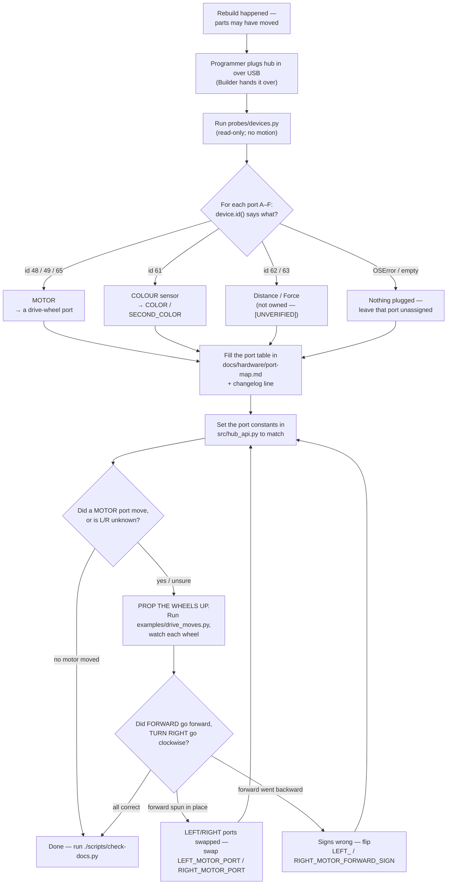

# Runbook — Identify hardware after a rebuild

> **When:** the START of any session where the robot may have been taken apart and put back together —
> which moves motors and colour sensors onto **different ports**. Also any time a port map surprise shows
> up mid-session (a reader returns `None`, or `PortMapIncomplete` is raised).
>
> **Owner:** **Programmer** runs the probes and edits the code (may plug/unplug); **Builder** operates the
> robot for the wheels-up drive check (the only authorised robot operator). Both watch the drive check.
>
> **What it does NOT do:** reinvent detection. It **orchestrates** the read-only probes that already
> exist and tells you which two files to update from what they print. It writes nothing to the hub.

The problem this solves: `device.id()` tells you *what kind* of device is on a port (motor vs colour), but
it **cannot tell LEFT from RIGHT** — both drive motors report the same id `48`. So a rebuild needs two
separate confirmations: the **port map** (discovered by the probe) and the **left/right + forward-sign
convention** (confirmed only by watching the wheels move). Skip the second and the robot will happily run,
exit 0, and drive the wrong way — the exact silent failure [../hardware/port-map.md](../hardware/port-map.md)
was written to prevent.

---

## Procedure



### Step 1 — Discover the port map (read-only, no motion)

Programmer, with the hub on USB:

```bash
python3 probes/devices.py
```

[../../probes/devices.py](../../probes/devices.py) scans **all** of A–F (it is already rebuild-aware — it
does not assume the old A/B-motor, C/D-colour wiring), prints `device.id()` per port, and reads encoders
and colour values without commanding any motion. If a port raises `OSError`, that **is** the answer: the
port is empty, not broken ([../hardware/port-map.md](../hardware/port-map.md) changelog, 2026-08-27).

- Want everything in one USB window (uptime, battery, IMU, full API surface) as well? Run
  [../../probes/harvest.py](../../probes/harvest.py) instead — it includes the same port scan and saves to
  `docs/findings/runs/`.
- Want a fast before/after diff while plugging one thing in? [../../probes/ports.py](../../probes/ports.py)
  `--watch`.

### Step 2 — Read the id per port and name what it is

Use the decision table below to turn each printed `device.id()` into a device and the config constant it
feeds. Whatever the hub reports is the answer — a recollection of "it was on C last time" is not.

### Step 3 — Update the two files that hold the port map

**a) [../hardware/port-map.md](../hardware/port-map.md)** — the single source of truth (scope TR-5). Update
the port-assignments table, set the *Physically confirmed* date, and **append a changelog line** (the
`Code updated?` column is not decoration — it is the checkbox that stops a silent break).

**b) [../../src/hub_api.py](../../src/hub_api.py)** — the only place in `src/` where the letters A–F appear.
Set the constants in the `if API == API_SPIKE3:` block (our hub is SPIKE 3 — write the port **object**,
`_port.C`, not the string `"C"`):

| Constant | Set to the port that holds… |
|---|---|
| `LEFT_MOTOR_PORT` | the **left** drive motor (confirm L/R in Step 4) |
| `RIGHT_MOTOR_PORT` | the **right** drive motor (confirm L/R in Step 4) |
| `COLOR_PORT` | the first (primary/low) colour sensor |
| `SECOND_COLOR_PORT` | the second colour sensor (we run **two**) |
| `DISTANCE_PORT` | a distance sensor if one is ever mounted; else `None` |

Leave any unused constant `None` — a reader that hits `None` fails loud (Step 5) instead of driving a
wrong port.

### Step 4 — Re-confirm LEFT/RIGHT and the forward-sign convention

**This is the step `device.id()` cannot do for you.** Both motors report id `48`, so the probe knows
*which ports are motors* but not *which wheel is left* or *which sign drives it forward*. The motors are
mounted **mirrored**, so robot-forward is a *negative* velocity on one motor and *positive* on the other
([drive checkpoint, 2026-09-01](../findings/drive-checkpoint-2026-09-01.md)). A rebuild can move a motor to
the other side or re-orient it, so both must be re-observed whenever a motor port changes.

**Prop the wheels off the desk** (hardware-safety: [../directives/hardware-safety.md](../directives/hardware-safety.md)
— a wheels-up test can't drive off), then run the four-move checkpoint:

```bash
./hub_programmer/run.py examples/drive_moves.py --seconds 40
```

[../../examples/drive_moves.py](../../examples/drive_moves.py) commands FORWARD / BACKWARD / TURN RIGHT /
TURN LEFT at low speed, prints the velocity each move commands and the encoder delta, and stops on any
exit. **Watch each wheel** and read off the result:

| What you see | What it means | Fix |
|---|---|---|
| FORWARD drives forward, TURN RIGHT goes clockwise | ports and signs correct | nothing — you are done |
| FORWARD **spins in place** | `LEFT_MOTOR_PORT` / `RIGHT_MOTOR_PORT` are swapped | swap those two in `hub_api.py` |
| FORWARD **goes backward** | both signs inverted | flip `LEFT_MOTOR_FORWARD_SIGN` **and** `RIGHT_MOTOR_FORWARD_SIGN` |
| one wheel drives, the other doesn't | that motor's port is wrong / loose | re-check Step 1 for that port |

The two sign constants live just below the port block in `hub_api.py`:

```python
LEFT_MOTOR_FORWARD_SIGN = -1
RIGHT_MOTOR_FORWARD_SIGN = +1
```

`hub_motors` applies them to **both** the drive command and the encoder reads, so everything downstream
(odometry, telemetry) sees forward-positive on both wheels. Getting them wrong is not cosmetic: the last
time they were unset, a forward move integrated to **zero** distance (the mirrored encoders cancelled) —
see the latent-bug section of the [drive checkpoint](../findings/drive-checkpoint-2026-09-01.md). If you
can't do a powered move, the low-tech substitute is turning each wheel **by hand** and watching the encoder
sign in `probes/devices.py` (left-forward read negative, right-forward positive on the current build).

Record the confirmation (date + who watched) in the port-map changelog.

### Step 5 — Trust the fail-loud guard, don't defeat it

You do **not** need to hunt down every place a port is used. Mission code reaches ports through
`hub_api._require(PORT, "name")`, which raises **`PortMapIncomplete`** the moment a needed port is still
`None` ([../../src/hub_api.py](../../src/hub_api.py); used in `hub_motors.drive()` / `read_motor_degrees()`
and `hub_color`). That is deliberate: a stale or half-filled port map **stops on the bench with a named
error**, rather than silently driving the wrong port during the demo. Leave unknown ports `None` and let
the guard do its job — never paper over it with a guessed value.

---

## Decision table — `device.id()` → what it is → which constant

| `device.id()` | Device (part no.) | Owned? | Feeds constant |
|---|---|---|---|
| **48** | Technic Medium Angular Motor 45603 | **yes ×2** | `LEFT_MOTOR_PORT` **or** `RIGHT_MOTOR_PORT` — Step 4 decides which |
| **49** | Technic Large Angular Motor 45602 | no | a drive-motor port (same L/R caveat) |
| **65** | Technic Small Angular Motor 45607 | no | a drive-motor port (same L/R caveat) |
| **61** | Colour Sensor 45605 | **yes ×2** | `COLOR_PORT` (first) / `SECOND_COLOR_PORT` (second) |
| **62** | Distance Sensor 45604 | no · **[UNVERIFIED on our hub]** | `DISTANCE_PORT` |
| **63** | Force Sensor 45606 | no · **[UNVERIFIED on our hub]** | (no constant yet — add one only if bought) |
| **OSError / empty** | nothing plugged in | — | leave that port out; keep its constant `None` |

Ids 48/49/61/65 were **read on our own hub**; 62/63 come from the LEGO + community registry
([../research/spike3-api-reference.md](../research/spike3-api-reference.md) § device ids) and are
**[UNVERIFIED on our hub]** because we own no distance or force sensor to plug in. The current build is
**A/B motors (id 48), C/D colour (id 61), E/F empty** — [hub API surface, 2026-09-01](../findings/hub-api-surface-2026-09-01.md).

## After editing

Run the repo check and fix anything it flags in the files you touched:

```bash
./scripts/check-docs.py
```

It re-imports every `src/` module on the host, so a typo in `hub_api.py` (e.g. a stray `port.G`) is caught
before the hub is ever touched again ([../directives/automation-first.md](../directives/automation-first.md)).
Then tell the Programmer the map changed — a port change the code does not know about is the classic silent
failure.
