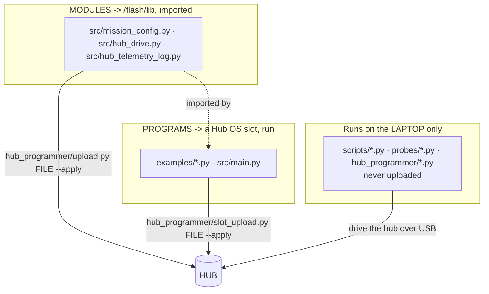

# Runbook — modules vs programs vs host tools, and how each reaches the hub

Every Python file in this repo is exactly one of **three** kinds. Confusing them is the most common
way to waste a class period, because each kind reaches the hub — or does not — by a different route.



## The three kinds

| Kind | Lives in | Reaches the hub by | Runs when |
|---|---|---|---|
| **Module** (library) | `src/hub_*.py`, `src/mission_config.py` | `hub_programmer/upload.py FILE --apply` → `/flash/lib` | never on its own — a program `import`s it |
| **Program** | `examples/*.py`, `src/main.py` | `hub_programmer/slot_upload.py FILE --apply` → a Hub OS slot | when the operator taps a button |
| **Host tool** | `scripts/`, `probes/`, `hub_programmer/` | never — it stays on the laptop | when you run it on the laptop |

**The tell:** a module defines things and moves no motors by itself. A program has a `main()` and
does something. A host tool talks *to* the hub over USB.

## Worked example — the skid-steer layer

| File | Kind | What it is |
|---|---|---|
| [`src/hub_drive.py`](../../src/hub_drive.py) | **Module** | The skid-steer layer: `forward_mms` · `backward_mms` · `spin_left` · `spin_right` · `arc(speed, radius)` · `turn_by`, plus the mm↔degree geometry. **Owns what left, right, forward and back MEAN** — two constants, `FORWARD_SIGN` and `TURN_SIGN`, each with its measurement beside it. |
| [`src/mission_config.py`](../../src/mission_config.py) | **Module** | Every tunable, including the MEASURED wheel diameter and track width. `hub_drive` imports its geometry from here so the numbers exist in **one** place. |
| [`examples/calibrate_directions.py`](../../examples/calibrate_directions.py) | **Program** | Drives each primitive in turn and logs the encoder and yaw deltas, so the operator can *watch* and confirm each move matches its name. This is what **sets** the two constants above. |
| [`examples/follow_tape.py`](../../examples/follow_tape.py) | **Program** | Follows the blue tape and counts corners. Consumes the module; does not re-derive signs. |

So: **the module is the skid-steer code; the calibration is the experiment that tells the module the
truth.** They are deliberately separate — the experiment runs rarely, the module is imported always.

## Why modularity matters here specifically

Direction was got wrong **three times on 2026-09-08**, each time by inferring a sign from another
program's convention rather than measuring it — once flipping a drive to backward and back, once
inverting a heading hold so the robot circled for a whole 40-second run, once turning away from a
corner "into the void". Encoder signs and yaw signs are **conventions, not directions**; only a human
watching the robot can say which way it physically went.

With the mapping in one module, a wrong sign is **one edit**. Copied into five programs, it is five
edits and four of them get forgotten.

## The dependency rule

A program can only import a module that is **already on the hub**. Two ways to satisfy that:

```bash
# explicit: upload each module first, then the program
./hub_programmer/upload.py src/mission_config.py --apply
./hub_programmer/upload.py src/hub_drive.py --apply
./hub_programmer/slot_upload.py examples/calibrate_directions.py --apply

# automatic: resolve a program's src/ imports with ast, upload each, then the program
./hub_programmer/deploy_deps.py examples/calibrate_directions.py --apply
```

Both are **dry-run by default** — nothing is written without `--apply`, and `slot_upload.py` reads
and compares the hub's device UUID before a single byte goes out.

⚠ **`upload.py` uses the REPL, which kills the Hub OS.** So after uploading modules you must
**power-cycle the hub** before `slot_upload.py` will work. Do all module uploads together, then
power-cycle once. See
[colour-survey-and-first-detection § 7](../findings/colour-survey-and-first-detection-2026-09-08.md).

## The naming rule, and why the module is not called `skidsteer.py`

Inside `src/`, **only `hub_*.py` may import the LEGO API** ([ADR-0004](../decisions/0004-flat-src-supersedes-package-split.md)),
and `./scripts/check-docs.py` enforces it. A file called `skidsteer.py` that called `motor.run()`
would fail that check. The prefix is not decoration — it is how the purity boundary is machine-checked,
so the skid-steer layer is `hub_drive.py`.

Everything else in `src/` is **pure**: it imports on the laptop with no robot attached, which is what
lets `check-docs.py` verify the whole package on every run.
