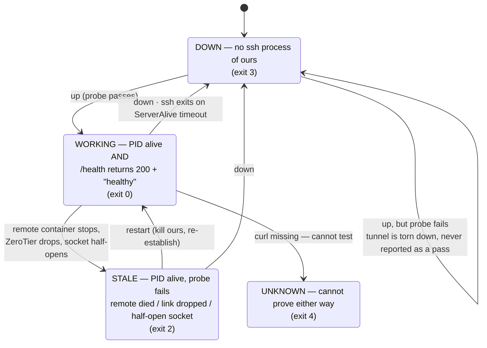

# Runbook — ResearchHub tunnel and paper fetching

**When to run this:** only when the literature workflow is actually needed — a real literature review
for the Intro Report, or a search the local `grep`-first order
([../plans/2026-08-25-docs-rag-and-literature-workflow.md](../plans/2026-08-25-docs-rag-and-literature-workflow.md))
could not answer. **Demo Day work comes first.** Nothing here is required to build the robot.

**Touches the LEGO hub:** no. Network only. **Touches pwnstar:** read-only, always.

**Owner:** Programmer (this is tooling, not a supplies or robot-operation task).

---

## Summary

| Thing | State | How we know |
|---|---|---|
| pwnstar `10.231.80.91` reachable over ZeroTier | **VERIFIED reachable, but FLAKY** | ping + `nc -z 22`, 2026-08-25 |
| SSH login | **VERIFIED** — `devel@10.231.80.91`, key `~/.ssh/id_git` | `ssh -i ~/.ssh/id_git devel@10.231.80.91 'echo OK:$(hostname); echo WHOAMI:$(whoami)'` → `OK:pwnstar` / `WHOAMI:devel` (re-run independently 2026-08-25) |
| ResearchHub port on pwnstar | **VERIFIED = 5347** — discovered, not guessed | container `researchhub-api` publishes `0.0.0.0:5347->8000/tcp`; `/health` → `{"status":"healthy",…}` |
| `/api/discover/search` returns real results | **VERIFIED through the tunnel** | see [Fetching papers](#fetching-papers) |
| `/api/integration/kb/search` | **BROKEN server-side, 2026-08-25** | HTTP 500, `'HybridSearcher' object has no attribute 'search'` — a pwnstar problem, not ours. Do not "fix" it; it is not our machine |
| Whether ResearchHub's corpus holds anything on sweep/coverage/color sensing | **UNVERIFIED** | never asked it a project question |
| Whether the tunnel survives long idle periods | **UNVERIFIED** | only exercised over minutes |

---

## Quick reference

```
./scripts/rh-tunnel.sh discover   # find + cache the remote port (once)
./scripts/rh-tunnel.sh up         # establish the forward (idempotent; repairs a stale one)
./scripts/rh-tunnel.sh status     # WORKING / STALE / DOWN / UNKNOWN
./scripts/rh-tunnel.sh restart    # tear down + re-establish
./scripts/rh-tunnel.sh down       # kill ONLY our ssh process
```

Exit codes — `status` is scriptable: `0` WORKING · `2` STALE · `3` DOWN · `4` UNKNOWN · `64` usage.
**Only `0` means the tunnel works.**

---

## 1. Bring it up

```
cd ~/sys301_minesweeper
./scripts/rh-tunnel.sh up
```

Expected output (real, captured 2026-08-25):

```
ssh -f -N -L 5347:localhost:5347 devel@10.231.80.91
STATUS: WORKING — http://127.0.0.1:5347 -> 10.231.80.91:5347 (pid 364933)
```

Then ResearchHub is at `http://127.0.0.1:5347` — Swagger UI at `/docs`.

If local 5347 is busy the script bumps to 5348, 5349, … and says so. The port actually in use is the
first field of `scripts/.rh-tunnel.local`:

```
P=$(cut -d' ' -f1 scripts/.rh-tunnel.local)
```

Prerequisites, all already true on this host as of 2026-08-25:

- `zerotier-one.service` **active**, this host on network `166359304ed02071` (`nrglab-first-network`)
  as `10.231.80.161/24` via interface `zteywyseb7`. If ZeroTier is down, nothing here works.
- `~/.ssh/id_git` readable and **not passphrase-protected** (the script uses `BatchMode=yes`, so it
  fails fast rather than hanging on a prompt).
- The login is `devel`. `root`, `kalel`, `operator`, `ubuntu` were all tried and rejected.

Overridable by environment: `RH_SSH_HOST` `RH_SSH_USER` `RH_SSH_KEY` `RH_LOCAL_PORT` `RH_HEALTH_PATH`.

## 2. Check it — and why "the ssh process is running" is not a check

`status` makes a **real HTTP request through the local port** and asserts a known-correct response
(HTTP 200 **and** a body containing `"status":"healthy"`). A TCP connection being accepted is not
enough — a forward to the wrong remote port accepts connections all day and serves nothing usable.
This was demonstrated, not assumed: a decoy forward to the remote Redis port accepted TCP
(`nc -z` succeeded) while the ssh PID was alive, and `status` still correctly said:

```
STATUS: STALE — pid 363351 is alive but nothing usable answers on 127.0.0.1:15348. Repair: ./scripts/rh-tunnel.sh restart
STALE
```



## 3. Repair a stale tunnel

```
./scripts/rh-tunnel.sh restart
```

`restart` = `down` + `up`. `down` kills **only** the PID in `scripts/.rh-tunnel.pid`, and only after
re-reading `/proc/<pid>/cmdline` to confirm it is still an `ssh` whose argv contains our exact
`-L <local>:localhost:<remote>` and `devel@10.231.80.91`.

> **Never `pkill ssh` on this host.** The operator has their own SSH sessions open; a blanket kill
> takes those down with it. If the tracked PID is gone or has been reused, the script says so and
> **leaves the process alone** rather than guessing.

**Expect to need this.** The ZeroTier link to pwnstar was measurably flaky during the one hour it was
exercised on 2026-08-25: one `ping` run lost 1 of 2 packets, one `curl` returned `No route to host`,
one `ssh` returned `connect … port 22: Connection timed out`, and one backgrounded `ssh -f` exited on
its own between two consecutive commands. `ServerAliveInterval=15` / `ServerAliveCountMax=3` mean a
dead link kills the ssh process within ~45 s instead of leaving it wedged — so the usual observed
state after a drop is **DOWN**, and **STALE** is the subtler case the probe exists to catch.

## 4. Discovering the port (already done — here is how, for when it changes)

The port was **not** guessed. `discover` SSHes in read-only and:

1. runs `docker ps`, keeps containers matching `/researchhub/i`, and extracts every **published**
   host port (`0.0.0.0:5347->8000/tcp` → candidate `5347`);
2. runs `ss -tlnH` and intersects the listening ports with a plausible-port list;
3. **probes each candidate from pwnstar itself** (`curl 127.0.0.1:<cand>/health`) and accepts only the
   one that returns the known-correct ResearchHub health response;
4. caches the winner in `scripts/.rh-port` (gitignored). `discover --force` re-runs it.

Real output, 2026-08-25:

```
candidate remote ports: 5347 10100 7474 7687
  probing remote 127.0.0.1:5347/health ...
  MATCH: port 5347 answered /health with {"status":"healthy","timestamp":"2026-08-25T18:00:40.782021"}
```

**If no candidate matches, the script exits UNKNOWN and refuses to invent a port.** Inspect by hand
(`ssh devel@10.231.80.91 'docker ps; ss -tlnp'`) and then `echo <port> > scripts/.rh-port`.

> **Do not confuse the two.** `researchhub-api` (image `docker-researchhub:latest`, port **5347**) is
> ResearchHub. `docs-rag-researchhub-frontend-1` (image `rag-bootstrap-frontend:0.7.8`, port `10100`)
> is a *rag-bootstrap knowledge base about ResearchHub's own docs* — a different product, and not
> what we want. pwnstar also runs `cars-demo-13`, `engineer360`, `palletai` and others: **touch none
> of them.** Every command this runbook issues on pwnstar is read-only.

---

## Fetching papers

`scripts/fetch_paper.py` implements the convention already set in
[../plans/2026-08-25-docs-rag-and-literature-workflow.md](../plans/2026-08-25-docs-rag-and-literature-workflow.md):
PDF into `docs/research/papers/` as `<firstauthor><year>-<short-topic>.pdf`, a `.txt` sidecar next to
it so `grep` works, and a citation stub appended to `docs/research/papers/bibliography.md`.
Stdlib only, no pip installs.

```
./scripts/fetch_paper.py 1708.03055 --topic coverage-path-planning     # arXiv id
./scripts/fetch_paper.py 10.1177/0278364919882082 --topic persistent-coverage   # DOI — paywalled: prints the citation, exits 1
./scripts/fetch_paper.py https://example.org/open-access.pdf --name choset2001-coverage-survey
```

Verified output, 2026-08-25 (run against a scratch copy of the repo, so nothing was filed into
`docs/` yet):

```
saved docs/research/papers/manerikar2017-coverage-path-planning.pdf (948944 bytes)
sidecar: docs/research/papers/manerikar2017-coverage-path-planning.txt (29777 bytes)
citation appended to docs/research/papers/bibliography.md
```

Behaviour worth knowing:

- **It refuses non-PDFs.** The download is checked for a `%PDF` magic number, not just HTTP 200 — a
  paywall page returns 200 with HTML, and that must never be filed as a paper. Nothing is saved.
  Reproduce it against ResearchHub's own Swagger page, which returns 200 + HTML
  (`./scripts/fetch_paper.py http://127.0.0.1:5347/docs --name decoy-html`, captured 2026-08-25):

  ```
  ERROR: that URL did not return a PDF (1014 bytes, starts '     <!DOCTYPE html>     <html>     <head>  …'). Nothing was saved. Likely a paywall or a landing page.
  ```
- **A paywalled DOI still prints the resolved citation** (authors/year/title/venue) so you can go find
  an open-access copy, then re-run with the PDF URL and `--name`. Crossref usually *does* advertise a
  publisher PDF link that then 403s, so the citation is printed on the download-failure path too — not
  only when no link is offered. Real capture, 2026-08-25:

  ```
  $ ./scripts/fetch_paper.py 10.1177/0278364919882082 --topic persistent-coverage
  downloading https://journals.sagepub.com/doi/pdf/10.1177/0278364919882082
  resolved metadata:
    authors: ['José Manuel Palacios-Gasós', 'Danilo Tardioli', 'Eduardo Montijano', 'Carlos Sagüés']
    year: 2019
    title: Equitable persistent coverage of non-convex environments with graph-based planning
    venue: The International Journal of Robotics Research
    source: https://doi.org/10.1177/0278364919882082
  ERROR: download failed: HTTP Error 403: Forbidden. If this is a paywall, find the open-access PDF and re-run with its URL and --name.
  ```

  The open-access route for this one is the arXiv preprint the ResearchHub search already handed us:
  `./scripts/fetch_paper.py 2401.13614 --topic persistent-coverage` (verified: 6057395-byte PDF,
  82855-byte sidecar, exit 0).
- **`pdftotext` is installed here** (`/usr/bin/pdftotext`, verified). If it ever is not, the PDF is
  still saved, a loud WARN explains that the paper is not greppable, and the script **exits 3** rather
  than pretending success. Fix: `sudo apt install poppler-utils`, then re-run.
- **Idempotent.** Re-running skips an existing PDF (`--force` re-downloads) and never appends a
  duplicate citation.
- Exit codes: `0` ok · `1` error · `3` PDF saved but no sidecar.

### Gitignore

`scripts/fetch_paper.py` writes `docs/research/papers/.gitignore` containing `*.pdf` the first time it
runs, so the PDFs stay out of the repo (copyright + size) while the `.txt` sidecars and
`bibliography.md` are tracked — exactly the split the plan calls for. `scripts/.gitignore` covers the
tunnel's local state (`.rh-port`, `.rh-tunnel.pid`, `.rh-tunnel.local`). **No change to the root
`.gitignore` is needed**; nested `.gitignore` files are honoured by git and keep the rule next to the
thing it governs.

### First real fetch — one manual step

`docs/research/papers/` does not exist yet; the first run creates it, along with a **tracked**
`bibliography.md`. Every docs folder carries an `INDEX.md`
([../directives/documentation-discipline.md](../directives/documentation-discipline.md)), so the first
time you file a paper, add a row for `papers/bibliography.md` to
[../research/INDEX.md](../research/INDEX.md). The script deliberately does not edit an INDEX itself.

### The two tools compose

`/api/discover/search` on ResearchHub returns `arxiv_id` fields that feed straight into the fetcher.
Verified end-to-end through the tunnel, 2026-08-25:

```
$ ./scripts/rh-tunnel.sh up
$ curl -s "http://127.0.0.1:5347/api/discover/search?q=coverage+path+planning&limit=2"
{"query":"coverage path planning","total_found":3,"new_papers":3,"imported":0,"papers":[
 {"title":"Equitable Persistent Coverage of Non-Convex Environments with Graph-Based Planning",
  "year":2024,"authors":["José Manuel Palacios-Gasós","Danilo Tardioli","Eduardo Montijano"],
  "doi":"https://doi.org/10.1177/0278364919882082","arxiv_id":"2401.13614", ...
$ ./scripts/fetch_paper.py 2401.13614 --topic persistent-coverage
$ ./scripts/rh-tunnel.sh down
```

Note the query parameter is `q`, not `query` (`query` returns HTTP 422).

**Take the tunnel down when you are finished.** It costs one ssh process, but this host runs tight on
memory and leaving forwards to a flaky link lying around is how STALE happens in the first place.

---

## Still UNVERIFIED — do not write these up as fact

- Whether ResearchHub's indexed corpus contains anything useful about **our** problem (downward color
  sensing, boustrophedon sweeps on a small LEGO platform). One generic search was run to prove the
  pipe carries data; no project question has been asked of it.
- Whether any endpoint beyond `/health`, `/`, and `/api/discover/search` works. `/api/auth/login`
  exists, so some endpoints may need a token we do not have. `/api/integration/kb/search` is
  currently returning HTTP 500 from a server-side bug on pwnstar.
- Long-term tunnel stability. Exercised over minutes, not hours.

**Independently re-verified 2026-08-25 18:09–18:20** by a second agent that re-ran every load-bearing
claim rather than trusting this file: `discover --force` (same four candidates, same MATCH on 5347),
`up` / `status` / `restart` / `down`, `/health`, `/api/discover/search?q=…` (same two papers,
`total_found:3`), `?query=` → 422, `/api/integration/kb/search` → 500 `'HybridSearcher' object has no
attribute 'search'`, and `fetch_paper.py 1708.03055` (byte-identical 948944-byte PDF, 29777-byte
sidecar). Two safety properties were tested by deliberately breaking them: a decoy forward to the
remote Redis port made `nc -z` succeed while `status` still returned **STALE**/exit 2, and a foreign
PID planted in `.rh-tunnel.pid` was **left alive** by `down`. The link dropped once mid-verification
and `status` correctly said **DOWN**, not WORKING. Two defects were found and fixed — see the paywalled
-DOI note above and the SSH-login evidence cell.

**Sources:** direct measurement on this host and read-only commands on pwnstar, 2026-08-25 17:55–18:06
local · [../plans/2026-08-25-docs-rag-and-literature-workflow.md](../plans/2026-08-25-docs-rag-and-literature-workflow.md)
· [../directives/honest-instrumentation.md](../directives/honest-instrumentation.md)
· [../directives/automation-first.md](../directives/automation-first.md)

---

## Querying: use `rh-query.sh`, not raw curl

**The problem it solves.** An empty result from a dead tunnel looks exactly like an empty result from a
healthy corpus, and both look like ResearchHub being down for maintenance. Three different faults, three
different fixes, one indistinguishable symptom — so every query runs a preflight first.

```bash
./scripts/rh-query.sh "coverage path planning"     # search; repairs a stale tunnel automatically
./scripts/rh-query.sh --check                      # preflight only, no query
./scripts/rh-query.sh --json "gyro drift"          # raw JSON instead of the titles view
./scripts/rh-query.sh --no-repair "..."            # fail instead of auto-repairing
```

**Exit codes name the fault, so you fix the right thing:**

| Code | Meaning | What to do |
|---|---|---|
| `0` | OK | — |
| `3` | `TUNNEL_DOWN` — not up, and a repair attempt failed | Check ZeroTier and `~/.ssh/id_git`; is pwnstar up? |
| `4` | `REMOTE_UNHEALTHY` — tunnel is fine, **ResearchHub is not** | It is down or mid-update on pwnstar. Wait and retry. **Do not touch the tunnel** |
| `5` | `QUERY_FAILED` — preflight passed, the request or its response failed | Check the endpoint and parameters |

**Verified 2026-08-25**, each path exercised rather than assumed:

- Healthy → `--check` exits 0, a real query returned 11 papers on odometry calibration.
- **Tunnel killed with `kill -9` behind the script's back**, then a query run: preflight reported
  `tunnel not WORKING — repairing once`, repaired it, and the query returned 9 papers. **Exit 0.**
- Tunnel killed again with `--no-repair`: `PREFLIGHT: FAILED`, **exit 3**. No false success.

The health preflight asserts the known-correct payload (`"status":"healthy"`), not merely that something
answered — a 200 with a degraded body is still `REMOTE_UNHEALTHY`. The local port is read from
`.rh-tunnel.local`, which stores `"<local> <remote>"`; only the first field is the local port, and it is
regex-validated before use.
