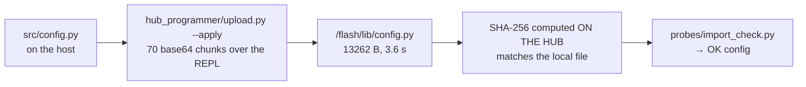

# Runbook — Getting code onto the SPIKE Prime

> # ⚠ SUPERSEDED IN PRACTICE — use [deploy-to-hub.md](./deploy-to-hub.md)
>
> **The old header here said "Status: NOT YET PERFORMED. The hub has never been connected." That is
> false as of 2026-08-27.** The hub was connected over USB, and code was put on it — by a route this
> file does not describe.
>
> **What actually works, proven 2026-08-27:** base64 chunks over the MicroPython REPL on `/dev/spike`
> into **`/flash/lib`**, verified by a **SHA-256 the hub computes on itself**, then an import check.
> `src/config.py` went up in 3.6 s — 13262 bytes, 70 chunks, hash `05a3efef…828a` matched, then
> `OK config`. **No LEGO app, no `mpy-cross`, no GCC, no Windows.** Procedure:
> [deploy-to-hub.md](./deploy-to-hub.md). Decision:
> [ADR-0007](../decisions/0007-deploy-by-writing-modules-to-flash-lib.md).
>
> **This file is kept for its Windows half and its background reasoning**, both of which
> `deploy-to-hub.md` deliberately does not carry. Everything in it about **slots** is unverified — see
> the correction under "The one-line answer" immediately below.
>
> Covers **Linux and Windows**, because the Programmer is on Ubuntu and teammates may not be.
> Governing rules: [../directives/hardware-safety.md](../directives/hardware-safety.md).

## The one-line answer

**You cannot `pip install` anything onto the hub.** It runs LEGO's own MicroPython. That part is
confirmed: `sys.path` on our hub is `['', '.frozen', '/flash', '/flash/lib']`, and the hub runs
MicroPython **source** — no compiler in the loop (`mpy-cross` exists and is optional;
`sys.implementation._mpy = 7942`).

### ⚠ The 20-slot model below is NOT what we measured

> **`[UNVERIFIED]` as of 2026-08-27 — and the one piece of evidence we have points the other way.**
> `/flash/program` on our hub is **empty**. Nothing resembling 20 numbered slots was observed. The slot
> model comes from [../research/spike-prime-linux-toolchain.md](../research/spike-prime-linux-toolchain.md)
> and from how the LEGO app presents things; it may well describe an abstraction the app maintains
> rather than a filesystem layout. **Do not plan around it.**
>
> **What is measured:** `/flash/lib` is on `sys.path`, a module written there imports (`OK config`), and
> `/flash/main.py` exists as an empty 34-byte stock file. **Whether `/flash/main.py` autoruns at boot —
> which is what "runs it standalone, no laptop attached" actually requires — is UNTESTED** (KU-M16).
> The claim in the diagram below is therefore the *goal*, not an observed behaviour.

The model this file was written around, kept for reference and clearly marked:


The route that **is** proven, for comparison:



**No system packages, no pip, no virtualenv on the hub.** `src/` is written to the MicroPython subset for
exactly this reason ([../directives/code-discipline.md](../directives/code-discipline.md)).

---

## 0. Before you plug anything in

**Do not open the LEGO SPIKE app or `spike.legoeducation.com` yet.** If the app's version and the hub's
Hub OS disagree it will demand an update, LEGO states that notification cannot be disabled, and a Hub OS
change is an operator decision recorded as an ADR — never a click
([ADR-0001](../decisions/0001-stock-lego-firmware-only.md)).

Identify the hub read-only first: [hub-identification.md](./hub-identification.md).

---

## 1. Is the hub even connected?

Same command on every platform:

```bash
./find_spike_prime.py            # one line: READY / NOT FOUND / BUSY / NO ACCESS
./find_spike_prime.py --verbose  # what it found and what to do about it
```

It looks for USB vendor `0x0694`, product `0x0009`, opens the port briefly to prove permissions, and
closes it. **It never sends anything and never waits for a reply.** Exit codes: `0` ready, `1` not found,
`2` busy, `3` no access, `4` pyserial missing.

On Windows use `python find_spike_prime.py` if the shebang is not honoured.

### If it says NOT FOUND

| | |
|---|---|
| **Both** | Is the hub on? Hold the centre button. **Try a different cable — many LEGO USB cables are charge-only** and produce no port at all. |
| **Linux** | `dmesg \| tail -20` — look for `cdc_acm ... ttyACM0` |
| **Windows** | Device Manager → *Ports (COM & LPT)*. A warning triangle means the driver is missing; installing the LEGO SPIKE app once provides it — then **close the app without letting it touch the hub** |

### If it says BUSY or NO ACCESS

**Linux — one-time host setup** ([../findings/host-environment.md](../findings/host-environment.md)):

```bash
sudo usermod -aG dialout $USER      # then log out and back in — NOT sudo as a workaround
sudo systemctl disable --now ModemManager
sudo fuser -v /dev/ttyACM0          # who is holding it?
screen -ls                          # a detached screen keeps the port open
```

⚠ **ModemManager is active on this machine** and will probe the hub with AT commands, corrupting the
first session. Clear it *before* first contact, or it looks like broken hardware.

**Windows:** close the LEGO SPIKE app, any VS Code serial monitor, and PuTTY. Unplug/replug if it persists.

---

## 2. Push a program into a slot — the primary path

**VS Code extension `PeterStaev.lego-spikeprime-mindstorms-vscode`** (v3.1.3, Apache-2.0, actively
maintained as of 2025-08-29). It speaks USB serial at 115200 and works on **Linux and Windows alike** —
the same extension, the same buttons.

```bash
code --install-extension PeterStaev.lego-spikeprime-mindstorms-vscode
```

⚠ **Version depends on the Hub OS**, which we have not identified: **v2.x+ is Hub OS 3 only**; for a
Hub OS 2 hub you need **v1.x**. Run [hub-identification.md](./hub-identification.md) first.

Put this as the **first line** of the program so the extension skips its prompts:

```python
# LEGO slot:5 autostart
```

Then: click the status-bar item to connect → use the upload/run buttons. `print()` output comes back in
the extension's output channel.

## 3. Run it standalone on the robot

Once the file is in a slot: **unplug the USB cable**, use the hub's left/right buttons to select the slot,
press centre to run. This is how Demo Day works — scope **TR-3** exists so the demo never depends on a
laptop.

---

## Fallback paths

| Path | When | Notes |
|---|---|---|
| **Raw MicroPython REPL** (`tio`/`screen`/`pyserial`) | Always keep this | Works on Hub OS 2 **and** 3. Ground truth for debugging and version probing. No file management — you cannot upload a program this way, only run statements |
| **SPremote** (`jeflem/spremote`) | Host-driven development | Your algorithm runs on the laptop, hub is a peripheral. Good for experimenting, **useless for an untethered demo** |
| **LEGO SPIKE Web App** in Chrome | Emergency only | ⚠ **Will demand a Hub OS update if versions mismatch.** Not a dev loop |

**Never Pybricks** — it replaces the hub's firmware. Permanently blacklisted
([ADR-0001](../decisions/0001-stock-lego-firmware-only.md)).

Tools targeting Hub OS 2 only (`spikejsonrpc`, `lego-hub-tk`, `spike-tools`) are abandoned — 2022 or
earlier. Relevant *only* if the hub turns out to be Hub OS 2.

---

## What we still do not know

- **Which Hub OS**, which decides the extension version and the whole API generation.
- Whether the extension's Linux USB path works on this machine (**UNVERIFIED**).
- How our multi-file `src/` maps onto the one-file-per-slot model. The extension advertises a multi-file
  preprocessor; whether it suits us is untested. **Worst case we concatenate modules into one slot file** —
  which is part of why `src/` is flat and importable by plain name
  ([ADR-0004](../decisions/0004-flat-src-supersedes-package-split.md)).

Fill these in the first time this runbook is run, and correct anything here that proves wrong.
